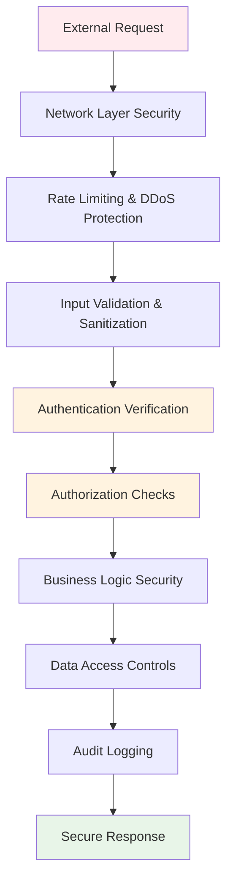

# 🛡️ Advanced Security Considerations

*Enterprise-grade security patterns for production FastAPI applications*

Building secure APIs requires a multi-layered approach that goes beyond basic input validation. This section covers advanced security patterns, threat modeling, and enterprise-grade protection strategies.

## 🎯 Security Architecture Overview

> 💡 **Think of API security like a medieval castle**: You need multiple defensive layers - the moat (network security), walls (input validation), guards (authentication), and internal checkpoints (authorization) - working together to protect the kingdom (your data).



## 🔒 Advanced Input Validation & Attack Prevention

### 🛡️ Comprehensive Validation Framework

This implementation demonstrates enterprise-grade input validation that prevents multiple attack vectors while maintaining usability:

```python
from fastapi import FastAPI, HTTPException, Query, Body
from pydantic import BaseModel, Field, validator, EmailStr
from typing import Optional, List, Dict, Pattern
import re
import html
from urllib.parse import urlparse
import bleach

class SecureUserInput(BaseModel):
    """
    🛡️ Enterprise-grade secure user input model
    
    Security Features:
    - Multi-layer validation (format, length, content)
    - XSS prevention through sanitization
    - SQL injection prevention via parameterization
    - Business rule enforcement
    - Data integrity checks
    """
    
    username: str = Field(
        ..., 
        min_length=3, 
        max_length=30,
        regex=r"^[a-zA-Z0-9_-]+$",  # Prevents injection via allowed characters
        description="Username: alphanumeric, underscore, hyphen only"
    )
    
    email: EmailStr = Field(..., description="Valid email address")  # Built-in email validation
    
    password: str = Field(
        ...,
        min_length=8,
        max_length=128,  # Prevents DoS via extremely long passwords
        description="Password: minimum 8 characters with complexity requirements"
    )
    
    full_name: str = Field(
        ...,
        min_length=1,
        max_length=100,
        description="Full name"
    )
    
    website: Optional[str] = Field(
        None,
        max_length=200,
        description="Website URL"
    )
    
    bio: Optional[str] = Field(
        None,
        max_length=500,
        description="User biography"
    )
    
    age: Optional[int] = Field(
        None,
        ge=13,
        le=120,
        description="Age: 13-120"
    )
    
    tags: List[str] = Field(
        default=[],
        max_items=10,
        description="User tags"
    )
    
    metadata: Optional[Dict[str, str]] = Field(
        None,
        description="Additional metadata"
    )
    
    @validator('password')
    def validate_password_strength(cls, v):
        """
        🔒 Advanced password strength validation
        
        Checks for:
        - Character complexity (uppercase, lowercase, digits, symbols)
        - Common weak patterns and dictionary words
        - Repeated character sequences
        - Keyboard patterns (qwerty, 123456)
        """
        if not re.search(r'[A-Z]', v):
            raise ValueError('Password must contain at least one uppercase letter')
        if not re.search(r'[a-z]', v):
            raise ValueError('Password must contain at least one lowercase letter')
        if not re.search(r'[0-9]', v):
            raise ValueError('Password must contain at least one digit')
        if not re.search(r'[!@#$%^&*(),.?":{}|<>]', v):
            raise ValueError('Password must contain at least one special character')
        
        # 🚫 Check for common weak patterns
        weak_patterns = [
            r'123456', r'password', r'qwerty', r'admin',
            r'(.)\1{2,}',  # Repeated characters (aaa, 111)
            r'abc', r'xyz',  # Sequential patterns
        ]
        for pattern in weak_patterns:
            if re.search(pattern, v.lower()):
                raise ValueError('Password contains weak patterns')
        
        return v
    
    @validator('full_name')
    def sanitize_full_name(cls, v):
        """Sanitize full name to prevent XSS"""
        if not v:
            return v
        
        # Remove HTML tags and escape special characters
        sanitized = html.escape(v.strip())
        
        # Only allow letters, spaces, apostrophes, and hyphens
        if not re.match(r"^[a-zA-Z\s'\-\.]+$", sanitized):
            raise ValueError('Full name contains invalid characters')
        
        return sanitized
    
    @validator('website')
    def validate_website_url(cls, v):
        """Validate and sanitize website URL"""
        if not v:
            return v
        
        try:
            parsed = urlparse(v)
            
            # Ensure scheme is http or https
            if parsed.scheme not in ['http', 'https']:
                raise ValueError('Website URL must use http or https')
            
            # Basic domain validation
            if not parsed.netloc:
                raise ValueError('Invalid website URL')
            
            # Prevent localhost and private IPs in production
            forbidden_domains = ['localhost', '127.0.0.1', '0.0.0.0']
            if any(domain in parsed.netloc.lower() for domain in forbidden_domains):
                raise ValueError('Local URLs not allowed')
            
            return v
        except Exception:
            raise ValueError('Invalid website URL format')
    
    @validator('bio')
    def sanitize_bio(cls, v):
        """Sanitize bio content"""
        if not v:
            return v
        
        # Allow basic HTML tags but sanitize
        allowed_tags = ['b', 'i', 'em', 'strong', 'a', 'br']
        allowed_attributes = {'a': ['href']}
        
        sanitized = bleach.clean(
            v,
            tags=allowed_tags,
            attributes=allowed_attributes,
            strip=True
        )
        
        return sanitized.strip()
    
    @validator('tags')
    def validate_tags(cls, v):
        """Validate and sanitize tags"""
        if not v:
            return []
        
        sanitized_tags = []
        for tag in v:
            # Clean and validate each tag
            clean_tag = re.sub(r'[^a-zA-Z0-9_-]', '', tag.strip().lower())
            if len(clean_tag) >= 2 and len(clean_tag) <= 20:
                sanitized_tags.append(clean_tag)
        
        # Remove duplicates while preserving order
        return list(dict.fromkeys(sanitized_tags))
    
    @validator('metadata')
    def validate_metadata(cls, v):
        """Validate metadata dictionary"""
        if not v:
            return {}
        
        # Limit number of metadata fields
        if len(v) > 10:
            raise ValueError('Too many metadata fields (max 10)')
        
        validated_metadata = {}
        for key, value in v.items():
            # Validate keys
            if not re.match(r'^[a-zA-Z0-9_-]+$', key) or len(key) > 50:
                raise ValueError(f'Invalid metadata key: {key}. Keys must be alphanumeric, underscore, or hyphen, and max 50 chars.')
            
            # Validate values (e.g., ensure they are strings and within a certain length)
            if not isinstance(value, str) or len(value) > 255:
                raise ValueError(f'Invalid metadata value for key "{key}". Values must be strings and max 255 chars.')
            
            validated_metadata[key] = html.escape(value.strip()) # Sanitize and store
        
        return validated_metadata

```

### 🎯 Security Validation Patterns Summary

| Validation Type | Attack Prevention | Implementation |
|----------------|-------------------|----------------|
| **Regex Patterns** | Injection attacks | `regex=r"^[a-zA-Z0-9_-]+$"` |
| **Length Limits** | Buffer overflow/DoS | `min_length=3, max_length=30` |
| **Content Sanitization** | XSS attacks | `html.escape()`, `bleach.clean()` |
| **URL Validation** | SSRF attacks | `urlparse()` + domain checking |
| **Business Rules** | Logic vulnerabilities | Custom validators |

## 🔐 Advanced Authentication Security

### 🛡️ Multi-Factor Authentication Implementation

> 💡 **MFA is like a bank vault**: Even if someone has your key (password), they still need the time-locked combination (TOTP) and biometric scan (device verification) to get inside.

```python
from fastapi import FastAPI, Depends, HTTPException, status
from fastapi.security import HTTPBearer, HTTPAuthorizationCredentials
import pyotp
import qrcode
from io import BytesIO
import base64
from datetime import datetime, timedelta
import secrets

class MFAManager:
    """
    🔒 Multi-Factor Authentication manager for enterprise security
    
    Features:
    - TOTP (Time-based One-Time Password) support
    - Backup codes generation
    - Rate limiting for MFA attempts
    - Device registration and trust
    """
    
    def __init__(self):
        self.failed_attempts = {}  # Track failed attempts per user
        self.trusted_devices = {}  # Track trusted devices
        self.backup_codes = {}     # User backup codes
    
    def generate_secret(self, user_id: int) -> str:
        """Generate TOTP secret for user"""
        return pyotp.random_base32()
    
    def generate_qr_code(self, user_email: str, secret: str, issuer: str = "FastAPI App") -> str:
        """
        Generate QR code for TOTP setup
        
        🔑 Security: QR codes should be generated server-side and transmitted securely
        """
        totp_uri = pyotp.totp.TOTP(secret).provisioning_uri(
            name=user_email,
            issuer_name=issuer
        )
        
        # Generate QR code
        qr = qrcode.QRCode(version=1, box_size=10, border=5)
        qr.add_data(totp_uri)
        qr.make(fit=True)
        
        img = qr.make_image(fill_color="black", back_color="white")
        
        # Convert to base64 for API response
        buffer = BytesIO()
        img.save(buffer, format='PNG')
        img_base64 = base64.b64encode(buffer.getvalue()).decode()
        
        return f"data:image/png;base64,{img_base64}"
    
    def verify_totp(self, user_id: int, secret: str, token: str) -> bool:
        """
        Verify TOTP token with rate limiting
        
        🛡️ Security measures:
        - Rate limiting prevents brute force attacks
        - Time window validation prevents replay attacks
        - Failed attempt tracking for security monitoring
        """
        # Check rate limiting
        current_time = datetime.utcnow()
        user_attempts = self.failed_attempts.get(user_id, [])
        
        # Remove attempts older than 1 hour
        user_attempts = [
            attempt for attempt in user_attempts 
            if current_time - attempt < timedelta(hours=1)
        ]
        
        # Block if too many failed attempts
        if len(user_attempts) >= 5:
            raise HTTPException(
                status_code=status.HTTP_429_TOO_MANY_REQUESTS,
                detail="Too many failed MFA attempts. Try again later."
            )
        
        # Verify TOTP
        totp = pyotp.TOTP(secret)
        is_valid = totp.verify(token, valid_window=1)  # Allow 1 step tolerance
        
        if not is_valid:
            # Record failed attempt
            user_attempts.append(current_time)
            self.failed_attempts[user_id] = user_attempts
            return False
        
        # Clear failed attempts on success
        self.failed_attempts.pop(user_id, None)
        return True
    
    def generate_backup_codes(self, user_id: int, count: int = 10) -> List[str]:
        """
        Generate backup codes for account recovery
        
        🔑 Security: Backup codes are one-time use and should be stored hashed
        """
        codes = []
        for _ in range(count):
            # Generate 8-character alphanumeric code
            code = ''.join(secrets.choice('ABCDEFGHIJKLMNOPQRSTUVWXYZ0123456789') for _ in range(8))
            codes.append(code)
        
        # In production: hash these codes before storing
        # hashed_codes = [pwd_context.hash(code) for code in codes]
        self.backup_codes[user_id] = codes  # Store plaintext for demo
        
        return codes
    
    def verify_backup_code(self, user_id: int, code: str) -> bool:
        """Verify and consume backup code"""
        user_codes = self.backup_codes.get(user_id, [])
        
        if code in user_codes:
            # Remove used backup code
            user_codes.remove(code)
            self.backup_codes[user_id] = user_codes
            return True
        
        return False

# Initialize MFA manager
mfa_manager = MFAManager()

# Enhanced authentication with MFA
async def verify_mfa_token(
    credentials: HTTPAuthorizationCredentials = Security(HTTPBearer()),
    mfa_token: str = Query(..., description="6-digit TOTP code")
) -> User:
    """
    Verify both JWT token and MFA code
    
    🔒 Two-factor authentication flow:
    1. Verify JWT token (something you have)
    2. Verify TOTP code (something you know)
    3. Check device trust (something you are)
    """
    # First verify JWT token
    token_data = decode_token(credentials.credentials)
    user = fake_users_db.get(token_data.username)
    
    if not user:
        raise HTTPException(status_code=401, detail="User not found")
    
    # Check if user has MFA enabled
    user_secret = user.get('mfa_secret')
    if not user_secret:
        raise HTTPException(status_code=400, detail="MFA not enabled for user")
    
    # Verify MFA token
    if not mfa_manager.verify_totp(user['id'], user_secret, mfa_token):
        raise HTTPException(status_code=401, detail="Invalid MFA code")
    
    return User(**user)

@app.post("/auth/setup-mfa")
async def setup_mfa(current_user: User = Depends(get_current_user_flexible)):
    """Setup MFA for user account"""
    secret = mfa_manager.generate_secret(current_user.id)
    qr_code = mfa_manager.generate_qr_code(current_user.email, secret)
    backup_codes = mfa_manager.generate_backup_codes(current_user.id)
    
    # In production: save secret to database
    fake_users_db[current_user.username]['mfa_secret'] = secret
    
    return {
        "message": "MFA setup initiated",
        "qr_code": qr_code,
        "backup_codes": backup_codes,
        "setup_instructions": [
            "1. Scan QR code with authenticator app",
            "2. Enter 6-digit code to verify setup",
            "3. Save backup codes securely"
        ]
    }

@app.post("/auth/verify-mfa-setup")
async def verify_mfa_setup(
    totp_code: str,
    current_user: User = Depends(get_current_user_flexible)
):
    """Verify and enable MFA for user"""
    user_secret = fake_users_db[current_user.username].get('mfa_secret')
    
    if not user_secret:
        raise HTTPException(status_code=400, detail="MFA setup not initiated")
    
    if mfa_manager.verify_totp(current_user.id, user_secret, totp_code):
        # Enable MFA for user
        fake_users_db[current_user.username]['mfa_enabled'] = True
        return {"message": "MFA enabled successfully"}
    else:
        raise HTTPException(status_code=400, detail="Invalid TOTP code")
```

## 🚨 Advanced Threat Protection

### 🛡️ Rate Limiting & DDoS Protection

```python
from collections import defaultdict
import asyncio
from fastapi import Request, HTTPException
import ipaddress

class AdvancedRateLimiter:
    """
    🚫 Enterprise-grade rate limiting with multiple strategies
    
    Features:
    - Multiple rate limiting algorithms
    - IP-based and user-based limits
    - Adaptive thresholds based on behavior
    - Distributed rate limiting support
    """
    
    def __init__(self):
        self.ip_requests = defaultdict(list)
        self.user_requests = defaultdict(list)
        self.suspicious_ips = set()
        self.whitelist = {
            ipaddress.ip_network("127.0.0.0/8"),   # localhost
            ipaddress.ip_network("10.0.0.0/8"),    # private networks
            ipaddress.ip_network("172.16.0.0/12"),
            ipaddress.ip_network("192.168.0.0/16")
        }
    
    def is_whitelisted(self, ip: str) -> bool:
        """Check if IP is in whitelist"""
        try:
            ip_obj = ipaddress.ip_address(ip)
            return any(ip_obj in network for network in self.whitelist)
        except ValueError:
            return False
    
    def sliding_window_check(
        self, 
        identifier: str, 
        requests_list: list, 
        max_requests: int, 
        window_seconds: int
    ) -> bool:
        """Sliding window rate limiting algorithm"""
        current_time = time.time()
        window_start = current_time - window_seconds
        
        # Remove old requests
        requests_list[:] = [req_time for req_time in requests_list if req_time > window_start]
        
        # Check if limit exceeded
        if len(requests_list) >= max_requests:
            return False
        
        # Record current request
        requests_list.append(current_time)
        return True
    
    async def check_rate_limit(self, request: Request, user_id: Optional[int] = None):
        """
        Comprehensive rate limiting check
        
        🛡️ Multi-layer protection:
        - IP-based limits for anonymous users
        - User-based limits for authenticated users  
        - Adaptive limits for suspicious behavior
        - Geographic restrictions
        """
        client_ip = request.client.host if request.client else "unknown"
        
        # Skip rate limiting for whitelisted IPs
        if self.is_whitelisted(client_ip):
            return
        
        # Determine rate limits based on user type
        if user_id:
            # Authenticated user limits
            max_requests = 1000  # Higher limit for authenticated users
            identifier = f"user_{user_id}"
            requests_list = self.user_requests[identifier]
        else:
            # Anonymous user limits
            max_requests = 100   # Lower limit for anonymous users
            identifier = f"ip_{client_ip}"
            requests_list = self.ip_requests[identifier]
        
        # Reduce limits for suspicious IPs
        if client_ip in self.suspicious_ips:
            max_requests = max_requests // 10  # Drastically reduce limit
        
        # Apply sliding window rate limiting
        window_seconds = 3600  # 1 hour window
        
        if not self.sliding_window_check(identifier, requests_list, max_requests, window_seconds):
            # Mark IP as suspicious after rate limit violation
            if not user_id:  # Only mark anonymous IPs as suspicious
                self.suspicious_ips.add(client_ip)
            
            raise HTTPException(
                status_code=status.HTTP_429_TOO_MANY_REQUESTS,
                detail={
                    "error": "RATE_LIMIT_EXCEEDED",
                    "message": f"Rate limit exceeded. Max {max_requests} requests per hour.",
                    "retry_after": 3600,
                    "current_requests": len(requests_list)
                },
                headers={"Retry-After": "3600"}
            )

# Global rate limiter instance
rate_limiter = AdvancedRateLimiter()

# Rate limiting dependency
async def apply_rate_limit(
    request: Request,
    current_user: Optional[User] = Depends(get_current_user_flexible)
):
    """Apply rate limiting to endpoint"""
    user_id = current_user.id if current_user else None
    await rate_limiter.check_rate_limit(request, user_id)
```

## 🔒 Data Protection & Privacy

### 🛡️ Sensitive Data Handling

```python
from cryptography.fernet import Fernet
import os
import json

class DataProtectionManager:
    """
    🔐 Enterprise data protection and privacy compliance
    
    Features:
    - Field-level encryption for sensitive data
    - PII detection and masking
    - GDPR compliance utilities
    - Audit trail for data access
    """
    
    def __init__(self):
        # In production: load from environment or key management service
        self.encryption_key = Fernet.generate_key()
        self.cipher = Fernet(self.encryption_key)
        self.audit_log = []
    
    def encrypt_field(self, value: str) -> str:
        """Encrypt sensitive field value"""
        if not value:
            return value
        
        encrypted_bytes = self.cipher.encrypt(value.encode())
        return encrypted_bytes.decode()
    
    def decrypt_field(self, encrypted_value: str) -> str:
        """Decrypt sensitive field value"""
        if not encrypted_value:
            return encrypted_value
        
        try:
            decrypted_bytes = self.cipher.decrypt(encrypted_value.encode())
            return decrypted_bytes.decode()
        except Exception:
            return "[DECRYPTION_ERROR]"
    
    def mask_pii(self, value: str, field_type: str) -> str:
        """
        Mask PII data for logging/display
        
        🔒 Privacy protection patterns:
        - Email: show first char + domain
        - Phone: show last 4 digits
        - SSN: show last 4 digits
        - Credit Card: show last 4 digits
        """
        if not value:
            return value
        
        if field_type == "email":
            if "@" in value:
                local, domain = value.split("@", 1)
                return f"{local[0]}***@{domain}"
            return "***"
        
        elif field_type == "phone":
            return f"***-***-{value[-4:]}" if len(value) >= 4 else "***"
        
        elif field_type == "ssn":
            return f"***-**-{value[-4:]}" if len(value) >= 4 else "***"
        
        elif field_type == "credit_card":
            return f"****-****-****-{value[-4:]}" if len(value) >= 4 else "****"
        
        else:
            # Generic masking
            return f"{value[:2]}***{value[-2:]}" if len(value) > 4 else "***"
    
    def log_data_access(self, user_id: int, data_type: str, action: str, record_id: str = None):
        """Log data access for audit compliance"""
        self.audit_log.append({
            "timestamp": datetime.utcnow().isoformat(),
            "user_id": user_id,
            "data_type": data_type,
            "action": action,
            "record_id": record_id,
            "ip_address": "tracked_separately"  # Should come from request context
        })

# Data protection instance
data_protection = DataProtectionManager()

class SecureUserProfile(BaseModel):
    """User profile with automatic PII protection"""
    
    id: int
    username: str
    email: str
    phone: Optional[str] = None
    ssn: Optional[str] = None  # Should be encrypted
    
    class Config:
        # Custom serializer for PII masking
        json_encoders = {
            str: lambda v: data_protection.mask_pii(v, "generic")
        }

@app.get("/users/{user_id}/profile")
async def get_user_profile(
    user_id: int,
    include_sensitive: bool = Query(False, description="Include sensitive data (admin only)"),
    current_user: User = Depends(get_current_user_flexible),
    _: None = Depends(apply_rate_limit)
):
    """
    Get user profile with PII protection
    
    🔒 Privacy controls:
    - Automatic PII masking for non-admin users
    - Audit logging for sensitive data access
    - Field-level access control
    """
    
    # Log data access
    data_protection.log_data_access(
        current_user.id, 
        "user_profile", 
        "read", 
        str(user_id)
    )
    
    # Check permissions for sensitive data
    if include_sensitive and "admin" not in current_user.roles:
        raise HTTPException(
            status_code=status.HTTP_403_FORBIDDEN,
            detail="Admin access required for sensitive data"
        )
    
    # Mock user data (in production: fetch from database)
    user_data = {
        "id": user_id,
        "username": f"user_{user_id}",
        "email": f"user{user_id}@example.com",
        "phone": "555-123-4567",
        "ssn": "123-45-6789"
    }
    
    # Apply PII masking if not requesting sensitive data
    if not include_sensitive:
        user_data["email"] = data_protection.mask_pii(user_data["email"], "email")
        user_data["phone"] = data_protection.mask_pii(user_data["phone"], "phone")
        user_data["ssn"] = data_protection.mask_pii(user_data["ssn"], "ssn")
    
    return {
        "data": user_data,
        "privacy_notice": "Sensitive data is masked for privacy protection" if not include_sensitive else None,
        "access_level": "full" if include_sensitive else "masked"
    }
```

## 🎯 Security Best Practices Summary

### 🏆 Enterprise Security Checklist

| Security Layer | Implementation | Status |
|---------------|----------------|---------|
| **Input Validation** | Pydantic models + custom validators | ✅ |
| **Authentication** | JWT + API keys + MFA | ✅ |
| **Authorization** | Role-based + permission-based | ✅ |
| **Rate Limiting** | Sliding window + adaptive limits | ✅ |
| **Data Protection** | Encryption + PII masking | ✅ |
| **Audit Logging** | Comprehensive access tracking | ✅ |
| **Threat Detection** | Suspicious behavior monitoring | ✅ |

### 🚀 Production Deployment Security

When deploying to production, implement these additional security measures:

1. **🔐 Infrastructure Security**
   - Use HTTPS/TLS 1.3 for all communications
   - Implement proper CORS policies
   - Set up Web Application Firewall (WAF)
   - Use security headers (HSTS, CSP, X-Frame-Options)

2. **🛡️ Operational Security**
   - Regular security audits and penetration testing
   - Dependency vulnerability scanning
   - Secret rotation policies
   - Incident response procedures

3. **📊 Monitoring & Alerting**
   - Real-time threat detection
   - Anomaly detection for API usage
   - Security metrics and dashboards
   - Automated response to security events

---

> 🔒 **Security is a journey, not a destination**: These patterns provide a solid foundation, but security requires continuous monitoring, updating, and adaptation to new threats.

Ready to optimize for performance? Continue to [Performance Optimization](/docs/04_advance/06-performance-optimization)! ⚡