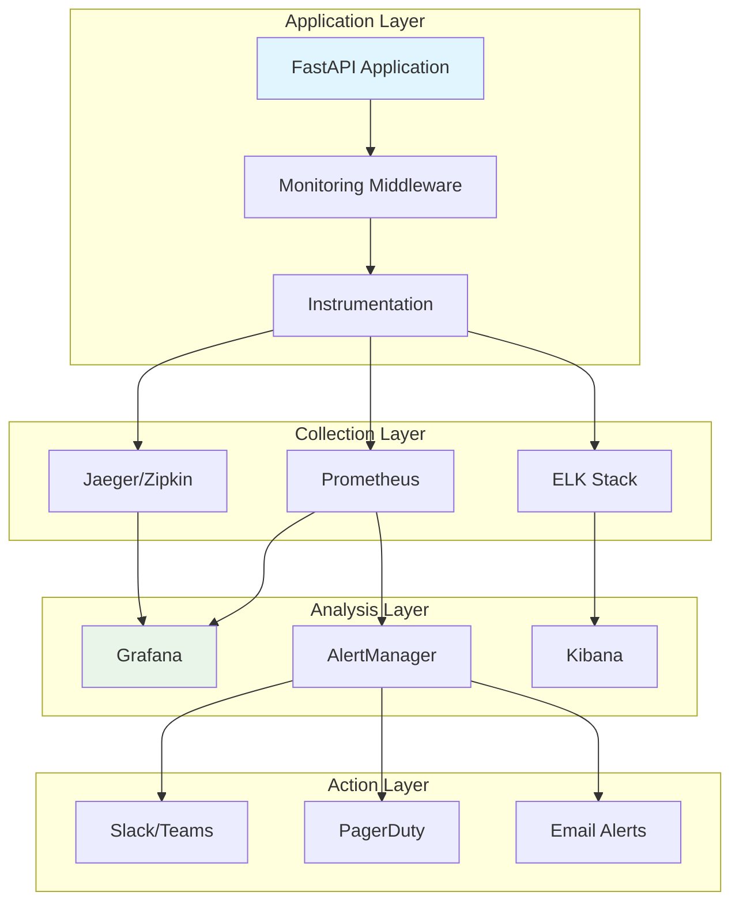

# 📊 Advanced Monitoring & Observability

*Building production-grade observability systems for enterprise FastAPI applications*

## 🎯 Overview

Enterprise-grade monitoring goes far beyond basic logging. This comprehensive guide explores sophisticated observability patterns that provide deep insights into your API's behavior, performance, and health in production environments.

### 🧠 **The Three Pillars of Observability**

Modern observability is built on three foundational pillars that work together to provide complete system visibility:

```mermaid
graph TB
    A[📊 Metrics] --> D[🔍 Observability Platform]
    B[📝 Logs] --> D
    C[🔗 Traces] --> D
    
    D --> E[📈 Dashboards]
    D --> F[🚨 Alerts]
    D --> G[📋 Reports]
    
    A1[Quantitative Data] --> A
    A2[Performance KPIs] --> A
    A3[Business Metrics] --> A
    
    B1[Contextual Events] --> B
    B2[Error Details] --> B
    B3[Audit Trail] --> B
    
    C1[Request Flow] --> C
    C2[Service Dependencies] --> C
    C3[Performance Bottlenecks] --> C
    
    style A fill:#e1f5fe
    style B fill:#f3e5f5
    style C fill:#fff3e0
    style D fill:#e8f5e8
```



Think of observability like a hospital's monitoring system for a patient: **metrics** are the vital signs (heart rate, blood pressure), **logs** are the detailed medical notes, and **traces** show how different organs work together. Together, they provide a complete picture of health.

### 🏗️ **Enterprise Monitoring Architecture**



## 🚀 Advanced Metrics Collection

### Comprehensive Request Logging and Metrics

Beyond basic request logging, enterprise applications require sophisticated metrics collection that captures business-critical indicators, performance characteristics, and operational health signals.

### 📊 **Key Metrics Categories**

| Metric Type | Purpose | Examples | Collection Method |
|-------------|---------|----------|-------------------|
| **Business Metrics** | Track business KPIs | User registrations, revenue, conversions | Custom counters |
| **Performance Metrics** | Monitor system performance | Response times, throughput, latency percentiles | Histograms |
| **Infrastructure Metrics** | System resource usage | CPU, memory, disk, network | System gauges |
| **Error Metrics** | Track failures and issues | Error rates, exception types, retry counts | Error counters |
| **Security Metrics** | Monitor security events | Failed auth attempts, rate limit hits | Security counters |

```python
from fastapi import FastAPI, Request, Response
import logging
import time
import psutil
import json
import uuid  # Add missing import
from datetime import datetime
from typing import Dict, Any, Optional
from prometheus_client import Counter, Histogram, Gauge, generate_latest
import asyncio
from contextlib import asynccontextmanager

# Configure structured logging with JSON formatter for better parsing
class JSONFormatter(logging.Formatter):
    """Custom JSON formatter for structured logging"""
    def format(self, record):
        log_data = {
            "timestamp": datetime.utcnow().isoformat() + "Z",
            "level": record.levelname,
            "logger": record.name,
            "message": record.getMessage(),
            "module": record.module,
            "function": record.funcName,
            "line": record.lineno
        }
        if hasattr(record, 'extra'):
            log_data.update(record.extra)
        return json.dumps(log_data)

logging.basicConfig(level=logging.INFO)
logger = logging.getLogger(__name__)
handler = logging.StreamHandler()
handler.setFormatter(JSONFormatter())
logger.handlers = [handler]

# Prometheus metrics with comprehensive labels for better observability
REQUEST_COUNT = Counter(
    'api_requests_total',
    'Total API requests received',
    ['method', 'endpoint', 'status_code', 'user_type']  # Enhanced labels
)

REQUEST_DURATION = Histogram(
    'api_request_duration_seconds',
    'API request processing duration in seconds',
    ['method', 'endpoint', 'cache_status'],  # Track cache hit/miss impact
    buckets=(0.005, 0.01, 0.025, 0.05, 0.075, 0.1, 0.25, 0.5, 0.75, 1.0, 2.5, 5.0, 7.5, 10.0)  # Custom buckets
)

ACTIVE_CONNECTIONS = Gauge(
    'api_active_connections',
    'Currently active API connections'
)

# Comprehensive error tracking
ERROR_COUNT = Counter(
    'api_errors_total',
    'Total API errors by type and severity',
    ['error_type', 'endpoint', 'severity', 'user_impact']
)

# Business metrics - track important business events
BUSINESS_EVENTS = Counter(
    'business_events_total',
    'Business-critical events',
    ['event_type', 'category', 'result']
)

# Cache performance metrics
CACHE_HITS = Counter(
    'api_cache_hits_total',
    'Cache hits by type and operation',
    ['cache_type', 'operation', 'key_pattern']
)

CACHE_MISSES = Counter(
    'api_cache_misses_total',
    'Cache misses by type and operation',
    ['cache_type', 'operation', 'key_pattern']
)

# Database performance metrics
DB_QUERY_DURATION = Histogram(
    'db_query_duration_seconds',
    'Database query execution time',
    ['operation', 'table', 'query_type']
)

DB_CONNECTION_POOL = Gauge(
    'db_connection_pool_size',
    'Database connection pool metrics',
    ['pool_name', 'status']  # status: active, idle, total
)

# System resource metrics
SYSTEM_CPU_USAGE = Gauge('system_cpu_usage_percent', 'System CPU usage percentage')
SYSTEM_MEMORY_USAGE = Gauge('system_memory_usage_percent', 'System memory usage percentage')
SYSTEM_DISK_USAGE = Gauge('system_disk_usage_percent', 'System disk usage percentage')

# API-specific metrics
API_RATE_LIMIT_HITS = Counter(
    'api_rate_limit_hits_total',
    'Rate limit violations',
    ['endpoint', 'user_id', 'limit_type']
)

API_AUTH_ATTEMPTS = Counter(
    'api_auth_attempts_total',
    'Authentication attempts',
    ['method', 'result', 'user_agent_type']
)

class MetricsCollector:
    """Collect and expose application metrics"""
    
    def __init__(self):
        self.start_time = time.time()
        self.request_stats = {
            'total_requests': 0,
            'error_count': 0,
            'avg_response_time': 0.0
        }
    
    def record_request(self, method: str, endpoint: str, status_code: int, duration: float):
        """Record request metrics"""
        REQUEST_COUNT.labels(method=method, endpoint=endpoint, status_code=status_code).inc()
        REQUEST_DURATION.labels(method=method, endpoint=endpoint).observe(duration)
        
        # Update internal stats
        self.request_stats['total_requests'] += 1
        if status_code >= 400:
            self.request_stats['error_count'] += 1
            ERROR_COUNT.labels(error_type=f"{status_code}", endpoint=endpoint).inc()
        
        # Update average response time
        current_avg = self.request_stats['avg_response_time']
        total_requests = self.request_stats['total_requests']
        self.request_stats['avg_response_time'] = (
            (current_avg * (total_requests - 1) + duration) / total_requests
        )
    
    def get_uptime(self) -> float:
        return time.time() - self.start_time
    
    def collect_system_metrics(self):
        """Collect system-level metrics"""
        SYSTEM_CPU_USAGE.set(psutil.cpu_percent())
        SYSTEM_MEMORY_USAGE.set(psutil.virtual_memory().percent)

metrics_collector = MetricsCollector()

# Logging middleware with structured logs
@app.middleware("http")
async def logging_middleware(request: Request, call_next):
    """Comprehensive request/response logging"""
    
    start_time = time.time()
    request_id = request.headers.get("x-request-id", str(uuid.uuid4()))
    
    # Extract request information
    client_ip = request.client.host if request.client else "unknown"
    user_agent = request.headers.get("user-agent", "unknown")
    
    # Log request start
    request_log_data = {
        "event": "request_start",
        "request_id": request_id,
        "method": request.method,
        "url": str(request.url),
        "path": request.url.path,
        "query_params": dict(request.query_params),
        "client_ip": client_ip,
        "user_agent": user_agent,
        "timestamp": datetime.utcnow().isoformat() + "Z"
    }
    
    logger.info("Request started", extra=request_log_data)
    
    # Process request
    try:
        ACTIVE_CONNECTIONS.inc()
        response = await call_next(request)
        
        # Calculate processing time
        process_time = time.time() - start_time
        
        # Log response
        response_log_data = {
            "event": "request_complete",
            "request_id": request_id,
            "status_code": response.status_code,
            "process_time": round(process_time, 4),
            "response_size": response.headers.get("content-length"),
            "timestamp": datetime.utcnow().isoformat() + "Z"
        }
        
        # Add custom response headers
        response.headers["X-Request-ID"] = request_id
        response.headers["X-Process-Time"] = str(round(process_time, 4))
        
        # Record metrics
        endpoint = request.url.path
        metrics_collector.record_request(
            request.method, endpoint, response.status_code, process_time
        )
        
        # Log based on status code
        if response.status_code >= 400:
            logger.warning("Request failed", extra=response_log_data)
        else:
            logger.info("Request completed", extra=response_log_data)
        
        return response
        
    except Exception as e:
        process_time = time.time() - start_time
        
        # Log error
        error_log_data = {
            "event": "request_error",
            "request_id": request_id,
            "error_type": type(e).__name__,
            "error_message": str(e),
            "process_time": round(process_time, 4),
            "timestamp": datetime.utcnow().isoformat() + "Z"
        }
        
        logger.error("Request error", extra=error_log_data, exc_info=True)
        
        # Record error metrics
        ERROR_COUNT.labels(error_type=type(e).__name__, endpoint=request.url.path).inc()
        
        raise
    
    finally:
        ACTIVE_CONNECTIONS.dec()

# Health check endpoints
@app.get("/health")
async def health_check():
    """Basic health check"""
    return {
        "status": "healthy",
        "timestamp": datetime.utcnow().isoformat() + "Z",
        "uptime": metrics_collector.get_uptime(),
        "version": "1.0.0"
    }

@app.get("/health/detailed")
async def detailed_health_check():
    """Detailed health check with dependencies"""
    
    checks = {
        "api": {"status": "healthy", "response_time": 0.001},
        "database": {"status": "unknown", "response_time": None},
        "cache": {"status": "unknown", "response_time": None},
        "external_service": {"status": "unknown", "response_time": None}
    }
    
    # Check database connectivity
    try:
        db_start = time.time()
        # Simulate database ping
        await asyncio.sleep(0.01)  # Mock DB query
        checks["database"] = {
            "status": "healthy",
            "response_time": round(time.time() - db_start, 4)
        }
    except Exception as e:
        checks["database"] = {
            "status": "unhealthy",
            "error": str(e),
            "response_time": None
        }
    
    # Check cache connectivity
    try:
        cache_start = time.time()
        redis_client.get("health_check")
        checks["cache"] = {
            "status": "healthy",
            "response_time": round(time.time() - cache_start, 4)
        }
    except Exception as e:
        checks["cache"] = {
            "status": "unhealthy",
            "error": str(e),
            "response_time": None
        }
    
    # Overall status
    overall_status = "healthy"
    if any(check["status"] == "unhealthy" for check in checks.values()):
        overall_status = "unhealthy"
    elif any(check["status"] == "unknown" for check in checks.values()):
        overall_status = "degraded"
    
    return {
        "status": overall_status,
        "timestamp": datetime.utcnow().isoformat() + "Z",
        "uptime": metrics_collector.get_uptime(),
        "checks": checks,
        "system": {
            "cpu_usage": psutil.cpu_percent(),
            "memory_usage": psutil.virtual_memory().percent,
            "disk_usage": psutil.disk_usage('/').percent
        }
    }

@app.get("/metrics")
async def get_metrics():
    """Prometheus metrics endpoint"""
    
    # Collect current system metrics
    metrics_collector.collect_system_metrics()
    
    # Generate Prometheus format
    metrics_output = generate_latest()
    
    return Response(
        content=metrics_output,
        media_type="text/plain; version=0.0.4; charset=utf-8"
    )

@app.get("/metrics/application")
async def get_application_metrics():
    """Custom application metrics in JSON format"""
    
    return {
        "uptime_seconds": metrics_collector.get_uptime(),
        "request_stats": metrics_collector.request_stats,
        "system_stats": {
            "cpu_percent": psutil.cpu_percent(),
            "memory_percent": psutil.virtual_memory().percent,
            "disk_percent": psutil.disk_usage('/').percent,
            "active_connections": len(asyncio.all_tasks())
        },
        "api_stats": {
            "endpoints_count": len(app.routes),
            "cache_hit_rate": calculate_cache_hit_rate(),
            "error_rate": calculate_error_rate()
        },
        "timestamp": datetime.utcnow().isoformat() + "Z"
    }

def calculate_cache_hit_rate() -> float:
    """Calculate cache hit rate"""
    # Mock calculation - in production, use actual cache metrics
    return 0.85  # 85% hit rate

def calculate_error_rate() -> float:
    """Calculate error rate"""
    stats = metrics_collector.request_stats
    if stats['total_requests'] == 0:
        return 0.0
    return stats['error_count'] / stats['total_requests']

# Request tracing for distributed systems
class RequestTracer:
    """Simple request tracing for distributed systems"""
    
    def __init__(self):
        self.traces = {}
    
    def start_trace(self, request_id: str, operation: str) -> str:
        """Start a new trace span"""
        span_id = str(uuid.uuid4())
        
        if request_id not in self.traces:
            self.traces[request_id] = []
        
        self.traces[request_id].append({
            "span_id": span_id,
            "operation": operation,
            "start_time": time.time(),
            "end_time": None,
            "duration": None,
            "tags": {}
        })
        
        return span_id
    
    def finish_trace(self, request_id: str, span_id: str, tags: Dict[str, Any] = None):
        """Finish a trace span"""
        if request_id in self.traces:
            for span in self.traces[request_id]:
                if span["span_id"] == span_id:
                    span["end_time"] = time.time()
                    span["duration"] = span["end_time"] - span["start_time"]
                    if tags:
                        span["tags"].update(tags)
                    break
    
    def get_trace(self, request_id: str) -> Dict[str, Any]:
        """Get complete trace for request"""
        return {
            "request_id": request_id,
            "spans": self.traces.get(request_id, []),
            "total_duration": sum(
                span.get("duration", 0) 
                for span in self.traces.get(request_id, [])
                if span.get("duration")
            )
        }

tracer = RequestTracer()

@app.get("/trace/{request_id}")
async def get_request_trace(request_id: str):
    """Get distributed trace for a request"""
    trace_data = tracer.get_trace(request_id)
    
    if not trace_data["spans"]:
        raise HTTPException(status_code=404, detail="Trace not found")
    
    return trace_data

# Example traced endpoint
@app.get("/users/{user_id}/traced")
async def get_user_with_tracing(
    user_id: int,
    request: Request
):
    """Example endpoint with distributed tracing"""
    
    request_id = request.headers.get("x-request-id", str(uuid.uuid4()))
    
    # Start main operation trace
    main_span = tracer.start_trace(request_id, "get_user")
    
    try:
        # Trace database operation
        db_span = tracer.start_trace(request_id, "database_query")
        await asyncio.sleep(0.05)  # Simulate DB query
        tracer.finish_trace(request_id, db_span, {"table": "users", "query_type": "select"})
        
        # Trace cache operation
        cache_span = tracer.start_trace(request_id, "cache_lookup")
        await asyncio.sleep(0.01)  # Simulate cache lookup
        tracer.finish_trace(request_id, cache_span, {"cache_type": "redis", "hit": False})
        
        # Simulate user data
        user_data = {
            "id": user_id,
            "username": f"user_{user_id}",
            "email": f"user_{user_id}@example.com"
        }
        
        tracer.finish_trace(request_id, main_span, {"user_found": True})
        
        return {
            "data": user_data,
            "trace_id": request_id,
            "trace_url": f"/trace/{request_id}"
        }
        
    except Exception as e:
        tracer.finish_trace(request_id, main_span, {"error": str(e)})
        raise
```

## 🔍 **Advanced Distributed Tracing**

### OpenTelemetry Integration

For production systems, integrate with OpenTelemetry for industry-standard tracing:

```python
from opentelemetry import trace
from opentelemetry.exporter.jaeger.thrift import JaegerExporter
from opentelemetry.sdk.trace import TracerProvider
from opentelemetry.sdk.trace.export import BatchSpanProcessor
from opentelemetry.instrumentation.fastapi import FastAPIInstrumentor
from opentelemetry.instrumentation.requests import RequestsInstrumentor
from opentelemetry.instrumentation.sqlalchemy import SQLAlchemyInstrumentor

# Configure OpenTelemetry
trace.set_tracer_provider(TracerProvider())

# Jaeger exporter configuration
jaeger_exporter = JaegerExporter(
    agent_host_name="jaeger-agent",  # Configure for your environment
    agent_port=6831,
    collector_endpoint="http://jaeger-collector:14268/api/traces",
)

# Add span processor
span_processor = BatchSpanProcessor(jaeger_exporter)
trace.get_tracer_provider().add_span_processor(span_processor)

# Auto-instrument FastAPI
FastAPIInstrumentor.instrument_app(app)
RequestsInstrumentor().instrument()  # For HTTP client calls
SQLAlchemyInstrumentor().instrument()  # For database queries

# Custom business logic tracing
tracer = trace.get_tracer(__name__)

@app.post("/orders")
async def create_order(order_data: OrderCreate):
    """Create order with comprehensive tracing"""
    
    with tracer.start_as_current_span("create_order") as span:
        # Add business context to span
        span.set_attribute("order.customer_id", order_data.customer_id)
        span.set_attribute("order.item_count", len(order_data.items))
        span.set_attribute("order.total_amount", order_data.total)
        
        try:
            # Validate customer
            with tracer.start_as_current_span("validate_customer") as customer_span:
                customer = await validate_customer(order_data.customer_id)
                customer_span.set_attribute("customer.tier", customer.tier)
                customer_span.set_attribute("customer.region", customer.region)
            
            # Process payment
            with tracer.start_as_current_span("process_payment") as payment_span:
                payment_result = await process_payment(order_data.payment_info)
                payment_span.set_attribute("payment.method", order_data.payment_info.method)
                payment_span.set_attribute("payment.success", payment_result.success)
                
                if not payment_result.success:
                    span.set_status(trace.Status(trace.StatusCode.ERROR, "Payment failed"))
                    raise PaymentError("Payment processing failed")
            
            # Create order record
            with tracer.start_as_current_span("save_order") as save_span:
                order = await save_order_to_db(order_data)
                save_span.set_attribute("order.id", str(order.id))
                save_span.set_attribute("database.table", "orders")
            
            # Send confirmation
            with tracer.start_as_current_span("send_notification") as notify_span:
                await send_order_confirmation(customer.email, order.id)
                notify_span.set_attribute("notification.type", "email")
                notify_span.set_attribute("notification.recipient", customer.email)
            
            span.set_attribute("order.final_status", "completed")
            return {"order_id": order.id, "status": "created"}
            
        except Exception as e:
            span.record_exception(e)  # Record exception details
            span.set_status(trace.Status(trace.StatusCode.ERROR, str(e)))
            raise
```

## 🚨 **Intelligent Alerting System**

### Multi-Level Alert Configuration

```python
from enum import Enum
from dataclasses import dataclass
from typing import List, Callable
import asyncio

class AlertSeverity(Enum):
    """Alert severity levels"""
    CRITICAL = "critical"    # Immediate action required
    WARNING = "warning"      # Action required soon
    INFO = "info"           # Informational only

class AlertChannel(Enum):
    """Alert delivery channels"""
    SLACK = "slack"
    PAGER_DUTY = "pagerduty"
    EMAIL = "email"
    WEBHOOK = "webhook"

@dataclass
class AlertRule:
    """Configurable alert rule"""
    name: str
    metric_name: str
    condition: str           # e.g., "> 0.95", "< 10", "== 0"
    threshold_duration: int  # seconds the condition must persist
    severity: AlertSeverity
    channels: List[AlertChannel]
    escalation_delay: int = 300  # seconds before escalating
    description: str = ""
    remediation_steps: List[str] = None

class AlertManager:
    """Enterprise-grade alert management"""
    
    def __init__(self):
        self.rules = []
        self.alert_history = []
        self.active_alerts = {}
        self.channel_handlers = {}
        
    def add_rule(self, rule: AlertRule):
        """Add monitoring rule"""
        self.rules.append(rule)
        
    def register_channel(self, channel: AlertChannel, handler: Callable):
        """Register alert delivery channel"""
        self.channel_handlers[channel] = handler
        
    async def evaluate_rules(self):
        """Continuously evaluate alert rules"""
        for rule in self.rules:
            metric_value = await self.get_metric_value(rule.metric_name)
            
            if self.evaluate_condition(metric_value, rule.condition):
                await self.trigger_alert(rule, metric_value)
            else:
                await self.resolve_alert(rule.name)
                
    def evaluate_condition(self, value: float, condition: str) -> bool:
        """Safely evaluate alert condition"""
        try:
            # Simple condition evaluation (in production, use safer parsing)
            return eval(f"{value} {condition}")
        except:
            return False
            
    async def trigger_alert(self, rule: AlertRule, current_value: float):
        """Trigger alert with intelligent deduplication"""
        alert_key = rule.name
        
        if alert_key not in self.active_alerts:
            # New alert
            alert = {
                "rule": rule,
                "triggered_at": datetime.utcnow(),
                "current_value": current_value,
                "escalation_sent": False,
                "notification_count": 0
            }
            
            self.active_alerts[alert_key] = alert
            await self.send_alert_notifications(rule, current_value, is_new=True)
            
        else:
            # Update existing alert
            alert = self.active_alerts[alert_key]
            alert["current_value"] = current_value
            
            # Check for escalation
            time_since_trigger = (datetime.utcnow() - alert["triggered_at"]).seconds
            if (time_since_trigger >= rule.escalation_delay and 
                not alert["escalation_sent"] and 
                rule.severity == AlertSeverity.CRITICAL):
                
                await self.escalate_alert(rule, current_value)
                alert["escalation_sent"] = True
                
    async def send_alert_notifications(self, rule: AlertRule, value: float, is_new: bool = True):
        """Send notifications through configured channels"""
        alert_data = {
            "rule_name": rule.name,
            "severity": rule.severity.value,
            "current_value": value,
            "description": rule.description,
            "remediation_steps": rule.remediation_steps or [],
            "is_new": is_new,
            "timestamp": datetime.utcnow().isoformat()
        }
        
        for channel in rule.channels:
            if channel in self.channel_handlers:
                try:
                    await self.channel_handlers[channel](alert_data)
                except Exception as e:
                    logger.error(f"Failed to send alert via {channel}: {e}")

# Alert configuration examples
alert_manager = AlertManager()

# Critical: API error rate too high
alert_manager.add_rule(AlertRule(
    name="high_error_rate",
    metric_name="api_error_rate_5min",
    condition="> 0.05",  # 5% error rate
    threshold_duration=60,
    severity=AlertSeverity.CRITICAL,
    channels=[AlertChannel.PAGER_DUTY, AlertChannel.SLACK],
    escalation_delay=300,
    description="API error rate exceeds 5% for over 1 minute",
    remediation_steps=[
        "Check application logs for error patterns",
        "Verify database connectivity",
        "Check external service dependencies",
        "Consider enabling maintenance mode if critical"
    ]
))

# Warning: High response time
alert_manager.add_rule(AlertRule(
    name="high_response_time",
    metric_name="api_p95_response_time",
    condition="> 2.0",  # 2 seconds
    threshold_duration=120,
    severity=AlertSeverity.WARNING,
    channels=[AlertChannel.SLACK, AlertChannel.EMAIL],
    description="95th percentile response time exceeds 2 seconds",
    remediation_steps=[
        "Check CPU and memory usage",
        "Review slow query logs",
        "Verify cache hit rates",
        "Consider scaling horizontally"
    ]
))

# Info: Unusual traffic pattern
alert_manager.add_rule(AlertRule(
    name="traffic_spike",
    metric_name="requests_per_minute",
    condition="> 1000",
    threshold_duration=300,
    severity=AlertSeverity.INFO,
    channels=[AlertChannel.SLACK],
    description="Request volume spike detected"
))
```

## 📊 **Business Intelligence Integration**

### Custom Dashboard Creation

```python
from typing import Dict, List, Any
import plotly.graph_objects as go
import plotly.express as px
from datetime import datetime, timedelta

class BusinessDashboard:
    """Generate business intelligence dashboards"""
    
    def __init__(self, metrics_collector: MetricsCollector):
        self.metrics = metrics_collector
        
    async def generate_executive_summary(self) -> Dict[str, Any]:
        """Generate executive-level KPI summary"""
        
        # Calculate key business metrics
        total_requests = await self.get_total_requests_today()
        active_users = await self.get_active_users_count()
        revenue_today = await self.get_revenue_today()
        error_rate = await self.get_error_rate_24h()
        
        # Performance indicators
        avg_response_time = await self.get_avg_response_time()
        uptime_percentage = await self.get_uptime_percentage()
        
        return {
            "summary": {
                "total_requests_today": total_requests,
                "active_users": active_users,
                "revenue_today": revenue_today,
                "system_health": {
                    "error_rate": error_rate,
                    "avg_response_time": avg_response_time,
                    "uptime_percentage": uptime_percentage
                }
            },
            "trends": await self.get_trend_data(),
            "alerts": await self.get_active_alerts_summary(),
            "generated_at": datetime.utcnow().isoformat()
        }
        
    async def create_performance_heatmap(self) -> str:
        """Create endpoint performance heatmap"""
        
        # Get performance data by endpoint and hour
        perf_data = await self.get_endpoint_performance_matrix()
        
        fig = go.Figure(data=go.Heatmap(
            z=perf_data['response_times'],
            x=perf_data['hours'],
            y=perf_data['endpoints'],
            colorscale='RdYlGn_r',
            text=perf_data['request_counts'],
            texttemplate="%{text} req",
            textfont={"size": 10},
            colorbar={"title": "Avg Response Time (ms)"}
        ))
        
        fig.update_layout(
            title="API Endpoint Performance Heatmap (24h)",
            xaxis_title="Hour of Day",
            yaxis_title="Endpoints"
        )
        
        return fig.to_html()

@app.get("/dashboard/executive")
async def executive_dashboard():
    """Executive-level dashboard endpoint"""
    dashboard = BusinessDashboard(metrics_collector)
    return await dashboard.generate_executive_summary()

@app.get("/dashboard/performance-heatmap")
async def performance_heatmap():
    """Performance heatmap visualization"""
    dashboard = BusinessDashboard(metrics_collector)
    html_content = await dashboard.create_performance_heatmap()
    
    return Response(content=html_content, media_type="text/html")
```

---

## 🎯 **Key Takeaways**

### 🏆 **Enterprise Monitoring Principles**

1. **📊 Comprehensive Coverage**: Monitor business metrics, not just technical ones
2. **🔍 Contextual Insights**: Add meaningful labels and context to all metrics
3. **🚨 Intelligent Alerting**: Alert on conditions that require action, not just anomalies
4. **📈 Trend Analysis**: Track changes over time to identify patterns
5. **🔄 Continuous Improvement**: Regularly review and refine monitoring strategies

### 🛠️ **Implementation Checklist**

- [ ] **Structured Logging**: JSON format with correlation IDs
- [ ] **Comprehensive Metrics**: Business, performance, and infrastructure
- [ ] **Distributed Tracing**: End-to-end request visibility
- [ ] **Multi-level Alerting**: Different severities and escalation paths
- [ ] **Business Dashboards**: Executive and operational views
- [ ] **Automated Remediation**: Self-healing capabilities where possible

Remember: Effective monitoring is about **actionable insights**, not just data collection. Every metric should have a purpose and drive decision-making.