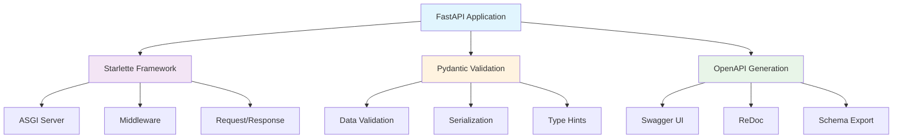
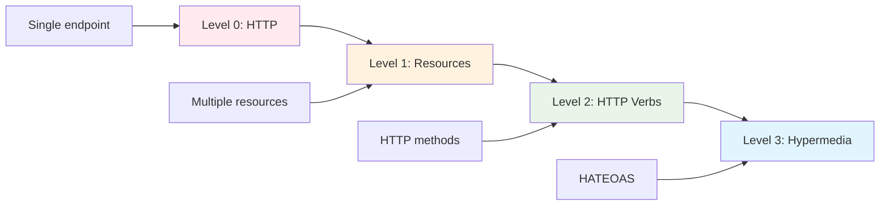
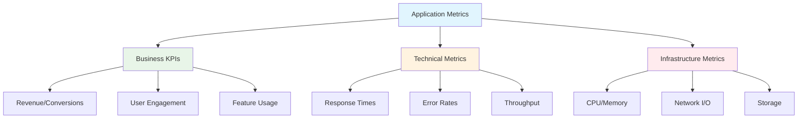
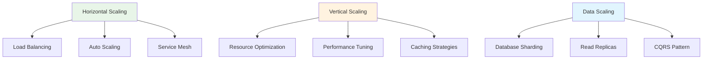
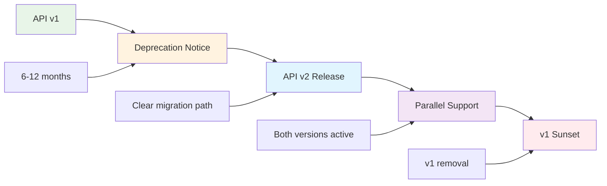

# 📖 Enterprise Standards & References

*Comprehensive resource library for building world-class FastAPI applications*

## 🎯 Overview

This definitive reference collection provides the essential standards, specifications, and resources needed to build enterprise-grade FastAPI applications. Each resource is carefully curated and includes implementation guidance specific to modern API development.

### 🏛️ **Standards Hierarchy**

```mermaid
graph TD
    A[🌐 Web Standards] --> B[📡 HTTP Protocols]
    A --> C[🔒 Security Standards]
    A --> D[📋 API Specifications]
    
    B --> B1[RFC 7231 - HTTP Semantics]
    B --> B2[RFC 7234 - Caching]
    B --> B3[RFC 7235 - Authentication]
    
    C --> C1[OAuth 2.0/OIDC]
    C --> C2[OWASP Security]
    C --> C3[TLS/Encryption]
    
    D --> D1[OpenAPI 3.1]
    D --> D2[JSON Schema]
    D --> D3[REST Guidelines]
    
    style A fill:#e1f5fe
    style B fill:#f3e5f5
    style C fill:#ffebee
    style D fill:#e8f5e8
```

## 🌐 **Core Web Standards & RFCs**

### 📡 **HTTP Protocol Standards**

| **RFC/Standard** | **Title** | **FastAPI Relevance** | **Implementation Priority** |
|------------------|-----------|------------------------|----------------------------|
| **[RFC 7231](https://tools.ietf.org/html/rfc7231)** | HTTP/1.1 Semantics and Content | Core HTTP method semantics, status codes | 🔴 Critical |
| **[RFC 7232](https://tools.ietf.org/html/rfc7232)** | HTTP/1.1 Conditional Requests | ETags, If-Modified-Since headers | 🟡 Important |
| **[RFC 7233](https://tools.ietf.org/html/rfc7233)** | HTTP/1.1 Range Requests | Partial content delivery, streaming | 🟡 Important |
| **[RFC 7234](https://tools.ietf.org/html/rfc7234)** | HTTP/1.1 Caching | Cache-Control headers, caching strategies | 🟡 Important |
| **[RFC 7235](https://tools.ietf.org/html/rfc7235)** | HTTP/1.1 Authentication | Authorization headers, auth schemes | 🔴 Critical |
| **[RFC 6585](https://tools.ietf.org/html/rfc6585)** | Additional HTTP Status Codes | 429 Too Many Requests, 431 Headers Too Large | 🟢 Useful |
| **[RFC 3986](https://tools.ietf.org/html/rfc3986)** | URI Generic Syntax | URL structure, query parameters | 🔴 Critical |

### 🔒 **Security & Authentication Standards**

| **Standard** | **Description** | **FastAPI Implementation** | **Use Cases** |
|--------------|-----------------|----------------------------|---------------|
| **[OAuth 2.0 (RFC 6749)](https://tools.ietf.org/html/rfc6749)** | Authorization framework | FastAPI Security utilities | API access delegation |
| **[OpenID Connect](https://openid.net/connect/)** | Identity layer on OAuth 2.0 | Third-party authentication | SSO, user identity |
| **[JWT (RFC 7519)](https://tools.ietf.org/html/rfc7519)** | JSON Web Tokens | Token-based authentication | Stateless auth, claims |
| **[PKCE (RFC 7636)](https://tools.ietf.org/html/rfc7636)** | Proof Key for Code Exchange | Mobile/SPA security | Public client security |
| **[CORS (W3C)](https://www.w3.org/TR/cors/)** | Cross-Origin Resource Sharing | FastAPI CORS middleware | Browser API access |
| **[CSP (W3C)](https://www.w3.org/TR/CSP3/)** | Content Security Policy | Security headers | XSS prevention |

### 📋 **API Specification Standards**

| **Specification** | **Version** | **Purpose** | **FastAPI Integration** |
|-------------------|-------------|-------------|-------------------------|
| **[OpenAPI](https://spec.openapis.org/oas/v3.1.0)** | 3.1.0 | API documentation and contracts | Native support, automatic generation |
| **[JSON Schema](https://json-schema.org/)** | Draft 2020-12 | Data validation and documentation | Pydantic integration |
| **[JSON:API](https://jsonapi.org/)** | 1.1 | JSON response format standard | Custom response formatting |
| **[HAL](http://stateless.co/hal_specification.html)** | - | Hypermedia API format | HATEOAS implementation |
| **[GraphQL](https://spec.graphql.org/)** | June 2018 | Query language for APIs | Alternative to REST |
| **[AsyncAPI](https://www.asyncapi.com/)** | 2.6 | Event-driven API documentation | WebSocket/streaming APIs |

## 🛠️ **FastAPI Ecosystem Resources**

### 🚀 **Core FastAPI Stack**

| **Component** | **Official Documentation** | **Key Features** | **Enterprise Considerations** |
|---------------|----------------------------|------------------|------------------------------|
| **[FastAPI](https://fastapi.tiangolo.com/)** | Complete framework guide | Auto docs, validation, async | Performance, type safety |
| **[Pydantic](https://docs.pydantic.dev/)** | Data validation library | Type validation, serialization | Data integrity, API contracts |
| **[Starlette](https://www.starlette.io/)** | ASGI framework foundation | Middleware, routing, responses | Low-level customization |
| **[Uvicorn](https://www.uvicorn.org/)** | ASGI server implementation | High-performance server | Production deployment |
| **[SQLAlchemy](https://docs.sqlalchemy.org/)** | Database ORM | Database abstraction | Data persistence, migrations |
| **[Alembic](https://alembic.sqlalchemy.org/)** | Database migrations | Schema versioning | Database evolution |

### 🔧 **Development & Testing Tools**

| **Tool** | **Purpose** | **Documentation** | **Integration with FastAPI** |
|----------|-------------|-------------------|------------------------------|
| **[pytest](https://docs.pytest.org/)** | Testing framework | Comprehensive testing | TestClient, async testing |
| **[httpx](https://www.python-httpx.org/)** | HTTP client library | API testing, async requests | Test client, external API calls |
| **[Black](https://black.readthedocs.io/)** | Code formatting | Consistent code style | Pre-commit hooks, CI/CD |
| **[mypy](https://mypy.readthedocs.io/)** | Static type checking | Type safety validation | Development workflow |
| **[Bandit](https://bandit.readthedocs.io/)** | Security linting | Security vulnerability scanning | CI/CD security gates |
| **[Safety](https://pyup.io/safety/)** | Dependency scanning | Known vulnerability detection | Supply chain security |

## 🏢 **Enterprise API Design Guidelines**

### 🌟 **Industry-Leading API Guidelines**

| **Organization** | **Guidelines** | **Key Principles** | **FastAPI Applicability** |
|------------------|----------------|--------------------|-----------------------------|
| **[Google](https://cloud.google.com/apis/design)** | API Design Guide | Resource-oriented design, standard methods | REST design patterns |
| **[Microsoft](https://github.com/Microsoft/api-guidelines)** | REST API Guidelines | Consistency, developer experience | Naming conventions, error handling |
| **[Stripe](https://stripe.com/docs/api)** | API Reference | Developer-friendly design | Payment API patterns |
| **[GitHub](https://docs.github.com/en/rest)** | REST API Documentation | Comprehensive documentation | Resource modeling |
| **[Zalando](https://opensource.zalando.com/restful-api-guidelines/)** | RESTful API Guidelines | Pragmatic REST implementation | European enterprise standards |
| **[PayPal](https://github.com/paypal/api-standards)** | API Standards | Enterprise-grade patterns | Financial services compliance |

### 📊 **API Maturity Model**

**Richardson Maturity Model Implementation:**

- **Level 0**: Basic HTTP usage with single endpoint
- **Level 1**: Resource-based URLs (`/users`, `/orders`)
- **Level 2**: HTTP verbs and status codes (`GET`, `POST`, `PUT`, `DELETE`)
- **Level 3**: Hypermedia controls (HATEOAS) for API discoverability

## 🛡️ **Security Standards & Best Practices**

### 🔐 **Security Framework References**

| **Framework/Standard** | **Focus Area** | **Documentation** | **FastAPI Implementation** |
|------------------------|----------------|-------------------|----------------------------|
| **[OWASP API Security Top 10](https://owasp.org/www-project-api-security/)** | API-specific vulnerabilities | Security threat catalog | Security middleware, validation |
| **[NIST Cybersecurity Framework](https://www.nist.gov/cyberframework)** | Enterprise security | Comprehensive security guidance | Compliance frameworks |
| **[ISO 27001](https://www.iso.org/isoiec-27001-information-security.html)** | Information security management | International standard | Enterprise security policies |
| **[SOC 2](https://www.aicpa.org/interestareas/frc/assuranceadvisoryservices/aicpasoc2report.html)** | Service organization controls | Audit compliance | Security controls documentation |
| **[PCI DSS](https://www.pcisecuritystandards.org/)** | Payment card security | Financial data protection | Payment processing security |
| **[GDPR](https://gdpr.eu/)** | Data protection regulation | Privacy compliance | Data handling procedures |

### 🔒 **Cryptographic Standards**

| **Standard** | **Purpose** | **Usage in APIs** | **Recommended Algorithms** |
|--------------|-------------|-------------------|----------------------------|
| **TLS 1.3** | Transport encryption | HTTPS communication | AES-256-GCM, ChaCha20-Poly1305 |
| **AES** | Symmetric encryption | Data at rest encryption | AES-256 in GCM mode |
| **RSA/ECDSA** | Asymmetric encryption | Digital signatures, key exchange | RSA-2048+, ECDSA P-256+ |
| **PBKDF2/Argon2** | Password hashing | User credential storage | Argon2id recommended |
| **HMAC** | Message authentication | API signature verification | HMAC-SHA256 |
| **HKDF** | Key derivation | Cryptographic key generation | HKDF-SHA256 |

## 📊 **Monitoring & Observability Standards**

### 📈 **Observability Specifications**

| **Standard** | **Purpose** | **Documentation** | **FastAPI Integration** |
|--------------|-------------|-------------------|-------------------------|
| **[OpenTelemetry](https://opentelemetry.io/)** | Observability framework | Distributed tracing, metrics | Auto-instrumentation |
| **[Prometheus](https://prometheus.io/docs/)** | Metrics collection | Time-series monitoring | Custom metrics, alerts |
| **[OpenMetrics](https://openmetrics.io/)** | Metrics exposition format | Standardized metrics | Prometheus compatibility |
| **[Jaeger](https://www.jaegertracing.io/)** | Distributed tracing | Request flow visualization | OpenTelemetry integration |
| **[W3C Trace Context](https://www.w3.org/TR/trace-context/)** | Tracing propagation | Cross-service correlation | HTTP header propagation |
| **[CloudEvents](https://cloudevents.io/)** | Event specification | Event-driven architectures | WebHook standardization |

### 📊 **Metrics Standards**

## 🌍 **International Standards & Compliance**

### 🏛️ **Regulatory Compliance**

| **Regulation** | **Geography** | **Scope** | **API Requirements** |
|----------------|---------------|-----------|----------------------|
| **GDPR** | European Union | Data protection | Consent management, data portability |
| **CCPA** | California, USA | Consumer privacy | Data access rights, deletion |
| **PIPEDA** | Canada | Personal information | Privacy by design principles |
| **LGPD** | Brazil | Data protection | Similar to GDPR requirements |
| **PDPA** | Singapore | Data protection | Notification and consent |
| **SOX** | USA | Financial reporting | Audit trails, data integrity |

### 🌐 **Internationalization Standards**

| **Standard** | **Purpose** | **Implementation** | **API Considerations** |
|--------------|-------------|--------------------|-----------------------|
| **[Unicode](https://unicode.org/)** | Character encoding | UTF-8 everywhere | Text handling, validation |
| **[ISO 8601](https://www.iso.org/iso-8601-date-and-time-format.html)** | Date/time format | Consistent timestamps | Date serialization |
| **[BCP 47](https://tools.ietf.org/html/bcp47)** | Language tags | Content localization | Accept-Language headers |
| **[ISO 4217](https://www.iso.org/iso-4217-currency-codes.html)** | Currency codes | Financial data | Currency representation |
| **[ISO 3166](https://www.iso.org/iso-3166-country-codes.html)** | Country codes | Geographic data | Address validation |

## 🚀 **Performance & Scalability Standards**

### ⚡ **Performance Benchmarks**

| **Metric** | **Target** | **Measurement** | **Tools** |
|------------|------------|-----------------|-----------|
| **Response Time** | < 200ms (95th percentile) | API endpoint latency | APM tools, load testing |
| **Throughput** | > 1000 RPS per instance | Requests per second | Load generators |
| **Availability** | 99.9% uptime | Service availability | Uptime monitoring |
| **Error Rate** | < 0.1% | Failed requests percentage | Error tracking |
| **TTFB** | < 100ms | Time to First Byte | Network monitoring |
| **Database Query** | < 50ms average | Database response time | Query performance |

### 📊 **Scalability Patterns**

## 🎓 **Learning & Certification Resources**

### 📚 **Professional Development**

| **Resource Type** | **Provider** | **Focus** | **Relevance** |
|-------------------|--------------|-----------|---------------|
| **[AWS API Gateway](https://docs.aws.amazon.com/apigateway/)** | Amazon Web Services | Cloud API management | Enterprise deployment |
| **[Google Cloud Endpoints](https://cloud.google.com/endpoints)** | Google Cloud | API monitoring/security | Production operations |
| **[Kong Academy](https://konghq.com/academy/)** | Kong Inc. | API gateway patterns | Infrastructure design |
| **[Postman Academy](https://academy.postman.com/)** | Postman | API testing/development | Development workflows |
| **[OpenAPI Initiative](https://www.openapis.org/)** | Linux Foundation | API specification | Standards compliance |

### 🏆 **Industry Certifications**

- **AWS Certified Solutions Architect** - Cloud API architecture
- **Google Cloud Professional Cloud Architect** - GCP API services
- **Microsoft Azure Solutions Architect** - Azure API management
- **Kong Certified API Developer** - API gateway expertise
- **CISSP** - Security architecture and design

## 🔄 **Version Control & API Evolution**

### 📈 **Semantic Versioning**

| **Version Change** | **When to Use** | **Breaking Changes** | **FastAPI Implementation** |
|--------------------|-----------------|----------------------|----------------------------|
| **Major (1.0.0)** | Breaking changes | Yes | New path prefix `/v2/` |
| **Minor (1.1.0)** | New features | No | Backward compatible |
| **Patch (1.1.1)** | Bug fixes | No | Internal improvements |

### 🔄 **API Evolution Strategies**

---

## 🎯 **Implementation Checklist**

### 🚀 **Getting Started (Week 1)**
- [ ] **Standards Review**: Understand applicable RFCs and specifications
- [ ] **Tool Setup**: Configure development environment with recommended tools
- [ ] **Security Baseline**: Implement basic security standards (HTTPS, authentication)

### 🏗️ **Foundation Building (Weeks 2-3)**
- [ ] **API Design**: Follow REST maturity model and design guidelines
- [ ] **Documentation**: Implement OpenAPI 3.1 with comprehensive examples
- [ ] **Testing**: Set up comprehensive testing framework

### 🚀 **Enterprise Features (Weeks 4-6)**
- [ ] **Monitoring**: Implement OpenTelemetry observability
- [ ] **Compliance**: Address relevant regulatory requirements
- [ ] **Performance**: Optimize based on performance benchmarks

### 🌍 **Production Readiness (Ongoing)**
- [ ] **Security Audits**: Regular security assessments
- [ ] **Performance Monitoring**: Continuous performance optimization
- [ ] **Standards Updates**: Keep up with evolving standards

Remember: **Standards are not constraints, they are enablers**. They provide the common language and patterns that allow your APIs to integrate seamlessly with the broader ecosystem and stand the test of time.