# 🔄 Real-time Communication with WebSockets: From Simple Chats to Enterprise Streaming

*Building dynamic, real-time applications that scale from hobby projects to enterprise systems*

## 🎯 The Journey from Postcards to Live TV Broadcasting

### 🏰 Real-World Analogy: The Evolution of Communication

Imagine your API kingdom needs to evolve its communication system. You've been relying on a postal service (HTTP requests) where citizens send letters and wait for replies. But now you need something more immediate - a live television network where information flows continuously in both directions.

Think of this transformation:
- **📮 HTTP (Traditional Mail)**: Send a letter, wait for a reply, conversation ends
- **📺 WebSockets (Live TV Network)**: Open a channel, continuous two-way communication
- **🌐 Enterprise WebSockets**: Global broadcasting network with multiple studios

Just as television revolutionized how we share information, WebSockets transform how your applications communicate in real-time.

### 🎭 What Makes Real-time Communication Essential?

Before diving into implementation, let's understand when and why you need WebSockets:

| 📮 **Traditional HTTP** | 📺 **WebSocket Communication** | 🚀 **Use Case Examples** |
|------------------------|------------------------------|-------------------------|
| Request → Response → Close | Open → Continuous Exchange → Close when done | Live chat, notifications |
| Client always initiates | Both can initiate messages | Stock tickers, live scores |
| New connection each time | Single persistent connection | Collaborative editing |
| Higher latency | Near-instant communication | Online gaming |
| Stateless by design | Maintains connection state | IoT device monitoring |

### 🎯 Learning Path: From Basic Broadcasting to Global Networks

This guide follows a progressive approach. Choose your entry point:

**📱 Foundation Level** (New to WebSockets)
- Start with **Your First WebSocket Endpoint**
- Build a simple echo server
- Understand connection lifecycle

**📺 Broadcasting Level** (Ready for multi-user features)
- Jump to **Broadcasting to Multiple Clients**
- Implement chat rooms
- Handle connection management

**🌐 Enterprise Level** (Scaling beyond single servers)
- Focus on **Distributed WebSocket Systems**
- Implement Redis pub/sub
- Handle millions of connections

### 🏗️ The WebSocket Architecture Pyramid

```mermaid
graph TD
    A[🌐 Global Broadcasting Network<br/>📡 Multi-region streaming] --> A1[CDN Integration]
    A --> A2[Edge Computing]
    A --> A3[Global Load Balancing]
    
    B[🏢 Enterprise Features<br/>🔐 Security & Scale] --> B1[Rate Limiting]
    B --> B2[Connection Pooling]
    B --> B3[Message Queuing]
    
    C[📺 Room Broadcasting<br/>👥 Multi-user features] --> C1[Room Management]
    C --> C2[Presence Detection]
    C --> C3[Message History]
    
    D[📱 Basic WebSockets<br/>🔌 Foundation concepts] --> D1[Connection Handling]
    D --> D2[Message Exchange]
    D --> D3[Error Management]
    
    A --> B
    B --> C
    C --> D
    
    style A fill:#e8f5e8,color:#3b3b3b
    style B fill:#ffebee,color:#3b3b3b
    style C fill:#e1f5fe,color:#3b3b3b
    style D fill:#fff3e0,color:#3b3b3b
```



## 🏗️ Understanding WebSocket Fundamentals

### 🎯 Real-World Analogy: Opening a TV Channel

Think of establishing a WebSocket connection like setting up a live TV broadcast:

1. **📞 Initial Call** (HTTP Request): The client calls the TV station asking to go live
2. **🎬 Studio Setup** (Protocol Upgrade): The station prepares the broadcast equipment
3. **📺 Live Broadcasting** (WebSocket Connection): Both parties can now communicate freely
4. **🔚 Sign Off** (Connection Close): Either party can end the broadcast

### 📊 Visual Journey: The WebSocket Lifecycle

```mermaid
sequenceDiagram
    participant Client as 📱 Client (Browser/App)
    participant LB as 🔄 Load Balancer
    participant Server as 🖥️ FastAPI Server
    participant State as 💾 Connection State

    Note over Client,Server: 🎬 Phase 1: Connection Establishment
    Client->>LB: GET /ws HTTP/1.1<br/>Upgrade: websocket<br/>🔑 Sec-WebSocket-Key: ...
    LB->>Server: Route to available server
    Server->>State: Register new connection
    Server-->>Client: HTTP/1.1 101 Switching Protocols<br/>✅ Connection upgraded!
    
    Note over Client,Server: 📺 Phase 2: Live Communication
    par Bidirectional Messages
        Client->>Server: 💬 "Hello from client!"
        Server->>Client: 📢 "Server broadcast!"
        Server->>Client: 📊 "Live data update!"
        Client->>Server: 🎮 "User action!"
    end
    
    Note over Client,Server: 🔚 Phase 3: Graceful Shutdown
    Client->>Server: Close frame (1000)
    Server->>State: Remove connection
    Server-->>Client: Close acknowledgment
    Note over Client,Server: Connection closed cleanly
```



### 🤔 What Makes WebSockets Special?

WebSockets provide a **full-duplex communication channel** - like having a phone line that's always open, where both parties can talk whenever they want without having to dial again.

**Key Characteristics:**
- **🔌 Persistent Connection**: Stays open until explicitly closed
- **⚡ Low Latency**: No connection overhead for each message
- **📡 Bidirectional**: Both client and server can initiate messages
- **📦 Efficient**: Minimal protocol overhead compared to HTTP

### ✅ Why Choose FastAPI for WebSockets?

FastAPI makes WebSocket implementation feel natural and Pythonic:

- **🚀 Native Async Support**: Built on modern Python async/await
- **🔧 Type Safety**: Full type hints and validation support
- **📚 Excellent Documentation**: Auto-generated API docs
- **🏗️ Dependency Injection**: Reuse your existing FastAPI patterns
- **⚡ High Performance**: Built on Starlette and uvloop

### 📋 Prerequisites Checklist

Before we begin building, ensure you have:

- [ ] Python 3.8+ installed (WebSockets require modern async features)
- [ ] Basic FastAPI knowledge (endpoints, dependency injection)
- [ ] Understanding of `async`/`await` patterns
- [ ] A WebSocket client for testing (browser console, Postman, or wscat)
- [ ] Optional: Redis installed for scaling examples

---

## 🚀 Building Your First WebSocket Endpoint

### 🏰 The Big Picture

We're going to build a simple echo server - like creating a basic TV studio that simply replays whatever it receives. This foundational example teaches connection handling, message processing, and error management.

### 🎯 Real-World Analogy: The Echo Chamber Studio

Imagine a small radio studio with one simple rule: whatever you say into the microphone gets played back through the speakers. It's the perfect way to test if all the equipment is working correctly before building more complex shows.

### 📊 Visual Architecture

```mermaid
graph LR
    A[🌐 Client Browser] -->|WebSocket Connection| B[🚪 /ws Endpoint]
    B --> C[📝 Connection Registry]
    B --> D[🔄 Message Handler]
    D -->|Echo| A
    
    style B fill:#e1f5fe,color:#3b3b3b
    style C fill:#fff3e0,color:#3b3b3b
    style D fill:#e8f5e8,color:#3b3b3b
```



### 🔧 Enhanced Code Example: Professional Echo Server

```python
# echo_server.py
from fastapi import FastAPI, WebSocket, WebSocketDisconnect, status
from fastapi.middleware.cors import CORSMiddleware
from typing import List, Set, Dict
from datetime import datetime
import logging
import json
import asyncio

# Configure logging for production-ready insights
logging.basicConfig(
    level=logging.INFO,
    format='%(asctime)s - %(name)s - %(levelname)s - %(message)s'
)
logger = logging.getLogger(__name__)

# Initialize FastAPI with metadata - like setting up your TV station identity
app = FastAPI(
    title="WebSocket Echo Studio",
    description="A professional WebSocket server demonstrating real-time communication patterns",
    version="1.0.0",
    docs_url="/docs",
    redoc_url="/redoc"
)

# Configure CORS for browser-based clients - like setting broadcast permissions
app.add_middleware(
    CORSMiddleware,
    allow_origins=["*"],  # In production, specify your allowed origins
    allow_credentials=True,
    allow_methods=["*"],
    allow_headers=["*"],
)

class ConnectionManager:
    """
    Professional connection manager - like a TV studio's master control room.
    
    Handles:
    - Connection lifecycle (join/leave)
    - Message routing
    - Connection health monitoring
    - Graceful error handling
    """
    
    def __init__(self):
        # Active connections - like keeping track of all live channels
        self.active_connections: Set[WebSocket] = set()
        
        # Connection metadata - like knowing details about each broadcast
        self.connection_info: Dict[WebSocket, Dict] = {}
        
        # Statistics for monitoring - like TV ratings
        self.stats = {
            "total_connections": 0,
            "messages_sent": 0,
            "messages_received": 0,
            "errors": 0
        }
    
    async def connect(self, websocket: WebSocket, client_id: str = None):
        """
        Accept a new connection - like tuning into a new channel.
        
        Args:
            websocket: The WebSocket connection
            client_id: Optional identifier for the client
        """
        await websocket.accept()
        self.active_connections.add(websocket)
        
        # Store connection metadata - like creating a viewer profile
        self.connection_info[websocket] = {
            "client_id": client_id or f"client_{self.stats['total_connections']}",
            "connected_at": datetime.utcnow().isoformat(),
            "messages_count": 0,
            "last_activity": datetime.utcnow().isoformat()
        }
        
        self.stats["total_connections"] += 1
        
        logger.info(
            f"New connection established: {self.connection_info[websocket]['client_id']} "
            f"(Total active: {len(self.active_connections)})"
        )
    
    def disconnect(self, websocket: WebSocket):
        """
        Remove a connection - like a viewer changing the channel.
        """
        if websocket in self.active_connections:
            self.active_connections.remove(websocket)
            
            client_info = self.connection_info.pop(websocket, {})
            client_id = client_info.get('client_id', 'unknown')
            
            logger.info(
                f"Connection closed: {client_id} "
                f"(Remaining active: {len(self.active_connections)})"
            )
    
    async def send_personal_message(self, message: str, websocket: WebSocket):
        """
        Send a message to a specific connection - like a personalized broadcast.
        
        Args:
            message: The message to send
            websocket: The target connection
        """
        try:
            await websocket.send_text(message)
            self.stats["messages_sent"] += 1
            
            # Update last activity - like noting when a viewer last interacted
            if websocket in self.connection_info:
                self.connection_info[websocket]["last_activity"] = datetime.utcnow().isoformat()
                
        except Exception as e:
            logger.error(f"Error sending message: {e}")
            self.stats["errors"] += 1
            # Remove failed connection - like dropping a bad signal
            self.disconnect(websocket)
    
    async def echo_message(self, message: str, websocket: WebSocket):
        """
        Echo a message back to the sender - like instant replay.
        
        Includes metadata about the echo for debugging and monitoring.
        """
        self.stats["messages_received"] += 1
        
        # Update connection statistics
        if websocket in self.connection_info:
            self.connection_info[websocket]["messages_count"] += 1
        
        # Create an enhanced echo response - like adding production value
        echo_response = {
            "type": "echo",
            "original_message": message,
            "timestamp": datetime.utcnow().isoformat(),
            "connection_id": self.connection_info.get(websocket, {}).get("client_id", "unknown"),
            "message_number": self.connection_info.get(websocket, {}).get("messages_count", 0)
        }
        
        await self.send_personal_message(json.dumps(echo_response), websocket)
    
    def get_stats(self) -> Dict:
        """
        Get current statistics - like checking TV ratings and metrics.
        """
        return {
            **self.stats,
            "active_connections": len(self.active_connections),
            "connection_details": [
                {
                    "client_id": info["client_id"],
                    "connected_at": info["connected_at"],
                    "messages_count": info["messages_count"],
                    "last_activity": info["last_activity"]
                }
                for info in self.connection_info.values()
            ]
        }

# Create our connection manager - like hiring a studio director
manager = ConnectionManager()

@app.get("/")
async def root():
    """
    Root endpoint - like the TV station's welcome screen.
    """
    return {
        "message": "WebSocket Echo Studio is ON AIR! 📺",
        "websocket_endpoint": "ws://localhost:8000/ws",
        "stats_endpoint": "/stats",
        "documentation": "/docs"
    }

@app.get("/stats")
async def get_stats():
    """
    Statistics endpoint - like checking the studio's performance dashboard.
    """
    return {
        "status": "operational",
        "stats": manager.get_stats(),
        "server_time": datetime.utcnow().isoformat()
    }

@app.websocket("/ws")
async def websocket_endpoint(websocket: WebSocket):
    """
    Main WebSocket endpoint - the heart of our echo studio.
    
    Like a live broadcast booth that:
    1. Welcomes new connections
    2. Echoes all received messages
    3. Handles disconnections gracefully
    """
    # Generate a unique client ID - like assigning a viewer number
    client_id = f"echo_client_{datetime.utcnow().timestamp()}"
    
    # Accept the connection - like going live
    await manager.connect(websocket, client_id)
    
    # Send a welcome message - like the opening announcement
    welcome_message = {
        "type": "welcome",
        "message": "Welcome to the Echo Studio! 🎙️",
        "client_id": client_id,
        "server_time": datetime.utcnow().isoformat(),
        "instructions": "Send any message and it will be echoed back with metadata."
    }
    await manager.send_personal_message(json.dumps(welcome_message), websocket)
    
    try:
        # Main message loop - like keeping the broadcast running
        while True:
            # Wait for incoming messages - like listening to the audience
            data = await websocket.receive_text()
            
            logger.info(f"Received message from {client_id}: {data[:50]}...")
            
            # Echo the message back - like instant replay with commentary
            await manager.echo_message(data, websocket)
            
    except WebSocketDisconnect:
        # Handle graceful disconnection - like signing off the air
        logger.info(f"Client {client_id} disconnected normally")
        
    except Exception as e:
        # Handle unexpected errors - like technical difficulties
        logger.error(f"Error in WebSocket connection {client_id}: {e}")
        
    finally:
        # Always clean up - like shutting down the studio properly
        manager.disconnect(websocket)

# Optional: Health check endpoint for monitoring
@app.get("/health")
async def health_check():
    """
    Health check endpoint - like testing if the studio equipment is working.
    """
    return {
        "status": "healthy",
        "active_connections": len(manager.active_connections),
        "uptime": "check your monitoring system"  # In production, track actual uptime
    }

if __name__ == "__main__":
    # Run the server - like starting the broadcast
    import uvicorn
    uvicorn.run(
        "echo_server:app",
        host="0.0.0.0",
        port=8000,
        reload=True,  # Auto-reload during development
        log_level="info"
    )
```

### 🧪 Testing Your Echo Studio

**Option 1: Browser Console Test**

```javascript
// Open your browser console and run:
const ws = new WebSocket('ws://localhost:8000/ws');

ws.onopen = () => {
    console.log('Connected to Echo Studio! 📺');
    ws.send('Hello, Echo Studio!');
};

ws.onmessage = (event) => {
    console.log('Received:', JSON.parse(event.data));
};

ws.onerror = (error) => {
    console.error('WebSocket error:', error);
};

ws.onclose = () => {
    console.log('Disconnected from Echo Studio');
};
```

**Option 2: Python Test Client**

```python
# test_client.py
import asyncio
import websockets
import json

async def test_echo():
    uri = "ws://localhost:8000/ws"
    
    async with websockets.connect(uri) as websocket:
        # Receive welcome message
        welcome = await websocket.recv()
        print(f"Welcome message: {json.loads(welcome)}")
        
        # Send test messages
        test_messages = [
            "Hello, Echo Studio!",
            "Testing 1, 2, 3...",
            "🎙️ Is this thing on?"
        ]
        
        for message in test_messages:
            await websocket.send(message)
            response = await websocket.recv()
            print(f"Sent: {message}")
            print(f"Received: {json.loads(response)}\n")
            await asyncio.sleep(1)

if __name__ == "__main__":
    asyncio.run(test_echo())
```

### ✅ What We've Accomplished

In this echo studio example, we've built:

1. **🔌 Connection Management**: Professional handling of WebSocket lifecycle
2. **📊 Monitoring & Stats**: Track connections and messages
3. **🛡️ Error Handling**: Graceful management of disconnections and errors
4. **📝 Structured Messages**: JSON format for better client parsing
5. **🔍 Logging**: Production-ready logging for debugging

### 🚨 Common Issues and Solutions

| ❌ **Problem** | ✅ **Solution** | 🎯 **Prevention** |
|---------------|----------------|------------------|
| **Connection immediately closes** | Check CORS settings and WebSocket URL | Always test with proper WebSocket clients |
| **Messages not received** | Verify async/await usage | Use proper error handling in message loop |
| **Server crashes on disconnect** | Implement proper exception handling | Always use try/finally for cleanup |
| **Memory leaks** | Remove connections from tracking | Use connection managers with cleanup |

### 🚀 Next Steps

Now that we have our echo studio running, let's expand to:
- **Broadcasting**: Send messages to multiple clients
- **Rooms**: Create isolated communication channels  
- **Authentication**: Secure our WebSocket endpoints
- **Scaling**: Handle thousands of concurrent connections

## 📺 Broadcasting Messages: From Solo Shows to Live Networks

### 🏰 The Big Picture

Now that we have our echo studio working, let's evolve it into a full broadcasting network. This is like upgrading from a single microphone to a complete TV network where one message can reach thousands of viewers simultaneously.

### 🎯 Real-World Analogy: The News Network

Imagine transitioning from a single radio operator to CNN:
- **🎙️ Single Echo**: One person talks to themselves (echo server)
- **📺 Broadcasting**: One anchor speaks to millions of viewers
- **🏢 Room System**: Multiple channels with different audiences
- **🌐 Global Network**: Interconnected studios worldwide

### 📊 Visual Architecture: Broadcasting System

```mermaid
graph TB
    subgraph "Broadcasting Network"
        CM[📡 Connection Manager<br/>Central Control Room]
        
        subgraph "Studio A - General News"
            C1[👤 Viewer 1]
            C2[👤 Viewer 2]
            C3[👤 Viewer 3]
        end
        
        subgraph "Studio B - Sports Channel"
            C4[👤 Sports Fan 1]
            C5[👤 Sports Fan 2]
        end
        
        subgraph "Studio C - Weather Channel"
            C6[👤 Weather Watcher]
        end
    end
    
    M1[📢 News Update] --> CM
    CM --> C1
    CM --> C2
    CM --> C3
    
    M2[⚽ Sports Score] --> CM
    CM --> C4
    CM --> C5
    
    M3[🌤️ Weather Alert] --> CM
    CM --> C6
    
    style CM fill:#ff6b6b,color:#ffffff
    style M1 fill:#4ecdc4,color:#ffffff
    style M2 fill:#45b7d1,color:#ffffff
    style M3 fill:#f9ca24,color:#000000
```



### 🔧 Enhanced Broadcasting Implementation

```python
# broadcasting_server.py
from fastapi import FastAPI, WebSocket, WebSocketDisconnect, WebSocketState
from fastapi.middleware.cors import CORSMiddleware
from typing import List, Dict, Set, Optional, Any
from datetime import datetime
from collections import defaultdict
import logging
import json
import asyncio
from enum import Enum

# Configure professional logging
logging.basicConfig(
    level=logging.INFO,
    format='%(asctime)s - %(name)s - %(levelname)s - %(message)s'
)
logger = logging.getLogger(__name__)

app = FastAPI(
    title="WebSocket Broadcasting Network",
    description="Professional broadcasting system with rooms and presence",
    version="2.0.0"
)

# Enable CORS for web clients
app.add_middleware(
    CORSMiddleware,
    allow_origins=["*"],  # Configure appropriately for production
    allow_credentials=True,
    allow_methods=["*"],
    allow_headers=["*"],
)

class MessageType(str, Enum):
    """Types of messages in our broadcasting system"""
    CHAT = "chat"              # Regular chat messages
    SYSTEM = "system"          # System notifications
    PRESENCE = "presence"      # User join/leave events
    BROADCAST = "broadcast"    # Admin broadcasts
    PRIVATE = "private"        # Direct messages
    ERROR = "error"           # Error notifications

class BroadcastRoom:
    """
    A broadcast room - like a TV channel with its own audience.
    
    Manages:
    - Subscriber connections
    - Message history
    - Presence tracking
    - Room-specific broadcasts
    """
    
    def __init__(self, room_id: str, max_history: int = 100):
        self.room_id = room_id
        self.connections: Set[WebSocket] = set()
        self.user_info: Dict[WebSocket, Dict[str, Any]] = {}
        self.message_history: List[Dict[str, Any]] = []
        self.max_history = max_history
        self.created_at = datetime.utcnow()
        self.message_count = 0
    
    async def add_connection(self, websocket: WebSocket, username: str):
        """Add a new viewer to this channel"""
        self.connections.add(websocket)
        self.user_info[websocket] = {
            "username": username,
            "joined_at": datetime.utcnow().isoformat(),
            "message_count": 0
        }
        
        # Notify room about new viewer - like announcing a VIP arrival
        await self.broadcast_presence(username, "joined")
        
        # Send recent history to new viewer - like showing previous highlights
        if self.message_history:
            history_message = {
                "type": MessageType.SYSTEM,
                "content": "Recent messages",
                "history": self.message_history[-10:],  # Last 10 messages
                "timestamp": datetime.utcnow().isoformat()
            }
            await self._send_to_connection(websocket, history_message)
    
    def remove_connection(self, websocket: WebSocket):
        """Remove a viewer from this channel"""
        if websocket in self.connections:
            self.connections.remove(websocket)
            user_info = self.user_info.pop(websocket, {})
            username = user_info.get("username", "Unknown")
            
            # Notify remaining viewers - like announcing someone left
            asyncio.create_task(self.broadcast_presence(username, "left"))
    
    async def broadcast_presence(self, username: str, action: str):
        """Broadcast presence updates - like showing who's in the studio"""
        presence_message = {
            "type": MessageType.PRESENCE,
            "username": username,
            "action": action,
            "room_id": self.room_id,
            "timestamp": datetime.utcnow().isoformat(),
            "active_users": len(self.connections)
        }
        
        await self.broadcast(presence_message)
    
    async def broadcast(
        self, 
        message: Dict[str, Any], 
        exclude: Optional[WebSocket] = None,
        save_to_history: bool = True
    ):
        """
        Broadcast a message to all room subscribers.
        
        Like a TV transmitter sending signals to all tuned receivers.
        """
        self.message_count += 1
        
        # Add metadata - like adding production timestamps
        if "timestamp" not in message:
            message["timestamp"] = datetime.utcnow().isoformat()
        if "room_id" not in message:
            message["room_id"] = self.room_id
        if "message_id" not in message:
            message["message_id"] = f"{self.room_id}_{self.message_count}"
        
        # Save to history - like recording the broadcast
        if save_to_history and message["type"] in [MessageType.CHAT, MessageType.BROADCAST]:
            self.message_history.append(message)
            # Maintain history limit - like keeping only recent recordings
            if len(self.message_history) > self.max_history:
                self.message_history = self.message_history[-self.max_history:]
        
        # Broadcast to all connections - like transmitting to all receivers
        disconnected = []
        for connection in self.connections:
            if connection == exclude:
                continue
                
            if connection.client_state == WebSocketState.CONNECTED:
                try:
                    await connection.send_json(message)
                except Exception as e:
                    logger.error(f"Broadcast error: {e}")
                    disconnected.append(connection)
            else:
                disconnected.append(connection)
        
        # Clean up disconnected clients - like removing broken receivers
        for conn in disconnected:
            self.remove_connection(conn)
    
    async def _send_to_connection(self, websocket: WebSocket, message: Dict[str, Any]):
        """Send a message to a specific connection"""
        try:
            if websocket.client_state == WebSocketState.CONNECTED:
                await websocket.send_json(message)
        except Exception as e:
            logger.error(f"Failed to send to connection: {e}")
    
    def get_room_info(self) -> Dict[str, Any]:
        """Get room statistics - like checking channel ratings"""
        return {
            "room_id": self.room_id,
            "active_connections": len(self.connections),
            "total_messages": self.message_count,
            "created_at": self.created_at.isoformat(),
            "users": [
                {
                    "username": info["username"],
                    "joined_at": info["joined_at"],
                    "messages": info["message_count"]
                }
                for info in self.user_info.values()
            ]
        }

class BroadcastingManager:
    """
    Master control room for the entire broadcasting network.
    
    Like the central hub that manages all TV channels, routing
    messages to the right audiences and tracking everything.
    """
    
    def __init__(self):
        self.rooms: Dict[str, BroadcastRoom] = {}
        self.connection_to_room: Dict[WebSocket, str] = {}
        self.connection_to_user: Dict[WebSocket, str] = {}
        self.global_stats = {
            "total_connections": 0,
            "total_messages": 0,
            "rooms_created": 0
        }
    
    async def connect_to_room(
        self, 
        websocket: WebSocket, 
        room_id: str, 
        username: str
    ) -> BroadcastRoom:
        """
        Connect a client to a specific room.
        
        Like tuning into a specific TV channel.
        """
        # Accept the WebSocket connection
        await websocket.accept()
        
        # Create room if it doesn't exist - like launching a new channel
        if room_id not in self.rooms:
            self.rooms[room_id] = BroadcastRoom(room_id)
            self.global_stats["rooms_created"] += 1
            logger.info(f"Created new broadcast room: {room_id}")
        
        room = self.rooms[room_id]
        
        # Register the connection - like adding to subscriber list
        self.connection_to_room[websocket] = room_id
        self.connection_to_user[websocket] = username
        self.global_stats["total_connections"] += 1
        
        # Add to room - like joining the audience
        await room.add_connection(websocket, username)
        
        logger.info(
            f"User '{username}' connected to room '{room_id}' "
            f"(Room size: {len(room.connections)})"
        )
        
        return room
    
    def disconnect(self, websocket: WebSocket):
        """
        Disconnect a client from their room.
        
        Like changing the channel or turning off the TV.
        """
        room_id = self.connection_to_room.pop(websocket, None)
        username = self.connection_to_user.pop(websocket, None)
        
        if room_id and room_id in self.rooms:
            room = self.rooms[room_id]
            room.remove_connection(websocket)
            
            # Clean up empty rooms - like shutting down unused channels
            if len(room.connections) == 0:
                del self.rooms[room_id]
                logger.info(f"Removed empty room: {room_id}")
            
            logger.info(
                f"User '{username}' disconnected from room '{room_id}' "
                f"(Room size: {len(room.connections) if room_id in self.rooms else 0})"
            )
    
    async def broadcast_to_room(
        self, 
        room_id: str, 
        message: Dict[str, Any],
        exclude: Optional[WebSocket] = None
    ):
        """Broadcast to a specific room - like choosing which channel to broadcast on"""
        if room_id in self.rooms:
            self.global_stats["total_messages"] += 1
            await self.rooms[room_id].broadcast(message, exclude)
    
    async def broadcast_to_all(self, message: Dict[str, Any]):
        """
        Broadcast to all rooms - like an emergency broadcast system.
        
        Use sparingly for system-wide announcements.
        """
        message["type"] = MessageType.BROADCAST
        message["scope"] = "global"
        
        for room in self.rooms.values():
            await room.broadcast(message, save_to_history=False)
    
    async def send_private_message(
        self, 
        from_user: str,
        to_connection: WebSocket, 
        content: str
    ):
        """Send a private message - like a direct phone call during the show"""
        if to_connection.client_state == WebSocketState.CONNECTED:
            private_message = {
                "type": MessageType.PRIVATE,
                "from": from_user,
                "content": content,
                "timestamp": datetime.utcnow().isoformat()
            }
            
            try:
                await to_connection.send_json(private_message)
            except Exception as e:
                logger.error(f"Failed to send private message: {e}")
    
    def get_network_stats(self) -> Dict[str, Any]:
        """Get network-wide statistics - like checking overall ratings"""
        return {
            "global_stats": self.global_stats,
            "active_rooms": len(self.rooms),
            "total_active_connections": sum(
                len(room.connections) for room in self.rooms.values()
            ),
            "rooms": {
                room_id: room.get_room_info() 
                for room_id, room in self.rooms.items()
            }
        }

# Create the broadcasting manager - like hiring the network director
broadcast_manager = BroadcastingManager()

@app.get("/")
async def root():
    """Welcome endpoint - like the network's home page"""
    return {
        "message": "WebSocket Broadcasting Network is ON AIR! 📺",
        "endpoints": {
            "websocket": "ws://localhost:8000/ws/{room_id}?username={username}",
            "stats": "/stats",
            "rooms": "/rooms",
            "docs": "/docs"
        }
    }

@app.get("/stats")
async def get_network_stats():
    """Network statistics - like viewing comprehensive ratings"""
    return broadcast_manager.get_network_stats()

@app.get("/rooms")
async def list_rooms():
    """List all active rooms - like showing available channels"""
    return {
        "rooms": list(broadcast_manager.rooms.keys()),
        "count": len(broadcast_manager.rooms)
    }

@app.websocket("/ws/{room_id}")
async def websocket_broadcast_endpoint(
    websocket: WebSocket,
    room_id: str,
    username: str = "Anonymous"
):
    """
    Main broadcasting endpoint - like a TV channel subscription.
    
    Clients connect to specific rooms (channels) and can:
    - Receive all messages broadcast to that room
    - Send messages that get broadcast to everyone in the room
    - See who joins and leaves
    - Access recent message history
    """
    # Connect to the room - like tuning into a channel
    room = await broadcast_manager.connect_to_room(websocket, room_id, username)
    
    try:
        # Main message loop - like keeping the channel active
        while True:
            # Receive message from client
            data = await websocket.receive_json()
            
            # Validate message format
            if not isinstance(data, dict) or "content" not in data:
                error_message = {
                    "type": MessageType.ERROR,
                    "content": "Invalid message format. Expected {content: string}",
                    "timestamp": datetime.utcnow().isoformat()
                }
                await websocket.send_json(error_message)
                continue
            
            # Process different message types
            message_type = data.get("type", MessageType.CHAT)
            
            if message_type == MessageType.CHAT:
                # Regular chat message - like normal programming
                chat_message = {
                    "type": MessageType.CHAT,
                    "username": username,
                    "content": data["content"],
                    "room_id": room_id
                }
                
                # Update user statistics
                if websocket in room.user_info:
                    room.user_info[websocket]["message_count"] += 1
                
                # Broadcast to everyone in the room
                await room.broadcast(chat_message, exclude=websocket)
                
                # Send confirmation to sender - like showing "message sent"
                confirmation = {
                    **chat_message,
                    "confirmed": True
                }
                await websocket.send_json(confirmation)
                
            elif message_type == MessageType.PRIVATE:
                # Handle private messages if implemented
                pass
            
            logger.info(
                f"Room '{room_id}' - {username}: {data['content'][:50]}..."
            )
    
    except WebSocketDisconnect:
        logger.info(f"User '{username}' disconnected from room '{room_id}'")
    
    except json.JSONDecodeError:
        logger.warning(f"Invalid JSON from {username} in room {room_id}")
        if websocket.client_state == WebSocketState.CONNECTED:
            await websocket.close(code=1003, reason="Invalid JSON format")
    
    except Exception as e:
        logger.error(f"Error in broadcast endpoint: {e}", exc_info=True)
        if websocket.client_state == WebSocketState.CONNECTED:
            await websocket.close(code=1011, reason="Internal server error")
    
    finally:
        # Always clean up - like properly signing off
        broadcast_manager.disconnect(websocket)

# Admin endpoints for system-wide operations
@app.post("/broadcast/all")
async def broadcast_to_all_rooms(message: dict):
    """
    System-wide broadcast - like emergency alert system.
    
    Requires admin authentication in production!
    """
    await broadcast_manager.broadcast_to_all({
        "type": MessageType.BROADCAST,
        "content": message.get("content", "System broadcast"),
        "priority": "high",
        "from": "System Administrator"
    })
    
    return {"status": "broadcast sent", "rooms": len(broadcast_manager.rooms)}
```

### 🧪 Testing the Broadcasting Network

**HTML/JavaScript Test Client**

```html
<!DOCTYPE html>
<html>
<head>
    <title>Broadcasting Network Test</title>
    <style>
        body { font-family: Arial, sans-serif; margin: 20px; }
        .container { max-width: 800px; margin: 0 auto; }
        .messages { 
            height: 400px; 
            overflow-y: scroll; 
            border: 1px solid #ccc; 
            padding: 10px;
            background: #f5f5f5;
        }
        .message { 
            margin: 5px 0; 
            padding: 5px 10px;
            background: white;
            border-radius: 5px;
        }
        .system { background: #e3f2fd; }
        .presence { background: #f3e5f5; }
        .own { background: #e8f5e8; }
        .controls { margin-top: 10px; }
        input, button { padding: 5px 10px; margin: 5px; }
    </style>
</head>
<body>
    <div class="container">
        <h1>WebSocket Broadcasting Network 📺</h1>
        
        <div class="controls">
            <input id="username" placeholder="Your name" value="User1">
            <input id="room" placeholder="Room ID" value="general">
            <button onclick="connect()">Connect</button>
            <button onclick="disconnect()">Disconnect</button>
        </div>
        
        <div class="controls">
            <input id="message" placeholder="Type a message..." style="width: 300px;">
            <button onclick="sendMessage()">Send</button>
        </div>
        
        <div class="messages" id="messages"></div>
        
        <div id="status">Disconnected</div>
    </div>

    <script>
        let ws = null;
        let username = '';
        let room = '';
        
        function connect() {
            username = document.getElementById('username').value;
            room = document.getElementById('room').value;
            
            if (!username || !room) {
                alert('Please enter username and room');
                return;
            }
            
            const wsUrl = `ws://localhost:8000/ws/${room}?username=${username}`;
            ws = new WebSocket(wsUrl);
            
            ws.onopen = () => {
                updateStatus('Connected to ' + room);
                addMessage('Connected to broadcasting network!', 'system');
            };
            
            ws.onmessage = (event) => {
                const data = JSON.parse(event.data);
                handleMessage(data);
            };
            
            ws.onerror = (error) => {
                console.error('WebSocket error:', error);
                updateStatus('Error: ' + error);
            };
            
            ws.onclose = () => {
                updateStatus('Disconnected');
                addMessage('Disconnected from network', 'system');
                ws = null;
            };
        }
        
        function disconnect() {
            if (ws) {
                ws.close();
            }
        }
        
        function sendMessage() {
            const input = document.getElementById('message');
            const message = input.value.trim();
            
            if (!message || !ws || ws.readyState !== WebSocket.OPEN) {
                return;
            }
            
            ws.send(JSON.stringify({
                type: 'chat',
                content: message
            }));
            
            input.value = '';
        }
        
        function handleMessage(data) {
            switch(data.type) {
                case 'chat':
                    const isOwn = data.confirmed === true;
                    addMessage(
                        `${data.username}: ${data.content}`,
                        isOwn ? 'own' : 'chat'
                    );
                    break;
                    
                case 'presence':
                    addMessage(
                        `${data.username} ${data.action} the room (${data.active_users} users online)`,
                        'presence'
                    );
                    break;
                    
                case 'system':
                    addMessage(data.content, 'system');
                    if (data.history) {
                        data.history.forEach(msg => handleMessage(msg));
                    }
                    break;
                    
                case 'broadcast':
                    addMessage(
                        `📢 BROADCAST from ${data.from}: ${data.content}`,
                        'system'
                    );
                    break;
                    
                case 'error':
                    addMessage(`Error: ${data.content}`, 'system');
                    break;
            }
        }
        
        function addMessage(text, type = 'chat') {
            const messages = document.getElementById('messages');
            const message = document.createElement('div');
            message.className = `message ${type}`;
            message.textContent = `[${new Date().toLocaleTimeString()}] ${text}`;
            messages.appendChild(message);
            messages.scrollTop = messages.scrollHeight;
        }
        
        function updateStatus(text) {
            document.getElementById('status').textContent = text;
        }
        
        // Enter key sends message
        document.getElementById('message').addEventListener('keypress', (e) => {
            if (e.key === 'Enter') sendMessage();
        });
    </script>
</body>
</html>
```

### 🔧 Python Test Client for Multiple Connections

```python
# broadcast_test_client.py
import asyncio
import websockets
import json
from typing import List

async def client_handler(username: str, room: str, messages: List[str]):
    """Simulate a client in the broadcasting network"""
    uri = f"ws://localhost:8000/ws/{room}?username={username}"
    
    async with websockets.connect(uri) as websocket:
        print(f"{username} connected to room {room}")
        
        # Task to receive messages
        async def receive_messages():
            try:
                while True:
                    message = await websocket.recv()
                    data = json.loads(message)
                    print(f"{username} received: {data}")
            except websockets.exceptions.ConnectionClosed:
                pass
        
        # Start receiving in background
        receive_task = asyncio.create_task(receive_messages())
        
        # Send messages
        for msg in messages:
            await asyncio.sleep(1)  # Delay between messages
            await websocket.send(json.dumps({
                "type": "chat",
                "content": msg
            }))
            print(f"{username} sent: {msg}")
        
        # Keep connection alive for a bit
        await asyncio.sleep(5)
        
        # Cancel receive task
        receive_task.cancel()

async def test_broadcasting():
    """Test the broadcasting system with multiple clients"""
    # Create multiple clients in different rooms
    tasks = [
        client_handler("Alice", "general", ["Hello everyone!", "How's it going?"]),
        client_handler("Bob", "general", ["Hey Alice!", "Pretty good, thanks!"]),
        client_handler("Charlie", "sports", ["Did you see the game?", "Amazing play!"]),
        client_handler("David", "sports", ["Yes! Incredible match!"]),
    ]
    
    # Run all clients concurrently
    await asyncio.gather(*tasks)

if __name__ == "__main__":
    asyncio.run(test_broadcasting())
```

### ✅ What We've Built

Our broadcasting network now includes:

1. **📺 Room-Based Broadcasting**: Messages go to everyone in the same "channel"
2. **👥 Presence Detection**: Know who's in each room
3. **📜 Message History**: New joiners see recent messages
4. **📊 Comprehensive Stats**: Monitor the entire network
5. **🛡️ Error Handling**: Graceful handling of all edge cases
6. **🔄 Auto-Cleanup**: Empty rooms are removed automatically

### 🚨 Performance Considerations

| 🎯 **Consideration** | 💡 **Solution** | 📈 **Impact** |
|---------------------|----------------|--------------|
| **Large rooms (1000+ users)** | Use asyncio.gather for parallel sends | 10x faster broadcasting |
| **Message history growth** | Implement circular buffer with size limit | Constant memory usage |
| **Connection tracking** | Use weak references for automatic cleanup | Prevent memory leaks |
| **High message volume** | Add rate limiting per user | Prevent spam/abuse |

### 🚀 Next Steps

Now that we have broadcasting working, let's add:
- **🔐 Authentication**: Secure room access
- **💾 Persistence**: Save messages to database
- **🌐 Scaling**: Distribute across multiple servers
- **📊 Analytics**: Track user engagement

## 🔐 Authentication and Authorization: Securing Your Broadcasting Empire

### 🏰 The Big Picture

No broadcasting network operates without security. Just like a real TV studio needs security guards, press credentials, and access control, your WebSocket empire needs multiple layers of protection to ensure only authorized users can access your channels.

### 🎯 Real-World Analogy: The VIP Studio System

Think of WebSocket authentication like a high-end TV studio with multiple security levels:

- **🚪 Front Gate Security**: Basic token validation (like showing your ID)
- **🎫 Studio Pass**: Role-based access (reporter, anchor, producer permissions)
- **📺 Live Show Access**: Real-time authorization (can this user speak on air?)
- **🎭 Presenter Verification**: Ongoing identity verification during broadcast

### 📊 Visual Security Architecture

```mermaid
sequenceDiagram
    participant Client as 📱 Client
    participant Gateway as 🚪 Security Gateway
    participant Auth as 🔐 Auth Service
    participant WS as 📺 WebSocket Server
    participant Room as 🏢 Secure Room

    Note over Client,Room: 🔒 Phase 1: Authentication
    Client->>Gateway: Connect with credentials
    Gateway->>Auth: Validate credentials
    Auth-->>Gateway: ✅ Valid user + permissions
    Gateway-->>Client: 🎫 Secure token issued

    Note over Client,Room: 📺 Phase 2: WebSocket Connection
    Client->>WS: Connect with secure token
    WS->>Auth: Verify token + check permissions
    Auth-->>WS: ✅ User authorized for room
    WS->>Room: Grant access to channel
    
    Note over Client,Room: 🎭 Phase 3: Live Authorization
    Client->>WS: Send message
    WS->>Auth: Check current permissions
    Auth-->>WS: ✅ Action authorized
    WS->>Room: Broadcast message
    
    Note over Client,Room: 🚨 Phase 4: Security Violation
    Client->>WS: Unauthorized action
    WS->>Auth: Permission check fails
    Auth-->>WS: ❌ Action denied
    WS-->>Client: 🚫 Access revoked
```



### 🔧 Enterprise Authentication Implementation

```python
# secure_websocket_server.py
from fastapi import FastAPI, WebSocket, WebSocketDisconnect, Depends, HTTPException, status
from fastapi.security import HTTPBearer, HTTPAuthorizationCredentials
from fastapi.middleware.cors import CORSMiddleware
from typing import Optional, List, Dict, Any, Set
from datetime import datetime, timedelta
from pydantic import BaseModel
import jwt
import bcrypt
import asyncio
import json
import logging
from enum import Enum

# Configure security logging
security_logger = logging.getLogger("security")
security_logger.setLevel(logging.INFO)

app = FastAPI(
    title="Secure WebSocket Broadcasting Empire",
    description="Enterprise-grade secure real-time communication system",
    version="3.0.0"
)

# Security configuration - like setting up the studio's security protocols
SECRET_KEY = "your-super-secret-key-change-in-production"  # Use environment variable
ALGORITHM = "HS256"
ACCESS_TOKEN_EXPIRE_MINUTES = 30
REFRESH_TOKEN_EXPIRE_DAYS = 7

class UserRole(str, Enum):
    """User roles in our broadcasting empire"""
    ADMIN = "admin"           # Network administrator - can do anything
    MODERATOR = "moderator"   # Room moderator - can manage specific rooms
    BROADCASTER = "broadcaster"  # Can broadcast to rooms
    VIEWER = "viewer"         # Can only view and chat

class Permission(str, Enum):
    """Specific permissions for actions"""
    CREATE_ROOM = "create_room"
    JOIN_ROOM = "join_room"
    SEND_MESSAGE = "send_message"
    MODERATE_ROOM = "moderate_room"
    BROADCAST_GLOBAL = "broadcast_global"
    VIEW_ANALYTICS = "view_analytics"

# Role-based permissions - like defining what each job role can do
ROLE_PERMISSIONS = {
    UserRole.ADMIN: [
        Permission.CREATE_ROOM,
        Permission.JOIN_ROOM,
        Permission.SEND_MESSAGE,
        Permission.MODERATE_ROOM,
        Permission.BROADCAST_GLOBAL,
        Permission.VIEW_ANALYTICS,
    ],
    UserRole.MODERATOR: [
        Permission.CREATE_ROOM,
        Permission.JOIN_ROOM,
        Permission.SEND_MESSAGE,
        Permission.MODERATE_ROOM,
    ],
    UserRole.BROADCASTER: [
        Permission.JOIN_ROOM,
        Permission.SEND_MESSAGE,
        Permission.CREATE_ROOM,
    ],
    UserRole.VIEWER: [
        Permission.JOIN_ROOM,
        Permission.SEND_MESSAGE,
    ],
}

class UserCreate(BaseModel):
    username: str
    email: str
    password: str
    role: UserRole = UserRole.VIEWER

class UserLogin(BaseModel):
    username: str
    password: str

class TokenData(BaseModel):
    access_token: str
    refresh_token: str
    token_type: str = "bearer"
    expires_in: int

class SecureUser(BaseModel):
    """User model for our secure broadcasting system"""
    user_id: str
    username: str
    email: str
    role: UserRole
    permissions: List[Permission]
    is_active: bool = True
    created_at: datetime

class AuthenticationService:
    """
    Enterprise authentication service - like the studio's security department.
    
    Handles:
    - User registration and login
    - Token generation and validation
    - Permission checking
    - Session management
    """
    
    def __init__(self):
        # In production, use a proper database
        self.users_db: Dict[str, Dict] = {}
        self.active_sessions: Dict[str, SecureUser] = {}
        self.blacklisted_tokens: Set[str] = set()
    
    def hash_password(self, password: str) -> str:
        """Hash password for secure storage - like creating secure ID cards"""
        return bcrypt.hashpw(password.encode('utf-8'), bcrypt.gensalt()).decode('utf-8')
    
    def verify_password(self, password: str, hashed: str) -> bool:
        """Verify password against hash - like checking ID cards"""
        return bcrypt.checkpw(password.encode('utf-8'), hashed.encode('utf-8'))
    
    async def register_user(self, user_data: UserCreate) -> SecureUser:
        """
        Register a new user - like issuing new studio credentials.
        
        In production, this would validate email, check username uniqueness, etc.
        """
        if user_data.username in self.users_db:
            raise HTTPException(
                status_code=409,
                detail="Username already exists in our studio registry"
            )
        
        user_id = f"user_{len(self.users_db) + 1}"
        hashed_password = self.hash_password(user_data.password)
        
        # Store user in "database"
        self.users_db[user_data.username] = {
            "user_id": user_id,
            "username": user_data.username,
            "email": user_data.email,
            "password_hash": hashed_password,
            "role": user_data.role,
            "is_active": True,
            "created_at": datetime.utcnow(),
        }
        
        # Create user object with permissions
        user = SecureUser(
            user_id=user_id,
            username=user_data.username,
            email=user_data.email,
            role=user_data.role,
            permissions=ROLE_PERMISSIONS[user_data.role],
            created_at=datetime.utcnow()
        )
        
        security_logger.info(f"New user registered: {user_data.username} with role {user_data.role}")
        return user
    
    async def authenticate_user(self, credentials: UserLogin) -> Optional[SecureUser]:
        """
        Authenticate user credentials - like checking studio access cards.
        """
        user_data = self.users_db.get(credentials.username)
        if not user_data:
            security_logger.warning(f"Login attempt with unknown username: {credentials.username}")
            return None
        
        if not user_data["is_active"]:
            security_logger.warning(f"Login attempt for inactive user: {credentials.username}")
            return None
        
        if not self.verify_password(credentials.password, user_data["password_hash"]):
            security_logger.warning(f"Failed login attempt for user: {credentials.username}")
            return None
        
        # Create user object with current permissions
        user = SecureUser(
            user_id=user_data["user_id"],
            username=user_data["username"],
            email=user_data["email"],
            role=user_data["role"],
            permissions=ROLE_PERMISSIONS[user_data["role"]],
            is_active=user_data["is_active"],
            created_at=user_data["created_at"]
        )
        
        security_logger.info(f"Successful authentication: {credentials.username}")
        return user
    
    def create_access_token(self, user: SecureUser) -> str:
        """Create JWT access token - like issuing temporary studio passes"""
        expire = datetime.utcnow() + timedelta(minutes=ACCESS_TOKEN_EXPIRE_MINUTES)
        token_data = {
            "sub": user.username,
            "user_id": user.user_id,
            "role": user.role,
            "permissions": user.permissions,
            "exp": expire,
            "iat": datetime.utcnow(),
            "type": "access"
        }
        return jwt.encode(token_data, SECRET_KEY, algorithm=ALGORITHM)
    
    def create_refresh_token(self, user: SecureUser) -> str:
        """Create JWT refresh token - like issuing long-term studio membership"""
        expire = datetime.utcnow() + timedelta(days=REFRESH_TOKEN_EXPIRE_DAYS)
        token_data = {
            "sub": user.username,
            "user_id": user.user_id,
            "exp": expire,
            "iat": datetime.utcnow(),
            "type": "refresh"
        }
        return jwt.encode(token_data, SECRET_KEY, algorithm=ALGORITHM)
    
    async def verify_token(self, token: str) -> Optional[SecureUser]:
        """
        Verify and decode JWT token - like checking studio pass validity.
        """
        try:
            # Check if token is blacklisted
            if token in self.blacklisted_tokens:
                security_logger.warning("Attempt to use blacklisted token")
                return None
            
            payload = jwt.decode(token, SECRET_KEY, algorithms=[ALGORITHM])
            username: str = payload.get("sub")
            token_type: str = payload.get("type", "access")
            
            if not username or token_type != "access":
                return None
            
            # Get current user data (permissions might have changed)
            user_data = self.users_db.get(username)
            if not user_data or not user_data["is_active"]:
                return None
            
            # Create user object with current permissions
            user = SecureUser(
                user_id=user_data["user_id"],
                username=user_data["username"],
                email=user_data["email"],
                role=user_data["role"],
                permissions=ROLE_PERMISSIONS[user_data["role"]],
                is_active=user_data["is_active"],
                created_at=user_data["created_at"]
            )
            
            return user
            
        except jwt.ExpiredSignatureError:
            security_logger.warning("Expired token used")
            return None
        except jwt.JWTError as e:
            security_logger.warning(f"Invalid token: {e}")
            return None
    
    def has_permission(self, user: SecureUser, permission: Permission) -> bool:
        """Check if user has specific permission - like checking access levels"""
        return permission in user.permissions
    
    def can_access_room(self, user: SecureUser, room_id: str) -> bool:
        """
        Check if user can access a specific room.
        
        In production, this would involve more complex room-level permissions.
        """
        # Basic permission check
        if not self.has_permission(user, Permission.JOIN_ROOM):
            return False
        
        # Example: Check room-specific permissions
        # (In production, implement proper room access control)
        if room_id.startswith("admin_") and user.role != UserRole.ADMIN:
            return False
        
        if room_id.startswith("mod_") and user.role not in [UserRole.ADMIN, UserRole.MODERATOR]:
            return False
        
        return True
    
    async def revoke_token(self, token: str):
        """Revoke a token - like canceling a studio pass"""
        self.blacklisted_tokens.add(token)
        security_logger.info("Token revoked")

# Create global auth service
auth_service = AuthenticationService()

# Security dependencies for FastAPI
security = HTTPBearer()

async def get_current_user(
    credentials: HTTPAuthorizationCredentials = Depends(security)
) -> SecureUser:
    """
    Dependency to get current authenticated user from token.
    
    Like having a security guard check your credentials at every door.
    """
    user = await auth_service.verify_token(credentials.credentials)
    if not user:
        raise HTTPException(
            status_code=status.HTTP_401_UNAUTHORIZED,
            detail="Invalid authentication credentials",
            headers={"WWW-Authenticate": "Bearer"},
        )
    return user

async def require_permission(permission: Permission):
    """
    Dependency factory for permission checking.
    
    Like requiring specific clearance levels for different areas.
    """
    def permission_checker(current_user: SecureUser = Depends(get_current_user)) -> SecureUser:
        if not auth_service.has_permission(current_user, permission):
            raise HTTPException(
                status_code=status.HTTP_403_FORBIDDEN,
                detail=f"Insufficient permissions. Required: {permission}"
            )
        return current_user
    return permission_checker

# WebSocket authentication helper
async def authenticate_websocket(token: str) -> Optional[SecureUser]:
    """
    Authenticate WebSocket connection using token.
    
    Like checking credentials when someone enters the studio.
    """
    return await auth_service.verify_token(token)

# Enhanced Broadcasting Manager with Security
class SecureBroadcastingManager:
    """
    Secure broadcasting manager - like a TV network with full security protocols.
    """
    
    def __init__(self):
        self.rooms: Dict[str, Dict] = {}  # Room data with security info
        self.user_connections: Dict[str, WebSocket] = {}  # User ID to connection mapping
        self.connection_to_user: Dict[WebSocket, SecureUser] = {}
        
    async def secure_connect(
        self, 
        websocket: WebSocket, 
        room_id: str,
        user: SecureUser
    ) -> bool:
        """
        Securely connect user to room with authentication and authorization.
        """
        # Check room access permissions
        if not auth_service.can_access_room(user, room_id):
            security_logger.warning(
                f"User {user.username} denied access to room {room_id}"
            )
            await websocket.close(
                code=status.WS_1008_POLICY_VIOLATION,
                reason="Insufficient permissions for this room"
            )
            return False
        
        # Accept connection
        await websocket.accept()
        
        # Initialize room if needed
        if room_id not in self.rooms:
            self.rooms[room_id] = {
                "connections": set(),
                "users": {},
                "created_at": datetime.utcnow(),
                "created_by": user.user_id
            }
        
        room = self.rooms[room_id]
        
        # Add user to room
        room["connections"].add(websocket)
        room["users"][user.user_id] = {
            "username": user.username,
            "role": user.role,
            "joined_at": datetime.utcnow()
        }
        
        # Track connections
        self.user_connections[user.user_id] = websocket
        self.connection_to_user[websocket] = user
        
        # Log secure connection
        security_logger.info(
            f"Secure connection: {user.username} ({user.role}) joined room {room_id}"
        )
        
        # Notify room about new user (with role information)
        await self.broadcast_to_room(room_id, {
            "type": "user_joined",
            "user_id": user.user_id,
            "username": user.username,
            "role": user.role,
            "timestamp": datetime.utcnow().isoformat()
        }, exclude=websocket)
        
        return True
    
    def disconnect(self, websocket: WebSocket):
        """Securely disconnect user and clean up"""
        user = self.connection_to_user.pop(websocket, None)
        if not user:
            return
        
        # Remove from user connections
        self.user_connections.pop(user.user_id, None)
        
        # Find and remove from room
        for room_id, room in self.rooms.items():
            if websocket in room["connections"]:
                room["connections"].remove(websocket)
                room["users"].pop(user.user_id, None)
                
                # Notify room about user leaving
                asyncio.create_task(self.broadcast_to_room(room_id, {
                    "type": "user_left",
                    "user_id": user.user_id,
                    "username": user.username,
                    "timestamp": datetime.utcnow().isoformat()
                }))
                
                # Clean up empty rooms
                if not room["connections"]:
                    del self.rooms[room_id]
                
                break
        
        security_logger.info(f"User {user.username} disconnected securely")
    
    async def broadcast_to_room(
        self, 
        room_id: str, 
        message: Dict[str, Any],
        exclude: Optional[WebSocket] = None,
        sender_user: Optional[SecureUser] = None
    ):
        """
        Secure broadcasting with sender identification and permission checks.
        """
        if room_id not in self.rooms:
            return
        
        room = self.rooms[room_id]
        
        # Add sender info and security metadata
        message.update({
            "room_id": room_id,
            "timestamp": datetime.utcnow().isoformat(),
            "sender_id": sender_user.user_id if sender_user else "system",
            "sender_role": sender_user.role if sender_user else "system"
        })
        
        # Broadcast to all room connections
        disconnected = []
        for connection in room["connections"]:
            if connection == exclude:
                continue
            
            try:
                await connection.send_json(message)
            except Exception as e:
                security_logger.error(f"Broadcast error: {e}")
                disconnected.append(connection)
        
        # Clean up failed connections
        for conn in disconnected:
            self.disconnect(conn)
    
    def get_room_users(self, room_id: str) -> List[Dict]:
        """Get list of users in room with their roles"""
        if room_id not in self.rooms:
            return []
        
        return [
            {
                "user_id": user_id,
                "username": user_info["username"],
                "role": user_info["role"],
                "joined_at": user_info["joined_at"].isoformat()
            }
            for user_id, user_info in self.rooms[room_id]["users"].items()
        ]

# Create secure broadcasting manager
secure_manager = SecureBroadcastingManager()

# Authentication endpoints
@app.post("/auth/register", response_model=SecureUser)
async def register(user_data: UserCreate):
    """Register a new user in the broadcasting empire"""
    return await auth_service.register_user(user_data)

@app.post("/auth/login", response_model=TokenData)
async def login(credentials: UserLogin):
    """Login and receive authentication tokens"""
    user = await auth_service.authenticate_user(credentials)
    if not user:
        raise HTTPException(
            status_code=status.HTTP_401_UNAUTHORIZED,
            detail="Invalid credentials"
        )
    
    access_token = auth_service.create_access_token(user)
    refresh_token = auth_service.create_refresh_token(user)
    
    return TokenData(
        access_token=access_token,
        refresh_token=refresh_token,
        expires_in=ACCESS_TOKEN_EXPIRE_MINUTES * 60
    )

@app.get("/auth/me", response_model=SecureUser)
async def get_current_user_info(current_user: SecureUser = Depends(get_current_user)):
    """Get current user information"""
    return current_user

@app.post("/auth/logout")
async def logout(
    credentials: HTTPAuthorizationCredentials = Depends(security),
    current_user: SecureUser = Depends(get_current_user)
):
    """Logout and revoke token"""
    await auth_service.revoke_token(credentials.credentials)
    return {"message": "Successfully logged out"}

# Secure WebSocket endpoint
@app.websocket("/ws/secure/{room_id}")
async def secure_websocket_endpoint(
    websocket: WebSocket,
    room_id: str,
    token: str  # Token passed as query parameter
):
    """
    Secure WebSocket endpoint with full authentication and authorization.
    
    Usage: ws://localhost:8000/ws/secure/room1?token=your_jwt_token
    """
    # Authenticate user
    user = await authenticate_websocket(token)
    if not user:
        await websocket.close(
            code=status.WS_1008_POLICY_VIOLATION,
            reason="Invalid authentication token"
        )
        return
    
    # Connect securely
    connected = await secure_manager.secure_connect(websocket, room_id, user)
    if not connected:
        return  # Connection was rejected and closed
    
    try:
        while True:
            # Receive message
            data = await websocket.receive_json()
            
            # Validate message structure
            if not isinstance(data, dict) or "content" not in data:
                await websocket.send_json({
                    "type": "error",
                    "content": "Invalid message format"
                })
                continue
            
            # Check send permission
            if not auth_service.has_permission(user, Permission.SEND_MESSAGE):
                await websocket.send_json({
                    "type": "error",
                    "content": "You don't have permission to send messages"
                })
                continue
            
            # Process the message
            message_type = data.get("type", "chat")
            
            if message_type == "chat":
                # Regular chat message
                chat_message = {
                    "type": "chat",
                    "content": data["content"],
                    "username": user.username,
                    "user_role": user.role
                }
                
                await secure_manager.broadcast_to_room(
                    room_id, 
                    chat_message, 
                    exclude=websocket,
                    sender_user=user
                )
                
            elif message_type == "moderate" and auth_service.has_permission(user, Permission.MODERATE_ROOM):
                # Moderation action
                moderation_message = {
                    "type": "moderation",
                    "action": data.get("action", "unknown"),
                    "target": data.get("target"),
                    "reason": data.get("reason", "No reason provided"),
                    "moderator": user.username
                }
                
                await secure_manager.broadcast_to_room(
                    room_id,
                    moderation_message,
                    sender_user=user
                )
    
    except WebSocketDisconnect:
        security_logger.info(f"User {user.username} disconnected from secure room {room_id}")
    
    except Exception as e:
        security_logger.error(f"Error in secure WebSocket: {e}", exc_info=True)
        if websocket.client_state == WebSocketState.CONNECTED:
            await websocket.close(code=1011, reason="Internal server error")
    
    finally:
        secure_manager.disconnect(websocket)

# Protected admin endpoints
@app.get("/admin/rooms")
async def list_all_rooms(
    admin_user: SecureUser = Depends(require_permission(Permission.VIEW_ANALYTICS))
):
    """List all rooms (admin only)"""
    return {
        "rooms": {
            room_id: {
                "user_count": len(room["connections"]),
                "created_at": room["created_at"].isoformat(),
                "users": secure_manager.get_room_users(room_id)
            }
            for room_id, room in secure_manager.rooms.items()
        }
    }

@app.post("/admin/broadcast")
async def admin_broadcast(
    message: dict,
    admin_user: SecureUser = Depends(require_permission(Permission.BROADCAST_GLOBAL))
):
    """Send system-wide broadcast (admin only)"""
    broadcast_message = {
        "type": "admin_broadcast",
        "content": message.get("content", "System announcement"),
        "priority": "high",
        "from": admin_user.username
    }
    
    # Broadcast to all rooms
    for room_id in secure_manager.rooms.keys():
        await secure_manager.broadcast_to_room(
            room_id, 
            broadcast_message, 
            sender_user=admin_user
        )
    
    return {"message": "Broadcast sent", "rooms": len(secure_manager.rooms)}
```

### 🧪 Testing Secure WebSocket Authentication

**Python Test Client with Authentication**

```python
# secure_test_client.py
import asyncio
import websockets
import requests
import json

async def test_secure_websocket():
    """Test the secure WebSocket system"""
    base_url = "http://localhost:8000"
    
    # 1. Register a user
    user_data = {
        "username": "testuser",
        "email": "test@example.com",
        "password": "securepassword123",
        "role": "broadcaster"
    }
    
    register_response = requests.post(f"{base_url}/auth/register", json=user_data)
    print(f"Registration: {register_response.status_code}")
    
    # 2. Login to get token
    login_data = {
        "username": "testuser",
        "password": "securepassword123"
    }
    
    login_response = requests.post(f"{base_url}/auth/login", json=login_data)
    if login_response.status_code == 200:
        tokens = login_response.json()
        access_token = tokens["access_token"]
        print(f"Got access token: {access_token[:20]}...")
        
        # 3. Connect to secure WebSocket
        ws_url = f"ws://localhost:8000/ws/secure/test_room?token={access_token}"
        
        async with websockets.connect(ws_url) as websocket:
            print("Connected to secure WebSocket!")
            
            # Send test messages
            test_messages = [
                {"type": "chat", "content": "Hello secure world!"},
                {"type": "chat", "content": "Testing authentication"},
            ]
            
            for msg in test_messages:
                await websocket.send(json.dumps(msg))
                print(f"Sent: {msg}")
                
                # Listen for responses
                try:
                    response = await asyncio.wait_for(websocket.recv(), timeout=2.0)
                    print(f"Received: {json.loads(response)}")
                except asyncio.TimeoutError:
                    print("No immediate response")
                
                await asyncio.sleep(1)
    else:
        print(f"Login failed: {login_response.json()}")

if __name__ == "__main__":
    asyncio.run(test_secure_websocket())
```

### ✅ What We've Secured

Our enterprise security system now includes:

1. **🔐 JWT Authentication**: Secure token-based authentication
2. **👤 Role-Based Access**: Different permission levels (admin, moderator, etc.)
3. **🛡️ Permission Checks**: Granular permission validation
4. **🚪 Room Access Control**: Secure room-level authorization
5. **📝 Security Logging**: Comprehensive audit trail
6. **🔄 Token Management**: Refresh tokens and revocation

### 🚨 Security Best Practices Checklist

| 🛡️ **Security Layer** | ✅ **Implementation** | 🎯 **Purpose** |
|----------------------|---------------------|---------------|
| **Strong Authentication** | JWT with secure keys | Verify user identity |
| **Authorization Checks** | Permission-based access | Control user actions |
| **Secure Token Storage** | Short-lived access tokens | Minimize exposure window |
| **Audit Logging** | Security event tracking | Monitor suspicious activity |
| **Input Validation** | Message format checking | Prevent injection attacks |
| **Rate Limiting** | Connection/message limits | Prevent abuse |

### 🚀 Next Steps in Security

To further enhance security:
- **🔑 Multi-factor Authentication**: Add 2FA for sensitive operations
- **🌐 OAuth Integration**: Support Google, GitHub, etc. login
- **🔒 End-to-End Encryption**: Encrypt messages between clients
- **🚨 Intrusion Detection**: Monitor for suspicious patterns
- **📊 Security Analytics**: Track and analyze security metrics

## 🌐 Scaling WebSockets: From Single Studio to Global Broadcasting Empire

### 🏰 The Big Picture

As your WebSocket empire grows from serving dozens to millions of users, a single server becomes the bottleneck. Just like how successful TV networks expand from one local station to global networks with studios worldwide, your WebSocket system needs to scale horizontally.

### 🎯 Real-World Analogy: Building a Global Media Empire

Imagine scaling from a local radio station to a worldwide broadcasting network:

- **📻 Local Station**: Single FastAPI server with in-memory connections
- **🏢 Regional Network**: Multiple servers sharing state via Redis
- **🌍 Global Empire**: Distributed system with edge servers, CDNs, and message routing
- **🛰️ Satellite Network**: Cloud-native scaling with auto-scaling and load balancing

### 📊 Visual Architecture: Distributed WebSocket System

```mermaid
graph TB
    subgraph "🌍 Global Load Balancer"
        GLB[🌐 Global Load Balancer<br/>Route by Geography]
    end
    
    subgraph "🇺🇸 US Region"
        LB1[⚖️ Load Balancer US]
        S1[🖥️ FastAPI Server 1]
        S2[🖥️ FastAPI Server 2]
        S3[🖥️ FastAPI Server 3]
    end
    
    subgraph "🇪🇺 EU Region"
        LB2[⚖️ Load Balancer EU]
        S4[🖥️ FastAPI Server 4]
        S5[🖥️ FastAPI Server 5]
    end
    
    subgraph "Central Message System"
        R1[(📡 Redis Cluster US)]
        R2[(📡 Redis Cluster EU)]
        MQ[📮 Message Queue<br/>Cross-region sync]
    end
    
    subgraph "Monitoring & Management"
        MON[📊 Monitoring Dashboard]
        SCALE[🚀 Auto Scaler]
    end
    
    Client1[👤 US User] --> GLB
    Client2[👤 EU User] --> GLB
    
    GLB --> LB1
    GLB --> LB2
    
    LB1 --> S1
    LB1 --> S2
    LB1 --> S3
    
    LB2 --> S4
    LB2 --> S5
    
    S1 --> R1
    S2 --> R1
    S3 --> R1
    S4 --> R2
    S5 --> R2
    
    R1 <--> MQ
    R2 <--> MQ
    
    MON --> SCALE
    SCALE --> LB1
    SCALE --> LB2
    
    style GLB fill:#ff6b6b,color:#ffffff
    style R1 fill:#4ecdc4,color:#ffffff
    style R2 fill:#4ecdc4,color:#ffffff
    style MQ fill:#45b7d1,color:#ffffff
```



### 🔧 Enterprise Scaling Implementation

```python
# distributed_websocket_server.py
import redis.asyncio as redis
import asyncio
import json
import uuid
from typing import Dict, List, Set, Optional, Any
from datetime import datetime
from fastapi import FastAPI, WebSocket, WebSocketDisconnect
from pydantic import BaseModel
import logging
import os

# Configure distributed logging
logging.basicConfig(level=logging.INFO)
logger = logging.getLogger(__name__)

# Server configuration - like setting up regional broadcast center
SERVER_ID = os.getenv("SERVER_ID", f"server_{uuid.uuid4().hex[:8]}")
REDIS_URL = os.getenv("REDIS_URL", "redis://localhost:6379")
REGION = os.getenv("REGION", "us-west")

app = FastAPI(
    title=f"Distributed WebSocket Server ({SERVER_ID})",
    description=f"Regional broadcasting center in {REGION}",
    version="4.0.0"
)

class MessageType:
    """Message types for distributed communication"""
    CHAT = "chat"
    SYSTEM = "system"
    PRESENCE = "presence"
    HEARTBEAT = "heartbeat"
    ROOM_SYNC = "room_sync"

class DistributedMessage(BaseModel):
    """Message format for cross-server communication"""
    message_id: str
    server_id: str
    room_id: str
    message_type: str
    content: Dict[str, Any]
    timestamp: str
    region: str

class DistributedConnectionManager:
    """
    Enterprise-grade distributed connection manager.
    
    Like the master control room for a global broadcasting network
    that coordinates between regional stations.
    """
    
    def __init__(self, server_id: str, region: str):
        self.server_id = server_id
        self.region = region
        
        # Local connection tracking - like managing this regional station
        self.local_connections: Dict[str, Set[WebSocket]] = {}  # room_id -> connections
        self.connection_to_room: Dict[WebSocket, str] = {}
        self.connection_to_user: Dict[WebSocket, str] = {}
        
        # Redis connections for cross-server communication
        self.redis_publisher: Optional[redis.Redis] = None
        self.redis_subscriber: Optional[redis.Redis] = None
        self.pubsub: Optional[redis.client.PubSub] = None
        
        # Performance tracking
        self.stats = {
            "local_connections": 0,
            "messages_sent": 0,
            "messages_received": 0,
            "cross_server_messages": 0,
            "startup_time": datetime.utcnow()
        }
    
    async def startup(self):
        """
        Initialize distributed system connections.
        
        Like establishing communication links between regional stations.
        """
        try:
            # Connect to Redis cluster
            self.redis_publisher = redis.from_url(REDIS_URL)
            self.redis_subscriber = redis.from_url(REDIS_URL)
            
            # Set up pub/sub for cross-server messaging
            self.pubsub = self.redis_subscriber.pubsub()
            
            # Subscribe to global channels
            await self.pubsub.subscribe(
                "global_broadcast",        # System-wide announcements
                f"region_{self.region}",   # Regional broadcasts
                "server_heartbeat"         # Health monitoring
            )
            
            # Start background listener
            asyncio.create_task(self._redis_listener())
            
            # Send startup notification
            await self._publish_server_event("startup", {
                "server_id": self.server_id,
                "region": self.region,
                "timestamp": datetime.utcnow().isoformat()
            })
            
            logger.info(f"Distributed WebSocket server {self.server_id} started in region {self.region}")
            
        except Exception as e:
            logger.error(f"Failed to start distributed system: {e}")
            raise
    
    async def shutdown(self):
        """Gracefully shutdown distributed connections"""
        try:
            # Notify network about shutdown
            await self._publish_server_event("shutdown", {
                "server_id": self.server_id,
                "region": self.region,
                "final_stats": self.stats
            })
            
            # Close Redis connections
            if self.pubsub:
                await self.pubsub.unsubscribe()
                await self.pubsub.close()
            
            if self.redis_publisher:
                await self.redis_publisher.close()
            
            if self.redis_subscriber:
                await self.redis_subscriber.close()
                
            logger.info(f"Server {self.server_id} shut down gracefully")
            
        except Exception as e:
            logger.error(f"Error during shutdown: {e}")
    
    async def _redis_listener(self):
        """
        Listen for messages from other servers in the network.
        
        Like having a radio operator monitoring all frequencies
        for messages from other regional stations.
        """
        try:
            async for message in self.pubsub.listen():
                if message["type"] == "message":
                    await self._handle_distributed_message(message)
        except Exception as e:
            logger.error(f"Redis listener error: {e}")
    
    async def _handle_distributed_message(self, message):
        """Handle incoming message from another server"""
        try:
            data = json.loads(message["data"])
            channel = message["channel"]
            
            # Parse distributed message
            if "server_id" in data and data["server_id"] != self.server_id:
                distributed_msg = DistributedMessage(**data)
                
                # Route message to local connections
                if distributed_msg.room_id in self.local_connections:
                    await self._broadcast_to_local_room(
                        distributed_msg.room_id,
                        distributed_msg.content
                    )
                    
                self.stats["cross_server_messages"] += 1
                
        except Exception as e:
            logger.error(f"Error handling distributed message: {e}")
    
    async def _publish_server_event(self, event_type: str, data: Dict):
        """Publish server-level events to the network"""
        try:
            event_message = {
                "event_type": event_type,
                "server_id": self.server_id,
                "region": self.region,
                "timestamp": datetime.utcnow().isoformat(),
                "data": data
            }
            
            await self.redis_publisher.publish(
                "server_heartbeat",
                json.dumps(event_message)
            )
            
        except Exception as e:
            logger.error(f"Error publishing server event: {e}")
    
    async def connect(self, websocket: WebSocket, room_id: str, user_id: str):
        """
        Connect user to room with distributed state management.
        """
        await websocket.accept()
        
        # Initialize local room if needed
        if room_id not in self.local_connections:
            self.local_connections[room_id] = set()
        
        # Add to local tracking
        self.local_connections[room_id].add(websocket)
        self.connection_to_room[websocket] = room_id
        self.connection_to_user[websocket] = user_id
        self.stats["local_connections"] += 1
        
        # Notify global network about new connection
        await self._publish_distributed_message(room_id, {
            "type": MessageType.PRESENCE,
            "action": "joined",
            "user_id": user_id,
            "server_id": self.server_id,
            "region": self.region,
            "room_size": len(self.local_connections[room_id])
        })
        
        # Update room presence in Redis
        await self._update_room_presence(room_id, user_id, "joined")
        
        logger.info(f"User {user_id} connected to room {room_id} on server {self.server_id}")
    
    def disconnect(self, websocket: WebSocket):
        """Disconnect user with distributed cleanup"""
        room_id = self.connection_to_room.pop(websocket, None)
        user_id = self.connection_to_user.pop(websocket, None)
        
        if room_id and room_id in self.local_connections:
            self.local_connections[room_id].discard(websocket)
            
            # Clean up empty rooms
            if not self.local_connections[room_id]:
                del self.local_connections[room_id]
            
            # Notify network about disconnection
            asyncio.create_task(self._publish_distributed_message(room_id, {
                "type": MessageType.PRESENCE,
                "action": "left",
                "user_id": user_id,
                "server_id": self.server_id,
                "region": self.region
            }))
            
            # Update room presence
            asyncio.create_task(self._update_room_presence(room_id, user_id, "left"))
    
    async def _update_room_presence(self, room_id: str, user_id: str, action: str):
        """Update room presence information in Redis"""
        try:
            room_key = f"room:{room_id}:presence"
            
            if action == "joined":
                await self.redis_publisher.hset(room_key, user_id, json.dumps({
                    "server_id": self.server_id,
                    "region": self.region,
                    "joined_at": datetime.utcnow().isoformat()
                }))
            elif action == "left":
                await self.redis_publisher.hdel(room_key, user_id)
                
        except Exception as e:
            logger.error(f"Error updating room presence: {e}")
    
    async def _publish_distributed_message(self, room_id: str, content: Dict[str, Any]):
        """
        Publish message to all servers in the network.
        
        Like broadcasting from this regional station to all other stations.
        """
        try:
            distributed_msg = DistributedMessage(
                message_id=str(uuid.uuid4()),
                server_id=self.server_id,
                room_id=room_id,
                message_type=content.get("type", MessageType.CHAT),
                content=content,
                timestamp=datetime.utcnow().isoformat(),
                region=self.region
            )
            
            # Publish to room-specific channel for efficiency
            channel = f"room:{room_id}"
            await self.redis_publisher.publish(
                channel,
                distributed_msg.json()
            )
            
            # Subscribe to this room channel if not already
            if not hasattr(self, '_subscribed_rooms'):
                self._subscribed_rooms = set()
            
            if room_id not in self._subscribed_rooms:
                await self.pubsub.subscribe(channel)
                self._subscribed_rooms.add(room_id)
            
        except Exception as e:
            logger.error(f"Error publishing distributed message: {e}")
    
    async def _broadcast_to_local_room(self, room_id: str, message: Dict[str, Any]):
        """Broadcast message to local connections in room"""
        if room_id not in self.local_connections:
            return
        
        disconnected = []
        message_json = json.dumps(message)
        
        for connection in self.local_connections[room_id]:
            try:
                await connection.send_text(message_json)
                self.stats["messages_sent"] += 1
            except Exception as e:
                logger.warning(f"Failed to send to local connection: {e}")
                disconnected.append(connection)
        
        # Clean up failed connections
        for conn in disconnected:
            self.disconnect(conn)
    
    async def broadcast_message(self, websocket: WebSocket, message_content: str):
        """
        Broadcast message from a client to all servers.
        
        Like taking a message from a local caller and broadcasting it
        across the entire network.
        """
        room_id = self.connection_to_room.get(websocket)
        user_id = self.connection_to_user.get(websocket)
        
        if not room_id or not user_id:
            return
        
        # Create message with metadata
        message = {
            "type": MessageType.CHAT,
            "content": message_content,
            "user_id": user_id,
            "server_id": self.server_id,
            "region": self.region,
            "timestamp": datetime.utcnow().isoformat()
        }
        
        # Publish to distributed network
        await self._publish_distributed_message(room_id, message)
        
        self.stats["messages_received"] += 1
    
    async def get_global_room_stats(self, room_id: str) -> Dict:
        """Get global statistics for a room across all servers"""
        try:
            room_key = f"room:{room_id}:presence"
            presence_data = await self.redis_publisher.hgetall(room_key)
            
            # Analyze presence data
            regions = {}
            servers = {}
            
            for user_id, user_data_json in presence_data.items():
                user_data = json.loads(user_data_json)
                region = user_data["region"]
                server = user_data["server_id"]
                
                regions[region] = regions.get(region, 0) + 1
                servers[server] = servers.get(server, 0) + 1
            
            return {
                "room_id": room_id,
                "total_users": len(presence_data),
                "regions": regions,
                "servers": servers,
                "local_users": len(self.local_connections.get(room_id, [])),
                "local_server": self.server_id,
                "local_region": self.region
            }
            
        except Exception as e:
            logger.error(f"Error getting global room stats: {e}")
            return {"error": str(e)}
    
    def get_server_stats(self) -> Dict:
        """Get statistics for this server instance"""
        return {
            **self.stats,
            "server_id": self.server_id,
            "region": self.region,
            "active_rooms": len(self.local_connections),
            "uptime": (datetime.utcnow() - self.stats["startup_time"]).total_seconds()
        }

# Create distributed manager
distributed_manager = DistributedConnectionManager(SERVER_ID, REGION)

# Application lifecycle events
@app.on_event("startup")
async def startup_event():
    """Initialize distributed system on startup"""
    await distributed_manager.startup()

@app.on_event("shutdown")
async def shutdown_event():
    """Cleanup distributed system on shutdown"""
    await distributed_manager.shutdown()

# Health check for load balancer
@app.get("/health")
async def health_check():
    """Health check endpoint for load balancers and monitoring"""
    return {
        "status": "healthy",
        "server_id": SERVER_ID,
        "region": REGION,
        "stats": distributed_manager.get_server_stats()
    }

# Global room statistics
@app.get("/rooms/{room_id}/stats")
async def get_room_stats(room_id: str):
    """Get global statistics for a specific room"""
    return await distributed_manager.get_global_room_stats(room_id)

# Distributed WebSocket endpoint
@app.websocket("/ws/distributed/{room_id}")
async def distributed_websocket_endpoint(
    websocket: WebSocket,
    room_id: str,
    user_id: str = "anonymous"
):
    """
    Distributed WebSocket endpoint that scales across multiple servers.
    
    Messages sent here are automatically broadcast to all servers
    and all clients in the same room globally.
    """
    # Connect to distributed system
    await distributed_manager.connect(websocket, room_id, user_id)
    
    # Send welcome message with server info
    welcome_message = {
        "type": "welcome",
        "message": f"Connected to distributed room {room_id}",
        "server_id": SERVER_ID,
        "region": REGION,
        "user_id": user_id,
        "timestamp": datetime.utcnow().isoformat()
    }
    await websocket.send_json(welcome_message)
    
    try:
        while True:
            # Receive message from client
            data = await websocket.receive_text()
            
            # Broadcast to distributed network
            await distributed_manager.broadcast_message(websocket, data)
            
    except WebSocketDisconnect:
        logger.info(f"User {user_id} disconnected from room {room_id}")
    
    except Exception as e:
        logger.error(f"Error in distributed WebSocket: {e}")
    
    finally:
        # Clean up distributed state
        distributed_manager.disconnect(websocket)

# Admin endpoint for network overview
@app.get("/admin/network")
async def network_overview():
    """Get overview of the entire distributed network (admin only)"""
    # In production, add proper admin authentication
    return {
        "network_info": {
            "total_servers": "Query Redis for server count",
            "total_regions": "Query Redis for region count", 
            "global_connections": "Aggregate from all servers"
        },
        "this_server": distributed_manager.get_server_stats(),
        "note": "In production, implement proper aggregation from Redis"
    }
```

### 🧪 Testing Distributed WebSocket System

**Load Test with Multiple Clients**

```python
# distributed_load_test.py
import asyncio
import websockets
import json
import random
from concurrent.futures import ThreadPoolExecutor

async def client_load_test(
    server_url: str, 
    room_id: str, 
    user_id: str, 
    message_count: int = 10
):
    """Simulate a client connecting and sending messages"""
    uri = f"{server_url}/ws/distributed/{room_id}?user_id={user_id}"
    
    try:
        async with websockets.connect(uri) as websocket:
            print(f"Client {user_id} connected to {server_url}")
            
            # Send messages at random intervals
            for i in range(message_count):
                message = f"Message {i+1} from {user_id} on {server_url}"
                await websocket.send(message)
                
                # Listen for responses briefly
                try:
                    response = await asyncio.wait_for(websocket.recv(), timeout=0.5)
                    data = json.loads(response)
                    print(f"{user_id} received: {data.get('type', 'unknown')}")
                except asyncio.TimeoutError:
                    pass
                
                await asyncio.sleep(random.uniform(0.5, 2.0))
                
    except Exception as e:
        print(f"Client {user_id} error: {e}")

async def distributed_load_test():
    """Run load test against multiple servers"""
    # Test multiple server endpoints
    servers = [
        "ws://localhost:8000",
        "ws://localhost:8001",  # Run multiple instances
        "ws://localhost:8002"
    ]
    
    # Create clients for each server
    tasks = []
    for i, server in enumerate(servers):
        for client_num in range(5):  # 5 clients per server
            user_id = f"user_{i}_{client_num}"
            room_id = "load_test_room"
            
            task = client_load_test(server, room_id, user_id, 5)
            tasks.append(task)
    
    # Run all clients concurrently
    await asyncio.gather(*tasks)

if __name__ == "__main__":
    asyncio.run(distributed_load_test())
```

### ✅ What We've Achieved in Scaling

Our distributed WebSocket system now provides:

1. **🌐 Horizontal Scaling**: Add servers without code changes
2. **📡 Cross-Server Communication**: Messages reach all users globally
3. **⚖️ Load Distribution**: Traffic spreads across multiple servers
4. **🏠 Regional Optimization**: Users connect to nearest server
5. **💾 Distributed State**: Room presence tracked globally
6. **📊 Global Analytics**: Statistics across entire network

### 🚨 Production Scaling Considerations

| 🎯 **Challenge** | 💡 **Solution** | 📈 **Impact** |
|-----------------|----------------|--------------|
| **Connection Limits** | Use connection pooling and efficient event loops | 10K+ connections per server |
| **Memory Usage** | Implement connection recycling and garbage collection | Constant memory usage |
| **Network Latency** | Deploy servers in multiple regions | &lt;100ms global latency |
| **Message Ordering** | Use Redis Streams for guaranteed ordering | Consistent message sequence |
| **Split Brain** | Implement consensus protocols for critical state | High availability |
| **Monitoring** | Use distributed tracing and metrics | Real-time visibility |

### 🚀 Enterprise Scaling Roadmap

**Phase 1: Regional Scaling (1K-10K users)**
- [ ] Multiple servers per region
- [ ] Redis pub/sub for message distribution
- [ ] Basic load balancing

**Phase 2: Global Distribution (10K-100K users)**
- [ ] Multi-region deployment
- [ ] CDN integration for static assets
- [ ] Advanced monitoring and alerting

**Phase 3: Massive Scale (100K-1M+ users)**
- [ ] Event sourcing for state management
- [ ] Microservices architecture
- [ ] AI-powered scaling and optimization

---

## 🎯 From Echo Chamber to Global Broadcasting Empire: Your WebSocket Journey

### 🏆 What We've Built Together

Congratulations! You've just completed a comprehensive journey through WebSocket development, from a simple echo server to an enterprise-grade distributed broadcasting system. Let's reflect on the incredible transformation:

#### 🎭 The Evolution Story

| 🎪 **Stage** | 🏗️ **What We Built** | 👥 **Users Served** | 🔧 **Key Technologies** |
|-------------|----------------------|-------------------|------------------------|
| **📱 Echo Chamber** | Simple message echo | 1-10 users | Basic WebSocket, FastAPI |
| **📺 Broadcasting Network** | Multi-room chat system | 10-100 users | Room management, presence |
| **🔐 Secure Empire** | Enterprise authentication | 100-1K users | JWT, RBAC, audit logging |
| **🌐 Global Network** | Distributed scaling system | 1K-1M+ users | Redis, load balancing, regions |

### 📚 Your WebSocket Mastery Checklist

**🏗️ Foundation Skills Mastered**
- [ ] ✅ WebSocket connection lifecycle management
- [ ] ✅ Bidirectional message handling
- [ ] ✅ Error handling and graceful disconnection
- [ ] ✅ Connection state tracking

**📺 Broadcasting Skills Mastered**
- [ ] ✅ Room-based message distribution
- [ ] ✅ Presence detection and user management
- [ ] ✅ Message history and replay
- [ ] ✅ Efficient connection management

**🔐 Security Skills Mastered**
- [ ] ✅ JWT-based authentication
- [ ] ✅ Role-based access control
- [ ] ✅ Permission validation
- [ ] ✅ Security audit logging

**🌐 Scaling Skills Mastered**
- [ ] ✅ Distributed message routing
- [ ] ✅ Cross-server state synchronization
- [ ] ✅ Horizontal scaling patterns
- [ ] ✅ Global presence management

### 🎯 Real-World Applications You Can Now Build

With your new WebSocket expertise, you're equipped to create:

**🎮 Interactive Applications**
- Live gaming platforms with real-time player interaction
- Collaborative editing tools (like Google Docs)
- Virtual whiteboards for remote teams

**📊 Business Solutions**
- Live dashboards with real-time metrics
- Trading platforms with instant price updates
- Customer support chat systems

**🌍 Social Platforms**
- Social media with live notifications
- Video streaming with live chat
- Virtual event platforms

**🏢 Enterprise Systems**
- IoT device monitoring dashboards
- Supply chain tracking systems
- Real-time business intelligence platforms

### 🚀 Your Next Steps

#### 🌱 Immediate Actions (This Week)
1. **Practice**: Build a simple chat application using our broadcasting code
2. **Experiment**: Add new message types (file sharing, reactions, etc.)
3. **Test**: Set up multiple server instances and test distribution

#### 🌿 Short-term Goals (Next Month)
1. **Security**: Implement OAuth integration for social logins
2. **Performance**: Add message queuing for high-volume scenarios
3. **Monitoring**: Set up comprehensive logging and metrics

#### 🌳 Long-term Vision (Next Quarter)
1. **Production**: Deploy a real application using these patterns
2. **Innovation**: Explore advanced features (voice/video integration)
3. **Community**: Share your WebSocket expertise with others

### 💡 Key Principles to Remember

As you continue your WebSocket journey, keep these enterprise principles in mind:

**🏗️ Design for Scale from Day One**
- Even simple applications should follow scalable patterns
- Connection management and state handling are crucial
- Plan for horizontal scaling before you need it

**🛡️ Security is Not Optional**
- Always authenticate WebSocket connections
- Implement proper authorization for all actions
- Log security events for audit and monitoring

**📊 Monitor Everything**
- Track connection counts, message rates, and errors
- Use structured logging for easy debugging
- Implement health checks for all components

**🔄 Plan for Failures**
- Networks fail, servers crash, clients disconnect
- Design graceful degradation and recovery
- Test failure scenarios regularly

### 🎓 Graduation Message

You've now mastered the art of real-time communication with WebSockets and FastAPI. From understanding the basic handshake to building globally distributed systems, you have the knowledge to create applications that connect people and systems in real-time.

**Remember**: Every great broadcasting empire started with a single voice and a message worth sharing. Your WebSocket applications have the power to connect the world in ways that weren't possible just a few years ago.

The real-time web is waiting for your innovations. Go build something amazing! 🚀

---

*🎬 "In the kingdom of real-time communication, WebSockets are the highways, FastAPI is the infrastructure, and you are the architect. Build wisely, scale thoughtfully, and connect the world."*