# 🔄 Real-time Communication with WebSockets

## 🎯 Analogy: From Walkie-Talkies to Live Broadcast Studios

Imagine building an application that needs instant, two-way communication.

- **HTTP is like a walkie-talkie:** You press a button (make a request), say your piece, and wait for a response. The line is then closed. It's great for turn-based conversations but not for a continuous, real-time dialogue.
- **WebSockets are like a live broadcast studio:** Once the connection is established, it stays open. The host (server) and the guest (client) can talk and listen simultaneously, enabling dynamic, real-time interactions.

This guide will show you how to build your own "live broadcast studio" using FastAPI, allowing your applications to handle everything from simple chat rooms to complex, real-time data dashboards.

### 📊 Visual Overview: The WebSocket Handshake

This diagram illustrates the "opening ceremony" of a WebSocket connection, where a standard HTTP request is "upgraded" to a persistent, two-way communication channel.

```mermaid
sequenceDiagram
    participant Client as 📱 Client (Browser)
    participant Server as 🖥️ FastAPI Server

    Client->>+Server: GET /ws HTTP/1.1<br/>(Upgrade: websocket)
    Note over Client,Server: The client sends a standard HTTP request,<br/>but asks for an "upgrade" to a WebSocket.

    Server-->>-Client: HTTP/1.1 101 Switching Protocols<br/>(Connection: Upgrade)
    Note over Client,Server: The server agrees, and the communication<br/>protocol is officially switched.

    par Bidirectional Communication
        Client->>Server: Send Message ("Hello, Server!")
        Server->>Client: Send Message ("Hello, Client!")
        Server->>Client: Broadcast Update ("New data available!")
    end
    Note over Client,Server: The channel is now open for continuous,<br/>two-way data exchange until closed.
```



### 🤔 What are WebSockets?

WebSockets provide a **full-duplex communication channel** over a single, long-lived TCP connection. Unlike the request-response model of HTTP, WebSockets allow both the client and server to send data to each other at any time, making them ideal for applications requiring real-time updates.

### ✅ Why Use WebSockets with FastAPI?

- **Low Latency:** Eliminates the overhead of establishing new HTTP connections for each message.
- **Bidirectional Communication:** Enables interactive features like live chats, notifications, and collaborative editing.
- **Efficiency:** Reduces network traffic compared to polling-based techniques.
- **Seamless Integration:** FastAPI provides first-class support for WebSockets, making it easy to define endpoints and manage connections.

### Prerequisites

- A solid understanding of basic FastAPI concepts (endpoints, path operations).
- Familiarity with Python's `async`/`await` syntax.

---

## 🚀 Getting Started: Your First WebSocket Endpoint

Let's build a simple "echo" server. It will accept a WebSocket connection, listen for messages, and send them right back to the client.

### 🎯 Analogy: A Two-Way Radio Operator

Think of this first example as setting up a basic two-way radio station. Your FastAPI server is the operator, and anyone who tunes into the correct frequency (`/ws`) can have a conversation. The operator's only job is to repeat back everything they hear.

### 🔧 Enhanced Code Example

This example demonstrates the fundamental mechanics of a WebSocket endpoint in FastAPI.

```python
# main.py
from fastapi import FastAPI, WebSocket, WebSocketDisconnect
from typing import List
import uvicorn

# Create your FastAPI application - our main radio station
app = FastAPI(
    title="Live Radio Echo Server",
    description="A simple WebSocket server that echoes messages back.",
    version="1.0.0"
)

# This is like our radio operator's logbook, keeping track of all active connections.
# In a real app, this would be more robust, but a list is great for learning.
active_connections: List[WebSocket] = []

# Define the WebSocket endpoint - the frequency clients tune into.
@app.websocket("/ws")
async def websocket_endpoint(websocket: WebSocket):
    """
    The main endpoint for our two-way radio.

    - Listens for new connections.
    - Adds them to our logbook.
    - Listens for messages and echoes them back.
    - Cleans up when a client disconnects.
    """
    # 1. Accept the connection
    # The operator answers the call and establishes a clear line.
    await websocket.accept()
    active_connections.append(websocket)
    print(f"New connection: {websocket.client}. Total connections: {len(active_connections)}")

    try:
        # 2. Listen for messages in a continuous loop
        # The operator is now actively listening on the channel.
        while True:
            # Wait for a message from the client
            data = await websocket.receive_text()
            print(f"Message from {websocket.client}: {data}")

            # Echo the message back to the same client
            # The operator repeats the message back to the sender.
            await websocket.send_text(f"Message text was: {data}")

    except WebSocketDisconnect:
        # 3. Handle disconnection
        # The client has hung up. The operator logs it and cleans up.
        active_connections.remove(websocket)
        print(f"Client {websocket.client} disconnected. Total connections: {len(active_connections)}")

# To run this application:
# uvicorn main:app --reload
```

### ✅ What Just Happened?

1.  **Connection Established:** A client connected to `ws://localhost:8000/ws`. The server accepted the connection and added the client to the `active_connections` list.
2.  **Message Loop:** The server entered an infinite `while` loop, waiting for messages.
3.  **Echoing:** When a message was received, the server sent it back to the client who sent it.
4.  **Disconnection:** When the client closed the connection, a `WebSocketDisconnect` exception was raised, which we caught to remove the client from our list.

### 🚀 Next Steps

- **Test it out!** You can use a simple HTML file with JavaScript or a tool like Postman to connect to your WebSocket endpoint.
- **Broadcasting:** What if you wanted to send a message to *all* connected clients, not just the sender? This is the foundation of a chat room.

---

##  BROADCASTING MESSAGES TO MULTIPLE CLIENTS

Broadcasting involves sending a message to multiple (or all) connected WebSocket clients. This is essential for chat applications, live updates, etc. A `ConnectionManager` (as shown in the first example) is a common pattern.

### Considerations for Broadcasting:

- **Efficiency:** Iterating through many connections can be slow. For large numbers of clients, consider asynchronous task managers or message queues.
- **Filtering:** You might want to broadcast only to clients in a specific "room" or group.
- **Error Handling:** Handle potential errors when sending to individual clients (e.g., a client disconnected abruptly).

### Enhanced Connection Manager for Broadcasting to Rooms:

```python
from collections import defaultdict

class RoomConnectionManager:
    def __init__(self):
        self.room_connections: Dict[str, List[WebSocket]] = defaultdict(list)
        self.websocket_to_room: Dict[WebSocket, str] = {}

    async def connect(self, websocket: WebSocket, room_name: str):
        if websocket.client_state != WebSocketState.CONNECTED:
             await websocket.accept()
        self.room_connections[room_name].append(websocket)
        self.websocket_to_room[websocket] = room_name
        logger.info(f"WebSocket {websocket.client} connected to room '{room_name}'. Total in room: {len(self.room_connections[room_name])}")

    def disconnect(self, websocket: WebSocket):
        room_name = self.websocket_to_room.pop(websocket, None)
        if room_name and websocket in self.room_connections.get(room_name, []):
            self.room_connections[room_name].remove(websocket)
            logger.info(f"WebSocket {websocket.client} disconnected from room '{room_name}'. Remaining in room: {len(self.room_connections.get(room_name, []))}")
            if not self.room_connections[room_name]: 
                del self.room_connections[room_name]
                logger.info(f"Room '{room_name}' is now empty and removed.")
        elif room_name: 
            logger.warning(f"Websocket {websocket.client} was mapped to room '{room_name}' but not found in its connection list during disconnect.")

    async def broadcast_to_room(self, message: Any, room_name: str, exclude_sender: Optional[WebSocket] = None, send_json: bool = False):
        if room_name not in self.room_connections:
            logger.debug(f"Attempted to broadcast to non-existent or empty room: {room_name}")
            return
        
        disconnected_clients = []
        for connection in list(self.room_connections[room_name]): 
            if connection == exclude_sender:
                continue
            if connection.client_state == WebSocketState.CONNECTED:
                try:
                    if send_json:
                        await connection.send_json(message)
                    else:
                        await connection.send_text(str(message))
                except Exception as e:
                    logger.error(f"Broadcast error to {connection.client} in room {room_name}: {e}")
                    disconnected_clients.append(connection)
            else: 
                 disconnected_clients.append(connection)
        
        for ws_client in disconnected_clients:
            self.disconnect(ws_client) 

room_manager = RoomConnectionManager() 

@app.websocket("/ws/chat/{room_name}/{user_name}")
async def chat_websocket_endpoint(websocket: WebSocket, room_name: str, user_name: str):
    await room_manager.connect(websocket, room_name)
    join_message = {"type": "system", "user": user_name, "action": "joined", "room": room_name, "timestamp": datetime.utcnow().isoformat()}
    await room_manager.broadcast_to_room(join_message, room_name, send_json=True)
    
    try:
        while True:
            data = await websocket.receive_json() 
            message_text = data.get("text", "")
            logger.info(f"Room '{room_name}', {user_name}: {message_text}")
            
            chat_message = {
                "type": "chat", 
                "user": user_name, 
                "text": message_text, 
                "room": room_name,
                "timestamp": datetime.utcnow().isoformat()
            }
            await room_manager.broadcast_to_room(chat_message, room_name, exclude_sender=websocket, send_json=True)
            
    except WebSocketDisconnect:
        logger.info(f"User {user_name} disconnected from room {room_name}.")
    except json.JSONDecodeError:
        logger.warning(f"User {user_name} in room {room_name} sent non-JSON message.")
        if websocket.client_state != WebSocketState.DISCONNECTED:
            await websocket.close(code=status.WS_1003_UNSUPPORTED_DATA, reason="Invalid JSON message format")
    except Exception as e:
        logger.error(f"Chat WebSocket error for {user_name} in {room_name}: {e}", exc_info=True)
        if websocket.client_state != WebSocketState.DISCONNECTED:
            await websocket.close(code=status.WS_1011_INTERNAL_ERROR)
    finally:
        room_manager.disconnect(websocket)
        leave_message = {"type": "system", "user": user_name, "action": "left", "room": room_name, "timestamp": datetime.utcnow().isoformat()}
        await room_manager.broadcast_to_room(leave_message, room_name, send_json=True)
```

---

## 🛡️ Authentication and Authorization

Securing your WebSocket endpoints is crucial. Since WebSockets don't use traditional HTTP headers for every message, we need different strategies.

### 🎯 Analogy: The Secret Handshake

Think of authentication as a secret handshake. Before you're allowed into the broadcast studio, you must perform the correct handshake with the bouncer (the server). Once you're in, you don't need to repeat the handshake for every message you send.

### Common Authentication Strategies

1.  **Token in Query Parameter:** The client includes a token in the connection URL (`wss://.../?token=...`).
    - **Pros:** Simple to implement.
    - **Cons:** URLs can be logged, which is a security risk.
2.  **Token in Subprotocol:** The token is passed in a special header during the initial handshake.
    - **Pros:** More secure than query parameters.
    - **Cons:** Slightly more complex on the client side.
3.  **Cookie-based Authentication:** The browser automatically sends existing session cookies.
    - **Pros:** Seamless if your app already uses cookie-based auth.
    - **Cons:** Requires careful configuration (SameSite, HttpOnly flags).
4.  **Initial Message Authentication:** The client connects and immediately sends an auth message.
    - **Pros:** Flexible and secure.
    - **Cons:** Adds a step to the connection logic.

### 🔧 Enhanced Example: Authentication via Query Parameter

This example shows how to protect a WebSocket endpoint using a token passed as a query parameter.

```python
# main.py (continued)
from fastapi import Depends, status, Query, WebSocketState
from typing import Optional, Dict

# A simple function to simulate token validation
async def get_user_from_token(token: Optional[str] = Query(None)) -> Optional[str]:
    """
    The bouncer checks the secret handshake (token).

    In a real app, this would involve decoding a JWT, checking a database, etc.
    Here, we'll just check for a static, "secret" token.
    """
    if token == "supersecrettoken":
        # A valid handshake! Return the user's name.
        return "AuthenticatedUser"
    # Invalid handshake.
    return None

@app.websocket("/ws/secure")
async def secure_websocket_endpoint(
    websocket: WebSocket,
    user: Optional[str] = Depends(get_user_from_token)
):
    """
    A secure endpoint that requires a valid token.
    """
    if user is None:
        # The bouncer denies entry.
        await websocket.close(code=status.WS_1008_POLICY_VIOLATION)
        return

    # The bouncer accepts the connection.
    await websocket.accept()
    await websocket.send_text(f"Welcome, {user}! You are in the secure studio.")

    try:
        while True:
            data = await websocket.receive_text()
            await websocket.send_text(f"Secure echo from {user}: {data}")
    except WebSocketDisconnect:
        print(f"{user} has left the secure studio.")

```

### ✅ How It Works

1.  **Dependency Injection:** FastAPI's `Depends` system works with WebSockets just like with HTTP endpoints.
2.  **Token Validation:** The `get_user_from_token` function is executed before the main endpoint logic. It extracts the `token` from the query parameters.
3.  **Access Control:** If the token is invalid, `get_user_from_token` returns `None`. Our endpoint logic checks for this and immediately closes the connection with a "Policy Violation" code.
4.  **Successful Connection:** If the token is valid, the user is "authenticated," and the connection proceeds.

---

## 🏗️ Scaling WebSockets: From a Single Studio to a Global Network

When your application grows, a single server with an in-memory list of connections won't be enough. You need a way to manage connections across multiple server instances.

### 🎯 Analogy: A Global News Network

A single broadcast studio can only handle so many guests. To go global, you need a network of studios (server instances) that can communicate with each other. If a guest in the London studio wants to talk to a guest in the Tokyo studio, you need a central dispatch system to route the message.

### The Challenge of Scaling

- **State Management:** How does the London studio know who is connected to the Tokyo studio?
- **Broadcasting:** How does a message sent from one studio reach all other studios in the network?

### Solution: Redis Pub/Sub

A common and effective solution is to use **Redis Pub/Sub** as the central dispatch system.

- **Pub (Publish):** When a server instance receives a message, it "publishes" it to a Redis channel.
- **Sub (Subscribe):** All server instances "subscribe" to that channel. When a message is published, Redis sends it to all subscribers.
- **Local Broadcast:** Each server instance, upon receiving a message from Redis, then broadcasts it to its own locally connected clients.

### 📊 Visual Overview: Scaling with Redis

```mermaid
graph TD
    subgraph Server Instance A
        ClientA1[📱 Client A1]
        ClientA2[📱 Client A2]
        FastAPIA[🖥️ FastAPI A]
    end

    subgraph Server Instance B
        ClientB1[📱 Client B1]
        FastAPIB[🖥️ FastAPI B]
    end

    Redis((📡 Redis Pub/Sub))

    ClientA1 -- WebSocket --> FastAPIA
    ClientA2 -- WebSocket --> FastAPIA
    ClientB1 -- WebSocket --> FastAPIB

    FastAPIA -- Publishes Message --> Redis
    FastAPIB -- Publishes Message --> Redis

    Redis -- Delivers to Subscribers --> FastAPIA
    Redis -- Delivers to Subscribers --> FastAPIB

    FastAPIA -- Broadcasts to Local Clients --> ClientA1
    FastAPIA -- Broadcasts to Local Clients --> ClientA2
    FastAPIB -- Broadcasts to Local Clients --> ClientB1

    style Redis fill:#ff4136,stroke:#333,stroke-width:2px,color:#3b3b3b
```



### 🔧 Conceptual Example: Using Redis for Broadcasting

This is a conceptual outline. A full implementation requires a Redis client library like `redis-py`.

```python
# conceptual_redis.py
import redis.asyncio as redis
import asyncio
import json

# --- Assume FastAPI app and a RoomConnectionManager are defined ---

# Global Redis connections
redis_publisher: redis.Redis
redis_subscriber: redis.Redis

async def startup_event():
    """Connect to Redis on application startup."""
    global redis_publisher, redis_subscriber
    redis_publisher = await redis.from_url("redis://localhost")
    redis_subscriber = await redis.from_url("redis://localhost")
    # Start a background task to listen for messages from Redis
    asyncio.create_task(redis_listener())

async def shutdown_event():
    """Disconnect from Redis on application shutdown."""
    await redis_publisher.close()
    await redis_subscriber.close()

async def redis_listener():
    """Listen for messages on subscribed channels."""
    pubsub = redis_subscriber.pubsub()
    await pubsub.subscribe("chat_room")
    async for message in pubsub.listen():
        if message["type"] == "message":
            chat_data = json.loads(message["data"])
            # Broadcast the message received from Redis to local clients
            await room_manager.broadcast_to_room(chat_data, "chat_room")

async def broadcast_via_redis(message: dict, room_name: str):
    """Publish a message to a Redis channel."""
    await redis_publisher.publish(room_name, json.dumps(message))

# In your WebSocket endpoint, instead of broadcasting directly,
# you would publish to Redis:
# await broadcast_via_redis(chat_message, room_name)

# Add event handlers to your FastAPI app
# app.add_event_handler("startup", startup_event)
# app.add_event_handler("shutdown", shutdown_event)
```

### 💡 Key Takeaway

Using a message broker like Redis decouples your server instances. Each instance only needs to manage its own connections and listen to the central dispatch. This allows you to scale your WebSocket application horizontally by simply adding more server instances.