# 🔗 Implementing Webhooks: Your Guide to Event-Driven Communication

*Build APIs that proactively communicate with other systems in real-time*

## 🎯 The Big Picture: From Passive Data to Active Conversations

### 🏰 Real-World Analogy: The Royal Messenger Service

Imagine your application is a medieval kingdom. In the old days, if you needed information from a neighboring kingdom (another service), you had to send a scout every day to ask, "Anything new?" This is **polling**. It's inefficient, slow, and most of the time, the scout returns with nothing.

**Webhooks** are like establishing a royal messenger service. Instead of you constantly asking for news, the other kingdom sends a messenger directly to your castle gate the *moment* something important happens—a new decree is signed, a royal baby is born, or a dragon is spotted.

This guide will teach you how to build and manage this sophisticated messenger service for your digital kingdom, enabling your FastAPI application to both send and receive these real-time event notifications.

### 📊 Visual Overview: The Webhook Communication Flow

```mermaid
graph TD
    A["🏰 Kingdom A<br/>(Your FastAPI App)"] -->|"Event Occurs<br/>(e.g., New Order Created)"| B((🔔))
    B -- "Trigger Webhook" --> C["📮 Royal Messenger Dispatched<br/>HTTP POST Request"]
    C -- "Travels to Destination" --> D["🏰 Kingdom B<br/>(External Service)"]
    D -- "Receives Message" --> E["✅ Acknowledges Receipt<br/>(200 OK Response)"]

    style A fill:#e3f2fd
    style D fill:#fff3e0
    style C fill:#c8e6c9
```



---

## 🤔 Why Use Webhooks? Polling vs. Push

Before we build, let's understand why the "push" model of webhooks is superior to the "pull" model of polling for most real-time use cases.

### 🎯 Analogy: Checking the Mailbox vs. Getting a Delivery Notification

- **Polling is like manually checking your physical mailbox.** You walk to the mailbox every hour, open it, and check for new mail. Most of the time, it's empty. This wastes your time and energy.
- **Webhooks are like getting a text message the instant a package is delivered.** The notification is pushed to you automatically, so you only act when there's something to act on.

### 📊 Visual Comparison: Polling vs. Webhooks

```mermaid
sequenceDiagram
    participant Client as Client App
    participant Server as Server App

    box "Polling: The 'Are we there yet?' approach"
        loop Every X seconds
            Client->>Server: Any new data for me?
            Server->>Client: Nope, nothing yet.
        end
        Note over Client,Server: After many useless checks...
        Client->>Server: Any new data for me?
        Server->>Client: Yes! Here is the new data.
    end

    box "Webhooks: The 'Don't call us, we'll call you' approach"
        Client->>Server: Register my webhook URL: /my-endpoint
        Server->>Client: Got it. I'll notify you there.
        Note over Client,Server: ...Some time later...
        Server->>Client: 🚀 Event Happened! Sending data to /my-endpoint.
        Client->>Server: ✅ Thanks! I've received it.
    end
```

| Feature | Polling (Pull) | Webhooks (Push) | 🏆 Winner |
| :--- | :--- | :--- | :--- |
| **Efficiency** | 📉 Low (many empty requests) | 📈 High (data sent only when available) | **Webhooks** |
| **Latency** | 🐢 High (delay until next poll) | ⚡ Low (near real-time) | **Webhooks** |
| **Server Load** | 🔥 High (constant requests) | 💧 Low (handles requests only on events) | **Webhooks** |
| **Setup** | ✅ Simple (client-side logic) | 🔧 More Complex (requires a public endpoint) | **Polling** |

💡 **When to use Webhooks:**
- **Real-time Notifications**: Payment confirmations, new user sign-ups, CI/CD build statuses.
- **Data Synchronization**: Keeping user data consistent across multiple microservices.
- **Third-Party Integrations**: Connecting with services like Stripe, GitHub, Slack, or Twilio.

---

## 📬 Section 1: Receiving Webhooks in FastAPI

### 🎯 Analogy: Your API as a Secure Reception Desk

Think of your FastAPI application as a company's reception desk. You need a designated, secure place for messengers (webhook providers) to drop off packages (payloads). Your job is to:
1.  **Verify the messenger's identity** (security).
2.  **Check if the package is in the right format** (validation).
3.  **Quickly accept the package** so the messenger can leave.
4.  **Pass the package to the right department** for processing (background tasks).

### ✅ Prerequisites
- A publicly accessible URL for your FastAPI application. Tools like `ngrok` are excellent for local development.
- Basic understanding of Pydantic for data validation.
- Familiarity with `async` programming in Python.

### 🔧 Step 1: Create a Dedicated Endpoint

First, create a specific endpoint to listen for incoming webhooks. It's a best practice to namespace it clearly.

```python
# main.py
from fastapi import FastAPI, Request, HTTPException, status

app = FastAPI(title="Webhook Reception Desk")

@app.post("/webhooks/github")
async def receive_github_webhook(request: Request):
    """
    This is our dedicated reception desk for GitHub messengers.
    We only accept POST requests here, as that's the standard for webhooks.
    """
    # We'll add logic here soon.
    return {"message": "Webhook received, thank you!"}
```

### 🛡️ Step 2: Security - Verify the Messenger's ID

You can't trust every messenger that shows up. Most webhook providers sign their requests with a secret key, allowing you to verify their identity. GitHub uses an HMAC-SHA256 signature.

#### 📊 Visual: Signature Verification Workflow

```mermaid
graph TD
    A[GitHub sends webhook with<br/>X-Hub-Signature-256 header] --> B{Your FastAPI Endpoint}
    B --> C[You calculate your own signature<br/>using the same secret key and payload]
    C --> D{Compare your signature<br/>with the one from the header}
    D -- Match --> E[✅ Trustworthy Messenger<br/>Proceed to process]
    D -- Mismatch --> F[❌ Impostor!<br/>Reject with 403 Forbidden]

    style E fill:#c8e6c9
    style F fill:#ffcdd2
```


#### 🔧 Enhanced Code: Signature Verification
Let's create a reusable function to handle this.

```python
# main.py
import hashlib
import hmac
import os
from typing import Optional
from fastapi import Header, Request, HTTPException, status
import logging

# --- Setup ---
logger = logging.getLogger(__name__)
logging.basicConfig(level=logging.INFO)

# ⚠️ Best Practice: Store secrets in environment variables, not in code.
GITHUB_WEBHOOK_SECRET = os.environ.get("GITHUB_WEBHOOK_SECRET", "your_super_secret_fallback_for_testing")

# --- Verification Logic ---
async def verify_github_signature(request: Request) -> bytes:
    """
    Verify the incoming GitHub webhook signature.

    This is like our security guard checking the messenger's official ID
    against our list of trusted messengers.

    Returns:
        The raw request body if the signature is valid.

    Raises:
        HTTPException(403) if the signature is missing or invalid.
    """
    signature_header = request.headers.get("X-Hub-Signature-256")
    if not signature_header:
        logger.warning("Missing X-Hub-Signature-256 header. Rejecting.")
        raise HTTPException(status_code=status.HTTP_403_FORBIDDEN, detail="Missing signature")

    # The signature is in the format "sha256=..."
    sha_name, signature_hex = signature_header.split("=", 1)
    if sha_name != "sha256":
        logger.warning(f"Unsupported signature algorithm: {sha_name}. Rejecting.")
        raise HTTPException(status_code=status.HTTP_403_FORBIDDEN, detail="Unsupported signature algorithm")

    # We need the raw request body to compute our own signature
    request_body_bytes = await request.body()

    # Create our own signature using the secret
    expected_signature = hmac.new(
        key=GITHUB_WEBHOOK_SECRET.encode('utf-8'),
        msg=request_body_bytes,
        digestmod=hashlib.sha256
    ).hexdigest()

    # Securely compare the two signatures
    if not hmac.compare_digest(expected_signature, signature_hex):
        logger.warning("GitHub webhook signature mismatch. Rejecting.")
        raise HTTPException(status_code=status.HTTP_403_FORBIDDEN, detail="Invalid signature")

    logger.info("GitHub webhook signature verified successfully.")
    return request_body_bytes
```

### 📦 Step 3: Validate the Package with Pydantic

Once you trust the messenger, you need to ensure the package (payload) they delivered is what you expect. Pydantic models are perfect for this.

#### 🎯 Analogy: Pydantic as a "Package Inspection Form"
Think of a Pydantic model as a checklist. Does the package have a "from" address? Is the "item count" a number? Pydantic automatically validates this for you.

#### 🔧 Enhanced Code: Pydantic Models for GitHub Payload
This is a simplified model for a GitHub "push" event.

```python
# main.py
from pydantic import BaseModel, Field, ValidationError
from typing import List, Dict, Any

class GitHubPusher(BaseModel):
    name: str
    email: Optional[str] = None

class GitHubRepository(BaseModel):
    full_name: str
    html_url: str

class GitHubCommit(BaseModel):
    id: str
    message: str
    author: Dict[str, str]

class GitHubPushEventPayload(BaseModel):
    """
    Our 'Package Inspection Form' for GitHub push events.
    It ensures the incoming JSON has the structure we expect.
    """
    ref: str
    repository: GitHubRepository
    pusher: GitHubPusher
    commits: List[GitHubCommit]
```

### 🚀 Step 4: Asynchronous Processing

A key rule of webhooks is to respond *immediately*. Don't make the messenger wait while you process the package. Accept it, say "thank you" (return `200 OK`), and then process it in the background.

#### 🎯 Analogy: BackgroundTasks as "Delegating to a Back Office"
FastAPI's `BackgroundTasks` is like your receptionist handing the package to a back-office employee for processing, freeing up the front desk to receive more messengers.

#### 🔧 Enhanced Code: The Background Processing Function

```python
# main.py
from fastapi import BackgroundTasks
import asyncio

async def process_github_push_event(payload: GitHubPushEventPayload):
    """
    This is the back-office employee's job.
    It can take a long time without blocking the reception desk.
    """
    logger.info(f"Processing push to '{payload.repository.full_name}' by '{payload.pusher.name}'.")
    for commit in payload.commits:
        logger.info(f"  - Commit {commit.id[:7]}: {commit.message.splitlines()[0]}")

    # Simulate a long-running task, like running CI tests
    await asyncio.sleep(10)
    logger.info(f"Finished processing push event for {payload.repository.full_name}.")
```

### 🎉 Putting It All Together: The Complete GitHub Webhook Receiver

Now, let's combine all the pieces into our final endpoint.

```python
# main.py
import json
import uuid

@app.post(
    "/webhooks/github",
    summary="Receives GitHub Webhooks",
    description="The main reception desk for all incoming GitHub event messengers."
)
async def github_webhook_receiver(
    request: Request,
    background_tasks: BackgroundTasks,
    x_github_event: Optional[str] = Header(None),
    x_github_delivery: Optional[str] = Header(None),
):
    """
    Handles incoming GitHub webhooks with security and efficiency.
    """
    event_id = x_github_delivery or str(uuid.uuid4())
    logger.info(f"Event ID {event_id}: Received GitHub event '{x_github_event}'.")

    # 1. 🛡️ Security: Verify the messenger's identity
    raw_body = await verify_github_signature(request)

    # 2. 📦 Validation & 🚀 Processing: Handle different event types
    if x_github_event == "push":
        try:
            # Decode the raw body and validate with our Pydantic form
            payload_dict = json.loads(raw_body)
            push_payload = GitHubPushEventPayload(**payload_dict)
        except (json.JSONDecodeError, ValidationError) as e:
            logger.error(f"Event ID {event_id}: Invalid 'push' payload. Error: {e}")
            raise HTTPException(status_code=status.HTTP_422_UNPROCESSABLE_ENTITY, detail="Invalid push event payload")

        # Delegate the heavy lifting to the back office
        background_tasks.add_task(process_github_push_event, push_payload)
        message = f"Push event for '{push_payload.repository.full_name}' queued for processing."

    elif x_github_event == "ping":
        message = "Pong! Ping event received successfully."

    else:
        message = f"Event '{x_github_event}' received but not handled."

    logger.info(f"Event ID {event_id}: {message}")
    # 3. ✅ Acknowledge Receipt: Respond immediately
    return {"status": "success", "message": message, "event_id": event_id}

```

### ✅ What Just Happened?
1.  **Opened the Reception Desk**: We created the `/webhooks/github` endpoint.
2.  **Hired Security**: The `verify_github_signature` function checks every incoming request.
3.  **Designed Inspection Forms**: Pydantic models (`GitHubPushEventPayload`) ensure data quality.
4.  **Set Up a Back Office**: `BackgroundTasks` and `process_github_push_event` handle long-running jobs without blocking.
5.  **Responded Immediately**: We return a `200 OK` response quickly, keeping the webhook provider happy.

---

## 🚀 Section 2: Sending Webhooks from FastAPI

### 🎯 Analogy: Your API as a Town Crier

Now, let's flip the script. Your application is the one with news to share. You are the town crier, and you need to announce important events (like a new order being placed) to all interested parties (subscribers).

Your job is to:
1.  **Know who to notify**: Manage a list of subscribers.
2.  **Craft a clear message**: Design a consistent payload.
3.  **Sign the message scroll**: Secure your webhook with a signature.
4.  **Dispatch messengers reliably**: Send the webhook asynchronously with retries.

### 🔧 Step 1: Subscriber Management

You need a system to store the URLs of services that want to receive your webhooks. For this example, we'll use a simple in-memory dictionary. In a real application, this would be a database table.

```python
# A simple in-memory database of our subscribers
# In production, this would be a SQL table: (id, event_type, target_url, secret, is_active)
WEBHOOK_SUBSCRIPTIONS = {
    "order.created": [
        {
            "id": "sub_1",
            "url": "https://partner-a.com/webhooks/orders",
            "secret": "partner_a_secret_key", # Each subscriber gets a unique secret
            "is_active": True
        },
        {
            "id": "sub_2",
            "url": "https://internal-analytics.com/new-orders",
            "secret": "analytics_secret_key",
            "is_active": True
        },
    ]
}
```

### 📦 Step 2: Design the Payload

Create a Pydantic model for your outgoing webhook payload. This ensures consistency and serves as documentation.

```python
from datetime import datetime

class OrderItem(BaseModel):
    product_id: str
    quantity: int

class NewOrderEventData(BaseModel):
    order_id: str
    customer_id: str
    items: List[OrderItem]
    created_at: str = Field(default_factory=lambda: datetime.utcnow().isoformat() + "Z")

class WebhookPayload(BaseModel):
    """
    The official scroll format for all our town crier announcements.
    """
    event_id: str = Field(default_factory=lambda: str(uuid.uuid4()))
    event_type: str
    timestamp: str = Field(default_factory=lambda: datetime.utcnow().isoformat() + "Z")
    data: Any # The specific event data, e.g., NewOrderEventData
```

### 🛡️ Step 3: Secure Your Webhooks with Signatures

Just as you verify incoming webhooks, your subscribers need to verify that webhooks are actually from you. You'll sign your outgoing payloads using their unique secret.

###  reliable Dispatch with Retries

Messengers can get lost. The receiving kingdom's gates might be temporarily closed (server down). A reliable town crier sends another messenger if the first one doesn't make it. We'll use `httpx` for asynchronous requests and implement an exponential backoff retry strategy.

#### 📊 Visual: Sending Workflow with Retries


#### 🔧 Enhanced Code: The Reliable Dispatcher

This function is the core of our town crier's operation.

```python
import httpx

async def send_webhook_with_retries(
    subscription: Dict[str, Any],
    payload: WebhookPayload,
    max_retries: int = 3,
    initial_delay: int = 2
):
    """
    Our reliable messenger dispatch system.
    It tries sending the message multiple times if it fails.
    """
    target_url = subscription["url"]
    secret = subscription["secret"]
    event_id = payload.event_id
    subscription_id = subscription["id"]

    payload_bytes = payload.json().encode('utf-8')
    signature = hmac.new(secret.encode('utf-8'), payload_bytes, hashlib.sha256).hexdigest()

    headers = {
        "Content-Type": "application/json",
        "X-MyAPI-Signature-256": f"sha256={signature}",
        "User-Agent": "MyTownCrier/1.0"
    }

    async with httpx.AsyncClient(timeout=10.0) as client:
        for attempt in range(max_retries):
            try:
                logger.info(f"Event {event_id} (Sub {subscription_id}): Attempt {attempt + 1}/{max_retries} to send to {target_url}")
                response = await client.post(target_url, content=payload_bytes, headers=headers)
                response.raise_for_status() # Raises HTTPError for 4xx/5xx responses
                logger.info(f"Event {event_id} (Sub {subscription_id}): Webhook sent successfully.")
                return
            except (httpx.RequestError, httpx.HTTPStatusError) as e:
                logger.warning(f"Event {event_id} (Sub {subscription_id}): Attempt {attempt + 1} failed. Error: {e}")
                if attempt + 1 == max_retries:
                    logger.error(f"Event {event_id} (Sub {subscription_id}): Final attempt failed. Giving up.")
                    break # Exit loop to log final failure
                
                delay = initial_delay * (2 ** attempt)
                await asyncio.sleep(delay)
```

### 🎉 Putting It All Together: Triggering the "New Order" Webhook

Finally, let's create an endpoint that triggers this process when a new order is created.

```python
async def dispatch_event(event_type: str, data: BaseModel):
    """Finds all subscribers for an event and dispatches webhooks."""
    subscribers = WEBHOOK_SUBSCRIPTIONS.get(event_type, [])
    active_subscribers = [sub for sub in subscribers if sub.get("is_active")]
    
    if not active_subscribers:
        return

    payload = WebhookPayload(event_type=event_type, data=data)
    
    tasks = [
        send_webhook_with_retries(sub, payload)
        for sub in active_subscribers
    ]
    await asyncio.gather(*tasks)


@app.post("/orders", status_code=status.HTTP_201_CREATED)
async def create_order(
    order_data: NewOrderEventData,
    background_tasks: BackgroundTasks
):
    """
    This endpoint simulates creating a new order.
    It then tells the town crier to announce the 'order.created' event.
    """
    # 1. Here you would save the order to your database.
    logger.info(f"Order {order_data.order_id} created. Dispatching webhooks.")

    # 2. Announce the event in the background.
    background_tasks.add_task(dispatch_event, "order.created", order_data)

    return {"message": "Order created and webhook dispatch initiated.", "order_id": order_data.order_id}
```

---

## 🏗️ Advanced: Building a Webhook Management API

In a real-world application, you wouldn't hardcode subscribers. You'd build an API to let users manage their own webhook subscriptions.

### 🏛️ Conceptual Architecture

```mermaid
graph LR
    User[👩‍💻 User] -- Manages via UI/API --> YourApp[Your FastAPI App]
    YourApp -- CRUD Operations --> DB[(Database<br/>webhook_subscriptions)]
    
    subgraph "API Endpoints"
        direction LR
        A[POST /webhooks]
        B[GET /webhooks]
        C[DELETE /webhooks/{id}]
    end

    YourApp --> A & B & C

    subgraph "Event Dispatcher"
        InternalEvent(Internal Event) --> Dispatcher{Webhook Dispatcher}
        Dispatcher -- Reads from --> DB
        Dispatcher -- Sends to --> External[🌍 External Service]
    end
    
    YourApp --> InternalEvent
```

### API Endpoints (Conceptual)
- `POST /api/v1/subscriptions`: Create a new subscription for an event type and URL. Your API generates and returns a secret.
- `GET /api/v1/subscriptions`: List all active subscriptions for the authenticated user.
- `DELETE /api/v1/subscriptions/{sub_id}`: Delete a subscription.

### 🐛 Best Practices & Troubleshooting
- **Always use HTTPS** for webhook URLs to protect data in transit.
- **Implement Idempotency**: Your webhook receiver should be able to handle the same event multiple times without causing duplicate actions. Use the event ID (`X-GitHub-Delivery`) to track processed events.
- **Log Everything**: Log all incoming and outgoing webhook attempts, successes, and failures for easier debugging.
- **Dead Letter Queues (DLQ)**: For webhooks that consistently fail, consider moving them to a separate queue for manual inspection instead of retrying forever.