# 🔗 Implementing Webhooks: Your Guide to Real-Time Event Communication

*Transform your API from a passive responder into an active communicator that instantly notifies the world when something important happens*

## 🎯 The Great Communication Revolution: From Village Messages to Royal Networks

### 🏰 Real-World Analogy: The Evolution of Kingdom Communication

Imagine the evolution of communication in a growing kingdom. In the early days, if you wanted to know about important events in neighboring kingdoms, you had to send a scout on horseback every few hours to ask, "Did anything happen?" This is **polling** - inefficient, slow, and resource-intensive.

**Webhooks** represent the revolution to a sophisticated royal messenger network. Instead of constantly asking for news, kingdoms establish direct communication channels where messengers are automatically dispatched the *moment* something significant occurs - a treaty is signed, a new trade route opens, or a threat is detected.

Just as this transformation revolutionized medieval diplomacy, webhooks revolutionize modern API communication, enabling your FastAPI application to participate in real-time, event-driven conversations with the digital world.

### 🌊 The Webhook Philosophy: Push Over Pull

Think of webhooks as the difference between:
- **🐌 Checking your mailbox every hour** (polling) vs. **⚡ Getting a doorbell notification when mail arrives** (webhooks)
- **📞 Calling the doctor's office repeatedly** (polling) vs. **🔔 The doctor calling you when results are ready** (webhooks)
- **🕐 Refreshing your order status page** (polling) vs. **📱 Getting a text when your package is delivered** (webhooks)

### 📊 The Kingdom Communication Architecture

```mermaid
graph TB
    subgraph "🏰 Your FastAPI Kingdom"
        A[📮 Royal Mail Service<br/>Webhook Sender]
        B[🏛️ Royal Reception Hall<br/>Webhook Receiver]
        C[📋 Royal Registry<br/>Subscription Management]
        D[🔐 Royal Seal Authority<br/>Security & Signatures]
    end
    
    subgraph "🌍 Allied Kingdoms"
        E[🏰 Kingdom A<br/>External Service 1]
        F[🏰 Kingdom B<br/>External Service 2]
        G[🏰 Kingdom C<br/>External Service 3]
    end
    
    A -->|"⚡ Event Notifications"| E
    A -->|"⚡ Event Notifications"| F
    A -->|"⚡ Event Notifications"| G
    
    E -->|"📨 Incoming Events"| B
    F -->|"📨 Incoming Events"| B
    G -->|"📨 Incoming Events"| B
    
    C -.->|"📝 Manages Subscriptions"| A
    D -.->|"🛡️ Secures Communications"| A
    D -.->|"🔍 Verifies Messages"| B
    
    style A fill:#e8f5e8,color:#3b3b3b
    style B fill:#fff3e0,color:#3b3b3b
    style C fill:#e1f5fe,color:#3b3b3b
    style D fill:#f3e5f5,color:#3b3b3b
```



## 🎓 Your Learning Journey: From Messenger to Royal Network Administrator

### 🗺️ Progressive Learning Paths

Choose your starting point based on your current experience and goals:

**🌱 Beginner Path: "The Village Messenger"** *(If you're new to webhooks)*
- Start with **Understanding Webhook Fundamentals**
- Focus on **Receiving Simple Webhooks**
- Practice with **Basic Security**

**🌿 Intermediate Path: "The Royal Courier"** *(If you've worked with webhooks before)*
- Jump to **Advanced Webhook Reception**
- Implement **Webhook Sending**
- Add **Enterprise Security Patterns**

**🌳 Advanced Path: "The Network Administrator"** *(If you're building enterprise systems)*
- Begin with **Webhook Management Systems**
- Focus on **High-Volume Processing**
- Implement **Global Scale Patterns**

### 🏗️ The Webhook Excellence Pyramid

```mermaid
graph TD
    A[🌍 Global Network<br/>🏰 Multi-region webhook delivery]
    B[📊 Intelligence Network<br/>🔮 Analytics & monitoring]
    C[🔄 Operational Excellence<br/>⚙️ Automated management]
    D[⚡ Performance Optimization<br/>🚀 High-volume processing]
    E[🛡️ Security Framework<br/>🔒 Enterprise-grade protection]
    F[🏗️ Foundation Architecture<br/>📐 Reliable communication patterns]
    
    A --> B
    B --> C
    C --> D
    D --> E
    E --> F
    
    A1[🌐 CDN Networks<br/>Like express courier routes] --> A
    A2[🗺️ Multi-Region<br/>Like regional messenger hubs] --> A
    A3[⚡ Edge Processing<br/>Like local message centers] --> A
    
    B1[📈 Event Analytics<br/>Like message traffic reports] --> B
    B2[🤖 Smart Routing<br/>Like intelligent dispatch] --> B
    B3[📊 Delivery Metrics<br/>Like courier performance stats] --> B
    
    C1[🔄 Auto-retry Systems<br/>Like persistent messengers] --> C
    C2[📡 Health Monitoring<br/>Like messenger status tracking] --> C
    C3[🚨 Incident Response<br/>Like emergency protocols] --> C
    
    D1[🗄️ Queue Management<br/>Like organized dispatch centers] --> D
    D2[⚖️ Load Distribution<br/>Like balanced courier assignments] --> D
    D3[🏊 Connection Pooling<br/>Like shared messenger resources] --> D
    
    E1[🛡️ Signature Verification<br/>Like royal seal checking] --> E
    E2[🔐 Secret Management<br/>Like secure key storage] --> E
    E3[📋 Access Control<br/>Like authorized sender lists] --> E
    
    F1[🏛️ Event Architecture<br/>Like structured message formats] --> F
    F2[📜 Delivery Guarantees<br/>Like confirmed delivery systems] --> F
    F3[⚔️ Error Handling<br/>Like failure recovery protocols] --> F
    
    style A fill:#e8f5e8,color:#3b3b3b
    style B fill:#ffebee,color:#3b3b3b
    style C fill:#e1f5fe,color:#3b3b3b
    style D fill:#fff3e0,color:#3b3b3b
    style E fill:#f3e5f5,color:#3b3b3b
    style F fill:#f1f8e9,color:#3b3b3b
```



💡 **Understanding the Communication Hierarchy**: Each level builds upon the previous one. You can't have global webhook networks without solid foundations, just like you can't run an international courier service without first mastering local deliveries.

## 🤔 The Great Debate: Polling vs. Push Communication

### 🎭 Tale of Two Communication Strategies

Let's understand why the "push" model of webhooks revolutionizes API communication compared to the traditional "pull" model of polling.

### 🏃‍♂️ The Polling Predicament: "Are We There Yet?"

**🎯 Real-World Analogy**: Imagine checking your mailbox every 5 minutes to see if a package has arrived. You walk outside, open the mailbox, find it empty, walk back inside, and repeat. Most of your trips are wasted effort.

**🔄 The Polling Cycle**:

```mermaid
sequenceDiagram
    participant Client as 🧑‍💼 Eager Client
    participant Server as 🏛️ Busy Server
    
    Note over Client,Server: The "Are we there yet?" approach
    
    loop Every 30 seconds
        Client->>Server: 🕐 Any new data for me?
        Server->>Client: 😔 Nope, nothing yet
        Note over Client: Waste of time and resources
    end
    
    loop Many more cycles...
        Client->>Server: 🕐 Any new data for me?
        Server->>Client: 😔 Still nothing
    end
    
    Client->>Server: 🕐 Any new data for me?
    Server->>Client: 🎉 Yes! Here's your data!
    Note over Client,Server: Finally! But look at all the wasted requests
```


### ⚡ The Webhook Revolution: "Don't Call Us, We'll Call You"

**🎯 Real-World Analogy**: Instead of checking your mailbox constantly, you install a smart doorbell that texts you the instant a package arrives. You only act when there's actually something to do.

**🚀 The Webhook Flow**:

```mermaid
sequenceDiagram
    participant Client as 🧑‍💼 Smart Client
    participant Server as 🏛️ Proactive Server
    
    Note over Client,Server: The "Don't call us, we'll call you" approach
    
    Client->>Server: 📝 Register my webhook: https://client.com/notify
    Server->>Client: ✅ Got it! I'll ping you there when something happens
    
    Note over Client,Server: ...Client goes about other business...
    Note over Server: 🎯 Internal event occurs!
    
    Server->>Client: 🚀 POST /notify: New data available!
    Client->>Server: ✅ Thanks! I've processed it
    
    Note over Client,Server: Efficient, real-time, resource-friendly
```


### 📊 The Communication Efficiency Comparison

| Aspect | 🐌 Polling (Pull) | ⚡ Webhooks (Push) | 🏆 Winner | 🎯 Impact |
|--------|-------------------|-------------------|-----------|-----------|
| **Resource Efficiency** | 📉 Many empty requests waste bandwidth | 📈 Data sent only when needed | **Webhooks** | 90% reduction in unnecessary requests |
| **Real-time Responsiveness** | 🐢 Delayed by polling interval | ⚡ Near-instantaneous notification | **Webhooks** | From minutes to milliseconds |
| **Server Load** | 🔥 Constant bombardment of requests | 💧 Requests only when events occur | **Webhooks** | 95% reduction in server load |
| **Network Bandwidth** | 📡 Continuous traffic, mostly empty | 🎯 Targeted traffic with actual data | **Webhooks** | 80% bandwidth savings |
| **Implementation Complexity** | ✅ Simple client-side loops | 🔧 Requires public endpoints & security | **Polling** | But webhooks' benefits outweigh complexity |
| **Reliability** | 🎯 Client controls timing | 🌐 Depends on network & receiver uptime | **Polling** | But proper webhook design addresses this |

### 🎯 When to Choose Each Strategy

**🔔 Choose Webhooks When:**
- **Real-time notifications are crucial**: Payment confirmations, security alerts, live updates
- **Events are infrequent**: User registrations, order completions, system failures
- **You want to reduce resource usage**: High-scale applications, mobile clients
- **Building integrations**: Connecting with external services like Stripe, GitHub, Slack

**⏰ Choose Polling When:**
- **You need guaranteed delivery**: Critical systems where you can't risk missing events
- **Events happen very frequently**: Stock prices, live metrics, real-time analytics
- **Network reliability is poor**: Unreliable internet connections
- **You can't expose public endpoints**: Internal networks, development environments

💡 **Pro Tip**: Many enterprise systems use a hybrid approach - webhooks for real-time notifications with polling as a backup for critical data synchronization.

## 📬 Part I: Building Your Royal Reception Hall (Receiving Webhooks)

### 🏛️ The Royal Reception Philosophy

Think of your FastAPI application as the grand reception hall of a royal palace. When foreign dignitaries (webhook providers) arrive with important messages, you need:

1. **🛡️ Palace Guards** - Security verification to ensure only authorized messengers enter
2. **📋 Protocol Officers** - Data validation to ensure messages follow proper format
3. **⚡ Efficient Reception** - Quick acknowledgment so messengers aren't kept waiting
4. **🏗️ Message Processing Center** - Background systems to handle the actual work

### 🔍 Understanding Webhook Anatomy

Before building our reception hall, let's understand what a webhook actually looks like:


### 🛠️ Prerequisites for Success

**🎯 What You Need in Your Kingdom:**
- [ ] **🌐 Public Gateway** - A publicly accessible URL (use `ngrok` for local development)
- [ ] **📋 Data Validation Skills** - Understanding of Pydantic models
- [ ] **⚡ Async Knowledge** - Familiarity with Python `async`/`await`
- [ ] **🔐 Security Awareness** - Basic understanding of HMAC signatures

**🚀 Development Environment Setup:**
```bash
# Install the royal courier toolkit
pip install fastapi uvicorn pydantic python-multipart httpx

# For local development - create a public tunnel to your kingdom
# Install ngrok and run:
ngrok http 8000
```

### 🏗️ Step 1: Establishing Your Reception Hall

Let's create a dedicated, well-organized endpoint for receiving webhook messages:

```python
# main.py - The Royal Reception Hall
from fastapi import FastAPI, Request, HTTPException, status, Header, BackgroundTasks
from typing import Optional
import logging
import json
import uuid
from datetime import datetime

# Initialize the royal palace
app = FastAPI(
    title="Royal Webhook Reception Palace",
    description="A sophisticated webhook processing center",
    version="1.0.0"
)

# Royal logging system - like having scribes record everything
logging.basicConfig(
    level=logging.INFO,
    format="%(asctime)s - %(name)s - %(levelname)s - %(message)s"
)
logger = logging.getLogger(__name__)

@app.get("/")
async def royal_welcome():
    """
    The palace entrance - welcoming visitors and explaining our services.
    
    Like having a friendly doorman who explains what the building does.
    """
    return {
        "message": "Welcome to the Royal Webhook Reception Palace!",
        "services": {
            "github_reception": "/webhooks/github",
            "stripe_reception": "/webhooks/stripe",
            "general_reception": "/webhooks/general"
        },
        "status": "Accepting royal messengers 24/7"
    }

@app.post("/webhooks/github")
async def github_webhook_reception_hall(request: Request):
    """
    The GitHub diplomatic reception room.
    
    Like having a specialized room where only GitHub ambassadors
    are received, with protocols specific to their communication style.
    """
    # We'll enhance this endpoint step by step
    logger.info("GitHub messenger has arrived at the palace gates")
    return {"status": "Message received", "message": "Thank you for visiting our palace!"}
```

### 🛡️ Step 2: The Royal Security System (Signature Verification)

Security is paramount in webhook communication. Just as royal palaces verify the identity of every visitor, we must verify that webhook messages are truly from their claimed source.

#### 🎯 The Royal Seal Verification Process

```mermaid
graph TD
    A[📨 Incoming Message<br/>with X-Hub-Signature-256] --> B{🔍 Palace Security Check}
    B --> C[🔐 Extract Signature<br/>from Message Header]
    C --> D[⚙️ Calculate Expected Signature<br/>using Royal Secret + Message Content]
    D --> E{🆚 Compare Signatures}
    E -->|✅ Match| F[🎉 Authentic Message<br/>Grant Entry to Palace]
    E -->|❌ Mismatch| G[🚫 Forgery Detected<br/>Reject with 403 Forbidden]
    E -->|❓ Missing| H[🔍 Incomplete Credentials<br/>Reject with 401 Unauthorized]
    
    style F fill:#c8e6c9,color:#3b3b3b
    style G fill:#ffcdd2,color:#3b3b3b
    style H fill:#fff3e0,color:#3b3b3b
```



#### 🔧 Enhanced Implementation: The Royal Security Service

```python
# security.py - The Royal Security Department
import hashlib
import hmac
import os
from typing import Optional
from fastapi import HTTPException, Request, status

class RoyalSecurityService:
    """
    The Royal Security Department - handles all palace security protocols.
    
    Like having a specialized security team that knows how to verify
    the authenticity of messages from different kingdoms using their
    unique diplomatic seals.
    """
    
    def __init__(self):
        # Royal secrets are stored in the kingdom's secure vault (environment variables)
        self.github_secret = os.environ.get("GITHUB_WEBHOOK_SECRET")
        self.stripe_secret = os.environ.get("STRIPE_WEBHOOK_SECRET")
        
        if not self.github_secret:
            logger.warning("⚠️ GitHub webhook secret not configured - security disabled!")
    
    async def verify_github_messenger(self, request: Request) -> bytes:
        """
        Verify a GitHub messenger's credentials using their royal seal.
        
        GitHub uses HMAC-SHA256 signatures, like a sophisticated wax seal
        that can't be forged without the secret royal stamp.
        
        Returns:
            The verified message content as raw bytes
            
        Raises:
            HTTPException: If the messenger's credentials are invalid
        """
        # Check for the GitHub diplomatic seal
        signature_header = request.headers.get("X-Hub-Signature-256")
        if not signature_header:
            logger.warning("🚫 GitHub messenger arrived without diplomatic seal")
            raise HTTPException(
                status_code=status.HTTP_401_UNAUTHORIZED, 
                detail={
                    "error": "MISSING_SIGNATURE",
                    "message": "GitHub webhooks must include X-Hub-Signature-256 header",
                    "help": "Ensure webhook secret is configured in GitHub repository settings"
                }
            )
        
        # Parse the signature format: "sha256=<hex_signature>"
        try:
            hash_algorithm, signature_hex = signature_header.split("=", 1)
        except ValueError:
            logger.warning(f"🚫 Malformed signature header: {signature_header}")
            raise HTTPException(
                status_code=status.HTTP_400_BAD_REQUEST,
                detail={
                    "error": "MALFORMED_SIGNATURE",
                    "message": "Signature header must be in format 'sha256=<signature>'"
                }
            )
        
        if hash_algorithm != "sha256":
            logger.warning(f"🚫 Unsupported signature algorithm: {hash_algorithm}")
            raise HTTPException(
                status_code=status.HTTP_400_BAD_REQUEST,
                detail={
                    "error": "UNSUPPORTED_ALGORITHM",
                    "message": f"Algorithm '{hash_algorithm}' not supported. Use 'sha256'."
                }
            )
        
        # Get the raw message content - this is what we'll verify the seal against
        message_body = await request.body()
        
        # Calculate what the signature should be using our royal secret
        expected_signature = hmac.new(
            key=self.github_secret.encode('utf-8'),
            msg=message_body,
            digestmod=hashlib.sha256
        ).hexdigest()
        
        # Use secure comparison to prevent timing attacks
        # (Like comparing seals in a way that doesn't reveal information to spies)
        if not hmac.compare_digest(expected_signature, signature_hex):
            logger.warning("🚫 GitHub signature verification failed - possible forgery!")
            raise HTTPException(
                status_code=status.HTTP_403_FORBIDDEN,
                detail={
                    "error": "SIGNATURE_MISMATCH",
                    "message": "Webhook signature verification failed",
                    "help": "Verify that the webhook secret matches between GitHub and your application"
                }
            )
        
        logger.info("✅ GitHub messenger credentials verified successfully")
        return message_body
    
    def generate_signature_for_testing(self, payload: str, secret: str) -> str:
        """
        Generate a signature for testing purposes.
        
        Like having a testing department that can create sample diplomatic
        seals to verify our security systems work correctly.
        """
        signature = hmac.new(
            key=secret.encode('utf-8'),
            msg=payload.encode('utf-8'),
            digestmod=hashlib.sha256
        ).hexdigest()
        return f"sha256={signature}"

# Initialize the royal security service
security_service = RoyalSecurityService()
```

### 📦 Step 3: Message Format Validation (Pydantic Protocol Officers)

Once we trust the messenger, we need to ensure their message follows the proper diplomatic format. This is where Pydantic models act as our protocol officers.

#### 🎯 The Diplomatic Protocol System

```python
# models.py - The Royal Protocol Department
from pydantic import BaseModel, Field, validator
from typing import List, Dict, Any, Optional
from datetime import datetime
from enum import Enum

class GitHubEventType(str, Enum):
    """
    Official GitHub event types - like different types of diplomatic messages.
    """
    PUSH = "push"
    PULL_REQUEST = "pull_request"
    ISSUES = "issues"
    PING = "ping"
    RELEASE = "release"

class GitHubUser(BaseModel):
    """
    Diplomatic representation of a GitHub user.
    Like a standardized visiting card format for dignitaries.
    """
    login: str = Field(..., description="GitHub username - like a diplomatic title")
    id: int = Field(..., description="Unique identifier - like a diplomatic ID number")
    avatar_url: Optional[str] = Field(None, description="Portrait URL - like an official photo")
    type: str = Field(..., description="User type (User/Organization) - like rank in diplomacy")

class GitHubRepository(BaseModel):
    """
    Official representation of a GitHub repository.
    Like a standardized description of a kingdom's project or territory.
    """
    id: int = Field(..., description="Repository ID - like a territorial registration number")
    name: str = Field(..., description="Repository name - like a project codename")
    full_name: str = Field(..., description="Full name including owner - like 'Kingdom/Project'")
    html_url: str = Field(..., description="Public URL - like the official project address")
    description: Optional[str] = Field(None, description="Project description - like a mission statement")
    private: bool = Field(..., description="Privacy status - like classification level")
    default_branch: str = Field(default="main", description="Main branch - like the primary development line")

class GitHubCommit(BaseModel):
    """
    Diplomatic record of a code change.
    Like an official record of a law or decree modification.
    """
    id: str = Field(..., description="Commit SHA - like a unique document reference number")
    message: str = Field(..., description="Commit message - like a summary of changes made")
    timestamp: str = Field(..., description="When the change was made - like an official date stamp")
    url: str = Field(..., description="Link to full details - like a reference to complete documents")
    
    author: Dict[str, str] = Field(
        ..., 
        description="Author information - like the person who drafted the changes"
    )
    committer: Dict[str, str] = Field(
        ..., 
        description="Committer information - like the person who officially approved the changes"
    )
    
    added: List[str] = Field(
        default_factory=list, 
        description="Files added - like new documents created"
    )
    removed: List[str] = Field(
        default_factory=list, 
        description="Files removed - like documents that were archived"
    )
    modified: List[str] = Field(
        default_factory=list, 
        description="Files modified - like documents that were updated"
    )

class GitHubPushEvent(BaseModel):
    """
    Official diplomatic message for push events.
    
    Like a formal notification that new laws or changes have been
    officially enacted in a kingdom's codebase.
    """
    ref: str = Field(..., description="Git reference - like which law book was updated")
    before: str = Field(..., description="Previous state - like the old version reference")
    after: str = Field(..., description="New state - like the new version reference")
    
    repository: GitHubRepository = Field(..., description="The kingdom/project affected")
    pusher: GitHubUser = Field(..., description="Who pushed the changes - like the royal publisher")
    sender: GitHubUser = Field(..., description="Who triggered the event - like the event initiator")
    
    commits: List[GitHubCommit] = Field(
        default_factory=list, 
        description="List of changes made - like a detailed change log"
    )
    
    head_commit: Optional[GitHubCommit] = Field(
        None, 
        description="The latest change - like the most recent law enacted"
    )
    
    compare: str = Field(
        ..., 
        description="URL to see differences - like a link to see what changed"
    )
    
    @validator('commits')
    def validate_commits_not_empty_for_real_pushes(cls, v, values):
        """
        Ensure push events (except deletions) have commits.
        
        Like ensuring that when someone announces new laws,
        they actually include the laws they're talking about.
        """
        ref = values.get('ref', '')
        after = values.get('after', '')
        
        # If it's a deletion (after is all zeros), commits can be empty
        if after == '0000000000000000000000000000000000000000':
            return v
            
        # For regular pushes, we should have at least one commit
        if not v and 'refs/heads/' in ref:
            raise ValueError("Push events to branches should include commits")
        
        return v

class GitHubPingEvent(BaseModel):
    """
    Diplomatic ping message - like a "hello, are you there?" message.
    """
    zen: str = Field(..., description="GitHub's zen message - like a philosophical greeting")
    hook_id: int = Field(..., description="Webhook ID - like a communication channel identifier")
    hook: Dict[str, Any] = Field(..., description="Webhook configuration - like channel settings")
    repository: GitHubRepository = Field(..., description="Associated repository")

class WebhookEventEnvelope(BaseModel):
    """
    The official envelope that contains all webhook messages.
    
    Like the standardized diplomatic pouch that contains the actual
    message along with routing and authentication information.
    """
    event_id: str = Field(default_factory=lambda: str(uuid.uuid4()))
    event_type: GitHubEventType = Field(..., description="Type of diplomatic message")
    delivery_id: Optional[str] = Field(None, description="GitHub's delivery tracking ID")
    timestamp: datetime = Field(default_factory=datetime.utcnow)
    
    # The actual message content (varies by event type)
    payload: Dict[str, Any] = Field(..., description="The actual diplomatic message content")
    
    @validator('payload')
    def validate_payload_not_empty(cls, v):
        """Ensure we actually received a message, not an empty envelope."""
        if not v:
            raise ValueError("Webhook payload cannot be empty")
        return v
```

### ⚡ Step 4: The Background Processing Ministry

The golden rule of webhook reception is to respond immediately. Don't make the messenger wait while you process their message. Accept it, acknowledge receipt, and then handle the actual work in the background.

#### 🎯 The Royal Processing Workflow

```mermaid
sequenceDiagram
    participant Messenger as 📨 GitHub Messenger
    participant Reception as 🏛️ Reception Hall
    participant Security as 🛡️ Security Dept
    participant Protocol as 📋 Protocol Office
    participant Background as ⚙️ Processing Ministry
    participant Response as 📤 Response Team
    
    Messenger->>Reception: 📮 Delivers webhook message
    Reception->>Security: 🔍 Verify messenger credentials
    Security-->>Reception: ✅ Credentials confirmed
    
    Reception->>Protocol: 📋 Validate message format
    Protocol-->>Reception: ✅ Format approved
    
    Reception->>Background: 🚀 Queue for background processing
    Reception->>Response: ⚡ Send immediate acknowledgment
    Response->>Messenger: 📨 "Message received, thank you!"
    
    Note over Background: 🔄 Processing happens in background
    Background->>Background: 📊 Analyze event data
    Background->>Background: 💾 Store important information
    Background->>Background: 🔔 Trigger related actions
```



#### 🔧 Implementation: The Background Processing System

```python
# processing.py - The Royal Processing Ministry
import asyncio
from typing import Dict, Any
import logging
from datetime import datetime

logger = logging.getLogger(__name__)

class RoyalProcessingMinistry:
    """
    The Royal Processing Ministry - handles all the actual work after
    a webhook message has been received and acknowledged.
    
    Like having a dedicated department that processes diplomatic
    messages while the reception hall remains free to receive more visitors.
    """
    
    def __init__(self):
        self.processing_stats = {
            "total_processed": 0,
            "push_events_processed": 0,
            "ping_events_processed": 0,
            "errors_encountered": 0
        }
    
    async def process_github_push_event(self, event_data: GitHubPushEvent, delivery_id: str):
        """
        Process a GitHub push event in the background.
        
        Like having royal analysts study the incoming diplomatic
        message and take appropriate actions based on its contents.
        """
        start_time = datetime.utcnow()
        logger.info(f"🔄 Processing push event {delivery_id} for {event_data.repository.full_name}")
        
        try:
            # Step 1: Log the high-level event details
            await self._log_push_summary(event_data, delivery_id)
            
            # Step 2: Process each individual commit
            for commit in event_data.commits:
                await self._analyze_commit(commit, event_data.repository, delivery_id)
            
            # Step 3: Check if this push might trigger other actions
            await self._evaluate_automation_triggers(event_data, delivery_id)
            
            # Step 4: Update project metrics
            await self._update_repository_metrics(event_data, delivery_id)
            
            # Mark as successfully processed
            self.processing_stats["push_events_processed"] += 1
            self.processing_stats["total_processed"] += 1
            
            processing_time = (datetime.utcnow() - start_time).total_seconds()
            logger.info(f"✅ Successfully processed push event {delivery_id} in {processing_time:.2f}s")
            
        except Exception as e:
            self.processing_stats["errors_encountered"] += 1
            logger.error(f"❌ Error processing push event {delivery_id}: {str(e)}")
            # In a real system, you might want to retry or send to a dead letter queue
            
    async def _log_push_summary(self, event_data: GitHubPushEvent, delivery_id: str):
        """Log a summary of the push event for audit purposes."""
        branch_name = event_data.ref.replace('refs/heads/', '') if event_data.ref.startswith('refs/heads/') else event_data.ref
        
        logger.info(f"📊 Push Summary for {delivery_id}:")
        logger.info(f"   Repository: {event_data.repository.full_name}")
        logger.info(f"   Branch: {branch_name}")
        logger.info(f"   Pusher: {event_data.pusher.login}")
        logger.info(f"   Commits: {len(event_data.commits)}")
        
        if event_data.head_commit:
            logger.info(f"   Latest commit: {event_data.head_commit.id[:8]} - {event_data.head_commit.message[:50]}...")
    
    async def _analyze_commit(self, commit: GitHubCommit, repository: GitHubRepository, delivery_id: str):
        """
        Analyze an individual commit for interesting patterns.
        
        Like having royal code reviewers examine each change for
        quality, security, or policy compliance.
        """
        commit_short_id = commit.id[:8]
        logger.info(f"🔍 Analyzing commit {commit_short_id} in {repository.name}")
        
        # Check for potential security concerns in commit messages
        security_keywords = ['password', 'secret', 'key', 'token', 'api_key']
        commit_message_lower = commit.message.lower()
        
        if any(keyword in commit_message_lower for keyword in security_keywords):
            logger.warning(f"⚠️ Security review needed for commit {commit_short_id}: contains security-related keywords")
        
        # Check for large commits (might need special attention)
        total_files_changed = len(commit.added) + len(commit.removed) + len(commit.modified)
        if total_files_changed > 20:
            logger.info(f"📈 Large commit detected {commit_short_id}: {total_files_changed} files changed")
        
        # Simulate processing time for analysis
        await asyncio.sleep(0.1)  # In reality, this might be database operations, API calls, etc.
    
    async def _evaluate_automation_triggers(self, event_data: GitHubPushEvent, delivery_id: str):
        """
        Evaluate if this push should trigger automated actions.
        
        Like having royal automation advisors who determine if
        this diplomatic message should trigger any automatic responses.
        """
        branch_name = event_data.ref.replace('refs/heads/', '') if event_data.ref.startswith('refs/heads/') else event_data.ref
        
        # Example: Trigger CI/CD for pushes to main branch
        if branch_name == 'main' or branch_name == 'master':
            logger.info(f"🚀 Push to main branch detected - would trigger CI/CD pipeline")
            # In reality, you might call external services here
            await self._simulate_ci_trigger(event_data, delivery_id)
        
        # Example: Auto-create deployment for release branches
        if branch_name.startswith('release/'):
            logger.info(f"🎯 Release branch push detected - would prepare deployment")
            await self._simulate_deployment_preparation(event_data, delivery_id)
    
    async def _simulate_ci_trigger(self, event_data: GitHubPushEvent, delivery_id: str):
        """Simulate triggering a CI/CD pipeline."""
        logger.info(f"🔄 [SIMULATION] Triggering CI/CD for {event_data.repository.full_name}")
        await asyncio.sleep(0.5)  # Simulate API call to CI/CD system
        logger.info(f"✅ [SIMULATION] CI/CD pipeline started for commit {event_data.after[:8]}")
    
    async def _simulate_deployment_preparation(self, event_data: GitHubPushEvent, delivery_id: str):
        """Simulate preparing a deployment."""
        logger.info(f"🚢 [SIMULATION] Preparing deployment for {event_data.repository.full_name}")
        await asyncio.sleep(0.3)  # Simulate deployment preparation
        logger.info(f"✅ [SIMULATION] Deployment prepared for release branch")
    
    async def _update_repository_metrics(self, event_data: GitHubPushEvent, delivery_id: str):
        """
        Update metrics and analytics for the repository.
        
        Like having royal statisticians update the kingdom's
        records with the latest development activity.
        """
        metrics = {
            "repository": event_data.repository.full_name,
            "commits_count": len(event_data.commits),
            "pusher": event_data.pusher.login,
            "timestamp": datetime.utcnow(),
            "branch": event_data.ref
        }
        
        # In reality, you'd save this to a database or analytics service
        logger.info(f"📊 [SIMULATION] Updated metrics: {metrics}")
        await asyncio.sleep(0.1)  # Simulate database write
    
    async def process_github_ping_event(self, ping_data: Dict[str, Any], delivery_id: str):
        """
        Process a GitHub ping event.
        
        Like acknowledging a "hello, are you there?" diplomatic greeting.
        """
        logger.info(f"🏓 Processing ping event {delivery_id}")
        logger.info(f"   GitHub Zen: {ping_data.get('zen', 'No zen message')}")
        logger.info(f"   Hook ID: {ping_data.get('hook_id', 'Unknown')}")
        
        self.processing_stats["ping_events_processed"] += 1
        self.processing_stats["total_processed"] += 1
        
        # Pings are simple - just acknowledge and log
        await asyncio.sleep(0.1)  # Minimal processing
        logger.info(f"✅ Ping event {delivery_id} processed successfully")
    
    def get_processing_statistics(self) -> Dict[str, Any]:
        """
        Get current processing statistics.
        
        Like getting a report from the processing ministry about
        their recent work and efficiency.
        """
        return {
            **self.processing_stats,
            "last_updated": datetime.utcnow().isoformat()
        }

# Initialize the royal processing ministry
processing_ministry = RoyalProcessingMinistry()
```

### 🎉 The Complete Reception Hall: Putting It All Together

Now let's combine all components into our complete, enterprise-grade webhook receiver:

```python
# main.py - The Complete Royal Webhook Reception System
import json
from fastapi import FastAPI, Request, HTTPException, status, Header, BackgroundTasks
from typing import Optional
import logging

# Import our royal departments
from security import security_service
from models import GitHubPushEvent, GitHubPingEvent, WebhookEventEnvelope, GitHubEventType
from processing import processing_ministry

# Initialize the royal palace
app = FastAPI(
    title="Royal Webhook Reception Palace",
    description="Enterprise-grade webhook processing with security, validation, and background processing",
    version="2.0.0",
    docs_url="/royal-documentation",
    redoc_url="/royal-manual"
)

# Royal logging configuration
logging.basicConfig(level=logging.INFO)
logger = logging.getLogger(__name__)

@app.get("/", tags=["Palace Information"])
async def royal_palace_welcome():
    """
    Welcome visitors to the Royal Webhook Reception Palace.
    
    Provides information about available services and current palace status.
    """
    return {
        "palace": "Royal Webhook Reception Palace",
        "status": "Accepting diplomatic missions 24/7",
        "services": {
            "github_reception": {
                "endpoint": "/webhooks/github",
                "description": "Specialized reception for GitHub diplomatic missions",
                "supported_events": ["push", "ping", "pull_request", "issues"]
            },
            "stripe_reception": {
                "endpoint": "/webhooks/stripe", 
                "description": "Dedicated hall for Stripe financial communications",
                "status": "Coming soon"
            }
        },
        "administration": {
            "health_check": "/health",
            "processing_stats": "/admin/stats",
            "documentation": "/royal-documentation"
        }
    }

@app.get("/health", tags=["Palace Administration"])
async def palace_health_check():
    """
    Royal health check - ensures all palace departments are operational.
    
    Like having palace guards report that all systems are functioning properly.
    """
    return {
        "status": "healthy",
        "palace_operations": "fully_operational",
        "departments": {
            "security_service": "active",
            "processing_ministry": "active", 
            "reception_hall": "accepting_visitors"
        },
        "last_check": datetime.utcnow().isoformat()
    }

@app.get("/admin/stats", tags=["Palace Administration"])
async def get_processing_statistics():
    """
    Get current palace processing statistics.
    
    Like getting a report from all departments about their recent activities.
    """
    return {
        "palace_statistics": processing_ministry.get_processing_statistics(),
        "note": "Statistics reset when palace is restarted"
    }

@app.post("/webhooks/github", tags=["Diplomatic Reception"])
async def github_diplomatic_reception(
    request: Request,
    background_tasks: BackgroundTasks,
    x_github_event: Optional[str] = Header(None, alias="X-GitHub-Event"),
    x_github_delivery: Optional[str] = Header(None, alias="X-GitHub-Delivery"),
    x_github_hook_id: Optional[str] = Header(None, alias="X-GitHub-Hook-ID"),
    user_agent: Optional[str] = Header(None, alias="User-Agent")
):
    """
    The main GitHub diplomatic reception hall.
    
    Handles all incoming GitHub webhook events with enterprise-grade
    security, validation, and background processing.
    
    This endpoint demonstrates best practices for webhook reception:
    - Immediate security verification
    - Structured data validation  
    - Quick acknowledgment response
    - Background processing for heavy work
    - Comprehensive logging and monitoring
    """
    # Generate unique identifier for this diplomatic mission
    delivery_id = x_github_delivery or f"palace-{uuid.uuid4()}"
    
    logger.info(f"🏰 Diplomatic mission {delivery_id} has arrived")
    logger.info(f"   Event Type: {x_github_event}")
    logger.info(f"   User Agent: {user_agent}")
    logger.info(f"   Hook ID: {x_github_hook_id}")
    
    try:
        # Step 1: 🛡️ Security verification - verify the messenger's credentials
        logger.info(f"🔍 Verifying credentials for mission {delivery_id}")
        verified_message_body = await security_service.verify_github_messenger(request)
        
        # Step 2: 📋 Parse and validate the diplomatic message
        try:
            message_data = json.loads(verified_message_body)
        except json.JSONDecodeError as e:
            logger.error(f"❌ Invalid JSON in mission {delivery_id}: {str(e)}")
            raise HTTPException(
                status_code=status.HTTP_422_UNPROCESSABLE_ENTITY,
                detail={
                    "error": "INVALID_JSON",
                    "message": "Webhook payload must be valid JSON",
                    "delivery_id": delivery_id
                }
            )
        
        # Step 3: 🚀 Dispatch for background processing based on event type
        if x_github_event == "push":
            try:
                # Validate the push event structure
                push_event = GitHubPushEvent(**message_data)
                
                # Queue for background processing
                background_tasks.add_task(
                    processing_ministry.process_github_push_event,
                    push_event,
                    delivery_id
                )
                
                response_message = f"Push event for '{push_event.repository.full_name}' queued for royal analysis"
                logger.info(f"📋 Mission {delivery_id}: {response_message}")
                
            except Exception as e:
                logger.error(f"❌ Push event validation failed for mission {delivery_id}: {str(e)}")
                raise HTTPException(
                    status_code=status.HTTP_422_UNPROCESSABLE_ENTITY,
                    detail={
                        "error": "INVALID_PUSH_EVENT",
                        "message": f"Push event validation failed: {str(e)}",
                        "delivery_id": delivery_id
                    }
                )
        
        elif x_github_event == "ping":
            try:
                # Validate the ping event structure
                ping_event = GitHubPingEvent(**message_data)
                
                # Queue for background processing
                background_tasks.add_task(
                    processing_ministry.process_github_ping_event,
                    message_data,
                    delivery_id
                )
                
                response_message = f"Ping from GitHub received - palace systems operational!"
                logger.info(f"📠Mission {delivery_id}: {response_message}")
                
            except Exception as e:
                logger.error(f"❌ Ping event validation failed for mission {delivery_id}: {str(e)}")
                # For ping events, we're more lenient - just log and continue
                response_message = "Ping received but validation had issues - this is typically okay"
                logger.warning(f"⚠️ Mission {delivery_id}: {response_message}")
        
        else:
            # Handle unknown event types gracefully
            response_message = f"Event type '{x_github_event}' received but not yet handled by the palace"
            logger.info(f"📠Mission {delivery_id}: {response_message}")
            
            # You might want to queue these for future processing too
            # background_tasks.add_task(process_unknown_event, message_data, x_github_event, delivery_id)
        
        # Step 4: ✅ Immediate acknowledgment - never keep the messenger waiting!
        return {
            "status": "success",
            "message": response_message,
            "delivery_id": delivery_id,
            "event_type": x_github_event,
            "timestamp": datetime.utcnow().isoformat(),
            "palace": "Royal Webhook Reception Palace"
        }
        
    except HTTPException:
        # Re-raise HTTP exceptions (security failures, validation errors)
        raise
    except Exception as e:
        # Catch any unexpected errors
        logger.error(f"💥 Unexpected error in mission {delivery_id}: {str(e)}")
        raise HTTPException(
            status_code=status.HTTP_500_INTERNAL_SERVER_ERROR,
            detail={
                "error": "PALACE_INTERNAL_ERROR",
                "message": "An unexpected error occurred while processing your diplomatic mission",
                "delivery_id": delivery_id
            }
        )

# Additional webhook endpoints can be added here following the same pattern
@app.post("/webhooks/stripe", tags=["Diplomatic Reception"])
async def stripe_diplomatic_reception(request: Request):
    """
    Future endpoint for Stripe webhook reception.
    
    Following the same royal protocols as GitHub, but adapted
    for financial diplomatic communications.
    """
    return {
        "status": "under_construction",
        "message": "Stripe diplomatic reception hall is being prepared",
        "expected_completion": "Soon"
    }

if __name__ == "__main__":
    import uvicorn
    # Start the royal palace
    uvicorn.run(
        app, 
        host="0.0.0.0", 
        port=8000, 
        log_level="info",
        access_log=True
    )
```

### ✅ What We've Built: The Royal Reception Masterpiece

**🎉 Congratulations!** You've just built an enterprise-grade webhook reception system that includes:

1. **🛡️ Royal Security Department** - HMAC signature verification
2. **📋 Protocol Officers** - Pydantic data validation
3. **⚡ Immediate Response System** - Quick acknowledgments
4. **🏗️ Background Processing Ministry** - Heavy work handled asynchronously
5. **📊 Royal Analytics** - Comprehensive logging and metrics
6. **🔧 Error Handling** - Graceful failure management

💡 **Next Steps**: Now that you've mastered webhook reception, let's learn how to send webhooks from your own kingdom to notify other services about important events.

---

## 📮 Part II: Building Your Royal Mail Service (Sending Webhooks)

### 🎯 The Royal Messenger Philosophy

Now we flip the script! Your FastAPI application becomes the town crier, broadcasting important news to all interested kingdoms. When something significant happens in your realm - a new order is placed, a user registers, or a payment completes - you need to instantly notify all your diplomatic partners.

Your royal mail service needs to:
1. **📋 Maintain a Registry** - Know which kingdoms want to hear what news
2. **📜 Craft Official Messages** - Create consistent, signed diplomatic communications  
3. **🚀 Dispatch Reliable Messengers** - Send messages with retry logic and error handling
4. **📊 Track Delivery Success** - Monitor which messages reach their destinations

### 🏗️ The Royal Mail Service Architecture


### 📋 Step 1: The Royal Registry System (Subscription Management)

First, we need a system to manage which kingdoms want to receive which types of news. In production, this would be a database, but we'll start with an in-memory system for demonstration.

```python
# subscription_manager.py - The Royal Registry Department
from typing import Dict, List, Optional, Any
from dataclasses import dataclass
from enum import Enum
import uuid
import logging

logger = logging.getLogger(__name__)

class EventType(str, Enum):
    """
    Official event types that our kingdom announces.
    Like having standardized categories for royal proclamations.
    """
    ORDER_CREATED = "order.created"
    ORDER_UPDATED = "order.updated"
    ORDER_CANCELLED = "order.cancelled"
    USER_REGISTERED = "user.registered"
    USER_UPDATED = "user.updated"
    PAYMENT_COMPLETED = "payment.completed"
    PAYMENT_FAILED = "payment.failed"
    INVENTORY_LOW = "inventory.low"

@dataclass
class WebhookSubscription:
    """
    A diplomatic subscription - represents one kingdom's interest in specific news.
    
    Like having a formal agreement with another kingdom about what
    types of news they want to receive and where to send it.
    """
    id: str
    kingdom_name: str  # Friendly name for the subscriber
    endpoint_url: str  # Where to send the messages
    event_types: List[EventType]  # What types of news they want
    secret_key: str  # Their unique signing key
    is_active: bool = True
    max_retries: int = 3
    timeout_seconds: int = 30
    
    # Additional metadata
    created_at: str = None
    last_delivery_attempt: Optional[str] = None
    successful_deliveries: int = 0
    failed_deliveries: int = 0

class RoyalRegistryService:
    """
    The Royal Registry Service - manages all diplomatic subscriptions.
    
    Like having a foreign ministry that keeps track of all our
    diplomatic relationships and communication preferences.
    """
    
    def __init__(self):
        # In production, this would be backed by a database
        self.subscriptions: Dict[str, WebhookSubscription] = {}
        self._initialize_demo_subscriptions()
    
    def _initialize_demo_subscriptions(self):
        """Initialize some sample subscriptions for demonstration."""
        demo_subscriptions = [
            WebhookSubscription(
                id="sub_payment_processor",
                kingdom_name="Royal Payment Processor",
                endpoint_url="https://payments.example.com/webhooks/orders",
                event_types=[EventType.ORDER_CREATED, EventType.PAYMENT_COMPLETED],
                secret_key="payment_processor_secret_key_2024",
                max_retries=5,  # Payment events are critical
                timeout_seconds=45
            ),
            WebhookSubscription(
                id="sub_analytics_service",
                kingdom_name="Royal Analytics Department",
                endpoint_url="https://analytics.internal.com/events",
                event_types=[
                    EventType.USER_REGISTERED, 
                    EventType.ORDER_CREATED,
                    EventType.ORDER_CANCELLED
                ],
                secret_key="analytics_secret_key_2024",
                max_retries=2,  # Analytics is less critical
                timeout_seconds=15
            ),
            WebhookSubscription(
                id="sub_email_service",
                kingdom_name="Royal Communication Service",
                endpoint_url="https://email.service.com/webhook-events",
                event_types=[
                    EventType.USER_REGISTERED,
                    EventType.ORDER_CREATED,
                    EventType.PAYMENT_COMPLETED
                ],
                secret_key="email_service_secret_2024",
                max_retries=3,
                timeout_seconds=20
            ),
            WebhookSubscription(
                id="sub_inventory_system",
                kingdom_name="Royal Warehouse Management",
                endpoint_url="https://inventory.internal.com/stock-updates",
                event_types=[EventType.ORDER_CREATED, EventType.INVENTORY_LOW],
                secret_key="inventory_secret_key_2024",
                max_retries=4,  # Inventory updates are important
                timeout_seconds=30
            )
        ]
        
        for subscription in demo_subscriptions:
            self.subscriptions[subscription.id] = subscription
        
        logger.info(f"📋 Initialized {len(demo_subscriptions)} demo diplomatic subscriptions")
    
    def get_subscribers_for_event(self, event_type: EventType) -> List[WebhookSubscription]:
        """
        Get all active subscribers interested in a specific event type.
        
        Like consulting the diplomatic registry to see which kingdoms
        want to be notified about a particular type of news.
        """
        interested_subscribers = []
        
        for subscription in self.subscriptions.values():
            if (subscription.is_active and 
                event_type in subscription.event_types):
                interested_subscribers.append(subscription)
        
        logger.info(f"📋 Found {len(interested_subscribers)} subscribers for {event_type}")
        return interested_subscribers
    
    def register_subscription(self, subscription: WebhookSubscription) -> str:
        """
        Register a new diplomatic subscription.
        
        Like establishing a new diplomatic relationship with
        formal communication agreements.
        """
        if not subscription.id:
            subscription.id = f"sub_{uuid.uuid4().hex[:8]}"
        
        self.subscriptions[subscription.id] = subscription
        logger.info(f"📋 Registered new subscription: {subscription.kingdom_name}")
        return subscription.id
    
    def update_delivery_stats(self, subscription_id: str, success: bool):
        """
        Update delivery statistics for a subscription.
        
        Like keeping diplomatic records of successful and failed
        communication attempts with each kingdom.
        """
        if subscription_id in self.subscriptions:
            subscription = self.subscriptions[subscription_id]
            subscription.last_delivery_attempt = datetime.utcnow().isoformat()
            
            if success:
                subscription.successful_deliveries += 1
            else:
                subscription.failed_deliveries += 1
            
            logger.debug(f"📊 Updated delivery stats for {subscription.kingdom_name}")
    
    def get_subscription_stats(self) -> Dict[str, Any]:
        """
        Get overall subscription statistics.
        
        Like getting a diplomatic report about all our
        international communication relationships.
        """
        total_subscriptions = len(self.subscriptions)
        active_subscriptions = sum(1 for sub in self.subscriptions.values() if sub.is_active)
        
        stats_by_event = {}
        for event_type in EventType:
            subscriber_count = len(self.get_subscribers_for_event(event_type))
            stats_by_event[event_type.value] = subscriber_count
        
        return {
            "total_subscriptions": total_subscriptions,
            "active_subscriptions": active_subscriptions,
            "subscribers_by_event_type": stats_by_event,
            "total_successful_deliveries": sum(sub.successful_deliveries for sub in self.subscriptions.values()),
            "total_failed_deliveries": sum(sub.failed_deliveries for sub in self.subscriptions.values())
        }

# Initialize the royal registry service
registry_service = RoyalRegistryService()
```

### 📜 Step 2: Official Message Formats (Webhook Payload Standards)

Just as diplomatic communications follow formal protocols, our webhook messages need consistent, well-defined formats.

```python
# webhook_models.py - The Royal Communication Protocols
from pydantic import BaseModel, Field
from typing import Any, Dict, Optional
from datetime import datetime
import uuid
from enum import Enum

class WebhookEventEnvelope(BaseModel):
    """
    The official diplomatic envelope for all royal proclamations.
    
    Like having standardized official stationery that ensures
    all our messages follow the same professional format.
    """
    event_id: str = Field(
        default_factory=lambda: str(uuid.uuid4()),
        description="Unique identifier for this diplomatic message"
    )
    event_type: str = Field(
        ..., 
        description="Type of royal proclamation (order.created, user.registered, etc.)"
    )
    timestamp: str = Field(
        default_factory=lambda: datetime.utcnow().isoformat() + "Z",
        description="Official timestamp when this event occurred"
    )
    api_version: str = Field(
        default="2024-01",
        description="Version of our diplomatic protocol"
    )
    source: str = Field(
        default="royal-fastapi-kingdom",
        description="Which kingdom is sending this message"
    )
    data: Dict[str, Any] = Field(
        ...,
        description="The actual event data - the content of our proclamation"
    )

class OrderEventData(BaseModel):
    """
    Official format for order-related royal proclamations.
    
    Like having a standardized form for announcing commercial
    activities and transactions in the kingdom.
    """
    order_id: str = Field(..., description="Royal order reference number")
    customer_id: str = Field(..., description="Customer's royal identification")
    order_status: str = Field(..., description="Current status of the royal order")
    total_amount: float = Field(..., description="Total value in royal currency")
    currency: str = Field(default="USD", description="Type of currency used")
    items: List[Dict[str, Any]] = Field(default_factory=list, description="Items in the royal order")
    created_at: str = Field(
        default_factory=lambda: datetime.utcnow().isoformat() + "Z",
        description="When this order was placed"
    )
    
    # Optional fields for different order events
    updated_at: Optional[str] = Field(None, description="When this order was last modified")
    cancelled_at: Optional[str] = Field(None, description="When this order was cancelled")
    cancellation_reason: Optional[str] = Field(None, description="Why the order was cancelled")

class UserEventData(BaseModel):
    """
    Official format for user-related royal proclamations.
    
    Like having a standardized form for announcing new citizens
    and changes to citizen status in the kingdom.
    """
    user_id: str = Field(..., description="Citizen's royal identification number")
    username: str = Field(..., description="Citizen's chosen royal title")
    email: str = Field(..., description="Citizen's official correspondence address")
    user_type: str = Field(default="standard", description="Type of citizenship level")
    registration_date: str = Field(
        default_factory=lambda: datetime.utcnow().isoformat() + "Z",
        description="When this citizen joined the kingdom"
    )
    
    # Optional fields for different user events
    previous_email: Optional[str] = Field(None, description="Previous correspondence address")
    profile_updates: Optional[Dict[str, Any]] = Field(None, description="What profile information changed")

class PaymentEventData(BaseModel):
    """
    Official format for payment-related royal proclamations.
    
    Like having a standardized form for announcing financial
    transactions and treasury activities.
    """
    payment_id: str = Field(..., description="Royal treasury transaction number")
    order_id: str = Field(..., description="Associated royal order reference")
    customer_id: str = Field(..., description="Customer's royal identification")
    amount: float = Field(..., description="Transaction amount in royal currency")
    currency: str = Field(default="USD", description="Type of currency used")
    payment_method: str = Field(..., description="Method of payment used")
    status: str = Field(..., description="Current status of the payment")
    processed_at: str = Field(
        default_factory=lambda: datetime.utcnow().isoformat() + "Z",
        description="When this payment was processed"
    )
    
    # Optional fields for different payment events
    failure_reason: Optional[str] = Field(None, description="Why the payment failed")
    transaction_fee: Optional[float] = Field(None, description="Processing fees charged")

# Factory functions for creating standardized webhook payloads
class WebhookPayloadFactory:
    """
    The Royal Communication Factory - creates properly formatted diplomatic messages.
    
    Like having royal scribes who know exactly how to format
    official proclamations according to protocol.
    """
    
    @staticmethod
    def create_order_created_event(order_data: Dict[str, Any]) -> WebhookEventEnvelope:
        """Create a standardized 'order created' diplomatic message."""
        event_data = OrderEventData(**order_data)
        
        return WebhookEventEnvelope(
            event_type=EventType.ORDER_CREATED.value,
            data=event_data.dict()
        )
    
    @staticmethod
    def create_user_registered_event(user_data: Dict[str, Any]) -> WebhookEventEnvelope:
        """Create a standardized 'user registered' diplomatic message."""
        event_data = UserEventData(**user_data)
        
        return WebhookEventEnvelope(
            event_type=EventType.USER_REGISTERED.value,
            data=event_data.dict()
        )
    
    @staticmethod
    def create_payment_completed_event(payment_data: Dict[str, Any]) -> WebhookEventEnvelope:
        """Create a standardized 'payment completed' diplomatic message."""
        event_data = PaymentEventData(**payment_data)
        
        return WebhookEventEnvelope(
            event_type=EventType.PAYMENT_COMPLETED.value,
            data=event_data.dict()
        )
    
    @staticmethod
    def create_custom_event(event_type: str, event_data: Dict[str, Any]) -> WebhookEventEnvelope:
        """Create a custom diplomatic message for any event type."""
        return WebhookEventEnvelope(
            event_type=event_type,
            data=event_data
        )
```

### 🔐 Step 3: The Royal Seal Authority (Message Signing)

Every diplomatic message must bear the royal seal to prove its authenticity. This prevents forgery and ensures recipients can trust our communications.

```python
# message_signing.py - The Royal Seal Authority
import hashlib
import hmac
import json
from typing import Dict, Tuple
import logging

logger = logging.getLogger(__name__)

class RoyalSealAuthority:
    """
    The Royal Seal Authority - signs all outgoing diplomatic messages.
    
    Like having a specialized department that applies the royal wax seal
    to every official document, ensuring recipients can verify authenticity.
    """
    
    def __init__(self):
        self.signature_algorithm = "sha256"
        self.signature_header_name = "X-Royal-Signature-256"
    
    def create_message_signature(
        self, 
        message_payload: str, 
        secret_key: str
    ) -> str:
        """
        Create a royal signature for a diplomatic message.
        
        Like having royal seal-makers craft a unique wax seal for each
        message using the recipient's private seal pattern.
        
        Args:
            message_payload: The actual message content as a string
            secret_key: The secret key shared with this specific kingdom
            
        Returns:
            The signature in format "sha256=<hex_signature>"
        """
        signature = hmac.new(
            key=secret_key.encode('utf-8'),
            msg=message_payload.encode('utf-8'),
            digestmod=hashlib.sha256
        ).hexdigest()
        
        return f"sha256={signature}"
    
    def prepare_signed_message(
        self, 
        webhook_payload: WebhookEventEnvelope,
        secret_key: str
    ) -> Tuple[str, Dict[str, str]]:
        """
        Prepare a diplomatic message with proper royal sealing.
        
        Like having royal scribes prepare the final message with
        official seals and diplomatic headers.
        
        Returns:
            Tuple of (message_content, headers_dict)
        """
        # Convert the diplomatic message to JSON format
        message_content = webhook_payload.json(exclude_none=True, separators=(',', ':'))
        
        # Create the royal signature
        signature = self.create_message_signature(message_content, secret_key)
        
        # Prepare official diplomatic headers
        headers = {
            "Content-Type": "application/json",
            "User-Agent": "Royal-FastAPI-Messenger/2.0",
            self.signature_header_name: signature,
            "X-Royal-Event-Type": webhook_payload.event_type,
            "X-Royal-Event-ID": webhook_payload.event_id,
            "X-Royal-Timestamp": webhook_payload.timestamp,
            "X-Royal-API-Version": webhook_payload.api_version
        }
        
        logger.debug(f"🔐 Created royal signature for event {webhook_payload.event_id}")
        return message_content, headers
    
    def verify_test_signature(self, payload: str, signature: str, secret: str) -> bool:
        """
        Verify a signature for testing purposes.
        
        Like having a testing department that can verify our
        seal-making process works correctly.
        """
        expected_signature = self.create_message_signature(payload, secret)
        return hmac.compare_digest(expected_signature, signature)

# Initialize the royal seal authority
seal_authority = RoyalSealAuthority()
```

### 🚀 Step 4: The Royal Messenger Fleet (Reliable Delivery Service)

The heart of our webhook system - reliable messengers who deliver messages with retry logic, error handling, and comprehensive logging.

```python
# messenger_service.py - The Royal Messenger Fleet
import asyncio
import httpx
from typing import List, Optional, Dict, Any
import logging
from datetime import datetime, timedelta
from enum import Enum

logger = logging.getLogger(__name__)

class DeliveryStatus(str, Enum):
    """Possible outcomes for message delivery attempts."""
    SUCCESS = "delivered"
    FAILED_TEMPORARY = "failed_temporary"  # Will retry
    FAILED_PERMANENT = "failed_permanent"  # Won't retry
    TIMEOUT = "timeout"
    NETWORK_ERROR = "network_error"

class DeliveryAttempt:
    """
    Record of a single message delivery attempt.
    
    Like having a messenger's field report about their
    journey to deliver a diplomatic message.
    """
    def __init__(
        self, 
        subscription_id: str, 
        event_id: str, 
        attempt_number: int
    ):
        self.subscription_id = subscription_id
        self.event_id = event_id
        self.attempt_number = attempt_number
        self.started_at = datetime.utcnow()
        self.completed_at: Optional[datetime] = None
        self.status: Optional[DeliveryStatus] = None
        self.http_status_code: Optional[int] = None
        self.response_body: Optional[str] = None
        self.error_message: Optional[str] = None
        self.duration_ms: Optional[float] = None
    
    def mark_completed(
        self, 
        status: DeliveryStatus, 
        http_status_code: Optional[int] = None,
        response_body: Optional[str] = None,
        error_message: Optional[str] = None
    ):
        """Mark this delivery attempt as completed with results."""
        self.completed_at = datetime.utcnow()
        self.status = status
        self.http_status_code = http_status_code
        self.response_body = response_body
        self.error_message = error_message
        
        if self.completed_at:
            duration = self.completed_at - self.started_at
            self.duration_ms = duration.total_seconds() * 1000

class RoyalMessengerFleet:
    """
    The Royal Messenger Fleet - handles reliable delivery of diplomatic messages.
    
    Like having a professional courier service with multiple messengers,
    retry policies, and detailed tracking of all delivery attempts.
    """
    
    def __init__(self):
        self.delivery_attempts: List[DeliveryAttempt] = []
        self.max_concurrent_deliveries = 10
        self.default_timeout_seconds = 30
    
    async def deliver_webhook(
        self,
        subscription: WebhookSubscription,
        webhook_payload: WebhookEventEnvelope
    ) -> DeliveryStatus:
        """
        Deliver a webhook message to a single subscriber with retry logic.
        
        Like dispatching a royal messenger with specific instructions
        about where to go, what to deliver, and how many times to try.
        """
        logger.info(f"🚀 Dispatching messenger to {subscription.kingdom_name} for event {webhook_payload.event_id}")
        
        # Prepare the signed message
        message_content, headers = seal_authority.prepare_signed_message(
            webhook_payload, 
            subscription.secret_key
        )
        
        # Attempt delivery with retries
        last_status = DeliveryStatus.FAILED_PERMANENT
        
        for attempt_num in range(1, subscription.max_retries + 1):
            attempt = DeliveryAttempt(
                subscription_id=subscription.id,
                event_id=webhook_payload.event_id,
                attempt_number=attempt_num
            )
            self.delivery_attempts.append(attempt)
            
            try:
                logger.info(f"📬 Attempt {attempt_num}/{subscription.max_retries} to deliver to {subscription.kingdom_name}")
                
                # Make the HTTP request
                async with httpx.AsyncClient(timeout=subscription.timeout_seconds) as client:
                    response = await client.post(
                        subscription.endpoint_url,
                        content=message_content,
                        headers=headers
                    )
                
                # Check if delivery was successful
                if 200 <= response.status_code <= 299:
                    attempt.mark_completed(
                        status=DeliveryStatus.SUCCESS,
                        http_status_code=response.status_code,
                        response_body=response.text[:500]  # Limit response body size
                    )
                    
                    logger.info(f"✅ Successfully delivered to {subscription.kingdom_name} (attempt {attempt_num})")
                    registry_service.update_delivery_stats(subscription.id, success=True)
                    return DeliveryStatus.SUCCESS
                
                # Handle different HTTP error responses
                elif response.status_code == 410:  # Gone - permanent failure
                    attempt.mark_completed(
                        status=DeliveryStatus.FAILED_PERMANENT,
                        http_status_code=response.status_code,
                        response_body=response.text[:500],
                        error_message="Endpoint indicates it no longer accepts webhooks (410 Gone)"
                    )
                    
                    logger.warning(f"🚫 Permanent failure for {subscription.kingdom_name}: endpoint gone (410)")
                    registry_service.update_delivery_stats(subscription.id, success=False)
                    return DeliveryStatus.FAILED_PERMANENT
                
                elif 400 <= response.status_code <= 499:  # Client error - usually permanent
                    attempt.mark_completed(
                        status=DeliveryStatus.FAILED_PERMANENT,
                        http_status_code=response.status_code,
                        response_body=response.text[:500],
                        error_message=f"Client error: {response.status_code}"
                    )
                    
                    logger.warning(f"🚫 Client error for {subscription.kingdom_name}: {response.status_code}")
                    last_status = DeliveryStatus.FAILED_PERMANENT
                    break  # Don't retry client errors
                
                else:  # Server error - temporary failure, will retry
                    attempt.mark_completed(
                        status=DeliveryStatus.FAILED_TEMPORARY,
                        http_status_code=response.status_code,
                        response_body=response.text[:500],
                        error_message=f"Server error: {response.status_code}"
                    )
                    
                    logger.warning(f"⚠️ Temporary failure for {subscription.kingdom_name}: {response.status_code}")
                    last_status = DeliveryStatus.FAILED_TEMPORARY
            
            except httpx.TimeoutException:
                attempt.mark_completed(
                    status=DeliveryStatus.TIMEOUT,
                    error_message=f"Request timed out after {subscription.timeout_seconds} seconds"
                )
                
                logger.warning(f"⏰ Delivery timeout for {subscription.kingdom_name} (attempt {attempt_num})")
                last_status = DeliveryStatus.TIMEOUT
            
            except (httpx.NetworkError, httpx.ConnectError) as e:
                attempt.mark_completed(
                    status=DeliveryStatus.NETWORK_ERROR,
                    error_message=f"Network error: {str(e)}"
                )
                
                logger.warning(f"🌐 Network error for {subscription.kingdom_name}: {str(e)}")
                last_status = DeliveryStatus.NETWORK_ERROR
            
            except Exception as e:
                attempt.mark_completed(
                    status=DeliveryStatus.FAILED_TEMPORARY,
                    error_message=f"Unexpected error: {str(e)}"
                )
                
                logger.error(f"💥 Unexpected error delivering to {subscription.kingdom_name}: {str(e)}")
                last_status = DeliveryStatus.FAILED_TEMPORARY
            
            # If this wasn't the last attempt, wait before retrying
            if attempt_num < subscription.max_retries:
                delay = self._calculate_retry_delay(attempt_num)
                logger.info(f"⏳ Waiting {delay} seconds before retry...")
                await asyncio.sleep(delay)
        
        # All attempts failed
        logger.error(f"❌ All delivery attempts failed for {subscription.kingdom_name}")
        registry_service.update_delivery_stats(subscription.id, success=False)
        return last_status
    
    def _calculate_retry_delay(self, attempt_number: int) -> float:
        """
        Calculate delay before retry using exponential backoff.
        
        Like having messengers wait progressively longer between
        attempts, giving temporary problems time to resolve.
        """
        base_delay = 2.0  # Start with 2 seconds
        max_delay = 60.0  # Cap at 1 minute
        
        delay = base_delay * (2 ** (attempt_number - 1))
        return min(delay, max_delay)
    
    async def broadcast_event(
        self,
        event_type: EventType,
        event_data: Dict[str, Any]
    ) -> Dict[str, Any]:
        """
        Broadcast an event to all interested subscribers.
        
        Like having the town crier announce important news to all
        kingdoms that have expressed interest in that type of news.
        """
        # Get all subscribers interested in this event type
        subscribers = registry_service.get_subscribers_for_event(event_type)
        
        if not subscribers:
            logger.info(f"📢 No subscribers found for event type {event_type}")
            return {
                "event_type": event_type.value,
                "subscribers_notified": 0,
                "delivery_results": []
            }
        
        # Create the webhook payload
        webhook_payload = WebhookPayloadFactory.create_custom_event(
            event_type.value,
            event_data
        )
        
        logger.info(f"📢 Broadcasting {event_type} event {webhook_payload.event_id} to {len(subscribers)} subscribers")
        
        # Deliver to all subscribers concurrently
        delivery_tasks = [
            self.deliver_webhook(subscriber, webhook_payload)
            for subscriber in subscribers
        ]
        
        # Wait for all deliveries to complete
        delivery_results = await asyncio.gather(*delivery_tasks, return_exceptions=True)
        
        # Compile results
        successful_deliveries = 0
        failed_deliveries = 0
        delivery_summary = []
        
        for i, result in enumerate(delivery_results):
            subscriber = subscribers[i]
            
            if isinstance(result, Exception):
                # Handle unexpected exceptions
                status = "exception"
                failed_deliveries += 1
                logger.error(f"💥 Exception delivering to {subscriber.kingdom_name}: {result}")
            else:
                status = result.value
                if result == DeliveryStatus.SUCCESS:
                    successful_deliveries += 1
                else:
                    failed_deliveries += 1
            
            delivery_summary.append({
                "subscriber": subscriber.kingdom_name,
                "subscription_id": subscriber.id,
                "status": status
            })
        
        logger.info(f"📊 Broadcast complete: {successful_deliveries} successful, {failed_deliveries} failed")
        
        return {
            "event_id": webhook_payload.event_id,
            "event_type": event_type.value,
            "subscribers_notified": len(subscribers),
            "successful_deliveries": successful_deliveries,
            "failed_deliveries": failed_deliveries,
            "delivery_results": delivery_summary
        }
    
    def get_delivery_statistics(self) -> Dict[str, Any]:
        """
        Get comprehensive delivery statistics.
        
        Like getting a detailed report from the messenger fleet
        about their recent performance and delivery success rates.
        """
        total_attempts = len(self.delivery_attempts)
        
        if total_attempts == 0:
            return {
                "total_delivery_attempts": 0,
                "success_rate": 0.0,
                "average_delivery_time_ms": 0.0,
                "status_breakdown": {}
            }
        
        successful_attempts = [
            attempt for attempt in self.delivery_attempts 
            if attempt.status == DeliveryStatus.SUCCESS
        ]
        
        success_rate = (len(successful_attempts) / total_attempts) * 100
        
        # Calculate average delivery time for successful deliveries
        successful_durations = [
            attempt.duration_ms for attempt in successful_attempts 
            if attempt.duration_ms is not None
        ]
        
        avg_delivery_time = (
            sum(successful_durations) / len(successful_durations)
            if successful_durations else 0.0
        )
        
        # Status breakdown
        status_counts = {}
        for attempt in self.delivery_attempts:
            status = attempt.status.value if attempt.status else "unknown"
            status_counts[status] = status_counts.get(status, 0) + 1
        
        return {
            "total_delivery_attempts": total_attempts,
            "successful_attempts": len(successful_attempts),
            "success_rate_percentage": round(success_rate, 2),
            "average_delivery_time_ms": round(avg_delivery_time, 2),
            "status_breakdown": status_counts
        }

# Initialize the royal messenger fleet
messenger_fleet = RoyalMessengerFleet()
```

### 🎉 Step 5: The Complete Royal Mail Service Integration

Now let's integrate everything into our FastAPI application with endpoints that trigger webhook events:

```python
# main.py - Updated with Royal Mail Service Integration
from fastapi import FastAPI, HTTPException, status, BackgroundTasks
from typing import Dict, Any
import uuid
import logging

# Import our royal services
from subscription_manager import registry_service, EventType
from messenger_service import messenger_fleet
from webhook_models import WebhookPayloadFactory

# Update our existing FastAPI app
app.title = "Royal Webhook Palace - Full Diplomatic Service"
app.description = "Complete webhook reception and transmission service"

@app.get("/admin/subscriptions", tags=["Royal Mail Administration"])
async def get_subscription_overview():
    """
    Get overview of all diplomatic subscriptions.
    
    Like getting a report from the foreign ministry about
    all our current diplomatic relationships.
    """
    stats = registry_service.get_subscription_stats()
    delivery_stats = messenger_fleet.get_delivery_statistics()
    
    return {
        "subscription_statistics": stats,
        "delivery_statistics": delivery_stats,
        "royal_mail_service": "fully_operational"
    }

# Example endpoints that trigger webhook events
@app.post("/orders", status_code=status.HTTP_201_CREATED, tags=["Kingdom Operations"])
async def create_order(
    order_data: Dict[str, Any],
    background_tasks: BackgroundTasks
):
    """
    Create a new order and broadcast the news to interested kingdoms.
    
    This endpoint simulates creating an order and then automatically
    notifying all diplomatic partners who want to know about new orders.
    """
    # Simulate order creation (in reality, you'd save to database)
    order_id = f"order_{uuid.uuid4().hex[:8]}"
    order_data["order_id"] = order_id
    order_data["order_status"] = "created"
    
    logger.info(f"📦 New order created: {order_id}")
    
    # Broadcast the order creation event in the background
    background_tasks.add_task(
        messenger_fleet.broadcast_event,
        EventType.ORDER_CREATED,
        order_data
    )
    
    return {
        "message": "Order created successfully",
        "order_id": order_id,
        "webhook_dispatch": "initiated",
        "note": "Diplomatic notifications are being sent to interested kingdoms"
    }

@app.post("/users", status_code=status.HTTP_201_CREATED, tags=["Kingdom Operations"])
async def register_user(
    user_data: Dict[str, Any],
    background_tasks: BackgroundTasks
):
    """
    Register a new user and announce their citizenship to the kingdom.
    
    This endpoint simulates user registration and then automatically
    notifies all services that need to know about new citizens.
    """
    # Simulate user creation
    user_id = f"user_{uuid.uuid4().hex[:8]}"
    user_data["user_id"] = user_id
    
    logger.info(f"👤 New citizen registered: {user_data.get('username', 'Unknown')}")
    
    # Broadcast the user registration event
    background_tasks.add_task(
        messenger_fleet.broadcast_event,
        EventType.USER_REGISTERED,
        user_data
    )
    
    return {
        "message": "User registered successfully",
        "user_id": user_id,
        "webhook_dispatch": "initiated",
        "citizenship_status": "approved"
    }

@app.post("/payments", status_code=status.HTTP_201_CREATED, tags=["Kingdom Operations"]) 
async def process_payment(
    payment_data: Dict[str, Any],
    background_tasks: BackgroundTasks
):
    """
    Process a payment and notify the royal treasury and partners.
    
    This endpoint simulates payment processing and then automatically
    notifies all financial partners about the successful transaction.
    """
    # Simulate payment processing
    payment_id = f"pay_{uuid.uuid4().hex[:8]}"
    payment_data["payment_id"] = payment_id
    payment_data["status"] = "completed"
    
    logger.info(f"💰 Payment processed: {payment_id}")
    
    # Broadcast the payment completion event
    background_tasks.add_task(
        messenger_fleet.broadcast_event,
        EventType.PAYMENT_COMPLETED,
        payment_data
    )
    
    return {
        "message": "Payment processed successfully",
        "payment_id": payment_id,
        "webhook_dispatch": "initiated",
        "treasury_notification": "sent"
    }

@app.post("/events/manual", tags=["Royal Mail Administration"])
async def manually_trigger_webhook_event(
    event_type: str,
    event_data: Dict[str, Any],
    background_tasks: BackgroundTasks
):
    """
    Manually trigger a webhook event for testing purposes.
    
    Like having the royal herald make a special announcement
    for testing our diplomatic communication system.
    """
    try:
        event_enum = EventType(event_type)
    except ValueError:
        raise HTTPException(
            status_code=status.HTTP_400_BAD_REQUEST,
            detail={
                "error": "INVALID_EVENT_TYPE",
                "message": f"Event type '{event_type}' is not recognized",
                "valid_event_types": [e.value for e in EventType]
            }
        )
    
    logger.info(f"📢 Manual webhook trigger requested for {event_type}")
    
    # Broadcast the event
    background_tasks.add_task(
        messenger_fleet.broadcast_event,
        event_enum,
        event_data
    )
    
    return {
        "message": f"Manual webhook event '{event_type}' triggered",
        "webhook_dispatch": "initiated",
        "event_data": event_data
    }

@app.get("/admin/delivery-history", tags=["Royal Mail Administration"])
async def get_delivery_history():
    """
    Get detailed history of recent webhook delivery attempts.
    
    Like getting field reports from all our messengers about
    their recent diplomatic missions.
    """
    recent_attempts = messenger_fleet.delivery_attempts[-50:]  # Last 50 attempts
    
    delivery_history = []
    for attempt in recent_attempts:
        delivery_history.append({
            "event_id": attempt.event_id,
            "subscription_id": attempt.subscription_id,
            "attempt_number": attempt.attempt_number,
            "started_at": attempt.started_at.isoformat(),
            "completed_at": attempt.completed_at.isoformat() if attempt.completed_at else None,
            "status": attempt.status.value if attempt.status else None,
            "http_status_code": attempt.http_status_code,
            "duration_ms": attempt.duration_ms,
            "error_message": attempt.error_message
        })
    
    return {
        "recent_delivery_attempts": delivery_history,
        "total_attempts_shown": len(delivery_history),
        "note": "Showing most recent 50 delivery attempts"
    }
```

### ✅ The Complete Royal Communication System

**🎉 Incredible!** You've now built a comprehensive, enterprise-grade webhook system that includes:

**📬 Reception Capabilities:**
- ✅ Secure signature verification
- ✅ Structured data validation
- ✅ Background processing
- ✅ Comprehensive logging

**📮 Transmission Capabilities:** 
- ✅ Subscription management
- ✅ Message signing and authentication
- ✅ Reliable delivery with retries
- ✅ Comprehensive monitoring and stats

**🏗️ Enterprise Features:**
- ✅ Concurrent message delivery
- ✅ Exponential backoff retry logic
- ✅ Detailed delivery tracking
- ✅ Health checks and monitoring
- ✅ Error categorization and handling

---

## 🧪 Part III: Testing Your Royal Communication System

### 🎯 The Royal Quality Assurance Academy

Just as a kingdom needs to test its diplomatic protocols before engaging in real international relations, your webhook system needs comprehensive testing to ensure reliable communication.

### 🏗️ Testing Strategy Overview


### 🧪 Comprehensive Test Suite Implementation

```python
# test_webhook_system.py - The Royal Quality Assurance Academy
import pytest
import asyncio
import json
import hmac
import hashlib
from httpx import AsyncClient
from fastapi.testclient import TestClient
from unittest.mock import Mock, patch, AsyncMock
import respx
from datetime import datetime
import uuid

# Import our royal systems
from main import app
from security import RoyalSecurityService
from messenger_service import RoyalMessengerFleet, DeliveryStatus
from subscription_manager import RoyalRegistryService, WebhookSubscription, EventType
from webhook_models import WebhookPayloadFactory

class TestWebhookReception:
    """
    Test suite for webhook reception capabilities.
    Like having royal inspectors verify that our reception
    hall properly handles incoming diplomatic messages.
    """
    
    @pytest.fixture
    def security_service(self):
        """Create a test security service with known secrets."""
        service = RoyalSecurityService()
        service.github_secret = "test_github_secret_key"
        return service
    
    @pytest.fixture
    def sample_github_payload(self):
        """Create a sample GitHub webhook payload for testing."""
        return {
            "ref": "refs/heads/main",
            "before": "0000000000000000000000000000000000000000",
            "after": "abc123def456",
            "repository": {
                "id": 12345,
                "name": "test-repo",
                "full_name": "testorg/test-repo",
                "html_url": "https://github.com/testorg/test-repo",
                "private": False,
                "default_branch": "main"
            },
            "pusher": {
                "login": "testuser",
                "id": 67890,
                "type": "User"
            },
            "sender": {
                "login": "testuser",
                "id": 67890,
                "type": "User"
            },
            "commits": [
                {
                    "id": "abc123def456",
                    "message": "Add new feature",
                    "timestamp": "2024-01-15T10:30:00Z",
                    "url": "https://github.com/testorg/test-repo/commit/abc123def456",
                    "author": {"name": "Test User", "email": "test@example.com"},
                    "committer": {"name": "Test User", "email": "test@example.com"},
                    "added": ["new_file.py"],
                    "removed": [],
                    "modified": ["existing_file.py"]
                }
            ],
            "head_commit": {
                "id": "abc123def456",
                "message": "Add new feature",
                "timestamp": "2024-01-15T10:30:00Z",
                "url": "https://github.com/testorg/test-repo/commit/abc123def456",
                "author": {"name": "Test User", "email": "test@example.com"},
                "committer": {"name": "Test User", "email": "test@example.com"},
                "added": ["new_file.py"],
                "removed": [],
                "modified": ["existing_file.py"]
            },
            "compare": "https://github.com/testorg/test-repo/compare/abc123def456"
        }
    
    def create_github_signature(self, payload: str, secret: str = "test_github_secret_key") -> str:
        """Create a valid GitHub webhook signature for testing."""
        signature = hmac.new(
            secret.encode('utf-8'),
            payload.encode('utf-8'),
            hashlib.sha256
        ).hexdigest()
        return f"sha256={signature}"
    
    @pytest.mark.asyncio
    async def test_valid_github_webhook_reception(self, sample_github_payload):
        """Test successful reception of a valid GitHub webhook."""
        payload_json = json.dumps(sample_github_payload)
        signature = self.create_github_signature(payload_json)
        
        async with AsyncClient(app=app, base_url="http://test") as client:
            response = await client.post(
                "/webhooks/github",
                content=payload_json,
                headers={
                    "Content-Type": "application/json",
                    "X-GitHub-Event": "push",
                    "X-GitHub-Delivery": "test-delivery-123",
                    "X-Hub-Signature-256": signature,
                    "User-Agent": "GitHub-Hookshot/test"
                }
            )
        
        assert response.status_code == 200
        response_data = response.json()
        assert response_data["status"] == "success"
        assert "Push event" in response_data["message"]
        assert response_data["delivery_id"] == "test-delivery-123"
    
    @pytest.mark.asyncio
    async def test_invalid_signature_rejection(self, sample_github_payload):
        """Test that webhooks with invalid signatures are rejected."""
        payload_json = json.dumps(sample_github_payload)
        invalid_signature = "sha256=invalid_signature_hash"
        
        async with AsyncClient(app=app, base_url="http://test") as client:
            response = await client.post(
                "/webhooks/github",
                content=payload_json,
                headers={
                    "Content-Type": "application/json",
                    "X-GitHub-Event": "push",
                    "X-Hub-Signature-256": invalid_signature
                }
            )
        
        assert response.status_code == 403
        response_data = response.json()
        assert response_data["detail"]["error"] == "SIGNATURE_MISMATCH"
    
    @pytest.mark.asyncio
    async def test_missing_signature_rejection(self, sample_github_payload):
        """Test that webhooks without signatures are rejected."""
        payload_json = json.dumps(sample_github_payload)
        
        async with AsyncClient(app=app, base_url="http://test") as client:
            response = await client.post(
                "/webhooks/github",
                content=payload_json,
                headers={
                    "Content-Type": "application/json",
                    "X-GitHub-Event": "push"
                    # Deliberately omitting X-Hub-Signature-256
                }
            )
        
        assert response.status_code == 401
        response_data = response.json()
        assert response_data["detail"]["error"] == "MISSING_SIGNATURE"
    
    @pytest.mark.asyncio
    async def test_malformed_json_rejection(self):
        """Test that webhooks with invalid JSON are rejected."""
        malformed_payload = '{"invalid": json content}'
        signature = self.create_github_signature(malformed_payload)
        
        async with AsyncClient(app=app, base_url="http://test") as client:
            response = await client.post(
                "/webhooks/github",
                content=malformed_payload,
                headers={
                    "Content-Type": "application/json",
                    "X-GitHub-Event": "push",
                    "X-Hub-Signature-256": signature
                }
            )
        
        assert response.status_code == 422
        response_data = response.json()
        assert response_data["detail"]["error"] == "INVALID_JSON"
    
    @pytest.mark.asyncio
    async def test_github_ping_event_handling(self):
        """Test handling of GitHub ping events."""
        ping_payload = {
            "zen": "Non-blocking is better than blocking.",
            "hook_id": 12345,
            "hook": {
                "type": "Repository",
                "id": 12345,
                "name": "web",
                "active": True,
                "events": ["push", "pull_request"]
            },
            "repository": {
                "id": 67890,
                "name": "test-repo",
                "full_name": "testorg/test-repo",
                "html_url": "https://github.com/testorg/test-repo",
                "private": False,
                "default_branch": "main"
            }
        }
        
        payload_json = json.dumps(ping_payload)
        signature = self.create_github_signature(payload_json)
        
        async with AsyncClient(app=app, base_url="http://test") as client:
            response = await client.post(
                "/webhooks/github",
                content=payload_json,
                headers={
                    "Content-Type": "application/json",
                    "X-GitHub-Event": "ping",
                    "X-Hub-Signature-256": signature
                }
            )
        
        assert response.status_code == 200
        response_data = response.json()
        assert "Ping from GitHub received" in response_data["message"]

class TestWebhookSending:
    """
    Test suite for webhook sending capabilities.
    Like having royal inspectors verify that our messenger
    fleet properly delivers diplomatic communications.
    """
    
    @pytest.fixture
    def mock_registry_service(self):
        """Create a mock registry service with test subscriptions."""
        service = RoyalRegistryService()
        # Clear existing subscriptions and add test ones
        service.subscriptions.clear()
        
        test_subscription = WebhookSubscription(
            id="test_sub_1",
            kingdom_name="Test Kingdom",
            endpoint_url="https://test.example.com/webhooks",
            event_types=[EventType.ORDER_CREATED, EventType.USER_REGISTERED],
            secret_key="test_secret_key",
            max_retries=2,
            timeout_seconds=10
        )
        
        service.subscriptions[test_subscription.id] = test_subscription
        return service
    
    @pytest.fixture
    def messenger_fleet(self):
        """Create a fresh messenger fleet for testing."""
        return RoyalMessengerFleet()
    
    @pytest.mark.asyncio
    async def test_successful_webhook_delivery(self, mock_registry_service, messenger_fleet):
        """Test successful delivery of a webhook to a subscriber."""
        
        # Mock the HTTP request to return success
        with respx.mock:
            respx.post("https://test.example.com/webhooks").mock(
                return_value=httpx.Response(200, json={"status": "received"})
            )
            
            # Create test webhook payload
            webhook_payload = WebhookPayloadFactory.create_order_created_event({
                "order_id": "test_order_123",
                "customer_id": "test_customer_456",
                "order_status": "created",
                "total_amount": 99.99,
                "currency": "USD",
                "items": [{"product_id": "product_1", "quantity": 2}]
            })
            
            # Get test subscription
            subscription = list(mock_registry_service.subscriptions.values())[0]
            
            # Attempt delivery
            result = await messenger_fleet.deliver_webhook(subscription, webhook_payload)
            
            assert result == DeliveryStatus.SUCCESS
    
    @pytest.mark.asyncio
    async def test_webhook_delivery_with_retries(self, mock_registry_service, messenger_fleet):
        """Test webhook delivery with retry logic on temporary failures."""
        
        with respx.mock:
            # First attempt fails with 503, second succeeds with 200
            respx.post("https://test.example.com/webhooks").mock(
                side_effect=[
                    httpx.Response(503, text="Service Unavailable"),
                    httpx.Response(200, json={"status": "received"})
                ]
            )
            
            webhook_payload = WebhookPayloadFactory.create_user_registered_event({
                "user_id": "test_user_789",
                "username": "testuser",
                "email": "test@example.com",
                "user_type": "standard"
            })
            
            subscription = list(mock_registry_service.subscriptions.values())[0]
            
            result = await messenger_fleet.deliver_webhook(subscription, webhook_payload)
            
            assert result == DeliveryStatus.SUCCESS
            # Verify two attempts were made
            assert len(messenger_fleet.delivery_attempts) == 2
    
    @pytest.mark.asyncio
    async def test_webhook_delivery_permanent_failure(self, mock_registry_service, messenger_fleet):
        """Test webhook delivery with permanent failure (4xx error)."""
        
        with respx.mock:
            respx.post("https://test.example.com/webhooks").mock(
                return_value=httpx.Response(410, text="Gone")
            )
            
            webhook_payload = WebhookPayloadFactory.create_order_created_event({
                "order_id": "test_order_999",
                "customer_id": "test_customer_999",
                "order_status": "created",
                "total_amount": 49.99
            })
            
            subscription = list(mock_registry_service.subscriptions.values())[0]
            
            result = await messenger_fleet.deliver_webhook(subscription, webhook_payload)
            
            assert result == DeliveryStatus.FAILED_PERMANENT
            # Should only make one attempt for permanent failures
            assert len(messenger_fleet.delivery_attempts) == 1
    
    @pytest.mark.asyncio
    async def test_webhook_delivery_timeout(self, mock_registry_service, messenger_fleet):
        """Test webhook delivery timeout handling."""
        
        with respx.mock:
            # Mock a request that times out
            respx.post("https://test.example.com/webhooks").mock(
                side_effect=httpx.TimeoutException("Request timed out")
            )
            
            webhook_payload = WebhookPayloadFactory.create_order_created_event({
                "order_id": "test_order_timeout",
                "customer_id": "test_customer_timeout",
                "order_status": "created",
                "total_amount": 29.99
            })
            
            subscription = list(mock_registry_service.subscriptions.values())[0]
            
            result = await messenger_fleet.deliver_webhook(subscription, webhook_payload)
            
            assert result == DeliveryStatus.TIMEOUT
            # Should retry the configured number of times
            assert len(messenger_fleet.delivery_attempts) == subscription.max_retries
    
    @pytest.mark.asyncio
    async def test_broadcast_event_to_multiple_subscribers(self, messenger_fleet):
        """Test broadcasting an event to multiple subscribers."""
        
        # Create a test registry with multiple subscribers
        registry = RoyalRegistryService()
        registry.subscriptions.clear()
        
        # Add multiple test subscriptions
        subscriptions = [
            WebhookSubscription(
                id=f"test_sub_{i}",
                kingdom_name=f"Test Kingdom {i}",
                endpoint_url=f"https://test{i}.example.com/webhooks",
                event_types=[EventType.ORDER_CREATED],
                secret_key=f"test_secret_{i}",
                max_retries=1
            )
            for i in range(3)
        ]
        
        for sub in subscriptions:
            registry.subscriptions[sub.id] = sub
        
        # Mock successful responses for all endpoints
        with respx.mock:
            for i in range(3):
                respx.post(f"https://test{i}.example.com/webhooks").mock(
                    return_value=httpx.Response(200, json={"status": "received"})
                )
            
            # Patch the registry service in messenger fleet
            with patch.object(messenger_fleet, 'registry_service', registry):
                result = await messenger_fleet.broadcast_event(
                    EventType.ORDER_CREATED,
                    {
                        "order_id": "broadcast_test_order",
                        "customer_id": "broadcast_test_customer",
                        "order_status": "created",
                        "total_amount": 199.99
                    }
                )
            
            assert result["subscribers_notified"] == 3
            assert result["successful_deliveries"] == 3
            assert result["failed_deliveries"] == 0

class TestWebhookSecurity:
    """
    Test suite for webhook security features.
    Like having royal security experts verify our
    cryptographic seals and authentication systems.
    """
    
    def test_message_signature_creation(self):
        """Test creation of message signatures."""
        seal_authority = RoyalSealAuthority()
        
        test_payload = '{"test": "message"}'
        test_secret = "test_secret_key"
        
        signature = seal_authority.create_message_signature(test_payload, test_secret)
        
        assert signature.startswith("sha256=")
        assert len(signature) == 71  # "sha256=" (7 chars) + 64 char hex digest
    
    def test_signature_verification(self):
        """Test verification of message signatures."""
        seal_authority = RoyalSealAuthority()
        
        test_payload = '{"test": "message"}'
        test_secret = "test_secret_key"
        
        # Create signature
        signature = seal_authority.create_message_signature(test_payload, test_secret)
        
        # Verify it
        is_valid = seal_authority.verify_test_signature(test_payload, signature, test_secret)
        assert is_valid
        
        # Test with wrong secret
        is_invalid = seal_authority.verify_test_signature(test_payload, signature, "wrong_secret")
        assert not is_invalid
    
    def test_signature_timing_attack_resistance(self):
        """Test that signature comparison is resistant to timing attacks."""
        seal_authority = RoyalSealAuthority()
        
        test_payload = '{"test": "message"}'
        correct_secret = "correct_secret_key"
        wrong_secret = "wrong_secret_key"
        
        correct_signature = seal_authority.create_message_signature(test_payload, correct_secret)
        wrong_signature = seal_authority.create_message_signature(test_payload, wrong_secret)
        
        # Both should return False for incorrect comparison, but timing should be similar
        # This test verifies we're using hmac.compare_digest
        import time
        
        start_time = time.time()
        result1 = seal_authority.verify_test_signature(test_payload, wrong_signature, correct_secret)
        time1 = time.time() - start_time
        
        start_time = time.time()
        result2 = seal_authority.verify_test_signature(test_payload, "sha256=" + "0" * 64, correct_secret)
        time2 = time.time() - start_time
        
        assert not result1
        assert not result2
        # Times should be similar (within reasonable tolerance)
        assert abs(time1 - time2) < 0.01  # 10ms tolerance

class TestWebhookPerformance:
    """
    Test suite for webhook performance characteristics.
    Like having royal engineers verify our messenger
    fleet can handle high-volume diplomatic communications.
    """
    
    @pytest.mark.asyncio
    async def test_concurrent_webhook_deliveries(self):
        """Test that multiple webhooks can be delivered concurrently."""
        messenger_fleet = RoyalMessengerFleet()
        
        # Create multiple test subscriptions
        subscriptions = [
            WebhookSubscription(
                id=f"perf_test_{i}",
                kingdom_name=f"Performance Test Kingdom {i}",
                endpoint_url=f"https://perf-test-{i}.example.com/webhooks",
                event_types=[EventType.ORDER_CREATED],
                secret_key=f"perf_test_secret_{i}",
                max_retries=1,
                timeout_seconds=5
            )
            for i in range(10)
        ]
        
        # Create webhook payload
        webhook_payload = WebhookPayloadFactory.create_order_created_event({
            "order_id": "perf_test_order",
            "customer_id": "perf_test_customer",
            "order_status": "created",
            "total_amount": 99.99
        })
        
        # Mock successful responses for all endpoints
        with respx.mock:
            for i in range(10):
                respx.post(f"https://perf-test-{i}.example.com/webhooks").mock(
                    return_value=httpx.Response(200, json={"status": "received"})
                )
            
            # Measure time for concurrent deliveries
            start_time = time.time()
            
            delivery_tasks = [
                messenger_fleet.deliver_webhook(subscription, webhook_payload)
                for subscription in subscriptions
            ]
            
            results = await asyncio.gather(*delivery_tasks)
            
            end_time = time.time()
            total_time = end_time - start_time
        
        # All deliveries should succeed
        assert all(result == DeliveryStatus.SUCCESS for result in results)
        
        # Concurrent delivery should be much faster than sequential
        # (This is a rough estimate - in practice, 10 concurrent requests
        # should complete much faster than 10 sequential ones)
        assert total_time < 2.0  # Should complete in under 2 seconds
    
    @pytest.mark.asyncio
    async def test_delivery_performance_tracking(self):
        """Test that delivery performance metrics are tracked correctly."""
        messenger_fleet = RoyalMessengerFleet()
        
        subscription = WebhookSubscription(
            id="metrics_test",
            kingdom_name="Metrics Test Kingdom",
            endpoint_url="https://metrics-test.example.com/webhooks",
            event_types=[EventType.ORDER_CREATED],
            secret_key="metrics_test_secret",
            max_retries=1
        )
        
        webhook_payload = WebhookPayloadFactory.create_order_created_event({
            "order_id": "metrics_test_order",
            "customer_id": "metrics_test_customer",
            "order_status": "created",
            "total_amount": 49.99
        })
        
        with respx.mock:
            # Mock a response with a small delay
            respx.post("https://metrics-test.example.com/webhooks").mock(
                return_value=httpx.Response(200, json={"status": "received"})
            )
            
            result = await messenger_fleet.deliver_webhook(subscription, webhook_payload)
        
        assert result == DeliveryStatus.SUCCESS
        
        # Check delivery statistics
        stats = messenger_fleet.get_delivery_statistics()
        assert stats["total_delivery_attempts"] == 1
        assert stats["successful_attempts"] == 1
        assert stats["success_rate_percentage"] == 100.0
        assert stats["average_delivery_time_ms"] > 0

# Run tests with: pytest test_webhook_system.py -v
```

### 🚀 Load Testing with Locust

For enterprise-scale testing, let's create a comprehensive load testing suite:

```python
# load_test_webhooks.py - Royal Load Testing Regiment
from locust import HttpUser, task, between, events
import json
import hmac
import hashlib
import uuid
import random
from datetime import datetime

class WebhookLoadTestUser(HttpUser):
    """
    Load testing user that simulates realistic webhook traffic.
    
    Like having a regiment of test messengers that simulate
    heavy diplomatic traffic to stress-test our systems.
    """
    
    wait_time = between(0.1, 2.0)  # Realistic webhook timing
    
    def on_start(self):
        """Initialize test user with webhook credentials."""
        self.github_secret = "test_github_secret_key"
        self.user_id = f"load_test_user_{random.randint(1000, 9999)}"
    
    def create_github_signature(self, payload: str) -> str:
        """Create a valid GitHub webhook signature."""
        signature = hmac.new(
            self.github_secret.encode('utf-8'),
            payload.encode('utf-8'),
            hashlib.sha256
        ).hexdigest()
        return f"sha256={signature}"
    
    @task(30)  # 30% of requests - most common webhook
    def send_github_push_webhook(self):
        """Simulate GitHub push webhook delivery."""
        payload = {
            "ref": "refs/heads/main",
            "before": "0" * 40,
            "after": "a" * 40,
            "repository": {
                "id": random.randint(10000, 99999),
                "name": f"test-repo-{random.randint(1, 100)}",
                "full_name": f"testorg/test-repo-{random.randint(1, 100)}",
                "html_url": "https://github.com/testorg/test-repo",
                "private": False,
                "default_branch": "main"
            },
            "pusher": {
                "login": f"testuser-{random.randint(1, 50)}",
                "id": random.randint(10000, 99999),
                "type": "User"
            },
            "sender": {
                "login": f"testuser-{random.randint(1, 50)}",
                "id": random.randint(10000, 99999),
                "type": "User"
            },
            "commits": [
                {
                    "id": "a" * 40,
                    "message": f"Test commit {random.randint(1, 1000)}",
                    "timestamp": datetime.utcnow().isoformat() + "Z",
                    "url": "https://github.com/testorg/test-repo/commit/abc123",
                    "author": {"name": "Test User", "email": "test@example.com"},
                    "committer": {"name": "Test User", "email": "test@example.com"},
                    "added": [f"file_{random.randint(1, 10)}.py"],
                    "removed": [],
                    "modified": []
                }
            ],
            "compare": "https://github.com/testorg/test-repo/compare/abc123"
        }
        
        payload_json = json.dumps(payload)
        signature = self.create_github_signature(payload_json)
        
        headers = {
            "Content-Type": "application/json",
            "X-GitHub-Event": "push",
            "X-GitHub-Delivery": str(uuid.uuid4()),
            "X-Hub-Signature-256": signature,
            "User-Agent": "GitHub-Hookshot/load-test"
        }
        
        with self.client.post(
            "/webhooks/github",
            data=payload_json,
            headers=headers,
            catch_response=True
        ) as response:
            if response.status_code == 200:
                response.success()
            else:
                response.failure(f"Got {response.status_code}: {response.text}")
    
    @task(10)  # 10% of requests - ping events
    def send_github_ping_webhook(self):
        """Simulate GitHub ping webhook."""
        payload = {
            "zen": "Non-blocking is better than blocking.",
            "hook_id": random.randint(10000, 99999),
            "hook": {
                "type": "Repository",
                "id": random.randint(10000, 99999),
                "name": "web",
                "active": True,
                "events": ["push", "pull_request"]
            },
            "repository": {
                "id": random.randint(10000, 99999),
                "name": "test-repo",
                "full_name": "testorg/test-repo",
                "html_url": "https://github.com/testorg/test-repo",
                "private": False,
                "default_branch": "main"
            }
        }
        
        payload_json = json.dumps(payload)
        signature = self.create_github_signature(payload_json)
        
        headers = {
            "Content-Type": "application/json",
            "X-GitHub-Event": "ping",
            "X-Hub-Signature-256": signature
        }
        
        self.client.post("/webhooks/github", data=payload_json, headers=headers)
    
    @task(20)  # 20% of requests - order creation
    def create_order_with_webhooks(self):
        """Simulate order creation that triggers webhooks."""
        order_data = {
            "customer_id": f"customer_{random.randint(1000, 9999)}",
            "total_amount": round(random.uniform(10.0, 500.0), 2),
            "currency": "USD",
            "items": [
                {
                    "product_id": f"product_{random.randint(1, 100)}",
                    "quantity": random.randint(1, 5),
                    "price": round(random.uniform(5.0, 100.0), 2)
                }
            ]
        }
        
        self.client.post("/orders", json=order_data)
    
    @task(15)  # 15% of requests - user registration
    def register_user_with_webhooks(self):
        """Simulate user registration that triggers webhooks."""
        user_data = {
            "username": f"user_{random.randint(10000, 99999)}",
            "email": f"user{random.randint(1000, 9999)}@example.com",
            "user_type": random.choice(["standard", "premium", "enterprise"])
        }
        
        self.client.post("/users", json=user_data)
    
    @task(5)  # 5% of requests - manual webhook triggers
    def trigger_manual_webhook(self):
        """Simulate manual webhook event triggers."""
        event_types = [
            "order.created",
            "user.registered", 
            "payment.completed",
            "inventory.low"
        ]
        
        event_data = {
            "test_id": str(uuid.uuid4()),
            "timestamp": datetime.utcnow().isoformat() + "Z",
            "test_value": random.randint(1, 1000)
        }
        
        self.client.post(
            "/events/manual",
            params={"event_type": random.choice(event_types)},
            json=event_data
        )

@events.test_start.add_listener
def on_test_start(environment, **kwargs):
    """Setup load test environment."""
    print("🚀 Starting webhook load test...")
    print(f"Target host: {environment.host}")
    print("Test scenarios:")
    print("  - 30% GitHub push webhooks")
    print("  - 10% GitHub ping webhooks")
    print("  - 20% Order creation events")
    print("  - 15% User registration events")
    print("  - 5% Manual webhook triggers")

@events.test_stop.add_listener 
def on_test_stop(environment, **kwargs):
    """Cleanup after load test."""
    print("✅ Webhook load test completed")
    
    stats = environment.stats
    print(f"📊 Final Results:")
    print(f"   Total requests: {stats.total.num_requests}")
    print(f"   Failed requests: {stats.total.num_failures}")
    print(f"   Average response time: {stats.total.avg_response_time:.2f}ms")
    print(f"   95th percentile: {stats.total.get_response_time_percentile(0.95):.2f}ms")
    print(f"   Requests per second: {stats.total.current_rps:.2f}")

# Run with: locust -f load_test_webhooks.py --host=http://localhost:8000
```

---

## 🛠️ Part IV: Production Deployment & Monitoring

### 🏰 Deploying Your Royal Communication System

Let's prepare your webhook system for the real world with enterprise-grade deployment patterns and monitoring.

### 🐳 Containerization Strategy

```dockerfile
# Dockerfile - The Royal Palace Blueprint
FROM python:3.11-slim as builder

# Set up the royal environment
WORKDIR /royal-palace

# Install system dependencies for the kingdom
RUN apt-get update && apt-get install -y \
    gcc \
    && rm -rf /var/lib/apt/lists/*

# Copy requirements first for better caching
COPY requirements.txt .

# Install Python dependencies
RUN pip install --no-cache-dir --user -r requirements.txt

# Production stage
FROM python:3.11-slim

# Create non-root user for security (following royal security protocols)
RUN useradd --create-home --shell /bin/bash royal-operator

# Set up the production palace
WORKDIR /royal-palace

# Copy the installed packages from builder
COPY --from=builder /root/.local /home/royal-operator/.local

# Copy application code
COPY --chown=royal-operator:royal-operator . .

# Switch to non-root user
USER royal-operator

# Add local packages to PATH
ENV PATH="/home/royal-operator/.local/bin:$PATH"

# Health check endpoint
HEALTHCHECK --interval=30s --timeout=10s --start-period=60s --retries=3 \
    CMD curl -f http://localhost:8000/health || exit 1

# Expose the royal palace port
EXPOSE 8000

# Start the royal webhook service
CMD ["uvicorn", "main:app", "--host", "0.0.0.0", "--port", "8000", "--workers", "4"]
```

### 🔧 Production Configuration

```python
# config.py - Royal Configuration Management
import os
from typing import Optional, List
from pydantic import BaseSettings, validator
import logging

class RoyalPalaceConfig(BaseSettings):
    """
    Royal Palace Configuration - manages all kingdom settings.
    
    Like having a royal administrator who knows all the
    kingdom's operational parameters and security protocols.
    """
    
    # Basic palace settings
    app_name: str = "Royal Webhook Palace"
    app_version: str = "2.0.0"
    environment: str = "production"
    debug: bool = False
    
    # Security settings
    github_webhook_secret: Optional[str] = None
    stripe_webhook_secret: Optional[str] = None
    webhook_signature_algorithm: str = "sha256"
    
    # Database settings (if using one)
    database_url: Optional[str] = None
    database_pool_size: int = 10
    database_max_overflow: int = 20
    
    # Redis settings (for caching and queues)
    redis_url: str = "redis://localhost:6379"
    redis_max_connections: int = 20
    
    # Webhook delivery settings
    webhook_timeout_seconds: int = 30
    webhook_max_retries: int = 3
    webhook_max_concurrent_deliveries: int = 100
    webhook_retry_base_delay: float = 2.0
    webhook_retry_max_delay: float = 60.0
    
    # Performance settings
    worker_processes: int = 4
    max_request_size: int = 1048576  # 1MB
    request_timeout: int = 30
    
    # Monitoring and logging
    log_level: str = "INFO"
    enable_access_logs: bool = True
    enable_structured_logging: bool = True
    sentry_dsn: Optional[str] = None
    
    # Rate limiting
    rate_limit_per_minute: int = 1000
    rate_limit_burst: int = 100
    
    # Health check settings
    health_check_timeout: int = 5
    
    @validator('log_level')
    def validate_log_level(cls, v):
        valid_levels = ['DEBUG', 'INFO', 'WARNING', 'ERROR', 'CRITICAL']
        if v.upper() not in valid_levels:
            raise ValueError(f'Log level must be one of {valid_levels}')
        return v.upper()
    
    @validator('environment')
    def validate_environment(cls, v):
        valid_envs = ['development', 'staging', 'production']
        if v.lower() not in valid_envs:
            raise ValueError(f'Environment must be one of {valid_envs}')
        return v.lower()
    
    class Config:
        env_file = ".env"
        env_prefix = "ROYAL_"

# Initialize royal configuration
config = RoyalPalaceConfig()

# Configure logging based on environment
def setup_royal_logging():
    """
    Set up the royal logging system.
    
    Like establishing the kingdom's official record-keeping
    protocols for all diplomatic and operational activities.
    """
    log_format = (
        "%(asctime)s - %(name)s - %(levelname)s - "
        "%(message)s [%(filename)s:%(lineno)d]"
    )
    
    if config.enable_structured_logging:
        import json
        import time
        
        class StructuredFormatter(logging.Formatter):
            """Custom formatter for structured JSON logging."""
            
            def format(self, record):
                log_entry = {
                    "timestamp": time.time(),
                    "level": record.levelname,
                    "logger": record.name,
                    "message": record.getMessage(),
                    "module": record.module,
                    "function": record.funcName,
                    "line": record.lineno,
                    "environment": config.environment
                }
                
                # Add exception info if present
                if record.exc_info:
                    log_entry["exception"] = self.formatException(record.exc_info)
                
                return json.dumps(log_entry)
        
        handler = logging.StreamHandler()
        handler.setFormatter(StructuredFormatter())
    else:
        handler = logging.StreamHandler()
        handler.setFormatter(logging.Formatter(log_format))
    
    # Configure root logger
    logging.basicConfig(
        level=getattr(logging, config.log_level),
        handlers=[handler],
        force=True
    )
    
    # Set specific log levels for libraries
    logging.getLogger("uvicorn").setLevel(logging.INFO)
    logging.getLogger("httpx").setLevel(logging.WARNING)
    
    logger = logging.getLogger(__name__)
    logger.info(f"🏰 Royal logging initialized for {config.environment} environment")
    
    return logger

# Set up logging
royal_logger = setup_royal_logging()
```

### 📊 Advanced Monitoring & Observability

```python
# monitoring.py - Royal Observatory & Intelligence Network
import time
import asyncio
from typing import Dict, Any, List
import logging
from dataclasses import dataclass
from datetime import datetime, timedelta
import psutil
import asyncio
from collections import defaultdict, deque

logger = logging.getLogger(__name__)

@dataclass
class PerformanceMetric:
    """A single performance measurement."""
    name: str
    value: float
    timestamp: datetime
    tags: Dict[str, str] = None

class RoyalObservatory:
    """
    The Royal Observatory - comprehensive monitoring and observability.
    
    Like having a sophisticated intelligence network that watches
    over all aspects of the kingdom's diplomatic operations.
    """
    
    def __init__(self):
        self.metrics: Dict[str, deque] = defaultdict(lambda: deque(maxlen=1000))
        self.alerts: List[Dict[str, Any]] = []
        self.system_stats = {}
        self.webhook_stats = {
            "total_received": 0,
            "total_sent": 0,
            "failed_deliveries": 0,
            "average_response_time": 0.0,
            "last_24h_events": deque(maxlen=24*60)  # Store events per minute for 24h
        }
        
        # Performance thresholds
        self.thresholds = {
            "response_time_ms": 1000,  # Max acceptable response time
            "error_rate_percent": 5.0,  # Max acceptable error rate
            "memory_usage_percent": 85.0,  # Max memory usage
            "cpu_usage_percent": 80.0,  # Max CPU usage
            "failed_webhooks_per_hour": 50  # Max failed webhooks per hour
        }
    
    def record_metric(self, name: str, value: float, tags: Dict[str, str] = None):
        """
        Record a performance metric.
        
        Like having royal scribes document important measurements
        about the kingdom's operational efficiency.
        """
        metric = PerformanceMetric(
            name=name,
            value=value,
            timestamp=datetime.utcnow(),
            tags=tags or {}
        )
        
        self.metrics[name].append(metric)
        
        # Check for threshold violations
        self._check_thresholds(name, value)
    
    def _check_thresholds(self, metric_name: str, value: float):
        """Check if a metric violates predefined thresholds."""
        threshold_key = f"{metric_name}"
        
        if threshold_key in self.thresholds:
            threshold = self.thresholds[threshold_key]
            
            if value > threshold:
                alert = {
                    "type": "THRESHOLD_VIOLATION",
                    "metric": metric_name,
                    "value": value,
                    "threshold": threshold,
                    "timestamp": datetime.utcnow().isoformat(),
                    "severity": "HIGH" if value > threshold * 1.5 else "MEDIUM"
                }
                
                self.alerts.append(alert)
                logger.warning(f"🚨 Threshold violation: {metric_name} = {value} (threshold: {threshold})")
    
    async def collect_system_metrics(self):
        """
        Collect system performance metrics.
        
        Like having royal engineers regularly inspect the
        kingdom's infrastructure and report on its condition.
        """
        try:
            # CPU metrics
            cpu_percent = psutil.cpu_percent(interval=1)
            self.record_metric("cpu_usage_percent", cpu_percent)
            
            # Memory metrics
            memory = psutil.virtual_memory()
            self.record_metric("memory_usage_percent", memory.percent)
            self.record_metric("memory_available_bytes", memory.available)
            
            # Disk metrics
            disk = psutil.disk_usage('/')
            disk_percent = (disk.used / disk.total) * 100
            self.record_metric("disk_usage_percent", disk_percent)
            
            # Network metrics (if available)
            try:
                network = psutil.net_io_counters()
                self.record_metric("network_bytes_sent", network.bytes_sent)
                self.record_metric("network_bytes_recv", network.bytes_recv)
            except:
                pass  # Network metrics might not be available in containers
            
            # Process metrics
            process = psutil.Process()
            self.record_metric("process_memory_mb", process.memory_info().rss / 1024 / 1024)
            self.record_metric("process_cpu_percent", process.cpu_percent())
            
            logger.debug(f"📊 System metrics collected: CPU {cpu_percent}%, Memory {memory.percent}%")
            
        except Exception as e:
            logger.error(f"❌ Error collecting system metrics: {e}")
    
    def record_webhook_event(self, event_type: str, success: bool, response_time_ms: float):
        """
        Record a webhook event for monitoring.
        
        Like having diplomatic secretaries record all
        international communications and their outcomes.
        """
        self.webhook_stats["total_received"] += 1
        
        if not success:
            self.webhook_stats["failed_deliveries"] += 1
        
        # Update average response time
        current_avg = self.webhook_stats["average_response_time"]
        total_events = self.webhook_stats["total_received"]
        
        new_avg = ((current_avg * (total_events - 1)) + response_time_ms) / total_events
        self.webhook_stats["average_response_time"] = new_avg
        
        # Record metrics
        self.record_metric("webhook_response_time_ms", response_time_ms)
        self.record_metric("webhook_success", 1.0 if success else 0.0)
        
        # Add to time series
        current_minute = datetime.utcnow().replace(second=0, microsecond=0)
        self.webhook_stats["last_24h_events"].append({
            "timestamp": current_minute,
            "success": success,
            "response_time": response_time_ms
        })
    
    def get_health_status(self) -> Dict[str, Any]:
        """
        Get overall health status of the royal palace.
        
        Like getting a comprehensive health report about
        the kingdom's operational readiness.
        """
        try:
            # Get recent metrics
            recent_cpu = self._get_recent_metric_average("cpu_usage_percent", minutes=5)
            recent_memory = self._get_recent_metric_average("memory_usage_percent", minutes=5)
            recent_response_time = self._get_recent_metric_average("webhook_response_time_ms", minutes=15)
            
            # Calculate error rate
            recent_errors = self._get_recent_metric_average("webhook_success", minutes=15)
            error_rate = (1 - recent_errors) * 100 if recent_errors is not None else 0
            
            # Determine overall health
            health_issues = []
            
            if recent_cpu and recent_cpu > self.thresholds["cpu_usage_percent"]:
                health_issues.append(f"High CPU usage: {recent_cpu:.1f}%")
            
            if recent_memory and recent_memory > self.thresholds["memory_usage_percent"]:
                health_issues.append(f"High memory usage: {recent_memory:.1f}%")
            
            if recent_response_time and recent_response_time > self.thresholds["response_time_ms"]:
                health_issues.append(f"Slow response time: {recent_response_time:.1f}ms")
            
            if error_rate > self.thresholds["error_rate_percent"]:
                health_issues.append(f"High error rate: {error_rate:.1f}%")
            
            # Determine status
            if not health_issues:
                status = "healthy"
            elif len(health_issues) <= 2:
                status = "degraded"
            else:
                status = "unhealthy"
            
            return {
                "status": status,
                "timestamp": datetime.utcnow().isoformat(),
                "metrics": {
                    "cpu_usage_percent": recent_cpu,
                    "memory_usage_percent": recent_memory,
                    "average_response_time_ms": recent_response_time,
                    "error_rate_percent": error_rate
                },
                "issues": health_issues,
                "webhook_stats": self.webhook_stats.copy(),
                "recent_alerts": self.alerts[-10:]  # Last 10 alerts
            }
            
        except Exception as e:
            logger.error(f"❌ Error getting health status: {e}")
            return {
                "status": "unknown",
                "error": str(e),
                "timestamp": datetime.utcnow().isoformat()
            }
    
    def _get_recent_metric_average(self, metric_name: str, minutes: int = 5) -> float:
        """Get average value of a metric over recent time period."""
        if metric_name not in self.metrics:
            return None
        
        cutoff_time = datetime.utcnow() - timedelta(minutes=minutes)
        recent_metrics = [
            m for m in self.metrics[metric_name]
            if m.timestamp >= cutoff_time
        ]
        
        if not recent_metrics:
            return None
        
        return sum(m.value for m in recent_metrics) / len(recent_metrics)
    
    def get_performance_report(self) -> Dict[str, Any]:
        """
        Generate a comprehensive performance report.
        
        Like having royal analysts compile a detailed report
        about the kingdom's operational performance and trends.
        """
        report = {
            "report_timestamp": datetime.utcnow().isoformat(),
            "metrics_summary": {},
            "performance_trends": {},
            "alerts_summary": {
                "total_alerts": len(self.alerts),
                "recent_alerts": len([a for a in self.alerts 
                                   if datetime.fromisoformat(a["timestamp"]) > 
                                   datetime.utcnow() - timedelta(hours=24)]),
                "alert_types": {}
            },
            "recommendations": []
        }
        
        # Summarize metrics
        for metric_name, metric_data in self.metrics.items():
            if metric_data:
                values = [m.value for m in metric_data]
                report["metrics_summary"][metric_name] = {
                    "current": values[-1] if values else None,
                    "average": sum(values) / len(values),
                    "min": min(values),
                    "max": max(values),
                    "count": len(values)
                }
        
        # Analyze alert patterns
        alert_types = defaultdict(int)
        for alert in self.alerts:
            alert_types[alert["type"]] += 1
        
        report["alerts_summary"]["alert_types"] = dict(alert_types)
        
        # Generate recommendations
        if report["metrics_summary"].get("cpu_usage_percent", {}).get("average", 0) > 70:
            report["recommendations"].append("Consider scaling up CPU resources")
        
        if report["metrics_summary"].get("memory_usage_percent", {}).get("average", 0) > 75:
            report["recommendations"].append("Consider increasing memory allocation")
        
        if report["metrics_summary"].get("webhook_response_time_ms", {}).get("average", 0) > 500:
            report["recommendations"].append("Investigate webhook delivery performance")
        
        return report

# Initialize the royal observatory
royal_observatory = RoyalObservatory()

# Background task to collect metrics
async def metrics_collection_task():
    """
    Background task that continuously collects system metrics.
    
    Like having royal observers continuously monitoring
    the kingdom's vital signs and operational parameters.
    """
    while True:
        try:
            await royal_observatory.collect_system_metrics()
            await asyncio.sleep(60)  # Collect metrics every minute
        except Exception as e:
            logger.error(f"❌ Error in metrics collection: {e}")
            await asyncio.sleep(60)  # Continue even if there's an error

# Middleware to monitor webhook requests
class WebhookMonitoringMiddleware:
    """
    Middleware to monitor all webhook requests and responses.
    
    Like having royal inspectors who observe every diplomatic
    interaction and record its success or failure.
    """
    
    def __init__(self, app):
        self.app = app
    
    async def __call__(self, scope, receive, send):
        if scope["type"] != "http":
            await self.app(scope, receive, send)
            return
        
        start_time = time.time()
        
        # Wrap the send function to capture response info
        async def monitoring_send(message):
            if message["type"] == "http.response.start":
                # Record the response
                response_time_ms = (time.time() - start_time) * 1000
                status_code = message["status"]
                success = 200 <= status_code < 400
                
                # Record metrics
                royal_observatory.record_webhook_event(
                    event_type="webhook_request",
                    success=success,
                    response_time_ms=response_time_ms
                )
                
                royal_observatory.record_metric("http_response_time_ms", response_time_ms)
                royal_observatory.record_metric("http_status_code", status_code)
            
            await send(message)
        
        await self.app(scope, receive, monitoring_send)
```

### 🚀 Complete Production-Ready Deployment

Let's update our main application with all the production enhancements:

```python
# main.py - Production-Ready Royal Webhook Palace
import asyncio
from contextlib import asynccontextmanager
from fastapi import FastAPI, Request, HTTPException, status, BackgroundTasks, Depends
from fastapi.middleware.cors import CORSMiddleware
from fastapi.middleware.trustedhost import TrustedHostMiddleware
import uvicorn
import logging

# Import all our royal services
from config import config, royal_logger
from monitoring import royal_observatory, metrics_collection_task, WebhookMonitoringMiddleware

# Background tasks for the kingdom
background_tasks_registry = set()

@asynccontextmanager
async def lifespan(app: FastAPI):
    """
    Royal Palace lifecycle management.
    
    Like having palace administrators handle startup and
    shutdown procedures for the entire diplomatic operation.
    """
    # Startup procedures
    royal_logger.info("🏰 Royal Webhook Palace is awakening...")
    
    # Start background monitoring
    monitoring_task = asyncio.create_task(metrics_collection_task())
    background_tasks_registry.add(monitoring_task)
    monitoring_task.add_done_callback(background_tasks_registry.discard)
    
    royal_logger.info("📊 Royal Observatory monitoring initiated")
    
    # Additional startup tasks could go here:
    # - Database connections
    # - Cache warming
    # - External service health checks
    
    royal_logger.info("✅ Royal Webhook Palace is fully operational!")
    
    yield
    
    # Shutdown procedures
    royal_logger.info("🌅 Royal Webhook Palace is gracefully shutting down...")
    
    # Cancel background tasks
    for task in background_tasks_registry:
        task.cancel()
    
    # Wait for tasks to complete
    await asyncio.gather(*background_tasks_registry, return_exceptions=True)
    
    royal_logger.info("👋 Royal Webhook Palace has shut down gracefully")

# Initialize the Royal Palace with production configuration
app = FastAPI(
    title=config.app_name,
    description="Enterprise-grade webhook reception and transmission service with comprehensive monitoring",
    version=config.app_version,
    docs_url="/royal-documentation" if config.environment != "production" else None,
    redoc_url="/royal-manual" if config.environment != "production" else None,
    lifespan=lifespan
)

# Add production middleware
app.add_middleware(WebhookMonitoringMiddleware)

# CORS middleware for cross-origin requests
app.add_middleware(
    CORSMiddleware,
    allow_origins=["*"] if config.environment == "development" else [],
    allow_credentials=True,
    allow_methods=["GET", "POST", "PUT", "DELETE"],
    allow_headers=["*"],
)

# Trusted host middleware for production security
if config.environment == "production":
    app.add_middleware(
        TrustedHostMiddleware, 
        allowed_hosts=["*.yourdomain.com", "yourdomain.com"]
    )

# Health check endpoints for production monitoring
@app.get("/health", tags=["Palace Administration"])
async def detailed_health_check():
    """
    Comprehensive health check for production monitoring.
    
    Like having royal physicians provide detailed health
    reports about the entire kingdom's operational status.
    """
    health_status = royal_observatory.get_health_status()
    
    # Determine HTTP status code based on health
    if health_status["status"] == "healthy":
        status_code = 200
    elif health_status["status"] == "degraded":
        status_code = 200  # Still serving requests
    else:
        status_code = 503  # Service unavailable
    
    return health_status

@app.get("/health/simple", tags=["Palace Administration"])
async def simple_health_check():
    """Simple health check for load balancers."""
    return {"status": "ok", "timestamp": datetime.utcnow().isoformat()}

@app.get("/metrics", tags=["Palace Administration"])
async def get_performance_metrics():
    """
    Get comprehensive performance metrics.
    
    Like requesting detailed performance reports from
    all departments in the royal administration.
    """
    return royal_observatory.get_performance_report()

# Include all our existing webhook endpoints here...
# (Previous webhook reception and sending code goes here)

# Production error handlers
@app.exception_handler(Exception)
async def global_exception_handler(request: Request, exc: Exception):
    """
    Global exception handler for production stability.
    
    Like having royal crisis managers handle any unexpected
    emergencies that might threaten palace operations.
    """
    royal_logger.error(f"💥 Unhandled exception: {exc}", exc_info=True)
    
    # Record error metric
    royal_observatory.record_metric("unhandled_errors", 1.0)
    
    if config.environment == "production":
        # Don't expose internal errors in production
        return JSONResponse(
            status_code=500,
            content={
                "error": "INTERNAL_SERVER_ERROR",
                "message": "An unexpected error occurred",
                "timestamp": datetime.utcnow().isoformat()
            }
        )
    else:
        # In development, show detailed errors
        return JSONResponse(
            status_code=500,
            content={
                "error": "INTERNAL_SERVER_ERROR",
                "message": str(exc),
                "type": type(exc).__name__,
                "timestamp": datetime.utcnow().isoformat()
            }
        )

if __name__ == "__main__":
    # Production server configuration
    uvicorn.run(
        "main:app",
        host="0.0.0.0",
        port=8000,
        workers=config.worker_processes,
        access_log=config.enable_access_logs,
        log_level=config.log_level.lower(),
        reload=config.environment == "development"
    )
```

### 🎯 Your Royal Achievement: Enterprise Webhook Excellence

**🎉 Extraordinary accomplishment!** You've built a comprehensive, enterprise-grade webhook system that rivals the best in the industry. Your Royal Webhook Palace now includes:

**🏰 Complete Architecture:**
- ✅ Secure webhook reception with signature verification
- ✅ Reliable webhook sending with retry logic  
- ✅ Background processing and queue management
- ✅ Comprehensive monitoring and observability
- ✅ Production-ready deployment configuration

**🛡️ Enterprise Security:**
- ✅ HMAC signature verification
- ✅ Structured error handling
- ✅ Rate limiting and DDoS protection
- ✅ Non-root container deployment
- ✅ Trusted host middleware

**📊 Production Monitoring:**
- ✅ Real-time performance metrics
- ✅ Health checks for load balancers
- ✅ Comprehensive alerting system
- ✅ Detailed performance reporting
- ✅ Error tracking and analysis

**🧪 Quality Assurance:**
- ✅ Comprehensive test suite
- ✅ Load testing capabilities
- ✅ Security vulnerability testing
- ✅ Performance benchmark testing
- ✅ Reliability and resilience testing

### 🗺️ Your Next Kingdom Expansion Opportunities

Ready to take your webhook empire to the next level? Consider these advanced enhancements:

**🌍 Global Scale Features:**
- Multi-region webhook delivery
- CDN integration for faster response times
- Database sharding for massive scale
- Event sourcing architecture

**🤖 Intelligence Network:**
- Machine learning for delivery optimization
- Predictive failure detection
- Automated scaling based on traffic patterns
- Advanced analytics and business intelligence

**🔒 Advanced Security:**
- OAuth 2.0 integration
- Advanced threat detection
- Compliance frameworks (SOX, GDPR, HIPAA)
- Security audit logging

---

*🏰 "You have built not just a webhook system, but a diplomatic empire capable of facilitating seamless communication across the digital realm. Your Royal Webhook Palace stands as a testament to the power of well-architected, enterprise-grade API communication systems."*

### 💡 Final Tips for Your Royal Webhook Empire

**🎯 Remember the Royal Principles:**
1. **Security First** - Always verify, never trust
2. **Reliability Above All** - Your diplomatic partners depend on you
3. **Monitor Everything** - Knowledge is power in any kingdom
4. **Plan for Scale** - Today's village becomes tomorrow's empire
5. **Test Relentlessly** - A well-tested system is a trusted system

Your webhook system is now ready to handle the demands of real-world, enterprise-scale communication. May your APIs prosper and your webhooks always find their destination! 👑