# ⚡ Background Tasks & Asynchronous Processing: The Royal Kitchen's Secret to Serving Millions

*Mastering the art of responsive APIs through intelligent task delegation and queue management*

## 🏰 The Great Restaurant Empire: Understanding Asynchronous Excellence

### 🎯 Real-World Analogy: From Village Tavern to Royal Banquet Hall

Imagine you're running a restaurant that's about to transform from a small village tavern to the royal banquet hall serving the entire kingdom. In the old days, when a customer ordered food, the chef would:

1. **Take the order** (receive HTTP request)
2. **Cook the entire meal** (process everything synchronously)
3. **Personally deliver it** (send response)
4. **Only then** take the next order

This worked fine when you had 5 customers per day. But now you're serving the royal court with thousands of guests at once!

**🔥 The Synchronous Catastrophe**: If every order requires the head chef to personally prepare everything - from chopping vegetables to washing dishes - your restaurant becomes a bottleneck. Customers wait hours, orders pile up, and eventually people leave angry.

**⚡ The Asynchronous Revolution**: Smart restaurants hire specialized staff:
- **Order Takers** (API endpoints) - quickly confirm orders
- **Prep Cooks** (background tasks) - handle time-consuming work
- **Specialized Chefs** (dedicated workers) - focus on their expertise
- **Runners** (task queues) - coordinate everything smoothly

## 🎭 What Makes Tasks "Background-Worthy"?

### 🏰 The Royal Kitchen Decision Matrix

Think of your API like a royal kitchen managing the kingdom's grand feast. Some tasks require immediate attention (like confirming a guest's arrival), while others can be handled by the kitchen staff later (like preparing elaborate desserts).

```mermaid
graph TD
    A[🎭 Task Request Arrives] --> B{⏱️ Does the guest need<br/>immediate confirmation?}
    
    B -->|Yes - VIP Status| C[🏰 Handle Immediately<br/>Like taking a reservation]
    B -->|No - Can Wait| D{🔥 Is it resource-intensive?}
    
    D -->|Light Work| E[🧑‍🍳 Kitchen Staff<br/>BackgroundTasks]
    D -->|Heavy Work| F[🚚 External Catering<br/>Celery/Queue System]
    
    C --> G[📋 Immediate Response<br/>Guest confirmed]
    E --> H[⚡ Quick Response<br/>+ Background execution]
    F --> I[🎯 Async Response<br/>+ Professional handling]
    
    style B fill:#fff3e0,color:#3b3b3b
    style C fill:#c8e6c9,color:#3b3b3b
    style E fill:#e1f5fe,color:#3b3b3b
    style F fill:#f3e5f5,color:#3b3b3b
```



### 🎯 The Royal Kitchen Task Categories

| 🍽️ **Task Type** | 🏰 **Kitchen Analogy** | ⚡ **Handle How?** | 🎯 **Why?** |
|-------------------|------------------------|-------------------|-------------|
| **📧 Notifications** | Sending thank-you notes to diners | Background | Don't make guests wait for mail delivery |
| **📊 Heavy Processing** | Preparing elaborate 7-course meals | Queue System | Prevents kitchen bottlenecks |
| **🌐 Third-party APIs** | Ordering special ingredients from suppliers | Background/Queue | External delays shouldn't affect service |
| **🗄️ Cache Updates** | Reorganizing the pantry after deliveries | Background | Housekeeping shouldn't interrupt service |
| **📈 Analytics** | Calculating daily profit reports | Queue System | Complex math can wait until closing time |
| **📱 Push Notifications** | Alerting VIP guests about special events | Background | Announcements shouldn't delay orders |

### 💡 The Decision Framework: Immediate vs Background

**🔥 Handle Immediately** (Like greeting VIP guests):
- User authentication and authorization
- Data validation and basic CRUD operations
- Retrieving existing data from cache/database
- Critical business logic that affects the response

**⚡ Handle in Background** (Like kitchen prep work):
- Email confirmations and notifications
- Image resizing and file processing
- Logging and analytics collection
- Cache warming and cleanup

**🚚 Handle with Queue System** (Like outsourced catering):
- Bulk data processing (thousands of records)
- Report generation and exports
- Integration with unreliable external services
- Scheduled maintenance tasks

---

## 🧑‍🍳 FastAPI's BackgroundTasks: Your In-House Kitchen Staff

### 🏰 The Royal Kitchen Assistant System

Think of FastAPI's `BackgroundTasks` as your trusted kitchen assistants who work in the same kitchen as the head chef. They're perfect for quick prep work that doesn't require specialized equipment or can't afford to fail.

### 📊 How the Kitchen Assistant System Works

```mermaid
graph LR
    A[👑 Royal Guest<br/>HTTP Request] --> B[🏰 Maître d'<br/>FastAPI Endpoint]
    B --> C[📋 Take Order<br/>Process Request]
    C --> D[👨‍🍳 Assign Assistant<br/>Add to BackgroundTasks]
    D --> E[🎯 Immediate Service<br/>Send Response]
    E --> F[😊 Happy Guest<br/>Fast Response Received]
    
    D -.->|After guest leaves| G[🧑‍🍳 Kitchen Assistant<br/>Execute Background Task]
    G --> H[✅ Task Complete<br/>No guest waiting]
    
    style E fill:#c8e6c9,color:#3b3b3b
    style F fill:#c8e6c9,color:#3b3b3b
    style G fill:#fff3e0,color:#3b3b3b
```



### ⚠️ When Kitchen Assistants Aren't Enough

Like any in-house staff, `BackgroundTasks` has limitations that every royal kitchen manager should understand:

**🏠 Same Kitchen Limitations**:
- **Single Location**: Tasks run in the same process as your API
- **Shared Resources**: Heavy tasks can slow down the entire kitchen (event loop)
- **No Backup**: If the kitchen closes unexpectedly, unfinished work is lost
- **Limited Oversight**: No built-in monitoring beyond basic logging

**⚠️ Critical Warning Signs**:
- Tasks taking more than a few seconds
- CPU-intensive operations (image processing, data analysis)
- Tasks that must never fail (payment processing, critical notifications)
- Need for retry logic or scheduling

### 🔧 Building Your Kitchen Assistant System

Let's create a comprehensive example that demonstrates best practices for using FastAPI's background tasks in a real-world scenario.

```python
# app/background_tasks.py - The Kitchen Assistant Training Manual
from fastapi import FastAPI, BackgroundTasks, HTTPException, status, Depends
from pydantic import BaseModel, EmailStr, Field, validator
from typing import Dict, List, Optional, Any
import logging
import asyncio
import aiofiles
import json
from datetime import datetime, timedelta
from enum import Enum
import uuid

# 🏰 Royal Kitchen Logging System
# Like having a detailed logbook for all kitchen activities
logging.basicConfig(
    level=logging.INFO,
    format='%(asctime)s - %(name)s - %(levelname)s - %(message)s'
)
logger = logging.getLogger(__name__)

app = FastAPI(
    title="Royal Kitchen API",
    description="Demonstrating enterprise-grade background task patterns",
    version="2.0.0"
)

# 📋 Royal Kitchen Data Models
class NotificationPriority(str, Enum):
    """Priority levels for kitchen notifications - like urgency levels for different tasks"""
    LOW = "low"          # Thank you notes - can wait
    NORMAL = "normal"    # Order confirmations - should be sent soon
    HIGH = "high"        # VIP alerts - send quickly
    URGENT = "urgent"    # Emergency notifications - highest priority

class UserRegistration(BaseModel):
    """Royal guest registration form - like a detailed reservation request"""
    username: str = Field(..., min_length=3, max_length=50, description="Guest's preferred name")
    email: EmailStr = Field(..., description="Contact email for important updates")
    full_name: str = Field(..., min_length=2, max_length=100, description="Full royal name")
    phone: Optional[str] = Field(None, description="Contact number for urgent matters")
    preferences: Dict[str, Any] = Field(default_factory=dict, description="Dining preferences and special requests")
    
    @validator('username')
    def validate_username(cls, v):
        """Ensure usernames meet royal standards"""
        if not v.replace('_', '').replace('-', '').isalnum():
            raise ValueError('Username must contain only letters, numbers, hyphens, and underscores')
        return v.lower()

class TaskResponse(BaseModel):
    """Response format for background task operations"""
    message: str
    task_id: str
    estimated_completion: str
    status_endpoint: str

# 🧑‍🍳 Kitchen Assistant Functions (Background Tasks)
# These are the actual recipes your kitchen assistants will follow

async def send_welcome_email_task(
    email: EmailStr, 
    username: str, 
    full_name: str,
    task_id: str,
    priority: NotificationPriority = NotificationPriority.NORMAL
) -> Dict[str, Any]:
    """
    Kitchen Assistant Recipe: Send Welcome Email
    
    Like having a kitchen assistant write and send a personalized
    welcome note to each new guest of the royal dining hall.
    
    Args:
        email: Guest's email address
        username: Guest's preferred name
        full_name: Guest's full royal name
        task_id: Unique identifier for tracking this task
        priority: How quickly this should be handled
    
    Returns:
        Dict containing task results and timing information
    """
    start_time = datetime.now()
    logger.info(f"🧑‍🍳 Kitchen Assistant {task_id}: Starting welcome email for {username}")
    
    try:
        # Simulate email composition time based on priority
        composition_time = {
            NotificationPriority.URGENT: 1,
            NotificationPriority.HIGH: 2, 
            NotificationPriority.NORMAL: 3,
            NotificationPriority.LOW: 5
        }.get(priority, 3)
        
        await asyncio.sleep(composition_time)
        
        # In a real implementation, this would integrate with:
        # - SendGrid, Mailgun, or AWS SES for email delivery
        # - Template engine for personalized content
        # - Tracking system for delivery confirmation
        
        email_content = {
            "to": email,
            "subject": f"Welcome to the Royal Dining Hall, {full_name}!",
            "body": f"""
            Dear {full_name},
            
            Welcome to our royal dining establishment! Your reservation under 
            the name '{username}' has been confirmed.
            
            We're excited to serve you with the finest culinary experience
            in the kingdom.
            
            Cordially yours,
            The Royal Kitchen Staff
            """,
            "priority": priority.value,
            "sent_at": datetime.now().isoformat()
        }
        
        # Simulate successful email sending
        logger.info(f"✅ Kitchen Assistant {task_id}: Welcome email sent to {email}")
        
        execution_time = (datetime.now() - start_time).total_seconds()
        
        return {
            "status": "success",
            "email_sent": True,
            "recipient": email,
            "execution_time_seconds": execution_time,
            "priority": priority.value,
            "content": email_content
        }
        
    except Exception as e:
        logger.error(f"❌ Kitchen Assistant {task_id}: Failed to send email - {str(e)}")
        return {
            "status": "failed",
            "email_sent": False,
            "error": str(e),
            "execution_time_seconds": (datetime.now() - start_time).total_seconds()
        }

async def update_user_analytics_task(
    user_id: str,
    registration_data: Dict[str, Any],
    task_id: str
) -> Dict[str, Any]:
    """
    Kitchen Assistant Recipe: Update Analytics
    
    Like having a kitchen assistant update the guest registry
    and dining preference database after each new reservation.
    """
    start_time = datetime.now()
    logger.info(f"📊 Kitchen Assistant {task_id}: Updating analytics for user {user_id}")
    
    try:
        # Simulate analytics processing time
        await asyncio.sleep(2)
        
        # In a real implementation, this would:
        # - Update user analytics in your data warehouse
        # - Send events to analytics platforms (Mixpanel, Amplitude)
        # - Update user segments and cohorts
        # - Trigger marketing automation workflows
        
        analytics_data = {
            "user_id": user_id,
            "event": "user_registered",
            "timestamp": datetime.now().isoformat(),
            "properties": {
                "source": "api_registration",
                "has_phone": bool(registration_data.get("phone")),
                "preferences_count": len(registration_data.get("preferences", {})),
                "username_length": len(registration_data.get("username", "")),
            }
        }
        
        # Simulate writing to analytics system
        async with aiofiles.open(f"analytics_{user_id}.json", "w") as f:
            await f.write(json.dumps(analytics_data, indent=2))
        
        execution_time = (datetime.now() - start_time).total_seconds()
        
        logger.info(f"✅ Kitchen Assistant {task_id}: Analytics updated for user {user_id}")
        return {
            "status": "success",
            "analytics_updated": True,
            "user_id": user_id,
            "execution_time_seconds": execution_time,
            "data_points": len(analytics_data["properties"])
        }
        
    except Exception as e:
        logger.error(f"❌ Kitchen Assistant {task_id}: Analytics update failed - {str(e)}")
        return {
            "status": "failed",
            "analytics_updated": False,
            "error": str(e),
            "execution_time_seconds": (datetime.now() - start_time).total_seconds()
        }

async def cache_warmup_task(
    user_id: str,
    task_id: str
) -> Dict[str, Any]:
    """
    Kitchen Assistant Recipe: Warm Up User Cache
    
    Like having a kitchen assistant pre-prepare commonly needed
    ingredients so future orders can be served faster.
    """
    start_time = datetime.now()
    logger.info(f"🔥 Kitchen Assistant {task_id}: Warming cache for user {user_id}")
    
    try:
        # Simulate cache warming operations
        cache_operations = [
            "user_profile_data",
            "user_preferences", 
            "frequently_ordered_items",
            "personalized_recommendations"
        ]
        
        for operation in cache_operations:
            # Simulate individual cache operations
            await asyncio.sleep(0.5)
            logger.debug(f"Cache operation completed: {operation}")
        
        execution_time = (datetime.now() - start_time).total_seconds()
        
        logger.info(f"✅ Kitchen Assistant {task_id}: Cache warmed for user {user_id}")
        return {
            "status": "success",
            "cache_warmed": True,
            "user_id": user_id,
            "operations_completed": len(cache_operations),
            "execution_time_seconds": execution_time
        }
        
    except Exception as e:
        logger.error(f"❌ Kitchen Assistant {task_id}: Cache warmup failed - {str(e)}")
        return {
            "status": "failed",
            "cache_warmed": False,
            "error": str(e),
            "execution_time_seconds": (datetime.now() - start_time).total_seconds()
        }

# 🏰 Royal Kitchen Endpoints

@app.post("/register", response_model=TaskResponse, status_code=status.HTTP_202_ACCEPTED)
async def register_royal_guest(
    guest_data: UserRegistration,
    background_tasks: BackgroundTasks,
    priority: NotificationPriority = NotificationPriority.NORMAL
) -> TaskResponse:
    """
    Register a new guest at the Royal Dining Hall
    
    This endpoint demonstrates the perfect balance between immediate
    response and background processing - like a well-orchestrated
    royal reception where guests are greeted immediately while
    staff handle preparations behind the scenes.
    
    Args:
        guest_data: Complete guest registration information
        background_tasks: FastAPI's background task coordinator
        priority: How quickly welcome communications should be sent
    
    Returns:
        Immediate confirmation with background task tracking info
    """
    # Generate unique identifiers - like assigning guest numbers
    user_id = str(uuid.uuid4())
    task_id = f"reg_{user_id[:8]}"
    
    logger.info(f"🏰 New guest registration: {guest_data.username} (ID: {user_id})")
    
    try:
        # Immediate processing - like greeting the guest at the door
        registration_timestamp = datetime.now()
        
        # Simulate immediate user creation in database
        user_record = {
            "user_id": user_id,
            "username": guest_data.username,
            "email": guest_data.email,
            "full_name": guest_data.full_name,
            "phone": guest_data.phone,
            "preferences": guest_data.preferences,
            "registered_at": registration_timestamp.isoformat(),
            "status": "active"
        }
        
        # Queue background tasks - like assigning kitchen assistants
        logger.info(f"📋 Assigning kitchen assistants for guest {guest_data.username}")
        
        # Task 1: Send welcome email (most important for user experience)
        background_tasks.add_task(
            send_welcome_email_task,
            email=guest_data.email,
            username=guest_data.username,
            full_name=guest_data.full_name,
            task_id=f"{task_id}_email",
            priority=priority
        )
        
        # Task 2: Update analytics (important for business intelligence)
        background_tasks.add_task(
            update_user_analytics_task,
            user_id=user_id,
            registration_data=guest_data.dict(),
            task_id=f"{task_id}_analytics"
        )
        
        # Task 3: Warm up cache (nice to have for performance)
        background_tasks.add_task(
            cache_warmup_task,
            user_id=user_id,
            task_id=f"{task_id}_cache"
        )
        
        # Calculate estimated completion time based on priority
        completion_estimates = {
            NotificationPriority.URGENT: 3,
            NotificationPriority.HIGH: 5,
            NotificationPriority.NORMAL: 8,
            NotificationPriority.LOW: 12
        }
        
        estimated_completion = (
            registration_timestamp + 
            timedelta(seconds=completion_estimates.get(priority, 8))
        ).strftime("%H:%M:%S")
        
        logger.info(f"✅ Guest {guest_data.username} registered successfully with {priority.value} priority")
        
        return TaskResponse(
            message=f"Welcome to the Royal Dining Hall, {guest_data.full_name}! Your registration is confirmed and our kitchen staff is preparing your welcome package.",
            task_id=task_id,
            estimated_completion=estimated_completion,
            status_endpoint=f"/tasks/{task_id}/status"
        )
        
    except Exception as e:
        logger.error(f"❌ Registration failed for {guest_data.username}: {str(e)}")
        raise HTTPException(
            status_code=status.HTTP_500_INTERNAL_SERVER_ERROR,
            detail={
                "error": "REGISTRATION_FAILED",
                "message": "Unable to complete guest registration at this time",
                "details": str(e),
                "suggested_action": "Please try again in a few moments"
            }
        )

@app.get("/tasks/{task_id}/status")
async def get_task_status(task_id: str) -> Dict[str, Any]:
    """
    Check the status of background kitchen operations
    
    Like calling the kitchen to check if your special order is ready.
    Note: This is a simplified example - in production, you'd want
    to store task status in a database or cache system.
    """
    # In a real implementation, you would:
    # 1. Query a database or cache for task status
    # 2. Return detailed progress information
    # 3. Handle cases where tasks have completed or failed
    
    return {
        "task_id": task_id,
        "message": "Task status tracking requires a persistent storage system",
        "suggestion": "Consider upgrading to Celery for advanced task monitoring",
        "estimated_status": "The kitchen staff is working on your request"
    }

# 📊 Kitchen Management Endpoints

@app.get("/kitchen/health")
async def kitchen_health_check() -> Dict[str, Any]:
    """
    Check the overall health of the royal kitchen
    
    Like having the kitchen manager do a quick inspection
    to ensure everything is running smoothly.
    """
    return {
        "status": "healthy",
        "timestamp": datetime.now().isoformat(),
        "kitchen_staff": "Available and ready",
        "background_tasks": "Operational",
        "message": "The Royal Kitchen is operating at full capacity"
    }

@app.get("/kitchen/metrics")
async def kitchen_metrics() -> Dict[str, Any]:
    """
    Get basic kitchen performance metrics
    
    Like getting a summary report from the kitchen manager
    about daily operations and efficiency.
    """
    # In a real implementation, these would be actual metrics
    return {
        "total_tasks_today": 42,
        "average_task_completion_time": "3.2 seconds",
        "success_rate": "98.5%",
        "current_queue_length": 0,
        "kitchen_staff_status": "All assistants available",
        "last_updated": datetime.now().isoformat()
    }
```

### 💡 Best Practices for Kitchen Assistants

**🎯 The Royal Kitchen Assistant Guidelines**:

1. **⚡ Keep Tasks Light**: Kitchen assistants are best for tasks under 10 seconds
2. **🚫 Avoid Critical Operations**: Don't use for payment processing or essential business logic
3. **📝 Log Everything**: Always include comprehensive logging for troubleshooting
4. **🔄 Design for Failure**: Assume tasks might not complete if the server restarts
5. **⏱️ Monitor Performance**: Track task completion times and success rates

### 🚨 Troubleshooting Kitchen Assistant Issues

**Problem: Background tasks are slowing down my API**
- **Cause**: Tasks are too CPU-intensive for the event loop
- **Solution**: Move heavy operations to a dedicated queue system
- **Quick Fix**: Add `await asyncio.sleep(0)` in CPU-intensive loops

**Problem: Tasks are getting lost when server restarts**
- **Cause**: `BackgroundTasks` doesn't persist across restarts
- **Solution**: Upgrade to Celery or similar queue system for critical tasks
- **Quick Fix**: Implement a simple task retry mechanism

**Problem: Can't track task progress**
- **Cause**: No built-in status tracking in `BackgroundTasks`
- **Solution**: Use external task queue with status tracking
- **Quick Fix**: Store task status in Redis or database

---

## 🚚 Enterprise Task Queues: The Professional Catering Network

### 🏰 When Your Kingdom Needs Professional Catering

As your royal dining hall grows from serving dozens to thousands of guests, you need more than just kitchen assistants. You need a **professional catering network** - specialized companies with their own kitchens, equipment, and expertise.

This is where dedicated task queue systems like **Celery**, **Redis Queue (RQ)**, or **ARQ** come in. They're like having access to the kingdom's best catering companies, each with their own specialties and guaranteed service levels.

### 🌐 The Royal Catering Network Architecture

```mermaid
graph TB
    subgraph "🏰 Royal Dining Hall (Your API Server)"
        API[👑 Maître d'<br/>FastAPI Application]
        API --> MSG[📨 Message Dispatcher<br/>Task Queue Client]
    end
    
    subgraph "🏢 Catering Coordination Center"
        BROKER[📋 Order Management<br/>Message Broker - Redis/RabbitMQ]
        RESULT[📊 Results Archive<br/>Result Backend - Redis/PostgreSQL]
    end
    
    subgraph "🚚 Professional Catering Services"
        W1[👨‍🍳 Master Chef Alpha<br/>Celery Worker 1]
        W2[🧑‍🍳 Master Chef Beta<br/>Celery Worker 2] 
        W3[👩‍🍳 Master Chef Gamma<br/>Celery Worker 3]
        W4[🔥 Specialized Baker<br/>Celery Worker 4]
    end
    
    subgraph "🌐 External Services"
        EMAIL[📧 Royal Mail Service<br/>Email Provider]
        PAYMENT[💳 Royal Treasury<br/>Payment Gateway]
        ANALYTICS[📊 Royal Statisticians<br/>Analytics Platform]
        STORAGE[🗄️ Royal Archives<br/>File Storage]
    end
    
    MSG -->|📤 Send Orders| BROKER
    BROKER -->|📝 Assign Work| W1
    BROKER -->|📝 Assign Work| W2  
    BROKER -->|📝 Assign Work| W3
    BROKER -->|🍰 Specialized Tasks| W4
    
    W1 --> EMAIL
    W2 --> PAYMENT
    W3 --> ANALYTICS
    W4 --> STORAGE
    
    W1 -->|📊 Report Results| RESULT
    W2 -->|📊 Report Results| RESULT
    W3 -->|📊 Report Results| RESULT
    W4 -->|📊 Report Results| RESULT
    
    RESULT -->|📈 Status Updates| API
    
    style API fill:#e1f5fe,color:#3b3b3b
    style BROKER fill:#fff3e0,color:#3b3b3b
    style W1 fill:#c8e6c9,color:#3b3b3b
    style W2 fill:#c8e6c9,color:#3b3b3b
    style W3 fill:#c8e6c9,color:#3b3b3b
    style W4 fill:#f3e5f5,color:#3b3b3b
```



### 🎯 Professional Catering vs Kitchen Assistants

| 🏆 **Feature** | 🧑‍🍳 **Kitchen Assistants** <br/>(BackgroundTasks) | 🚚 **Professional Catering** <br/>(Celery/Queue Systems) | 🎯 **Enterprise Impact** |
|----------------|----------------------------------------------------|-----------------------------------------------------------|---------------------------|
| **🏢 Infrastructure** | Same kitchen (process) | Dedicated facilities (separate processes) | **Scalability**: Independent scaling and resource allocation |
| **🔄 Reliability** | No persistence (lost on restart) | Guaranteed delivery with retries | **Business Continuity**: Critical tasks never get lost |
| **📊 Monitoring** | Basic logging only | Professional dashboards & metrics | **Operational Excellence**: Real-time visibility and alerting |
| **⚖️ Load Handling** | Limited by main kitchen capacity | Unlimited professional staff | **Performance**: Handle massive workloads without API impact |
| **🎯 Specialization** | General kitchen helpers | Expert chefs for specific cuisines | **Quality**: Specialized workers for complex operations |
| **💰 Cost** | Free (built-in staff) | Infrastructure + operational costs | **ROI**: Investment pays off with reliability and scale |
| **🚀 Speed to Market** | Immediate (no setup) | Requires infrastructure setup | **Development Velocity**: Fast prototyping vs robust production |

### 🎓 Graduate-Level Implementation: FastAPI + Celery

Let's build a enterprise-grade system that can handle the royal banquet hall's most demanding requirements.

#### Step 1: Setting Up the Catering Company HQ

```python
# app/celery_app.py - The Professional Catering Company Setup
"""
Royal Catering Services - Enterprise Task Queue Management

This module sets up the backbone of our professional catering network,
capable of handling thousands of simultaneous orders with guaranteed
delivery, retry logic, and comprehensive monitoring.
"""

from celery import Celery, Task
from celery.utils.log import get_task_logger
from celery.signals import task_prerun, task_postrun, task_failure
from kombu import Queue
import os
import time
import json
from datetime import datetime, timedelta
from typing import Dict, Any, Optional
from dataclasses import dataclass
from enum import Enum

# 🏰 Catering Company Configuration
class TaskPriority(str, Enum):
    """Task priority levels - like rush order classifications"""
    LOW = "low"           # Standard delivery - 24 hours
    NORMAL = "normal"     # Express delivery - 4 hours  
    HIGH = "high"         # Priority delivery - 1 hour
    URGENT = "urgent"     # Emergency delivery - 15 minutes

@dataclass
class CateringConfig:
    """Configuration for the royal catering network"""
    broker_url: str = os.getenv("CELERY_BROKER_URL", "redis://localhost:6379/0")
    result_backend: str = os.getenv("CELERY_RESULT_BACKEND", "redis://localhost:6379/1")
    task_serializer: str = "json"
    accept_content: list = None
    result_serializer: str = "json"
    timezone: str = "UTC"
    enable_utc: bool = True
    
    def __post_init__(self):
        if self.accept_content is None:
            self.accept_content = ["json"]

# Initialize catering configuration
config = CateringConfig()

# 🚚 Create the Professional Catering Company
celery_app = Celery(
    "royal_catering_services",
    broker=config.broker_url,
    backend=config.result_backend
)

# 📋 Advanced Catering Company Settings
celery_app.conf.update(
    # Serialization settings - like standardizing order formats
    task_serializer=config.task_serializer,
    accept_content=config.accept_content,
    result_serializer=config.result_serializer,
    timezone=config.timezone,
    enable_utc=config.enable_utc,
    
    # Worker settings - like staffing and shift management
    worker_prefetch_multiplier=1,  # Each chef takes one order at a time for quality
    task_acks_late=True,          # Confirm completion only after work is done
    worker_max_tasks_per_child=1000,  # Rotate chefs periodically for freshness
    
    # Result settings - like keeping delivery receipts
    result_expires=timedelta(hours=24),  # Keep results for 24 hours
    result_backend_transport_options={'master_name': 'mymaster'},
    
    # Routing settings - like specialized catering teams
    task_routes={
        'royal_catering_services.send_notification': {'queue': 'notifications'},
        'royal_catering_services.process_payment': {'queue': 'payments'},
        'royal_catering_services.generate_report': {'queue': 'reports'},
        'royal_catering_services.process_bulk_data': {'queue': 'bulk_processing'},
    },
    
    # Queue definitions - like different catering departments
    task_create_missing_queues=True,
    task_default_queue='default',
    task_queues=(
        Queue('default'),
        Queue('notifications', routing_key='notifications'),
        Queue('payments', routing_key='payments'),
        Queue('reports', routing_key='reports'),
        Queue('bulk_processing', routing_key='bulk_processing'),
    ),
)

# 📊 Professional Monitoring System
logger = get_task_logger(__name__)

class MonitoredTask(Task):
    """
    Enhanced task class with built-in monitoring.
    
    Like having a quality inspector monitor every catering order
    to ensure standards are met and problems are caught early.
    """
    
    def on_retry(self, exc, task_id, args, kwargs, einfo):
        """Called when task is retried"""
        logger.warning(
            f"🔄 Task {task_id} retry attempt {self.request.retries + 1}/{self.max_retries}. "
            f"Error: {exc}"
        )
    
    def on_failure(self, exc, task_id, args, kwargs, traceback):
        """Called when task fails after all retries"""
        logger.error(
            f"❌ Task {task_id} failed permanently after {self.request.retries} retries. "
            f"Error: {exc}"
        )
    
    def on_success(self, retval, task_id, args, kwargs):
        """Called when task succeeds"""
        logger.info(f"✅ Task {task_id} completed successfully")

# Set the enhanced task class as default
celery_app.Task = MonitoredTask

# 🎯 Professional Catering Services (Task Definitions)

@celery_app.task(
    bind=True,
    name="royal_catering_services.send_notification",
    max_retries=3,
    default_retry_delay=60,
    retry_backoff=True,
    retry_backoff_max=600,
    queue='notifications'
)
def send_notification_task(
    self, 
    notification_type: str,
    recipient: str,
    content: Dict[str, Any],
    priority: str = TaskPriority.NORMAL
) -> Dict[str, Any]:
    """
    Professional Notification Catering Service
    
    Like having a specialized communications team that handles
    all guest notifications with guaranteed delivery and professional
    retry logic for any delivery failures.
    
    Args:
        notification_type: Type of notification (email, sms, push)
        recipient: Who should receive the notification
        content: The notification content and metadata
        priority: How quickly this should be processed
    
    Returns:
        Detailed delivery report with timing and status information
    """
    task_start = datetime.now()
    task_id = self.request.id
    
    logger.info(
        f"📧 Professional Catering Service starting {notification_type} "
        f"notification for {recipient} (Priority: {priority})"
    )
    
    try:
        # Simulate priority-based processing time
        processing_time = {
            TaskPriority.URGENT: 2,
            TaskPriority.HIGH: 5,
            TaskPriority.NORMAL: 10,
            TaskPriority.LOW: 15
        }.get(priority, 10)
        
        # Simulate potential network issues that require retries
        if self.request.retries == 0 and time.time() % 7 < 2:
            raise ConnectionError("Temporary network issue with notification service")
        
        time.sleep(processing_time)
        
        # Simulate successful notification delivery
        delivery_report = {
            "task_id": task_id,
            "notification_type": notification_type,
            "recipient": recipient,
            "priority": priority,
            "content_size": len(str(content)),
            "delivery_status": "delivered",
            "delivery_time": datetime.now().isoformat(),
            "processing_duration": (datetime.now() - task_start).total_seconds(),
            "retry_count": self.request.retries,
            "server_info": {
                "worker_name": self.request.hostname,
                "queue": self.request.delivery_info.get('routing_key', 'default')
            }
        }
        
        logger.info(
            f"✅ Notification delivered successfully to {recipient} "
            f"after {self.request.retries} retries in {delivery_report['processing_duration']:.2f}s"
        )
        
        return delivery_report
        
    except Exception as exc:
        logger.error(f"❌ Notification delivery failed: {exc}")
        # The task will be automatically retried based on our configuration
        raise self.retry(exc=exc)

@celery_app.task(
    bind=True,
    name="royal_catering_services.process_payment",
    max_retries=5,
    default_retry_delay=30,
    retry_backoff=True,
    queue='payments'
)
def process_payment_task(
    self,
    payment_data: Dict[str, Any],
    amount: float,
    currency: str = "USD"
) -> Dict[str, Any]:
    """
    Professional Payment Processing Service
    
    Like having a specialized financial team that handles all
    monetary transactions with bank-grade security and reliability.
    
    This is a critical service that requires the highest level
    of reliability and monitoring.
    """
    task_start = datetime.now()
    task_id = self.request.id
    
    logger.info(
        f"💳 Professional Payment Service processing ${amount} {currency} "
        f"transaction (Task: {task_id})"
    )
    
    try:
        # Simulate payment gateway processing time
        time.sleep(3)
        
        # Simulate occasional payment gateway issues
        if self.request.retries == 0 and time.time() % 10 < 1:
            raise ConnectionError("Payment gateway temporarily unavailable")
        
        # Simulate payment processing
        transaction_id = f"txn_{task_id[:8]}_{int(time.time())}"
        
        payment_result = {
            "task_id": task_id,
            "transaction_id": transaction_id,
            "amount": amount,
            "currency": currency,
            "status": "completed",
            "processed_at": datetime.now().isoformat(),
            "processing_duration": (datetime.now() - task_start).total_seconds(),
            "retry_count": self.request.retries,
            "gateway_response": {
                "authorization_code": f"auth_{transaction_id}",
                "risk_score": "low",
                "fees": round(amount * 0.029, 2)  # 2.9% processing fee
            }
        }
        
        logger.info(
            f"✅ Payment of ${amount} {currency} processed successfully "
            f"(Transaction: {transaction_id})"
        )
        
        return payment_result
        
    except Exception as exc:
        logger.error(f"❌ Payment processing failed: {exc}")
        raise self.retry(exc=exc)

@celery_app.task(
    bind=True,
    name="royal_catering_services.generate_report",
    queue='reports',
    soft_time_limit=300,  # 5 minutes soft limit
    time_limit=600        # 10 minutes hard limit
)
def generate_report_task(
    self,
    report_type: str,
    parameters: Dict[str, Any],
    format: str = "pdf"
) -> Dict[str, Any]:
    """
    Professional Report Generation Service
    
    Like having a specialized analytics team that can generate
    comprehensive business reports with complex data processing
    and beautiful formatting.
    """
    task_start = datetime.now()
    task_id = self.request.id
    
    logger.info(
        f"📊 Professional Report Service generating {report_type} "
        f"report in {format} format (Task: {task_id})"
    )
    
    try:
        # Simulate report generation steps
        steps = [
            ("Data collection", 5),
            ("Data processing", 15),
            ("Chart generation", 10),
            ("Report formatting", 8),
            ("Quality review", 3)
        ]
        
        for step_name, duration in steps:
            logger.info(f"📋 Report generation step: {step_name}")
            time.sleep(duration)
        
        # Generate report metadata
        report_result = {
            "task_id": task_id,
            "report_type": report_type,
            "format": format,
            "parameters": parameters,
            "status": "completed",
            "generated_at": datetime.now().isoformat(),
            "processing_duration": (datetime.now() - task_start).total_seconds(),
            "file_info": {
                "filename": f"{report_type}_{task_id[:8]}.{format}",
                "size_mb": 2.5,
                "page_count": 15,
                "download_url": f"/reports/download/{task_id}"
            },
            "generation_steps": len(steps)
        }
        
        logger.info(
            f"✅ Report {report_type} generated successfully "
            f"in {report_result['processing_duration']:.1f}s"
        )
        
        return report_result
        
    except Exception as exc:
        logger.error(f"❌ Report generation failed: {exc}")
        raise exc

# 📊 Task Monitoring Signals

@task_prerun.connect
def task_prerun_handler(sender=None, task_id=None, task=None, args=None, kwargs=None, **kwds):
    """Log when a task starts"""
    logger.info(f"🚀 Starting task {task.name} with ID {task_id}")

@task_postrun.connect
def task_postrun_handler(sender=None, task_id=None, task=None, args=None, kwargs=None, retval=None, state=None, **kwds):
    """Log when a task completes"""
    logger.info(f"🏁 Task {task.name} (ID: {task_id}) finished with state: {state}")

@task_failure.connect
def task_failure_handler(sender=None, task_id=None, exception=None, args=None, kwargs=None, traceback=None, einfo=None, **kwds):
    """Log when a task fails"""
    logger.error(f"💥 Task {sender.name} (ID: {task_id}) failed: {exception}")

# 🎯 Health Check for Catering Services
@celery_app.task(name="royal_catering_services.health_check")
def health_check_task() -> Dict[str, Any]:
    """
    Health check for the catering network
    
    Like having a manager do a quick inspection of all
    catering facilities to ensure they're operational.
    """
    return {
        "status": "healthy",
        "timestamp": datetime.now().isoformat(),
        "worker_info": {
            "hostname": os.uname().nodename,
            "pid": os.getpid()
        },
        "message": "Professional catering services are operational"
    }

if __name__ == "__main__":
    # For development testing
    celery_app.start()
```

#### Step 2: Integrating the Professional Catering with Your Royal Dining Hall

```python
# app/main.py - Royal Dining Hall with Professional Catering Integration
"""
Royal Dining Hall API with Professional Catering Services

This demonstrates how to integrate FastAPI with a professional
task queue system for enterprise-grade background processing.
"""

from fastapi import FastAPI, HTTPException, status, Depends, BackgroundTasks
from fastapi.responses import JSONResponse
from pydantic import BaseModel, EmailStr, Field, validator
from typing import Dict, Any, Optional, List
from datetime import datetime, timedelta
import asyncio
import logging
import uuid
from enum import Enum

# Import our professional catering services
from celery_app import (
    celery_app,
    send_notification_task,
    process_payment_task, 
    generate_report_task,
    health_check_task,
    TaskPriority
)
from celery.result import AsyncResult

# 🏰 Royal Dining Hall Setup
logging.basicConfig(level=logging.INFO)
logger = logging.getLogger(__name__)

app = FastAPI(
    title="Royal Dining Hall Enterprise API",
    description="Enterprise-grade API with professional catering services for background tasks",
    version="3.0.0",
    docs_url="/docs",
    redoc_url="/redoc"
)

# 📋 Enhanced Data Models for Enterprise Operations

class ServiceTier(str, Enum):
    """Service tiers for different types of guests"""
    BASIC = "basic"           # Standard service
    PREMIUM = "premium"       # Enhanced service with priority
    VIP = "vip"              # Luxury service with highest priority
    ROYAL = "royal"          # Ultimate service for royalty

class UserRegistration(BaseModel):
    """Enhanced user registration for enterprise features"""
    username: str = Field(..., min_length=3, max_length=50)
    email: EmailStr
    full_name: str = Field(..., min_length=2, max_length=100)
    phone: Optional[str] = Field(None, regex=r'^\+?[\d\s\-\(\)]+$')
    service_tier: ServiceTier = ServiceTier.BASIC
    preferences: Dict[str, Any] = Field(default_factory=dict)
    marketing_consent: bool = False
    
    @validator('username')
    def validate_username(cls, v):
        if not v.replace('_', '').replace('-', '').isalnum():
            raise ValueError('Username must contain only letters, numbers, hyphens, and underscores')
        return v.lower()

class PaymentRequest(BaseModel):
    """Payment processing request model"""
    amount: float = Field(..., gt=0, description="Payment amount in dollars")
    currency: str = Field(default="USD", regex=r'^[A-Z]{3}$')
    payment_method: str = Field(..., description="Payment method identifier")
    description: str = Field(..., min_length=1, max_length=255)
    customer_id: str

class ReportRequest(BaseModel):
    """Report generation request model"""
    report_type: str = Field(..., description="Type of report to generate")
    date_range: Dict[str, str] = Field(..., description="Start and end dates")
    format: str = Field(default="pdf", regex=r'^(pdf|xlsx|csv)$')
    filters: Dict[str, Any] = Field(default_factory=dict)

class TaskStatusResponse(BaseModel):
    """Enhanced task status response"""
    task_id: str
    status: str
    result: Optional[Dict[str, Any]] = None
    progress: Optional[Dict[str, Any]] = None
    error: Optional[str] = None
    created_at: str
    updated_at: str
    estimated_completion: Optional[str] = None

# 🎯 Service Tier to Priority Mapping
def get_task_priority(service_tier: ServiceTier) -> TaskPriority:
    """Convert service tier to task priority"""
    priority_mapping = {
        ServiceTier.BASIC: TaskPriority.LOW,
        ServiceTier.PREMIUM: TaskPriority.NORMAL,
        ServiceTier.VIP: TaskPriority.HIGH,
        ServiceTier.ROYAL: TaskPriority.URGENT
    }
    return priority_mapping.get(service_tier, TaskPriority.NORMAL)

# 🏰 Enterprise Registration Endpoint

@app.post("/register", status_code=status.HTTP_202_ACCEPTED)
async def register_enterprise_guest(
    guest_data: UserRegistration,
    background_tasks: BackgroundTasks
) -> Dict[str, Any]:
    """
    Enterprise Guest Registration with Professional Catering Services
    
    This endpoint demonstrates the hybrid approach: using FastAPI's
    BackgroundTasks for immediate, non-critical operations and
    professional catering services for important, reliable tasks.
    
    The guest receives immediate confirmation while our professional
    catering network handles the complex operations behind the scenes.
    """
    registration_start = datetime.now()
    user_id = str(uuid.uuid4())
    
    logger.info(
        f"🏰 Enterprise guest registration: {guest_data.username} "
        f"(Tier: {guest_data.service_tier.value})"
    )
    
    try:
        # Immediate database operations (simulated)
        user_record = {
            "user_id": user_id,
            "username": guest_data.username,
            "email": guest_data.email,
            "full_name": guest_data.full_name,
            "service_tier": guest_data.service_tier.value,
            "registered_at": registration_start.isoformat(),
            "status": "active"
        }
        
        # Determine priority based on service tier
        priority = get_task_priority(guest_data.service_tier)
        
        # 📧 Professional Notification Service (Critical - uses Celery)
        notification_task = send_notification_task.delay(
            notification_type="welcome_email",
            recipient=guest_data.email,
            content={
                "username": guest_data.username,
                "full_name": guest_data.full_name,
                "service_tier": guest_data.service_tier.value,
                "registration_date": registration_start.isoformat()
            },
            priority=priority.value
        )
        
        # 📊 Analytics Update (Non-critical - uses BackgroundTasks)
        async def update_analytics():
            """Quick analytics update using kitchen assistants"""
            await asyncio.sleep(1)  # Simulate analytics processing
            logger.info(f"📊 Analytics updated for user {guest_data.username}")
        
        background_tasks.add_task(update_analytics)
        
        # 🎯 Service tier specific additional services
        additional_tasks = []
        
        if guest_data.service_tier in [ServiceTier.VIP, ServiceTier.ROYAL]:
            # VIP and Royal guests get immediate account setup
            setup_task = send_notification_task.delay(
                notification_type="vip_account_setup",
                recipient=guest_data.email,
                content={
                    "user_id": user_id,
                    "service_tier": guest_data.service_tier.value,
                    "special_benefits": True
                },
                priority=TaskPriority.HIGH.value
            )
            additional_tasks.append(setup_task.id)
        
        if guest_data.marketing_consent:
            # Marketing automation (low priority)
            marketing_task = send_notification_task.delay(
                notification_type="marketing_welcome_series",
                recipient=guest_data.email,
                content={
                    "user_id": user_id,
                    "preferences": guest_data.preferences,
                    "series_type": "new_user_onboarding"
                },
                priority=TaskPriority.LOW.value
            )
            additional_tasks.append(marketing_task.id)
        
        # Calculate estimated completion based on service tier
        completion_estimates = {
            ServiceTier.ROYAL: 30,    # 30 seconds for royalty
            ServiceTier.VIP: 60,      # 1 minute for VIPs  
            ServiceTier.PREMIUM: 300, # 5 minutes for premium
            ServiceTier.BASIC: 600    # 10 minutes for basic
        }
        
        estimated_completion = (
            registration_start + 
            timedelta(seconds=completion_estimates.get(guest_data.service_tier, 600))
        ).strftime("%H:%M:%S")
        
        response_data = {
            "message": f"Welcome to the Royal Dining Hall, {guest_data.full_name}! Your {guest_data.service_tier.value} tier registration is confirmed.",
            "user_id": user_id,
            "service_tier": guest_data.service_tier.value,
            "primary_task_id": notification_task.id,
            "additional_tasks": additional_tasks,
            "estimated_completion": estimated_completion,
            "status_endpoint": f"/tasks/{notification_task.id}",
            "priority": priority.value,
            "benefits": {
                ServiceTier.BASIC: ["Standard welcome email", "Basic support"],
                ServiceTier.PREMIUM: ["Priority welcome email", "Enhanced support"],
                ServiceTier.VIP: ["High priority processing", "VIP support", "Account manager"],
                ServiceTier.ROYAL: ["Immediate processing", "Royal concierge", "Dedicated support team"]
            }.get(guest_data.service_tier, [])
        }
        
        logger.info(
            f"✅ Enterprise registration completed for {guest_data.username} "
            f"(Primary task: {notification_task.id})"
        )
        
        return response_data
        
    except Exception as e:
        logger.error(f"❌ Enterprise registration failed: {str(e)}")
        raise HTTPException(
            status_code=status.HTTP_500_INTERNAL_SERVER_ERROR,
            detail={
                "error": "REGISTRATION_FAILED",
                "message": "Unable to complete enterprise registration",
                "user_id": user_id,
                "suggested_action": "Please contact support with this user ID"
            }
        )

# 💳 Enterprise Payment Processing

@app.post("/payments/process")
async def process_enterprise_payment(payment_data: PaymentRequest) -> Dict[str, Any]:
    """
    Process payments using the professional payment catering service
    
    Critical operations like payments always use the professional
    catering network to ensure reliability and proper error handling.
    """
    logger.info(f"💳 Processing payment of ${payment_data.amount} for customer {payment_data.customer_id}")
    
    try:
        # Send payment to professional catering service
        payment_task = process_payment_task.delay(
            payment_data=payment_data.dict(),
            amount=payment_data.amount,
            currency=payment_data.currency
        )
        
        return {
            "message": "Payment submitted to professional processing service",
            "payment_id": payment_task.id,
            "amount": payment_data.amount,
            "currency": payment_data.currency,
            "status": "processing",
            "status_endpoint": f"/tasks/{payment_task.id}",
            "estimated_completion": "30-60 seconds"
        }
        
    except Exception as e:
        logger.error(f"❌ Payment submission failed: {str(e)}")
        raise HTTPException(
            status_code=status.HTTP_500_INTERNAL_SERVER_ERROR,
            detail="Payment processing service temporarily unavailable"
        )

# 📊 Enterprise Report Generation

@app.post("/reports/generate")
async def generate_enterprise_report(report_data: ReportRequest) -> Dict[str, Any]:
    """
    Generate reports using the professional report catering service
    
    Complex operations like report generation are perfect for
    the professional catering network with proper time limits
    and progress tracking.
    """
    logger.info(f"📊 Generating {report_data.report_type} report")
    
    try:
        # Send report generation to professional service
        report_task = generate_report_task.delay(
            report_type=report_data.report_type,
            parameters={
                "date_range": report_data.date_range,
                "filters": report_data.filters
            },
            format=report_data.format
        )
        
        return {
            "message": f"Report generation started by professional team",
            "report_id": report_task.id,
            "report_type": report_data.report_type,
            "format": report_data.format,
            "status": "generating",
            "status_endpoint": f"/tasks/{report_task.id}",
            "estimated_completion": "3-10 minutes depending on data complexity"
        }
        
    except Exception as e:
        logger.error(f"❌ Report generation failed: {str(e)}")
        raise HTTPException(
            status_code=status.HTTP_500_INTERNAL_SERVER_ERROR,
            detail="Report generation service temporarily unavailable"
        )

# 📊 Enterprise Task Status Tracking

@app.get("/tasks/{task_id}", response_model=TaskStatusResponse)
async def get_enterprise_task_status(task_id: str) -> TaskStatusResponse:
    """
    Get detailed status of any task in the professional catering network
    
    This provides comprehensive visibility into task progress,
    results, and any issues that may have occurred.
    """
    try:
        # Get task result from Celery
        task_result = AsyncResult(task_id, app=celery_app)
        
        # Determine status and progress
        status_info = {
            "task_id": task_id,
            "status": task_result.status,
            "created_at": datetime.now().isoformat(),  # In production, get from task metadata
            "updated_at": datetime.now().isoformat()
        }
        
        if task_result.ready():
            if task_result.successful():
                status_info.update({
                    "result": task_result.result,
                    "progress": {"completed": True, "percentage": 100}
                })
            else:
                status_info.update({
                    "error": str(task_result.info),
                    "progress": {"completed": False, "failed": True}
                })
        else:
            # Task is still running
            status_info.update({
                "progress": {
                    "completed": False, 
                    "percentage": 50,  # In production, get actual progress
                    "current_step": "Processing with professional catering team"
                },
                "estimated_completion": "Calculating..."
            })
        
        return TaskStatusResponse(**status_info)
        
    except Exception as e:
        logger.error(f"❌ Failed to get task status: {str(e)}")
        raise HTTPException(
            status_code=status.HTTP_404_NOT_FOUND,
            detail=f"Task {task_id} not found in the catering system"
        )

# 🏥 Enterprise Health Monitoring

@app.get("/health/catering")
async def check_catering_health() -> Dict[str, Any]:
    """
    Check the health of the professional catering network
    
    This endpoint verifies that the task queue system is
    operational and ready to handle orders.
    """
    try:
        # Send a health check task to verify the catering network
        health_task = health_check_task.delay()
        
        # Wait a short time for the health check to complete
        try:
            result = health_task.get(timeout=5.0)
            return {
                "status": "healthy",
                "catering_network": "operational",
                "last_check": datetime.now().isoformat(),
                "health_task_id": health_task.id,
                "worker_info": result
            }
        except Exception:
            return {
                "status": "degraded", 
                "catering_network": "slow_response",
                "last_check": datetime.now().isoformat(),
                "message": "Catering network responding slowly but operational"
            }
            
    except Exception as e:
        logger.error(f"❌ Catering health check failed: {str(e)}")
        return {
            "status": "unhealthy",
            "catering_network": "unavailable", 
            "last_check": datetime.now().isoformat(),
            "error": str(e),
            "message": "Professional catering services are currently unavailable"
        }

# 📊 Enterprise Metrics Dashboard

@app.get("/metrics/catering")
async def get_catering_metrics() -> Dict[str, Any]:
    """
    Get comprehensive metrics about the professional catering network
    
    This provides operational insights for monitoring and optimization.
    """
    try:
        # In a real implementation, you would:
        # 1. Query Celery's monitoring APIs
        # 2. Get queue lengths and worker status
        # 3. Calculate performance metrics
        # 4. Return real-time operational data
        
        return {
            "timestamp": datetime.now().isoformat(),
            "queue_stats": {
                "notifications": {"pending": 12, "active": 3, "completed_today": 1247},
                "payments": {"pending": 2, "active": 1, "completed_today": 89},
                "reports": {"pending": 1, "active": 0, "completed_today": 15},
                "bulk_processing": {"pending": 0, "active": 0, "completed_today": 3}
            },
            "worker_stats": {
                "total_workers": 8,
                "active_workers": 6,
                "average_task_time": "4.2 seconds",
                "success_rate": "99.2%"
            },
            "performance": {
                "tasks_per_minute": 45,
                "peak_queue_length_today": 156,
                "average_wait_time": "1.8 seconds"
            },
            "health": {
                "status": "excellent",
                "uptime": "99.8%",
                "last_incident": "2 days ago"
            }
        }
        
    except Exception as e:
        logger.error(f"❌ Failed to get catering metrics: {str(e)}")
        raise HTTPException(
            status_code=status.HTTP_500_INTERNAL_SERVER_ERROR,
            detail="Metrics service temporarily unavailable"
        )

if __name__ == "__main__":
    import uvicorn
    uvicorn.run(app, host="0.0.0.0", port=8000)
```

### 🚀 Running Your Enterprise Kitchen Operation

#### Step 3: Operational Deployment Guide

```bash
# 🏗️ Step 1: Start the Coordination Center (Redis)
# This is like setting up the main communication hub
docker run -d -p 6379:6379 redis:alpine

# 🚚 Step 2: Launch the Professional Catering Teams
# Start multiple specialized catering workers
celery -A celery_app worker --loglevel=info --concurrency=4 --queues=notifications
celery -A celery_app worker --loglevel=info --concurrency=2 --queues=payments  
celery -A celery_app worker --loglevel=info --concurrency=1 --queues=reports
celery -A celery_app worker --loglevel=info --concurrency=8 --queues=bulk_processing

# 🌺 Step 3: Start the Management Dashboard (Optional but Recommended)
# This gives you a beautiful web interface to monitor your catering network
pip install flower
celery -A celery_app flower --port=5555

# 🏰 Step 4: Launch the Royal Dining Hall
# Start your main FastAPI application
uvicorn main:app --reload --host 0.0.0.0 --port 8000
```

### 📊 Monitoring Your Professional Catering Network

```python
# monitoring.py - Advanced Monitoring and Alerting System
"""
Royal Catering Network Monitoring System

This module provides comprehensive monitoring and alerting
for the professional catering network, ensuring optimal
performance and early detection of issues.
"""

from celery_app import celery_app
from celery.events.state import State
from celery.events import EventReceiver
import asyncio
import logging
from datetime import datetime, timedelta
from typing import Dict, List, Any
import json

logger = logging.getLogger(__name__)

class CateringNetworkMonitor:
    """
    Professional Catering Network Monitor
    
    Like having a dedicated operations manager who watches
    over the entire catering network and alerts you to
    any issues before they become problems.
    """
    
    def __init__(self):
        self.state = State()
        self.alerts = []
        self.metrics = {
            "tasks_per_minute": 0,
            "average_task_time": 0,
            "failure_rate": 0,
            "queue_lengths": {}
        }
    
    def monitor_events(self):
        """
        Monitor real-time events from the catering network
        
        Like having security cameras throughout the kitchen
        that alert you to any unusual activity.
        """
        
        def on_event(event):
            """Process incoming catering network events"""
            self.state.event(event)
            
            # Check for alert conditions
            if event['type'] == 'task-failed':
                self.handle_task_failure(event)
            elif event['type'] == 'task-succeeded':
                self.handle_task_success(event)
            elif event['type'] == 'worker-heartbeat':
                self.handle_worker_heartbeat(event)
        
        # Start monitoring
        with celery_app.connection() as connection:
            recv = EventReceiver(connection, handlers={'*': on_event})
            recv.capture(limit=None, timeout=None, wakeup=True)
    
    def handle_task_failure(self, event):
        """Handle task failure events"""
        task_name = event.get('name', 'unknown')
        exception = event.get('exception', 'Unknown error')
        
        alert = {
            "timestamp": datetime.now().isoformat(),
            "severity": "high",
            "type": "task_failure",
            "task": task_name,
            "error": exception,
            "task_id": event.get('uuid'),
            "action_required": True
        }
        
        self.alerts.append(alert)
        logger.error(f"🚨 ALERT: Task failure - {task_name}: {exception}")
        
        # In production, send to alerting system (PagerDuty, Slack, etc.)
    
    def handle_task_success(self, event):
        """Handle successful task completion"""
        runtime = event.get('runtime', 0)
        
        # Update performance metrics
        if runtime > 30:  # Tasks taking longer than 30 seconds
            alert = {
                "timestamp": datetime.now().isoformat(),
                "severity": "medium",
                "type": "slow_task",
                "runtime": runtime,
                "task_id": event.get('uuid'),
                "action_required": False
            }
            self.alerts.append(alert)
    
    def handle_worker_heartbeat(self, event):
        """Handle worker heartbeat events"""
        worker_name = event.get('hostname')
        active_tasks = event.get('active', 0)
        
        # Check for overloaded workers
        if active_tasks > 10:  # More than 10 concurrent tasks
            alert = {
                "timestamp": datetime.now().isoformat(),
                "severity": "medium", 
                "type": "worker_overload",
                "worker": worker_name,
                "active_tasks": active_tasks,
                "action_required": False
            }
            self.alerts.append(alert)
    
    def get_queue_stats(self) -> Dict[str, Any]:
        """Get current queue statistics"""
        inspect = celery_app.control.inspect()
        
        # Get active tasks
        active = inspect.active()
        scheduled = inspect.scheduled()
        reserved = inspect.reserved()
        
        stats = {
            "active_tasks": sum(len(tasks) for tasks in (active or {}).values()),
            "scheduled_tasks": sum(len(tasks) for tasks in (scheduled or {}).values()),
            "reserved_tasks": sum(len(tasks) for tasks in (reserved or {}).values()),
            "total_pending": 0
        }
        
        stats["total_pending"] = stats["scheduled_tasks"] + stats["reserved_tasks"]
        
        return stats
    
    def get_worker_stats(self) -> Dict[str, Any]:
        """Get current worker statistics"""
        inspect = celery_app.control.inspect()
        
        # Get worker status
        stats = inspect.stats()
        active = inspect.active()
        
        if not stats:
            return {"available_workers": 0, "total_workers": 0}
        
        return {
            "available_workers": len(stats),
            "total_workers": len(stats),
            "busy_workers": len([w for w in (active or {}).values() if w]),
            "worker_details": stats
        }
    
    def generate_health_report(self) -> Dict[str, Any]:
        """Generate comprehensive health report"""
        queue_stats = self.get_queue_stats()
        worker_stats = self.get_worker_stats()
        
        # Determine overall health
        health_score = 100
        health_issues = []
        
        if queue_stats["total_pending"] > 100:
            health_score -= 20
            health_issues.append("High queue backlog")
        
        if worker_stats["available_workers"] < 2:
            health_score -= 30
            health_issues.append("Insufficient workers")
        
        recent_failures = [a for a in self.alerts if 
                          a["type"] == "task_failure" and 
                          datetime.fromisoformat(a["timestamp"]) > datetime.now() - timedelta(hours=1)]
        
        if len(recent_failures) > 5:
            health_score -= 25
            health_issues.append("High failure rate")
        
        health_status = "excellent" if health_score >= 90 else \
                       "good" if health_score >= 70 else \
                       "degraded" if health_score >= 50 else "poor"
        
        return {
            "overall_health": health_status,
            "health_score": health_score,
            "issues": health_issues,
            "queue_stats": queue_stats,
            "worker_stats": worker_stats,
            "recent_alerts": len(self.alerts),
            "timestamp": datetime.now().isoformat()
        }

# Usage example
if __name__ == "__main__":
    monitor = CateringNetworkMonitor()
    
    # Generate health report
    health = monitor.generate_health_report()
    print(json.dumps(health, indent=2))
    
    # Start real-time monitoring (runs indefinitely)
    # monitor.monitor_events()
```

### 🎯 Best Practices for Professional Catering Networks

**🏆 The Royal Standards for Enterprise Task Queues**:

1. **🎯 Task Design Principles**:
   - **Idempotent Operations**: Tasks should produce the same result if run multiple times
   - **Atomic Operations**: Each task should do one thing completely or fail cleanly
   - **Input Validation**: Validate all task parameters before processing
   - **Graceful Degradation**: Handle external service failures elegantly

2. **⚖️ Queue Management**:
   - **Separate Queues by Priority**: Critical tasks get dedicated, fast-processing queues
   - **Size Limits**: Prevent runaway queue growth with sensible limits
   - **Dead Letter Queues**: Capture permanently failed tasks for analysis
   - **Queue Monitoring**: Track queue depth and processing times

3. **🔄 Retry Strategy**:
   - **Exponential Backoff**: Wait longer between retries to avoid overwhelming services
   - **Maximum Retry Limits**: Don't retry forever - know when to give up
   - **Retry Categories**: Different retry strategies for different failure types
   - **Manual Intervention**: Provide ways to manually retry or cancel tasks

4. **📊 Monitoring & Observability**:
   - **Real-time Dashboards**: Use tools like Flower for Celery monitoring
   - **Performance Metrics**: Track task completion times, success rates, queue depths
   - **Business Metrics**: Monitor impact on user experience and business KPIs
   - **Alerting**: Set up alerts for queue backlog, worker failures, and performance degradation

### 🚨 Troubleshooting Professional Catering Issues

#### Common Issues and Enterprise Solutions

**🔥 Problem: Tasks are backing up in queues**
- **Immediate Action**: Scale up workers horizontally
- **Root Cause**: Check for slow external services or inefficient task code
- **Long-term Fix**: Implement auto-scaling based on queue depth
- **Prevention**: Set up monitoring alerts for queue depth thresholds

**💥 Problem: High task failure rate**
- **Immediate Action**: Check external service status and network connectivity
- **Root Cause**: Analyze failure patterns - is it one service or systemic?
- **Long-term Fix**: Implement circuit breakers and better error handling
- **Prevention**: Add comprehensive health checks and service monitoring

**🐌 Problem: Tasks are taking too long**
- **Immediate Action**: Check worker resource utilization (CPU, memory, network)
- **Root Cause**: Profile task code for bottlenecks and optimize database queries
- **Long-term Fix**: Split large tasks into smaller chunks
- **Prevention**: Set task time limits and monitor performance trends

**🔌 Problem: Workers keep disconnecting**
- **Immediate Action**: Check network stability and broker configuration
- **Root Cause**: Look for memory leaks, resource exhaustion, or configuration issues
- **Long-term Fix**: Implement worker health checks and auto-restart policies
- **Prevention**: Set up worker monitoring and resource limits

### 💡 Advanced Enterprise Patterns

```python
# advanced_patterns.py - Enterprise-Grade Task Patterns
"""
Advanced patterns for enterprise task queue management
"""

from celery import group, chain, chord
from celery_app import celery_app
import time
from typing import List, Dict, Any

# 🎼 Pattern 1: Task Orchestration (Chain Pattern)
@celery_app.task
def process_user_registration(user_data):
    """Step 1: Process user registration"""
    time.sleep(2)
    return {"user_id": "user123", "status": "registered"}

@celery_app.task  
def send_welcome_email(registration_result):
    """Step 2: Send welcome email"""
    time.sleep(3)
    return {"email_sent": True, "user_id": registration_result["user_id"]}

@celery_app.task
def setup_user_account(email_result):
    """Step 3: Set up user account"""
    time.sleep(2)
    return {"account_ready": True, "user_id": email_result["user_id"]}

def execute_user_onboarding_workflow(user_data):
    """
    Execute a complete user onboarding workflow
    
    Like having a well-orchestrated sequence where each chef
    waits for the previous one to finish before starting.
    """
    workflow = chain(
        process_user_registration.s(user_data),
        send_welcome_email.s(),
        setup_user_account.s()
    )
    return workflow.apply_async()

# 🎭 Pattern 2: Parallel Processing (Group Pattern)
@celery_app.task
def process_order_payment(order_id):
    """Process payment for order"""
    time.sleep(5)
    return {"order_id": order_id, "payment_status": "completed"}

@celery_app.task
def update_inventory(order_id):
    """Update inventory for order"""
    time.sleep(3)
    return {"order_id": order_id, "inventory_updated": True}

@celery_app.task
def send_order_confirmation(order_id):
    """Send order confirmation"""
    time.sleep(2)
    return {"order_id": order_id, "confirmation_sent": True}

def process_order_parallel(order_id):
    """
    Process an order with parallel tasks
    
    Like having multiple chefs work on different parts
    of the same meal simultaneously.
    """
    parallel_tasks = group(
        process_order_payment.s(order_id),
        update_inventory.s(order_id),
        send_order_confirmation.s(order_id)
    )
    return parallel_tasks.apply_async()

# 🎹 Pattern 3: Map-Reduce (Chord Pattern) 
@celery_app.task
def process_single_record(record_data):
    """Process a single data record"""
    time.sleep(1)
    return {"processed": True, "value": record_data["value"] * 2}

@celery_app.task
def aggregate_results(results):
    """Aggregate all processing results"""
    total_value = sum(result["value"] for result in results)
    return {"total_records": len(results), "total_value": total_value}

def process_bulk_data(data_records):
    """
    Process large amounts of data using map-reduce pattern
    
    Like having many chefs each prepare part of a massive
    banquet, then combining everything at the end.
    """
    processing_tasks = group(
        process_single_record.s(record) for record in data_records
    )
    
    workflow = chord(processing_tasks)(aggregate_results.s())
    return workflow.apply_async()

# 🕒 Pattern 4: Scheduled Tasks (Periodic Tasks)
from celery.schedules import crontab

celery_app.conf.beat_schedule = {
    # Daily cleanup at 2 AM
    'daily-cleanup': {
        'task': 'cleanup_old_data',
        'schedule': crontab(hour=2, minute=0),
    },
    # Generate reports every Monday at 9 AM
    'weekly-reports': {
        'task': 'generate_weekly_reports', 
        'schedule': crontab(hour=9, minute=0, day_of_week=1),
    },
    # Health check every 5 minutes
    'health-check': {
        'task': 'royal_catering_services.health_check',
        'schedule': 300.0,  # 300 seconds = 5 minutes
    },
}

@celery_app.task
def cleanup_old_data():
    """Clean up old data - like deep cleaning the kitchen"""
    return {"cleaned_records": 1000, "freed_space_gb": 5.2}

@celery_app.task 
def generate_weekly_reports():
    """Generate weekly business reports"""
    return {"reports_generated": 3, "execution_time": 45}
```

---

## 🎯 Choosing Your Task Processing Strategy

### 🏰 The Royal Decision Framework

When building your API kingdom, choosing the right task processing strategy is like deciding how to staff your royal kitchen. Here's the comprehensive decision framework:

```mermaid
graph TD
    A[📋 New Task Requirement] --> B{⏱️ Response Time Critical?}
    
    B -->|Yes - Guest waiting| C[🏰 Handle Immediately<br/>Synchronous Processing]
    B -->|No - Can be delayed| D{🔥 Resource Intensive?}
    
    D -->|Light Work<br/>&lt; 5 seconds| E{💎 Mission Critical?}
    D -->|Heavy Work<br/>&gt; 5 seconds| F[🚚 Professional Queue<br/>Celery/RQ/ARQ]
    
    E -->|No - Nice to have| G[🧑‍🍳 Kitchen Assistant<br/>BackgroundTasks]
    E -->|Yes - Must succeed| H[🚚 Professional Queue<br/>Celery/RQ/ARQ]
    
    C --> I[✅ Immediate Response<br/>Simple & Fast]
    G --> J[⚡ Fast Response<br/>+ Background Work]
    H --> K[🛡️ Reliable Response<br/>+ Guaranteed Processing]
    F --> L[🎯 Scalable Response<br/>+ Enterprise Processing]
    
    style C fill:#c8e6c9,color:#3b3b3b
    style G fill:#e1f5fe,color:#3b3b3b  
    style H fill:#fff3e0,color:#3b3b3b
    style F fill:#f3e5f5,color:#3b3b3b
```



### 📊 The Complete Strategy Comparison

| 🎯 **Scenario** | 🏰 **Immediate** | 🧑‍🍳 **Kitchen Assistant** | 🚚 **Professional Queue** | 🎯 **Best Choice** |
|-----------------|-----------------|---------------------------|---------------------------|-------------------|
| **User Login** | ✅ Authentication required | ❌ Too critical | ❌ Overkill | 🏰 **Immediate** |
| **Send Welcome Email** | ❌ User shouldn't wait | ✅ Perfect fit | ⚠️ Infrastructure cost | 🧑‍🍳 **Kitchen Assistant** |
| **Payment Processing** | ⚠️ Could timeout | ❌ Not reliable enough | ✅ Guaranteed delivery | 🚚 **Professional Queue** |
| **Generate Large Report** | ❌ Too slow | ❌ Blocks event loop | ✅ Designed for this | 🚚 **Professional Queue** |
| **Update Cache** | ⚠️ Might delay response | ✅ Perfect background task | ❌ Overkill | 🧑‍🍳 **Kitchen Assistant** |
| **Process 1M Records** | ❌ Impossible | ❌ Would crash API | ✅ Built for scale | 🚚 **Professional Queue** |
| **User Analytics** | ❌ Not user-facing | ✅ Fast and simple | ⚠️ Unnecessary complexity | 🧑‍🍳 **Kitchen Assistant** |
| **Critical Notifications** | ❌ Might fail silently | ❌ No retry mechanism | ✅ Retry + monitoring | 🚚 **Professional Queue** |

### 🚀 Migration Path: From Village to Empire

**🌱 Phase 1: Village Tavern (Starting Out)**
```python
# Start simple with BackgroundTasks
@app.post("/register")
async def register(user_data: UserCreate, bg_tasks: BackgroundTasks):
    # Quick wins with kitchen assistants
    bg_tasks.add_task(send_welcome_email, user_data.email)
    return {"message": "User registered"}
```

**🌿 Phase 2: Growing Town (Adding Reliability)**
```python
# Add professional catering for critical operations
@app.post("/register") 
async def register(user_data: UserCreate, bg_tasks: BackgroundTasks):
    # Critical: Use professional service
    email_task = send_welcome_email_task.delay(user_data.email)
    
    # Nice to have: Use kitchen assistant
    bg_tasks.add_task(update_user_analytics, user_data.id)
    
    return {"message": "User registered", "email_task_id": email_task.id}
```

**🌳 Phase 3: Royal Kingdom (Full Enterprise)**
```python
# Sophisticated hybrid approach
@app.post("/register")
async def register(user_data: UserCreate, bg_tasks: BackgroundTasks):
    # Immediate: Handle in endpoint
    user_id = create_user_immediately(user_data)
    
    # Critical: Professional catering with monitoring
    workflow = chain(
        send_welcome_email_task.s(user_data.email),
        setup_user_account_task.s(user_id),
        notify_account_manager_task.s()
    )
    result = workflow.apply_async()
    
    # Nice to have: Kitchen assistants for quick tasks
    bg_tasks.add_task(warm_cache, user_id)
    bg_tasks.add_task(update_analytics, user_id)
    
    return {
        "message": "Welcome to the royal kingdom!",
        "user_id": user_id,
        "onboarding_workflow_id": result.id
    }
```

### 💡 Pro Tips for Task Processing Excellence

**🎯 The Royal Kitchen Master's Wisdom**:

1. **⚡ Start Simple, Scale Smart**: Begin with `BackgroundTasks`, upgrade to queues when you need reliability
2. **🔍 Monitor Everything**: What gets measured gets managed - track task performance religiously  
3. **🛡️ Design for Failure**: Assume tasks will fail and design recovery mechanisms
4. **📊 Separate Concerns**: Use different strategies for different types of work
5. **🔄 Iterate Based on Data**: Let real usage patterns guide your architecture decisions

**🚨 Common Pitfalls to Avoid**:

- **Over-engineering Early**: Don't start with Celery for a simple blog
- **Under-engineering at Scale**: Don't stick with `BackgroundTasks` for mission-critical operations  
- **Ignoring Monitoring**: You can't optimize what you can't see
- **Mixing Strategies Poorly**: Be consistent within each operation type
- **Forgetting Error Handling**: Background tasks fail more often than you think

---

## 🎓 Graduation Exercise: Build Your Own Royal Kitchen

### 🏰 The Final Challenge: A Complete Enterprise System

Now it's time to demonstrate your mastery by building a complete royal kitchen system that showcases all the concepts we've covered.

**🎯 Your Mission**: Build an enterprise-grade API that handles user registration, payment processing, and report generation using the optimal task processing strategy for each operation.

### 📋 Requirements Checklist

- [ ] **🏰 Immediate Processing**: User authentication and data validation
- [ ] **🧑‍🍳 Kitchen Assistants**: Analytics updates and cache warming  
- [ ] **🚚 Professional Catering**: Email notifications with retry logic
- [ ] **🎼 Task Orchestration**: Complex multi-step workflows
- [ ] **📊 Monitoring**: Health checks and performance metrics
- [ ] **🚨 Error Handling**: Comprehensive error handling and recovery
- [ ] **🔒 Security**: Input validation and rate limiting
- [ ] **📚 Documentation**: Clear API documentation with examples

### 🎯 Success Metrics

**Your royal kitchen will be considered enterprise-ready when it can**:

1. **⚡ Respond Instantly**: 95th percentile response time under 200ms for immediate operations
2. **🛡️ Never Lose Tasks**: 99.9% task completion rate for critical operations  
3. **📊 Provide Visibility**: Real-time monitoring and alerting for all operations
4. **🔄 Recover Gracefully**: Automatic retry and recovery for transient failures
5. **⚖️ Scale Horizontally**: Handle 10x traffic increase without degradation

### 🚀 Your Next Steps

1. **🎯 Choose Your Starting Point**:
   - New project: Start with the complete enterprise template
   - Existing API: Identify your highest-impact background tasks
   - Learning: Build the graduation exercise step by step

2. **📚 Deepen Your Knowledge**:
   - Study the Celery documentation for advanced patterns
   - Explore monitoring tools like Flower, Prometheus, and Grafana
   - Learn about message brokers: Redis vs RabbitMQ vs AWS SQS

3. **🔄 Iterate and Improve**:
   - Start with `BackgroundTasks` for quick wins
   - Add professional queues for critical operations
   - Continuously monitor and optimize performance

### 🏆 Congratulations, Royal Kitchen Master!

You've mastered the art of background task processing - from simple kitchen assistants to enterprise-grade professional catering networks. Your API kingdom now has the foundation to serve millions of citizens while maintaining the responsiveness and reliability that separates great APIs from merely functional ones.

Remember: **The best APIs feel instant to users while handling complexity behind the scenes**. You now have the tools and knowledge to create that magical experience.

*🎭 "In the kingdom of APIs, the wise ruler delights guests with instant service while commanding armies of specialized workers behind the castle walls. The guests see only grace; the architecture enables the magic."*

---

**🔗 Related Documentation**:
- [Performance Optimization Patterns](/docs/03_intermediate/06-performance-optimization)
- [Enterprise Security Framework](/docs/03_intermediate/05-security-considerations) 
- [Advanced Deployment Strategies](/docs/04_advanced/07-containerization-orchestration-production)
- [Monitoring & Observability](/docs/03_intermediate/07-monitoring-observability)