# ⚡ Background Tasks: The Art of Asynchronous Processing

*A guide to keeping your API responsive while handling time-consuming operations*

## 🎯 Analogy: The Efficient Restaurant Workflow

Imagine your API is a popular restaurant. A customer places an order (an HTTP request).

-   **Synchronous (The Inefficient Kitchen):** The head chef takes the order, cooks the entire meal, serves it, and only then takes the next customer's order. The queue gets long, and customers become impatient. This is like making your API wait for a slow task (like sending an email) to finish before sending a response.

-   **Asynchronous (The Efficient Kitchen):** The head chef takes the order, gives it to a specialized prep cook in the back, and immediately takes the next order. The customer gets their order confirmation right away and the food arrives when it's ready. This is the magic of background tasks.

### 📊 Visual Overview: The Two Kitchen Models


### 🤔 When to Use Background Tasks?

Use background tasks for any operation that doesn't need to complete before you send a response to the client.

-   **Sending Notifications:** Emails, SMS, or push notifications.
-   **Heavy Data Processing:** Generating reports, resizing images, or complex calculations.
-   **Third-Party API Calls:** Interacting with external services that might be slow.
-   **Cache Management:** Updating caches after data changes.
-   **Logging & Analytics:** Sending detailed logs to a separate system.

---

## 🧑‍🍳 FastAPI's `BackgroundTasks`: The In-House Prep Cook

FastAPI provides a simple, built-in way to handle background tasks. Think of it as having a reliable prep cook working in the same kitchen as your head chef.

### What is `BackgroundTasks`?

It's a dependency that allows you to add tasks to be run *after* the response has been sent to the client. These tasks run in the same process as your FastAPI application.

### 📊 How It Works

```mermaid
graph LR
    A[Client Request] --> B[FastAPI Endpoint];
    B --> C{1. Process Request};
    C --> D[2. Add Task to BackgroundTasks];
    D --> E[3. Send Response to Client];
    E --> F((🚀 Client receives fast response));
    D -- after response is sent --> G[4. Execute Background Task];
    G --> H((✅ Task completes));

    style E fill:#c8e6c9
    style F fill:#c8e6c9
```



### ⚠️ Limitations: When the Prep Cook Gets Overwhelmed

While easy to use, `BackgroundTasks` has important limitations:

-   **Single Kitchen:** Tasks run in the same process. A very heavy, CPU-intensive task can still slow down the whole kitchen (the event loop).
-   **No Persistence:** If the restaurant closes unexpectedly (the server crashes), any unfinished prep work is lost forever. There are no retries.
-   **Limited Oversight:** There's no built-in dashboard to see what the prep cooks are doing or how long their tasks are taking.
-   **Not for Critical Tasks:** For mission-critical or very long-running jobs, you need a more robust solution.

### 🔧 Example: Sending a Welcome Email

Here, we register a user and send a welcome email in the background. The user gets an immediate confirmation of registration without waiting for the email to be sent.

```python
# main.py
from fastapi import FastAPI, BackgroundTasks, status
from pydantic import BaseModel, EmailStr
from typing import Dict
import logging
import asyncio

# --- Basic Setup ---
# Like setting up our restaurant's logging system to track orders
logging.basicConfig(level=logging.INFO, format='%(asctime)s - %(levelname)s - %(message)s')
logger = logging.getLogger(__name__)

app = FastAPI(
    title="Efficient Restaurant API",
    description="Demonstrating background tasks with FastAPI.",
    version="1.0.0"
)

# --- The Background Task ---
# This is our "prep cook's" recipe for sending an email.
async def send_welcome_email(email: EmailStr, username: str):
    """
    A simulated email sending function.
    In a real app, this would use a library like `fastapi-mail`.
    """
    logger.info(f"🍳 Preparing welcome email for {username} to {email}...")
    # Simulate a network delay of sending an email
    await asyncio.sleep(5)
    logger.info(f"✅ Welcome email successfully sent to {email}.")

# --- Pydantic Models ---
# Defines the structure of the customer's order (the request body)
class UserCreate(BaseModel):
    username: str
    email: EmailStr
    password: str

# --- The Endpoint ---
@app.post("/register", status_code=status.HTTP_202_ACCEPTED)
async def register_user(
    user_data: UserCreate,
    background_tasks: BackgroundTasks  # Inject the "prep cook"
) -> Dict[str, str]:
    """
    Registers a user and schedules a welcome email to be sent.
    """
    # The head chef takes the order and confirms it.
    logger.info(f"Received registration for {user_data.username}.")

    # The head chef hands off the email task to the prep cook.
    # The `add_task` method is like putting a ticket on the prep cook's station.
    background_tasks.add_task(
        send_welcome_email,
        user_data.email,
        user_data.username
    )

    # The head chef immediately confirms the order with the customer.
    logger.info("Registration confirmed. Handing off to client.")
    return {
        "message": "User registered successfully. A welcome email is on its way!",
        "username": user_data.username
    }
```

#### ✅ What Just Happened?

1.  The `/register` endpoint was called.
2.  It immediately added the `send_welcome_email` function to the background tasks.
3.  It returned a `202 Accepted` response to the client.
4.  *After* the response was sent, FastAPI executed the `send_welcome_email` task.

#### 🚀 Next Steps

This is great for simple tasks. But what if your email service fails? Or what if you need to process a million records? For that, we need to bring in an external partner.

---

## 🚚 Dedicated Task Queues: The External Catering Service

When your restaurant gets too busy, you hire an external catering service to handle large orders. In the API world, this is a **dedicated task queue** like Celery, RQ, or ARQ.

### Why Use a Dedicated Service?

| Feature | 🧑‍🍳 In-House Prep Cook (`BackgroundTasks`) | 🚚 External Catering (Celery, etc.) | 🎯 Why It Matters |
| :--- | :--- | :--- | :--- |
| **Workers** | Same process as API | Separate, dedicated processes | Prevents API slowdowns, allows independent scaling. |
| **Persistence** | No (tasks lost on crash) | Yes (tasks stored in a broker) | **Reliability.** Guarantees tasks will be executed. |
| **Retries** | No built-in mechanism | Yes (e.g., exponential backoff) | **Resilience.** Automatically handles temporary failures. |
| **Monitoring** | Limited to logging | Advanced dashboards (e.g., Flower) | **Observability.** See queue status, track failures. |
| **Scheduling** | No | Yes (run tasks at specific times) | **Automation.** Schedule nightly reports, etc. |

### 📊 Architecture Overview: FastAPI with Celery

```mermaid
graph TD
    Client[Client] -->|1. POST /register| FastAPI[FastAPI App];
    FastAPI -->|2. Enqueue Task| Broker[(Message Broker<br/>e.g., Redis, RabbitMQ)];
    FastAPI -->|3. Return Task ID| Client;
    Broker -->|4. Distribute Task| CeleryWorker[Celery Worker 1];
    Broker -->|...| CeleryWorker2[Celery Worker 2];
    CeleryWorker -->|5. Execute Task| ExternalService[📧 Email Service];
    CeleryWorker -->|6. Store Result| ResultBackend[(Result Backend<br/>e.g., Redis, Database)];

    subgraph "Your API Server"
        FastAPI
    end
    subgraph "Task Queue System (Can be on other servers)"
        Broker
        CeleryWorker
        CeleryWorker2
        ResultBackend
    end

    style Client fill:#e3f2fd
    style FastAPI fill:#f1f8e9
    style CeleryWorker fill:#fff3e0
```



### 🔧 Tutorial: Integrating FastAPI with Celery

Let's upgrade our restaurant to use a professional catering service.

#### Step 1: Setting Up Your Catering Service HQ (`tasks.py`)

This file defines your Celery application and the tasks it can perform.

```python
# tasks.py
from celery import Celery
from celery.utils.log import get_task_logger
import time
import os

# --- Celery Configuration ---
# The broker is the communication line to the catering service (e.g., a phone line to Redis).
# The backend is where they store the results of their work.
CELERY_BROKER_URL = os.environ.get("CELERY_BROKER_URL", "redis://localhost:6379/0")
CELERY_RESULT_BACKEND = os.environ.get("CELERY_RESULT_BACKEND", "redis://localhost:6379/0")

# Initialize the Celery app - this is like setting up the catering company's main office.
celery_app = Celery(
    "my_tasks",
    broker=CELERY_BROKER_URL,
    backend=CELERY_RESULT_BACKEND
)

# Get a logger specific to our tasks
logger = get_task_logger(__name__)

# --- Define Your Catering Menu (The Tasks) ---
@celery_app.task(bind=True, name="send_confirmation_email", max_retries=3, default_retry_delay=60)
def send_confirmation_email_task(self, user_email: str, username: str):
    """
    A robust task to send a confirmation email.
    `bind=True` gives us access to `self` for retries.
    `max_retries=3` will attempt the task up to 3 times if it fails.
    """
    try:
        logger.info(f"Task {self.request.id}: Preparing to send email to {user_email}")
        # Simulate a potentially failing network operation
        if time.time() % 5 < 2: # Simulate a random failure
             raise ConnectionError("Failed to connect to email server")
        
        time.sleep(10) # Simulate sending time
        logger.info(f"Task {self.request.id}: Email sent to {user_email}")
        return {"status": "success", "email": user_email}
    except Exception as e:
        logger.error(f"Task {self.request.id}: Failed to send email. Retrying...")
        # This will automatically retry the task based on our settings
        raise self.retry(exc=e)
```

#### Step 2: Placing Orders from Your Restaurant (`main.py`)

Now, let's modify our FastAPI endpoint to place an order with the Celery catering service.

```python
# main.py (modified)
from fastapi import FastAPI, status
from pydantic import BaseModel, EmailStr
from typing import Dict
import logging
from celery.result import AsyncResult
# Import the task we defined in our catering service HQ
from tasks import send_confirmation_email_task, celery_app

# ... (FastAPI app and logger setup as before) ...

class UserRegistration(BaseModel):
    username: str
    email: EmailStr

class TaskStatus(BaseModel):
    task_id: str
    status: str
    result: Dict = None

@app.post("/register-celery", status_code=status.HTTP_202_ACCEPTED)
async def register_user_with_celery(user_data: UserRegistration) -> Dict[str, str]:
    """
    Places an order with our Celery catering service to send an email.
    """
    logger.info(f"Queuing email task for {user_data.username}.")
    # `.delay()` is the command to send the task to the Celery queue.
    # It's non-blocking and returns immediately.
    task = send_confirmation_email_task.delay(user_data.email, user_data.username)
    logger.info(f"Email task enqueued with ID: {task.id}")
    return {
        "message": "Registration submitted. A confirmation email will be sent by our catering service.",
        "task_id": task.id,
        "status_url": f"/tasks/{task.id}"
    }

@app.get("/tasks/{task_id}", response_model=TaskStatus)
async def get_task_status(task_id: str):
    """
    Allows the client to check on the status of their order.
    """
    task_result = AsyncResult(task_id, app=celery_app)
    return {
        "task_id": task_id,
        "status": task_result.status,
        "result": task_result.result if task_result.ready() else None
    }
```

#### Step 3: Running the Whole Operation

You now have two separate services to run:

1.  **Start the Catering Service (Celery Worker):**
    ```bash
    # You need Redis running first!
    # Then, in your terminal:
    celery -A tasks.celery_app worker -l info --concurrency=4
    ```

2.  **Start the Restaurant (FastAPI App):**
    ```bash
    # In another terminal:
    uvicorn main:app --reload
    ```

---

## 📡 Customer Tracking: Keeping Clients Informed

When a task is offloaded, the client needs a way to track its progress.

-   **Return Task ID (The Order Number):** As shown above, always return the `task_id`. This is the client's ticket to check on their order.
-   **Status Endpoint (Calling for Updates):** The `/tasks/{task_id}` endpoint allows the client to poll for the task's status.
-   **WebSockets/SSE (The Pager System):** For a better user experience, you can use WebSockets or Server-Sent Events to push real-time status updates to the client, like a restaurant pager that buzzes when the food is ready.
-   **Callbacks/Webhooks (The Delivery Confirmation):** The background task itself can make an HTTP request to a URL provided by the client once it's finished. This is useful for server-to-server communication.

---

## 📈 The Manager's Dashboard: Monitoring Your Tasks

A busy restaurant needs a manager who watches over everything. For background tasks, monitoring is crucial.

-   **Logging (The Daily Logbook):** Implement comprehensive, structured logging in your tasks. Include task IDs, parameters, and timings.
-   **Task Queue Monitoring Tools (Specialized Screens):**
    -   **Flower:** A fantastic web-based tool for monitoring and managing Celery clusters.
    -   **RQ Dashboard:** A similar tool for Redis Queue.
-   **Application Performance Monitoring (APM):** Tools like Datadog, New Relic, or Sentry provide deep insights into task performance, error rates, and tracing across your entire system.
-   **Metrics & Alerting (Key Performance Indicators):** Collect metrics like queue length, number of active workers, and task execution time. Set up alerts for critical failures or long queue times to proactively manage your system.