# 🏗️ FastAPI in a Microservices Architecture: Building a Resilient Digital City

## 🎯 Analogy: Your Application as a Digital City

Think of building a large, complex application like constructing a bustling metropolis.

- **Monolith (A Single Giant Building):** In a traditional monolithic architecture, your entire application is like one enormous skyscraper. Every department—sales, marketing, customer service—is just a different floor in the same building. It's simple to start, but if one floor has a problem (like a plumbing leak), the whole building can be affected. Renovations are slow and impact everyone.

- **Microservices (A City of Specialized Buildings):** A microservices architecture is like a well-planned city. Each core function of your application is its own specialized building: a "User Service" office building, an "Order Processing" factory, a "Notifications" post office. These buildings are independent, can be built with different materials (programming languages), and can be scaled or renovated without disturbing the rest of the city.

This guide provides the blueprints for designing and building a thriving digital city with FastAPI as a key building material.

### 📊 Visual Overview: The Digital City Plan

```mermaid
graph TD
    subgraph "Public Access"
        A[Users & Clients<br/>🏙️ Citizens & Visitors]
    end

    subgraph "City Infrastructure"
        B[API Gateway<br/>Grand Central Station]
        C[Service Discovery<br/>City GPS / Phone Book]
        D[Message Broker<br/>Central Post Office]
    end

    subgraph "Specialized Districts (Microservices)"
        E[User Service<br/>🏢 City Hall]
        F[Order Service<br/>🏭 Factory]
        G[Notification Service<br/>🏤 Post Office]
        H[Analytics Service<br/>📈 Research Institute]
    end

    A --> B
    B -->|Routes traffic to...| E
    B -->|...the right building| F
    
    F -->|Needs user data| C
    C -->|Provides address for| E
    F -->|Sends request to| E

    F -->|Publishes 'Order Created' event| D
    D -->|Delivers message to| G
    G -->|Sends notification to user| A

    style A fill:#e3f2fd,color:#3b3b3b
    style B fill:#fff9c4,color:#3b3b3b
    style C fill:#f1f8e9,color:#3b3b3b
    style D fill:#fce4ec,color:#3b3b3b
```



### ✅ What This Guide Covers

- **API Gateway:** The main entrance to your city.
- **Inter-service Communication:** How your buildings talk to each other.
- **Service Discovery:** The city's GPS system.
- **Cross-cutting Concerns:** City-wide utilities like security, logging, and monitoring.

### Prerequisites

- **FastAPI Fundamentals:** You should be comfortable creating basic FastAPI applications.
- **Basic HTTP Knowledge:** Understanding of concepts like request methods (GET, POST), headers, and status codes.
- **Python 3.8+:** Familiarity with `async`/`await` and type hints.

---

## 1. The City's Main Entrance: API Gateway Integration

### 🎯 Analogy: The Grand Central Station

An API Gateway is the "Grand Central Station" of your digital city. It's the single, official entry point for all incoming traffic (citizens and visitors). Instead of letting everyone wander around and knock on the doors of random buildings, the gateway directs them to the exact service they need, ensuring security and order.

### What is an API Gateway?

An API Gateway is a server that acts as a reverse proxy to accept all application programming interface (API) calls, aggregate the various services required to fulfill them, and return the appropriate result.

### Why Use an API Gateway?

- **🛡️ Centralized Security:** The station has guards (authentication & authorization) at the entrance, checking tickets before anyone can proceed.
- **🚦 Traffic Management:** It manages the flow of people (rate limiting & throttling) to prevent overcrowding in any single building.
- **🗺️ Simplified Routing:** Visitors only need to know one address (the gateway's URL). The station's internal signs (request routing) guide them to the right platform.
- **🔧 Essential Services:** It provides amenities like information desks (logging), currency exchange (request/response transformation), and luggage storage (caching).

### 📊 Visual Overview: The Gateway's Role


### 🔧 Example: Conceptual Nginx as a Gateway

Here’s how you might configure Nginx to act as your city's Grand Central Station.

```nginx
# nginx.conf (A simplified blueprint for our Grand Central Station)

# Define the locations of our specialized buildings (microservices)
# These are like the private addresses of each building, not known to the public.
upstream user_service {
    # The User Service building might have multiple entrances for redundancy
    server user_service_instance1:8001; # FastAPI User Service
    server user_service_instance2:8001;
}
upstream order_service {
    # The Order Service factory
    server order_service_instance1:8002; # FastAPI Order Service
}

server {
    # The public address of our Grand Central Station
    listen 80;
    server_name api.digitalcity.com;

    # A rule for all traffic heading towards the '/api/v1/users' district
    location /api/v1/users {
        # This is the station announcer telling visitors:
        # "All aboard for the User Service building!"
        proxy_pass http://user_service/users; 
        
        # Pass along the original visitor information, so the User Service knows who they are.
        proxy_set_header Host $host;
        proxy_set_header X-Real-IP $remote_addr;
        proxy_set_header X-Forwarded-For $proxy_add_x_forwarded_for;
        proxy_set_header X-Forwarded-Proto $scheme;

        # 💡 Tip: You could add a security checkpoint here.
        # Before forwarding the request, you could first send it to an
        # Auth Service to verify the user's ticket (JWT token).
        # auth_request /_validate_token;
    }

    # A rule for all traffic heading towards the '/api/v1/orders' district
    location /api/v1/orders {
        # Announcer: "Next stop, the Order Service factory!"
        proxy_pass http://order_service/orders;
        
        proxy_set_header Host $host;
        proxy_set_header X-Real-IP $remote_addr;
        proxy_set_header X-Forwarded-For $proxy_add_x_forwarded_for;
        proxy_set_header X-Forwarded-Proto $scheme;
    }
}
```

### ✅ What Just Happened?

1.  **Defined Upstreams:** We told Nginx the private network addresses of our `user_service` and `order_service`.
2.  **Created Public Entrypoint:** We set up a public server listening at `api.digitalcity.com`.
3.  **Configured Routing:** We created rules (`location` blocks) that proxy requests from public URLs to the correct internal microservice.

### 💡 Tip: Popular API Gateways

While Nginx is a powerful tool, dedicated API Gateways offer more features out-of-the-box (like developer portals, advanced analytics, and easier configuration).

- **Open Source:** Kong, Tyk, Traefik
- **Cloud-Based:** Amazon API Gateway, Azure API Management, Google Cloud API Gateway

---

## 2. How Buildings Talk: Inter-service Communication

In our digital city, buildings need to communicate. The "Order" factory might need to check with "City Hall" (the User Service) to confirm a citizen's details before processing an order. There are two main ways they can do this.

### 2.1. Direct Conversations: Synchronous Communication

### 🎯 Analogy: The Phone Call

Synchronous communication is like making a direct phone call from one building to another.

- **Service A (Order Service):** Dials the number for Service B (User Service).
- **Service A waits:** It holds the line, waiting for Service B to answer and provide the information.
- **Service B answers:** It looks up the user details and speaks them back.
- **Service A continues:** Once it has the answer, it hangs up and continues its work.

This is simple and direct, but if Service B doesn't answer or is very slow, Service A is stuck waiting.

#### HTTP/REST: The Common Phone Line

The most common way to make these "phone calls" is with HTTP requests, the same technology browsers use. FastAPI is an expert at both making and receiving these calls.

##### 🔧 Enhanced Code Example: Making a Phone Call

Let's see how the Order Service can "call" the User Service to get details.

```python
# In the Order Service building (e.g., order_service/main.py)

import httpx
import logging
import os
from fastapi import FastAPI, HTTPException
from pydantic import BaseModel, ValidationError
from typing import Optional

# --- Configuration ---
# Set up a logger to record what's happening, like a call log.
logging.basicConfig(level=logging.INFO)
logger = logging.getLogger(__name__)

# The phone number for the User Service. It's best to get this from an environment
# variable so it can be changed without altering the code.
USER_SERVICE_URL = os.environ.get("USER_SERVICE_URL", "http://user-service.internal:8000")

# --- Data Models ---
# This is the expected structure of the information we'll get back from the User Service.
# Using Pydantic ensures the data is what we expect. It's like confirming the caller's identity.
class User(BaseModel):
    id: int
    username: str
    email: str

# --- The "Phone Call" Logic ---
async def get_user_details(user_id: int) -> Optional[User]:
    """
    Makes a synchronous HTTP call to the User Service to fetch user details.
    This is like making a phone call and waiting for an answer.
    """
    try:
        # Use httpx.AsyncClient for making async requests. It's our telephone.
        async with httpx.AsyncClient(timeout=5.0) as client:
            logger.info(f"Dialing User Service at {USER_SERVICE_URL}/api/v1/users/{user_id}")
            
            # Make the GET request (the actual phone call)
            response = await client.get(f"{USER_SERVICE_URL}/api/v1/users/{user_id}")
            
            # This will raise an error if the call wasn't successful (e.g., 404 Not Found, 500 Server Error)
            response.raise_for_status()
            
            # If the call was successful, parse the JSON response into our User model.
            # This validates that the response is in the format we expect.
            return User(**response.json())

    # --- Error Handling: What if the call fails? ---
    except httpx.HTTPStatusError as e:
        # The User Service answered but with an error (e.g., "User not found").
        logger.error(f"User Service responded with an error: {e.response.status_code}")
        # If it's a 404, we know the user doesn't exist. For other errors, we might want to handle them differently.
        if e.response.status_code == 404:
            return None
        # For other HTTP errors, we'll treat it as a general failure.
        raise HTTPException(status_code=503, detail="User Service is currently unavailable.")
        
    except httpx.RequestError:
        # The call didn't even connect (e.g., network error, User Service is down).
        logger.error("Could not connect to User Service. The line is dead.")
        raise HTTPException(status_code=503, detail="Cannot connect to the User Service.")

    except ValidationError as e:
        # The User Service answered, but spoke gibberish (invalid data format).
        logger.error(f"Invalid response from User Service: {e.errors()}")
        raise HTTPException(status_code=500, detail="Received invalid data from the User Service.")

# --- API Endpoint ---
app = FastAPI(title="Order Service")

@app.post("/orders")
async def create_order(user_id: int, item_id: str, quantity: int):
    """
    Creates an order for a given user.
    First, it calls the User Service to validate the user.
    """
    logger.info(f"Received request to create order for user_id: {user_id}")
    
    # Make the "phone call" to the User Service.
    user = await get_user_details(user_id)
    
    # If the user doesn't exist, we can't create an order.
    if not user:
        raise HTTPException(
            status_code=404, 
            detail=f"Cannot create order: User with ID {user_id} not found."
        )
    
    # If the user exists, proceed with creating the order.
    logger.info(f"User {user.username} confirmed. Creating order for item {item_id}.")
    # ... (order creation logic would go here) ...
    
    return {
        "message": "Order created successfully!",
        "user_details": user.dict(),
        "item_id": item_id,
        "quantity": quantity
    }
```

##### ✅ How It Works

1.  **`get_user_details`:** This function encapsulates the logic for calling the User Service. It uses `httpx` to make an asynchronous HTTP GET request.
2.  **Robust Error Handling:** It specifically handles different failure scenarios: the service returning an error (`HTTPStatusError`), the service being unreachable (`RequestError`), or the service returning malformed data (`ValidationError`).
3.  **Endpoint Logic:** The `create_order` endpoint calls `get_user_details` and waits for the result. If it gets a valid user, it proceeds. If not, it returns a clear error to the client.

##### ⚠️ Warning: The Risk of Cascading Failures

The biggest danger with synchronous "phone calls" is a chain reaction. If the User Service is slow, the Order Service becomes slow. If the Order Service is slow, any service calling it also becomes slow. This is a **cascading failure**. It's like a traffic jam on one road backing up the entire city.

### 2.2. Sending Messages: Asynchronous Communication

### 🎯 Analogy: The Postal Service

Asynchronous communication is like sending a letter through the city's postal service (a Message Broker like RabbitMQ or Kafka).

- **Service A (Order Service):** Writes a message ("An order was created for user 123") and drops it in a mailbox (publishes to a message queue/topic).
- **Service A continues:** It doesn't wait. Its job is done as soon as the letter is posted.
- **Message Broker (Post Office):** Picks up the letter and delivers it to the recipient's address.
- **Service B (Notification Service):** Receives the letter from its mailbox (consumes from the queue) and processes it (sends an email).

This decouples the services. The Order Service doesn't need to know if the Notification Service is busy or even running. It just trusts the postal service to deliver the message eventually.

#### Message Queues: The Digital Post Office

This pattern uses a central message broker. Services either publish messages to the broker or subscribe to receive messages from it.

##### 🔧 Conceptual Code Example: Sending a Letter

Let's see how the Order Service can publish an "order created" event, which the Notification Service will pick up.

```python
# In the Order Service building (e.g., order_service/main.py)
# This is a conceptual example. A real implementation would use a library
# like 'pika' for RabbitMQ or 'kafka-python' for Kafka.

from fastapi import FastAPI, BackgroundTasks
import logging

# --- A mock for our Postal Service (Message Broker) ---
# In a real app, this would be a connection to RabbitMQ, Kafka, etc.
class PostalService:
    def send_letter(self, mailbox: str, letter: dict):
        # In a real system, this would publish the message to a queue or topic.
        logger.info(f"Letter dropped in mailbox '{mailbox}': {letter}")
        # The message broker would then handle the delivery.

# --- Setup ---
app = FastAPI(title="Order Service")
logger = logging.getLogger(__name__)
logging.basicConfig(level=logging.INFO)
postal_service = PostalService() # Initialize our connection to the postal service

# --- API Endpoint ---
@app.post("/orders/async")
async def create_order_async(user_id: int, item_id: str, background_tasks: BackgroundTasks):
    """
    Creates an order and sends a notification message via the postal service.
    The notification is sent in the background, so the user doesn't have to wait.
    """
    logger.info(f"Order created for user {user_id}. Preparing to send a letter.")
    
    # The order creation logic itself is still here.
    # ... (save order to database) ...
    order_id = "ORD-98765" # A new order ID from the database.

    # The message we want to send.
    notification_letter = {
        "order_id": order_id,
        "user_id": user_id,
        "item_id": item_id,
        "message": "Your order has been confirmed!"
    }

    # Instead of calling the Notification Service directly, we give the letter
    # to a background task to drop in the mail.
    # This is like handing the letter to an assistant to mail for you,
    # so you can get back to work immediately.
    background_tasks.add_task(
        postal_service.send_letter, 
        mailbox="order_notifications", 
        letter=notification_letter
    )

    logger.info("Order processing complete. Letter has been dispatched to the postal service.")
    
    return {
        "message": "Order created successfully! A confirmation is on its way.",
        "order_id": order_id
    }

# --- In the Notification Service building (conceptual) ---
# This service would be a separate application.
# It would listen to the 'order_notifications' mailbox.

# def notification_worker():
#     # Connect to the postal service and listen to the 'order_notifications' mailbox
#     mailbox = postal_service.get_mailbox("order_notifications")
#     while True:
#         letter = mailbox.get_next_letter() # This would block until a message arrives
#         if letter:
#             logger.info(f"Received letter: {letter}")
#             # ... (logic to send an email or push notification) ...
#             logger.info(f"Email sent for order {letter['order_id']}")
```

##### ✅ How It Works

1.  **Decoupling:** The `create_order_async` endpoint **does not** call the Notification Service. It has no idea if it even exists. Its only responsibility is to create the order and hand off a message to the `PostalService`.
2.  **Resilience:** If the Notification Service is down, the messages will simply pile up in the message broker's queue. When the service comes back online, it can start processing the backlog of letters. The Order Service is completely unaffected.
3.  **Responsiveness:** The client who called the `/orders/async` endpoint gets an immediate response. They don't have to wait for the notification email to be sent. The work is done in the background.

##### 💡 Tip: When to Use Which Method?

-   **Use Synchronous "Phone Calls" when:**
    -   You need an immediate response to continue your work.
    -   The operation is fast and highly reliable.
    -   Example: The Order Service *needs* to know if a user exists before it can create an order.

-   **Use Asynchronous "Letters" when:**
    -   You don't need an immediate response ("fire and forget").
    -   You want to decouple services for better resilience and scalability.
    -   The operation can be slow or might fail, and you don't want it to block the main process.
    -   Example: Sending a confirmation email, processing a video, or generating a report.

---

## 3. Finding Your Way Around: Service Discovery

### 🎯 Analogy: The City's GPS / Phone Book

In a dynamic city, buildings (service instances) can be built or torn down at any time. You can't rely on a fixed paper map. You need a dynamic GPS system that always knows the current address of every service. This is **Service Discovery**.

- **Service Registry (The GPS Satellite Network):** A central, reliable source of truth (like Consul, Eureka, or Kubernetes' internal DNS) that keeps a real-time list of all available services and their network locations (IP addresses and ports).
- **Service Registration:** When a new service instance starts up (a new branch of a bank opens), it registers itself with the Service Registry, saying "I'm the User Service, and you can find me at this address."
- **Service Discovery:** When Service A wants to call Service B, it first asks the Service Registry, "What's the current address for the User Service?" The registry provides a list of healthy, available instances.

### 📊 Visual Overview: How the GPS Works


### How FastAPI Fits In

-   **In Kubernetes:** This is handled almost automatically. Kubernetes acts as the Service Registry. You typically call other services using their stable service name (e.g., `http://user-service/`), and Kubernetes' internal DNS resolves this to a healthy pod's IP address. It also handles load balancing across instances for you.
-   **Outside Kubernetes:** You would use a library to have your FastAPI application register itself with a tool like Consul on startup and de-register on shutdown. Your `httpx` calls would then first query Consul to get the correct IP and port.

---

## 4. City-Wide Services: Cross-cutting Concerns

Just as a real city needs utilities like a power grid, sanitation, and a police force, a microservices architecture needs to handle common tasks that affect all services. These are **cross-cutting concerns**.

### 🎯 Analogy: Essential City Infrastructure

It would be incredibly inefficient for every single building to have its own power plant and water treatment facility. Instead, the city provides these as centralized utilities.

### Key Infrastructure Services

1.  **Centralized Logging (The City Archives):**
    -   **Problem:** When an error occurs, the trail might cross multiple services. Searching through log files on each individual server is a nightmare.
    -   **Solution:** All services send their logs to a central location (e.g., ELK Stack, Grafana Loki, Datadog).
    -   **Key Technique: Correlation IDs.** This is like giving every citizen a unique tracking number when they enter the city. This ID is passed from service to service and included in every log message, allowing you to trace a single request's entire journey through the city.

2.  **Distributed Tracing (The Journey Tracker):**
    -   **Problem:** A request is slow, but where is the bottleneck? Is it the Order Service, the User Service, or the database?
    -   **Solution:** Use a distributed tracing system (e.g., Jaeger, Zipkin, OpenTelemetry) to visualize the entire path of a request, showing how long it spent in each service.
    -   **FastAPI Integration:** Libraries like `opentelemetry-instrumentation-fastapi` make this incredibly easy to set up.

3.  **Metrics Collection (The City Census Bureau):**
    -   **Problem:** How do you know if a service is healthy? Is it overloaded?
    -   **Solution:** Each service exposes key metrics (request rate, error rate, response latency). A central system (e.g., Prometheus) scrapes these metrics and stores them. Visualization tools like Grafana can then create dashboards showing the health of the entire city.
    -   **FastAPI Integration:** Libraries like `starlette-prometheus` can automatically expose a `/metrics` endpoint.

4.  **Configuration Management (The Central Planning Office):**
    -   **Problem:** Managing configuration (database URLs, API keys) for dozens of services is complex and error-prone.
    -   **Solution:** Store configuration in a central place (e.g., HashiCorp Consul/Vault, Kubernetes ConfigMaps/Secrets, environment variables). FastAPI services load their configuration from this central source on startup. Pydantic's `Settings` management is perfect for this.

5.  **Security (The City Police Force):**
    -   **Authentication:** Often handled at the API Gateway. The gateway verifies the user's identity and can pass a secure token (JWT) to the internal services.
    -   **Authorization:** While the gateway might handle broad rules (e.g., "only admins can access the `/admin` district"), individual services are often responsible for fine-grained checks (e.g., "is this user allowed to view *this specific* order?").

6.  **Resilience Patterns (The Emergency Services):**
    -   **Timeouts:** Never wait forever for a "phone call." Configure timeouts in `httpx` to give up after a reasonable period.
    -   **Retries:** If a call fails due to a temporary network glitch, it's often safe to try again. Use libraries like `tenacity` to implement retries with exponential backoff (wait longer between each attempt).
    -   **Circuit Breakers:** If a service is consistently failing, stop calling it for a while to give it time to recover. This prevents your service from wasting resources trying to call a dead service and stops cascading failures. Think of it as the phone company temporarily blocking calls to a number that's known to be down.

### 🔧 Enhanced Code Example: Correlation ID Middleware

Here's how you can implement a "request tracker" in FastAPI to ensure every request has a unique Correlation ID.

```python
# In a shared utility file or in each service's main.py

import uuid
import time
import logging
from fastapi import FastAPI, Request, Response
from typing import Callable

# --- Custom Logger for Correlation ID ---
# This custom filter injects the correlation_id into every log record.
class CorrelationIdFilter(logging.Filter):
    def filter(self, record):
        # Try to get the ID from the request state; default to "NOT_SET"
        record.correlation_id = getattr(request.state, "correlation_id", "NOT_SET")
        return True

# --- Configure Logging ---
# Get the root logger
logger = logging.getLogger()
logger.setLevel(logging.INFO)

# Add our custom filter
logger.addFilter(CorrelationIdFilter())

# Create a handler to print logs to the console
handler = logging.StreamHandler()
# Define a format that includes our custom correlation_id
formatter = logging.Formatter('%(asctime)s - [%(correlation_id)s] - %(levelname)s - %(message)s')
handler.setFormatter(formatter)

# Add the handler to the logger if it doesn't have one already
if not logger.handlers:
    logger.addHandler(handler)


# --- The Middleware ---
async def correlation_id_middleware(request: Request, call_next: Callable) -> Response:
    """
    Injects a correlation ID into every request and log message.
    This is our city's official visitor tracking system.
    """
    # Check if a visitor already has a tracking ID from a previous service or the API Gateway.
    # If not, issue a new one.
    correlation_id = request.headers.get("X-Correlation-ID") or str(uuid.uuid4())
    
    # Store the ID in the request's state, so it's accessible throughout the request's lifecycle.
    request.state.correlation_id = correlation_id
    
    logger.info(f"Request started: {request.method} {request.url.path}")
    start_time = time.time()
    
    # Proceed with the request
    response = await call_next(request)
    
    # Calculate processing time
    process_time = (time.time() - start_time) * 1000
    
    # Add the correlation ID and process time to the response headers.
    # This allows the client or calling service to also see the ID.
    response.headers["X-Correlation-ID"] = correlation_id
    response.headers["X-Process-Time-Ms"] = f"{process_time:.2f}"
    
    logger.info(f"Request finished: {response.status_code} in {process_time:.2f}ms")
    
    return response

# --- Application Setup ---
app = FastAPI()

# Add the middleware to the application
app.middleware("http")(correlation_id_middleware)

@app.get("/")
async def read_root(request: Request):
    # The correlation_id is now available in the request state and in logs.
    correlation_id = request.state.correlation_id
    logger.info("Processing root request.")
    return {"message": "Hello from the Digital City!", "correlation_id": correlation_id}

@app.get("/items/{item_id}")
async def read_item(item_id: str, request: Request):
    logger.info(f"Processing request for item {item_id}.")
    # ... imagine calling another service here ...
    # The correlation ID would be passed in the headers of that call.
    return {"item_id": item_id}
```

### ✅ What Just Happened?

1.  **Middleware:** We created a FastAPI middleware that intercepts every single incoming request.
2.  **Generate/Capture ID:** It checks for an existing `X-Correlation-ID` header. If one isn't present, it generates a new UUID.
3.  **State & Logging:** It stores the ID in `request.state` and uses a custom logging filter to automatically inject this ID into every log message produced during that request.
4.  **Response Headers:** It adds the ID to the response headers, so the client or upstream services can continue the trace.

---

## 🚀 Next Steps: Governing Your Digital City

You've laid the foundation for a robust, scalable microservices architecture. Now you can:

-   **Containerize Your Services:** Package each FastAPI service into a Docker container for consistent deployment.
-   **Orchestrate with Kubernetes:** Use Kubernetes to manage your containerized services, handling deployment, scaling, service discovery, and load balancing automatically.
-   **Implement a Service Mesh:** For very complex cities, a service mesh like Istio or Linkerd can provide advanced, language-agnostic control over traffic, security, and observability.