# 🏰 FastAPI Microservices Architecture: From Village to Digital Empire

*Building scalable, resilient distributed systems with the wisdom of ancient kingdoms*

## 🎯 The Great Kingdom Evolution Challenge

### 🏘️ Real-World Analogy: From Village to Empire

Think of building a large application like the evolution of human settlements. Your journey follows a natural progression that mirrors how civilizations have grown throughout history:

**🏠 The Cottage Industry Era (Monolith):**
- **Single Family Farm**: Everything happens in one place - the farmhouse, barn, workshop, and storehouse are all connected
- **Simple but Limited**: Easy to manage when small, but as the family grows, chaos ensues
- **Single Point of Failure**: If the main house burns down, everything is lost
- **Hard to Specialize**: One person trying to be farmer, blacksmith, baker, and merchant

**🏘️ The Village Marketplace Era (Modular Monolith):**
- **Specialized Shops**: The blacksmith, baker, and tailor each have their own workshops
- **Shared Infrastructure**: They all use the same village square, well, and roads
- **Growing Complexity**: Still manageable, but coordination becomes challenging
- **Resource Conflicts**: Everyone competes for the same village resources

**🏰 The Great Kingdom Era (Microservices):**
- **Autonomous Duchies**: Each region (service) governs itself with specialized expertise
- **Trade Networks**: Duchies communicate through established trade routes (APIs)
- **Independent Evolution**: Each duchy can improve and grow without affecting others
- **Resilient Federation**: If one duchy faces trouble, the kingdom continues to thrive

Just as kingdoms didn't emerge overnight, your microservices architecture requires careful planning, wise governance, and gradual evolution.

### 🗺️ Your Kingdom Architecture Journey

```mermaid
graph TD
    A[🏠 Monolithic Cottage<br/>Everything in one place] --> B[🏘️ Village Marketplace<br/>Logical separation]
    B --> C[🏰 Distributed Kingdom<br/>Physical independence]
    
    A1[📦 Single Codebase<br/>One deployment] --> A
    A2[🔧 Shared Database<br/>Direct table access] --> A
    A3[⚡ Fast Local Calls<br/>In-memory communication] --> A
    
    B1[📚 Modules & Packages<br/>Organized boundaries] --> B
    B2[🗄️ Schema Separation<br/>Logical data boundaries] --> B
    B3[🔌 Internal APIs<br/>Defined interfaces] --> B
    
    C1[🌐 Network Services<br/>Independent deployments] --> C
    C2[🏛️ Separate Databases<br/>Data ownership] --> C
    C3[📡 Remote Communication<br/>HTTP/Message queues] --> C
    
    style A fill:#ffebee,color:#3b3b3b
    style B fill:#fff3e0,color:#3b3b3b
    style C fill:#e8f5e8,color:#3b3b3b
```



### 🎓 Learning Path: Choose Your Entry Point

This guide follows a progressive learning approach. Start where you feel most comfortable:

**🌱 Kingdom Foundations** (If you have a monolithic FastAPI app)
- Start with **Understanding Kingdom Principles**
- Focus on **API Gateway as the Royal Gate**
- Practice **Basic Service Communication**

**🌿 Kingdom Expansion** (If you have some distributed components)
- Jump to **Inter-Service Communication Patterns**
- Implement **Service Discovery Networks**
- Master **Cross-Cutting Kingdom Concerns**

**🌳 Empire Mastery** (If you're building at scale)
- Focus on **Advanced Orchestration Patterns**
- Implement **Kingdom Resilience Strategies**
- Master **Global Empire Management**

### 🏗️ The Royal Architecture Principles

Before diving into implementation, understand the fundamental principles that govern successful digital kingdoms:

#### 🎭 The Five Laws of Kingdom Architecture

1. **🏰 Autonomous Duchies Law**: *"Each service is sovereign over its own domain"*
   - Every microservice owns its data and business logic completely
   - No service should directly access another service's database
   - Changes within a service don't require coordinating with others

2. **🛡️ Defensive Borders Law**: *"Trust no one, verify everything across kingdom boundaries"*
   - All inter-service communication must be validated and secured
   - Each service validates its inputs as if they came from hostile territory
   - Network failures are expected and planned for

3. **📜 Clear Treaties Law**: *"Contracts between kingdoms must be explicit and versioned"*
   - APIs are contracts that must be honored and carefully evolved
   - Breaking changes require migration strategies
   - Documentation is a diplomatic necessity

4. **🌊 Independent Rivers Law**: *"Each duchy manages its own resources and workflows"*
   - Services have independent deployment cycles
   - Database schemas are owned by individual services
   - Scaling decisions are made per service

5. **👁️ Kingdom Visibility Law**: *"All activities must be observable and traceable"*
   - Every request can be tracked across service boundaries
   - Performance and health metrics are centrally visible
   - Issues can be debugged across the entire kingdom

## 🚪 The Royal Gateway: Your Kingdom's Grand Entrance

### 🏰 Real-World Analogy: The Fortress Gate

Imagine approaching a medieval fortress. You don't scale the walls or sneak through servant quarters. You approach the main gate, where guards verify your identity, check your purposes, and guide you to the appropriate courtyard. An API Gateway serves the same crucial role for your digital kingdom.

**🎯 The Gateway's Royal Duties:**
- **🛡️ Royal Guard**: Authentication and authorization at the entrance
- **🗺️ Royal Guide**: Routing visitors to the correct service
- **📊 Royal Scribe**: Logging all visits for security and analytics
- **⚖️ Traffic Marshal**: Managing crowds to prevent any single service from being overwhelmed
- **🔧 Royal Translator**: Converting between external and internal protocols

### 🌊 Why Your Kingdom Needs a Single Gateway

```mermaid
graph TB
    subgraph "External World"
        A[🌐 Web Browser] 
        B[📱 Mobile App]
        C[🖥️ Desktop Client]
        D[🔗 Third-party APIs]
    end
    
    subgraph "Kingdom Defenses"
        E{🏰 Royal API Gateway<br/>The Fortress Gate}
    end
    
    subgraph "Internal Kingdom Services"
        F[👑 User Service<br/>Royal Court]
        G[📦 Order Service<br/>Trade Ministry]
        H[💰 Payment Service<br/>Royal Treasury]
        I[📬 Notification Service<br/>Royal Messengers]
        J[📊 Analytics Service<br/>Royal Advisors]
    end
    
    A --> E
    B --> E
    C --> E
    D --> E
    
    E -->|Authenticated & Routed| F
    E -->|Authenticated & Routed| G
    E -->|Authenticated & Routed| H
    E -->|Authenticated & Routed| I
    E -->|Authenticated & Routed| J
    
    style E fill:#ffecb3,color:#3b3b3b
    style F fill:#e1f5fe,color:#3b3b3b
    style G fill:#f3e5f5,color:#3b3b3b
    style H fill:#e8f5e8,color:#3b3b3b
    style I fill:#fff3e0,color:#3b3b3b
    style J fill:#fce4ec,color:#3b3b3b
```



**💡 Benefits of the Royal Gateway Pattern:**
- **Single Point of Entry**: Clients only need to know one URL
- **Centralized Security**: Authentication logic in one place
- **Simplified Client Code**: No need to track multiple service endpoints
- **Cross-cutting Concerns**: Logging, rate limiting, and monitoring in one layer
- **Service Evolution**: Internal services can change without affecting clients

### 🔧 Building Your Royal Gateway

#### Option 1: The Royal Nginx Gateway (Battle-tested and Reliable)

Think of Nginx as a seasoned gatekeeper who's been protecting castles for decades. Reliable, efficient, and battle-tested.

```nginx
# /etc/nginx/nginx.conf
# The Royal Gateway Configuration Scroll

# Define your kingdom's service locations (private addresses)
upstream royal_court_service {
    # User Service - multiple instances for redundancy
    server user-service-1.kingdom.internal:8001 weight=3;
    server user-service-2.kingdom.internal:8001 weight=3;
    server user-service-3.kingdom.internal:8001 weight=1; # Backup instance
}

upstream trade_ministry_service {
    # Order Service - handles the kingdom's commerce
    server order-service-1.kingdom.internal:8002;
    server order-service-2.kingdom.internal:8002;
}

upstream royal_treasury_service {
    # Payment Service - handles the kingdom's finances
    server payment-service-1.kingdom.internal:8003;
}

upstream royal_messengers_service {
    # Notification Service - manages communications
    server notification-service.kingdom.internal:8004;
}

# Rate limiting zones - prevent any single visitor from overwhelming the kingdom
limit_req_zone $binary_remote_addr zone=general_public:10m rate=10r/s;
limit_req_zone $binary_remote_addr zone=royal_members:10m rate=50r/s;

server {
    # The public address of your kingdom's gateway
    listen 443 ssl http2;
    server_name api.yourkingdom.com;
    
    # SSL configuration - secure the kingdom gates
    ssl_certificate /path/to/your/certificate.crt;
    ssl_certificate_key /path/to/your/private.key;
    ssl_protocols TLSv1.2 TLSv1.3;
    ssl_ciphers ECDHE-RSA-AES256-GCM-SHA512:DHE-RSA-AES256-GCM-SHA512;
    
    # Security headers - additional fortifications
    add_header X-Frame-Options "SAMEORIGIN" always;
    add_header X-Content-Type-Options "nosniff" always;
    add_header X-XSS-Protection "1; mode=block" always;
    add_header Strict-Transport-Security "max-age=31536000; includeSubDomains" always;
    
    # Royal Court Service (User Management)
    location /api/v1/users {
        # Apply rate limiting for general public
        limit_req zone=general_public burst=20 nodelay;
        
        # Set up the royal session tracking
        proxy_set_header X-Request-ID $request_id;
        proxy_set_header X-Forwarded-For $proxy_add_x_forwarded_for;
        proxy_set_header X-Forwarded-Proto $scheme;
        proxy_set_header X-Real-IP $remote_addr;
        proxy_set_header Host $host;
        
        # Forward to the Royal Court
        proxy_pass http://royal_court_service/users;
        
        # Timeout configuration - don't wait forever
        proxy_connect_timeout 5s;
        proxy_send_timeout 10s;
        proxy_read_timeout 30s;
        
        # Enable response buffering for better performance
        proxy_buffering on;
        proxy_buffer_size 4k;
        proxy_buffers 8 4k;
    }
    
    # Trade Ministry Service (Order Processing)
    location /api/v1/orders {
        # Stricter rate limiting for order operations
        limit_req zone=general_public burst=5 nodelay;
        
        # Authentication requirement - orders need verified citizens
        auth_request /auth/verify;
        auth_request_set $user_id $upstream_http_x_user_id;
        auth_request_set $user_role $upstream_http_x_user_role;
        
        # Pass authentication context to the service
        proxy_set_header X-User-ID $user_id;
        proxy_set_header X-User-Role $user_role;
        proxy_set_header X-Request-ID $request_id;
        proxy_set_header X-Forwarded-For $proxy_add_x_forwarded_for;
        proxy_set_header X-Forwarded-Proto $scheme;
        
        # Forward to the Trade Ministry
        proxy_pass http://trade_ministry_service/orders;
        
        # Special timeout for order processing
        proxy_read_timeout 60s;
    }
    
    # Royal Treasury Service (Payment Processing)
    location /api/v1/payments {
        # Highest security for payment operations
        limit_req zone=royal_members burst=2 nodelay;
        
        # Enhanced security headers for financial operations
        add_header Cache-Control "no-store, no-cache, must-revalidate" always;
        add_header Pragma "no-cache" always;
        
        # Mandatory authentication for all payment operations
        auth_request /auth/verify;
        auth_request_set $user_id $upstream_http_x_user_id;
        
        # Special headers for financial compliance
        proxy_set_header X-User-ID $user_id;
        proxy_set_header X-Request-ID $request_id;
        proxy_set_header X-Payment-Security-Level "HIGH";
        proxy_set_header X-Audit-Required "true";
        
        # Forward to the Royal Treasury
        proxy_pass http://royal_treasury_service/payments;
        
        # Extended timeout for payment processing
        proxy_read_timeout 120s;
    }
    
    # Authentication endpoint - the gatekeeper's verification process
    location = /auth/verify {
        internal; # This endpoint is only accessible internally
        proxy_pass http://royal_court_service/auth/verify;
        proxy_pass_request_body off;
        proxy_set_header Content-Length "";
        proxy_set_header X-Original-URI $request_uri;
        proxy_set_header X-Original-Method $request_method;
    }
    
    # Health check endpoint - for monitoring the gateway's health
    location /health {
        access_log off; # Don't log health checks
        return 200 "Royal Gateway is operational\n";
        add_header Content-Type text/plain;
    }
    
    # API documentation endpoint
    location /docs {
        # Serve API documentation
        proxy_pass http://royal_court_service/docs;
        proxy_set_header Host $host;
    }
}

# Redirect HTTP to HTTPS - enforce secure connections
server {
    listen 80;
    server_name api.yourkingdom.com;
    return 301 https://$server_name$request_uri;
}
```

#### Option 2: The FastAPI Royal Gateway (Native Python Solution)

For kingdoms that prefer to keep everything in the Python realm, you can build a gateway using FastAPI itself.

```python
# royal_gateway/main.py
# A FastAPI-powered Royal Gateway for Python-native kingdoms

import asyncio
import time
import uuid
from typing import Optional, Dict, Any
import httpx
import logging
from fastapi import FastAPI, Request, Response, HTTPException, Depends
from fastapi.middleware.cors import CORSMiddleware
from fastapi.responses import JSONResponse
from pydantic import BaseModel
import redis.asyncio as redis
from datetime import datetime, timedelta

# Configure the Royal Chronicle (logging system)
logging.basicConfig(
    level=logging.INFO,
    format='%(asctime)s - [%(name)s] - %(levelname)s - %(message)s'
)
logger = logging.getLogger("RoyalGateway")

# Royal Configuration
class KingdomConfig:
    """Central configuration for the Royal Gateway"""
    
    # Service Registry - the locations of all kingdom services
    SERVICES = {
        "royal_court": "http://user-service.kingdom.internal:8001",
        "trade_ministry": "http://order-service.kingdom.internal:8002", 
        "royal_treasury": "http://payment-service.kingdom.internal:8003",
        "royal_messengers": "http://notification-service.kingdom.internal:8004"
    }
    
    # Rate limiting configuration
    RATE_LIMITS = {
        "default": {"requests": 100, "window": 60},  # 100 requests per minute
        "premium": {"requests": 500, "window": 60},  # 500 requests per minute
        "admin": {"requests": 1000, "window": 60}    # 1000 requests per minute
    }
    
    # Request timeout configuration
    SERVICE_TIMEOUTS = {
        "royal_court": 30.0,      # User operations: 30 seconds
        "trade_ministry": 60.0,   # Order processing: 60 seconds
        "royal_treasury": 120.0,  # Payment processing: 2 minutes
        "royal_messengers": 10.0  # Notifications: 10 seconds
    }

# Royal Data Models
class GatewayError(BaseModel):
    """Standard error response from the Royal Gateway"""
    error_code: str
    message: str
    request_id: str
    timestamp: str
    service: Optional[str] = None

class ServiceResponse(BaseModel):
    """Standard response wrapper for service calls"""
    success: bool
    data: Optional[Dict[Any, Any]] = None
    error: Optional[GatewayError] = None
    metadata: Dict[str, Any] = {}

# Royal Security Service
class RoyalSecurityService:
    """Handles authentication and authorization for the kingdom"""
    
    def __init__(self):
        self.redis_client: Optional[redis.Redis] = None
    
    async def initialize(self):
        """Initialize the security service"""
        try:
            self.redis_client = redis.from_url(
                "redis://redis.kingdom.internal:6379",
                encoding="utf-8",
                decode_responses=True
            )
            await self.redis_client.ping()
            logger.info("Royal Security Service initialized successfully")
        except Exception as e:
            logger.error(f"Failed to initialize Royal Security Service: {e}")
            self.redis_client = None
    
    async def verify_citizen(self, authorization_header: Optional[str]) -> Optional[Dict]:
        """
        Verify a citizen's credentials and return their identity.
        
        Like a royal guard checking someone's identification papers
        at the castle gates.
        """
        if not authorization_header or not authorization_header.startswith("Bearer "):
            return None
        
        token = authorization_header.replace("Bearer ", "")
        
        try:
            # In a real implementation, this would validate a JWT token
            # For now, we'll simulate with a Redis lookup
            if self.redis_client:
                citizen_data = await self.redis_client.get(f"citizen_token:{token}")
                if citizen_data:
                    import json
                    return json.loads(citizen_data)
            
            # Fallback: call the Royal Court service for validation
            async with httpx.AsyncClient(timeout=5.0) as client:
                response = await client.post(
                    f"{KingdomConfig.SERVICES['royal_court']}/auth/verify",
                    headers={"Authorization": authorization_header}
                )
                if response.status_code == 200:
                    return response.json()
            
        except Exception as e:
            logger.error(f"Error verifying citizen: {e}")
        
        return None
    
    async def check_rate_limit(self, citizen_id: str, tier: str = "default") -> bool:
        """
        Check if a citizen has exceeded their rate limit.
        
        Like a guard keeping track of how many times someone
        has visited the castle today.
        """
        if not self.redis_client:
            return True  # Allow if Redis is unavailable
        
        try:
            limit_config = KingdomConfig.RATE_LIMITS.get(tier, KingdomConfig.RATE_LIMITS["default"])
            window_seconds = limit_config["window"]
            max_requests = limit_config["requests"]
            
            # Create a sliding window key
            current_window = int(time.time() // window_seconds)
            key = f"rate_limit:{citizen_id}:{current_window}"
            
            # Increment and check the counter
            current_count = await self.redis_client.incr(key)
            if current_count == 1:
                # Set expiration on first increment
                await self.redis_client.expire(key, window_seconds)
            
            return current_count <= max_requests
            
        except Exception as e:
            logger.error(f"Error checking rate limit: {e}")
            return True  # Allow if check fails

# Royal Communication Service
class RoyalCommunicationService:
    """Handles all communication with internal kingdom services"""
    
    def __init__(self):
        self.service_clients: Dict[str, httpx.AsyncClient] = {}
    
    async def initialize(self):
        """Initialize communication channels to all services"""
        for service_name, base_url in KingdomConfig.SERVICES.items():
            timeout = KingdomConfig.SERVICE_TIMEOUTS.get(service_name, 30.0)
            
            self.service_clients[service_name] = httpx.AsyncClient(
                base_url=base_url,
                timeout=httpx.Timeout(timeout),
                limits=httpx.Limits(max_connections=20, max_keepalive_connections=5)
            )
        
        logger.info("Royal Communication Service initialized")
    
    async def forward_request(
        self,
        service_name: str,
        method: str,
        path: str,
        headers: Dict[str, str],
        request_id: str,
        body: Optional[bytes] = None,
        params: Optional[Dict] = None
    ) -> ServiceResponse:
        """
        Forward a request to the appropriate service.
        
        Like a royal messenger carrying a letter to the correct department
        and bringing back the response.
        """
        if service_name not in self.service_clients:
            return ServiceResponse(
                success=False,
                error=GatewayError(
                    error_code="SERVICE_NOT_FOUND",
                    message=f"Service '{service_name}' not found in the kingdom",
                    request_id=request_id,
                    timestamp=datetime.now().isoformat()
                )
            )
        
        client = self.service_clients[service_name]
        
        # Add gateway-specific headers
        forwarded_headers = {
            **headers,
            "X-Gateway-Request-ID": request_id,
            "X-Gateway-Timestamp": datetime.now().isoformat(),
            "X-Forwarded-By": "RoyalGateway"
        }
        
        try:
            logger.info(f"Forwarding {method} request to {service_name}{path}")
            
            response = await client.request(
                method=method,
                url=path,
                headers=forwarded_headers,
                content=body,
                params=params
            )
            
            # Log the response for monitoring
            logger.info(
                f"Service {service_name} responded: {response.status_code} "
                f"in {response.elapsed.total_seconds():.3f}s"
            )
            
            # Return structured response
            return ServiceResponse(
                success=response.status_code < 400,
                data=response.json() if response.content else None,
                metadata={
                    "status_code": response.status_code,
                    "response_time_ms": response.elapsed.total_seconds() * 1000,
                    "service": service_name
                }
            )
            
        except httpx.TimeoutException:
            logger.error(f"Timeout while calling {service_name}")
            return ServiceResponse(
                success=False,
                error=GatewayError(
                    error_code="SERVICE_TIMEOUT",
                    message=f"The {service_name} service took too long to respond",
                    request_id=request_id,
                    timestamp=datetime.now().isoformat(),
                    service=service_name
                )
            )
        
        except httpx.ConnectError:
            logger.error(f"Cannot connect to {service_name}")
            return ServiceResponse(
                success=False,
                error=GatewayError(
                    error_code="SERVICE_UNAVAILABLE",
                    message=f"Cannot connect to the {service_name} service",
                    request_id=request_id,
                    timestamp=datetime.now().isoformat(),
                    service=service_name
                )
            )
        
        except Exception as e:
            logger.error(f"Unexpected error calling {service_name}: {e}")
            return ServiceResponse(
                success=False,
                error=GatewayError(
                    error_code="INTERNAL_GATEWAY_ERROR",
                    message="An unexpected error occurred in the gateway",
                    request_id=request_id,
                    timestamp=datetime.now().isoformat(),
                    service=service_name
                )
            )

# Initialize the Royal Gateway Application
app = FastAPI(
    title="Royal API Gateway",
    description="The grand entrance to the Digital Kingdom",
    version="1.0.0",
    docs_url="/gateway/docs",
    redoc_url="/gateway/redoc"
)

# Add CORS middleware for cross-origin requests
app.add_middleware(
    CORSMiddleware,
    allow_origins=["https://yourkingdom.com", "https://app.yourkingdom.com"],
    allow_credentials=True,
    allow_methods=["GET", "POST", "PUT", "DELETE", "PATCH"],
    allow_headers=["*"],
)

# Initialize services
security_service = RoyalSecurityService()
communication_service = RoyalCommunicationService()

@app.on_event("startup")
async def startup_event():
    """Initialize the Royal Gateway when the kingdom awakens"""
    logger.info("🏰 Royal Gateway startup initiated...")
    await security_service.initialize()
    await communication_service.initialize()
    logger.info("🚀 Royal Gateway is now protecting the kingdom!")

@app.on_event("shutdown")
async def shutdown_event():
    """Gracefully shut down the Royal Gateway"""
    logger.info("🌅 Royal Gateway shutdown initiated...")
    
    # Close all service connections
    for client in communication_service.service_clients.values():
        await client.aclose()
    
    # Close Redis connection
    if security_service.redis_client:
        await security_service.redis_client.close()
    
    logger.info("👋 Royal Gateway has been shut down gracefully")

# Royal Middleware for request tracking and security
@app.middleware("http")
async def royal_request_middleware(request: Request, call_next):
    """
    Royal middleware that tracks every request through the kingdom.
    
    Like having royal scribes document every visitor and their journey
    through the castle.
    """
    # Generate unique request ID for tracking
    request_id = str(uuid.uuid4())
    request.state.request_id = request_id
    
    # Log the incoming request
    logger.info(
        f"🚪 Visitor arrived: {request.method} {request.url.path} "
        f"[Request ID: {request_id}]"
    )
    
    start_time = time.time()
    
    # Process the request
    response = await call_next(request)
    
    # Calculate processing time
    process_time = (time.time() - start_time) * 1000
    
    # Add tracking headers to response
    response.headers["X-Request-ID"] = request_id
    response.headers["X-Process-Time-Ms"] = f"{process_time:.2f}"
    response.headers["X-Gateway-Version"] = "1.0.0"
    
    # Log the completed request
    logger.info(
        f"✅ Request completed: {response.status_code} "
        f"in {process_time:.2f}ms [Request ID: {request_id}]"
    )
    
    return response

# Helper function for extracting citizen context
async def get_citizen_context(request: Request) -> Optional[Dict]:
    """Extract citizen identity from the request"""
    authorization = request.headers.get("Authorization")
    if authorization:
        return await security_service.verify_citizen(authorization)
    return None

# Royal Court Service Routes (User Management)
@app.api_route("/api/v1/users{path:path}", methods=["GET", "POST", "PUT", "DELETE", "PATCH"])
async def royal_court_proxy(request: Request, path: str = ""):
    """
    Route to the Royal Court (User Service).
    
    The Royal Court handles all matters related to citizens of the kingdom:
    registration, profiles, authentication, and user management.
    """
    citizen = await get_citizen_context(request)
    request_id = request.state.request_id
    
    # Rate limiting check
    if citizen:
        citizen_tier = citizen.get("tier", "default")
        can_proceed = await security_service.check_rate_limit(
            citizen["id"], citizen_tier
        )
        if not can_proceed:
            return JSONResponse(
                status_code=429,
                content={
                    "error_code": "RATE_LIMIT_EXCEEDED",
                    "message": "You have exceeded your rate limit. Please try again later.",
                    "request_id": request_id
                }
            )
    
    # Prepare headers for forwarding
    headers = dict(request.headers)
    if citizen:
        headers["X-Citizen-ID"] = citizen["id"]
        headers["X-Citizen-Role"] = citizen.get("role", "citizen")
        headers["X-Citizen-Tier"] = citizen.get("tier", "default")
    
    # Forward the request
    response = await communication_service.forward_request(
        service_name="royal_court",
        method=request.method,
        path=f"/users{path}",
        headers=headers,
        request_id=request_id,
        body=await request.body() if request.method in ["POST", "PUT", "PATCH"] else None,
        params=dict(request.query_params)
    )
    
    if response.success:
        return JSONResponse(
            status_code=response.metadata["status_code"],
            content=response.data
        )
    else:
        return JSONResponse(
            status_code=503 if response.error.error_code in ["SERVICE_TIMEOUT", "SERVICE_UNAVAILABLE"] else 500,
            content=response.error.dict()
        )

# Trade Ministry Service Routes (Order Management)
@app.api_route("/api/v1/orders{path:path}", methods=["GET", "POST", "PUT", "DELETE", "PATCH"])
async def trade_ministry_proxy(request: Request, path: str = ""):
    """
    Route to the Trade Ministry (Order Service).
    
    The Trade Ministry handles all commercial activities in the kingdom:
    order creation, processing, fulfillment, and commerce management.
    """
    citizen = await get_citizen_context(request)
    request_id = request.state.request_id
    
    # Orders require authentication
    if not citizen:
        return JSONResponse(
            status_code=401,
            content={
                "error_code": "AUTHENTICATION_REQUIRED",
                "message": "You must be a registered citizen to access trade services",
                "request_id": request_id
            }
        )
    
    # Rate limiting check for authenticated users
    can_proceed = await security_service.check_rate_limit(
        citizen["id"], citizen.get("tier", "default")
    )
    if not can_proceed:
        return JSONResponse(
            status_code=429,
            content={
                "error_code": "RATE_LIMIT_EXCEEDED", 
                "message": "Trade requests are limited. Please try again later.",
                "request_id": request_id
            }
        )
    
    # Prepare headers with citizen context
    headers = dict(request.headers)
    headers["X-Citizen-ID"] = citizen["id"]
    headers["X-Citizen-Role"] = citizen.get("role", "citizen")
    headers["X-Citizen-Verified"] = str(citizen.get("verified", False))
    
    # Forward the request
    response = await communication_service.forward_request(
        service_name="trade_ministry",
        method=request.method,
        path=f"/orders{path}",
        headers=headers,
        request_id=request_id,
        body=await request.body() if request.method in ["POST", "PUT", "PATCH"] else None,
        params=dict(request.query_params)
    )
    
    if response.success:
        return JSONResponse(
            status_code=response.metadata["status_code"],
            content=response.data
        )
    else:
        return JSONResponse(
            status_code=503 if response.error.error_code in ["SERVICE_TIMEOUT", "SERVICE_UNAVAILABLE"] else 500,
            content=response.error.dict()
        )

# Royal Treasury Service Routes (Payment Processing)
@app.api_route("/api/v1/payments{path:path}", methods=["GET", "POST", "PUT", "DELETE"])
async def royal_treasury_proxy(request: Request, path: str = ""):
    """
    Route to the Royal Treasury (Payment Service).
    
    The Royal Treasury handles all financial operations in the kingdom:
    payments, refunds, financial records, and monetary transactions.
    """
    citizen = await get_citizen_context(request)
    request_id = request.state.request_id
    
    # Payment operations require authentication and verification
    if not citizen:
        return JSONResponse(
            status_code=401,
            content={
                "error_code": "AUTHENTICATION_REQUIRED",
                "message": "Financial operations require citizen authentication",
                "request_id": request_id
            }
        )
    
    # Verified citizens only for payment operations
    if not citizen.get("verified", False):
        return JSONResponse(
            status_code=403,
            content={
                "error_code": "VERIFICATION_REQUIRED",
                "message": "Payment operations require verified citizen status",
                "request_id": request_id
            }
        )
    
    # Strict rate limiting for financial operations
    can_proceed = await security_service.check_rate_limit(
        citizen["id"], "premium"  # Use premium tier limits for payments
    )
    if not can_proceed:
        return JSONResponse(
            status_code=429,
            content={
                "error_code": "PAYMENT_RATE_LIMIT_EXCEEDED",
                "message": "Payment requests are strictly limited for security",
                "request_id": request_id
            }
        )
    
    # Enhanced headers for financial operations
    headers = dict(request.headers)
    headers["X-Citizen-ID"] = citizen["id"]
    headers["X-Citizen-Role"] = citizen.get("role", "citizen")
    headers["X-Payment-Security-Level"] = "HIGH"
    headers["X-Audit-Required"] = "true"
    headers["X-Financial-Operation"] = "true"
    
    # Forward the request with enhanced monitoring
    response = await communication_service.forward_request(
        service_name="royal_treasury",
        method=request.method,
        path=f"/payments{path}",
        headers=headers,
        request_id=request_id,
        body=await request.body() if request.method in ["POST", "PUT"] else None,
        params=dict(request.query_params)
    )
    
    # Log all payment operations for audit
    logger.info(
        f"💰 Payment operation: {request.method} {path} "
        f"by citizen {citizen['id']} - "
        f"Status: {response.metadata.get('status_code', 'ERROR')} "
        f"[Request ID: {request_id}]"
    )
    
    if response.success:
        return JSONResponse(
            status_code=response.metadata["status_code"],
            content=response.data
        )
    else:
        return JSONResponse(
            status_code=503 if response.error.error_code in ["SERVICE_TIMEOUT", "SERVICE_UNAVAILABLE"] else 500,
            content=response.error.dict()
        )

# Gateway Health and Status Endpoints
@app.get("/health")
async def gateway_health():
    """Check the health of the Royal Gateway itself"""
    return {
        "status": "healthy",
        "service": "Royal API Gateway",
        "version": "1.0.0",
        "timestamp": datetime.now().isoformat()
    }

@app.get("/status")
async def kingdom_status():
    """Get the status of all kingdom services"""
    service_statuses = {}
    
    for service_name, client in communication_service.service_clients.items():
        try:
            response = await client.get("/health", timeout=5.0)
            service_statuses[service_name] = {
                "status": "healthy" if response.status_code == 200 else "unhealthy",
                "response_time_ms": response.elapsed.total_seconds() * 1000
            }
        except Exception as e:
            service_statuses[service_name] = {
                "status": "unhealthy",
                "error": str(e)
            }
    
    return {
        "gateway": "healthy",
        "services": service_statuses,
        "timestamp": datetime.now().isoformat()
    }

@app.get("/gateway/metrics")
async def gateway_metrics():
    """Get basic metrics for the Royal Gateway"""
    # In a real implementation, you'd collect actual metrics
    return {
        "requests_total": "tracked_in_real_implementation",
        "requests_per_second": "calculated_in_real_implementation",
        "average_response_time_ms": "monitored_in_real_implementation",
        "active_connections": "counted_in_real_implementation",
        "timestamp": datetime.now().isoformat()
    }
```

**✅ FastAPI Gateway Benefits:**
- **Native Integration**: Seamless integration with other FastAPI services
- **Type Safety**: Full Python type hints and Pydantic validation
- **Async Performance**: Built on async/await for excellent performance
- **Flexible Logic**: Easy to implement complex routing and business logic
- **Familiar Tools**: Uses the same patterns as your microservices

### 💡 Tip: Choosing Your Gateway Strategy

**🔧 Use Nginx Gateway When:**
- You need battle-tested reliability and performance
- Your team has strong DevOps/infrastructure expertise
- You want minimal Python dependencies in your gateway layer
- You need advanced load balancing and caching features

**🐍 Use FastAPI Gateway When:**
- You want to keep everything in Python
- You need complex business logic in your gateway
- Your team is primarily Python developers
- You want tight integration with your existing FastAPI patterns

**🌐 Use Cloud Gateway When:**
- You're building on AWS, Azure, or GCP
- You want managed scaling and maintenance
- You need enterprise features like developer portals
- You prefer pay-per-use pricing models

## 🗣️ Kingdom Communication: How Duchies Talk to Each Other

### 🏰 Real-World Analogy: Royal Messengers vs. Town Criers

In medieval times, kingdoms had two main ways to communicate:

**🚴‍♂️ Royal Messengers (Synchronous Communication):**
- A messenger rides directly from one castle to another
- The sender waits for the messenger to return with a response
- Fast and immediate, but the sender is blocked until completion
- If the messenger gets delayed or lost, everything stops

**📢 Town Criers (Asynchronous Communication):**
- A town crier announces news in the village square
- Anyone interested can listen and respond in their own time
- The announcer doesn't wait - they deliver the message and continue
- Messages can be missed if nobody is listening at that moment

Your microservices need both communication styles for different situations.

### 🔄 The Royal Communication Decision Matrix

```mermaid
graph TD
    A{🤔 Communication Decision<br/>What type of interaction?} 
    
    A -->|Need immediate response| B[📞 Synchronous<br/>Royal Messenger]
    A -->|Fire and forget| C[📢 Asynchronous<br/>Town Crier]
    
    B --> B1[📋 Query Operations<br/>Get user details, Check inventory]
    B --> B2[🔒 Transactional Operations<br/>Process payment, Reserve stock]
    B --> B3[⚡ Real-time Requirements<br/>Validate credentials, Check permissions]
    
    C --> C1[📧 Notifications<br/>Send emails, Push notifications]
    C --> C2[📊 Data Synchronization<br/>Update search indexes, Analytics]
    C --> C3[🔄 Background Processing<br/>Image resizing, Report generation]
    
    style B fill:#fff3e0,color:#3b3b3b
    style C fill:#e8f5e8,color:#3b3b3b
    style B1 fill:#e1f5fe,color:#3b3b3b
    style B2 fill:#ffebee,color:#3b3b3b
    style B3 fill:#f3e5f5,color:#3b3b3b
    style C1 fill:#e0f2f1,color:#3b3b3b
    style C2 fill:#fce4ec,color:#3b3b3b
    style C3 fill:#f1f8e9,color:#3b3b3b
```



### 🚴‍♂️ Royal Messenger Pattern: Synchronous Communication

#### 🎯 When to Use Royal Messengers

**✅ Perfect For:**
- Getting user details before processing an order
- Validating payment information
- Checking product availability
- Authentication and authorization

**❌ Avoid For:**
- Sending confirmation emails
- Updating analytics data
- Background image processing
- Non-critical notifications

#### 🔧 Building a Reliable Royal Messenger Service

```python
# royal_messenger_service.py
# Enterprise-grade service-to-service communication system

import asyncio
import json
import time
from typing import Optional, Dict, Any, List
from datetime import datetime, timedelta
from enum import Enum
import httpx
import logging
from pydantic import BaseModel, Field
from tenacity import retry, stop_after_attempt, wait_exponential, retry_if_exception_type

# Configure the Royal Chronicle
logger = logging.getLogger("RoyalMessenger")

class MessagePriority(str, Enum):
    """Priority levels for royal messages"""
    URGENT = "urgent"        # Critical operations (payments, security)
    HIGH = "high"           # Important business operations (orders)
    NORMAL = "normal"       # Standard operations (user queries)
    LOW = "low"            # Background operations (analytics)

class ServiceError(Exception):
    """Base exception for service communication errors"""
    def __init__(self, service: str, message: str, status_code: Optional[int] = None):
        self.service = service
        self.message = message
        self.status_code = status_code
        super().__init__(f"{service}: {message}")

class CircuitBreakerState(str, Enum):
    """Circuit breaker states for service protection"""
    CLOSED = "closed"      # Normal operation
    OPEN = "open"         # Service calls blocked
    HALF_OPEN = "half_open"  # Testing if service recovered

class CircuitBreaker:
    """
    Circuit breaker for protecting against cascading failures.
    
    Like having intelligent castle guards who temporarily close
    the gates when they detect an attack, preventing the entire
    kingdom from being overwhelmed.
    """
    
    def __init__(
        self,
        service_name: str,
        failure_threshold: int = 5,
        timeout_seconds: int = 60,
        half_open_max_calls: int = 3
    ):
        self.service_name = service_name
        self.failure_threshold = failure_threshold
        self.timeout_seconds = timeout_seconds
        self.half_open_max_calls = half_open_max_calls
        
        # State tracking
        self.state = CircuitBreakerState.CLOSED
        self.failure_count = 0
        self.last_failure_time: Optional[datetime] = None
        self.half_open_calls = 0
        
    def is_call_allowed(self) -> bool:
        """Check if a call is allowed through the circuit breaker"""
        if self.state == CircuitBreakerState.CLOSED:
            return True
        
        if self.state == CircuitBreakerState.OPEN:
            # Check if timeout has passed to move to half-open
            if self._should_attempt_reset():
                self.state = CircuitBreakerState.HALF_OPEN
                self.half_open_calls = 0
                logger.info(f"🟡 Circuit breaker for {self.service_name} moved to HALF_OPEN")
                return True
            return False
        
        if self.state == CircuitBreakerState.HALF_OPEN:
            return self.half_open_calls < self.half_open_max_calls
        
        return False
    
    def record_success(self):
        """Record a successful call"""
        if self.state == CircuitBreakerState.HALF_OPEN:
            self.half_open_calls += 1
            if self.half_open_calls >= self.half_open_max_calls:
                # All test calls succeeded, reset to closed
                self.state = CircuitBreakerState.CLOSED
                self.failure_count = 0
                self.half_open_calls = 0
                logger.info(f"🟢 Circuit breaker for {self.service_name} CLOSED - service recovered")
        
        # Reset failure count on any success when closed
        if self.state == CircuitBreakerState.CLOSED:
            self.failure_count = 0
    
    def record_failure(self):
        """Record a failed call"""
        self.failure_count += 1
        self.last_failure_time = datetime.now()
        
        if self.state == CircuitBreakerState.HALF_OPEN:
            # Failed during testing, go back to open
            self.state = CircuitBreakerState.OPEN
            logger.warning(f"🔴 Circuit breaker for {self.service_name} back to OPEN - test failed")
        
        elif self.state == CircuitBreakerState.CLOSED and self.failure_count >= self.failure_threshold:
            # Too many failures, open the circuit
            self.state = CircuitBreakerState.OPEN
            logger.error(f"🔴 Circuit breaker for {self.service_name} OPENED after {self.failure_count} failures")
    
    def _should_attempt_reset(self) -> bool:
        """Check if enough time has passed to attempt reset"""
        if not self.last_failure_time:
            return True
        
        time_since_failure = datetime.now() - self.last_failure_time
        return time_since_failure.total_seconds() >= self.timeout_seconds

class RoyalMessage(BaseModel):
    """Standard message format for inter-service communication"""
    message_id: str = Field(default_factory=lambda: f"msg_{int(time.time()*1000)}")
    sender_service: str
    target_service: str
    operation: str
    payload: Dict[str, Any]
    priority: MessagePriority = MessagePriority.NORMAL
    timestamp: datetime = Field(default_factory=datetime.now)
    correlation_id: Optional[str] = None
    timeout_seconds: int = 30

class RoyalMessengerService:
    """
    Enterprise-grade service communication system.
    
    Like having a professional royal messenger corps that handles
    all communication between duchies with reliability, retries,
    and failure protection.
    """
    
    def __init__(self):
        self.service_registry: Dict[str, str] = {}
        self.circuit_breakers: Dict[str, CircuitBreaker] = {}
        self.http_client: Optional[httpx.AsyncClient] = None
        
        # Performance metrics
        self.message_stats = {
            "total_sent": 0,
            "successful": 0,
            "failed": 0,
            "avg_response_time_ms": 0.0
        }
    
    async def initialize(self, service_registry: Dict[str, str]):
        """
        Initialize the royal messenger service.
        
        Like setting up the messenger corps with knowledge of all
        duchy locations and establishing communication protocols.
        """
        self.service_registry = service_registry
        
        # Initialize circuit breakers for each service
        for service_name in service_registry.keys():
            self.circuit_breakers[service_name] = CircuitBreaker(
                service_name=service_name,
                failure_threshold=5,
                timeout_seconds=60
            )
        
        # Initialize HTTP client with proper configuration
        self.http_client = httpx.AsyncClient(
            timeout=httpx.Timeout(30.0),
            limits=httpx.Limits(max_connections=100, max_keepalive_connections=20),
            headers={"User-Agent": "RoyalMessenger/1.0"}
        )
        
        logger.info(f"🚀 Royal Messenger Service initialized with {len(service_registry)} duchies")
    
    async def close(self):
        """Clean shutdown of the messenger service"""
        if self.http_client:
            await self.http_client.aclose()
        logger.info("👋 Royal Messenger Service shut down gracefully")
    
    @retry(
        stop=stop_after_attempt(3),
        wait=wait_exponential(multiplier=1, min=1, max=10),
        retry=retry_if_exception_type((httpx.ConnectError, httpx.TimeoutException))
    )
    async def send_message(
        self,
        target_service: str,
        operation: str,
        payload: Dict[str, Any],
        sender_service: str = "unknown",
        priority: MessagePriority = MessagePriority.NORMAL,
        correlation_id: Optional[str] = None,
        timeout_seconds: int = 30
    ) -> Dict[str, Any]:
        """
        Send a message to another service with enterprise-grade reliability.
        
        Like dispatching a royal messenger with a sealed letter,
        ensuring it reaches its destination despite obstacles.
        """
        
        # Validate target service exists
        if target_service not in self.service_registry:
            raise ServiceError(
                target_service,
                f"Service '{target_service}' not found in registry",
                404
            )
        
        # Check circuit breaker
        circuit_breaker = self.circuit_breakers[target_service]
        if not circuit_breaker.is_call_allowed():
            raise ServiceError(
                target_service,
                f"Circuit breaker is OPEN for {target_service}",
                503
            )
        
        # Create the royal message
        message = RoyalMessage(
            sender_service=sender_service,
            target_service=target_service,
            operation=operation,
            payload=payload,
            priority=priority,
            correlation_id=correlation_id,
            timeout_seconds=timeout_seconds
        )
        
        # Get service URL
        service_url = self.service_registry[target_service]
        endpoint_url = f"{service_url}/internal/{operation}"
        
        start_time = time.time()
        self.message_stats["total_sent"] += 1
        
        try:
            logger.info(
                f"📨 Sending {priority.value} message to {target_service}/{operation} "
                f"[Correlation: {correlation_id}]"
            )
            
            # Send the HTTP request
            response = await self.http_client.post(
                endpoint_url,
                json=message.dict(),
                timeout=timeout_seconds,
                headers={
                    "X-Message-ID": message.message_id,
                    "X-Correlation-ID": correlation_id or "none",
                    "X-Sender-Service": sender_service,
                    "X-Message-Priority": priority.value
                }
            )
            
            # Calculate response time
            response_time_ms = (time.time() - start_time) * 1000
            
            # Check response status
            response.raise_for_status()
            
            # Record success
            circuit_breaker.record_success()
            self.message_stats["successful"] += 1
            
            # Update average response time
            self._update_avg_response_time(response_time_ms)
            
            logger.info(
                f"✅ Message delivered to {target_service}/{operation} "
                f"in {response_time_ms:.2f}ms [Status: {response.status_code}]"
            )
            
            return response.json()
        
        except httpx.HTTPStatusError as e:
            # Record failure for circuit breaker
            circuit_breaker.record_failure()
            self.message_stats["failed"] += 1
            
            logger.error(
                f"❌ Message to {target_service}/{operation} failed: "
                f"HTTP {e.response.status_code}"
            )
            
            raise ServiceError(
                target_service,
                f"HTTP {e.response.status_code}: {e.response.text}",
                e.response.status_code
            )
        
        except (httpx.ConnectError, httpx.TimeoutException) as e:
            # Record failure for circuit breaker
            circuit_breaker.record_failure()
            self.message_stats["failed"] += 1
            
            logger.error(f"❌ Connection failed to {target_service}/{operation}: {e}")
            
            raise ServiceError(
                target_service,
                f"Connection failed: {str(e)}",
                503
            )
    
    def _update_avg_response_time(self, response_time_ms: float):
        """Update the rolling average response time"""
        current_avg = self.message_stats["avg_response_time_ms"]
        total_successful = self.message_stats["successful"]
        
        if total_successful == 1:
            self.message_stats["avg_response_time_ms"] = response_time_ms
        else:
            # Rolling average calculation
            new_avg = ((current_avg * (total_successful - 1)) + response_time_ms) / total_successful
            self.message_stats["avg_response_time_ms"] = new_avg
    
    async def query_user_details(
        self, 
        user_id: str, 
        correlation_id: Optional[str] = None
    ) -> Optional[Dict[str, Any]]:
        """
        Query user details from the Royal Court service.
        
        Example of a high-level operation that handles the low-level
        messaging complexity.
        """
        try:
            response = await self.send_message(
                target_service="royal_court",
                operation="get_user",
                payload={"user_id": user_id},
                sender_service="trade_ministry",
                priority=MessagePriority.HIGH,
                correlation_id=correlation_id,
                timeout_seconds=10  # User queries should be fast
            )
            
            if response.get("success"):
                return response.get("data")
            else:
                logger.warning(f"User query failed: {response.get('error')}")
                return None
                
        except ServiceError as e:
            if e.status_code == 404:
                logger.info(f"User {user_id} not found")
                return None
            else:
                logger.error(f"Failed to query user {user_id}: {e}")
                raise
    
    async def verify_payment_method(
        self,
        payment_method_id: str,
        user_id: str,
        correlation_id: Optional[str] = None
    ) -> bool:
        """
        Verify a payment method with the Royal Treasury.
        
        Critical operation that requires the highest reliability.
        """
        try:
            response = await self.send_message(
                target_service="royal_treasury",
                operation="verify_payment_method",
                payload={
                    "payment_method_id": payment_method_id,
                    "user_id": user_id
                },
                sender_service="trade_ministry",
                priority=MessagePriority.URGENT,
                correlation_id=correlation_id,
                timeout_seconds=30  # Financial operations get more time
            )
            
            return response.get("valid", False)
            
        except ServiceError as e:
            logger.error(f"Payment verification failed: {e}")
            # For payment operations, we fail safely
            return False
    
    def get_service_health(self) -> Dict[str, Any]:
        """Get health information for all services"""
        health_report = {
            "messenger_stats": self.message_stats,
            "circuit_breakers": {},
            "timestamp": datetime.now().isoformat()
        }
        
        for service_name, circuit_breaker in self.circuit_breakers.items():
            health_report["circuit_breakers"][service_name] = {
                "state": circuit_breaker.state.value,
                "failure_count": circuit_breaker.failure_count,
                "last_failure": circuit_breaker.last_failure_time.isoformat() if circuit_breaker.last_failure_time else None
            }
        
        return health_report

# Usage in a FastAPI service
from fastapi import FastAPI, HTTPException, BackgroundTasks

app = FastAPI(title="Trade Ministry Service")

# Initialize the royal messenger
royal_messenger = RoyalMessengerService()

@app.on_event("startup")
async def startup_event():
    """Initialize service connections on startup"""
    service_registry = {
        "royal_court": "http://user-service.kingdom.internal:8001",
        "royal_treasury": "http://payment-service.kingdom.internal:8003",
        "royal_messengers": "http://notification-service.kingdom.internal:8004"
    }
    
    await royal_messenger.initialize(service_registry)
    logger.info("🏭 Trade Ministry Service started successfully")

@app.on_event("shutdown")
async def shutdown_event():
    """Clean shutdown"""
    await royal_messenger.close()

@app.post("/orders")
async def create_order(
    user_id: str,
    product_id: str,
    quantity: int,
    payment_method_id: str,
    correlation_id: Optional[str] = None
):
    """
    Create an order with proper service coordination.
    
    Demonstrates the royal messenger pattern in action,
    coordinating multiple services to complete a business operation.
    """
    
    try:
        # Step 1: Verify the user exists and is active
        logger.info(f"🔍 Verifying user {user_id} for order creation")
        user_details = await royal_messenger.query_user_details(
            user_id=user_id,
            correlation_id=correlation_id
        )
        
        if not user_details:
            raise HTTPException(
                status_code=404,
                detail="User not found or inactive"
            )
        
        if not user_details.get("verified", False):
            raise HTTPException(
                status_code=403,
                detail="Only verified users can place orders"
            )
        
        # Step 2: Verify the payment method
        logger.info(f"💳 Verifying payment method {payment_method_id}")
        payment_valid = await royal_messenger.verify_payment_method(
            payment_method_id=payment_method_id,
            user_id=user_id,
            correlation_id=correlation_id
        )
        
        if not payment_valid:
            raise HTTPException(
                status_code=400,
                detail="Invalid payment method"
            )
        
        # Step 3: Create the order (this would typically involve database operations)
        logger.info(f"📦 Creating order for user {user_id}")
        order_id = f"ORD-{int(time.time())}"
        
        # Here you would save the order to your database
        # order = await save_order_to_database(...)
        
        logger.info(f"✅ Order {order_id} created successfully")
        
        return {
            "order_id": order_id,
            "user_id": user_id,
            "product_id": product_id,
            "quantity": quantity,
            "status": "created",
            "user_details": {
                "username": user_details.get("username"),
                "email": user_details.get("email")
            }
        }
    
    except ServiceError as e:
        logger.error(f"Service communication failed: {e}")
        raise HTTPException(
            status_code=503,
            detail=f"Unable to process order due to service unavailability: {e.service}"
        )

@app.get("/internal/health")
async def service_health():
    """Internal health check that includes messenger status"""
    return royal_messenger.get_service_health()
```

### 📢 Town Crier Pattern: Asynchronous Communication

#### 🎯 When to Use Town Criers

**✅ Perfect For:**
- Sending welcome emails after user registration
- Updating search indexes when data changes
- Processing uploaded images or documents
- Triggering analytics updates
- Sending push notifications

**❌ Avoid For:**
- User authentication (need immediate response)
- Payment processing (need transaction confirmation)
- Real-time data queries
- Critical validation steps

#### 🔧 Building a Reliable Town Crier System

```python
# royal_town_crier.py
# Enterprise-grade asynchronous messaging system

import asyncio
import json
import uuid
from typing import Dict, Any, List, Optional, Callable
from datetime import datetime
from enum import Enum
import logging
from pydantic import BaseModel, Field
import aioredis
from abc import ABC, abstractmethod

logger = logging.getLogger("RoyalTownCrier")

class AnnouncementPriority(str, Enum):
    """Priority levels for royal announcements"""
    CRITICAL = "critical"    # System alerts, security events
    HIGH = "high"           # User notifications, order updates
    NORMAL = "normal"       # General updates, analytics
    LOW = "low"            # Background processing, cleanup

class AnnouncementStatus(str, Enum):
    """Status of announcement processing"""
    PENDING = "pending"
    PROCESSING = "processing"
    COMPLETED = "completed"
    FAILED = "failed"
    RETRYING = "retrying"

class RoyalAnnouncement(BaseModel):
    """Standard format for kingdom announcements"""
    announcement_id: str = Field(default_factory=lambda: str(uuid.uuid4()))
    event_type: str
    topic: str
    payload: Dict[str, Any]
    priority: AnnouncementPriority = AnnouncementPriority.NORMAL
    created_at: datetime = Field(default_factory=datetime.now)
    correlation_id: Optional[str] = None
    sender_service: str
    retry_count: int = 0
    max_retries: int = 3

class AnnouncementHandler(ABC):
    """Base class for announcement handlers"""
    
    @abstractmethod
    async def handle(self, announcement: RoyalAnnouncement) -> bool:
        """
        Handle an announcement. Return True for success, False for failure.
        """
        pass
    
    @abstractmethod
    def can_handle(self, announcement: RoyalAnnouncement) -> bool:
        """
        Check if this handler can process the given announcement.
        """
        pass

class EmailNotificationHandler(AnnouncementHandler):
    """
    Handler for email notifications.
    
    Like having dedicated royal scribes who specialize in
    writing and delivering official letters.
    """
    
    def can_handle(self, announcement: RoyalAnnouncement) -> bool:
        return announcement.topic == "user_notifications" and announcement.event_type.startswith("email_")
    
    async def handle(self, announcement: RoyalAnnouncement) -> bool:
        """Send email notifications"""
        try:
            email_type = announcement.event_type.replace("email_", "")
            recipient = announcement.payload.get("email")
            
            logger.info(f"📧 Sending {email_type} email to {recipient}")
            
            # Simulate email sending logic
            if email_type == "welcome":
                await self._send_welcome_email(announcement.payload)
            elif email_type == "order_confirmation":
                await self._send_order_confirmation(announcement.payload)
            elif email_type == "password_reset":
                await self._send_password_reset(announcement.payload)
            else:
                logger.warning(f"Unknown email type: {email_type}")
                return False
            
            logger.info(f"✅ Email sent successfully: {email_type}")
            return True
            
        except Exception as e:
            logger.error(f"❌ Failed to send email: {e}")
            return False
    
    async def _send_welcome_email(self, payload: Dict[str, Any]):
        """Send welcome email to new users"""
        # In a real implementation, this would use an email service
        await asyncio.sleep(0.1)  # Simulate email API call
        logger.info(f"Welcome email sent to {payload['email']}")
    
    async def _send_order_confirmation(self, payload: Dict[str, Any]):
        """Send order confirmation email"""
        await asyncio.sleep(0.1)  # Simulate email API call
        logger.info(f"Order confirmation sent for order {payload['order_id']}")
    
    async def _send_password_reset(self, payload: Dict[str, Any]):
        """Send password reset email"""
        await asyncio.sleep(0.1)  # Simulate email API call
        logger.info(f"Password reset email sent to {payload['email']}")

class SearchIndexHandler(AnnouncementHandler):
    """
    Handler for search index updates.
    
    Like having royal librarians who maintain the kingdom's
    catalog systems when new information arrives.
    """
    
    def can_handle(self, announcement: RoyalAnnouncement) -> bool:
        return announcement.topic == "search_updates"
    
    async def handle(self, announcement: RoyalAnnouncement) -> bool:
        """Update search indexes"""
        try:
            event_type = announcement.event_type
            
            logger.info(f"🔍 Processing search index update: {event_type}")
            
            if event_type == "user_created":
                await self._index_user(announcement.payload)
            elif event_type == "product_updated":
                await self._update_product_index(announcement.payload)
            elif event_type == "user_deleted":
                await self._remove_from_index(announcement.payload)
            else:
                logger.warning(f"Unknown search event: {event_type}")
                return False
            
            logger.info(f"✅ Search index updated: {event_type}")
            return True
            
        except Exception as e:
            logger.error(f"❌ Failed to update search index: {e}")
            return False
    
    async def _index_user(self, payload: Dict[str, Any]):
        """Add user to search index"""
        await asyncio.sleep(0.05)  # Simulate Elasticsearch API call
        logger.info(f"User {payload['user_id']} added to search index")
    
    async def _update_product_index(self, payload: Dict[str, Any]):
        """Update product in search index"""
        await asyncio.sleep(0.05)  # Simulate Elasticsearch API call
        logger.info(f"Product {payload['product_id']} updated in search index")
    
    async def _remove_from_index(self, payload: Dict[str, Any]):
        """Remove item from search index"""
        await asyncio.sleep(0.05)  # Simulate Elasticsearch API call
        logger.info(f"Item {payload['item_id']} removed from search index")

class AnalyticsHandler(AnnouncementHandler):
    """
    Handler for analytics events.
    
    Like having royal advisors who track kingdom statistics
    and trends for strategic planning.
    """
    
    def can_handle(self, announcement: RoyalAnnouncement) -> bool:
        return announcement.topic == "analytics"
    
    async def handle(self, announcement: RoyalAnnouncement) -> bool:
        """Process analytics events"""
        try:
            event_type = announcement.event_type
            
            logger.info(f"📊 Processing analytics event: {event_type}")
            
            # Simulate analytics processing
            await asyncio.sleep(0.02)  # Simulate analytics API call
            
            logger.info(f"✅ Analytics event processed: {event_type}")
            return True
            
        except Exception as e:
            logger.error(f"❌ Failed to process analytics event: {e}")
            return False

class RoyalTownCrierService:
    """
    Enterprise-grade asynchronous messaging system.
    
    Like having an organized town crier system that ensures
    all important announcements reach the right listeners
    with proper reliability and retry mechanisms.
    """
    
    def __init__(self, redis_url: str = "redis://redis.kingdom.internal:6379"):
        self.redis_url = redis_url
        self.redis_client: Optional[aioredis.Redis] = None
        self.handlers: List[AnnouncementHandler] = []
        self.is_running = False
        
        # Queue names for different priorities
        self.queue_names = {
            AnnouncementPriority.CRITICAL: "royal_announcements:critical",
            AnnouncementPriority.HIGH: "royal_announcements:high", 
            AnnouncementPriority.NORMAL: "royal_announcements:normal",
            AnnouncementPriority.LOW: "royal_announcements:low"
        }
        
        # Processing statistics
        self.stats = {
            "total_processed": 0,
            "successful": 0,
            "failed": 0,
            "retried": 0
        }
    
    async def initialize(self):
        """Initialize the town crier service"""
        try:
            self.redis_client = aioredis.from_url(
                self.redis_url,
                encoding="utf-8",
                decode_responses=True
            )
            
            # Test connection
            await self.redis_client.ping()
            
            # Register default handlers
            self.register_handler(EmailNotificationHandler())
            self.register_handler(SearchIndexHandler())
            self.register_handler(AnalyticsHandler())
            
            logger.info(f"🔔 Royal Town Crier Service initialized with {len(self.handlers)} handlers")
            
        except Exception as e:
            logger.error(f"Failed to initialize Town Crier Service: {e}")
            raise
    
    def register_handler(self, handler: AnnouncementHandler):
        """Register a new announcement handler"""
        self.handlers.append(handler)
        logger.info(f"📋 Registered handler: {handler.__class__.__name__}")
    
    async def announce(
        self,
        event_type: str,
        topic: str,
        payload: Dict[str, Any],
        sender_service: str,
        priority: AnnouncementPriority = AnnouncementPriority.NORMAL,
        correlation_id: Optional[str] = None
    ) -> str:
        """
        Make a royal announcement (publish a message).
        
        Like having the town crier make an announcement in the village square
        for anyone interested to hear and respond to.
        """
        
        announcement = RoyalAnnouncement(
            event_type=event_type,
            topic=topic,
            payload=payload,
            priority=priority,
            sender_service=sender_service,
            correlation_id=correlation_id
        )
        
        # Select appropriate queue based on priority
        queue_name = self.queue_names[priority]
        
        try:
            # Add to Redis queue
            await self.redis_client.lpush(
                queue_name,
                announcement.json()
            )
            
            logger.info(
                f"📢 Announcement made: {event_type} on {topic} "
                f"[Priority: {priority.value}, ID: {announcement.announcement_id}]"
            )
            
            return announcement.announcement_id
            
        except Exception as e:
            logger.error(f"Failed to make announcement: {e}")
            raise
    
    async def start_listening(self):
        """
        Start listening for announcements.
        
        Like having town criers positioned throughout the kingdom
        to hear and respond to announcements.
        """
        self.is_running = True
        logger.info("👂 Town Crier Service started listening for announcements")
        
        # Create tasks for each priority queue
        tasks = []
        for priority, queue_name in self.queue_names.items():
            task = asyncio.create_task(
                self._process_queue(queue_name, priority)
            )
            tasks.append(task)
        
        try:
            # Wait for all tasks to complete (they run forever until cancelled)
            await asyncio.gather(*tasks)
        except asyncio.CancelledError:
            logger.info("🛑 Town Crier Service listening cancelled")
        finally:
            self.is_running = False
    
    async def stop_listening(self):
        """Stop listening for announcements"""
        self.is_running = False
        logger.info("🔇 Town Crier Service stopped listening")
    
    async def _process_queue(self, queue_name: str, priority: AnnouncementPriority):
        """Process announcements from a specific priority queue"""
        logger.info(f"🔄 Started processing {priority.value} priority queue: {queue_name}")
        
        while self.is_running:
            try:
                # Block for up to 1 second waiting for new announcements
                result = await self.redis_client.brpop(queue_name, timeout=1)
                
                if result:
                    _, announcement_json = result
                    announcement = RoyalAnnouncement.parse_raw(announcement_json)
                    
                    await self._process_announcement(announcement, queue_name)
                
            except Exception as e:
                logger.error(f"Error processing queue {queue_name}: {e}")
                await asyncio.sleep(1)  # Brief pause before retrying
    
    async def _process_announcement(self, announcement: RoyalAnnouncement, queue_name: str):
        """Process a single announcement"""
        self.stats["total_processed"] += 1
        
        logger.info(
            f"🎯 Processing announcement: {announcement.event_type} "
            f"[ID: {announcement.announcement_id}, Attempt: {announcement.retry_count + 1}]"
        )
        
        # Find appropriate handler
        handler = None
        for h in self.handlers:
            if h.can_handle(announcement):
                handler = h
                break
        
        if not handler:
            logger.warning(
                f"⚠️ No handler found for announcement: {announcement.event_type} on {announcement.topic}"
            )
            self.stats["failed"] += 1
            return
        
        try:
            # Process the announcement
            success = await handler.handle(announcement)
            
            if success:
                self.stats["successful"] += 1
                logger.info(
                    f"✅ Announcement processed successfully: {announcement.announcement_id}"
                )
            else:
                await self._handle_failed_announcement(announcement, queue_name)
                
        except Exception as e:
            logger.error(
                f"❌ Handler failed for announcement {announcement.announcement_id}: {e}"
            )
            await self._handle_failed_announcement(announcement, queue_name)
    
    async def _handle_failed_announcement(self, announcement: RoyalAnnouncement, queue_name: str):
        """Handle failed announcement processing with retry logic"""
        announcement.retry_count += 1
        
        if announcement.retry_count <= announcement.max_retries:
            # Retry the announcement
            self.stats["retried"] += 1
            
            logger.info(
                f"🔄 Retrying announcement {announcement.announcement_id} "
                f"(attempt {announcement.retry_count}/{announcement.max_retries})"
            )
            
            # Add delay before retry (exponential backoff)
            delay = min(2 ** announcement.retry_count, 60)  # Max 60 seconds
            await asyncio.sleep(delay)
            
            # Add back to queue for retry
            await self.redis_client.lpush(queue_name, announcement.json())
        else:
            # Max retries exceeded
            self.stats["failed"] += 1
            
            logger.error(
                f"💀 Announcement {announcement.announcement_id} failed permanently "
                f"after {announcement.max_retries} retries"
            )
            
            # Optionally, add to a dead letter queue for manual review
            await self._send_to_dead_letter_queue(announcement)
    
    async def _send_to_dead_letter_queue(self, announcement: RoyalAnnouncement):
        """Send failed announcements to dead letter queue for review"""
        dead_letter_queue = "royal_announcements:dead_letter"
        
        try:
            await self.redis_client.lpush(
                dead_letter_queue,
                announcement.json()
            )
            logger.info(f"💀 Sent announcement {announcement.announcement_id} to dead letter queue")
        except Exception as e:
            logger.error(f"Failed to send to dead letter queue: {e}")
    
    def get_stats(self) -> Dict[str, Any]:
        """Get processing statistics"""
        return {
            **self.stats,
            "handlers_registered": len(self.handlers),
            "is_listening": self.is_running,
            "timestamp": datetime.now().isoformat()
        }

# Usage in a FastAPI service
from fastapi import FastAPI, BackgroundTasks

app = FastAPI(title="Royal Court Service")

# Initialize the town crier
town_crier = RoyalTownCrierService()

@app.on_event("startup")
async def startup_event():
    """Initialize the town crier service on startup"""
    await town_crier.initialize()
    
    # Start listening in the background
    asyncio.create_task(town_crier.start_listening())
    
    logger.info("👑 Royal Court Service started successfully")

@app.on_event("shutdown")
async def shutdown_event():
    """Clean shutdown"""
    await town_crier.stop_listening()

@app.post("/users/register")
async def register_user(
    username: str,
    email: str,
    full_name: str,
    correlation_id: Optional[str] = None
):
    """
    Register a new user with async notification system.
    
    Demonstrates the town crier pattern - user registration
    completes immediately, while related tasks happen in the background.
    """
    
    # Step 1: Create the user (synchronous, critical operation)
    user_id = f"user_{int(time.time())}"
    
    # Here you would save to database
    # user = await save_user_to_database(...)
    
    logger.info(f"👤 User {username} registered successfully with ID {user_id}")
    
    # Step 2: Announce user creation for background processing (asynchronous)
    
    # Send welcome email
    await town_crier.announce(
        event_type="email_welcome",
        topic="user_notifications",
        payload={
            "user_id": user_id,
            "email": email,
            "username": username,
            "full_name": full_name
        },
        sender_service="royal_court",
        priority=AnnouncementPriority.HIGH,
        correlation_id=correlation_id
    )
    
    # Update search index
    await town_crier.announce(
        event_type="user_created",
        topic="search_updates",
        payload={
            "user_id": user_id,
            "username": username,
            "email": email,
            "searchable_data": {
                "username": username,
                "full_name": full_name
            }
        },
        sender_service="royal_court",
        priority=AnnouncementPriority.NORMAL,
        correlation_id=correlation_id
    )
    
    # Track analytics
    await town_crier.announce(
        event_type="user_registration",
        topic="analytics",
        payload={
            "user_id": user_id,
            "timestamp": datetime.now().isoformat(),
            "source": "web_registration"
        },
        sender_service="royal_court",
        priority=AnnouncementPriority.LOW,
        correlation_id=correlation_id
    )
    
    # Return immediate response to user
    return {
        "user_id": user_id,
        "username": username,
        "email": email,
        "status": "registered",
        "message": "Registration completed! Welcome email and other setup tasks are being processed."
    }

@app.get("/internal/town-crier/stats")
async def get_town_crier_stats():
    """Get town crier processing statistics"""
    return town_crier.get_stats()
```

### 💡 Communication Pattern Best Practices

**⚖️ The Royal Balance: When to Use Which Pattern**

| Scenario | 🚴‍♂️ Royal Messenger (Sync) | 📢 Town Crier (Async) | 🎯 Why? |
|----------|------------------------------|----------------------|----------|
| **User Authentication** | ✅ Required | ❌ Too slow | Immediate response needed |
| **Payment Processing** | ✅ Required | ❌ Critical transaction | Must confirm before proceeding |
| **Order Validation** | ✅ Required | ❌ Business critical | Need validation result |
| **Welcome Emails** | ❌ Blocks user | ✅ Perfect | User doesn't need to wait |
| **Search Index Updates** | ❌ Unnecessary wait | ✅ Perfect | Eventually consistent is fine |
| **Analytics Tracking** | ❌ Wastes resources | ✅ Perfect | Background processing |

**⚠️ Warning: The Cascading Failure Trap**

```mermaid
graph TD
    A[User places order] --> B[Order Service]
    B -->|Sync call| C[User Service]
    C -->|Sync call| D[Notification Service]
    D -->|Sync call| E[Email Service - DOWN ❌]
    
    E -.->|Failure cascades back| D
    D -.->|Failure cascades back| C
    C -.->|Failure cascades back| B
    B -.->|User gets error| A
    
    F[🔥 Result: Order fails because email is down!]
    
    style E fill:#ffebee,color:#3b3b3b
    style F fill:#ffcdd2,color:#3b3b3b
```



**✅ The Resilient Kingdom Pattern**

```mermaid
graph TD
    A[User places order] --> B[Order Service]
    B -->|Sync call| C[User Service]
    B -->|Async announcement| G[Royal Town Crier]
    
    C -->|Success| B
    B -->|Order created| A
    
    G -->|Processes later| D[Notification Service]
    G -->|Processes later| H[Analytics Service]
    G -->|Processes later| I[Search Service]
    
    D -->|If email fails| J[Retry Queue]
    J -->|Eventually succeeds| K[Email Sent ✅]
    
    L[✅ Result: Order succeeds even if email temporarily fails]
    
    style A fill:#e8f5e8,color:#3b3b3b
    style L fill:#c8e6c9,color:#3b3b3b
```



## 🗺️ The Royal Directory: Service Discovery

### 🏰 Real-World Analogy: The Kingdom's Address System

In medieval times, finding someone in a large kingdom was challenging. You couldn't just say "find the blacksmith" - there might be dozens of blacksmiths across different villages. You needed a reliable address system:

**📜 The Royal Directory (Service Registry):**
- **Central Records Office**: Keeps an up-to-date list of all skilled craftsmen and their locations
- **Dynamic Updates**: When someone moves shops or opens a new location, they register the change
- **Health Checks**: Royal inspectors periodically verify that businesses are still operating
- **Load Distribution**: Directs customers to the least busy craftsman when multiple options exist

**🔍 The Guide Service (Service Discovery):**
- **Location Finder**: When you need a blacksmith, you ask the guide who consults the directory
- **Intelligent Routing**: The guide considers factors like distance, availability, and specialization
- **Backup Options**: If your preferred blacksmith is unavailable, the guide suggests alternatives

### 📊 Service Discovery Architecture

```mermaid
graph TD
    subgraph "🏰 Kingdom Services"
        A[👑 Royal Court<br/>User Service]
        B[🏭 Trade Ministry<br/>Order Service]
        C[💰 Royal Treasury<br/>Payment Service]
        D[📬 Royal Messengers<br/>Notification Service]
    end
    
    subgraph "🗺️ Navigation System"
        E[📋 Royal Directory<br/>Service Registry<br/>Consul/Kubernetes DNS]
        F[🧭 Guide Service<br/>Service Discovery<br/>Client Libraries]
    end
    
    A -->|Registers location| E
    B -->|Registers location| E
    C -->|Registers location| E
    D -->|Registers location| E
    
    E -->|Health checks| A
    E -->|Health checks| B
    E -->|Health checks| C
    E -->|Health checks| D
    
    B -->|Where is User Service?| F
    F -->|Consults directory| E
    F -->|Returns healthy instance| B
    
    style E fill:#fff3e0,color:#3b3b3b
    style F fill:#e1f5fe,color:#3b3b3b
```



### 🔧 Implementing Service Discovery

#### Option 1: Kubernetes Native Discovery (The Royal Decree System)

When your kingdom operates on Kubernetes, service discovery becomes almost magical - like having royal decrees that automatically update throughout the realm.

```python
# user_service/main.py
# Royal Court Service with Kubernetes service discovery

import os
import httpx
import logging
from fastapi import FastAPI
from typing import Optional

logger = logging.getLogger(__name__)

class KubernetesServiceDiscovery:
    """
    Service discovery using Kubernetes internal DNS.
    
    Like having royal messengers who automatically know
    the current address of every government building.
    """
    
    def __init__(self):
        # Kubernetes automatically provides these environment variables
        self.namespace = os.getenv("KUBERNETES_NAMESPACE", "default")
        self.cluster_domain = os.getenv("KUBERNETES_CLUSTER_DOMAIN", "cluster.local")
    
    def get_service_url(self, service_name: str, port: int = 80) -> str:
        """
        Get the internal URL for a Kubernetes service.
        
        Kubernetes DNS follows the pattern:
        <service-name>.<namespace>.svc.<cluster-domain>
        """
        return f"http://{service_name}.{self.namespace}.svc.{self.cluster_domain}:{port}"
    
    async def discover_service(self, service_name: str) -> Optional[str]:
        """
        Discover a service and verify it's healthy.
        
        Like sending a scout to verify a building is still operational
        before directing official messengers there.
        """
        service_url = self.get_service_url(service_name, 8000)
        
        try:
            async with httpx.AsyncClient(timeout=5.0) as client:
                health_response = await client.get(f"{service_url}/health")
                
                if health_response.status_code == 200:
                    logger.info(f"✅ Service {service_name} discovered and healthy at {service_url}")
                    return service_url
                else:
                    logger.warning(f"⚠️ Service {service_name} found but unhealthy: {health_response.status_code}")
                    return None
                    
        except Exception as e:
            logger.error(f"❌ Failed to discover service {service_name}: {e}")
            return None

# Initialize discovery service
discovery = KubernetesServiceDiscovery()

app = FastAPI(title="Royal Court Service")

@app.post("/internal/get_user")
async def get_user_internal(request: dict):
    """Internal endpoint for other services to query user data"""
    user_id = request.get("payload", {}).get("user_id")
    
    # Simulate user lookup
    if user_id:
        return {
            "success": True,
            "data": {
                "user_id": user_id,
                "username": f"user_{user_id}",
                "email": f"user_{user_id}@kingdom.com",
                "verified": True
            }
        }
    else:
        return {"success": False, "error": "User not found"}

@app.get("/users/{user_id}/orders")
async def get_user_orders(user_id: str):
    """
    Get user orders by calling the Trade Ministry.
    
    Demonstrates service discovery in action - we don't hardcode
    the Order Service URL, we discover it dynamically.
    """
    
    # Discover the Trade Ministry service
    trade_ministry_url = await discovery.discover_service("trade-ministry-service")
    
    if not trade_ministry_url:
        raise HTTPException(503, "Trade Ministry service is currently unavailable")
    
    try:
        async with httpx.AsyncClient(timeout=10.0) as client:
            response = await client.get(f"{trade_ministry_url}/orders?user_id={user_id}")
            response.raise_for_status()
            
            orders_data = response.json()
            return {
                "user_id": user_id,
                "orders": orders_data.get("orders", []),
                "total_orders": len(orders_data.get("orders", [])),
                "service_url": trade_ministry_url  # For debugging
            }
            
    except httpx.HTTPError as e:
        logger.error(f"Failed to fetch orders from Trade Ministry: {e}")
        raise HTTPException(502, "Failed to retrieve orders from Trade Ministry")

@app.get("/health")
async def health_check():
    """Health check endpoint for service discovery"""
    return {
        "status": "healthy",
        "service": "royal-court",
        "version": "1.0.0"
    }
```

#### Option 2: Consul-Based Discovery (The Professional Directory Service)

For more complex kingdoms or those not using Kubernetes, Consul provides a robust service registry.

```python
# consul_discovery_service.py
# Professional service discovery using HashiCorp Consul

import asyncio
import json
import socket
from typing import Dict, List, Optional
import httpx
import consul
import logging
from dataclasses import dataclass
from datetime import datetime

logger = logging.getLogger(__name__)

@dataclass
class ServiceEndpoint:
    """Information about a discovered service endpoint"""
    service_name: str
    host: str
    port: int
    health_status: str
    tags: List[str]
    metadata: Dict[str, str]
    
    @property
    def url(self) -> str:
        return f"http://{self.host}:{self.port}"

class ConsulServiceDiscovery:
    """
    Professional service discovery using Consul.
    
    Like having a professional directory service that maintains
    accurate, real-time information about every business in the kingdom.
    """
    
    def __init__(self, consul_host: str = "localhost", consul_port: int = 8500):
        self.consul_client = consul.Consul(host=consul_host, port=consul_port)
        self.local_cache: Dict[str, List[ServiceEndpoint]] = {}
        self.cache_ttl = 30  # Cache for 30 seconds
        self.last_cache_update: Dict[str, datetime] = {}
    
    async def register_service(
        self,
        service_name: str,
        service_port: int,
        health_check_url: Optional[str] = None,
        tags: Optional[List[str]] = None,
        metadata: Optional[Dict[str, str]] = None
    ):
        """
        Register this service with Consul.
        
        Like officially registering your business with the royal
        directory so others can find you.
        """
        
        # Get local IP address
        hostname = socket.gethostname()
        local_ip = socket.gethostbyname(hostname)
        
        service_id = f"{service_name}-{local_ip}-{service_port}"
        
        # Define health check
        health_check = None
        if health_check_url:
            health_check = consul.Check.http(
                url=f"http://{local_ip}:{service_port}{health_check_url}",
                interval="10s",
                timeout="5s",
                deregister="30s"  # Remove unhealthy services after 30 seconds
            )
        
        try:
            self.consul_client.agent.service.register(
                name=service_name,
                service_id=service_id,
                address=local_ip,
                port=service_port,
                tags=tags or [],
                meta=metadata or {},
                check=health_check
            )
            
            logger.info(f"✅ Service {service_name} registered with Consul at {local_ip}:{service_port}")
            
        except Exception as e:
            logger.error(f"❌ Failed to register service with Consul: {e}")
            raise
    
    async def deregister_service(self, service_name: str, service_port: int):
        """Deregister service on shutdown"""
        hostname = socket.gethostname()
        local_ip = socket.gethostbyname(hostname)
        service_id = f"{service_name}-{local_ip}-{service_port}"
        
        try:
            self.consul_client.agent.service.deregister(service_id)
            logger.info(f"👋 Service {service_name} deregistered from Consul")
        except Exception as e:
            logger.error(f"❌ Failed to deregister service: {e}")
    
    async def discover_services(self, service_name: str, only_healthy: bool = True) -> List[ServiceEndpoint]:
        """
        Discover all instances of a service.
        
        Like asking the directory for all available blacksmiths,
        optionally filtering for only those currently accepting customers.
        """
        
        # Check cache first
        cache_key = f"{service_name}_{'healthy' if only_healthy else 'all'}"
        if self._is_cache_valid(cache_key):
            return self.local_cache[cache_key]
        
        try:
            # Query Consul for service instances
            _, services = self.consul_client.health.service(
                service_name,
                passing=only_healthy  # Only return healthy services
            )
            
            endpoints = []
            for service in services:
                service_info = service['Service']
                health_checks = service['Checks']
                
                # Determine overall health status
                health_status = "healthy"
                for check in health_checks:
                    if check['Status'] != 'passing':
                        health_status = "unhealthy"
                        break
                
                endpoint = ServiceEndpoint(
                    service_name=service_info['Service'],
                    host=service_info['Address'],
                    port=service_info['Port'],
                    health_status=health_status,
                    tags=service_info.get('Tags', []),
                    metadata=service_info.get('Meta', {})
                )
                
                endpoints.append(endpoint)
            
            # Update cache
            self.local_cache[cache_key] = endpoints
            self.last_cache_update[cache_key] = datetime.now()
            
            logger.info(f"🔍 Discovered {len(endpoints)} instances of {service_name}")
            return endpoints
            
        except Exception as e:
            logger.error(f"❌ Failed to discover service {service_name}: {e}")
            return []
    
    async def get_service_url(self, service_name: str, prefer_local: bool = True) -> Optional[str]:
        """
        Get a single service URL with intelligent selection.
        
        Like asking for the best blacksmith recommendation,
        considering factors like location and current availability.
        """
        
        endpoints = await self.discover_services(service_name, only_healthy=True)
        
        if not endpoints:
            return None
        
        # If we prefer local services, try to find one in the same datacenter
        if prefer_local:
            local_endpoints = [ep for ep in endpoints if 'local' in ep.tags]
            if local_endpoints:
                endpoints = local_endpoints
        
        # Simple round-robin selection (in production, you might use more sophisticated algorithms)
        selected_endpoint = endpoints[0]  # For simplicity, just pick the first one
        
        logger.info(f"🎯 Selected {service_name} at {selected_endpoint.url}")
        return selected_endpoint.url
    
    def _is_cache_valid(self, cache_key: str) -> bool:
        """Check if cached data is still valid"""
        if cache_key not in self.local_cache or cache_key not in self.last_cache_update:
            return False
        
        age = (datetime.now() - self.last_cache_update[cache_key]).total_seconds()
        return age < self.cache_ttl

# Usage in a FastAPI service
from fastapi import FastAPI, HTTPException
import atexit

app = FastAPI(title="Royal Court Service with Consul Discovery")

# Initialize Consul discovery
consul_discovery = ConsulServiceDiscovery(consul_host="consul.kingdom.internal")

@app.on_event("startup")
async def startup_event():
    """Register with Consul on startup"""
    await consul_discovery.register_service(
        service_name="royal-court",
        service_port=8000,
        health_check_url="/health",
        tags=["api", "user-management", "v1"],
        metadata={"version": "1.0.0", "region": "us-east-1"}
    )

@app.on_event("shutdown")
async def shutdown_event():
    """Deregister from Consul on shutdown"""
    await consul_discovery.deregister_service("royal-court", 8000)

@app.get("/users/{user_id}/orders")
async def get_user_orders(user_id: str):
    """Get user orders using Consul service discovery"""
    
    # Discover the Trade Ministry service
    trade_ministry_url = await consul_discovery.get_service_url("trade-ministry")
    
    if not trade_ministry_url:
        raise HTTPException(503, "Trade Ministry service is currently unavailable")
    
    try:
        async with httpx.AsyncClient(timeout=10.0) as client:
            response = await client.get(f"{trade_ministry_url}/orders?user_id={user_id}")
            response.raise_for_status()
            
            return response.json()
            
    except httpx.HTTPError as e:
        logger.error(f"Failed to fetch orders: {e}")
        raise HTTPException(502, "Failed to retrieve orders")

@app.get("/health")
async def health_check():
    """Health check for Consul monitoring"""
    return {"status": "healthy", "service": "royal-court"}

@app.get("/debug/services")
async def debug_discovered_services():
    """Debug endpoint to see discovered services"""
    services_info = {}
    
    for service_name in ["trade-ministry", "royal-treasury", "royal-messengers"]:
        endpoints = await consul_discovery.discover_services(service_name)
        services_info[service_name] = [
            {"url": ep.url, "health": ep.health_status, "tags": ep.tags}
            for ep in endpoints
        ]
    
    return services_info
```

### 💡 Service Discovery Best Practices

**🎯 The Royal Directory Standards:**

1. **Health Check Discipline**: Every service must have a reliable health endpoint
2. **Graceful Registration**: Register only when fully ready to serve requests
3. **Clean Deregistration**: Always deregister when shutting down
4. **Metadata Rich Registration**: Include version, region, and capability information
5. **Circuit Breaker Integration**: Combine with circuit breakers for resilience

**⚠️ Common Service Discovery Pitfalls:**

- **Stale Cache Problem**: Always implement cache TTL and refresh mechanisms
- **Split Brain Scenarios**: Plan for network partitions and registry failures
- **Health Check Cascades**: Don't make health checks depend on other services
- **Registration Races**: Ensure services are ready before registering

## 🏛️ Cross-Cutting Kingdom Concerns: Royal Infrastructure

### 🏰 Real-World Analogy: Kingdom-Wide Services

Just as a medieval kingdom needs infrastructure that serves all citizens - roads, postal service, law enforcement, fire brigades - your microservices architecture needs cross-cutting concerns that support all services.

These aren't business features, but the invisible infrastructure that makes everything work reliably and efficiently.

### 🔍 The Royal Observatory: Centralized Logging & Tracing

```python
# royal_observatory.py
# Enterprise-grade logging and tracing system

import uuid
import json
import time
from typing import Dict, Any, Optional
from datetime import datetime
from contextvars import ContextVar
import logging
import structlog
from fastapi import Request, Response
from opentelemetry import trace
from opentelemetry.exporter.jaeger.thrift import JaegerExporter
from opentelemetry.instrumentation.fastapi import FastAPIInstrumentor
from opentelemetry.sdk.trace import TracerProvider
from opentelemetry.sdk.trace.export import BatchSpanProcessor

# Context variables for request tracking
request_id_var: ContextVar[Optional[str]] = ContextVar('request_id', default=None)
correlation_id_var: ContextVar[Optional[str]] = ContextVar('correlation_id', default=None)
service_name_var: ContextVar[Optional[str]] = ContextVar('service_name', default=None)

class RoyalObservatory:
    """
    The Royal Observatory - monitors all activities across the kingdom.
    
    Like having a network of watchtowers that can track any event
    or message as it travels through the entire kingdom.
    """
    
    def __init__(self, service_name: str, jaeger_endpoint: str = None):
        self.service_name = service_name
        self.setup_structured_logging()
        
        if jaeger_endpoint:
            self.setup_distributed_tracing(jaeger_endpoint)
    
    def setup_structured_logging(self):
        """
        Set up structured logging for the service.
        
        Like training royal scribes to write reports in a consistent,
        searchable format that can be easily analyzed later.
        """
        
        def add_context_info(logger, method_name, event_dict):
            """Add context information to every log entry"""
            event_dict['service'] = self.service_name
            event_dict['request_id'] = request_id_var.get()
            event_dict['correlation_id'] = correlation_id_var.get()
            event_dict['timestamp'] = datetime.now().isoformat()
            return event_dict
        
        def json_serializer(obj):
            """Custom JSON serializer for complex objects"""
            if isinstance(obj, datetime):
                return obj.isoformat()
            return str(obj)
        
        # Configure structlog
        structlog.configure(
            processors=[
                structlog.stdlib.filter_by_level,
                structlog.stdlib.add_logger_name,
                structlog.stdlib.add_log_level,
                add_context_info,
                structlog.processors.JSONRenderer(serializer=json_serializer)
            ],
            context_class=dict,
            logger_factory=structlog.stdlib.LoggerFactory(),
            wrapper_class=structlog.stdlib.BoundLogger,
            cache_logger_on_first_use=True,
        )
        
        # Set up standard logging to work with structlog
        logging.basicConfig(
            format="%(message)s",
            level=logging.INFO,
        )
    
    def setup_distributed_tracing(self, jaeger_endpoint: str):
        """
        Set up distributed tracing with Jaeger.
        
        Like having royal messengers carry special sealed letters
        that track their complete journey across the kingdom.
        """
        
        # Set up the tracer provider
        trace.set_tracer_provider(TracerProvider())
        tracer = trace.get_tracer_provider()
        
        # Configure Jaeger exporter
        jaeger_exporter = JaegerExporter(
            agent_host_name=jaeger_endpoint,
            agent_port=6831,
        )
        
        # Add span processor
        span_processor = BatchSpanProcessor(jaeger_exporter)
        tracer.add_span_processor(span_processor)
        
        logging.info(f"🔍 Distributed tracing enabled for {self.service_name}")
    
    def get_logger(self, name: str = None):
        """Get a structured logger for the service"""
        return structlog.get_logger(name or self.service_name)

# Middleware for request tracking and observability
class RoyalObservabilityMiddleware:
    """
    Royal Observability Middleware - tracks every request through the kingdom.
    
    Like having royal inspectors who document every visitor's
    journey through the castle for security and efficiency analysis.
    """
    
    def __init__(self, app, observatory: RoyalObservatory):
        self.app = app
        self.observatory = observatory
        self.logger = observatory.get_logger("middleware")
    
    async def __call__(self, scope, receive, send):
        if scope["type"] != "http":
            await self.app(scope, receive, send)
            return
        
        # Extract or generate tracking IDs
        headers = dict(scope.get("headers", []))
        request_id = self._get_header_value(headers, b"x-request-id") or str(uuid.uuid4())
        correlation_id = self._get_header_value(headers, b"x-correlation-id") or request_id
        
        # Set context variables
        request_id_var.set(request_id)
        correlation_id_var.set(correlation_id)
        service_name_var.set(self.observatory.service_name)
        
        # Extract request info
        method = scope["method"]
        path = scope["path"]
        query_string = scope.get("query_string", b"").decode()
        client_ip = self._get_client_ip(scope)
        
        # Start timing
        start_time = time.time()
        
        # Log request start
        self.logger.info(
            "request_started",
            method=method,
            path=path,
            query_string=query_string,
            client_ip=client_ip,
            user_agent=self._get_header_value(headers, b"user-agent")
        )
        
        # Process request and capture response
        response_info = {}
        
        async def send_wrapper(message):
            if message["type"] == "http.response.start":
                response_info["status_code"] = message["status"]
                response_info["headers"] = dict(message.get("headers", []))
            elif message["type"] == "http.response.body":
                if not message.get("more_body", False):
                    # This is the final response chunk
                    process_time = (time.time() - start_time) * 1000
                    
                    # Add tracking headers to response
                    if "headers" in response_info:
                        response_info["headers"][b"x-request-id"] = request_id.encode()
                        response_info["headers"][b"x-correlation-id"] = correlation_id.encode()
                        response_info["headers"][b"x-process-time-ms"] = f"{process_time:.2f}".encode()
                    
                    # Log request completion
                    self.logger.info(
                        "request_completed",
                        method=method,
                        path=path,
                        status_code=response_info.get("status_code"),
                        process_time_ms=process_time,
                        response_size=len(message.get("body", b""))
                    )
            
            await send(message)
        
        try:
            await self.app(scope, receive, send_wrapper)
        except Exception as e:
            # Log unhandled exceptions
            process_time = (time.time() - start_time) * 1000
            self.logger.error(
                "request_failed",
                method=method,
                path=path,
                error=str(e),
                error_type=type(e).__name__,
                process_time_ms=process_time
            )
            raise
    
    def _get_header_value(self, headers: dict, header_name: bytes) -> Optional[str]:
        """Extract header value from ASGI headers"""
        for name, value in headers.items():
            if name == header_name:
                return value.decode()
        return None
    
    def _get_client_ip(self, scope: dict) -> str:
        """Extract client IP from ASGI scope"""
        client = scope.get("client")
        if client:
            return client[0]
        return "unknown"

# Usage in FastAPI services
from fastapi import FastAPI, Depends, HTTPException

# Initialize the Royal Observatory
observatory = RoyalObservatory(
    service_name="royal-court",
    jaeger_endpoint="jaeger.kingdom.internal"
)

app = FastAPI(title="Royal Court Service")

# Add observability middleware
app.add_middleware(RoyalObservabilityMiddleware, observatory=observatory)

# Instrument FastAPI for automatic tracing
FastAPIInstrumentor.instrument_app(app)

# Get logger for this service
logger = observatory.get_logger()

@app.post("/users")
async def create_user(user_data: dict):
    """
    Create a new user with full observability.
    
    Demonstrates how every operation is automatically tracked
    and logged for monitoring and debugging.
    """
    
    # Start a custom span for detailed tracing
    tracer = trace.get_tracer(__name__)
    
    with tracer.start_as_current_span("create_user_operation") as span:
        # Add custom attributes to the span
        span.set_attribute("user.username", user_data.get("username", "unknown"))
        span.set_attribute("user.email", user_data.get("email", "unknown"))
        
        try:
            # Log business event
            logger.info(
                "user_creation_started",
                username=user_data.get("username"),
                email=user_data.get("email")
            )
            
            # Simulate validation
            if not user_data.get("username"):
                span.set_attribute("error", True)
                span.set_attribute("error.message", "Username is required")
                
                logger.warning(
                    "user_creation_failed",
                    reason="missing_username",
                    provided_data=list(user_data.keys())
                )
                
                raise HTTPException(400, "Username is required")
            
            # Simulate user creation
            user_id = f"user_{int(time.time())}"
            
            # Add success attributes
            span.set_attribute("user.id", user_id)
            span.set_attribute("operation.success", True)
            
            # Log successful creation
            logger.info(
                "user_created_successfully",
                user_id=user_id,
                username=user_data.get("username")
            )
            
            return {
                "user_id": user_id,
                "username": user_data.get("username"),
                "status": "created"
            }
            
        except Exception as e:
            # Add error information to span
            span.set_attribute("error", True)
            span.set_attribute("error.message", str(e))
            span.set_attribute("error.type", type(e).__name__)
            
            # Log the error with context
            logger.error(
                "user_creation_error",
                error=str(e),
                error_type=type(e).__name__,
                user_data=user_data
            )
            
            raise

@app.get("/users/{user_id}")
async def get_user(user_id: str):
    """Get user with automatic request tracking"""
    
    logger.info("user_lookup_started", user_id=user_id)
    
    # Simulate user lookup
    if user_id.startswith("user_"):
        logger.info("user_found", user_id=user_id)
        return {
            "user_id": user_id,
            "username": f"username_{user_id}",
            "email": f"{user_id}@kingdom.com"
        }
    else:
        logger.warning("user_not_found", user_id=user_id)
        raise HTTPException(404, "User not found")

@app.get("/health")
async def health_check():
    """Health check with minimal logging"""
    return {"status": "healthy", "service": "royal-court"}

# Example of cross-service call with tracing
@app.get("/users/{user_id}/orders")
async def get_user_orders(user_id: str):
    """
    Get user orders with distributed tracing.
    
    Shows how traces can follow requests across multiple services,
    creating a complete picture of the user's journey.
    """
    
    tracer = trace.get_tracer(__name__)
    
    with tracer.start_as_current_span("get_user_orders") as span:
        span.set_attribute("user.id", user_id)
        
        # First, verify user exists
        with tracer.start_as_current_span("verify_user_exists") as user_span:
            user_span.set_attribute("operation", "user_lookup")
            
            logger.info("verifying_user_exists", user_id=user_id)
            
            # Simulate user verification
            if not user_id.startswith("user_"):
                logger.warning("user_verification_failed", user_id=user_id)
                raise HTTPException(404, "User not found")
        
        # Then, fetch orders from Trade Ministry
        with tracer.start_as_current_span("fetch_orders_from_trade_ministry") as orders_span:
            orders_span.set_attribute("service.target", "trade-ministry")
            
            logger.info("fetching_orders_from_trade_ministry", user_id=user_id)
            
            try:
                # In a real implementation, this would be a service call
                # The tracing would automatically propagate to the other service
                
                orders = [
                    {"order_id": "ord_1", "total": 99.99},
                    {"order_id": "ord_2", "total": 149.99}
                ]
                
                orders_span.set_attribute("orders.count", len(orders))
                orders_span.set_attribute("orders.total_value", sum(o["total"] for o in orders))
                
                logger.info(
                    "orders_fetched_successfully",
                    user_id=user_id,
                    order_count=len(orders)
                )
                
                return {
                    "user_id": user_id,
                    "orders": orders,
                    "total_orders": len(orders)
                }
                
            except Exception as e:
                orders_span.set_attribute("error", True)
                orders_span.set_attribute("error.message", str(e))
                
                logger.error(
                    "failed_to_fetch_orders",
                    user_id=user_id,
                    error=str(e)
                )
                
                raise HTTPException(502, "Failed to fetch orders from Trade Ministry")
```

## 🚨 Royal Troubleshooting Guide: When Your Kingdom Needs Help

### ⚠️ Common Kingdom Failures and Royal Solutions

**🔥 The Cascading Palace Fire (Service Dependencies)**

**Problem**: One service failure brings down everything
```
Order Service → User Service → Email Service (DOWN) → Order fails
```

**🛡️ Royal Solution**: 
- Implement circuit breakers
- Use async messaging for non-critical operations
- Design for graceful degradation

**🌐 The Lost Messenger Problem (Service Discovery Issues)**

**Problem**: Services can't find each other after deployment
```bash
Error: Service 'user-service' not found in registry
```

**🛡️ Royal Solution**:
- Verify health check endpoints work
- Check service registration timing
- Implement proper deregistration on shutdown

**📊 The Blind Kingdom Problem (No Observability)**

**Problem**: Issues occur but no one knows what happened

**🛡️ Royal Solution**:
- Always include correlation IDs
- Log business events, not just errors
- Set up distributed tracing from day one

### 💡 Performance Troubleshooting

**🐌 The Slow Response Problem**

1. **Check Service-to-Service Calls**: Use distributed tracing to identify bottlenecks
2. **Database Query Analysis**: Look for N+1 queries and missing indexes
3. **Network Latency**: Measure inter-service communication times
4. **Resource Constraints**: Monitor CPU, memory, and connection pools

**🔄 The Infinite Loop Problem**

**Symptoms**: High CPU usage, timeouts, circular dependencies

**Solutions**:
- Implement proper timeout configurations
- Use circuit breakers
- Design services to avoid circular dependencies

## 🎯 Your Royal Roadmap: From Village to Empire

### 🗺️ The Progressive Kingdom Development Path

**Phase 1: Establish Your Village (Weeks 1-2)**
- [ ] Set up API Gateway (Nginx or FastAPI-based)
- [ ] Implement basic service-to-service communication
- [ ] Add health check endpoints to all services
- [ ] Set up centralized logging

**Phase 2: Build Communication Networks (Weeks 3-4)**
- [ ] Implement circuit breakers for external calls
- [ ] Add asynchronous messaging for non-critical operations
- [ ] Set up service discovery (Kubernetes DNS or Consul)
- [ ] Add correlation ID tracking

**Phase 3: Fortify Your Kingdom (Weeks 5-6)**
- [ ] Implement distributed tracing
- [ ] Add comprehensive monitoring and alerting
- [ ] Set up automated testing for inter-service contracts
- [ ] Create deployment pipeline with proper rollback

**Phase 4: Scale to Empire (Ongoing)**
- [ ] Implement advanced load balancing strategies
- [ ] Add caching layers and CDN integration
- [ ] Set up multi-region deployment
- [ ] Implement advanced security patterns

### 🎓 Essential Skills for Kingdom Architects

**🏗️ Technical Skills:**
- FastAPI advanced patterns and async programming
- Container orchestration (Docker + Kubernetes)
- Message brokers (Redis, RabbitMQ, or Kafka)
- Monitoring tools (Prometheus, Grafana, Jaeger)

**🧠 Architectural Skills:**
- Understanding of distributed systems patterns
- Database design for microservices
- Security in distributed environments
- Performance optimization across service boundaries

**📚 Recommended Learning Path:**

1. **Master FastAPI Fundamentals**: Ensure solid understanding of async patterns
2. **Learn Container Orchestration**: Start with Docker, progress to Kubernetes
3. **Study Distributed Systems**: Read "Designing Data-Intensive Applications"
4. **Practice with Observability**: Set up monitoring stack in development
5. **Understand Security**: Learn about JWT, OAuth2, and API security patterns

### 🚀 Next Steps: Beyond This Guide

**🔗 Explore Advanced Patterns:**
- Event sourcing and CQRS
- Saga patterns for distributed transactions
- API versioning strategies
- Advanced caching patterns

**🏢 Enterprise Considerations:**
- Multi-tenant architecture
- Compliance and audit requirements
- Disaster recovery planning
- Cost optimization strategies

**🌟 Join the Community:**
- FastAPI Community Discord
- Microservices.io patterns catalog
- Cloud Native Computing Foundation resources
- Architecture discussion forums

---

## 🏰 Your Kingdom Awaits: Final Thoughts

Building a microservices architecture with FastAPI is like constructing a great kingdom - it requires patience, planning, and continuous refinement. You've learned the fundamental patterns:

- **🚪 Royal Gateways** for unified entry points
- **📞 Royal Messengers** for reliable service communication  
- **📢 Town Criers** for scalable async processing
- **🗺️ Royal Directories** for dynamic service discovery
- **🔍 Royal Observatories** for comprehensive monitoring

Remember: Start simple, evolve gradually, and always prioritize reliability over complexity. Your digital kingdom will grow from a small village to a thriving empire, serving millions of citizens with the wisdom and patterns you've learned here.

May your services be highly available, your responses be swift, and your kingdom prosper! 👑

---

*🎓 "The best kingdoms are not built in a day, but with careful planning, wise decisions, and the courage to evolve. Every line of code should serve both today's citizens and tomorrow's empire."*

