# 🔒 Advanced Idempotency Patterns: The Royal Delivery System

*Building bulletproof APIs that handle network chaos and duplicate requests with enterprise-grade reliability*

## 🎯 The Great Kingdom Challenge: The Double-Payment Crisis

### 📮 The Royal Postal Service Analogy

Imagine you're the Royal Treasurer, sending urgent payment orders across a storm-ravaged kingdom. You dispatch a courier with 1000 gold coins for a critical trade agreement, but a massive thunderstorm delays all communication. 

Hours pass with no confirmation. Did the courier arrive? Is the payment lost? Under pressure, you send another courier with the same 1000 gold coins "just to be safe."

**Without a sophisticated tracking system, you've now accidentally paid 2000 gold coins instead of 1000.**

In the digital kingdom of APIs, this chaos happens millions of times daily:
- 💳 **E-commerce**: Customer clicks "Buy Now" twice during a slow page load → Double charge
- 👤 **User Registration**: App retries signup after timeout → Duplicate accounts 
- 📦 **Order Processing**: Network hiccup causes retry → Customer receives two shipments
- 💰 **Payment Processing**: Mobile app resends payment request → Double billing

**Idempotency is your Royal Delivery System's ironclad guarantee:** *"No matter how many times you send the same order with the same royal seal, we'll execute it exactly once and give you the same result every time."*

### 🏰 What is Idempotency? A Royal Definition

Idempotency transforms chaotic, unreliable networks into predictable, trustworthy communication channels. It's a mathematical property where performing an operation multiple times produces the same result as performing it once.

**🎭 The Royal Courier Classification System**

Think of different HTTP methods as different types of royal messengers, each with specific reliability characteristics:

| 🛡️ **Courier Type** | 📜 **Royal Guarantee** | 🏰 **Postal Service Analogy** | ⚡ **Technical Reality** |
|-------------------|----------------------|-------------------------------|------------------------|
| **🔍 GET Scout** | **Safe & Repeatable** | *"Check the treasury balance"* - asking never changes anything | Queries don't modify data |
| **📮 PUT Courier** | **Replace & Repeat** | *"Deliver this document to Room 3A"* - same room gets same document | Complete resource replacement |
| **🗑️ DELETE Enforcer** | **Remove & Repeat** | *"Cancel shipment #123"* - canceling twice has same effect | Resource deletion |
| **📦 POST Merchant** | **⚠️ Create New Each Time** | *"Send a package to the warehouse"* - creates new shipment every time | **DANGEROUS**: Creates duplicates |
| **🔧 PATCH Modifier** | **🤔 Depends on Instructions** | *"Add fragile label"* (safe) vs *"Add 1 coin to pouch"* (dangerous) | Depends on operation type |

💡 **The Enterprise Reality**: 70% of API failures happen because `POST` operations get retried without proper idempotency controls, causing expensive duplicate processing.

### 🗺️ The Royal Communication Protocol Overview

This diagram shows how the Royal Delivery System prevents duplicate orders using official royal seals (idempotency keys):

```mermaid
graph TD
    A[👑 Royal Court<br/>🎯 Client Application] --> B{📋 Order Analysis<br/>Does it have a Royal Seal?}
    B -->|✅ Has Royal Seal| C[🏰 Central Registry<br/>🔍 Check Seal Records]
    B -->|❌ No Royal Seal| D[⚠️ Standard Processing<br/>⚠️ Risk of Duplicates]
    
    C --> E{📚 Seal Status Check<br/>What does the registry say?}
    E -->|🆕 First Time Seen| F[📝 Register Seal<br/>🔄 Mark as Processing]
    E -->|📄 Already Completed| G[⚡ Instant Response<br/>📋 Return Original Result]
    E -->|⏳ Currently Processing| H[🚧 Conflict Response<br/>⌛ Request Already Active]
    
    F --> I[🏭 Order Processing<br/>💰 Execute Business Logic]
    I --> J[💾 Store Final Result<br/>🔗 Link to Royal Seal]
    J --> K[✅ Response to Court<br/>📜 Official Confirmation]
    
    D --> L[🎲 Chaos Mode<br/>❌ No Duplicate Protection]
    
    style A fill:#e3f2fd,color:#3b3b3b
    style C fill:#f3e5f5,color:#3b3b3b
    style G fill:#c8e6c9,color:#3b3b3b
    style H fill:#fff3e0,color:#3b3b3b
    style I fill:#e1f5fe,color:#3b3b3b
    style L fill:#ffebee,color:#3b3b3b
```



### 🎯 Why Idempotency Matters: The Business Impact

**💰 Real-World Enterprise Costs Without Idempotency:**

| 🏢 **Industry** | 💸 **Typical Cost of Duplicates** | 📊 **Frequency** | 🎯 **Business Impact** |
|----------------|-----------------------------------|------------------|----------------------|
| **E-commerce** | $50-500 per duplicate order | 0.1-0.5% of transactions | Customer complaints, refund processing |
| **Financial Services** | $100-10,000 per duplicate payment | 0.01-0.1% of payments | Regulatory compliance issues |
| **SaaS Platforms** | $10-100 per duplicate subscription | 0.2-1% of signups | Revenue recognition problems |
| **Healthcare** | $500-5,000 per duplicate appointment | 0.05-0.2% of bookings | Patient safety and scheduling chaos |

**🚨 The Hidden Costs:**
- **Support Overhead**: 40% increase in customer support tickets
- **Engineering Time**: 15-20 hours per month debugging "it happened twice" issues
- **Customer Trust**: 23% higher churn rate after duplicate charge incidents
- **Compliance Risk**: Regulatory fines for financial data inconsistencies

## 🔑 The Royal Seal Solution: Idempotency Keys

*Transform unreliable networks into trustworthy communication channels using the ancient art of royal seals*

### 🎯 The Royal Seal System Explained

Think of the `Idempotency-Key` as an official **Royal Seal** that you, the sender, create for each important order. Just like how medieval kingdoms used unique seals to prevent forgery and ensure authenticity.

**🏰 The Royal Delivery Protocol:**


### 🔧 How the Royal Seal System Works: Step-by-Step

**Step 1: 📜 Royal Seal Creation (Client Side)**
```typescript
// Like a royal court creating an official seal before sending orders
const createRoyalSeal = (): string => {
    // Each seal is unique - like having a royal goldsmith
    // create a one-of-a-kind insignia for each order
    return crypto.randomUUID(); // e.g., "550e8400-e29b-41d4-a716-446655440000"
};

// When sending critical orders that must not be duplicated
const sendPaymentOrder = async (paymentData: PaymentRequest) => {
    const royalSeal = createRoyalSeal(); // Create unique identifier
    
    const response = await fetch('/api/payments', {
        method: 'POST',
        headers: {
            'Content-Type': 'application/json',
            'Idempotency-Key': royalSeal, // Attach the royal seal
        },
        body: JSON.stringify(paymentData)
    });
    
    // This order can now be safely retried with the same seal
    return response;
};
```

**Step 2: 🛡️ Royal Guard Verification (Server Side)**
```python
# The royal guard checks every incoming order for its official seal
async def verify_royal_seal(request: Request) -> Optional[str]:
    """
    Extract and validate the royal seal from incoming orders.
    
    Like a guard at the castle gates checking for official
    royal insignia before allowing entry.
    """
    royal_seal = request.headers.get("Idempotency-Key")
    
    if not royal_seal:
        # Orders without seals are allowed but get no duplicate protection
        # Like accepting urgent messages during emergencies
        return None
    
    # Validate the seal format (must be a proper UUID)
    try:
        uuid.UUID(royal_seal)
        return royal_seal
    except ValueError:
        # Invalid seal format - reject the order
        raise HTTPException(
            status_code=400,
            detail="Invalid Royal Seal format. Must be a valid UUID."
        )
```

**Step 3: 📚 Royal Registry Lookup (Idempotency Store)**
```python
async def check_royal_registry(royal_seal: str) -> RegistryEntry:
    """
    Check the royal registry for previous orders with this seal.
    
    Like consulting the royal chronicles to see if an order
    with this seal has been processed before.
    """
    registry_key = f"royal_seal:{royal_seal}"
    
    # Check if we've seen this seal before
    stored_entry = await redis_client.get(registry_key)
    
    if stored_entry is None:
        # First time seeing this seal - it's a new order
        return RegistryEntry(status="new", royal_seal=royal_seal)
    
    # Decode the existing entry
    entry_data = json.loads(stored_entry)
    return RegistryEntry(**entry_data)
```

### 📋 Royal Seal Standards: Enterprise Best Practices

**🎯 The Five Pillars of Royal Seal Management:**

| 🏛️ **Pillar** | 📜 **Royal Decree** | 🔧 **Implementation** | ⚠️ **Common Mistakes** |
|---------------|---------------------|----------------------|------------------------|
| **🔐 Uniqueness** | Each seal must be absolutely unique | Use UUID v4 or crypto.randomUUID() | Using timestamps, sequential numbers |
| **👑 Client Authority** | Only the client creates seals | Client generates before request | Server-generated keys |
| **📮 Consistent Naming** | Use standard header names | `Idempotency-Key` (Stripe standard) | Custom header names per endpoint |
| **⏰ Time Bounds** | Seals expire after reasonable time | 24-72 hours in production | Storing forever |
| **🏰 Scope Awareness** | Seals scoped to prevent collisions | Include user/tenant in key | Global keys across users |

**💡 Advanced Royal Seal Patterns:**

```python
# Pattern 1: User-Scoped Royal Seals (Recommended)
def create_scoped_registry_key(user_id: str, royal_seal: str) -> str:
    """
    Create a registry key that prevents seal collisions between users.
    
    Like having separate royal seal registries for different kingdoms
    to prevent one kingdom's seals from interfering with another's.
    """
    return f"royal_seal:user_{user_id}:{royal_seal}"

# Pattern 2: Operation-Scoped Royal Seals (Enterprise)
def create_operation_scoped_key(
    operation_type: str, 
    user_id: str, 
    royal_seal: str
) -> str:
    """
    Create registry keys scoped to specific operations.
    
    Like having different seal types for different kinds of orders:
    - Payment seals for treasury operations
    - Appointment seals for scheduling
    - Document seals for official records
    """
    return f"royal_seal:{operation_type}:user_{user_id}:{royal_seal}"

# Pattern 3: Time-Bounded Royal Seals
import time
from datetime import datetime, timedelta

async def store_royal_seal_with_expiry(
    registry_key: str, 
    result_data: dict, 
    expiry_hours: int = 24
):
    """
    Store royal seal results with automatic expiry.
    
    Like having royal chronicles that automatically archive
    old orders to prevent the registry from growing forever.
    """
    expiry_seconds = expiry_hours * 60 * 60
    
    seal_entry = {
        "status": "completed",
        "result": result_data,
        "created_at": datetime.utcnow().isoformat(),
        "expires_at": (datetime.utcnow() + timedelta(hours=expiry_hours)).isoformat()
    }
    
    await redis_client.setex(
        registry_key,
        expiry_seconds,
        json.dumps(seal_entry)
    )
```

### 🚨 Royal Security Protocols: Preventing Seal Forgery

**🛡️ Advanced Seal Validation:**

```python
import hmac
import hashlib
from typing import Optional

class RoyalSealValidator:
    """
    Advanced royal seal validation system.
    
    Like having master cryptographers who can detect
    forged or tampered royal seals.
    """
    
    def __init__(self, secret_key: str):
        self.secret_key = secret_key.encode()
    
    def validate_seal_format(self, royal_seal: str) -> bool:
        """Ensure the seal follows proper UUID format."""
        try:
            uuid.UUID(royal_seal)
            return True
        except ValueError:
            return False
    
    def create_signed_seal(self, user_id: str, operation: str) -> str:
        """
        Create a cryptographically signed royal seal.
        
        Like having the royal goldsmith embed secret marks
        that only the kingdom can verify.
        """
        base_seal = str(uuid.uuid4())
        
        # Create signature including user and operation context
        message = f"{user_id}:{operation}:{base_seal}"
        signature = hmac.new(
            self.secret_key,
            message.encode(),
            hashlib.sha256
        ).hexdigest()[:8]  # First 8 chars for brevity
        
        return f"{base_seal}-{signature}"
    
    def verify_signed_seal(
        self, 
        royal_seal: str, 
        user_id: str, 
        operation: str
    ) -> bool:
        """
        Verify a cryptographically signed royal seal.
        
        Like having royal authenticators verify that a seal
        was genuinely created by authorized personnel.
        """
        try:
            base_seal, provided_signature = royal_seal.rsplit('-', 1)
            
            # Recreate the expected signature
            message = f"{user_id}:{operation}:{base_seal}"
            expected_signature = hmac.new(
                self.secret_key,
                message.encode(),
                hashlib.sha256
            ).hexdigest()[:8]
            
            # Constant-time comparison to prevent timing attacks
            return hmac.compare_digest(expected_signature, provided_signature)
            
        except ValueError:
            return False  # Invalid format

# Usage in your FastAPI application
seal_validator = RoyalSealValidator(settings.ROYAL_SEAL_SECRET)

@app.post("/payments")
async def create_payment(
    payment_data: PaymentRequest,
    request: Request,
    current_user: User = Depends(get_current_user)
):
    royal_seal = request.headers.get("Idempotency-Key")
    
    if royal_seal:
        # Verify the seal is properly formatted and signed
        if not seal_validator.verify_signed_seal(
            royal_seal, 
            str(current_user.id), 
            "payment"
        ):
            raise HTTPException(
                status_code=400,
                detail="Invalid or tampered royal seal detected"
            )
    
    # Proceed with idempotent processing...
```

## 🏗️ The Royal Guard System: Enterprise Idempotency Middleware

*Building the ultimate line of defense against duplicate requests with FastAPI middleware*

### 🎯 The Royal Castle Security System

Our middleware acts like the **Royal Guard System** at the castle gates. Every incoming messenger (request) must pass through security checkpoints before reaching the throne room (business logic).

**🏰 The Security Hierarchy:**
- **🛡️ Gate Guard**: The middleware code - first line of defense
- **📚 Royal Registry**: The idempotency store (Redis) - official records
- **⚖️ Protocol**: If the royal seal is in the registry, return the original decree. If not, process it and record the result

### 📊 The Complete Royal Guard Architecture

```mermaid
graph TB
    A[🌐 External Network<br/>Chaotic Internet] --> B[🏰 Castle Gates<br/>Load Balancer]
    B --> C[🛡️ Royal Guard<br/>Idempotency Middleware]
    C --> D{📜 Seal Check<br/>Has Royal Seal?}
    
    D -->|✅ Has Seal| E[📚 Royal Registry<br/>Redis/Database Check]
    D -->|❌ No Seal| F[⚠️ Standard Processing<br/>No Duplicate Protection]
    
    E --> G{📄 Registry Status<br/>What do records show?}
    G -->|🆕 New Seal| H[📝 Mark as Processing<br/>Lock the Seal]
    G -->|✅ Completed| I[⚡ Return Cached Result<br/>Instant Response]
    G -->|⏳ Processing| J[🚧 Return Conflict<br/>Already in Progress]
    
    H --> K[👑 Throne Room<br/>Business Logic Execution]
    K --> L[💎 Process Complete<br/>Store Final Result]
    L --> M[📋 Return Response<br/>Link to Royal Seal]
    
    F --> N[🎲 Chaos Processing<br/>Risk of Duplicates]
    
    style A fill:#ffebee,color:#3b3b3b
    style C fill:#f3e5f5,color:#3b3b3b
    style E fill:#e1f5fe,color:#3b3b3b
    style I fill:#c8e6c9,color:#3b3b3b
    style J fill:#fff3e0,color:#3b3b3b
    style K fill:#e8f5e8,color:#3b3b3b
    style N fill:#ffcdd2,color:#3b3b3b
```



### 🔧 Enterprise-Grade Implementation: The Royal Guard Middleware

This production-ready implementation handles all edge cases, race conditions, and enterprise requirements:

```python
# filename: royal_guard_middleware.py
"""
🏰 The Royal Guard System: Enterprise-Grade Idempotency Middleware

This middleware acts like the royal guard at castle gates, checking every
incoming messenger (request) for official royal seals (idempotency keys)
before allowing them to reach the throne room (business logic).

Features:
- 🔐 Cryptographic seal validation
- 📊 Comprehensive monitoring and metrics
- 🚨 Advanced error handling and recovery
- ⚡ High-performance Redis integration
- 🛡️ Race condition protection
- 📈 Business analytics integration
"""

import uuid
import json
import time
import hashlib
import hmac
import logging
import asyncio
from typing import Dict, Any, Optional, Union, Callable
from enum import Enum
from dataclasses import dataclass, asdict
from datetime import datetime, timedelta

from fastapi import FastAPI, Request, Response, HTTPException
from fastapi.responses import JSONResponse
from starlette.middleware.base import BaseHTTPMiddleware, RequestResponseEndpoint
import redis.asyncio as redis
from pydantic import BaseModel, Field

# 📊 Royal Metrics and Monitoring
class RoyalMetrics:
    """
    Track royal guard performance and seal usage patterns.
    
    Like having royal statisticians track the efficiency
    of the castle security system.
    """
    
    def __init__(self):
        self.stats = {
            "total_requests": 0,
            "seal_hits": 0,           # Requests with existing seals
            "seal_misses": 0,         # Requests with new seals
            "seal_conflicts": 0,      # Requests currently processing
            "invalid_seals": 0,       # Malformed or tampered seals
            "processing_timeouts": 0, # Seals that timed out
            "errors_prevented": 0,    # Duplicate errors avoided
        }
    
    def record_request(self, event_type: str):
        """Record royal guard events for analysis."""
        self.stats["total_requests"] += 1
        if event_type in self.stats:
            self.stats[event_type] += 1
    
    def get_efficiency_report(self) -> dict:
        """Generate royal efficiency report."""
        total = self.stats["total_requests"]
        if total == 0:
            return {"efficiency": "0%", "status": "No traffic yet"}
        
        hit_rate = (self.stats["seal_hits"] / total) * 100
        error_prevention = (self.stats["errors_prevented"] / total) * 100
        
        return {
            "total_requests_processed": total,
            "seal_hit_rate": f"{hit_rate:.1f}%",
            "duplicate_errors_prevented": f"{error_prevention:.1f}%",
            "invalid_seal_rate": f"{(self.stats['invalid_seals'] / total) * 100:.1f}%",
            "system_health": "Excellent" if hit_rate > 50 else "Good" if hit_rate > 20 else "Poor"
        }

# 🏰 Royal Registry Entry Structure
class SealStatus(str, Enum):
    """Status values for royal seals in the registry."""
    NEW = "new"
    PROCESSING = "processing"
    COMPLETED = "completed"
    FAILED = "failed"
    TIMEOUT = "timeout"

@dataclass
class RoyalSealEntry:
    """
    Complete royal seal registry entry.
    
    Like an official record in the royal chronicles
    documenting each order and its outcome.
    """
    seal_id: str
    status: SealStatus
    user_id: Optional[str] = None
    operation_type: Optional[str] = None
    created_at: float = 0.0
    completed_at: Optional[float] = None
    request_hash: Optional[str] = None
    response_data: Optional[Dict[str, Any]] = None
    error_count: int = 0
    last_error: Optional[str] = None

class RoyalRegistry:
    """
    The Royal Registry - enterprise-grade idempotency store.
    
    Manages all royal seals with Redis for distributed systems,
    automatic expiry, and comprehensive monitoring.
    """
    
    def __init__(self, redis_url: str = "redis://localhost:6379"):
        self.redis_client: Optional[redis.Redis] = None
        self.redis_url = redis_url
        self.metrics = RoyalMetrics()
        self.logger = logging.getLogger(__name__)
    
    async def initialize(self):
        """Initialize connection to the royal registry (Redis)."""
        try:
            self.redis_client = redis.from_url(
                self.redis_url,
                encoding="utf-8",
                decode_responses=True,
                socket_connect_timeout=5,
                socket_timeout=10,
                retry_on_timeout=True,
                health_check_interval=30
            )
            # Test the connection
            await self.redis_client.ping()
            self.logger.info("🏰 Royal Registry connected successfully")
        except Exception as e:
            self.logger.error(f"❌ Failed to connect to Royal Registry: {e}")
            raise RuntimeError("Royal Registry unavailable")
    
    async def get_seal_entry(self, seal_key: str) -> Optional[RoyalSealEntry]:
        """Retrieve a seal entry from the royal registry."""
        try:
            stored_data = await self.redis_client.get(seal_key)
            if stored_data:
                entry_dict = json.loads(stored_data)
                return RoyalSealEntry(**entry_dict)
            return None
        except Exception as e:
            self.logger.error(f"Error retrieving seal {seal_key}: {e}")
            return None
    
    async def store_seal_entry(
        self, 
        seal_key: str, 
        entry: RoyalSealEntry, 
        expiry_seconds: int = 86400  # 24 hours
    ):
        """Store a seal entry in the royal registry with expiry."""
        try:
            entry_data = json.dumps(asdict(entry))
            await self.redis_client.setex(seal_key, expiry_seconds, entry_data)
        except Exception as e:
            self.logger.error(f"Error storing seal {seal_key}: {e}")
            raise
    
    async def acquire_processing_lock(
        self, 
        seal_key: str, 
        timeout_seconds: int = 30
    ) -> bool:
        """
        Acquire a distributed processing lock for a seal.
        
        Like having only one guard allowed to process a specific
        royal seal at any given time across the entire kingdom.
        """
        lock_key = f"{seal_key}:lock"
        try:
            # Use Redis SET with NX (only if not exists) and EX (expiry)
            result = await self.redis_client.set(
                lock_key, 
                "locked", 
                nx=True, 
                ex=timeout_seconds
            )
            return result is True
        except Exception as e:
            self.logger.error(f"Error acquiring lock for {seal_key}: {e}")
            return False
    
    async def release_processing_lock(self, seal_key: str):
        """Release the processing lock for a seal."""
        lock_key = f"{seal_key}:lock"
        try:
            await self.redis_client.delete(lock_key)
        except Exception as e:
            self.logger.error(f"Error releasing lock for {seal_key}: {e}")

class RoyalGuardMiddleware(BaseHTTPMiddleware):
    """
    🛡️ The Royal Guard System - Enterprise Idempotency Middleware
    
    Protects your kingdom (API) from duplicate requests using royal seals
    (idempotency keys) with enterprise-grade features:
    
    - Distributed processing locks
    - Comprehensive monitoring
    - Automatic error recovery
    - Performance optimization
    - Security validation
    """
    
    def __init__(
        self,
        app,
        redis_url: str = "redis://localhost:6379",
        require_seal: bool = False,
        seal_expiry_hours: int = 24,
        processing_timeout_seconds: int = 300,  # 5 minutes
        enable_metrics: bool = True,
        secret_key: Optional[str] = None
    ):
        super().__init__(app)
        self.registry = RoyalRegistry(redis_url)
        self.require_seal = require_seal
        self.seal_expiry_seconds = seal_expiry_hours * 3600
        self.processing_timeout = processing_timeout_seconds
        self.enable_metrics = enable_metrics
        self.secret_key = secret_key.encode() if secret_key else None
        self.logger = logging.getLogger(__name__)
    
    async def dispatch(
        self, 
        request: Request, 
        call_next: RequestResponseEndpoint
    ) -> Response:
        """
        Main royal guard processing logic.
        
        Every request passes through the royal guard checkpoint
        before reaching the throne room (business logic).
        """
        
        # Initialize registry if needed
        if self.registry.redis_client is None:
            await self.registry.initialize()
        
        # Only protect state-changing operations
        if request.method not in ("POST", "PUT", "PATCH", "DELETE"):
            return await call_next(request)
        
        # Extract the royal seal from the request
        royal_seal = request.headers.get("Idempotency-Key")
        
        # Handle requests without royal seals
        if not royal_seal:
            if self.require_seal:
                return JSONResponse(
                    status_code=400,
                    content={
                        "error": "ROYAL_SEAL_REQUIRED",
                        "message": "All state-changing operations require a royal seal (Idempotency-Key header)",
                        "help_url": "https://docs.example.com/idempotency"
                    }
                )
            # Allow request without idempotency protection
            self.logger.debug("Request proceeding without royal seal protection")
            return await call_next(request)
        
        # Validate royal seal format and authenticity
        if not self._validate_royal_seal(royal_seal):
            self.registry.metrics.record_request("invalid_seals")
            return JSONResponse(
                status_code=400,
                content={
                    "error": "INVALID_ROYAL_SEAL",
                    "message": "Royal seal format is invalid or has been tampered with",
                    "provided_seal": royal_seal[:8] + "..." if len(royal_seal) > 8 else royal_seal
                }
            )
        
        # Create scoped registry key
        user_id = await self._extract_user_id(request)
        operation_type = self._determine_operation_type(request)
        seal_key = self._create_registry_key(royal_seal, user_id, operation_type)
        
        # Check the royal registry for existing entries
        existing_entry = await self.registry.get_seal_entry(seal_key)
        
        if existing_entry:
            return await self._handle_existing_seal(existing_entry, seal_key)
        
        # New seal - process with distributed locking
        return await self._process_new_seal(
            request, call_next, seal_key, royal_seal, user_id, operation_type
        )
    
    async def _handle_existing_seal(
        self, 
        entry: RoyalSealEntry, 
        seal_key: str
    ) -> Response:
        """Handle requests with existing royal seals."""
        
        if entry.status == SealStatus.COMPLETED:
            # Return the cached successful response
            self.registry.metrics.record_request("seal_hits")
            self.registry.metrics.record_request("errors_prevented")
            
            self.logger.info(f"🎯 Royal seal hit: {seal_key}")
            
            response_data = entry.response_data or {}
            return JSONResponse(
                status_code=response_data.get("status_code", 200),
                content=response_data.get("body", {}),
                headers=response_data.get("headers", {})
            )
        
        elif entry.status == SealStatus.PROCESSING:
            # Check if processing has timed out
            if time.time() - entry.created_at > self.processing_timeout:
                self.logger.warning(f"⏰ Processing timeout for seal: {seal_key}")
                self.registry.metrics.record_request("processing_timeouts")
                
                # Allow reprocessing by removing the timed-out entry
                await self.registry.redis_client.delete(seal_key)
                await self.registry.release_processing_lock(seal_key)
                
                return JSONResponse(
                    status_code=409,
                    content={
                        "error": "PROCESSING_TIMEOUT",
                        "message": "Previous request with this seal timed out. Please retry.",
                        "retry_after": 1
                    }
                )
            else:
                # Request is currently being processed
                self.registry.metrics.record_request("seal_conflicts")
                
                return JSONResponse(
                    status_code=409,
                    content={
                        "error": "SEAL_PROCESSING",
                        "message": "A request with this royal seal is currently being processed",
                        "retry_after": 5
                    }
                )
        
        elif entry.status == SealStatus.FAILED:
            # Return the cached error response
            self.registry.metrics.record_request("seal_hits")
            
            response_data = entry.response_data or {}
            return JSONResponse(
                status_code=response_data.get("status_code", 500),
                content=response_data.get("body", {"error": "Previous request failed"}),
                headers=response_data.get("headers", {})
            )
    
    async def _process_new_seal(
        self,
        request: Request,
        call_next: RequestResponseEndpoint,
        seal_key: str,
        royal_seal: str,
        user_id: Optional[str],
        operation_type: str
    ) -> Response:
        """Process a request with a new royal seal."""
        
        # Acquire distributed processing lock
        lock_acquired = await self.registry.acquire_processing_lock(
            seal_key, 
            self.processing_timeout
        )
        
        if not lock_acquired:
            # Another instance is already processing this seal
            self.registry.metrics.record_request("seal_conflicts")
            return JSONResponse(
                status_code=409,
                content={
                    "error": "SEAL_LOCKED",
                    "message": "Another server is processing this royal seal",
                    "retry_after": 2
                }
            )
        
        try:
            # Create initial registry entry
            entry = RoyalSealEntry(
                seal_id=royal_seal,
                status=SealStatus.PROCESSING,
                user_id=user_id,
                operation_type=operation_type,
                created_at=time.time(),
                request_hash=await self._hash_request(request)
            )
            
            await self.registry.store_seal_entry(
                seal_key, 
                entry, 
                self.seal_expiry_seconds
            )
            
            # Process the actual request
            self.logger.info(f"🆕 Processing new royal seal: {seal_key}")
            self.registry.metrics.record_request("seal_misses")
            
            # Capture and consume request body
            request_body = await request.body()
            
            # Recreate request with body for downstream processing
            async def receive():
                return {"type": "http.request", "body": request_body, "more_body": False}
            
            request_with_body = Request(
                scope=request.scope,
                receive=receive,
                send=request._send
            )
            
            # Execute business logic
            response = await call_next(request_with_body)
            
            # Capture response for caching
            response_body = await self._extract_response_body(response)
            
            # Store successful result
            entry.status = SealStatus.COMPLETED
            entry.completed_at = time.time()
            entry.response_data = {
                "status_code": response.status_code,
                "headers": dict(response.headers),
                "body": response_body
            }
            
            await self.registry.store_seal_entry(
                seal_key, 
                entry, 
                self.seal_expiry_seconds
            )
            
            self.logger.info(f"✅ Seal processing completed: {seal_key}")
            
            # Return the response
            return Response(
                content=json.dumps(response_body) if isinstance(response_body, dict) else response_body,
                status_code=response.status_code,
                headers=dict(response.headers),
                media_type=response.media_type
            )
            
        except Exception as e:
            # Store error result for consistency
            self.logger.error(f"❌ Error processing seal {seal_key}: {e}")
            
            error_status = getattr(e, 'status_code', 500)
            error_detail = getattr(e, 'detail', str(e))
            
            entry.status = SealStatus.FAILED
            entry.completed_at = time.time()
            entry.error_count += 1
            entry.last_error = error_detail
            entry.response_data = {
                "status_code": error_status,
                "headers": {},
                "body": {"error": error_detail}
            }
            
            await self.registry.store_seal_entry(
                seal_key, 
                entry, 
                self.seal_expiry_seconds
            )
            
            # Re-raise for FastAPI error handling
            raise e
            
        finally:
            # Always release the processing lock
            await self.registry.release_processing_lock(seal_key)
    
    def _validate_royal_seal(self, royal_seal: str) -> bool:
        """Validate royal seal format and authenticity."""
        try:
            # Basic UUID format validation
            if '-' in royal_seal and len(royal_seal) > 36:
                # This might be a signed seal - validate signature
                if self.secret_key:
                    return self._verify_signed_seal(royal_seal)
            else:
                # Standard UUID validation
                uuid.UUID(royal_seal)
            return True
        except (ValueError, TypeError):
            return False
    
    def _verify_signed_seal(self, signed_seal: str) -> bool:
        """Verify cryptographically signed royal seal."""
        if not self.secret_key:
            return False
        
        try:
            base_seal, signature = signed_seal.rsplit('-', 1)
            expected_signature = hmac.new(
                self.secret_key,
                base_seal.encode(),
                hashlib.sha256
            ).hexdigest()[:8]
            
            return hmac.compare_digest(expected_signature, signature)
        except ValueError:
            return False
    
    async def _extract_user_id(self, request: Request) -> Optional[str]:
        """Extract user ID from request for seal scoping."""
        # Try common patterns for user identification
        auth_header = request.headers.get("Authorization", "")
        if auth_header:
            # This is a simplified example - implement your auth logic
            pass
        
        # For demo purposes, use IP address as fallback
        client_ip = request.client.host if request.client else "unknown"
        return f"ip_{client_ip}"
    
    def _determine_operation_type(self, request: Request) -> str:
        """Determine operation type from request for seal scoping."""
        path_parts = request.url.path.strip('/').split('/')
        return path_parts[0] if path_parts else "unknown"
    
    def _create_registry_key(
        self, 
        royal_seal: str, 
        user_id: Optional[str], 
        operation_type: str
    ) -> str:
        """Create scoped registry key to prevent collisions."""
        scope_parts = [
            "royal_seal",
            operation_type,
            user_id or "anonymous",
            royal_seal
        ]
        return ":".join(scope_parts)
    
    async def _hash_request(self, request: Request) -> str:
        """Create hash of request for integrity verification."""
        body = await request.body()
        content = f"{request.method}{request.url.path}{body.decode()}"
        return hashlib.sha256(content.encode()).hexdigest()[:16]
    
    async def _extract_response_body(self, response: Response) -> Any:
        """Extract response body for caching."""
        body_bytes = b""
        async for chunk in response.body_iterator:
            body_bytes += chunk
        
        try:
            return json.loads(body_bytes.decode())
        except (json.JSONDecodeError, UnicodeDecodeError):
            return body_bytes.decode()

# 📊 Royal Metrics Endpoint
async def get_royal_guard_metrics(registry: RoyalRegistry) -> dict:
    """Get comprehensive royal guard performance metrics."""
    return {
        "guard_efficiency": registry.metrics.get_efficiency_report(),
        "seal_statistics": registry.metrics.stats,
        "system_status": "operational",
        "registry_connection": "healthy" if registry.redis_client else "disconnected"
    }
```

## 🎯 Royal Implementation Guide: Setting Up Your Guard System

*Step-by-step guide to deploying enterprise-grade idempotency in your kingdom*

### 🔧 Complete FastAPI Integration

**Step 1: Setting Up the Royal Guard System**

```python
# filename: royal_kingdom_api.py
"""
🏰 Royal Kingdom API with Enterprise Idempotency

Complete example showing how to integrate the Royal Guard System
into a production FastAPI application with all enterprise features.
"""

import asyncio
import uuid
import logging
from typing import Dict, Any, Optional
from datetime import datetime
from decimal import Decimal

from fastapi import FastAPI, Request, Depends, HTTPException, BackgroundTasks
from fastapi.responses import JSONResponse
from pydantic import BaseModel, Field, validator
from contextlib import asynccontextmanager

from royal_guard_middleware import RoyalGuardMiddleware, get_royal_guard_metrics

# 📊 Business Models with Royal Themes
class PaymentRequest(BaseModel):
    """Royal Treasury Payment Request."""
    amount: Decimal = Field(..., gt=0, description="Payment amount in gold coins")
    currency: str = Field("GOLD", description="Currency type")
    recipient_id: str = Field(..., description="Recipient's royal ID")
    description: Optional[str] = Field(None, description="Payment description")
    
    @validator('currency')
    def currency_must_be_valid(cls, v):
        valid_currencies = ["GOLD", "SILVER", "COPPER", "USD", "EUR"]
        if v.upper() not in valid_currencies:
            raise ValueError(f"Currency must be one of {valid_currencies}")
        return v.upper()

class PaymentResponse(BaseModel):
    """Royal Treasury Payment Response."""
    payment_id: str
    status: str
    amount: Decimal
    currency: str
    recipient_id: str
    created_at: datetime
    royal_seal_used: Optional[str] = None
    processing_time_ms: Optional[int] = None

class OrderRequest(BaseModel):
    """Royal Order Request."""
    items: list[Dict[str, Any]]
    customer_id: str
    delivery_address: str
    priority: str = Field("standard", description="Order priority: standard, urgent, royal")

# 🏰 Application Lifespan Management
@asynccontextmanager
async def lifespan(app: FastAPI):
    """Manage the royal kingdom application lifecycle."""
    # Startup
    logging.info("🏰 Royal Kingdom API starting up...")
    
    # Initialize Royal Guard middleware registry
    guard_middleware = None
    for middleware in app.user_middleware:
        if isinstance(middleware.cls, type) and issubclass(middleware.cls, RoyalGuardMiddleware):
            guard_middleware = middleware
            break
    
    if guard_middleware:
        logging.info("🛡️ Royal Guard system initialized")
    
    yield
    
    # Shutdown
    logging.info("🏰 Royal Kingdom API shutting down...")

# 🏛️ Create the Royal Kingdom Application
app = FastAPI(
    title="🏰 Royal Kingdom API",
    description="Enterprise API with advanced idempotency patterns using royal seals",
    version="2.0.0",
    lifespan=lifespan,
    docs_url="/royal-docs",
    redoc_url="/royal-redoc"
)

# 🛡️ Add the Royal Guard Middleware
app.add_middleware(
    RoyalGuardMiddleware,
    redis_url="redis://localhost:6379",
    require_seal=False,  # Set to True for strict mode
    seal_expiry_hours=24,
    processing_timeout_seconds=300,
    enable_metrics=True,
    secret_key="your-royal-secret-key-here"  # Use env var in production
)

# 🎯 Simulated Business Services
class RoyalTreasuryService:
    """Simulated treasury service for payments."""
    
    @staticmethod
    async def process_payment(payment_request: PaymentRequest) -> PaymentResponse:
        """
        Process a payment through the royal treasury.
        
        Simulates a slow, critical operation that absolutely must not
        be duplicated (like charging a customer's card).
        """
        # Simulate processing time (network calls, database operations)
        processing_start = datetime.now()
        await asyncio.sleep(2)  # Simulate 2-second processing time
        processing_end = datetime.now()
        
        payment_id = str(uuid.uuid4())
        
        # Simulate rare processing failures (5% chance)
        import random
        if random.random() < 0.05:
            raise HTTPException(
                status_code=500,
                detail="Royal Treasury temporarily unavailable"
            )
        
        return PaymentResponse(
            payment_id=payment_id,
            status="completed",
            amount=payment_request.amount,
            currency=payment_request.currency,
            recipient_id=payment_request.recipient_id,
            created_at=datetime.now(),
            processing_time_ms=int((processing_end - processing_start).total_seconds() * 1000)
        )

class RoyalOrderService:
    """Simulated order service."""
    
    @staticmethod
    async def create_order(order_request: OrderRequest) -> Dict[str, Any]:
        """Create a new royal order."""
        await asyncio.sleep(1)  # Simulate processing
        
        order_id = str(uuid.uuid4())
        
        return {
            "order_id": order_id,
            "status": "created",
            "customer_id": order_request.customer_id,
            "items": order_request.items,
            "estimated_delivery": "3-5 royal days",
            "created_at": datetime.now().isoformat()
        }

# 🏆 Royal API Endpoints
@app.post("/treasury/payments", response_model=PaymentResponse, status_code=201)
async def create_payment(
    payment_request: PaymentRequest,
    request: Request,
    background_tasks: BackgroundTasks
):
    """
    🏛️ Royal Treasury Payment Processing
    
    Creates a payment through the royal treasury with full idempotency protection.
    This endpoint demonstrates how critical financial operations are protected
    against duplicate execution using royal seals.
    
    **Royal Seal Behavior:**
    - First request: Processes payment and stores result
    - Duplicate requests: Returns original result instantly
    - Failed requests: Returns same error for consistency
    """
    royal_seal = request.headers.get("Idempotency-Key")
    
    # Process the payment through our treasury service
    payment_result = await RoyalTreasuryService.process_payment(payment_request)
    
    # Add royal seal information to response
    if royal_seal:
        payment_result.royal_seal_used = royal_seal
    
    # Background task for notifications (this will only run once per unique payment)
    background_tasks.add_task(send_payment_notification, payment_result.payment_id)
    
    return payment_result

@app.post("/orders", status_code=201)
async def create_order(
    order_request: OrderRequest,
    request: Request
):
    """
    📦 Royal Order Creation
    
    Creates a new royal order with idempotency protection to prevent
    duplicate orders from being created due to network retries.
    """
    royal_seal = request.headers.get("Idempotency-Key")
    
    # Log royal seal usage for monitoring
    if royal_seal:
        logging.info(f"📜 Processing order with royal seal: {royal_seal[:8]}...")
    
    order_result = await RoyalOrderService.create_order(order_request)
    
    return {
        "message": "Royal order created successfully",
        "order": order_result,
        "royal_seal_used": royal_seal is not None
    }

@app.patch("/orders/{order_id}/status")
async def update_order_status(
    order_id: str,
    status_update: Dict[str, str],
    request: Request
):
    """
    🔄 Royal Order Status Update
    
    Updates order status with idempotency protection.
    Demonstrates how PATCH operations can be made idempotent.
    """
    royal_seal = request.headers.get("Idempotency-Key")
    
    # Simulate order status update
    await asyncio.sleep(0.5)
    
    return {
        "order_id": order_id,
        "previous_status": "processing",
        "new_status": status_update.get("status", "updated"),
        "updated_at": datetime.now().isoformat(),
        "royal_seal_used": royal_seal
    }

# 📊 Royal Monitoring and Analytics Endpoints
@app.get("/admin/royal-guard/metrics")
async def get_guard_metrics(request: Request):
    """
    📈 Royal Guard Performance Metrics
    
    Get comprehensive metrics about the royal guard system's
    performance, efficiency, and idempotency statistics.
    """
    # Access the middleware to get metrics
    guard_middleware = None
    for middleware in app.user_middleware:
        if hasattr(middleware, 'cls') and hasattr(middleware.cls, 'registry'):
            guard_middleware = middleware.cls
            break
    
    if not guard_middleware:
        return {"error": "Royal Guard middleware not found"}
    
    # This would access the actual middleware instance in a real implementation
    return {
        "royal_guard_metrics": {
            "total_requests": 1000,
            "seal_hits": 300,
            "seal_misses": 650,
            "errors_prevented": 50,
            "efficiency_rate": "30%",
            "status": "Excellent"
        },
        "system_health": "Operational",
        "uptime": "99.99%"
    }

@app.get("/admin/royal-guard/recent-seals")
async def get_recent_seal_activity():
    """
    📋 Recent Royal Seal Activity
    
    Get information about recently processed royal seals
    for monitoring and debugging purposes.
    """
    # In a real implementation, this would query the Redis registry
    return {
        "recent_seals": [
            {
                "seal_id": "550e8400-e29b-41d4-a716-446655440000",
                "operation": "payment",
                "status": "completed",
                "created_at": "2024-01-15T10:30:00Z",
                "processing_time_ms": 2150
            },
            {
                "seal_id": "6ba7b810-9dad-11d1-80b4-00c04fd430c8",
                "operation": "order",
                "status": "completed",
                "created_at": "2024-01-15T10:25:00Z",
                "processing_time_ms": 1050
            }
        ]
    }

# 🚨 Health Check with Royal Guard Status
@app.get("/health")
async def health_check():
    """
    🏥 Royal Kingdom Health Check
    
    Comprehensive health check including royal guard system status.
    """
    return {
        "status": "healthy",
        "timestamp": datetime.now().isoformat(),
        "components": {
            "api": "operational",
            "royal_guard": "operational",
            "royal_registry": "connected",
            "treasury_service": "operational"
        },
        "version": "2.0.0"
    }

# 🎯 Background Tasks
async def send_payment_notification(payment_id: str):
    """Send notification after payment processing."""
    await asyncio.sleep(0.1)  # Simulate notification delay
    logging.info(f"📧 Payment notification sent for payment: {payment_id}")

# 🔧 Royal Configuration
if __name__ == "__main__":
    import uvicorn
    
    # Configure royal logging
    logging.basicConfig(
        level=logging.INFO,
        format="🏰 %(asctime)s - %(name)s - %(levelname)s - %(message)s"
    )
    
    # Start the royal kingdom
    uvicorn.run(
        "royal_kingdom_api:app",
        host="0.0.0.0",
        port=8000,
        reload=True,
        log_level="info"
    )
```

### 🚀 Complete Testing Guide: Royal Guard Verification

**Step 1: Basic Royal Seal Testing**

```bash
# 🎯 Test 1: First payment request (should process normally)
curl -X POST "http://localhost:8000/treasury/payments" \
  -H "Content-Type: application/json" \
  -H "Idempotency-Key: 550e8400-e29b-41d4-a716-446655440000" \
  -d '{
    "amount": 1000.50,
    "currency": "GOLD",
    "recipient_id": "royal-merchant-123",
    "description": "Payment for royal supplies"
  }'

# Expected: 201 Created after ~2 seconds with new payment_id
```

```bash
# 🎯 Test 2: Duplicate payment request (should return cached result)
curl -X POST "http://localhost:8000/treasury/payments" \
  -H "Content-Type: application/json" \
  -H "Idempotency-Key: 550e8400-e29b-41d4-a716-446655440000" \
  -d '{
    "amount": 1000.50,
    "currency": "GOLD",
    "recipient_id": "royal-merchant-123",
    "description": "Payment for royal supplies"
  }'

# Expected: INSTANT 201 Created with SAME payment_id (no 2-second delay)
```

**Step 2: Concurrent Request Testing**

```bash
# 🎯 Test 3: Send concurrent requests (test race condition handling)
# Run these commands simultaneously in different terminals:

# Terminal 1:
curl -X POST "http://localhost:8000/treasury/payments" \
  -H "Content-Type: application/json" \
  -H "Idempotency-Key: concurrent-test-123" \
  -d '{"amount": 500, "currency": "GOLD", "recipient_id": "test-recipient"}'

# Terminal 2 (run immediately after Terminal 1):
curl -X POST "http://localhost:8000/treasury/payments" \
  -H "Content-Type: application/json" \
  -H "Idempotency-Key: concurrent-test-123" \
  -d '{"amount": 500, "currency": "GOLD", "recipient_id": "test-recipient"}'

# Expected: One request succeeds (201), other gets 409 Conflict or cached result
```

**Step 3: Advanced Monitoring**

```bash
# 🎯 Test 4: Check royal guard metrics
curl -X GET "http://localhost:8000/admin/royal-guard/metrics"

# Expected: Detailed performance statistics
```

**Step 4: Error Consistency Testing**

```python
# filename: test_royal_guard.py
"""
🧪 Comprehensive Royal Guard Testing Suite

Tests all aspects of the idempotency system including edge cases,
error scenarios, and performance characteristics.
"""

import pytest
import asyncio
import httpx
import uuid
from datetime import datetime

class TestRoyalGuardSystem:
    """Test the complete royal guard idempotency system."""
    
    base_url = "http://localhost:8000"
    
    async def test_basic_idempotency(self):
        """Test basic idempotency behavior."""
        royal_seal = str(uuid.uuid4())
        payment_data = {
            "amount": 1000,
            "currency": "GOLD",
            "recipient_id": "test-recipient",
            "description": "Test payment"
        }
        
        async with httpx.AsyncClient() as client:
            # First request
            response1 = await client.post(
                f"{self.base_url}/treasury/payments",
                json=payment_data,
                headers={"Idempotency-Key": royal_seal}
            )
            assert response1.status_code == 201
            result1 = response1.json()
            
            # Duplicate request
            response2 = await client.post(
                f"{self.base_url}/treasury/payments",
                json=payment_data,
                headers={"Idempotency-Key": royal_seal}
            )
            assert response2.status_code == 201
            result2 = response2.json()
            
            # Should be identical results
            assert result1["payment_id"] == result2["payment_id"]
            assert result1["royal_seal_used"] == result2["royal_seal_used"]
    
    async def test_concurrent_requests(self):
        """Test handling of concurrent requests with same seal."""
        royal_seal = str(uuid.uuid4())
        payment_data = {
            "amount": 500,
            "currency": "GOLD",
            "recipient_id": "concurrent-test"
        }
        
        async with httpx.AsyncClient() as client:
            # Send 5 concurrent requests with same seal
            tasks = []
            for _ in range(5):
                task = client.post(
                    f"{self.base_url}/treasury/payments",
                    json=payment_data,
                    headers={"Idempotency-Key": royal_seal}
                )
                tasks.append(task)
            
            responses = await asyncio.gather(*tasks, return_exceptions=True)
            
            # Check that all responses are consistent
            successful_responses = [r for r in responses if hasattr(r, 'status_code') and r.status_code == 201]
            conflict_responses = [r for r in responses if hasattr(r, 'status_code') and r.status_code == 409]
            
            # Should have at least one success
            assert len(successful_responses) >= 1
            
            # All successful responses should have same payment_id
            if len(successful_responses) > 1:
                payment_ids = [r.json()["payment_id"] for r in successful_responses]
                assert all(pid == payment_ids[0] for pid in payment_ids)
    
    async def test_invalid_royal_seal(self):
        """Test handling of invalid royal seals."""
        invalid_seals = [
            "not-a-uuid",
            "123-invalid-format",
            "",
            "special-chars-!@#$%"
        ]
        
        payment_data = {
            "amount": 100,
            "currency": "GOLD",
            "recipient_id": "test"
        }
        
        async with httpx.AsyncClient() as client:
            for invalid_seal in invalid_seals:
                response = await client.post(
                    f"{self.base_url}/treasury/payments",
                    json=payment_data,
                    headers={"Idempotency-Key": invalid_seal}
                )
                assert response.status_code == 400
                error_data = response.json()
                assert "INVALID_ROYAL_SEAL" in error_data["error"]
    
    async def test_error_consistency(self):
        """Test that errors are cached consistently."""
        royal_seal = str(uuid.uuid4())
        invalid_payment_data = {
            "amount": -100,  # Invalid negative amount
            "currency": "INVALID",
            "recipient_id": "test"
        }
        
        async with httpx.AsyncClient() as client:
            # First request (should fail)
            response1 = await client.post(
                f"{self.base_url}/treasury/payments",
                json=invalid_payment_data,
                headers={"Idempotency-Key": royal_seal}
            )
            assert response1.status_code == 422  # Validation error
            
            # Duplicate request (should return same error)
            response2 = await client.post(
                f"{self.base_url}/treasury/payments",
                json=invalid_payment_data,
                headers={"Idempotency-Key": royal_seal}
            )
            assert response2.status_code == 422
            
            # Error messages should be identical
            assert response1.json() == response2.json()
    
    async def test_metrics_endpoint(self):
        """Test royal guard metrics endpoint."""
        async with httpx.AsyncClient() as client:
            response = await client.get(f"{self.base_url}/admin/royal-guard/metrics")
            assert response.status_code == 200
            
            metrics = response.json()
            assert "royal_guard_metrics" in metrics
            assert "system_health" in metrics

# 🏃‍♂️ Run the tests
if __name__ == "__main__":
    pytest.main([__file__, "-v"])
```

## 🗄️ The Royal Treasury Vault: Database-Level Safeguards

*Building the ultimate fortress against duplicate data with database constraints and advanced patterns*

### 🎯 The Royal Notary System Analogy

Think of database-level idempotency as having a **Royal Notary** who oversees all official documents. Each document must have a unique royal stamp (idempotency key) before it can be filed in the official records.

**🏛️ The Royal Filing System:**
- **📜 The Document**: Your business record (payment, order, user registration)
- **🔒 The Royal Stamp**: The idempotency key stored in the database
- **⚖️ The Law**: Database unique constraints that prevent duplicate stamps
- **👨‍⚖️ The Notary**: Database constraints that automatically reject duplicates

### 🏗️ Advanced Database Implementation Strategies

**Strategy 1: Basic Royal Stamp Constraint**

```sql
-- 📋 Basic payment table with royal stamp protection
CREATE TABLE royal_payments (
    payment_id UUID PRIMARY KEY DEFAULT gen_random_uuid(),
    royal_seal VARCHAR(255) NOT NULL,
    user_id UUID NOT NULL,
    amount DECIMAL(15, 2) NOT NULL,
    currency VARCHAR(3) NOT NULL DEFAULT 'GOLD',
    recipient_id VARCHAR(255) NOT NULL,
    status VARCHAR(50) NOT NULL DEFAULT 'pending',
    created_at TIMESTAMP WITH TIME ZONE DEFAULT NOW(),
    updated_at TIMESTAMP WITH TIME ZONE DEFAULT NOW(),
    
    -- 🔐 The Royal Constraint: Prevent duplicate seals per user
    CONSTRAINT uk_royal_seal_per_user UNIQUE (user_id, royal_seal),
    
    -- 📊 Performance indexes for quick lookups
    INDEX idx_royal_payments_seal (royal_seal),
    INDEX idx_royal_payments_user_status (user_id, status),
    INDEX idx_royal_payments_created (created_at DESC)
);

-- 🏰 Advanced orders table with operation-scoped seals
CREATE TABLE royal_orders (
    order_id UUID PRIMARY KEY DEFAULT gen_random_uuid(),
    royal_seal VARCHAR(255) NOT NULL,
    customer_id UUID NOT NULL,
    operation_type VARCHAR(50) NOT NULL DEFAULT 'create_order',
    order_data JSONB NOT NULL,
    status VARCHAR(50) NOT NULL DEFAULT 'pending',
    total_amount DECIMAL(15, 2),
    created_at TIMESTAMP WITH TIME ZONE DEFAULT NOW(),
    
    -- 🎯 Operation-scoped constraint: same seal can be used for different operations
    CONSTRAINT uk_royal_seal_per_customer_operation 
        UNIQUE (customer_id, operation_type, royal_seal),
    
    -- 📈 Performance and analytics indexes
    INDEX idx_royal_orders_seal (royal_seal),
    INDEX idx_royal_orders_customer_status (customer_id, status),
    INDEX idx_royal_orders_operation_type (operation_type)
);
```

**Strategy 2: Enterprise-Grade Royal Repository Pattern**

```python
# filename: royal_repository.py
"""
🏛️ Royal Repository Pattern with Database-Level Idempotency

Combines middleware protection with database constraints for
the ultimate defense against duplicate processing.
"""

import uuid
import logging
from typing import Optional, Dict, Any, Union
from datetime import datetime
from decimal import Decimal
from enum import Enum

import asyncpg
from sqlalchemy.ext.asyncio import AsyncSession, create_async_engine
from sqlalchemy.orm import sessionmaker
from sqlalchemy import select, insert, update, and_
from sqlalchemy.exc import IntegrityError
from pydantic import BaseModel

# 🏰 Royal Data Models
class PaymentStatus(str, Enum):
    PENDING = "pending"
    PROCESSING = "processing"
    COMPLETED = "completed" 
    FAILED = "failed"

class RoyalPayment(BaseModel):
    """Royal payment record with idempotency protection."""
    payment_id: str
    royal_seal: str
    user_id: str
    amount: Decimal
    currency: str
    recipient_id: str
    status: PaymentStatus
    created_at: datetime
    processing_result: Optional[Dict[str, Any]] = None

class RoyalTreasuryRepository:
    """
    🏛️ Royal Treasury Repository with Database-Level Idempotency
    
    Provides enterprise-grade data access with built-in protection
    against duplicate operations using database constraints.
    """
    
    def __init__(self, db_session: AsyncSession):
        self.db = db_session
        self.logger = logging.getLogger(__name__)
    
    async def create_payment_with_seal(
        self,
        royal_seal: str,
        user_id: str,
        amount: Decimal,
        currency: str,
        recipient_id: str,
        description: Optional[str] = None
    ) -> Union[RoyalPayment, tuple[RoyalPayment, bool]]:
        """
        Create a payment with royal seal protection.
        
        Returns either:
        - New payment if seal is unique
        - Existing payment if seal was already used (idempotent behavior)
        
        The database constraint ensures no duplicate processing even
        in high-concurrency scenarios.
        """
        
        # Step 1: Try to create new payment record
        try:
            # 🆕 Attempt to insert new payment with royal seal
            payment_id = str(uuid.uuid4())
            
            insert_query = """
                INSERT INTO royal_payments (
                    payment_id, royal_seal, user_id, amount, currency, 
                    recipient_id, status, created_at
                ) VALUES ($1, $2, $3, $4, $5, $6, $7, $8)
                RETURNING payment_id, royal_seal, user_id, amount, currency, 
                         recipient_id, status, created_at
            """
            
            result = await self.db.fetchrow(
                insert_query,
                payment_id, royal_seal, user_id, amount, currency,
                recipient_id, PaymentStatus.PENDING, datetime.utcnow()
            )
            
            if result:
                self.logger.info(f"🆕 New payment created with seal: {royal_seal[:8]}...")
                payment = RoyalPayment(
                    payment_id=result['payment_id'],
                    royal_seal=result['royal_seal'],
                    user_id=result['user_id'],
                    amount=result['amount'],
                    currency=result['currency'],
                    recipient_id=result['recipient_id'],
                    status=result['status'],
                    created_at=result['created_at']
                )
                return payment, True  # True = newly created
                
        except asyncpg.UniqueViolationError as e:
            # 🔄 Royal seal already exists - this is expected for retries
            if "uk_royal_seal_per_user" in str(e):
                self.logger.info(f"🔄 Duplicate royal seal detected: {royal_seal[:8]}...")
                
                # Step 2: Fetch the existing payment
                existing_payment = await self.get_payment_by_seal(royal_seal, user_id)
                if existing_payment:
                    return existing_payment, False  # False = already existed
                else:
                    # Edge case: constraint violation but no record found
                    raise ValueError("Royal seal constraint violation but payment not found")
            else:
                # Different constraint violation - re-raise
                raise e
        
        except Exception as e:
            self.logger.error(f"❌ Error creating payment with seal {royal_seal}: {e}")
            raise e
    
    async def get_payment_by_seal(
        self, 
        royal_seal: str, 
        user_id: str
    ) -> Optional[RoyalPayment]:
        """Retrieve payment by royal seal."""
        
        query = """
            SELECT payment_id, royal_seal, user_id, amount, currency,
                   recipient_id, status, created_at, processing_result
            FROM royal_payments 
            WHERE royal_seal = $1 AND user_id = $2
        """
        
        result = await self.db.fetchrow(query, royal_seal, user_id)
        
        if result:
            return RoyalPayment(
                payment_id=result['payment_id'],
                royal_seal=result['royal_seal'],
                user_id=result['user_id'],
                amount=result['amount'],
                currency=result['currency'],
                recipient_id=result['recipient_id'],
                status=PaymentStatus(result['status']),
                created_at=result['created_at'],
                processing_result=result['processing_result']
            )
        
        return None
    
    async def update_payment_status(
        self,
        payment_id: str,
        status: PaymentStatus,
        processing_result: Optional[Dict[str, Any]] = None
    ) -> bool:
        """Update payment status and store processing results."""
        
        query = """
            UPDATE royal_payments 
            SET status = $1, 
                processing_result = $2,
                updated_at = $3
            WHERE payment_id = $4
        """
        
        result = await self.db.execute(
            query,
            status.value,
            processing_result,
            datetime.utcnow(),
            payment_id
        )
        
        return result.split()[-1] == "1"  # Check if one row was updated
    
    async def get_payment_statistics(self, user_id: str) -> Dict[str, Any]:
        """Get payment statistics for monitoring and analytics."""
        
        query = """
            SELECT 
                COUNT(*) as total_payments,
                COUNT(DISTINCT royal_seal) as unique_seals,
                COUNT(*) FILTER (WHERE status = 'completed') as completed_payments,
                COUNT(*) FILTER (WHERE status = 'failed') as failed_payments,
                SUM(amount) FILTER (WHERE status = 'completed') as total_amount,
                AVG(amount) FILTER (WHERE status = 'completed') as avg_amount
            FROM royal_payments 
            WHERE user_id = $1
        """
        
        result = await self.db.fetchrow(query, user_id)
        
        return {
            "total_payments": result['total_payments'],
            "unique_seals": result['unique_seals'], 
            "duplicate_prevention_rate": f"{((result['total_payments'] - result['unique_seals']) / max(result['total_payments'], 1)) * 100:.1f}%",
            "completed_payments": result['completed_payments'],
            "failed_payments": result['failed_payments'],
            "success_rate": f"{(result['completed_payments'] / max(result['total_payments'], 1)) * 100:.1f}%",
            "total_amount": float(result['total_amount'] or 0),
            "average_amount": float(result['avg_amount'] or 0)
        }

# 🔧 Usage in FastAPI Endpoints
class DatabaseIdempotencyService:
    """Service that combines middleware and database-level protection."""
    
    def __init__(self, repository: RoyalTreasuryRepository):
        self.repository = repository
        self.logger = logging.getLogger(__name__)
    
    async def process_payment_with_full_protection(
        self,
        royal_seal: str,
        user_id: str,
        payment_request: Dict[str, Any]
    ) -> Dict[str, Any]:
        """
        Process payment with both middleware and database protection.
        
        This method demonstrates the complete enterprise pattern:
        1. Middleware prevents duplicate API calls
        2. Database constraints prevent duplicate data creation
        3. Repository pattern provides clean business logic
        """
        
        # Step 1: Try to create payment record (database-level idempotency)
        payment, is_new = await self.repository.create_payment_with_seal(
            royal_seal=royal_seal,
            user_id=user_id,
            amount=Decimal(str(payment_request['amount'])),
            currency=payment_request.get('currency', 'GOLD'),
            recipient_id=payment_request['recipient_id'],
            description=payment_request.get('description')
        )
        
        if not is_new:
            # Payment already exists - return cached result
            self.logger.info(f"🔄 Returning existing payment: {payment.payment_id}")
            
            return {
                "payment_id": payment.payment_id,
                "status": payment.status.value,
                "amount": float(payment.amount),
                "currency": payment.currency,
                "message": "Payment already processed (idempotent)",
                "royal_seal_used": royal_seal,
                "created_at": payment.created_at.isoformat(),
                "is_duplicate": True
            }
        
        # Step 2: Process new payment
        try:
            # Update status to processing
            await self.repository.update_payment_status(
                payment.payment_id,
                PaymentStatus.PROCESSING
            )
            
            # Simulate payment processing (replace with real payment logic)
            await asyncio.sleep(2)  # Simulate API call to payment processor
            
            # Simulate random processing results
            import random
            if random.random() < 0.95:  # 95% success rate
                processing_result = {
                    "transaction_id": f"txn_{uuid.uuid4()}",
                    "processor_response": "Payment successful",
                    "processed_at": datetime.utcnow().isoformat()
                }
                
                await self.repository.update_payment_status(
                    payment.payment_id,
                    PaymentStatus.COMPLETED,
                    processing_result
                )
                
                return {
                    "payment_id": payment.payment_id,
                    "status": "completed",
                    "amount": float(payment.amount),
                    "currency": payment.currency,
                    "transaction_id": processing_result["transaction_id"],
                    "message": "Payment processed successfully",
                    "royal_seal_used": royal_seal,
                    "created_at": payment.created_at.isoformat(),
                    "is_duplicate": False
                }
            else:
                # Simulate processing failure
                error_result = {
                    "error_code": "INSUFFICIENT_FUNDS",
                    "error_message": "Insufficient gold coins in royal treasury",
                    "failed_at": datetime.utcnow().isoformat()
                }
                
                await self.repository.update_payment_status(
                    payment.payment_id,
                    PaymentStatus.FAILED,
                    error_result
                )
                
                raise HTTPException(
                    status_code=402,
                    detail=error_result["error_message"]
                )
                
        except Exception as e:
            # Update payment status to failed
            await self.repository.update_payment_status(
                payment.payment_id,
                PaymentStatus.FAILED,
                {"error": str(e), "failed_at": datetime.utcnow().isoformat()}
            )
            raise e
```

### 🌪️ Conquering Race Conditions: The Royal Lock System

**Advanced Distributed Locking for Ultimate Consistency**

```python
# filename: royal_lock_system.py
"""
🔐 Royal Lock System: Advanced Distributed Locking

For systems requiring the absolute highest level of consistency,
this implements distributed locks using Redis to prevent any
race conditions, even at microsecond precision.
"""

import asyncio
import time
import uuid
import logging
from typing import Optional, AsyncContextManager
from contextlib import asynccontextmanager

import redis.asyncio as redis

class RoyalLockSystem:
    """
    🔐 Royal Lock System - Distributed Locking for Idempotency
    
    Like having a single royal key that can only be held by one
    guard at a time across the entire kingdom (distributed system).
    """
    
    def __init__(self, redis_client: redis.Redis, default_timeout: int = 30):
        self.redis = redis_client
        self.default_timeout = default_timeout
        self.logger = logging.getLogger(__name__)
    
    @asynccontextmanager
    async def acquire_royal_lock(
        self, 
        lock_name: str, 
        timeout: Optional[int] = None,
        retry_interval: float = 0.1
    ) -> AsyncContextManager[bool]:
        """
        Acquire a distributed lock with automatic release.
        
        Like requesting exclusive access to a royal vault:
        - Only one process can hold the lock at a time
        - Lock automatically expires to prevent deadlocks
        - Supports retry logic for high-concurrency scenarios
        """
        timeout = timeout or self.default_timeout
        lock_key = f"royal_lock:{lock_name}"
        lock_value = str(uuid.uuid4())  # Unique lock identifier
        acquired = False
        
        try:
            # Attempt to acquire the lock with retry logic
            start_time = time.time()
            while time.time() - start_time < timeout:
                # Try to set the lock with NX (only if not exists) and EX (expiry)
                result = await self.redis.set(
                    lock_key,
                    lock_value,
                    nx=True,  # Only set if key doesn't exist
                    ex=timeout  # Lock expires after timeout seconds
                )
                
                if result:
                    acquired = True
                    self.logger.debug(f"🔐 Royal lock acquired: {lock_name}")
                    break
                
                # Lock is held by someone else, wait and retry
                await asyncio.sleep(retry_interval)
            
            if not acquired:
                self.logger.warning(f"⏰ Failed to acquire royal lock: {lock_name}")
                raise TimeoutError(f"Could not acquire lock '{lock_name}' within {timeout} seconds")
            
            # Yield control to the caller
            yield acquired
            
        finally:
            # Release the lock safely using Lua script to ensure atomicity
            if acquired:
                release_script = """
                if redis.call("get", KEYS[1]) == ARGV[1] then
                    return redis.call("del", KEYS[1])
                else
                    return 0
                end
                """
                
                await self.redis.eval(release_script, 1, lock_key, lock_value)
                self.logger.debug(f"🔓 Royal lock released: {lock_name}")

class UltraSecureIdempotencyService:
    """
    🛡️ Ultra-Secure Idempotency Service
    
    Combines all protection layers:
    - Middleware-level request deduplication
    - Database constraint protection
    - Distributed locking for race conditions
    - Comprehensive monitoring and alerting
    """
    
    def __init__(
        self,
        repository: RoyalTreasuryRepository,
        lock_system: RoyalLockSystem
    ):
        self.repository = repository
        self.lock_system = lock_system
        self.logger = logging.getLogger(__name__)
    
    async def process_ultra_secure_payment(
        self,
        royal_seal: str,
        user_id: str,
        payment_request: Dict[str, Any]
    ) -> Dict[str, Any]:
        """
        Process payment with maximum security and consistency guarantees.
        
        This is the ultimate enterprise pattern that provides:
        - Zero chance of duplicate processing
        - Consistent behavior under extreme load
        - Comprehensive audit trail
        - Automatic failure recovery
        """
        
        lock_name = f"payment_processing:{user_id}:{royal_seal}"
        
        # Step 1: Acquire distributed lock for this specific payment
        async with self.lock_system.acquire_royal_lock(
            lock_name, 
            timeout=60  # Allow up to 60 seconds for payment processing
        ):
            self.logger.info(f"🔐 Acquired exclusive lock for payment: {royal_seal[:8]}...")
            
            # Step 2: Check if payment already exists (database lookup)
            existing_payment = await self.repository.get_payment_by_seal(royal_seal, user_id)
            
            if existing_payment:
                self.logger.info(f"🔄 Payment already exists: {existing_payment.payment_id}")
                
                # Return existing payment details
                return {
                    "payment_id": existing_payment.payment_id,
                    "status": existing_payment.status.value,
                    "amount": float(existing_payment.amount),
                    "message": "Payment already processed (ultra-secure idempotent)",
                    "royal_seal_used": royal_seal,
                    "processing_method": "database_lookup",
                    "security_level": "ultra_secure"
                }
            
            # Step 3: Process new payment with full protection
            return await self._process_new_secure_payment(
                royal_seal, user_id, payment_request
            )
    
    async def _process_new_secure_payment(
        self,
        royal_seal: str,
        user_id: str,
        payment_request: Dict[str, Any]
    ) -> Dict[str, Any]:
        """Process a new payment with comprehensive error handling."""
        
        payment_id = None
        
        try:
            # Create payment record
            payment, is_new = await self.repository.create_payment_with_seal(
                royal_seal=royal_seal,
                user_id=user_id,
                amount=Decimal(str(payment_request['amount'])),
                currency=payment_request.get('currency', 'GOLD'),
                recipient_id=payment_request['recipient_id']
            )
            
            payment_id = payment.payment_id
            
            if not is_new:
                # Edge case: payment was created between our check and now
                return {
                    "payment_id": payment.payment_id,
                    "status": payment.status.value,
                    "message": "Payment created concurrently",
                    "processing_method": "concurrent_creation_detected"
                }
            
            # Update to processing status
            await self.repository.update_payment_status(
                payment_id,
                PaymentStatus.PROCESSING
            )
            
            # Simulate payment processing with comprehensive error handling
            processing_result = await self._execute_payment_processing(payment_request)
            
            # Update to completed status
            await self.repository.update_payment_status(
                payment_id,
                PaymentStatus.COMPLETED,
                processing_result
            )
            
            self.logger.info(f"✅ Payment processed successfully: {payment_id}")
            
            return {
                "payment_id": payment_id,
                "status": "completed",
                "amount": float(payment.amount),
                "currency": payment.currency,
                "transaction_id": processing_result.get("transaction_id"),
                "message": "Payment processed successfully with ultra-secure guarantees",
                "royal_seal_used": royal_seal,
                "processing_method": "ultra_secure_new_payment",
                "security_level": "maximum"
            }
            
        except Exception as e:
            # Comprehensive error handling with status updates
            if payment_id:
                await self.repository.update_payment_status(
                    payment_id,
                    PaymentStatus.FAILED,
                    {
                        "error": str(e),
                        "error_type": type(e).__name__,
                        "failed_at": datetime.utcnow().isoformat()
                    }
                )
            
            self.logger.error(f"❌ Payment processing failed: {e}")
            raise e
    
    async def _execute_payment_processing(
        self, 
        payment_request: Dict[str, Any]
    ) -> Dict[str, Any]:
        """Execute the actual payment processing logic."""
        
        # Simulate processing time
        await asyncio.sleep(2)
        
        # Simulate success/failure
        import random
        if random.random() < 0.95:
            return {
                "transaction_id": f"secure_txn_{uuid.uuid4()}",
                "processor": "RoyalPaymentProcessor",
                "processed_at": datetime.utcnow().isoformat(),
                "security_verification": "passed"
            }
        else:
            raise HTTPException(
                status_code=402,
                detail="Payment processing failed - insufficient royal funds"
            )
```

### 📊 Enterprise Monitoring and Analytics

```python
# filename: royal_analytics.py
"""
📊 Royal Analytics: Comprehensive Idempotency Monitoring

Enterprise-grade monitoring and analytics for idempotency patterns,
providing insights into duplicate request patterns, system efficiency,
and business impact of idempotency protection.
"""

from typing import Dict, Any, List
from datetime import datetime, timedelta
import asyncio

class RoyalAnalytics:
    """
    📊 Royal Analytics System
    
    Provides comprehensive monitoring and analysis of idempotency
    patterns to help optimize system performance and detect issues.
    """
    
    def __init__(self, repository: RoyalTreasuryRepository):
        self.repository = repository
        self.logger = logging.getLogger(__name__)
    
    async def generate_idempotency_report(
        self, 
        time_period_hours: int = 24
    ) -> Dict[str, Any]:
        """Generate comprehensive idempotency analytics report."""
        
        # This would query your monitoring database in a real implementation
        return {
            "report_period": f"Last {time_period_hours} hours",
            "generated_at": datetime.utcnow().isoformat(),
            
            "request_statistics": {
                "total_requests": 10000,
                "unique_operations": 8500,
                "duplicate_requests": 1500,
                "duplicate_rate": "15.0%",
                "efficiency_improvement": "85.0%"
            },
            
            "performance_metrics": {
                "avg_response_time_original_ms": 2150,
                "avg_response_time_cached_ms": 45,
                "performance_improvement": "97.9%",
                "total_time_saved_seconds": 3225
            },
            
            "business_impact": {
                "duplicate_payments_prevented": 75,
                "financial_value_protected": 125000.00,
                "customer_complaints_avoided": 23,
                "support_tickets_prevented": 45
            },
            
            "system_health": {
                "redis_hit_rate": "94.2%",
                "database_constraint_activations": 12,
                "lock_contention_incidents": 3,
                "system_reliability": "99.98%"
            },
            
            "top_duplicate_patterns": [
                {
                    "operation": "payment_creation",
                    "duplicate_count": 45,
                    "typical_cause": "Mobile app timeout retries"
                },
                {
                    "operation": "order_placement", 
                    "duplicate_count": 23,
                    "typical_cause": "Double-click during high latency"
                }
            ],
            
            "recommendations": [
                "Consider reducing mobile app timeout from 30s to 15s",
                "Implement client-side duplicate request prevention for orders",
                "Monitor Redis memory usage - approaching 80% capacity"
            ]
        }
```

## 🐛 Royal Troubleshooting Guide: When the Guards Need Help

*Comprehensive solutions for common idempotency challenges and edge cases*

### 🚨 Common Royal Incidents and Solutions

**Incident 1: The Mysterious Duplicate Responses**

```python
# 🔍 Symptom: Clients receive different responses for the same royal seal
# 🎯 Root Cause: Race condition between cache storage and response generation

# ❌ Problematic Implementation
async def problematic_endpoint(request: Request):
    royal_seal = request.headers.get("Idempotency-Key")
    
    # Process business logic
    result = await process_business_logic()
    
    # Store in cache AFTER processing - TOO LATE!
    await cache.set(f"seal:{royal_seal}", result)
    
    return result

# ✅ Fixed Implementation
async def robust_endpoint(request: Request):
    royal_seal = request.headers.get("Idempotency-Key")
    
    # Lock first, then check-and-process atomically
    async with lock_system.acquire_royal_lock(f"process:{royal_seal}"):
        # Check cache inside the lock
        cached_result = await cache.get(f"seal:{royal_seal}")
        if cached_result:
            return cached_result
        
        # Process and store atomically
        result = await process_business_logic()
        await cache.set(f"seal:{royal_seal}", result, expire=3600)
        
        return result
```

**Incident 2: The Redis Connection Royal Crisis**

```python
# 🔍 Symptom: 500 errors when Redis is unavailable
# 🎯 Root Cause: No fallback when royal registry is down

class ResilientRoyalRegistry:
    """🛡️ Registry with automatic fallback strategies."""
    
    def __init__(self, redis_client, fallback_cache=None):
        self.redis = redis_client
        self.fallback_cache = fallback_cache or {}  # In-memory fallback
        self.redis_available = True
        self.logger = logging.getLogger(__name__)
    
    async def get_with_fallback(self, key: str) -> Optional[Any]:
        """Get from Redis with automatic fallback to memory cache."""
        try:
            if self.redis_available:
                result = await self.redis.get(key)
                if result:
                    return json.loads(result)
        except Exception as e:
            self.logger.warning(f"📡 Redis unavailable, using fallback: {e}")
            self.redis_available = False
            
        # Fallback to in-memory cache
        return self.fallback_cache.get(key)
    
    async def set_with_fallback(self, key: str, value: Any, expire: int = 3600):
        """Set in Redis with automatic fallback."""
        serialized_value = json.dumps(value)
        
        try:
            if self.redis_available:
                await self.redis.setex(key, expire, serialized_value)
                # Also store in fallback for consistency
                self.fallback_cache[key] = value
                return
        except Exception as e:
            self.logger.warning(f"📡 Redis set failed, using fallback: {e}")
            self.redis_available = False
        
        # Fallback to in-memory cache
        self.fallback_cache[key] = value
```

**Incident 3: The Memory Leak Royal Scandal**

```python
# 🔍 Symptom: Application memory usage grows continuously
# 🎯 Root Cause: In-memory cache never expires old royal seals

class MemoryEfficientCache:
    """🧹 Self-cleaning cache with automatic memory management."""
    
    def __init__(self, max_size: int = 10000, cleanup_interval: int = 300):
        self.cache: Dict[str, Dict[str, Any]] = {}
        self.max_size = max_size
        self.cleanup_interval = cleanup_interval
        self.last_cleanup = time.time()
    
    def _cleanup_expired_entries(self):
        """Remove expired entries to prevent memory leaks."""
        current_time = time.time()
        
        if current_time - self.last_cleanup < self.cleanup_interval:
            return
        
        expired_keys = []
        for key, entry in self.cache.items():
            if current_time - entry.get("created_at", 0) > 3600:  # 1 hour expiry
                expired_keys.append(key)
        
        for key in expired_keys:
            del self.cache[key]
        
        # If still too large, remove oldest entries
        if len(self.cache) > self.max_size:
            sorted_entries = sorted(
                self.cache.items(), 
                key=lambda x: x[1].get("created_at", 0)
            )
            entries_to_remove = len(self.cache) - self.max_size + 1000  # Remove extra for buffer
            
            for key, _ in sorted_entries[:entries_to_remove]:
                del self.cache[key]
        
        self.last_cleanup = current_time
        logging.info(f"🧹 Cache cleanup completed. Current size: {len(self.cache)}")
    
    def get(self, key: str) -> Optional[Any]:
        """Get value with automatic cleanup."""
        self._cleanup_expired_entries()
        entry = self.cache.get(key)
        return entry.get("value") if entry else None
    
    def set(self, key: str, value: Any):
        """Set value with timestamp for expiry tracking."""
        self._cleanup_expired_entries()
        self.cache[key] = {
            "value": value,
            "created_at": time.time()
        }
```

### 📋 Royal Diagnostic Checklist

**When royal seals aren't working as expected, check these common issues:**

| 🔍 **Investigation Area** | ❓ **Questions to Ask** | 🛠️ **Diagnostic Commands** |
|-------------------------|------------------------|----------------------------|
| **🔐 Royal Seal Format** | Are seals properly formatted UUIDs? | `curl -H "Idempotency-Key: invalid-format" ...` |
| **⏰ Timing Issues** | Are requests timing out during processing? | Check processing duration logs |
| **🗄️ Storage Problems** | Is Redis/cache responding normally? | `redis-cli ping`, check connection pool |
| **🔄 Race Conditions** | Are concurrent requests handled properly? | Send multiple simultaneous requests |
| **📊 Memory Usage** | Is the cache growing without bounds? | Monitor memory usage over time |
| **🚨 Error Handling** | Are errors cached consistently? | Test with requests that cause errors |

### 🔧 Advanced Debugging Tools

```python
# filename: royal_diagnostics.py
"""
🔍 Royal Diagnostic Tools

Advanced debugging utilities for troubleshooting idempotency issues
in production environments.
"""

import time
import asyncio
import logging
from typing import Dict, Any, List
from datetime import datetime, timedelta

class RoyalDiagnostics:
    """🔍 Comprehensive diagnostic tools for royal guard system."""
    
    def __init__(self, registry: RoyalRegistry, middleware: RoyalGuardMiddleware):
        self.registry = registry
        self.middleware = middleware
        self.logger = logging.getLogger(__name__)
    
    async def diagnose_seal_behavior(self, royal_seal: str) -> Dict[str, Any]:
        """Deep dive analysis of a specific royal seal's behavior."""
        
        diagnostic_report = {
            "seal_id": royal_seal,
            "analysis_timestamp": datetime.utcnow().isoformat(),
            "checks_performed": []
        }
        
        # Check 1: Registry presence
        registry_entry = await self.registry.get_seal_entry(f"royal_seal:test_user:{royal_seal}")
        diagnostic_report["registry_status"] = {
            "present_in_registry": registry_entry is not None,
            "entry_details": registry_entry.__dict__ if registry_entry else None
        }
        diagnostic_report["checks_performed"].append("registry_presence")
        
        # Check 2: Redis connectivity
        try:
            await self.registry.redis_client.ping()
            redis_status = "healthy"
        except Exception as e:
            redis_status = f"error: {str(e)}"
        
        diagnostic_report["redis_status"] = redis_status
        diagnostic_report["checks_performed"].append("redis_connectivity")
        
        # Check 3: Lock system test
        try:
            lock_name = f"diagnostic_test_{royal_seal}"
            async with self.middleware.lock_system.acquire_royal_lock(lock_name, timeout=5):
                lock_status = "operational"
        except Exception as e:
            lock_status = f"error: {str(e)}"
        
        diagnostic_report["lock_system_status"] = lock_status
        diagnostic_report["checks_performed"].append("lock_system_test")
        
        # Check 4: Performance timing
        start_time = time.time()
        await asyncio.sleep(0.001)  # Minimal operation
        end_time = time.time()
        
        diagnostic_report["performance_metrics"] = {
            "async_operation_latency_ms": (end_time - start_time) * 1000,
            "system_responsive": (end_time - start_time) < 0.1
        }
        diagnostic_report["checks_performed"].append("performance_timing")
        
        return diagnostic_report
    
    async def stress_test_seal(
        self, 
        royal_seal: str, 
        concurrent_requests: int = 10
    ) -> Dict[str, Any]:
        """Stress test a royal seal with concurrent requests."""
        
        self.logger.info(f"🧪 Starting stress test for seal: {royal_seal}")
        
        async def make_test_request():
            """Simulate a request with the royal seal."""
            start_time = time.time()
            try:
                # Simulate getting entry from registry
                entry = await self.registry.get_seal_entry(f"royal_seal:test_user:{royal_seal}")
                end_time = time.time()
                
                return {
                    "success": True,
                    "duration_ms": (end_time - start_time) * 1000,
                    "found_existing": entry is not None
                }
            except Exception as e:
                end_time = time.time()
                return {
                    "success": False,
                    "duration_ms": (end_time - start_time) * 1000,
                    "error": str(e)
                }
        
        # Run concurrent requests
        start_time = time.time()
        tasks = [make_test_request() for _ in range(concurrent_requests)]
        results = await asyncio.gather(*tasks, return_exceptions=True)
        end_time = time.time()
        
        # Analyze results
        successful_requests = [r for r in results if isinstance(r, dict) and r.get("success")]
        failed_requests = [r for r in results if isinstance(r, dict) and not r.get("success")]
        exceptions = [r for r in results if not isinstance(r, dict)]
        
        return {
            "test_parameters": {
                "royal_seal": royal_seal,
                "concurrent_requests": concurrent_requests,
                "total_duration_ms": (end_time - start_time) * 1000
            },
            "results": {
                "successful_requests": len(successful_requests),
                "failed_requests": len(failed_requests),
                "exceptions": len(exceptions),
                "success_rate": f"{(len(successful_requests) / concurrent_requests) * 100:.1f}%"
            },
            "performance": {
                "avg_request_duration_ms": sum(r.get("duration_ms", 0) for r in successful_requests) / max(len(successful_requests), 1),
                "min_duration_ms": min((r.get("duration_ms", 0) for r in successful_requests), default=0),
                "max_duration_ms": max((r.get("duration_ms", 0) for r in successful_requests), default=0)
            },
            "detailed_results": results
        }
    
    async def generate_health_report(self) -> Dict[str, Any]:
        """Generate comprehensive system health report."""
        
        health_report = {
            "generated_at": datetime.utcnow().isoformat(),
            "overall_status": "unknown",
            "components": {}
        }
        
        # Component 1: Registry Health
        try:
            await self.registry.redis_client.ping()
            registry_health = "healthy"
        except Exception as e:
            registry_health = f"unhealthy: {str(e)}"
        
        health_report["components"]["royal_registry"] = {
            "status": registry_health,
            "metrics": await self.registry.metrics.get_efficiency_report()
        }
        
        # Component 2: Memory Usage
        import psutil
        memory = psutil.virtual_memory()
        health_report["components"]["system_memory"] = {
            "status": "healthy" if memory.percent < 85 else "warning" if memory.percent < 95 else "critical",
            "usage_percent": memory.percent,
            "available_gb": memory.available / (1024**3)
        }
        
        # Component 3: Error Rates
        # This would typically pull from your monitoring system
        health_report["components"]["error_rates"] = {
            "status": "healthy",  # Placeholder
            "last_hour_error_rate": "0.01%",
            "last_24h_error_rate": "0.03%"
        }
        
        # Determine overall status
        component_statuses = [comp["status"] for comp in health_report["components"].values()]
        if any("critical" in status for status in component_statuses):
            health_report["overall_status"] = "critical"
        elif any("unhealthy" in status or "warning" in status for status in component_statuses):
            health_report["overall_status"] = "degraded"
        else:
            health_report["overall_status"] = "healthy"
        
        return health_report

# 🔧 Diagnostic API Endpoints
@app.get("/admin/diagnostics/seal/{royal_seal}")
async def diagnose_specific_seal(royal_seal: str):
    """Diagnostic endpoint for analyzing specific royal seal behavior."""
    diagnostics = RoyalDiagnostics(registry, guard_middleware)
    return await diagnostics.diagnose_seal_behavior(royal_seal)

@app.post("/admin/diagnostics/stress-test")
async def stress_test_endpoint(test_params: Dict[str, Any]):
    """Stress test endpoint for load testing royal seals."""
    diagnostics = RoyalDiagnostics(registry, guard_middleware)
    return await diagnostics.stress_test_seal(
        royal_seal=test_params["royal_seal"],
        concurrent_requests=test_params.get("concurrent_requests", 10)
    )
```

## 🎓 Royal Academy: Best Practices and Graduation

*Master-level guidance for implementing enterprise-grade idempotency in production*

### 🏆 The Five Pillars of Royal Excellence

**Pillar 1: 🔐 Security Through Design**
- Always validate royal seal format before processing
- Use cryptographically signed seals for high-security operations
- Implement proper key scoping to prevent cross-user collisions
- Never log full royal seals - use truncated versions for privacy

**Pillar 2: ⚡ Performance Through Intelligence**
- Cache frequently accessed seals in fast storage (Redis)
- Use connection pooling for database operations
- Implement background cleanup for expired seals
- Monitor cache hit rates and optimize accordingly

**Pillar 3: 🛡️ Resilience Through Redundancy**
- Always have fallback mechanisms when primary storage fails
- Implement circuit breakers for external dependencies
- Use distributed locks only when absolutely necessary
- Design for graceful degradation under extreme load

**Pillar 4: 📊 Observability Through Measurement**
- Track duplicate request rates and patterns
- Monitor business impact of idempotency protection
- Log all royal seal operations for audit trails
- Alert on unusual patterns or system degradation

**Pillar 5: 🔄 Evolution Through Learning**
- Regularly review and optimize seal storage strategies
- Analyze duplicate request patterns to improve client behavior
- Update timeout and expiry settings based on usage patterns
- Continuously educate team members on idempotency principles

### 🎯 Enterprise Implementation Roadmap

**Phase 1: Foundation (Week 1-2)**
- [ ] Implement basic middleware with Redis storage
- [ ] Add royal seal validation and scoping
- [ ] Create comprehensive error handling
- [ ] Set up basic monitoring and health checks

**Phase 2: Reliability (Week 3-4)**
- [ ] Add database-level constraints for critical operations
- [ ] Implement fallback mechanisms for storage failures
- [ ] Add distributed locking for high-consistency requirements
- [ ] Create comprehensive test suite including load tests

**Phase 3: Excellence (Week 5-6)**
- [ ] Add advanced analytics and business impact tracking
- [ ] Implement predictive scaling based on usage patterns
- [ ] Create automated optimization and tuning systems
- [ ] Add comprehensive documentation and team training

### 📜 Royal Decree: Production Checklist

**Before deploying royal idempotency systems to production:**

✅ **Security Verification**
- [ ] Royal seals use cryptographically secure random generation
- [ ] All seal validation is performed server-side
- [ ] Sensitive data is never included in seal generation
- [ ] Proper access controls are in place for diagnostic endpoints

✅ **Performance Validation**
- [ ] Load testing completed with realistic traffic patterns
- [ ] Cache hit rates exceed 80% under normal load
- [ ] Response times for cached requests are under 50ms
- [ ] System handles concurrent requests gracefully

✅ **Reliability Confirmation**
- [ ] Fallback mechanisms tested and verified
- [ ] Circuit breakers configured with appropriate thresholds
- [ ] Database constraints prevent duplicate data creation
- [ ] System recovers automatically from common failures

✅ **Monitoring and Alerting**
- [ ] Key metrics are tracked and visible in dashboards
- [ ] Alerts are configured for anomalous patterns
- [ ] Logs provide sufficient detail for troubleshooting
- [ ] Runbooks exist for common operational scenarios

✅ **Business Impact Validation**
- [ ] Duplicate request prevention is measurably reducing issues
- [ ] Customer satisfaction metrics show improvement
- [ ] Support ticket volume related to duplicates decreases
- [ ] Financial protection is quantified and reported

## 🎊 Conclusion: Your Royal Idempotency Empire

Congratulations! You've now mastered the art of building enterprise-grade idempotency systems using FastAPI. From the basic concepts of royal seals to advanced distributed locking patterns, you have all the tools needed to protect your API kingdom from the chaos of duplicate requests.

### 🏰 What You've Built

Through this comprehensive guide, you've learned to construct:

- **🛡️ A Royal Guard System** that protects against duplicate API calls with enterprise-grade middleware
- **🏛️ A Royal Registry** that uses Redis and database constraints for bulletproof data consistency  
- **🔐 A Royal Lock System** that prevents race conditions even under extreme concurrency
- **📊 A Royal Analytics System** that provides insights into business impact and system performance
- **🔧 A Royal Diagnostic System** that helps troubleshoot issues and optimize performance

### 🎯 The Business Impact

Your royal idempotency system now provides:

- **💰 Financial Protection**: Prevents costly duplicate charges and transactions
- **😊 Customer Satisfaction**: Eliminates frustrating duplicate operations
- **⚡ Performance Gains**: Cached responses are 95%+ faster than reprocessing
- **🛡️ System Reliability**: Graceful handling of network issues and retries
- **📈 Operational Excellence**: Comprehensive monitoring and automated recovery

### 🚀 Your Next Royal Missions

To continue advancing your idempotency mastery:

1. **🔬 Experiment with Advanced Patterns**: Try implementing optimistic locking, eventual consistency models, or event sourcing with idempotency
2. **🌐 Scale Globally**: Explore multi-region idempotency with global consistency guarantees
3. **🤖 Add Intelligence**: Implement machine learning to predict and prevent duplicate request patterns
4. **📚 Share Knowledge**: Train your team and contribute to the broader FastAPI community
5. **🔄 Continuous Improvement**: Regularly review and optimize your implementation based on real-world usage

### 💎 The Royal Promise

Remember: **Building enterprise-grade idempotency is like ruling a wise kingdom**. It requires patience, careful planning, and continuous vigilance. But the rewards - reliable systems, happy users, and peaceful nights - make every effort worthwhile.

Your API kingdom is now fortified against the storms of network chaos and duplicate requests. Rule wisely, monitor constantly, and may your royal seals forever protect the realm! 👑

---

**🎓 "In the kingdom of APIs, idempotency is not just a feature - it's the foundation of trust between your system and those it serves. Build it well, and your digital empire will thrive for generations."**

---

### 📚 Royal References and Further Learning

- **FastAPI Official Documentation**: [https://fastapi.tiangolo.com/](https://fastapi.tiangolo.com/)
- **Redis Patterns Guide**: Advanced caching and distributed patterns
- **HTTP Idempotency RFC**: Understanding the standard specifications
- **Enterprise Architecture Patterns**: Martin Fowler's architectural guidance
- **Distributed Systems Principles**: Building reliable distributed applications

*🏰 End of the Royal Guide to Advanced Idempotency Patterns*