# ☁️ Serverless FastAPI: Your Pop-Up Restaurant in the Cloud

## 🎯 Analogy: From Traditional Restaurant to Pop-Up Kitchen

Imagine you're a chef. You could build a traditional, brick-and-mortar restaurant. You'd own the building, manage the staff, pay for electricity 24/7, and handle all the maintenance. This is like running a traditional server—powerful, but with high overhead and responsibility.

Now, what if you could run a **pop-up restaurant** at a bustling food festival? You only show up when there are hungry customers. The festival organizers provide the space, electricity, and security. You just bring your recipes (code) and ingredients (dependencies), cook when an order comes in, and pay only for the time you're actually cooking.

This is **serverless computing**. It's a model where you run your code in the cloud without managing the underlying servers. Platforms like AWS Lambda, Google Cloud Functions, and Azure Functions act as the "food festival," executing your FastAPI application in response to requests.

### 📊 Visual Overview: The Serverless Food Truck

```mermaid
graph TD
    A[Customer<br/>🧑‍💼 HTTP Request] --> B[Food Festival Organizer<br/>🌐 API Gateway]
    B --> C{Is a cook available?};
    C -- Yes --> D[Food Truck<br/>🚚 FastAPI on Lambda];
    C -- No --> E[Summon a Cook<br/>🥶 Cold Start];
    E --> D;
    D --> F[Prepare Meal<br/>🍳 Execute Function];
    F --> G[Serve Meal<br/>🍽️ JSON Response];
    G --> A;

    style A fill:#e3f2fd
    style B fill:#e0f7fa
    style E fill:#ffcdd2
    style D fill:#c8e6c9
    style G fill:#fff9c4
```


### Why Choose a Pop-Up Restaurant (Serverless) for Your FastAPI App?

| Benefit | Traditional Restaurant (Server) | Pop-Up Restaurant (Serverless) | 🚀 Why It Matters |
| :--- | :--- | :--- | :--- |
| **Scalability** | You need to predict crowds and staff up. If a huge crowd appears, you're overwhelmed. | The festival automatically handles any size crowd, instantly providing more space. | Your API scales effortlessly from one user to millions. |
| **Cost** | You pay rent, utilities, and staff salaries, even if no one shows up. | You only pay for the exact time your stove is on and the ingredients you use. | Drastically lower costs, especially for applications with variable traffic. |
| **Maintenance** | You fix the plumbing, manage security, and maintain the building. | The festival organizer handles all infrastructure, so you can focus on your recipes. | Frees up developers to focus on building features, not managing infrastructure. |

### What to Know Before Opening Your Pop-Up (Considerations)

Running a pop-up is different from a traditional restaurant. Here are the trade-offs:

- **🔥 The First Order of the Day (Cold Starts)**: The first customer might have to wait a few extra seconds while you fire up the grill for the first time. This initial delay is called a "cold start."
- **⏰ Limited Cooking Time (Execution Limits)**: Each order has a time limit (e.g., 15 minutes). You can't cook a 12-hour brisket. Complex, long-running tasks might need a different approach.
- **🧊 No Leftovers (Statelessness)**: Each order is made fresh. You can't store ingredients or customer information inside the food truck between orders. State must be kept in an external "pantry" (like a database or cache).
- **🎒 Small Backpack (Package Size Limits)**: You can only bring a limited amount of equipment and ingredients with you. Your deployment package has a size limit.
- **🏃 Only So Many Cooks (Concurrency Limits)**: A food festival can only support a certain number of cooks working at the same time in a given area.

---

## Mangum: Your Universal Order Translator for AWS

### 🎯 Analogy: The Specialized Kitchen Assistant

Imagine the AWS food festival uses a unique, high-tech ordering system. Your FastAPI kitchen, however, speaks a standard culinary language (ASGI). You need a special assistant who can instantly translate the festival's orders into instructions your kitchen understands, and then translate your finished dishes back into the format the festival expects.

That assistant is **Mangum**. It's an adapter that translates AWS Lambda's request format (the "event") into the standard ASGI format that FastAPI uses.

### Why Do You Need This Translator?
Without Mangum, your FastAPI app wouldn't understand the requests coming from AWS Lambda's API Gateway, and API Gateway wouldn't understand the responses from your app. It's the essential bridge for communication.

### 🔧 Enhanced Code Example: Your First Serverless Menu Item

Here’s how to set up your main application file. Think of this as designing the menu and training your head chef for the pop-up.

**Before the Code:**
- **What we're doing:** Creating a simple FastAPI application and connecting it to Mangum.
- **Purpose:** To prepare our application to be deployed as an AWS Lambda function.
- **Prerequisites:** Basic knowledge of FastAPI and Python.

```python
# main_lambda.py - Your pop-up kitchen's main recipe book

# Import the restaurant management software (FastAPI) and the order translator (Mangum)
from fastapi import FastAPI, Request
from mangum import Mangum
from typing import Dict

# --- Restaurant Setup ---
# This is like setting up your pop-up's brand and basic info.
# It helps customers (and other developers) know what your API is about.
app = FastAPI(
    title="My Serverless Pop-Up API",
    description="An API serving digital meals from a serverless kitchen on AWS Lambda.",
    version="1.0.0",
)

# --- Menu Design (API Endpoints) ---

# This is your main greeting - the first thing customers see.
@app.get("/")
async def read_root() -> Dict[str, str]:
    """
    The welcome dish. Like a friendly greeting from the host.
    """
    # FastAPI automatically converts this Python dictionary to a JSON response.
    # It's like your assistant plating the dish perfectly for the customer.
    return {"message": "Welcome to our Serverless Pop-Up Restaurant!"}

# This endpoint provides info about the current order.
@app.get("/info")
async def get_app_info(request: Request) -> Dict[str, str]:
    """
    Provides details about the kitchen's current environment.
    Useful for debugging, like checking the oven temperature.
    """
    # Mangum cleverly places the raw AWS order details into the request scope.
    aws_context = request.scope.get("aws.context", {})
    
    # Extract specific details from the AWS order ticket.
    aws_request_id = getattr(aws_context, 'aws_request_id', 'N/A_if_not_lambda')
    remaining_time_ms = getattr(aws_context, 'get_remaining_time_in_millis', lambda: -1)()

    return {
        "message": "Kitchen Status Report",
        "aws_request_id": f"Order Ticket #: {aws_request_id}",
        "remaining_cooking_time_ms": f"{remaining_time_ms}ms left before the festival cuts power!",
        "path": request.url.path,
    }

# --- Hire the Translator ---
# This creates the official handler that AWS Lambda will call.
# It's the main entry point for all orders from the festival.
# `lifespan="auto"` tells Mangum to handle startup and shutdown events,
# like turning on the grill in the morning and cleaning up at night.
handler = Mangum(app, lifespan="auto")
```

**✅ What Just Happened?**
1.  **Opened Your Restaurant**: You created a `FastAPI` app instance.
2.  **Designed the Menu**: You defined two endpoints (`/` and `/info`).
3.  **Hired Your Translator**: You wrapped the app in `Mangum`, creating a `handler` that AWS Lambda can communicate with.

**🚀 Next Steps**
Now that your recipe book (`main_lambda.py`) is ready, the next step is to package it up with its ingredients (`requirements.txt`) and give it to the food festival organizer (deploy it to AWS Lambda).

### 📦 Packing Your Food Truck: Deployment Package

For your pop-up to work, you need to pack all your recipes and ingredients together. In serverless, this is your deployment package.

1.  **`main_lambda.py`**: Your main application file (the recipe book).
2.  **`requirements.txt`**: A list of all your Python dependencies (the ingredients list).

Your `requirements.txt` would look like this:
```txt
fastapi
mangum
# pydantic is included with fastapi
```
💡 **Note**: You don't need `uvicorn` in your requirements for a Lambda deployment, as Mangum and Lambda handle the server's role.

You would then zip these files together to create your deployment package.

### 🏗️ Automating Your Setup: Serverless Framework & AWS SAM

Manually uploading zip files is like setting up your food truck by hand every day. It's tedious and error-prone. Tools like the **Serverless Framework** or **AWS SAM** are like having a **franchise kit** or a **blueprint** for your pop-up.

You define all your resources—your Lambda function, the API Gateway trigger (the festival stall), and permissions (your business license)—in a single YAML file.

**🔧 Example `serverless.yml` (Franchise Blueprint):**
```yaml
# service: my-fastapi-popup
# This is the name of your restaurant franchise.

# provider:
#   name: aws
#   runtime: python3.10
#   stage: dev # You can have different stages, like 'dev' for testing and 'prod' for customers.
#   region: us-east-1

# functions:
#   api:
#     # This points to your head chef: the 'handler' object in your 'main_lambda.py' file.
#     handler: main_lambda.handler
#     timeout: 30 # Max cooking time for any single order.
#     memorySize: 256 # How much counter space (memory) your kitchen gets.
#     events:
#       # This sets up your stall at the food festival's main entrance.
#       - httpApi:
#           path: /{proxy+} # This means your stall handles all requests.
#           method: any

# plugins:
#   # This plugin automatically packs your Python ingredients (dependencies).
#   - serverless-python-requirements
```

---

## Setting Up Your Pop-Up in Different Food Festivals

Just as different food festivals have different rules, each cloud provider has its own way of hosting serverless applications.

### 🎪 AWS Lambda: The World's Biggest Food Festival
-   **How it works**: Use Mangum as your translator, triggered by API Gateway.
-   **Best for**: Teams already invested in the AWS ecosystem.
-   **Key Tool**: `Mangum`.

### 🎡 Google Cloud Run: The Modern Food Truck Park
-   **How it works**: Google Cloud Run is designed to run containers directly. You package your FastAPI app in a Docker container, and it handles the rest. It's often more straightforward than using an adapter.
-   **Best for**: Developers who prefer container-based workflows and want a simple, scalable deployment.
-   **💡 Tip**: For FastAPI, **Google Cloud Run is often the recommended serverless option on GCP** because it natively supports ASGI servers like Uvicorn or Hypercorn running inside a container.

### 🎟️ Azure Functions: The Enterprise Catering Event
-   **How it works**: Azure Functions has built-in support for ASGI applications. You configure your function to point directly to your FastAPI app instance.
-   **Best for**: Organizations heavily using the Microsoft Azure ecosystem.
-   **Key Feature**: Built-in ASGI support means you might not need an external adapter like Mangum.

---

## Beating the Rush: Optimizing for Cold Starts

### 🎯 Analogy: Firing Up the Grill

A "cold start" is the extra time the first customer of the day has to wait while you unlock your food truck, turn on the lights, and fire up the grill. After that first order, the grill stays hot ("warm start"), and service is fast.

### How to Warm Up Faster (Optimization Strategies)

1.  **🎒 Pack Light (Keep Package Size Small)**: A lighter backpack is faster to carry. Only include the dependencies you absolutely need. Use tools like `serverless-python-requirements` to create lean packages.
2.  **🔪 Prep Ingredients Beforehand (Minimize Init Code)**: Don't start chopping vegetables only after an order comes in. Initialize database connections or load machine learning models outside your main handler function so they can be reused across "warm" invocations.
3.  **🔥 Get a Bigger Stove (Choose Appropriate Memory)**: More memory often comes with more CPU power, which helps your kitchen get ready faster. Test different memory settings to find the sweet spot between cost and performance.
4.  **👨‍🍳 Keep a Cook on Standby (Provisioned Concurrency)**: This is the ultimate solution to eliminate cold starts. You pay to keep one or more food trucks "hot" and ready 24/7. It costs more, but it guarantees instant service for your most important customers.
5.  **⚠️ A-Word of Caution on "Warm-up" Pingers**: Some people try to keep their truck warm by sending fake orders every few minutes. Most festival organizers (cloud providers) advise against this. It's inefficient and can be costly. Use Provisioned Concurrency instead.

---

## Keeping an Eye on Your Kitchen: Monitoring and Logging

### 🎯 Analogy: The Chef's Journal & Customer Feedback

You can't improve your restaurant if you don't know what's happening.
-   **Logging** is your detailed **chef's journal**, where you write down every step of every order.
-   **Monitoring** is like collecting **customer feedback cards** and watching your kitchen's efficiency.

### How to Implement in a Serverless World

-   **☁️ Use the Festival's System**: AWS CloudWatch, Google Cloud Logging, and Azure Monitor are the built-in systems for collecting logs and metrics. All `print()` and `logging` statements from your code automatically appear here.
-   **✍️ Write in a Standard Format (Structured Logging)**: Instead of scribbling messy notes, write your journal in a clean, structured format (like JSON). This makes it searchable. Imagine being able to instantly find every order that used "salt" in the last hour.
-   **📊 Hire a Consultant (APM Tools)**: Tools like Datadog, New Relic, and Sentry are like professional restaurant consultants. They provide deep insights, trace orders from the customer to the kitchen and back, and help you spot problems you didn't know you had.

### 🔧 Enhanced Code Example: Structured Chef's Journal

```python
# In your main_lambda.py

import logging
import json
from fastapi import Request

# --- Chef's Journal Setup ---
# This sets up a logger that writes in a structured JSON format.
# It's easier for machines (like AWS CloudWatch) to read.
logger = logging.getLogger("popup_kitchen")
logger.setLevel(logging.INFO)

# Avoid adding handlers multiple times in a Lambda environment
if not logger.handlers:
    handler = logging.StreamHandler()
    # This formatter turns log messages into structured JSON.
    formatter = logging.Formatter(
        '{"timestamp": "%(asctime)s", "level": "%(levelname)s", "message": "%(message)s"}'
    )
    handler.setFormatter(formatter)
    logger.addHandler(handler)


@app.post("/orders")
async def create_order(request: Request):
    """
    A new endpoint for creating an order, with structured logging.
    """
    # Get the unique ID for this order from the festival's system.
    aws_request_id = request.scope.get("aws.context", {}).aws_request_id

    # Log a structured message. This is like a neat entry in your journal.
    log_payload = {
        "order_details": {"item": "Digital Pizza", "quantity": 1},
        "customer_ip": request.client.host,
        "aws_request_id": aws_request_id
    }
    logger.info(json.dumps(log_payload))

    return {"status": "Order received!", "order_id": aws_request_id}

```
When you check your AWS CloudWatch logs, you'll see clean JSON entries that you can easily search and analyze, helping you run your pop-up restaurant more effectively.