# ☁️ Serverless FastAPI: From Traditional Restaurant to Global Food Empire

*Master the art of deploying FastAPI applications across serverless platforms with comprehensive hands-on examples*

## 🎯 The Great Restaurant Evolution: Understanding Serverless Architecture

### 🏰 Real-World Analogy: From Brick-and-Mortar to Global Food Network

Think of traditional server deployment like owning a physical restaurant. You buy or rent a building, hire permanent staff, pay utilities 24/7, handle maintenance, and manage security—whether you have customers or not. You're committed to fixed costs and must predict demand.

Now imagine evolving into a **global network of pop-up kitchens** that materialize exactly when and where hungry customers appear. No permanent buildings, no idle staff costs, no wasted electricity. You only pay for the exact moments you're actively serving customers, and your network can instantly scale from serving one person to feeding millions across the globe.

This is **serverless computing**—a revolutionary approach where:
- **🎪 Pop-up Kitchens** = Your FastAPI functions that appear on-demand
- **🌍 Festival Organizers** = Cloud platforms (AWS, GCP, Azure) that provide infrastructure
- **🎯 Event Coordinators** = API Gateways that route customers to the right kitchen
- **💰 Pay-per-Plate** = You only pay for actual execution time, not idle server time

### 📊 The Serverless Food Empire Architecture

```mermaid
graph TD
    A[🧑‍💼 Hungry Customer<br/>Global HTTP Request] --> B[🌐 Food Festival Director<br/>CDN + API Gateway]
    B --> C{🎯 Event Coordinator<br/>Route Intelligence}
    
    C -->|🇺🇸 US Request| D[🎪 AWS Pop-up<br/>Lambda Function]
    C -->|🇪🇺 EU Request| E[🎪 GCP Pop-up<br/>Cloud Run]
    C -->|🇦🇺 APAC Request| F[🎪 Azure Pop-up<br/>Container Apps]
    
    D --> G[🍳 Kitchen Magic<br/>FastAPI Processing]
    E --> G
    F --> G
    
    G --> H[🍽️ Perfect Dish<br/>JSON Response]
    H --> I[📊 Quality Control<br/>Monitoring & Analytics]
    I --> A
    
    J[(🗄️ Shared Pantry<br/>Database/Storage)] --> G
    K[(🧠 Recipe Memory<br/>Cache/State)] --> G
    
    style A fill:#e3f2fd,color:#3b3b3b
    style B fill:#e0f7fa,color:#3b3b3b
    style G fill:#c8e6c9,color:#3b3b3b
    style H fill:#fff9c4,color:#3b3b3b
    style I fill:#f3e5f5,color:#3b3b3b
    
    L[❄️ Cold Start Challenge<br/>First-time setup delay] -.-> D
    L -.-> E
    L -.-> F
```



### 🎭 The Serverless Value Proposition: Why Food Empires Choose This Model

| 🏗️ **Aspect** | 🏢 **Traditional Restaurant** | 🎪 **Serverless Pop-up Empire** | 🚀 **Business Impact** |
|-------------|----------------------------|------------------------------|---------------------|
| **💰 Cost Structure** | Fixed costs: rent, utilities, staff wages (24/7) | Variable costs: pay only when serving customers | 70-80% cost reduction for variable traffic |
| **📈 Scaling Ability** | Manual: hire staff, expand space, predict demand | Automatic: infinite scale from 0 to millions instantly | Handle viral traffic without preparation |
| **🔧 Maintenance** | Manage servers, security, updates, infrastructure | Focus purely on cooking (code), platform handles rest | 90% reduction in operational overhead |
| **🌍 Global Reach** | Single location or expensive multi-location setup | Instant global presence across all continents | Worldwide deployment in minutes |
| **⚡ Performance** | Fixed capacity that may be underutilized | Auto-scaling with edge locations for low latency | Sub-second response times globally |
| **🛡️ Resilience** | Single point of failure | Distributed across multiple data centers | 99.99% uptime with automatic failover |

### 🎯 When to Choose Your Pop-up Empire (Use Cases)

**✅ Perfect for Serverless:**
- **📈 Variable Traffic**: Traffic patterns vary significantly (B2B APIs, seasonal apps)
- **🚀 Rapid Prototyping**: Quick deployment for MVPs and experimentation
- **🌍 Global Applications**: Need worldwide presence with minimal setup
- **💰 Cost Optimization**: Want to minimize infrastructure costs
- **🔄 Event-Driven**: Responding to webhooks, file uploads, scheduled tasks
- **📱 Mobile Backends**: APIs primarily serving mobile applications

**⚠️ Consider Alternatives When:**
- **🔄 Persistent Connections**: WebSocket-heavy applications (though serverless options exist)
- **⏱️ Long-Running Tasks**: Processes exceeding 15-minute execution limits
- **🎮 Real-time Gaming**: Ultra-low latency requirements (sub-10ms)
- **📊 Heavy Compute**: CPU/GPU intensive workloads requiring sustained performance
- **🏢 Legacy Integration**: Complex VPN/network requirements

---

## 🛠️ Platform Deep Dive: Choosing Your Festival Organizer

### 🔍 The Great Platform Comparison: Festival Characteristics

| 🎪 **Platform** | 🎯 **Sweet Spot** | ⚡ **Startup Time** | 💰 **Pricing Model** | 🔧 **Complexity** |
|----------------|------------------|-------------------|---------------------|-------------------|
| **AWS Lambda** | Event-driven, AWS ecosystem | Cold starts (100-1000ms) | Pay per request + duration | Medium (requires Mangum) |
| **GCP Cloud Run** | Container-friendly, simple | Fast (0-100ms) | Pay per request + CPU/memory | Low (native container support) |
| **AWS Fargate** | Container orchestration | Moderate (1-10s) | Pay per task duration | Medium (requires ECS/EKS) |
| **Azure Container Apps** | Microservices, event-driven | Fast (0-100ms) | Pay per resource consumption | Low (simple container deployment) |

---

## 🌟 Comprehensive Platform Implementation Guide

### 🚀 Google Cloud Run: The Container-Native Champion

**🎯 Real-World Analogy**: GCP Cloud Run is like having a **smart food truck fleet**. Each truck is a complete, self-contained kitchen (container) that can be instantly deployed anywhere in the world. The fleet manager (Cloud Run) automatically handles parking, permits, and scaling.

#### 🔧 Step-by-Step Implementation: Your First Cloud Run Restaurant

**Prerequisites Check:**
- Google Cloud account with billing enabled
- Docker installed locally
- `gcloud` CLI tool installed and authenticated

**Step 1: Design Your Container Kitchen (Dockerfile)**

```dockerfile
# Dockerfile - Your food truck blueprint
# Like designing a fully-equipped, portable kitchen

# Start with a proven kitchen base (Python runtime optimized for containers)
FROM python:3.11-slim

# Set up the kitchen workspace
# Like organizing counter space and storage areas
WORKDIR /app

# Install your cooking tools first (dependencies)
# This layer caches well, like having a standard equipment list
COPY requirements.txt .
RUN pip install --no-cache-dir --upgrade -r requirements.txt

# Now bring in your recipes (application code)
# Separate from tools so changes don't rebuild everything
COPY ./app ./app

# Tell the food truck how to start serving customers
# Like posting your operating hours and service method
EXPOSE 8080

# Start your kitchen when the truck opens
# Cloud Run expects your app to listen on the PORT environment variable
CMD ["uvicorn", "app.main:app", "--host", "0.0.0.0", "--port", "8080"]
```

**Step 2: Create Your FastAPI Application**

```python
# app/main.py - Your master recipe collection

from fastapi import FastAPI, Request, HTTPException
from fastapi.middleware.cors import CORSMiddleware
from pydantic import BaseModel
from typing import Dict, List, Optional
import os
import logging
import time
from datetime import datetime

# --- Restaurant Setup ---
app = FastAPI(
    title="Cloud Run Food Truck API",
    description="A high-performance serverless restaurant powered by Google Cloud Run",
    version="2.0.0",
    docs_url="/menu",  # Custom documentation URL
)

# Enable global service (CORS) - like accepting customers from anywhere
app.add_middleware(
    CORSMiddleware,
    allow_origins=["*"],  # In production, specify your domains
    allow_credentials=True,
    allow_methods=["*"],
    allow_headers=["*"],
)

# --- Setup Kitchen Logging ---
logging.basicConfig(level=logging.INFO)
logger = logging.getLogger(__name__)

# --- Data Models (Your Menu Items) ---
class OrderRequest(BaseModel):
    """A customer's order - like a detailed order ticket"""
    dish_name: str
    quantity: int = 1
    special_instructions: Optional[str] = None
    customer_name: Optional[str] = None

class OrderResponse(BaseModel):
    """Your order confirmation - like a receipt"""
    order_id: str
    dish_name: str
    quantity: int
    estimated_prep_time: str
    status: str
    timestamp: datetime

class HealthStatus(BaseModel):
    """Kitchen health report"""
    status: str
    timestamp: datetime
    version: str
    environment: str
    
# --- Menu Items (API Endpoints) ---

@app.get("/", response_model=Dict[str, str])
async def welcome_to_food_truck():
    """
    The main welcome sign for your food truck.
    
    Like the friendly greeting customers see when they approach.
    This is your API's front door.
    """
    return {
        "message": "🚚 Welcome to our Cloud Run Food Truck!",
        "status": "Open for business",
        "special_today": "Serverless Tacos with Auto-scaling Sauce",
        "location": "Everywhere, instantly",
        "next_steps": "Visit /menu for our full API documentation"
    }

@app.get("/health", response_model=HealthStatus)
async def kitchen_health_check():
    """
    Health check endpoint - like a daily kitchen inspection.
    
    Cloud Run uses this to ensure your food truck is healthy
    and ready to serve customers.
    """
    return HealthStatus(
        status="healthy",
        timestamp=datetime.now(),
        version="2.0.0",
        environment=os.getenv("ENVIRONMENT", "cloud-run")
    )

@app.get("/info")
async def get_truck_info(request: Request):
    """
    Get detailed info about your food truck's current status.
    
    Like checking the truck's current location, supplies, and capacity.
    Useful for debugging and monitoring.
    """
    # Extract Cloud Run specific information
    cloud_run_service = os.getenv("K_SERVICE", "local-development")
    cloud_run_revision = os.getenv("K_REVISION", "local")
    cloud_run_config = os.getenv("K_CONFIGURATION", "local")
    
    return {
        "truck_details": {
            "service_name": cloud_run_service,
            "revision": cloud_run_revision,
            "configuration": cloud_run_config,
            "location": "Google Cloud Run",
        },
        "request_info": {
            "path": str(request.url.path),
            "method": request.method,
            "client_ip": request.client.host,
            "user_agent": request.headers.get("user-agent", "unknown"),
        },
        "kitchen_status": {
            "python_version": os.sys.version.split()[0],
            "current_time": datetime.now().isoformat(),
            "timezone": "UTC",
        }
    }

@app.post("/orders", response_model=OrderResponse)
async def place_order(order: OrderRequest):
    """
    Place a new order at the food truck.
    
    Like a customer walking up to your window and placing an order.
    This demonstrates POST endpoint with request validation.
    """
    # Simulate order processing time
    start_time = time.time()
    
    # Validate the order (like checking if we can make the dish)
    if not order.dish_name.strip():
        raise HTTPException(
            status_code=400, 
            detail="Dish name cannot be empty - please tell us what you'd like!"
        )
    
    if order.quantity <= 0:
        raise HTTPException(
            status_code=400,
            detail="Quantity must be at least 1 - we can't make negative tacos!"
        )
    
    # Generate a unique order ID (like printing an order ticket)
    order_id = f"CR-{int(time.time())}-{order.quantity}"
    
    # Estimate prep time based on quantity
    base_prep_time = 3  # 3 minutes base time
    prep_time = base_prep_time + (order.quantity * 0.5)
    
    # Log the order for analytics
    logger.info(f"New order received: {order.dish_name} x{order.quantity} for {order.customer_name or 'Anonymous'}")
    
    processing_time = time.time() - start_time
    logger.info(f"Order processed in {processing_time:.3f} seconds")
    
    return OrderResponse(
        order_id=order_id,
        dish_name=order.dish_name,
        quantity=order.quantity,
        estimated_prep_time=f"{prep_time:.1f} minutes",
        status="confirmed",
        timestamp=datetime.now()
    )

@app.get("/orders/{order_id}")
async def track_order(order_id: str):
    """
    Track an existing order.
    
    Like checking the status of your order - is it ready yet?
    """
    # In a real app, you'd lookup the order in a database
    # For demo purposes, we'll simulate order status
    
    return {
        "order_id": order_id,
        "status": "preparing",
        "estimated_completion": "2 minutes",
        "message": "Your delicious serverless meal is being prepared with love!",
        "current_step": "Adding auto-scaling seasoning"
    }

@app.get("/menu/popular")
async def get_popular_dishes():
    """
    Get the most popular dishes from your food truck.
    
    Like displaying your bestsellers on a chalkboard.
    This demonstrates a more complex endpoint with data processing.
    """
    # Simulate fetching popular dishes (in production, this would come from analytics)
    popular_dishes = [
        {
            "name": "Serverless Tacos",
            "description": "Auto-scaling tacos that multiply based on demand",
            "price": "$12.99",
            "prep_time": "3-5 minutes",
            "popularity_score": 95,
            "special_features": ["Zero cold-start seasoning", "Infinite scalability sauce"]
        },
        {
            "name": "Container Burrito",
            "description": "A portable, containerized meal perfect for developers",
            "price": "$14.99", 
            "prep_time": "4-6 minutes",
            "popularity_score": 87,
            "special_features": ["Fully isolated ingredients", "Cross-platform compatibility"]
        },
        {
            "name": "Microservice Salad",
            "description": "Loosely coupled vegetables with eventual consistency dressing",
            "price": "$10.99",
            "prep_time": "2-3 minutes", 
            "popularity_score": 78,
            "special_features": ["Fault-tolerant lettuce", "Distributed croutons"]
        }
    ]
    
    return {
        "message": "Today's most popular dishes from our Cloud Run kitchen",
        "total_dishes": len(popular_dishes),
        "dishes": popular_dishes,
        "last_updated": datetime.now().isoformat()
    }

# --- Error Handlers ---
@app.exception_handler(404)
async def not_found_handler(request: Request, exc):
    """Custom 404 handler - like a polite 'we don't serve that' message"""
    return {
        "error": "Dish not found",
        "message": f"Sorry, we don't have '{request.url.path}' on our menu",
        "suggestion": "Try visiting /menu to see what we do serve!",
        "status_code": 404
    }

@app.exception_handler(500)
async def server_error_handler(request: Request, exc):
    """Custom 500 handler - like apologizing when the kitchen has issues"""
    logger.error(f"Kitchen error: {str(exc)}")
    return {
        "error": "Kitchen temporarily unavailable", 
        "message": "Our chefs are working to fix the issue",
        "status_code": 500,
        "support": "Please try again in a few moments"
    }

# --- Startup Events ---
@app.on_event("startup")
async def startup_event():
    """
    Food truck startup routine.
    
    Like turning on the grill and preparing the kitchen when you open for business.
    This runs once when the container starts.
    """
    logger.info("🚚 Cloud Run Food Truck is starting up...")
    logger.info("🔥 Firing up the serverless grill...")
    logger.info("📋 Loading today's menu...")
    logger.info("✅ Food truck is ready to serve customers!")

@app.on_event("shutdown") 
async def shutdown_event():
    """
    Food truck shutdown routine.
    
    Like cleaning up and securing the kitchen when closing time comes.
    """
    logger.info("🚚 Cloud Run Food Truck is shutting down...")
    logger.info("🧹 Cleaning the kitchen...")
    logger.info("✅ Food truck safely closed. See you next time!")
```

**Step 3: Define Your Ingredients List**

```txt
# requirements.txt - Your ingredient shopping list
# Like a detailed list of everything your kitchen needs

fastapi==0.104.1
uvicorn[standard]==0.24.0
pydantic==2.5.0
python-multipart==0.0.6

# Optional but recommended for production
gunicorn==21.2.0
```

**Step 4: Deploy Your Food Truck Fleet**

```bash
# Build and deploy your food truck to Google Cloud Run
# Like registering your truck with the food festival organizers

# First, set your project (like getting your business license)
export PROJECT_ID="your-project-id"
export SERVICE_NAME="fastapi-food-truck"
export REGION="us-central1"  # Choose your primary service area

gcloud config set project $PROJECT_ID

# Build your food truck container (like assembling your truck)
echo "🔨 Building your Cloud Run food truck..."
gcloud builds submit --tag gcr.io/$PROJECT_ID/$SERVICE_NAME

# Deploy your truck to the Cloud Run festival
echo "🚚 Deploying your food truck to Cloud Run..."
gcloud run deploy $SERVICE_NAME \
  --image gcr.io/$PROJECT_ID/$SERVICE_NAME \
  --platform managed \
  --region $REGION \
  --allow-unauthenticated \
  --memory 1Gi \
  --cpu 1 \
  --concurrency 1000 \
  --timeout 300 \
  --max-instances 100 \
  --port 8080 \
  --set-env-vars ENVIRONMENT=production

# Get your food truck's location (service URL)
echo "🌍 Your food truck is now serving at:"
gcloud run services describe $SERVICE_NAME --region $REGION --format 'value(status.url)'
```

**Step 5: Test Your Food Truck**

```bash
# Test your newly deployed food truck
# Like being your own first customer

# Get the service URL
SERVICE_URL=$(gcloud run services describe $SERVICE_NAME --region $REGION --format 'value(status.url)')

# Test the welcome endpoint
echo "🧪 Testing welcome message..."
curl "$SERVICE_URL/"

# Test placing an order
echo "🧪 Testing order placement..."
curl -X POST "$SERVICE_URL/orders" \
  -H "Content-Type: application/json" \
  -d '{
    "dish_name": "Serverless Tacos",
    "quantity": 2,
    "special_instructions": "Extra auto-scaling sauce",
    "customer_name": "Developer Dave"
  }'

# Check truck info
echo "🧪 Testing truck information..."
curl "$SERVICE_URL/info"
```

### ✅ Cloud Run Success Checklist

- [ ] **🚚 Truck Deployed**: Service shows as "Ready" in Cloud Run console
- [ ] **🌍 Globally Accessible**: URL responds from different locations
- [ ] **⚡ Fast Startup**: Cold starts under 1 second
- [ ] **📈 Auto-scaling**: Handles traffic spikes automatically
- [ ] **💰 Cost Efficient**: Pay only for actual request processing time
- [ ] **🔒 Secure**: HTTPS by default with IAM integration

---

### 🐳 AWS Fargate: The Enterprise Container Orchestra

**🎯 Real-World Analogy**: AWS Fargate is like managing a **luxury cruise ship fleet** where each ship (container) provides complete dining experiences. Unlike simple pop-up kitchens, these are full-service vessels with persistent staff, advanced equipment, and the ability to handle complex, multi-course meals over extended periods.

#### 🔧 Step-by-Step Implementation: Your Fargate Fleet

**Prerequisites Check:**
- AWS CLI installed and configured
- Docker installed locally
- Basic understanding of ECS concepts

**Step 1: Design Your Cruise Ship (Enhanced Dockerfile)**

```dockerfile
# Dockerfile - Your luxury cruise ship blueprint
# Like designing a full-service floating restaurant

# Use a production-ready Python base optimized for AWS
FROM python:3.11-slim-bullseye

# Set up proper metadata for tracking
LABEL maintainer="your-team@company.com"
LABEL version="1.0.0"
LABEL description="FastAPI Luxury Cruise Ship on AWS Fargate"

# Create a non-root user for security (like hiring proper crew)
RUN groupadd --gid 1000 cruise && \
    useradd --uid 1000 --gid cruise --shell /bin/bash --create-home cruise

# Install system dependencies for production workloads
RUN apt-get update && apt-get install -y \
    curl \
    && rm -rf /var/lib/apt/lists/*

# Set up the ship's command center
WORKDIR /app

# Copy and install requirements first (for better caching)
COPY requirements.txt .
RUN pip install --no-cache-dir --upgrade pip && \
    pip install --no-cache-dir -r requirements.txt

# Copy application code
COPY ./app ./app

# Change ownership to cruise user
RUN chown -R cruise:cruise /app

# Switch to non-root user
USER cruise

# Health check for AWS ECS (like daily ship inspection)
HEALTHCHECK --interval=30s --timeout=3s --start-period=5s --retries=3 \
  CMD curl -f http://localhost:8000/health || exit 1

# Expose the service port
EXPOSE 8000

# Start the cruise ship service
CMD ["uvicorn", "app.main:app", "--host", "0.0.0.0", "--port", "8000", "--workers", "1"]
```

**Step 2: Create Your Cruise Ship Application**

```python
# app/main.py - Your luxury cruise ship service

from fastapi import FastAPI, Request, BackgroundTasks, HTTPException, Depends
from fastapi.middleware.cors import CORSMiddleware
from fastapi.security import HTTPBearer
from pydantic import BaseModel, EmailStr
from typing import Dict, List, Optional, Any
import os
import logging
import asyncio
import json
from datetime import datetime, timedelta
import boto3
from botocore.exceptions import ClientError

# --- Cruise Ship Setup ---
app = FastAPI(
    title="AWS Fargate Luxury Cruise API",
    description="A premium, long-running container service for complex operations",
    version="1.0.0",
    docs_url="/ship-manifest",
)

# Global service configuration
app.add_middleware(
    CORSMiddleware,
    allow_origins=["*"],  # Configure appropriately for production
    allow_credentials=True,
    allow_methods=["*"],
    allow_headers=["*"],
)

# --- Setup Ship Logging ---
logging.basicConfig(
    level=logging.INFO,
    format='%(asctime)s - %(name)s - %(levelname)s - %(message)s',
    handlers=[
        logging.StreamHandler(),
        # In production, add CloudWatch handler
    ]
)
logger = logging.getLogger(__name__)

# --- Security Setup ---
security = HTTPBearer(auto_error=False)

# --- AWS Services Integration ---
# In production, use IAM roles for authentication
try:
    # Initialize AWS services (like connecting to the cruise line's central systems)
    dynamodb = boto3.resource('dynamodb', region_name=os.getenv('AWS_REGION', 'us-east-1'))
    s3_client = boto3.client('s3', region_name=os.getenv('AWS_REGION', 'us-east-1'))
    sns_client = boto3.client('sns', region_name=os.getenv('AWS_REGION', 'us-east-1'))
    logger.info("🚢 Connected to AWS fleet management systems")
except Exception as e:
    logger.warning(f"⚠️ AWS services not available (likely running locally): {e}")
    dynamodb = None
    s3_client = None
    sns_client = None

# --- Data Models for Luxury Services ---

class PassengerProfile(BaseModel):
    """Detailed passenger profile for personalized service"""
    name: str
    email: EmailStr
    cabin_preference: Optional[str] = "ocean_view"
    dietary_restrictions: List[str] = []
    loyalty_tier: Optional[str] = "standard"
    special_occasions: List[str] = []

class CruiseBooking(BaseModel):
    """Comprehensive cruise booking with premium features"""
    passenger: PassengerProfile
    cruise_duration: int  # days
    destination: str
    premium_services: List[str] = []
    total_cost: float
    booking_date: datetime

class ServiceRequest(BaseModel):
    """High-end service request with detailed tracking"""
    passenger_id: str
    service_type: str  # "room_service", "concierge", "excursion", etc.
    description: str
    priority: str = "standard"  # "low", "standard", "high", "urgent"
    requested_time: Optional[datetime] = None

# --- Premium Cruise Services ---

@app.get("/", response_model=Dict[str, Any])
async def cruise_ship_welcome():
    """
    Welcome aboard our luxury cruise ship.
    
    Like the grand atrium greeting with champagne and orientation.
    This showcases the premium nature of Fargate deployments.
    """
    ship_stats = {
        "passengers_served_today": 1247,
        "average_satisfaction": 4.8,
        "current_location": "Mediterranean Sea",
        "next_port": "Santorini, Greece"
    }
    
    return {
        "message": "🚢 Welcome aboard the AWS Fargate Luxury Liner!",
        "ship_class": "Premium Container Vessel",
        "amenities": [
            "24/7 persistent service",
            "Advanced resource management", 
            "Enterprise-grade security",
            "Multi-service orchestration",
            "Premium support included"
        ],
        "current_stats": ship_stats,
        "boarding_info": "Visit /ship-manifest for complete service documentation"
    }

@app.get("/health")
async def comprehensive_health_check():
    """
    Comprehensive ship health and safety check.
    
    Like a detailed maritime inspection covering all ship systems.
    Fargate uses this for advanced health monitoring.
    """
    health_status = {
        "overall_status": "excellent",
        "timestamp": datetime.now().isoformat(),
        "systems": {
            "navigation": "operational",
            "engines": "optimal",
            "communications": "clear",
            "safety_systems": "all_green",
            "passenger_services": "fully_operational"
        },
        "performance_metrics": {
            "cpu_utilization": "23%",
            "memory_usage": "45%",
            "response_time_avg": "89ms",
            "active_connections": 156
        },
        "aws_integration": {
            "dynamodb": "connected" if dynamodb else "offline",
            "s3": "connected" if s3_client else "offline", 
            "sns": "connected" if sns_client else "offline"
        }
    }
    
    return health_status

@app.post("/bookings", response_model=Dict[str, Any])
async def create_luxury_booking(
    booking: CruiseBooking,
    background_tasks: BackgroundTasks
):
    """
    Create a comprehensive luxury cruise booking.
    
    Like booking a premium suite with full concierge service.
    Demonstrates complex business logic that benefits from persistent containers.
    """
    # Generate unique booking ID
    booking_id = f"LUXURY-{int(datetime.now().timestamp())}"
    
    # Validate premium services
    available_services = [
        "butler_service", "private_dining", "shore_excursions", 
        "spa_package", "wine_pairing", "photography_service"
    ]
    
    invalid_services = [s for s in booking.premium_services if s not in available_services]
    if invalid_services:
        raise HTTPException(
            status_code=400,
            detail=f"Premium services not available: {invalid_services}"
        )
    
    # Calculate loyalty discounts
    loyalty_discounts = {
        "standard": 0.0,
        "silver": 0.05,
        "gold": 0.10, 
        "platinum": 0.15
    }
    
    discount = loyalty_discounts.get(booking.passenger.loyalty_tier, 0.0)
    final_cost = booking.total_cost * (1 - discount)
    
    # Prepare booking record for storage
    booking_record = {
        "booking_id": booking_id,
        "passenger_name": booking.passenger.name,
        "passenger_email": booking.passenger.email,
        "cruise_duration": booking.cruise_duration,
        "destination": booking.destination,
        "premium_services": booking.premium_services,
        "original_cost": booking.total_cost,
        "discount_applied": discount,
        "final_cost": final_cost,
        "booking_date": booking.booking_date.isoformat(),
        "status": "confirmed"
    }
    
    # Store in DynamoDB (if available)
    if dynamodb:
        try:
            table = dynamodb.Table(os.getenv('BOOKINGS_TABLE', 'cruise-bookings'))
            table.put_item(Item=booking_record)
            logger.info(f"Booking {booking_id} stored in DynamoDB")
        except Exception as e:
            logger.error(f"Failed to store booking in DynamoDB: {e}")
    
    # Schedule background tasks
    background_tasks.add_task(send_confirmation_email, booking.passenger.email, booking_id)
    background_tasks.add_task(prepare_passenger_services, booking_id, booking.premium_services)
    
    return {
        "booking_id": booking_id,
        "status": "confirmed",
        "passenger_name": booking.passenger.name,
        "final_cost": final_cost,
        "savings": booking.total_cost - final_cost,
        "confirmation": "Booking confirmed! Welcome aboard our luxury vessel.",
        "next_steps": [
            "Check-in opens 24 hours before departure",
            "Concierge will contact you within 2 hours",
            "Download our luxury cruise app for premium features"
        ]
    }

@app.get("/bookings/{booking_id}")
async def get_booking_details(booking_id: str):
    """
    Retrieve detailed booking information.
    
    Like checking your booking status at the concierge desk.
    Demonstrates integration with persistent storage.
    """
    if dynamodb:
        try:
            table = dynamodb.Table(os.getenv('BOOKINGS_TABLE', 'cruise-bookings'))
            response = table.get_item(Key={'booking_id': booking_id})
            
            if 'Item' in response:
                booking_details = response['Item']
                
                # Add real-time status updates
                booking_details['current_status'] = {
                    'preparation_status': 'suite_being_prepared',
                    'concierge_assigned': True,
                    'special_requests': 'being_processed',
                    'estimated_boarding': '14:00 local time'
                }
                
                return booking_details
            else:
                raise HTTPException(404, "Booking not found in our records")
                
        except Exception as e:
            logger.error(f"Error retrieving booking: {e}")
            raise HTTPException(500, "Unable to retrieve booking information")
    else:
        # Fallback for local development
        return {
            "booking_id": booking_id,
            "status": "confirmed",
            "message": "Booking system offline (running in development mode)",
            "estimated_boarding": "14:00 local time"
        }

@app.post("/services/request")
async def request_premium_service(
    service_request: ServiceRequest,
    background_tasks: BackgroundTasks
):
    """
    Request premium concierge services.
    
    Like having a dedicated butler handle your every need.
    Shows how Fargate handles complex, multi-step operations.
    """
    request_id = f"SVC-{int(datetime.now().timestamp())}"
    
    # Validate service type
    available_services = {
        "room_service": {"avg_time": "20 minutes", "cost": 25.00},
        "concierge": {"avg_time": "immediate", "cost": 0.00},
        "excursion": {"avg_time": "24 hours", "cost": 150.00},
        "spa": {"avg_time": "2 hours", "cost": 200.00},
        "dining": {"avg_time": "45 minutes", "cost": 75.00}
    }
    
    if service_request.service_type not in available_services:
        raise HTTPException(
            status_code=400,
            detail=f"Service '{service_request.service_type}' not available"
        )
    
    service_info = available_services[service_request.service_type]
    
    # Priority queue handling
    priority_multiplier = {
        "low": 1.5,
        "standard": 1.0,
        "high": 0.7,
        "urgent": 0.3
    }
    
    estimated_time = service_info["avg_time"]
    
    # Schedule service fulfillment
    background_tasks.add_task(
        process_service_request, 
        request_id, 
        service_request.service_type,
        service_request.priority
    )
    
    return {
        "request_id": request_id,
        "service_type": service_request.service_type,
        "status": "request_received",
        "estimated_completion": estimated_time,
        "cost": service_info["cost"],
        "priority": service_request.priority,
        "message": f"Your {service_request.service_type} request has been received and assigned to our premium staff."
    }

@app.get("/ship/status")
async def get_ship_operational_status():
    """
    Get comprehensive ship operational status.
    
    Like checking the bridge's full system dashboard.
    Demonstrates the rich monitoring capabilities of long-running containers.
    """
    # Simulate real-time ship metrics
    operational_data = {
        "timestamp": datetime.now().isoformat(),
        "ship_location": {
            "latitude": 36.3932,
            "longitude": 25.4615,
            "current_port": "Santorini, Greece",
            "next_destination": "Mykonos, Greece",
            "eta_next_port": "2024-01-15T08:00:00Z"
        },
        "passenger_metrics": {
            "total_capacity": 2500,
            "current_occupancy": 2247,
            "occupancy_rate": "89.9%",
            "satisfaction_score": 4.8,
            "active_service_requests": 23
        },
        "ship_systems": {
            "navigation": {"status": "optimal", "last_update": "2 minutes ago"},
            "propulsion": {"status": "efficient", "fuel_consumption": "normal"},
            "power": {"status": "stable", "backup_systems": "ready"},
            "communications": {"status": "excellent", "satellite_strength": "100%"},
            "safety": {"status": "all_clear", "last_drill": "2024-01-10"}
        },
        "service_performance": {
            "average_response_time": "89ms",
            "successful_requests": "99.8%",
            "active_crew_members": 450,
            "services_completed_today": 1247
        }
    }
    
    return operational_data

# --- Background Task Functions ---

async def send_confirmation_email(email: str, booking_id: str):
    """Background task to send booking confirmation email"""
    # Simulate email sending delay
    await asyncio.sleep(2)
    
    if sns_client:
        try:
            # In production, send via AWS SES/SNS
            message = f"Your luxury cruise booking {booking_id} is confirmed!"
            # sns_client.publish(TopicArn=topic_arn, Message=message)
            logger.info(f"Confirmation email sent to {email} for booking {booking_id}")
        except Exception as e:
            logger.error(f"Failed to send email: {e}")
    else:
        logger.info(f"Email simulation: Confirmation sent to {email} for {booking_id}")

async def prepare_passenger_services(booking_id: str, premium_services: List[str]):
    """Background task to prepare premium services"""
    # Simulate service preparation
    await asyncio.sleep(5)
    
    for service in premium_services:
        logger.info(f"Preparing {service} for booking {booking_id}")
        # In production, integrate with service management systems
        await asyncio.sleep(1)
    
    logger.info(f"All premium services prepared for booking {booking_id}")

async def process_service_request(request_id: str, service_type: str, priority: str):
    """Background task to fulfill service requests"""
    delay_map = {"urgent": 1, "high": 3, "standard": 5, "low": 8}
    await asyncio.sleep(delay_map.get(priority, 5))
    
    logger.info(f"Service request {request_id} ({service_type}) completed with {priority} priority")

# --- Startup and Shutdown Events ---

@app.on_event("startup")
async def startup_event():
    """
    Ship startup sequence.
    
    Like the captain's checklist before setting sail.
    Fargate containers can have extensive startup procedures.
    """
    logger.info("🚢 AWS Fargate Luxury Cruise Ship starting up...")
    logger.info("⚓ Checking navigation systems...")
    logger.info("🔋 Initializing power systems...")
    logger.info("📡 Establishing satellite communications...")
    logger.info("🏨 Preparing passenger accommodations...")
    logger.info("👨‍🍳 Warming up galley kitchens...")
    
    # Initialize connections to AWS services
    if dynamodb:
        logger.info("📊 Connected to cruise management database")
    if s3_client:
        logger.info("🗄️ Connected to passenger document storage")
    if sns_client:
        logger.info("📧 Connected to notification systems")
    
    logger.info("✅ Luxury cruise ship ready for premium service!")

@app.on_event("shutdown")
async def shutdown_event():
    """
    Ship shutdown sequence.
    
    Like the end-of-voyage cleanup and securing procedures.
    """
    logger.info("🚢 Luxury cruise ship beginning shutdown sequence...")
    logger.info("🏨 Securing passenger accommodations...")
    logger.info("📊 Saving operational logs...")
    logger.info("🔒 Securing ship systems...")
    logger.info("✅ Ship safely secured. Voyage complete!")
```

**Step 3: AWS Infrastructure Setup with Terraform**

```hcl
# infrastructure/main.tf - Your cruise line infrastructure blueprint

terraform {
  required_version = ">= 1.0"
  required_providers {
    aws = {
      source  = "hashicorp/aws"
      version = "~> 5.0"
    }
  }
}

provider "aws" {
  region = var.aws_region
}

# Variables
variable "aws_region" {
  description = "AWS region for cruise operations"
  type        = string
  default     = "us-east-1"
}

variable "app_name" {
  description = "Application name"
  type        = string
  default     = "fargate-cruise-ship"
}

variable "environment" {
  description = "Environment (dev, staging, prod)"
  type        = string
  default     = "dev"
}

# VPC for secure cruise operations
resource "aws_vpc" "cruise_vpc" {
  cidr_block           = "10.0.0.0/16"
  enable_dns_hostnames = true
  enable_dns_support   = true

  tags = {
    Name        = "${var.app_name}-vpc"
    Environment = var.environment
  }
}

# Public subnets for load balancer
resource "aws_subnet" "public" {
  count             = 2
  vpc_id            = aws_vpc.cruise_vpc.id
  cidr_block        = "10.0.${count.index + 1}.0/24"
  availability_zone = data.aws_availability_zones.available.names[count.index]
  
  map_public_ip_on_launch = true

  tags = {
    Name = "${var.app_name}-public-${count.index + 1}"
    Type = "Public"
  }
}

# Private subnets for Fargate tasks
resource "aws_subnet" "private" {
  count             = 2
  vpc_id            = aws_vpc.cruise_vpc.id
  cidr_block        = "10.0.${count.index + 10}.0/24"
  availability_zone = data.aws_availability_zones.available.names[count.index]

  tags = {
    Name = "${var.app_name}-private-${count.index + 1}"
    Type = "Private"
  }
}

# Internet Gateway
resource "aws_internet_gateway" "cruise_igw" {
  vpc_id = aws_vpc.cruise_vpc.id

  tags = {
    Name = "${var.app_name}-igw"
  }
}

# NAT Gateways for private subnets
resource "aws_eip" "nat" {
  count  = 2
  domain = "vpc"

  tags = {
    Name = "${var.app_name}-nat-eip-${count.index + 1}"
  }
}

resource "aws_nat_gateway" "cruise_nat" {
  count         = 2
  allocation_id = aws_eip.nat[count.index].id
  subnet_id     = aws_subnet.public[count.index].id

  tags = {
    Name = "${var.app_name}-nat-${count.index + 1}"
  }

  depends_on = [aws_internet_gateway.cruise_igw]
}

# Route tables
resource "aws_route_table" "public" {
  vpc_id = aws_vpc.cruise_vpc.id

  route {
    cidr_block = "0.0.0.0/0"
    gateway_id = aws_internet_gateway.cruise_igw.id
  }

  tags = {
    Name = "${var.app_name}-public-rt"
  }
}

resource "aws_route_table" "private" {
  count  = 2
  vpc_id = aws_vpc.cruise_vpc.id

  route {
    cidr_block     = "0.0.0.0/0"
    nat_gateway_id = aws_nat_gateway.cruise_nat[count.index].id
  }

  tags = {
    Name = "${var.app_name}-private-rt-${count.index + 1}"
  }
}

# Route table associations
resource "aws_route_table_association" "public" {
  count          = 2
  subnet_id      = aws_subnet.public[count.index].id
  route_table_id = aws_route_table.public.id
}

resource "aws_route_table_association" "private" {
  count          = 2
  subnet_id      = aws_subnet.private[count.index].id
  route_table_id = aws_route_table.private[count.index].id
}

# Security Groups
resource "aws_security_group" "alb" {
  name_prefix = "${var.app_name}-alb"
  vpc_id      = aws_vpc.cruise_vpc.id

  ingress {
    from_port   = 80
    to_port     = 80
    protocol    = "tcp"
    cidr_blocks = ["0.0.0.0/0"]
  }

  ingress {
    from_port   = 443
    to_port     = 443
    protocol    = "tcp"
    cidr_blocks = ["0.0.0.0/0"]
  }

  egress {
    from_port   = 0
    to_port     = 0
    protocol    = "-1"
    cidr_blocks = ["0.0.0.0/0"]
  }

  tags = {
    Name = "${var.app_name}-alb-sg"
  }
}

resource "aws_security_group" "ecs_tasks" {
  name_prefix = "${var.app_name}-ecs-tasks"
  vpc_id      = aws_vpc.cruise_vpc.id

  ingress {
    from_port       = 8000
    to_port         = 8000
    protocol        = "tcp"
    security_groups = [aws_security_group.alb.id]
  }

  egress {
    from_port   = 0
    to_port     = 0
    protocol    = "-1"
    cidr_blocks = ["0.0.0.0/0"]
  }

  tags = {
    Name = "${var.app_name}-ecs-tasks-sg"
  }
}

# Application Load Balancer
resource "aws_lb" "cruise_alb" {
  name               = "${var.app_name}-alb"
  internal           = false
  load_balancer_type = "application"
  security_groups    = [aws_security_group.alb.id]
  subnets            = aws_subnet.public[*].id

  enable_deletion_protection = false

  tags = {
    Name        = "${var.app_name}-alb"
    Environment = var.environment
  }
}

resource "aws_lb_target_group" "cruise_tg" {
  name        = "${var.app_name}-tg"
  port        = 8000
  protocol    = "HTTP"
  vpc_id      = aws_vpc.cruise_vpc.id
  target_type = "ip"

  health_check {
    enabled             = true
    healthy_threshold   = 2
    interval            = 30
    matcher             = "200"
    path                = "/health"
    port                = "traffic-port"
    protocol            = "HTTP"
    timeout             = 5
    unhealthy_threshold = 2
  }

  tags = {
    Name = "${var.app_name}-tg"
  }
}

resource "aws_lb_listener" "cruise_listener" {
  load_balancer_arn = aws_lb.cruise_alb.arn
  port              = "80"
  protocol          = "HTTP"

  default_action {
    type             = "forward"
    target_group_arn = aws_lb_target_group.cruise_tg.arn
  }
}

# ECS Cluster
resource "aws_ecs_cluster" "cruise_cluster" {
  name = "${var.app_name}-cluster"

  configuration {
    execute_command_configuration {
      logging = "OVERRIDE"
      log_configuration {
        cloud_watch_log_group_name = aws_cloudwatch_log_group.cruise_logs.name
      }
    }
  }

  tags = {
    Name        = "${var.app_name}-cluster"
    Environment = var.environment
  }
}

# CloudWatch Log Group
resource "aws_cloudwatch_log_group" "cruise_logs" {
  name              = "/ecs/${var.app_name}"
  retention_in_days = 7

  tags = {
    Name        = "${var.app_name}-logs"
    Environment = var.environment
  }
}

# ECR Repository
resource "aws_ecr_repository" "cruise_repo" {
  name                 = var.app_name
  image_tag_mutability = "MUTABLE"

  image_scanning_configuration {
    scan_on_push = true
  }

  tags = {
    Name        = "${var.app_name}-repo"
    Environment = var.environment
  }
}

# IAM Role for ECS Task Execution
resource "aws_iam_role" "ecs_task_execution_role" {
  name = "${var.app_name}-ecs-task-execution-role"

  assume_role_policy = jsonencode({
    Version = "2012-10-17"
    Statement = [
      {
        Action = "sts:AssumeRole"
        Effect = "Allow"
        Principal = {
          Service = "ecs-tasks.amazonaws.com"
        }
      }
    ]
  })
}

resource "aws_iam_role_policy_attachment" "ecs_task_execution_role_policy" {
  role       = aws_iam_role.ecs_task_execution_role.name
  policy_arn = "arn:aws:iam::aws:policy/service-role/AmazonECSTaskExecutionRolePolicy"
}

# IAM Role for ECS Task (application permissions)
resource "aws_iam_role" "ecs_task_role" {
  name = "${var.app_name}-ecs-task-role"

  assume_role_policy = jsonencode({
    Version = "2012-10-17"
    Statement = [
      {
        Action = "sts:AssumeRole"
        Effect = "Allow"
        Principal = {
          Service = "ecs-tasks.amazonaws.com"
        }
      }
    ]
  })
}

# DynamoDB Table for bookings
resource "aws_dynamodb_table" "cruise_bookings" {
  name           = "cruise-bookings"
  billing_mode   = "PAY_PER_REQUEST"
  hash_key       = "booking_id"

  attribute {
    name = "booking_id"
    type = "S"
  }

  tags = {
    Name        = "${var.app_name}-bookings"
    Environment = var.environment
  }
}

# ECS Task Definition
resource "aws_ecs_task_definition" "cruise_task" {
  family                   = var.app_name
  network_mode             = "awsvpc"
  requires_compatibilities = ["FARGATE"]
  cpu                      = 512
  memory                   = 1024
  execution_role_arn       = aws_iam_role.ecs_task_execution_role.arn
  task_role_arn           = aws_iam_role.ecs_task_role.arn

  container_definitions = jsonencode([
    {
      name  = var.app_name
      image = "${aws_ecr_repository.cruise_repo.repository_url}:latest"
      
      portMappings = [
        {
          containerPort = 8000
          protocol      = "tcp"
        }
      ]

      environment = [
        {
          name  = "ENVIRONMENT"
          value = var.environment
        },
        {
          name  = "AWS_REGION"
          value = var.aws_region
        },
        {
          name  = "BOOKINGS_TABLE"
          value = aws_dynamodb_table.cruise_bookings.name
        }
      ]

      logConfiguration = {
        logDriver = "awslogs"
        options = {
          awslogs-group         = aws_cloudwatch_log_group.cruise_logs.name
          awslogs-region        = var.aws_region
          awslogs-stream-prefix = "ecs"
        }
      }

      healthCheck = {
        command = [
          "CMD-SHELL",
          "curl -f http://localhost:8000/health || exit 1"
        ]
        interval    = 30
        timeout     = 5
        retries     = 3
        startPeriod = 60
      }
    }
  ])

  tags = {
    Name        = "${var.app_name}-task"
    Environment = var.environment
  }
}

# ECS Service
resource "aws_ecs_service" "cruise_service" {
  name            = "${var.app_name}-service"
  cluster         = aws_ecs_cluster.cruise_cluster.id
  task_definition = aws_ecs_task_definition.cruise_task.arn
  desired_count   = 2
  launch_type     = "FARGATE"

  network_configuration {
    security_groups  = [aws_security_group.ecs_tasks.id]
    subnets          = aws_subnet.private[*].id
    assign_public_ip = false
  }

  load_balancer {
    target_group_arn = aws_lb_target_group.cruise_tg.arn
    container_name   = var.app_name
    container_port   = 8000
  }

  depends_on = [aws_lb_listener.cruise_listener]

  tags = {
    Name        = "${var.app_name}-service"
    Environment = var.environment
  }
}

# Data sources
data "aws_availability_zones" "available" {
  state = "available"
}

# Outputs
output "load_balancer_dns" {
  description = "DNS name of the load balancer"
  value       = aws_lb.cruise_alb.dns_name
}

output "ecr_repository_url" {
  description = "URL of the ECR repository"
  value       = aws_ecr_repository.cruise_repo.repository_url
}

output "ecs_cluster_name" {
  description = "Name of the ECS cluster"
  value       = aws_ecs_cluster.cruise_cluster.name
}
```

**Step 4: Deployment Script**

```bash
#!/bin/bash
# deploy-fargate.sh - Your luxury cruise ship deployment script

set -e

# Configuration
APP_NAME="fargate-cruise-ship"
AWS_REGION="us-east-1"
ENVIRONMENT="dev"

echo "🚢 Deploying luxury cruise ship to AWS Fargate..."

# Build and push Docker image
echo "🔨 Building cruise ship container..."
aws ecr get-login-password --region $AWS_REGION | docker login --username AWS --password-stdin $(aws ecr describe-repositories --repository-names $APP_NAME --query 'repositories[0].repositoryUri' --output text | cut -d'/' -f1)

ECR_URI=$(aws ecr describe-repositories --repository-names $APP_NAME --query 'repositories[0].repositoryUri' --output text)

docker build -t $APP_NAME .
docker tag $APP_NAME:latest $ECR_URI:latest
docker push $ECR_URI:latest

echo "📦 Container pushed to ECR: $ECR_URI:latest"

# Deploy infrastructure
echo "🏗️ Deploying infrastructure with Terraform..."
cd infrastructure
terraform init
terraform plan -var="app_name=$APP_NAME" -var="aws_region=$AWS_REGION" -var="environment=$ENVIRONMENT"
terraform apply -auto-approve -var="app_name=$APP_NAME" -var="aws_region=$AWS_REGION" -var="environment=$ENVIRONMENT"

# Get load balancer DNS
LB_DNS=$(terraform output -raw load_balancer_dns)
echo "🌍 Cruise ship deployed at: http://$LB_DNS"

# Update ECS service to use new image
echo "⚓ Updating cruise ship service..."
aws ecs update-service \
  --cluster "${APP_NAME}-cluster" \
  --service "${APP_NAME}-service" \
  --force-new-deployment \
  --region $AWS_REGION

echo "✅ Luxury cruise ship successfully deployed!"
echo "🎫 Boarding URL: http://$LB_DNS"
echo "📊 Ship manifest: http://$LB_DNS/ship-manifest"
```

### ✅ AWS Fargate Success Checklist

- [ ] **🚢 Fleet Deployed**: ECS service shows as "Running" with desired task count
- [ ] **🔗 Load Balancer Active**: ALB health checks passing for all targets
- [ ] **📊 Monitoring Enabled**: CloudWatch logs streaming and metrics collecting
- [ ] **🗄️ Database Connected**: DynamoDB tables accessible and responding
- [ ] **🔒 Security Configured**: IAM roles properly configured with least privilege
- [ ] **🎯 Auto-scaling Working**: Service scales up/down based on demand

---

### 🌊 Azure Container Apps: The Smart Harbor System

**🎯 Real-World Analogy**: Azure Container Apps is like having a **smart harbor management system** that automatically organizes different types of vessels. Whether you need a quick fishing boat (microservice), a cargo ship (API service), or a passenger ferry (web application), the harbor master (Container Apps) finds the perfect dock, manages traffic, and handles all the logistics automatically.

#### 🔧 Step-by-Step Implementation: Your Azure Harbor

**Prerequisites Check:**
- Azure CLI installed and authenticated
- Docker installed locally  
- Azure subscription with Container Apps enabled

**Step 1: Design Your Harbor Layout (Project Structure)**

```
azure-harbor-fastapi/
├── app/
│   ├── __init__.py
│   └── main.py
├── Dockerfile
├── requirements.txt
├── azure-deployment/
│   ├── container-app.bicep
│   └── deploy.sh
└── .env.example
```

**Step 2: Create Your Harbor Control System (FastAPI App)**

```python
# app/main.py - Your Azure Harbor control system

from fastapi import FastAPI, Request, HTTPException, BackgroundTasks
from fastapi.middleware.cors import CORSMiddleware
from fastapi.responses import StreamingResponse
from pydantic import BaseModel, EmailStr
from typing import Dict, List, Optional, Any, AsyncGenerator
import os
import logging
import asyncio
import json
from datetime import datetime, timedelta
import aiohttp
import uuid

# --- Harbor Management System Setup ---
app = FastAPI(
    title="Azure Container Apps Harbor API",
    description="A smart, auto-scaling harbor management system powered by Azure Container Apps",
    version="3.0.0",
    docs_url="/harbor-control",
    openapi_url="/api/openapi.json"
)

# Enable global maritime traffic (CORS)
app.add_middleware(
    CORSMiddleware,
    allow_origins=["*"],  # Configure for production domains
    allow_credentials=True,
    allow_methods=["*"],
    allow_headers=["*"],
)

# --- Harbor Logging System ---
logging.basicConfig(
    level=logging.INFO,
    format='%(asctime)s - %(name)s - %(levelname)s - %(message)s'
)
logger = logging.getLogger("azure-harbor")

# --- Data Models for Harbor Operations ---

class VesselRegistration(BaseModel):
    """Register a new vessel in the harbor"""
    vessel_name: str
    vessel_type: str  # "cargo", "passenger", "fishing", "yacht"
    captain_name: str
    capacity: int
    expected_arrival: datetime
    cargo_manifest: List[str] = []
    special_requirements: Optional[str] = None

class DockingRequest(BaseModel):
    """Request docking space in the harbor"""
    vessel_id: str
    requested_dock_type: str  # "standard", "premium", "maintenance"
    duration_hours: int
    priority: str = "normal"  # "low", "normal", "high", "emergency"

class HarborStatus(BaseModel):
    """Current harbor operational status"""
    total_docks: int
    available_docks: int
    vessels_in_harbor: int
    weather_conditions: str
    harbor_master_status: str
    last_updated: datetime

# --- Azure-Specific Integrations ---

async def get_azure_metadata():
    """Get Azure Container Apps specific metadata"""
    try:
        # Azure Container Apps environment variables
        revision = os.getenv("CONTAINER_APP_REVISION", "local-dev")
        replica_name = os.getenv("CONTAINER_APP_REPLICA_NAME", "local-replica")
        
        return {
            "platform": "Azure Container Apps",
            "revision": revision,
            "replica": replica_name,
            "region": os.getenv("AZURE_REGION", "eastus"),
            "subscription": os.getenv("AZURE_SUBSCRIPTION_ID", "local-dev"),
            "resource_group": os.getenv("AZURE_RESOURCE_GROUP", "local-rg")
        }
    except Exception as e:
        logger.warning(f"Could not fetch Azure metadata: {e}")
        return {"platform": "local-development"}

# --- Harbor Management Endpoints ---

@app.get("/", response_model=Dict[str, Any])
async def harbor_welcome():
    """
    Welcome to the Azure Harbor Management System.
    
    Like the harbor master's office where all vessels check in.
    Shows the power of Azure Container Apps auto-scaling.
    """
    azure_info = await get_azure_metadata()
    
    harbor_stats = {
        "vessels_processed_today": 847,
        "average_docking_time": "2.3 hours",
        "customer_satisfaction": 4.9,
        "current_weather": "Clear skies, calm seas"
    }
    
    return {
        "message": "🌊 Welcome to the Azure Smart Harbor!",
        "harbor_type": "Intelligent Container Apps Harbor",
        "capabilities": [
            "Auto-scaling docking capacity",
            "Event-driven vessel management",
            "Microservices orchestration",
            "Built-in traffic management",
            "Zero-downtime operations"
        ],
        "azure_environment": azure_info,
        "current_stats": harbor_stats,
        "navigation": "Visit /harbor-control for complete API documentation"
    }

@app.get("/health")
async def harbor_health_check():
    """
    Comprehensive harbor health and safety inspection.
    
    Like the daily harbor safety check covering all systems.
    Azure Container Apps uses this for health monitoring.
    """
    azure_metadata = await get_azure_metadata()
    
    return {
        "status": "operational",
        "timestamp": datetime.now().isoformat(),
        "harbor_systems": {
            "navigation": "fully_operational",
            "communication": "excellent_signal",
            "docking_systems": "all_clear",
            "weather_monitoring": "active",
            "emergency_services": "ready"
        },
        "performance_metrics": {
            "average_response_time": "45ms",
            "successful_operations": "99.9%",
            "active_connections": 234,
            "memory_usage": "67%",
            "cpu_utilization": "34%"
        },
        "azure_integration": azure_metadata,
        "compliance": {
            "maritime_safety": "certified",
            "environmental": "green_harbor_status",
            "security_clearance": "level_5"
        }
    }

@app.post("/vessels/register", response_model=Dict[str, Any])
async def register_vessel(
    vessel: VesselRegistration,
    background_tasks: BackgroundTasks
):
    """
    Register a new vessel for harbor services.
    
    Like completing customs and port authority paperwork.
    Demonstrates complex business logic that benefits from container persistence.
    """
    # Generate unique vessel ID
    vessel_id = f"AZ-{uuid.uuid4().hex[:8].upper()}"
    
    # Validate vessel type
    valid_vessel_types = ["cargo", "passenger", "fishing", "yacht", "research", "military"]
    if vessel.vessel_type not in valid_vessel_types:
        raise HTTPException(
            status_code=400,
            detail=f"Invalid vessel type. Must be one of: {valid_vessel_types}"
        )
    
    # Calculate registration fees based on vessel type and capacity
    fee_structure = {
        "cargo": 50 + (vessel.capacity * 0.1),
        "passenger": 75 + (vessel.capacity * 0.15),
        "fishing": 25 + (vessel.capacity * 0.05),
        "yacht": 100 + (vessel.capacity * 0.2),
        "research": 30 + (vessel.capacity * 0.05),
        "military": 0  # Military vessels exempt
    }
    
    registration_fee = fee_structure.get(vessel.vessel_type, 50)
    
    # Prepare vessel record
    vessel_record = {
        "vessel_id": vessel_id,
        "vessel_name": vessel.vessel_name,
        "vessel_type": vessel.vessel_type,
        "captain_name": vessel.captain_name,
        "capacity": vessel.capacity,
        "expected_arrival": vessel.expected_arrival.isoformat(),
        "cargo_manifest": vessel.cargo_manifest,
        "special_requirements": vessel.special_requirements,
        "registration_fee": registration_fee,
        "status": "registered",
        "registration_time": datetime.now().isoformat()
    }
    
    # Schedule background verification tasks
    background_tasks.add_task(verify_vessel_credentials, vessel_id, vessel.captain_name)
    background_tasks.add_task(prepare_docking_assignment, vessel_id, vessel.vessel_type)
    background_tasks.add_task(notify_harbor_services, vessel_record)
    
    return {
        "vessel_id": vessel_id,
        "status": "registration_confirmed",
        "vessel_name": vessel.vessel_name,
        "registration_fee": registration_fee,
        "estimated_processing": "15-30 minutes",
        "next_steps": [
            "Vessel credentials verification in progress",
            "Docking assignment being prepared",
            "Harbor services have been notified",
            "You will receive updates via the harbor communication system"
        ],
        "contact_info": {
            "harbor_master": "+1-800-AZURE-PORT",
            "emergency": "+1-800-HARBOR-911",
            "customer_service": "support@azure-harbor.com"
        }
    }

@app.post("/docking/request")
async def request_docking(
    docking_request: DockingRequest,
    background_tasks: BackgroundTasks
):
    """
    Request docking space at the harbor.
    
    Like requesting a parking space at a smart parking garage.
    Shows how Azure Container Apps handles event-driven operations.
    """
    request_id = f"DOCK-{int(datetime.now().timestamp())}"
    
    # Validate docking request
    valid_dock_types = ["standard", "premium", "maintenance", "emergency"]
    if docking_request.requested_dock_type not in valid_dock_types:
        raise HTTPException(
            status_code=400,
            detail=f"Invalid dock type. Available: {valid_dock_types}"
        )
    
    # Calculate costs and availability
    dock_pricing = {
        "standard": 25.0,
        "premium": 50.0,
        "maintenance": 75.0,
        "emergency": 100.0
    }
    
    hourly_rate = dock_pricing[docking_request.requested_dock_type]
    total_cost = hourly_rate * docking_request.duration_hours
    
    # Priority queue management
    priority_factors = {
        "low": 1.5,
        "normal": 1.0,
        "high": 0.7,
        "emergency": 0.1
    }
    
    estimated_wait = 30 * priority_factors.get(docking_request.priority, 1.0)
    
    # Schedule docking coordination
    background_tasks.add_task(
        coordinate_docking,
        request_id,
        docking_request.vessel_id,
        docking_request.requested_dock_type,
        docking_request.priority
    )
    
    return {
        "request_id": request_id,
        "vessel_id": docking_request.vessel_id,
        "dock_type": docking_request.requested_dock_type,
        "duration_hours": docking_request.duration_hours,
        "total_cost": total_cost,
        "currency": "USD",
        "priority": docking_request.priority,
        "estimated_wait_minutes": estimated_wait,
        "status": "request_received",
        "message": f"Docking request received. Harbor operations are coordinating your {docking_request.requested_dock_type} dock assignment.",
        "tracking": {
            "request_id": request_id,
            "status_endpoint": f"/docking/status/{request_id}",
            "estimated_assignment": f"{estimated_wait} minutes"
        }
    }

@app.get("/harbor/status")
async def get_harbor_status():
    """
    Get real-time harbor operational status.
    
    Like checking the harbor's live dashboard showing all activity.
    Demonstrates the monitoring capabilities of Azure Container Apps.
    """
    # Simulate real-time harbor data
    current_time = datetime.now()
    
    return {
        "timestamp": current_time.isoformat(),
        "harbor_overview": {
            "name": "Azure Smart Harbor",
            "location": "Cloud Bay, Azure Region",
            "timezone": "UTC",
            "operational_since": "2024-01-01T00:00:00Z"
        },
        "capacity_management": {
            "total_dock_spaces": 150,
            "occupied_docks": 89,
            "available_standard": 45,
            "available_premium": 12,
            "maintenance_docks": 4,
            "occupancy_rate": "59.3%"
        },
        "vessel_activity": {
            "vessels_in_harbor": 89,
            "arrivals_today": 67,
            "departures_today": 62,
            "expected_arrivals_next_hour": 8,
            "average_stay_duration": "4.2 hours"
        },
        "operational_metrics": {
            "processing_efficiency": "94.7%",
            "average_docking_time": "12 minutes",
            "customer_satisfaction": 4.8,
            "incident_count_today": 0,
            "revenue_today": "$45,670"
        },
        "weather_conditions": {
            "condition": "Clear skies",
            "temperature": "72°F (22°C)",
            "wind_speed": "8 mph NW",
            "visibility": "10+ miles",
            "sea_state": "Calm",
            "warning_level": "Green"
        },
        "system_health": {
            "navigation_systems": "Operational",
            "communication_arrays": "Excellent",
            "docking_mechanisms": "All clear",
            "emergency_services": "Ready",
            "harbor_master_ai": "Active"
        }
    }

@app.get("/vessels/analytics/stream")
async def stream_vessel_analytics():
    """
    Stream real-time vessel analytics data.
    
    Like watching a live feed of harbor activity.
    Demonstrates Azure Container Apps' ability to handle streaming data.
    """
    async def generate_analytics() -> AsyncGenerator[str, None]:
        """Generate streaming analytics data"""
        
        for i in range(100):  # Stream 100 data points
            # Simulate real-time vessel data
            analytics_data = {
                "timestamp": datetime.now().isoformat(),
                "sequence": i + 1,
                "active_vessels": 89 + (i % 10),
                "throughput_per_hour": 15 + (i % 5),
                "average_wait_time": 12.5 - (i * 0.1),
                "dock_utilization": min(95, 60 + (i * 0.3)),
                "revenue_rate": 1250 + (i * 25),
                "satisfaction_score": max(4.5, 4.9 - (i * 0.005)),
                "weather_impact": "minimal" if i % 20 != 0 else "moderate"
            }
            
            # Format as JSON with newline for streaming
            yield f"data: {json.dumps(analytics_data)}\n\n"
            
            # Wait between data points
            await asyncio.sleep(1)
        
        # End stream
        yield "data: {\"stream_ended\": true}\n\n"

    return StreamingResponse(
        generate_analytics(),
        media_type="text/plain",
        headers={
            "Cache-Control": "no-cache",
            "Connection": "keep-alive",
            "X-Accel-Buffering": "no"  # Disable nginx buffering
        }
    )

@app.get("/docking/status/{request_id}")
async def get_docking_status(request_id: str):
    """
    Track docking request status.
    
    Like checking your parking reservation status.
    """
    # In production, look up from database
    # For demo, simulate status based on request age
    
    statuses = ["received", "processing", "dock_assigned", "vessel_notified", "completed"]
    current_status = statuses[min(len(statuses) - 1, len(request_id) % len(statuses))]
    
    return {
        "request_id": request_id,
        "current_status": current_status,
        "progress_percentage": min(100, (len(request_id) % 5) * 25),
        "estimated_completion": "5-15 minutes",
        "assigned_dock": f"Dock-{(len(request_id) % 50) + 1:02d}",
        "vessel_instructions": [
            "Proceed to assigned dock at designated time",
            "Have vessel registration documents ready",
            "Follow harbor traffic control signals",
            "Contact dock supervisor upon arrival"
        ],
        "last_updated": datetime.now().isoformat()
    }

# --- Background Task Functions ---

async def verify_vessel_credentials(vessel_id: str, captain_name: str):
    """Background task to verify vessel and captain credentials"""
    await asyncio.sleep(3)  # Simulate API calls to maritime authorities
    logger.info(f"Vessel credentials verified for {vessel_id} (Captain: {captain_name})")

async def prepare_docking_assignment(vessel_id: str, vessel_type: str):
    """Background task to prepare optimal docking assignment"""
    await asyncio.sleep(5)  # Simulate dock optimization calculations
    logger.info(f"Docking assignment prepared for {vessel_type} vessel {vessel_id}")

async def notify_harbor_services(vessel_record: dict):
    """Background task to notify all relevant harbor services"""
    await asyncio.sleep(2)  # Simulate notification dispatch
    logger.info(f"Harbor services notified of new vessel: {vessel_record['vessel_name']}")

async def coordinate_docking(request_id: str, vessel_id: str, dock_type: str, priority: str):
    """Background task to coordinate docking operations"""
    coordination_time = {"emergency": 1, "high": 3, "normal": 5, "low": 8}
    await asyncio.sleep(coordination_time.get(priority, 5))
    logger.info(f"Docking coordination completed for request {request_id} ({dock_type}, {priority} priority)")

# --- Application Lifecycle Events ---

@app.on_event("startup")
async def startup_sequence():
    """
    Harbor system startup sequence.
    
    Like the harbor master's morning checklist.
    Azure Container Apps can have complex startup procedures.
    """
    logger.info("🌊 Azure Container Apps Harbor System initializing...")
    logger.info("🗺️ Loading harbor navigation charts...")
    logger.info("📡 Establishing communication with vessels...")
    logger.info("🏗️ Checking dock infrastructure...")
    logger.info("🌤️ Connecting to weather monitoring systems...")
    logger.info("⚓ Activating automated docking systems...")
    logger.info("📊 Initializing real-time analytics...")
    
    # Simulate connecting to Azure services
    azure_metadata = await get_azure_metadata()
    if azure_metadata.get("platform") != "local-development":
        logger.info("☁️ Connected to Azure Container Apps environment")
        logger.info(f"📍 Running in region: {azure_metadata.get('region')}")
        logger.info(f"🔧 Revision: {azure_metadata.get('revision')}")
    
    logger.info("✅ Azure Smart Harbor ready for vessel operations!")

@app.on_event("shutdown")
async def shutdown_sequence():
    """
    Harbor system shutdown sequence.
    
    Like the end-of-shift harbor closure procedures.
    """
    logger.info("🌊 Azure Harbor System beginning shutdown sequence...")
    logger.info("📋 Saving operational logs...")
    logger.info("🚢 Ensuring all vessels are safely docked...")
    logger.info("📡 Closing communication channels...")
    logger.info("🔒 Securing harbor infrastructure...")
    logger.info("✅ Harbor safely secured. Operations complete!")

# --- Error Handlers ---

@app.exception_handler(404)
async def harbor_not_found(request: Request, exc):
    """Custom 404 - like when a vessel can't find the right dock"""
    return {
        "error": "Navigation error",
        "message": f"The route '{request.url.path}' is not charted in our harbor maps",
        "suggestion": "Check /harbor-control for available navigation routes",
        "harbor_master": "Contact harbor control for assistance",
        "status_code": 404
    }

@app.exception_handler(500)
async def harbor_system_error(request: Request, exc):
    """Custom 500 - like when harbor systems have issues"""
    logger.error(f"Harbor system error: {str(exc)}")
    return {
        "error": "Harbor system temporarily unavailable",
        "message": "Our technical crew is working to resolve the issue",
        "status_code": 500,
        "estimated_resolution": "System should be restored within 5 minutes",
        "emergency_contact": "+1-800-HARBOR-911"
    }
```

**Step 3: Container Blueprint (Enhanced Dockerfile)**

```dockerfile
# Dockerfile - Your Azure harbor vessel blueprint
# Like designing a smart, efficient harbor patrol boat

# Use Python slim image optimized for Azure
FROM python:3.11-slim

# Set container metadata
LABEL maintainer="harbor-ops@company.com"
LABEL version="3.0.0"
LABEL description="Azure Container Apps Smart Harbor Management System"

# Create harbor operations user for security
RUN groupadd --gid 1000 harbor && \
    useradd --uid 1000 --gid harbor --shell /bin/bash --create-home harbor

# Install system dependencies for harbor operations
RUN apt-get update && apt-get install -y \
    curl \
    && rm -rf /var/lib/apt/lists/* \
    && apt-get clean

# Set up harbor command center
WORKDIR /app

# Install Python requirements first (better caching)
COPY requirements.txt .
RUN pip install --no-cache-dir --upgrade pip && \
    pip install --no-cache-dir -r requirements.txt

# Copy harbor management application
COPY ./app ./app

# Set proper ownership for security
RUN chown -R harbor:harbor /app

# Switch to non-root harbor user
USER harbor

# Expose harbor communication port
EXPOSE 8000

# Health check for Azure Container Apps
HEALTHCHECK --interval=30s --timeout=10s --start-period=30s --retries=3 \
  CMD curl -f http://localhost:8000/health || exit 1

# Start harbor management system
CMD ["uvicorn", "app.main:app", "--host", "0.0.0.0", "--port", "8000", "--log-level", "info"]
```

**Step 4: Azure Infrastructure as Code (Bicep)**

```bicep
// azure-deployment/container-app.bicep - Your Azure harbor infrastructure

@description('The name of the container app')
param appName string = 'azure-harbor-fastapi'

@description('The location for all resources')
param location string = resourceGroup().location

@description('The environment (dev, staging, prod)')
param environment string = 'dev'

@description('Container image to deploy')
param containerImage string = 'mcr.microsoft.com/azuredocs/containerapps-helloworld:latest'

// Variables
var logAnalyticsWorkspaceName = '${appName}-logs'
var containerAppEnvironmentName = '${appName}-env'
var containerRegistryName = replace('${appName}registry', '-', '')

// Log Analytics Workspace for monitoring
resource logAnalyticsWorkspace 'Microsoft.OperationalInsights/workspaces@2021-06-01' = {
  name: logAnalyticsWorkspaceName
  location: location
  properties: {
    sku: {
      name: 'PerGB2018'
    }
    retentionInDays: 30
  }
  tags: {
    Environment: environment
    Application: appName
  }
}

// Container Registry for storing harbor management images
resource containerRegistry 'Microsoft.ContainerRegistry/registries@2021-09-01' = {
  name: containerRegistryName
  location: location
  sku: {
    name: 'Basic'
  }
  properties: {
    adminUserEnabled: true
  }
  tags: {
    Environment: environment
    Application: appName
  }
}

// Container Apps Environment (like the harbor infrastructure)
resource containerAppEnvironment 'Microsoft.App/managedEnvironments@2023-05-01' = {
  name: containerAppEnvironmentName
  location: location
  properties: {
    appLogsConfiguration: {
      destination: 'log-analytics'
      logAnalyticsConfiguration: {
        customerId: logAnalyticsWorkspace.properties.customerId
        sharedKey: logAnalyticsWorkspace.listKeys().primarySharedKey
      }
    }
  }
  tags: {
    Environment: environment
    Application: appName
  }
}

// The main Harbor Management Container App
resource harborContainerApp 'Microsoft.App/containerApps@2023-05-01' = {
  name: appName
  location: location
  properties: {
    managedEnvironmentId: containerAppEnvironment.id
    configuration: {
      // Ingress configuration - like harbor entrance management
      ingress: {
        external: true
        targetPort: 8000
        allowInsecure: false
        traffic: [
          {
            weight: 100
            latestRevision: true
          }
        ]
      }
      // Secrets for secure harbor operations
      secrets: [
        {
          name: 'registry-password'
          value: containerRegistry.listCredentials().passwords[0].value
        }
      ]
      // Container registry configuration
      registries: [
        {
          server: containerRegistry.properties.loginServer
          username: containerRegistry.listCredentials().username
          passwordSecretRef: 'registry-password'
        }
      ]
    }
    template: {
      // Scaling configuration - like adjusting harbor capacity
      scale: {
        minReplicas: 0  // Scale to zero when no traffic
        maxReplicas: 10 // Scale up to 10 replicas during high traffic
        rules: [
          {
            name: 'http-scaling'
            http: {
              metadata: {
                concurrentRequests: '100'
              }
            }
          }
        ]
      }
      // Container configuration
      containers: [
        {
          name: 'harbor-management'
          image: containerImage
          resources: {
            cpu: json('0.5')    // 0.5 CPU cores
            memory: '1Gi'       // 1 GB memory
          }
          env: [
            {
              name: 'ENVIRONMENT'
              value: environment
            }
            {
              name: 'AZURE_REGION'
              value: location
            }
            {
              name: 'AZURE_RESOURCE_GROUP'
              value: resourceGroup().name
            }
            {
              name: 'AZURE_SUBSCRIPTION_ID'
              value: subscription().subscriptionId
            }
          ]
          // Health probes for harbor system monitoring
          probes: [
            {
              type: 'Liveness'
              httpGet: {
                path: '/health'
                port: 8000
              }
              periodSeconds: 30
              timeoutSeconds: 10
            }
            {
              type: 'Readiness'
              httpGet: {
                path: '/health'
                port: 8000
              }
              periodSeconds: 10
              timeoutSeconds: 5
            }
          ]
        }
      ]
    }
  }
  tags: {
    Environment: environment
    Application: appName
  }
}

// Outputs for deployment verification
output containerAppFQDN string = harborContainerApp.properties.configuration.ingress.fqdn
output containerAppUrl string = 'https://${harborContainerApp.properties.configuration.ingress.fqdn}'
output resourceGroupName string = resourceGroup().name
output containerRegistryLoginServer string = containerRegistry.properties.loginServer
output logAnalyticsWorkspaceName string = logAnalyticsWorkspace.name
```

**Step 5: Automated Deployment Script**

```bash
#!/bin/bash
# azure-deployment/deploy.sh - Your Azure harbor deployment automation

set -e

# Configuration
APP_NAME="azure-harbor-fastapi"
LOCATION="eastus"
ENVIRONMENT="dev"
RESOURCE_GROUP="${APP_NAME}-rg-${ENVIRONMENT}"

echo "🌊 Deploying Azure Smart Harbor to Container Apps..."

# Ensure we're logged in to Azure
echo "🔐 Checking Azure authentication..."
az account show > /dev/null || (echo "Please login to Azure first: az login" && exit 1)

# Create resource group if it doesn't exist
echo "🏗️ Setting up resource group..."
az group create \
  --name $RESOURCE_GROUP \
  --location $LOCATION \
  --tags Environment=$ENVIRONMENT Application=$APP_NAME

# Build and push container image
echo "🔨 Building harbor management container..."

# Get container registry details
REGISTRY_NAME=$(echo "${APP_NAME}registry" | tr -d '-')
ACR_LOGIN_SERVER="${REGISTRY_NAME}.azurecr.io"

# Create container registry via Bicep (will be skipped if exists)
echo "📦 Setting up container registry..."
az deployment group create \
  --resource-group $RESOURCE_GROUP \
  --template-file container-app.bicep \
  --parameters appName=$APP_NAME location=$LOCATION environment=$ENVIRONMENT \
  --parameters containerImage="mcr.microsoft.com/azuredocs/containerapps-helloworld:latest"

# Get registry credentials
echo "🔑 Getting registry credentials..."
ACR_USERNAME=$(az acr credential show --name $REGISTRY_NAME --query username --output tsv)
ACR_PASSWORD=$(az acr credential show --name $REGISTRY_NAME --query passwords[0].value --output tsv)

# Login to Azure Container Registry
echo "🔐 Logging into Azure Container Registry..."
echo $ACR_PASSWORD | docker login $ACR_LOGIN_SERVER --username $ACR_USERNAME --password-stdin

# Build and tag the image
echo "🚢 Building harbor container image..."
docker build -t $ACR_LOGIN_SERVER/$APP_NAME:latest .
docker build -t $ACR_LOGIN_SERVER/$APP_NAME:$ENVIRONMENT .

# Push images to registry
echo "📤 Pushing images to Azure Container Registry..."
docker push $ACR_LOGIN_SERVER/$APP_NAME:latest
docker push $ACR_LOGIN_SERVER/$APP_NAME:$ENVIRONMENT

# Deploy the Container App with our custom image
echo "🚀 Deploying harbor to Azure Container Apps..."
az deployment group create \
  --resource-group $RESOURCE_GROUP \
  --template-file container-app.bicep \
  --parameters appName=$APP_NAME \
  --parameters location=$LOCATION \
  --parameters environment=$ENVIRONMENT \
  --parameters containerImage="$ACR_LOGIN_SERVER/$APP_NAME:latest"

# Get the deployment outputs
echo "📊 Retrieving deployment information..."
CONTAINER_APP_URL=$(az deployment group show \
  --resource-group $RESOURCE_GROUP \
  --name container-app \
  --query properties.outputs.containerAppUrl.value \
  --output tsv)

CONTAINER_APP_FQDN=$(az deployment group show \
  --resource-group $RESOURCE_GROUP \
  --name container-app \
  --query properties.outputs.containerAppFQDN.value \
  --output tsv)

# Test the deployment
echo "🧪 Testing harbor deployment..."
sleep 30  # Wait for container to start

# Test health endpoint
echo "🏥 Testing harbor health..."
curl -f "$CONTAINER_APP_URL/health" || echo "Health check pending..."

# Test main endpoint
echo "🎯 Testing main harbor endpoint..."
curl -f "$CONTAINER_APP_URL/" || echo "Main endpoint test pending..."

echo ""
echo "✅ Azure Smart Harbor successfully deployed!"
echo "🌍 Harbor URL: $CONTAINER_APP_URL"
echo "🎮 Harbor Control Panel: $CONTAINER_APP_URL/harbor-control"
echo "🏥 Health Check: $CONTAINER_APP_URL/health"
echo "📊 Real-time Analytics: $CONTAINER_APP_URL/harbor/status"
echo ""
echo "📋 Deployment Summary:"
echo "   Resource Group: $RESOURCE_GROUP"
echo "   Container App: $APP_NAME"
echo "   Registry: $ACR_LOGIN_SERVER"
echo "   Environment: $ENVIRONMENT"
echo "   Region: $LOCATION"
echo ""
echo "🎯 Next Steps:"
echo "   1. Visit the harbor control panel to explore the API"
echo "   2. Register test vessels to see the system in action"
echo "   3. Monitor logs in Azure portal for real-time insights"
echo "   4. Set up custom domains and SSL certificates for production"
```

**Step 6: Testing Your Azure Harbor**

```bash
# Test your deployed Azure harbor system
#!/bin/bash

# Set your deployed URL
HARBOR_URL="https://your-app.azurecontainerapps.io"

echo "🧪 Testing Azure Smart Harbor deployment..."

# Test 1: Health check
echo "🏥 Testing harbor health..."
curl -s "$HARBOR_URL/health" | jq '.'

# Test 2: Main welcome
echo "🎯 Testing harbor welcome..."
curl -s "$HARBOR_URL/" | jq '.'

# Test 3: Register a test vessel
echo "🚢 Registering test vessel..."
curl -X POST "$HARBOR_URL/vessels/register" \
  -H "Content-Type: application/json" \
  -d '{
    "vessel_name": "Azure Explorer",
    "vessel_type": "research",
    "captain_name": "Captain Cloud",
    "capacity": 50,
    "expected_arrival": "2024-12-01T14:00:00Z",
    "cargo_manifest": ["Scientific equipment", "Research samples"],
    "special_requirements": "Requires high-security docking"
  }' | jq '.'

# Test 4: Harbor status
echo "📊 Checking harbor status..."
curl -s "$HARBOR_URL/harbor/status" | jq '.'

echo "✅ Harbor testing completed!"
```

### ✅ Azure Container Apps Success Checklist

- [ ] **🌊 Harbor Deployed**: Container App shows as "Running" in Azure portal
- [ ] **🌐 Ingress Working**: HTTPS endpoint accessible and responding
- [ ] **📊 Monitoring Active**: Log Analytics collecting logs and metrics
- [ ] **📦 Registry Connected**: Azure Container Registry successfully storing images
- [ ] **⚡ Auto-scaling Enabled**: App scales to zero and back up based on traffic
- [ ] **🏥 Health Checks Passing**: Liveness and readiness probes working correctly

---

### ⚡ AWS Lambda Enhanced: The Event-Driven Pop-up Network

**🎯 Real-World Analogy**: AWS Lambda with Mangum is like having an **intelligent pop-up food network** that materializes exactly when and where customers need it. Each Lambda function is a specialized chef who appears instantly when summoned by events, serves customers with lightning speed, then vanishes until needed again.

#### 🔧 Enhanced Step-by-Step Implementation: Your Lambda Pop-up Empire

**Prerequisites Check:**
- AWS CLI installed and configured
- Serverless Framework or SAM CLI installed
- Docker installed (for local testing)
- Basic understanding of API Gateway

**Step 1: Enhanced FastAPI Application with Advanced Features**

```python
# lambda_app/main.py - Your enhanced pop-up food network

from fastapi import FastAPI, Request, HTTPException, Depends, BackgroundTasks
from fastapi.middleware.cors import CORSMiddleware
from fastapi.security import HTTPBearer, HTTPAuthorizationCredentials
from mangum import Mangum
from pydantic import BaseModel, EmailStr, validator
from typing import Dict, List, Optional, Any
import os
import json
import boto3
import logging
from datetime import datetime, timedelta
import uuid

# Enhanced logging for Lambda environment
logger = logging.getLogger()
logger.setLevel(logging.INFO)

# Initialize AWS services
dynamodb = boto3.resource('dynamodb', region_name=os.getenv('AWS_REGION', 'us-east-1'))
s3 = boto3.client('s3')
sns = boto3.client('sns')

# FastAPI application - your pop-up network headquarters
app = FastAPI(
    title="🚀 Lambda Pop-up Food Network",
    description="Event-driven serverless food delivery with instant scaling",
    version="2.0.0",
    docs_url="/api/docs",
    redoc_url="/api/redoc"
)

# CORS middleware for web app integration
app.add_middleware(
    CORSMiddleware,
    allow_origins=["*"],  # Configure properly for production
    allow_credentials=True,
    allow_methods=["*"],
    allow_headers=["*"],
)

# Security
security = HTTPBearer()

# Pydantic models for your pop-up network
class PopupLocation(BaseModel):
    """Pop-up location data - where your food trucks appear"""
    location_id: str = None
    address: str
    coordinates: Dict[str, float]
    capacity: int = 50
    cuisine_type: str
    operating_hours: Dict[str, str]
    
    @validator('location_id', always=True)
    def generate_location_id(cls, v):
        return v or f"popup-{uuid.uuid4().hex[:8]}"

class OrderRequest(BaseModel):
    """Customer order for the pop-up network"""
    customer_email: EmailStr
    items: List[Dict[str, Any]]
    pickup_location: str
    special_instructions: Optional[str] = None
    scheduled_time: Optional[datetime] = None

class PopupStatus(BaseModel):
    """Real-time status of pop-up locations"""
    location_id: str
    status: str  # "active", "busy", "closing", "offline"
    current_orders: int
    estimated_wait: int  # minutes
    last_updated: datetime

# Dependency for authentication
async def get_current_user(credentials: HTTPAuthorizationCredentials = Depends(security)):
    """Verify pop-up network staff credentials"""
    # In production, validate JWT tokens properly
    token = credentials.credentials
    if token != os.getenv('POPUP_API_KEY', 'demo-key'):
        raise HTTPException(status_code=401, detail="Invalid pop-up network credentials")
    return {"user_id": "popup-staff", "role": "operator"}

# Your enhanced pop-up network endpoints
@app.get("/", response_model=Dict[str, str])
async def welcome_to_popup_network():
    """Main entrance to your pop-up food network"""
    return {
        "message": "🚀 Welcome to the Lambda Pop-up Food Network!",
        "status": "Network online and ready to serve",
        "special_today": "Event-driven tacos with auto-scaling sides",
        "network_capacity": "Unlimited (scales with demand)",
        "response_time": "< 3 seconds anywhere in the world"
    }

@app.post("/popup-locations", response_model=Dict[str, Any])
async def create_popup_location(
    location: PopupLocation, 
    background_tasks: BackgroundTasks,
    current_user: dict = Depends(get_current_user)
):
    """
    Create a new pop-up location in your network.
    
    Like setting up a new food truck location that can appear
    instantly when customers need it!
    """
    try:
        # Store in DynamoDB table
        table = dynamodb.Table(os.getenv('LOCATIONS_TABLE', 'popup-locations'))
        
        location_data = {
            'location_id': location.location_id,
            'address': location.address,
            'coordinates': location.coordinates,
            'capacity': location.capacity,
            'cuisine_type': location.cuisine_type,
            'operating_hours': location.operating_hours,
            'created_at': datetime.now().isoformat(),
            'created_by': current_user['user_id'],
            'status': 'active'
        }
        
        table.put_item(Item=location_data)
        
        # Send notification to network operators (background task)
        background_tasks.add_task(
            notify_network_operators,
            f"🎉 New pop-up location created: {location.cuisine_type} at {location.address}",
            location_data
        )
        
        logger.info(f"Created pop-up location: {location.location_id}")
        
        return {
            "message": "🎉 Pop-up location created successfully!",
            "location_id": location.location_id,
            "status": "active",
            "estimated_setup_time": "Instant (already running!)",
            "network_integration": "✅ Connected to global network"
        }
        
    except Exception as e:
        logger.error(f"Failed to create pop-up location: {str(e)}")
        raise HTTPException(
            status_code=500, 
            detail=f"Pop-up network temporarily unavailable: {str(e)}"
        )

@app.get("/popup-locations", response_model=List[Dict[str, Any]])
async def list_popup_locations(
    status: str = "active",
    cuisine_type: Optional[str] = None,
    limit: int = 20
):
    """
    List all pop-up locations in your network.
    
    Like checking which food trucks are currently active
    and where they're serving customers.
    """
    try:
        table = dynamodb.Table(os.getenv('LOCATIONS_TABLE', 'popup-locations'))
        
        # Build scan parameters
        scan_kwargs = {
            'FilterExpression': 'attribute_exists(location_id)',
            'Limit': limit
        }
        
        # Add status filter
        if status:
            scan_kwargs['FilterExpression'] = '#status = :status'
            scan_kwargs['ExpressionAttributeNames'] = {'#status': 'status'}
            scan_kwargs['ExpressionAttributeValues'] = {':status': status}
        
        response = table.scan(**scan_kwargs)
        locations = response.get('Items', [])
        
        # Filter by cuisine type if specified
        if cuisine_type:
            locations = [loc for loc in locations if loc.get('cuisine_type') == cuisine_type]
        
        return locations
        
    except Exception as e:
        logger.error(f"Failed to list pop-up locations: {str(e)}")
        raise HTTPException(
            status_code=500,
            detail="Pop-up network directory temporarily unavailable"
        )

@app.post("/orders", response_model=Dict[str, Any])
async def place_order(
    order: OrderRequest,
    background_tasks: BackgroundTasks
):
    """
    Place an order at any pop-up location.
    
    Like calling for food delivery that materializes instantly
    from the nearest pop-up location!
    """
    try:
        order_id = f"order-{uuid.uuid4().hex[:8]}"
        
        # Store order in DynamoDB
        table = dynamodb.Table(os.getenv('ORDERS_TABLE', 'popup-orders'))
        
        order_data = {
            'order_id': order_id,
            'customer_email': order.customer_email,
            'items': order.items,
            'pickup_location': order.pickup_location,
            'special_instructions': order.special_instructions,
            'scheduled_time': order.scheduled_time.isoformat() if order.scheduled_time else None,
            'order_time': datetime.now().isoformat(),
            'status': 'received',
            'estimated_completion': (datetime.now() + timedelta(minutes=15)).isoformat()
        }
        
        table.put_item(Item=order_data)
        
        # Calculate order total (mock calculation)
        total_items = len(order.items)
        estimated_total = total_items * 12.50  # Average item price
        
        # Process payment and send notifications (background tasks)
        background_tasks.add_task(process_order_payment, order_id, estimated_total)
        background_tasks.add_task(send_order_confirmation, order.customer_email, order_data)
        background_tasks.add_task(notify_nearest_popup, order.pickup_location, order_data)
        
        logger.info(f"Order placed: {order_id} for {order.customer_email}")
        
        return {
            "message": "🎉 Order placed successfully!",
            "order_id": order_id,
            "status": "received",
            "estimated_completion": "15 minutes",
            "pickup_location": order.pickup_location,
            "total_amount": f"${estimated_total:.2f}",
            "tracking_url": f"/orders/{order_id}/status"
        }
        
    except Exception as e:
        logger.error(f"Failed to place order: {str(e)}")
        raise HTTPException(
            status_code=500,
            detail="Pop-up network ordering temporarily unavailable"
        )

@app.get("/orders/{order_id}/status", response_model=Dict[str, Any])
async def get_order_status(order_id: str):
    """
    Track your order in real-time.
    
    Like having a crystal ball that shows exactly where
    your food is in the preparation process!
    """
    try:
        table = dynamodb.Table(os.getenv('ORDERS_TABLE', 'popup-orders'))
        
        response = table.get_item(Key={'order_id': order_id})
        
        if 'Item' not in response:
            raise HTTPException(status_code=404, detail="Order not found in network")
        
        order = response['Item']
        
        # Calculate real-time status
        order_time = datetime.fromisoformat(order['order_time'])
        time_elapsed = (datetime.now() - order_time).total_seconds() / 60  # minutes
        
        if time_elapsed < 5:
            current_status = "🥘 Pop-up chef is preparing your order"
            progress = "25%"
        elif time_elapsed < 10:
            current_status = "👨‍🍳 Order being cooked with love"
            progress = "60%"
        elif time_elapsed < 15:
            current_status = "📦 Order ready for pickup!"
            progress = "100%"
        else:
            current_status = "✅ Order completed"
            progress = "100%"
        
        return {
            "order_id": order_id,
            "status": order['status'],
            "current_stage": current_status,
            "progress": progress,
            "estimated_completion": order['estimated_completion'],
            "pickup_location": order['pickup_location'],
            "time_elapsed": f"{time_elapsed:.1f} minutes",
            "live_updates": "Real-time tracking via pop-up network"
        }
        
    except HTTPException:
        raise
    except Exception as e:
        logger.error(f"Failed to get order status: {str(e)}")
        raise HTTPException(
            status_code=500,
            detail="Order tracking temporarily unavailable"
        )

@app.get("/network/analytics", response_model=Dict[str, Any])
async def get_network_analytics(current_user: dict = Depends(get_current_user)):
    """
    Real-time analytics for your pop-up network.
    
    Like having a command center dashboard that shows
    how your entire food empire is performing!
    """
    try:
        # Mock analytics - in production, aggregate from multiple tables
        analytics = {
            "network_overview": {
                "active_popups": 47,
                "total_orders_today": 1247,
                "average_order_value": "$18.75",
                "customer_satisfaction": "4.8/5.0",
                "network_uptime": "99.9%"
            },
            "performance_metrics": {
                "average_response_time": "2.3 seconds",
                "auto_scaling_events": 23,
                "peak_concurrent_orders": 89,
                "cost_per_order": "$0.12",
                "carbon_footprint": "73% lower than traditional delivery"
            },
            "popular_locations": [
                {"location": "Downtown Tech District", "orders": 156},
                {"location": "University Campus", "orders": 134},
                {"location": "Financial District", "orders": 98}
            ],
            "trending_cuisines": [
                {"cuisine": "Fusion Tacos", "growth": "+23%"},
                {"cuisine": "Healthy Bowls", "growth": "+18%"},
                {"cuisine": "Artisan Pizza", "growth": "+15%"}
            ]
        }
        
        return analytics
        
    except Exception as e:
        logger.error(f"Failed to get network analytics: {str(e)}")
        raise HTTPException(
            status_code=500,
            detail="Analytics dashboard temporarily unavailable"
        )

# Health check for Lambda
@app.get("/health")
async def health_check():
    """Health check for your pop-up network"""
    return {
        "status": "healthy",
        "timestamp": datetime.now().isoformat(),
        "lambda_function": os.getenv('AWS_LAMBDA_FUNCTION_NAME', 'local-dev'),
        "memory_limit": os.getenv('AWS_LAMBDA_FUNCTION_MEMORY_SIZE', 'unlimited'),
        "remaining_time": "Always available (serverless magic!)"
    }

# Background task functions
async def notify_network_operators(message: str, data: Dict[str, Any]):
    """Send notifications to network operators"""
    try:
        sns.publish(
            TopicArn=os.getenv('OPERATORS_SNS_TOPIC'),
            Message=json.dumps({
                'message': message,
                'data': data,
                'timestamp': datetime.now().isoformat()
            }),
            Subject='Pop-up Network Alert'
        )
    except Exception as e:
        logger.error(f"Failed to notify operators: {str(e)}")

async def process_order_payment(order_id: str, amount: float):
    """Process payment for order (mock implementation)"""
    # In production, integrate with payment processor
    logger.info(f"Processing payment for order {order_id}: ${amount:.2f}")
    
async def send_order_confirmation(email: str, order_data: Dict[str, Any]):
    """Send order confirmation email"""
    try:
        # In production, use SES or other email service
        logger.info(f"Sending confirmation email to {email}")
    except Exception as e:
        logger.error(f"Failed to send confirmation email: {str(e)}")

async def notify_nearest_popup(location: str, order_data: Dict[str, Any]):
    """Notify the nearest pop-up location about new order"""
    try:
        # In production, find nearest popup and send notification
        logger.info(f"Notifying nearest popup for location: {location}")
    except Exception as e:
        logger.error(f"Failed to notify popup: {str(e)}")

# Lambda handler - the magic that makes your pop-up network serverless
handler = Mangum(app, lifespan="off")

# For local development
if __name__ == "__main__":
    import uvicorn
    uvicorn.run(app, host="0.0.0.0", port=8000)
```

**Step 2: Infrastructure as Code (Serverless Framework)**

```yaml
# serverless.yml - Your pop-up network infrastructure blueprint

service: lambda-popup-network

frameworkVersion: '3'

provider:
  name: aws
  runtime: python3.9
  stage: ${opt:stage, 'dev'}
  region: ${opt:region, 'us-east-1'}
  memorySize: 512
  timeout: 30
  
  environment:
    STAGE: ${self:provider.stage}
    REGION: ${self:provider.region}
    LOCATIONS_TABLE: ${self:service}-${self:provider.stage}-locations
    ORDERS_TABLE: ${self:service}-${self:provider.stage}-orders
    OPERATORS_SNS_TOPIC: !Ref OperatorNotificationsTopic
    POPUP_API_KEY: ${ssm:/popup-network/${self:provider.stage}/api-key}

  iam:
    role:
      statements:
        # DynamoDB permissions
        - Effect: Allow
          Action:
            - dynamodb:Query
            - dynamodb:Scan
            - dynamodb:GetItem
            - dynamodb:PutItem
            - dynamodb:UpdateItem
            - dynamodb:DeleteItem
          Resource:
            - !GetAtt LocationsTable.Arn
            - !GetAtt OrdersTable.Arn
            - !Sub "${LocationsTable.Arn}/index/*"
            - !Sub "${OrdersTable.Arn}/index/*"
        
        # SNS permissions
        - Effect: Allow
          Action:
            - sns:Publish
          Resource: !Ref OperatorNotificationsTopic
        
        # S3 permissions (for file uploads)
        - Effect: Allow
          Action:
            - s3:GetObject
            - s3:PutObject
            - s3:DeleteObject
          Resource: !Sub "${PopupNetworkBucket}/*"

functions:
  api:
    handler: main.handler
    description: "Pop-up Food Network API - Serverless FastAPI with instant scaling"
    events:
      - httpApi:
          path: /{proxy+}
          method: ANY
      - httpApi:
          path: /
          method: ANY
    environment:
      PYTHONPATH: /var/runtime:/var/task:/opt/python
    layers:
      - !Ref DependenciesLayer

  # Event-driven functions for background processing
  orderProcessor:
    handler: events.process_order
    description: "Process new orders from the pop-up network"
    events:
      - stream:
          type: dynamodb
          arn: !GetAtt OrdersTable.StreamArn
          batchSize: 10
          startingPosition: LATEST
          filterPatterns:
            - eventName: [INSERT]

  analyticsAggregator:
    handler: events.aggregate_analytics
    description: "Aggregate network analytics data"
    events:
      - schedule:
          rate: rate(5 minutes)
          description: "Run analytics aggregation every 5 minutes"

layers:
  dependencies:
    path: layer
    description: "Dependencies layer for pop-up network"
    compatibleRuntimes:
      - python3.9
    retain: false

resources:
  Resources:
    # DynamoDB Tables
    LocationsTable:
      Type: AWS::DynamoDB::Table
      Properties:
        TableName: ${self:provider.environment.LOCATIONS_TABLE}
        BillingMode: PAY_PER_REQUEST
        AttributeDefinitions:
          - AttributeName: location_id
            AttributeType: S
          - AttributeName: cuisine_type
            AttributeType: S
          - AttributeName: status
            AttributeType: S
        KeySchema:
          - AttributeName: location_id
            KeyType: HASH
        GlobalSecondaryIndexes:
          - IndexName: CuisineTypeIndex
            KeySchema:
              - AttributeName: cuisine_type
                KeyType: HASH
            Projection:
              ProjectionType: ALL
          - IndexName: StatusIndex
            KeySchema:
              - AttributeName: status
                KeyType: HASH
            Projection:
              ProjectionType: ALL
        StreamSpecification:
          StreamViewType: NEW_AND_OLD_IMAGES

    OrdersTable:
      Type: AWS::DynamoDB::Table
      Properties:
        TableName: ${self:provider.environment.ORDERS_TABLE}
        BillingMode: PAY_PER_REQUEST
        AttributeDefinitions:
          - AttributeName: order_id
            AttributeType: S
          - AttributeName: customer_email
            AttributeType: S
          - AttributeName: order_time
            AttributeType: S
        KeySchema:
          - AttributeName: order_id
            KeyType: HASH
        GlobalSecondaryIndexes:
          - IndexName: CustomerEmailIndex
            KeySchema:
              - AttributeName: customer_email
                KeyType: HASH
              - AttributeName: order_time
                KeyType: RANGE
            Projection:
              ProjectionType: ALL
        StreamSpecification:
          StreamViewType: NEW_AND_OLD_IMAGES
        TimeToLiveSpecification:
          AttributeName: ttl
          Enabled: true

    # SNS Topic for notifications
    OperatorNotificationsTopic:
      Type: AWS::SNS::Topic
      Properties:
        TopicName: ${self:service}-${self:provider.stage}-operator-notifications
        DisplayName: "Pop-up Network Operator Notifications"

    # S3 Bucket for file storage
    PopupNetworkBucket:
      Type: AWS::S3::Bucket
      Properties:
        BucketName: ${self:service}-${self:provider.stage}-storage
        PublicAccessBlockConfiguration:
          BlockPublicAcls: true
          BlockPublicPolicy: true
          IgnorePublicAcls: true
          RestrictPublicBuckets: true
        VersioningConfiguration:
          Status: Enabled
        BucketEncryption:
          ServerSideEncryptionConfiguration:
            - ServerSideEncryptionByDefault:
                SSEAlgorithm: AES256

    # CloudWatch Log Groups
    ApiLogGroup:
      Type: AWS::Logs::LogGroup
      Properties:
        LogGroupName: /aws/lambda/${self:service}-${self:provider.stage}-api
        RetentionInDays: 14

  Outputs:
    ApiUrl:
      Description: "Pop-up Network API URL"
      Value: !Sub "https://${HttpApi}.execute-api.${AWS::Region}.amazonaws.com"
    
    LocationsTableName:
      Description: "DynamoDB table for locations"
      Value: !Ref LocationsTable
    
    OrdersTableName:
      Description: "DynamoDB table for orders"
      Value: !Ref OrdersTable

plugins:
  - serverless-python-requirements
  - serverless-plugin-log-retention

custom:
  pythonRequirements:
    dockerizePip: true
    zip: true
    slim: true
    strip: false
    noDeps:
      - boto3
      - botocore
    layer:
      name: ${self:service}-${self:provider.stage}-dependencies
      description: Dependencies for pop-up network
      compatibleRuntimes:
        - python3.9
```

**Step 3: Event Processing (Background Tasks)**

```python
# events.py - Event-driven background processing for your pop-up network

import json
import boto3
import logging
from datetime import datetime, timedelta
from typing import Dict, Any

logger = logging.getLogger()
logger.setLevel(logging.INFO)

dynamodb = boto3.resource('dynamodb')
sns = boto3.client('sns')

def process_order(event, context):
    """
    Process new orders from DynamoDB stream.
    
    Like having a magical notification system that instantly
    alerts all relevant pop-up locations when orders arrive!
    """
    try:
        for record in event['Records']:
            if record['eventName'] == 'INSERT':
                order_data = record['dynamodb']['NewImage']
                
                # Extract order information
                order_id = order_data['order_id']['S']
                customer_email = order_data['customer_email']['S']
                pickup_location = order_data['pickup_location']['S']
                
                logger.info(f"Processing new order: {order_id}")
                
                # Find nearest pop-up location
                nearest_popup = find_nearest_popup_location(pickup_location)
                
                if nearest_popup:
                    # Notify the pop-up location
                    notify_popup_about_order(nearest_popup, order_data)
                    
                    # Update order with assigned location
                    update_order_with_popup(order_id, nearest_popup['location_id'])
                
                # Send customer notification
                send_customer_notification(customer_email, order_id, nearest_popup)
                
        return {
            'statusCode': 200,
            'body': json.dumps('Orders processed successfully')
        }
        
    except Exception as e:
        logger.error(f"Failed to process orders: {str(e)}")
        return {
            'statusCode': 500,
            'body': json.dumps(f'Error processing orders: {str(e)}')
        }

def aggregate_analytics(event, context):
    """
    Aggregate analytics data for the pop-up network.
    
    Like having a royal accountant who continuously
    calculates how well your food empire is performing!
    """
    try:
        # Get current time window
        now = datetime.now()
        window_start = now - timedelta(minutes=5)
        
        # Aggregate order statistics
        orders_stats = aggregate_order_statistics(window_start, now)
        
        # Aggregate location performance
        location_stats = aggregate_location_performance(window_start, now)
        
        # Store aggregated data
        analytics_data = {
            'timestamp': now.isoformat(),
            'window_start': window_start.isoformat(),
            'orders': orders_stats,
            'locations': location_stats,
            'network_health': calculate_network_health(orders_stats, location_stats)
        }
        
        store_analytics_data(analytics_data)
        
        logger.info(f"Analytics aggregated for window: {window_start} to {now}")
        
        return {
            'statusCode': 200,
            'body': json.dumps('Analytics aggregated successfully')
        }
        
    except Exception as e:
        logger.error(f"Failed to aggregate analytics: {str(e)}")
        return {
            'statusCode': 500,
            'body': json.dumps(f'Error aggregating analytics: {str(e)}')
        }

def find_nearest_popup_location(pickup_location: str) -> Dict[str, Any]:
    """Find the nearest active pop-up location"""
    try:
        table = dynamodb.Table('popup-locations')
        
        response = table.scan(
            FilterExpression='#status = :status',
            ExpressionAttributeNames={'#status': 'status'},
            ExpressionAttributeValues={':status': 'active'}
        )
        
        locations = response.get('Items', [])
        
        # In production, implement proper distance calculation
        # For now, return the first active location
        return locations[0] if locations else None
        
    except Exception as e:
        logger.error(f"Failed to find nearest popup: {str(e)}")
        return None

def notify_popup_about_order(popup_location: Dict[str, Any], order_data: Dict[str, Any]):
    """Send notification to pop-up location about new order"""
    try:
        message = {
            'type': 'NEW_ORDER',
            'popup_location': popup_location['location_id'],
            'order_id': order_data['order_id']['S'],
            'customer_email': order_data['customer_email']['S'],
            'items': json.loads(order_data['items']['S']),
            'special_instructions': order_data.get('special_instructions', {}).get('S'),
            'timestamp': datetime.now().isoformat()
        }
        
        # In production, send to popup-specific notification system
        logger.info(f"Notifying popup {popup_location['location_id']} about order {order_data['order_id']['S']}")
        
    except Exception as e:
        logger.error(f"Failed to notify popup: {str(e)}")

def update_order_with_popup(order_id: str, popup_location_id: str):
    """Update order with assigned pop-up location"""
    try:
        table = dynamodb.Table('popup-orders')
        
        table.update_item(
            Key={'order_id': order_id},
            UpdateExpression='SET assigned_popup = :popup, #status = :status',
            ExpressionAttributeNames={'#status': 'status'},
            ExpressionAttributeValues={
                ':popup': popup_location_id,
                ':status': 'assigned'
            }
        )
        
    except Exception as e:
        logger.error(f"Failed to update order: {str(e)}")

def send_customer_notification(customer_email: str, order_id: str, popup_location: Dict[str, Any]):
    """Send notification to customer about order assignment"""
    try:
        # In production, use SES or other email service
        logger.info(f"Sending notification to {customer_email} about order {order_id}")
        
    except Exception as e:
        logger.error(f"Failed to send customer notification: {str(e)}")

def aggregate_order_statistics(start_time: datetime, end_time: datetime) -> Dict[str, Any]:
    """Aggregate order statistics for time window"""
    # Mock implementation - in production, query actual data
    return {
        'total_orders': 47,
        'completed_orders': 43,
        'average_completion_time': 12.5,
        'total_revenue': 587.50,
        'top_cuisine_types': ['tacos', 'bowls', 'pizza']
    }

def aggregate_location_performance(start_time: datetime, end_time: datetime) -> Dict[str, Any]:
    """Aggregate location performance for time window"""
    # Mock implementation - in production, query actual data
    return {
        'active_locations': 23,
        'total_capacity': 1150,
        'utilization_rate': 0.67,
        'top_performing_locations': [
            'popup-downtown-01',
            'popup-university-02',
            'popup-financial-03'
        ]
    }

def calculate_network_health(orders_stats: Dict[str, Any], location_stats: Dict[str, Any]) -> Dict[str, str]:
    """Calculate overall network health"""
    # Simple health calculation
    completion_rate = orders_stats['completed_orders'] / max(orders_stats['total_orders'], 1)
    utilization_rate = location_stats['utilization_rate']
    
    if completion_rate > 0.9 and utilization_rate > 0.5:
        health_status = "excellent"
    elif completion_rate > 0.8 and utilization_rate > 0.3:
        health_status = "good"
    elif completion_rate > 0.7:
        health_status = "fair"
    else:
        health_status = "needs_attention"
    
    return {
        'overall_health': health_status,
        'completion_rate': f"{completion_rate:.1%}",
        'utilization_rate': f"{utilization_rate:.1%}"
    }

def store_analytics_data(analytics_data: Dict[str, Any]):
    """Store aggregated analytics data"""
    try:
        # In production, store in dedicated analytics table or data warehouse
        logger.info(f"Storing analytics data: {analytics_data['timestamp']}")
        
    except Exception as e:
        logger.error(f"Failed to store analytics: {str(e)}")
```

**Step 4: Enhanced Dependencies and Configuration**

```text
# requirements.txt - Your pop-up network dependencies
fastapi==0.104.1
mangum==0.17.0
pydantic[email]==2.5.0
boto3==1.29.0
uvicorn==0.24.0
python-json-logger==2.0.7
```

```python
# layer/requirements.txt - Lambda layer dependencies
fastapi==0.104.1
mangum==0.17.0
pydantic[email]==2.5.0
uvicorn==0.24.0
python-json-logger==2.0.7
```

**Step 5: Deployment and Testing Scripts**

```bash
#!/bin/bash
# deploy-popup-network.sh - Deploy your serverless pop-up network

set -e

echo "🚀 Deploying Pop-up Food Network to AWS Lambda..."

# Check prerequisites
if ! command -v serverless &> /dev/null; then
    echo "❌ Serverless Framework not found. Please install it first."
    exit 1
fi

if ! aws sts get-caller-identity &> /dev/null; then
    echo "❌ AWS CLI not configured. Please configure your credentials."
    exit 1
fi

# Set deployment stage
STAGE=${1:-dev}
REGION=${2:-us-east-1}

echo "📍 Deploying to stage: $STAGE in region: $REGION"

# Store API key in Parameter Store
echo "🔐 Setting up API key..."
API_KEY=$(openssl rand -hex 32)
aws ssm put-parameter \
    --name "/popup-network/$STAGE/api-key" \
    --value "$API_KEY" \
    --type "SecureString" \
    --overwrite \
    --region "$REGION"

# Deploy the infrastructure
echo "🏗️ Deploying serverless infrastructure..."
serverless deploy --stage "$STAGE" --region "$REGION" --verbose

# Get the API URL
API_URL=$(serverless info --stage "$STAGE" --region "$REGION" | grep "HttpApi" | awk '{print $2}')

echo "✅ Pop-up Network deployed successfully!"
echo "🌐 API URL: $API_URL"
echo "🔑 API Key stored in Parameter Store: /popup-network/$STAGE/api-key"

# Test the deployment
echo "🧪 Testing the deployment..."
curl -s "$API_URL/" | jq '.'

echo "🎉 Your Lambda Pop-up Food Network is ready to serve customers!"
echo "📚 Documentation: $API_URL/api/docs"
```

```bash
#!/bin/bash
# test-popup-network.sh - Test your deployed pop-up network

API_URL=${1:-"https://your-api-id.execute-api.us-east-1.amazonaws.com"}
API_KEY=${2:-"your-api-key"}

echo "🧪 Testing Pop-up Food Network at: $API_URL"

# Test 1: Basic health check
echo "🏥 Testing health check..."
curl -s "$API_URL/health" | jq '.'

# Test 2: Create a pop-up location
echo "🏪 Creating test pop-up location..."
curl -s -X POST "$API_URL/popup-locations" \
    -H "Content-Type: application/json" \
    -H "Authorization: Bearer $API_KEY" \
    -d '{
        "address": "123 Tech Street, San Francisco, CA",
        "coordinates": {"lat": 37.7749, "lng": -122.4194},
        "capacity": 50,
        "cuisine_type": "fusion_tacos",
        "operating_hours": {"open": "11:00", "close": "22:00"}
    }' | jq '.'

# Test 3: List pop-up locations
echo "📍 Listing pop-up locations..."
curl -s "$API_URL/popup-locations" | jq '.'

# Test 4: Place a test order
echo "🛒 Placing test order..."
curl -s -X POST "$API_URL/orders" \
    -H "Content-Type: application/json" \
    -d '{
        "customer_email": "customer@example.com",
        "items": [
            {"name": "Fusion Taco", "quantity": 2, "price": 8.50},
            {"name": "Craft Soda", "quantity": 1, "price": 3.00}
        ],
        "pickup_location": "123 Tech Street, San Francisco, CA",
        "special_instructions": "Extra spicy please!"
    }' | jq '.'

# Test 5: Network analytics
echo "📊 Checking network analytics..."
curl -s "$API_URL/network/analytics" \
    -H "Authorization: Bearer $API_KEY" | jq '.'

echo "✅ Pop-up network testing completed!"
```

### ✅ AWS Lambda Success Checklist

- [ ] **🚀 Lambda Function Deployed**: Function shows as "Active" in AWS Console
- [ ] **🌐 API Gateway Connected**: HTTPS endpoint accessible and responding
- [ ] **📊 CloudWatch Logs Working**: Function logs appearing in CloudWatch
- [ ] **🗄️ DynamoDB Tables Created**: Tables for locations and orders exist and accessible
- [ ] **⚡ Auto-scaling Active**: Function scales automatically with traffic
- [ ] **🔔 Event Processing**: Background functions triggered by DynamoDB streams

---

## 🗺️ Platform Comparison Matrix: Choosing Your Digital Kingdom

### 🏰 The Great Platform Selection Council

Think of choosing a serverless platform like selecting the perfect territory for your digital empire. Each region has unique advantages, costs, and specialties. Here's your comprehensive comparison to make the right choice:

```mermaid
graph TD
    A[🎯 Your Business Needs Assessment] --> B{🤔 Primary Decision Factors}
    
    B --> C[🚀 Speed to Market<br/>Need MVP quickly?]
    B --> D[💰 Cost Optimization<br/>Budget constraints?]
    B --> E[🔧 Technical Complexity<br/>Simple API or complex system?]
    B --> F[🌍 Geographic Requirements<br/>Global or regional?]
    B --> G[👥 Team Expertise<br/>What platforms do you know?]
    
    C --> H[🟦 Azure Container Apps<br/>Fastest deployment]
    C --> I[☁️ GCP Cloud Run<br/>Simple containerization]
    
    D --> J[⚡ AWS Lambda<br/>Pay-per-request model]
    D --> K[☁️ GCP Cloud Run<br/>Competitive pricing]
    
    E --> L[🚢 AWS Fargate<br/>Full container control]
    E --> M[🟦 Azure Container Apps<br/>Managed scaling]
    
    F --> N[⚡ AWS Lambda<br/>Global edge locations]
    F --> O[☁️ GCP Cloud Run<br/>Multi-region support]
    
    G --> P[🔍 Skills Assessment<br/>Choose familiar platform]
    
    style A fill:#e1f5fe,color:#3b3b3b
    style H fill:#bbdefb,color:#3b3b3b
    style I fill:#c8e6c9,color:#3b3b3b
    style J fill:#fff3e0,color:#3b3b3b
    style K fill:#c8e6c9,color:#3b3b3b
    style L fill:#fff3e0,color:#3b3b3b
    style M fill:#bbdefb,color:#3b3b3b
    style N fill:#fff3e0,color:#3b3b3b
    style O fill:#c8e6c9,color:#3b3b3b
```



### 📊 The Royal Comparison Table

| 🎯 **Criteria** | ⚡ **AWS Lambda** | ☁️ **GCP Cloud Run** | 🚢 **AWS Fargate** | 🟦 **Azure Container Apps** |
|-----------------|-------------------|----------------------|-------------------|------------------------------|
| **🎬 Startup Time** | Cold start: 1-3s | Cold start: 1-2s | Warm start: 10-30s | Cold start: 2-5s |
| **💰 Cost Model** | Pay per request | Pay per request + CPU time | Pay per vCPU/memory/time | Pay per vCPU/memory/time |
| **📏 Scaling Limits** | 1000 concurrent | 1000 concurrent | Unlimited | 300 concurrent per revision |
| **⏱️ Max Execution** | 15 minutes | 60 minutes | Unlimited | Unlimited |
| **📦 Package Size** | 50MB (zipped) | 10GB container | 20GB container | 10GB container |
| **🔧 Complexity** | Low (functions) | Medium (containers) | High (full control) | Medium (managed containers) |
| **🌍 Global Reach** | Excellent | Good | Good | Good |
| **👥 Vendor Lock-in** | High | Medium | High | Medium |
| **🏗️ Local Development** | Challenging | Excellent | Good | Good |
| **🔄 CI/CD Integration** | Good | Excellent | Excellent | Good |

### 🎯 Decision Framework: When to Choose Each Platform

#### ⚡ **Choose AWS Lambda When:**

**Perfect Scenarios:**
- **📱 Simple API endpoints** with predictable response patterns
- **🔥 Event-driven architecture** (responding to S3 uploads, DynamoDB changes)
- **💰 Cost-sensitive projects** with sporadic traffic
- **🚀 Rapid prototyping** and MVP development
- **📊 Data processing pipelines** with clear input/output

**Example Use Cases:**
```python
# Perfect for Lambda: Simple REST API
@app.get("/users/{user_id}")
async def get_user(user_id: str):
    user = await db.get_user(user_id)
    return user

# Perfect for Lambda: Event processing
def process_s3_upload(event, context):
    for record in event['Records']:
        bucket = record['s3']['bucket']['name']
        key = record['s3']['object']['key']
        # Process uploaded file
```

**Avoid Lambda When:**
- Long-running tasks (>15 minutes)
- High memory requirements (>10GB)
- Complex networking requirements
- Need persistent connections

#### ☁️ **Choose GCP Cloud Run When:**

**Perfect Scenarios:**
- **🐳 Containerized applications** you want to run serverlessly
- **🔧 Complex dependencies** that are easier to manage in containers
- **🌍 Multi-cloud strategy** (less vendor lock-in)
- **💰 Predictable pricing** needs
- **🔄 Existing container workflows**

**Example Use Cases:**
```dockerfile
# Perfect for Cloud Run: Existing containerized app
FROM python:3.9-slim
COPY requirements.txt .
RUN pip install -r requirements.txt
COPY . .
CMD ["uvicorn", "main:app", "--host", "0.0.0.0", "--port", "8080"]
```

**Cloud Run Sweet Spot:**
- FastAPI applications with multiple dependencies
- Machine learning model serving
- Microservices that need container-level isolation
- Applications requiring specific system libraries

#### 🚢 **Choose AWS Fargate When:**

**Perfect Scenarios:**
- **🏗️ Microservices architecture** requiring full container control
- **📈 Predictable, sustained traffic** patterns
- **🔧 Complex networking** and security requirements
- **🎯 Production workloads** needing enterprise features
- **⚖️ Load balancing** across multiple container instances

**Example Use Cases:**
```yaml
# Perfect for Fargate: Production microservice
apiVersion: apps/v1
kind: Deployment
metadata:
  name: fastapi-service
spec:
  replicas: 3
  selector:
    matchLabels:
      app: fastapi-service
  template:
    spec:
      containers:
      - name: fastapi
        image: your-repo/fastapi-app:latest
        ports:
        - containerPort: 8000
        resources:
          requests:
            memory: "512Mi"
            cpu: "256m"
```

**Fargate Excellence:**
- Production APIs with consistent traffic
- Services requiring custom networking (VPC, security groups)
- Applications needing persistent connections
- Multi-container applications

#### 🟦 **Choose Azure Container Apps When:**

**Perfect Scenarios:**
- **🚀 Fastest time to deployment** from container to production
- **🔄 Event-driven scaling** with KEDA integration
- **💼 Enterprise Azure environment** integration
- **🛠️ Simple container deployment** without Kubernetes complexity
- **📊 Built-in observability** requirements

**Example Use Cases:**
```yaml
# Perfect for Container Apps: Event-driven scaling
apiVersion: apps/v1alpha1
kind: ContainerApp
metadata:
  name: fastapi-food-network
spec:
  containers:
  - name: api
    image: myregistry/fastapi-app:latest
  scale:
    minReplicas: 0
    maxReplicas: 30
    rules:
    - name: http-rule
      http:
        requests: 100
```

**Container Apps Magic:**
- Applications needing rapid scale-to-zero
- Event-driven workloads (queue processing, HTTP traffic)
- Teams familiar with Azure ecosystem
- Applications requiring Dapr integration

### 🧭 Quick Decision Flowchart

```mermaid
flowchart TD
    A[🎯 Start: Need Serverless FastAPI?] --> B{🐳 Do you have containers?}
    
    B -->|No| C{💰 Is cost the primary concern?}
    B -->|Yes| D{☁️ Which cloud are you using?}
    
    C -->|Yes| E[⚡ AWS Lambda<br/>Pay-per-request]
    C -->|No| F{⏱️ Need >15min execution?}
    
    F -->|No| E
    F -->|Yes| G[🚢 AWS Fargate<br/>Long-running tasks]
    
    D -->|AWS| H{🎯 Simple API or Complex System?}
    D -->|Google Cloud| I[☁️ GCP Cloud Run<br/>Best container platform]
    D -->|Azure| J[🟦 Azure Container Apps<br/>Fastest deployment]
    D -->|Multi-cloud| I
    
    H -->|Simple| E
    H -->|Complex| G
    
    style A fill:#e1f5fe,color:#3b3b3b
    style E fill:#fff3e0,color:#3b3b3b
    style I fill:#c8e6c9,color:#3b3b3b
    style G fill:#fff3e0,color:#3b3b3b
    style J fill:#bbdefb,color:#3b3b3b
```



### 🎯 Real-World Scenario Recommendations

#### 🏢 **Startup MVP (Limited Budget)**
**Recommendation: AWS Lambda**
- Lowest operational overhead
- Pay only for actual usage
- Quick deployment with Serverless Framework
- Easy to iterate and modify

#### 🏭 **Enterprise Production System**
**Recommendation: AWS Fargate**
- Full control over container environment
- Enterprise security and networking
- Predictable pricing for sustained workloads
- Integration with existing AWS infrastructure

#### 🚀 **Rapid Prototype with Containers**
**Recommendation: GCP Cloud Run**
- Fastest container-to-production pipeline
- Excellent local development experience
- Fair pricing model
- Less vendor lock-in

#### 🌠**Global Scale Application**
**Recommendation: Multi-platform approach**
- **Primary**: AWS Lambda for core API (global edge)
- **Secondary**: GCP Cloud Run for complex processing
- **Backup**: Azure Container Apps for specific regions

### 💡 Pro Tips for Platform Selection

1. **🧪 Start Small, Scale Smart**: Begin with the simplest option (Lambda) and migrate if needed
2. **💰 Calculate True Costs**: Include development time, not just runtime costs
3. **🛠️ Consider Team Skills**: Familiar platforms reduce development time
4. **🔄 Plan for Migration**: Choose platforms that allow easy migration paths
5. **📊 Monitor and Optimize**: All platforms offer optimization opportunities

---

## 🚨 Troubleshooting Guide: When Your Digital Kingdom Faces Challenges

### 🏰 The Royal Crisis Management Handbook

Every digital kingdom faces challenges. Think of this section as your **royal crisis management handbook** - detailed protocols for when things go wrong, complete with step-by-step recovery procedures and preventive measures.

### ⚡ AWS Lambda Troubleshooting: Pop-up Network Emergencies

#### 🔥 **Crisis #1: Cold Start Performance Issues**

**🎭 The Scenario**: Your pop-up food network is responding slowly during peak hours, causing customer complaints.

**🔍 Symptoms:**
- Response times >5 seconds on first requests
- Timeouts during traffic spikes
- Customers abandoning orders

**💡 Royal Crisis Protocol:**

```python
# Problem: Large dependencies causing slow cold starts
# Solution: Optimize imports and use Lambda layers

# ❌ The Heavy Luggage Approach (Slow)
import pandas as pd  # Heavy import at module level
import tensorflow as tf
import numpy as np
from fastapi import FastAPI

app = FastAPI()

@app.get("/quick-order")
async def process_quick_order():
    # Simple endpoint that doesn't need heavy libraries
    return {"status": "received"}

# ✅ The Smart Traveler Approach (Fast)
from fastapi import FastAPI

app = FastAPI()

# Import heavy libraries only when needed
@app.get("/ai-recommendations") 
async def get_ai_recommendations():
    # Import only when this endpoint is called
    import tensorflow as tf
    import pandas as pd
    
    # Use the libraries for AI processing
    return {"recommendations": ["Taco Tuesday Special"]}

@app.get("/quick-order")
async def process_quick_order():
    # No heavy imports needed - responds instantly
    return {"status": "received", "eta": "5 minutes"}
```

**🛠️ Lambda Cold Start Optimization Checklist:**

```python
# optimization_checklist.py - Cold start optimization guide

import os
import json
from typing import Dict, Any

# 1. ⚡ Pre-warm critical connections outside handler
# Like keeping the royal messengers always ready
import boto3

# Initialize outside handler (cached across invocations)
dynamodb = boto3.resource('dynamodb')
users_table = dynamodb.Table(os.getenv('USERS_TABLE'))
s3_client = boto3.client('s3')

# 2. 🎯 Use connection pooling for external services
import httpx

# Reuse HTTP connections
http_client = httpx.AsyncClient(
    timeout=30.0,
    limits=httpx.Limits(max_connections=10, max_keepalive_connections=5)
)

# 3. 📦 Optimize memory allocation
# Right-size your Lambda memory (CPU scales with memory)
LAMBDA_MEMORY_SIZES = {
    "light_work": 512,      # Simple CRUD operations
    "medium_work": 1024,    # JSON processing, API calls
    "heavy_work": 2048,     # Image processing, AI inference
    "enterprise": 3008      # Complex business logic
}

def handler(event, context):
    """
    Optimized Lambda handler with cold start mitigation.
    
    Like having a well-prepared royal guard who's always
    ready for action without unnecessary preparation time.
    """
    
    # 4. 🔍 Implement early returns for health checks
    if event.get('path') == '/health':
        return {
            'statusCode': 200,
            'body': json.dumps({
                'status': 'healthy',
                'cold_start': 'warm' if hasattr(handler, '_warm') else 'cold',
                'memory': context.memory_limit_in_mb
            })
        }
    
    # Mark as warm for subsequent invocations
    handler._warm = True
    
    # 5. ⚡ Use provisioned concurrency for critical functions
    # In serverless.yml:
    # provisionedConcurrency: 5  # Keep 5 instances warm
    
    # Your main application logic here
    return process_main_request(event, context)

# 6. 🎯 Monitor and adjust based on CloudWatch metrics
def get_cold_start_metrics():
    """Monitor cold start patterns"""
    return {
        "optimization_tips": [
            "📊 Use CloudWatch to identify cold start patterns",
            "⏰ Implement scheduled warm-up functions",
            "🔧 Optimize imports - lazy load heavy libraries", 
            "💾 Right-size memory allocation",
            "🔄 Use provisioned concurrency for critical paths"
        ]
    }
```

#### 🔥 **Crisis #2: Permission Denied Errors**

**🎭 The Scenario**: Your Lambda function can't access DynamoDB or S3, showing permission errors.

**💡 Royal Solution Protocol:**

```yaml
# serverless.yml - Proper IAM permissions setup
provider:
  name: aws
  runtime: python3.9
  
  # ✅ Principle of least privilege - only necessary permissions
  iam:
    role:
      statements:
        # DynamoDB permissions - specific tables only
        - Effect: Allow
          Action:
            - dynamodb:GetItem
            - dynamodb:PutItem
            - dynamodb:UpdateItem
            - dynamodb:DeleteItem
            - dynamodb:Query
            - dynamodb:Scan
          Resource:
            - arn:aws:dynamodb:${self:provider.region}:*:table/${self:service}-${self:provider.stage}-users
            - arn:aws:dynamodb:${self:provider.region}:*:table/${self:service}-${self:provider.stage}-orders
            # Include indexes
            - arn:aws:dynamodb:${self:provider.region}:*:table/${self:service}-${self:provider.stage}-users/index/*
        
        # S3 permissions - specific bucket only
        - Effect: Allow
          Action:
            - s3:GetObject
            - s3:PutObject
          Resource: 
            - arn:aws:s3:::${self:service}-${self:provider.stage}-uploads/*
        
        # CloudWatch Logs - for debugging
        - Effect: Allow
          Action:
            - logs:CreateLogGroup
            - logs:CreateLogStream
            - logs:PutLogEvents
          Resource: 
            - arn:aws:logs:${self:provider.region}:*:log-group:/aws/lambda/${self:service}-${self:provider.stage}-*
```

```python
# permission_tester.py - Debug permission issues
import boto3
import json
from botocore.exceptions import ClientError

def test_lambda_permissions():
    """
    Test Lambda permissions systematically.
    
    Like having a royal inspector check all the gates
    and doors in your castle to ensure proper access.
    """
    
    results = {
        "dynamodb": test_dynamodb_access(),
        "s3": test_s3_access(),
        "logs": test_cloudwatch_access()
    }
    
    return results

def test_dynamodb_access():
    """Test DynamoDB table access"""
    try:
        dynamodb = boto3.resource('dynamodb')
        table = dynamodb.Table('your-table-name')
        
        # Test read access
        response = table.scan(Limit=1)
        
        # Test write access (safe test item)
        table.put_item(Item={
            'id': 'permission-test',
            'test': True,
            'timestamp': str(datetime.now())
        })
        
        return {"status": "✅ SUCCESS", "access": "read/write"}
        
    except ClientError as e:
        error_code = e.response['Error']['Code']
        if error_code == 'AccessDeniedException':
            return {"status": "❌ PERMISSION DENIED", "fix": "Check IAM role permissions"}
        elif error_code == 'ResourceNotFoundException':
            return {"status": "❌ TABLE NOT FOUND", "fix": "Verify table name and region"}
        else:
            return {"status": f"❌ ERROR: {error_code}", "details": str(e)}

def test_s3_access():
    """Test S3 bucket access"""
    try:
        s3 = boto3.client('s3')
        bucket_name = 'your-bucket-name'
        
        # Test list access
        s3.head_bucket(Bucket=bucket_name)
        
        # Test write access
        s3.put_object(
            Bucket=bucket_name,
            Key='permission-test.txt',
            Body=b'Permission test successful'
        )
        
        return {"status": "✅ SUCCESS", "access": "read/write"}
        
    except ClientError as e:
        error_code = e.response['Error']['Code']
        if error_code == '403':
            return {"status": "❌ PERMISSION DENIED", "fix": "Check S3 bucket policy and IAM permissions"}
        elif error_code == '404':
            return {"status": "❌ BUCKET NOT FOUND", "fix": "Verify bucket name and region"}
        else:
            return {"status": f"❌ ERROR: {error_code}", "details": str(e)}

# Usage in Lambda function
def lambda_handler(event, context):
    if event.get('test_permissions'):
        return {
            'statusCode': 200,
            'body': json.dumps(test_lambda_permissions())
        }
```

### ☁️ GCP Cloud Run Troubleshooting: Harbor Management Issues

#### 🔥 **Crisis #3: Container Build Failures**

**🎭 The Scenario**: Your food truck containers won't build or deploy to Cloud Run.

**💡 Royal Harbor Solution:**

```dockerfile
# Dockerfile.troubleshooting - Bulletproof container setup

# ✅ Use specific, tested base images
FROM python:3.9-slim-bullseye

# 🔧 Set working directory early
WORKDIR /app

# 💾 Install system dependencies first (cached layer)
RUN apt-get update && apt-get install -y \
    gcc \
    g++ \
    curl \
    && rm -rf /var/lib/apt/lists/* \
    && apt-get clean

# 📦 Copy requirements first for better caching
COPY requirements.txt .

# 🚀 Install Python dependencies with error handling
RUN pip install --no-cache-dir --upgrade pip \
    && pip install --no-cache-dir -r requirements.txt \
    || (echo "❌ Pip install failed!" && exit 1)

# 📁 Copy application code
COPY . .

# 👤 Create non-root user for security
RUN useradd --create-home --shell /bin/bash appuser \
    && chown -R appuser:appuser /app
USER appuser

# 🌐 Expose port (Cloud Run expects this)
EXPOSE 8080

# 🔍 Add health check
HEALTHCHECK --interval=30s --timeout=3s --start-period=5s --retries=3 \
    CMD curl -f http://localhost:8080/health || exit 1

# ⚡ Set startup command with proper error handling
CMD ["uvicorn", "main:app", "--host", "0.0.0.0", "--port", "8080"]
```

```bash
#!/bin/bash
# cloud-run-troubleshooter.sh - Comprehensive debugging script

set -e

echo "🔍 Cloud Run Troubleshooting Toolkit"

# Function to check prerequisites
check_prerequisites() {
    echo "📋 Checking prerequisites..."
    
    # Check Docker
    if ! command -v docker &> /dev/null; then
        echo "❌ Docker not found. Please install Docker first."
        exit 1
    fi
    
    # Check gcloud CLI
    if ! command -v gcloud &> /dev/null; then
        echo "❌ gcloud CLI not found. Please install Google Cloud CLI."
        exit 1
    fi
    
    # Check authentication
    if ! gcloud auth list --filter=status:ACTIVE --format="value(account)" | grep -q "@"; then
        echo "❌ Not authenticated with Google Cloud. Run: gcloud auth login"
        exit 1
    fi
    
    echo "✅ Prerequisites check passed!"
}

# Function to test local build
test_local_build() {
    echo "🏗️ Testing local Docker build..."
    
    # Build locally first
    docker build -t local-test . 2>&1 | tee build.log
    
    if [ $? -eq 0 ]; then
        echo "✅ Local build successful!"
        
        # Test local run
        echo "🧪 Testing local container..."
        docker run -d -p 8080:8080 --name test-container local-test
        
        sleep 5
        
        # Test health endpoint
        if curl -f http://localhost:8080/health; then
            echo "✅ Local container test passed!"
        else
            echo "❌ Local container health check failed!"
            docker logs test-container
        fi
        
        # Cleanup
        docker stop test-container
        docker rm test-container
        
    else
        echo "❌ Local build failed! Check build.log for details."
        exit 1
    fi
}

# Function to deploy with debugging
deploy_with_debugging() {
    local PROJECT_ID=$1
    local SERVICE_NAME=$2
    local REGION=${3:-us-central1}
    
    echo "🚀 Deploying to Cloud Run with debugging enabled..."
    
    # Deploy with maximum verbosity and debugging
    gcloud run deploy $SERVICE_NAME \
        --source . \
        --platform managed \
        --region $REGION \
        --project $PROJECT_ID \
        --allow-unauthenticated \
        --memory 1Gi \
        --cpu 1 \
        --timeout 300 \
        --max-instances 10 \
        --set-env-vars "DEBUG=true,LOG_LEVEL=debug" \
        --verbosity debug 2>&1 | tee deploy.log
    
    if [ $? -eq 0 ]; then
        echo "✅ Deployment successful!"
        
        # Get service URL
        SERVICE_URL=$(gcloud run services describe $SERVICE_NAME \
            --region $REGION \
            --project $PROJECT_ID \
            --format "value(status.url)")
        
        echo "🌐 Service URL: $SERVICE_URL"
        
        # Test deployed service
        echo "🧪 Testing deployed service..."
        if curl -f "$SERVICE_URL/health"; then
            echo "✅ Deployed service test passed!"
        else
            echo "❌ Deployed service test failed!"
            echo "📋 Checking service logs..."
            gcloud logging read "resource.type=cloud_run_revision AND resource.labels.service_name=$SERVICE_NAME" \
                --limit 50 \
                --format "table(timestamp,textPayload)"
        fi
        
    else
        echo "❌ Deployment failed! Check deploy.log for details."
        
        # Show common fixes
        echo "🔧 Common fixes:"
        echo "1. Check Dockerfile syntax and dependencies"
        echo "2. Ensure your app listens on port 8080"
        echo "3. Verify requirements.txt is complete"
        echo "4. Check project permissions and billing"
        exit 1
    fi
}

# Main troubleshooting workflow
main() {
    check_prerequisites
    test_local_build
    
    echo "📝 Enter your project details:"
    read -p "Project ID: " PROJECT_ID
    read -p "Service Name: " SERVICE_NAME
    read -p "Region (default us-central1): " REGION
    
    deploy_with_debugging $PROJECT_ID $SERVICE_NAME ${REGION:-us-central1}
}

# Run if executed directly
if [[ "${BASH_SOURCE[0]}" == "${0}" ]]; then
    main "$@"
fi
```

#### 🔥 **Crisis #4: Memory and Performance Issues**

**💡 Performance Optimization Protocol:**

```python
# performance_monitor.py - Cloud Run performance monitoring

import time
import psutil
import logging
from fastapi import FastAPI, Request
from fastapi.middleware.base import BaseHTTPMiddleware

class PerformanceMonitoringMiddleware(BaseHTTPMiddleware):
    """
    Royal Performance Monitor - tracks every request like a royal scribe.
    
    Monitors memory usage, response times, and resource consumption
    to help identify performance bottlenecks in your harbor operations.
    """
    
    async def dispatch(self, request: Request, call_next):
        # Start timing
        start_time = time.time()
        
        # Get initial memory usage
        process = psutil.Process()
        memory_before = process.memory_info().rss / 1024 / 1024  # MB
        
        # Process request
        response = await call_next(request)
        
        # Calculate metrics
        process_time = time.time() - start_time
        memory_after = process.memory_info().rss / 1024 / 1024  # MB
        memory_delta = memory_after - memory_before
        
        # Log performance metrics
        logging.info(f"🎯 Performance Metrics", extra={
            "path": request.url.path,
            "method": request.method,
            "status_code": response.status_code,
            "process_time_ms": round(process_time * 1000, 2),
            "memory_before_mb": round(memory_before, 2),
            "memory_after_mb": round(memory_after, 2),
            "memory_delta_mb": round(memory_delta, 2),
            "cpu_percent": psutil.cpu_percent()
        })
        
        # Add performance headers
        response.headers["X-Process-Time"] = str(round(process_time * 1000, 2))
        response.headers["X-Memory-Usage"] = str(round(memory_after, 2))
        
        # Alert if performance thresholds exceeded
        if process_time > 5.0:  # > 5 seconds
            logging.warning(f"🚨 Slow request detected: {request.url.path} took {process_time:.2f}s")
        
        if memory_after > 800:  # > 800MB (assuming 1GB container)
            logging.warning(f"🚨 High memory usage: {memory_after:.2f}MB")
        
        return response

# Usage in your FastAPI app
app = FastAPI()
app.add_middleware(PerformanceMonitoringMiddleware)

@app.get("/performance/stats")
async def get_performance_stats():
    """Get current performance statistics"""
    process = psutil.Process()
    
    return {
        "memory": {
            "rss_mb": round(process.memory_info().rss / 1024 / 1024, 2),
            "vms_mb": round(process.memory_info().vms / 1024 / 1024, 2),
            "percent": round(process.memory_percent(), 2)
        },
        "cpu": {
            "percent": psutil.cpu_percent(interval=1),
            "count": psutil.cpu_count()
        },
        "disk": {
            "usage_percent": psutil.disk_usage('/').percent
        },
        "optimization_tips": [
            "🔧 Use streaming responses for large data",
            "📦 Implement response caching", 
            "⚡ Optimize database queries",
            "🗄️ Use connection pooling",
            "📊 Monitor and right-size container resources"
        ]
    }
```

### 🚢 AWS Fargate & 🟦 Azure Container Apps: Common Container Issues

#### 🔥 **Crisis #5: Container Startup and Health Check Failures**

**💡 Universal Container Troubleshooting Protocol:**

```python
# universal_health_checks.py - Robust health checking for all platforms

import asyncio
import httpx
import psutil
import logging
from fastapi import FastAPI, HTTPException
from typing import Dict, Any
import os
from datetime import datetime

app = FastAPI()

class HealthChecker:
    """
    Universal Health Checker - works across all serverless platforms.
    
    Like having a royal physician who can diagnose issues
    in any kingdom, regardless of the local customs.
    """
    
    def __init__(self):
        self.startup_time = datetime.now()
        self.dependencies = [
            {"name": "database", "url": os.getenv("DATABASE_URL"), "critical": True},
            {"name": "redis", "url": os.getenv("REDIS_URL"), "critical": False},
            {"name": "external_api", "url": os.getenv("EXTERNAL_API_URL"), "critical": False}
        ]
    
    async def check_basic_health(self) -> Dict[str, Any]:
        """Basic health check - should respond within 100ms"""
        return {
            "status": "healthy",
            "timestamp": datetime.now().isoformat(),
            "uptime_seconds": (datetime.now() - self.startup_time).total_seconds(),
            "memory_usage_mb": round(psutil.Process().memory_info().rss / 1024 / 1024, 2),
            "platform": self._detect_platform()
        }
    
    async def check_detailed_health(self) -> Dict[str, Any]:
        """Detailed health check including dependencies"""
        basic_health = await self.check_basic_health()
        
        # Check all dependencies
        dependency_results = []
        overall_healthy = True
        
        for dep in self.dependencies:
            result = await self._check_dependency(dep)
            dependency_results.append(result)
            
            if dep["critical"] and not result["healthy"]:
                overall_healthy = False
        
        return {
            **basic_health,
            "status": "healthy" if overall_healthy else "degraded",
            "dependencies": dependency_results,
            "system_info": self._get_system_info()
        }
    
    async def _check_dependency(self, dependency: Dict[str, Any]) -> Dict[str, Any]:
        """Check individual dependency health"""
        start_time = datetime.now()
        
        try:
            if dependency["url"]:
                async with httpx.AsyncClient(timeout=5.0) as client:
                    response = await client.get(f"{dependency['url']}/health")
                    healthy = response.status_code == 200
            else:
                # If no URL provided, assume healthy (for optional deps)
                healthy = True
            
            response_time = (datetime.now() - start_time).total_seconds()
            
            return {
                "name": dependency["name"],
                "healthy": healthy,
                "response_time_ms": round(response_time * 1000, 2),
                "critical": dependency["critical"],
                "status": "✅ Available" if healthy else "❌ Unavailable"
            }
            
        except Exception as e:
            response_time = (datetime.now() - start_time).total_seconds()
            
            return {
                "name": dependency["name"],
                "healthy": False,
                "response_time_ms": round(response_time * 1000, 2),
                "critical": dependency["critical"],
                "status": f"❌ Error: {str(e)[:100]}",
                "error": str(e)
            }
    
    def _detect_platform(self) -> str:
        """Detect which serverless platform we're running on"""
        if os.getenv('AWS_LAMBDA_FUNCTION_NAME'):
            return "AWS Lambda"
        elif os.getenv('K_SERVICE'):
            return "Google Cloud Run"
        elif os.getenv('CONTAINER_APP_NAME'):
            return "Azure Container Apps"
        elif os.getenv('AWS_EXECUTION_ENV'):
            return "AWS Fargate"
        else:
            return "Unknown/Local"
    
    def _get_system_info(self) -> Dict[str, Any]:
        """Get system information for debugging"""
        return {
            "platform": self._detect_platform(),
            "python_version": os.sys.version,
            "cpu_count": psutil.cpu_count(),
            "memory_total_mb": round(psutil.virtual_memory().total / 1024 / 1024, 2),
            "disk_usage_percent": psutil.disk_usage('/').percent,
            "environment_variables": {
                key: value for key, value in os.environ.items() 
                if not any(secret in key.lower() for secret in ['password', 'secret', 'key', 'token'])
            }
        }

# Initialize health checker
health_checker = HealthChecker()

@app.get("/health")
async def basic_health_check():
    """Basic health check endpoint - fast response for load balancer probes"""
    return await health_checker.check_basic_health()

@app.get("/health/detailed")
async def detailed_health_check():
    """Detailed health check with dependency validation"""
    return await health_checker.check_detailed_health()

@app.get("/health/ready")
async def readiness_check():
    """Kubernetes-style readiness check"""
    health = await health_checker.check_detailed_health()
    
    if health["status"] != "healthy":
        raise HTTPException(status_code=503, detail="Service not ready")
    
    return {"status": "ready"}

@app.get("/health/live")
async def liveness_check():
    """Kubernetes-style liveness check"""
    # Simple check to ensure the app is responsive
    return {"status": "alive", "timestamp": datetime.now().isoformat()}
```

#### 🛠️ Common Issues Resolution Matrix

| 🚨 **Issue** | 🎯 **Platform** | 💡 **Solution** | 🔧 **Implementation** |
|-------------|----------------|-----------------|----------------------|
| **Container Won't Start** | All | Check Dockerfile EXPOSE port | `EXPOSE 8080` (Cloud Run), `EXPOSE 80` (Fargate) |
| **Health Check Failing** | All | Implement proper health endpoints | `/health` returning 200 status |
| **Memory Exceeded** | All | Right-size container resources | Monitor with `/health/detailed` endpoint |
| **Timeout Errors** | All | Optimize startup and response times | Use performance middleware |
| **Permission Denied** | Fargate/ACA | Check task role permissions | Verify IAM/RBAC settings |
| **Cold Start Issues** | All | Implement warm-up strategies | Keep minimal instances running |

### 🎯 Universal Troubleshooting Checklist

```bash
#!/bin/bash
# universal_troubleshooter.sh - Works for all serverless platforms

echo "🔍 Universal Serverless Troubleshooting Tool"

# Function to test basic connectivity
test_basic_connectivity() {
    local SERVICE_URL=$1
    echo "🌐 Testing basic connectivity to: $SERVICE_URL"
    
    # Test basic endpoint
    if curl -f -s "$SERVICE_URL/health" > /dev/null; then
        echo "✅ Basic health check passed"
    else
        echo "❌ Basic health check failed"
        echo "🔧 Troubleshooting steps:"
        echo "1. Check if service is running"
        echo "2. Verify health endpoint exists"
        echo "3. Check firewall/security group settings"
        return 1
    fi
    
    # Test detailed health
    echo "🔍 Getting detailed health information..."
    curl -s "$SERVICE_URL/health/detailed" | jq '.' || echo "No detailed health endpoint"
}

# Function to check logs (platform-specific)
check_platform_logs() {
    local PLATFORM=$1
    local SERVICE_NAME=$2
    
    case $PLATFORM in
        "lambda")
            echo "📋 Checking AWS Lambda logs..."
            aws logs describe-log-groups --log-group-name-prefix "/aws/lambda/$SERVICE_NAME"
            ;;
        "cloudrun")
            echo "📋 Checking Google Cloud Run logs..."
            gcloud logging read "resource.type=cloud_run_revision AND resource.labels.service_name=$SERVICE_NAME" --limit=20
            ;;
        "fargate")
            echo "📋 Checking AWS Fargate logs..."
            aws logs describe-log-groups --log-group-name-prefix "/ecs/$SERVICE_NAME"
            ;;
        "containerapp")
            echo "📋 Checking Azure Container Apps logs..."
            az containerapp logs show --name "$SERVICE_NAME" --resource-group "$RESOURCE_GROUP"
            ;;
        *)
            echo "❓ Unknown platform. Please check logs manually."
            ;;
    esac
}

# Function to test performance
test_performance() {
    local SERVICE_URL=$1
    echo "⚡ Testing performance..."
    
    # Run simple load test
    echo "🧪 Running 10 concurrent requests..."
    for i in {1..10}; do
        (curl -s -w "%{time_total}\n" -o /dev/null "$SERVICE_URL/health") &
    done
    wait
    
    echo "✅ Performance test completed"
}

# Main troubleshooting function
main() {
    echo "🎯 Select your platform:"
    echo "1) AWS Lambda"
    echo "2) Google Cloud Run" 
    echo "3) AWS Fargate"
    echo "4) Azure Container Apps"
    
    read -p "Enter choice (1-4): " PLATFORM_CHOICE
    read -p "Service URL: " SERVICE_URL
    read -p "Service Name: " SERVICE_NAME
    
    case $PLATFORM_CHOICE in
        1) PLATFORM="lambda" ;;
        2) PLATFORM="cloudrun" ;;
        3) PLATFORM="fargate" ;;
        4) PLATFORM="containerapp" ;;
        *) echo "Invalid choice"; exit 1 ;;
    esac
    
    echo "🚀 Starting troubleshooting for $PLATFORM..."
    
    test_basic_connectivity "$SERVICE_URL"
    test_performance "$SERVICE_URL"
    check_platform_logs "$PLATFORM" "$SERVICE_NAME"
    
    echo "✅ Troubleshooting completed!"
}

# Run if executed directly
if [[ "${BASH_SOURCE[0]}" == "${0}" ]]; then
    main "$@"
fi
```

### 📚 Quick Fix Reference Guide

**🚨 Emergency Quick Fixes:**

1. **Service Won't Start**: Check port configuration (8080 for most platforms)
2. **Health Check Failing**: Implement `/health` endpoint returning HTTP 200
3. **High Memory Usage**: Add memory monitoring and right-size containers
4. **Slow Response**: Use performance middleware to identify bottlenecks
5. **Permission Errors**: Verify IAM roles and service accounts
6. **Timeout Issues**: Increase timeout limits and optimize code

**🔧 Platform-Specific Quick Commands:**

```bash
# AWS Lambda - Check function status
aws lambda get-function --function-name YOUR_FUNCTION

# Google Cloud Run - Check service status  
gcloud run services describe YOUR_SERVICE --region=us-central1

# AWS Fargate - Check task status
aws ecs describe-tasks --cluster YOUR_CLUSTER --tasks YOUR_TASK_ID

# Azure Container Apps - Check app status
az containerapp show --name YOUR_APP --resource-group YOUR_RG
```

---

## ⚡ Performance Optimization: Supercharging Your Serverless Empire

### 🏰 The Royal Performance Academy

Think of performance optimization like training an elite royal guard unit. Every millisecond matters when serving your digital citizens. This section transforms your serverless applications from good to exceptional using battle-tested optimization strategies.

### 🎯 The Performance Pyramid: Foundation to Peak Excellence

```mermaid
graph TD
    A[🏔️ Peak Performance<br/>Sub-second responses globally]
    B[🚀 Advanced Optimization<br/>Intelligent caching & CDN]
    C[⚡ Core Optimization<br/>Database & query tuning]
    D[🏗️ Foundation Layer<br/>Resource sizing & architecture]
    
    A --> B
    B --> C
    C --> D
    
    A1[🌍 Global Edge Deployment] --> A
    A2[🤖 AI-Powered Auto-scaling] --> A
    A3[📊 Predictive Caching] --> A
    
    B1[🗄️ Multi-layer Caching] --> B
    B2[📡 Smart CDN Strategy] --> B
    B3[⚡ Response Streaming] --> B
    
    C1[🗃️ Database Connection Pooling] --> C
    C2[📈 Query Optimization] --> C
    C3[🔄 Async Processing] --> C
    
    D1[💾 Right-sized Resources] --> D
    D2[🏗️ Efficient Architecture] --> D
    D3[🚫 Resource Waste Elimination] --> D
    
    style A fill:#e8f5e8,color:#3b3b3b
    style B fill:#fff3e0,color:#3b3b3b
    style C fill:#e1f5fe,color:#3b3b3b
    style D fill:#f3e5f5,color:#3b3b3b
```



### 🏗️ Foundation Level: Building Your Performance Bedrock

#### 💾 Smart Resource Allocation Strategy

**🎯 The Goldilocks Principle**: Not too big (wastes money), not too small (poor performance), but just right for your workload.

```python
# resource_optimizer.py - Smart resource allocation for serverless platforms

import psutil
import time
import logging
from typing import Dict, Tuple, Optional
from dataclasses import dataclass
from datetime import datetime, timedelta

@dataclass
class ResourceProfile:
    """Resource profile for different workload types"""
    name: str
    cpu_cores: float
    memory_mb: int
    expected_concurrency: int
    typical_response_time_ms: float
    cost_per_hour: float

class ServerlessResourceOptimizer:
    """
    Royal Resource Optimizer - finds the perfect balance of performance and cost.
    
    Like having a royal treasurer who ensures you're not overpaying for resources
    while maintaining excellent service for your citizens.
    """
    
    # Predefined resource profiles for common workloads
    WORKLOAD_PROFILES = {
        "lightweight_api": ResourceProfile(
            name="Lightweight API",
            cpu_cores=0.25,
            memory_mb=512,
            expected_concurrency=50,
            typical_response_time_ms=100,
            cost_per_hour=0.05
        ),
        "standard_api": ResourceProfile(
            name="Standard API",
            cpu_cores=0.5,
            memory_mb=1024,
            expected_concurrency=100,
            typical_response_time_ms=200,
            cost_per_hour=0.10
        ),
        "data_processing": ResourceProfile(
            name="Data Processing",
            cpu_cores=1.0,
            memory_mb=2048,
            expected_concurrency=25,
            typical_response_time_ms=1000,
            cost_per_hour=0.20
        ),
        "ml_inference": ResourceProfile(
            name="ML Inference",
            cpu_cores=2.0,
            memory_mb=4096,
            expected_concurrency=10,
            typical_response_time_ms=500,
            cost_per_hour=0.40
        ),
        "enterprise_api": ResourceProfile(
            name="Enterprise API",
            cpu_cores=1.5,
            memory_mb=3072,
            expected_concurrency=200,
            typical_response_time_ms=150,
            cost_per_hour=0.30
        )
    }
    
    def __init__(self):
        self.performance_history = []
        self.logger = logging.getLogger(__name__)
    
    def analyze_current_usage(self, duration_minutes: int = 5) -> Dict[str, float]:
        """
        Analyze current resource usage patterns.
        
        Like having royal scouts monitor how efficiently your
        kingdom's resources are being utilized.
        """
        start_time = time.time()
        end_time = start_time + (duration_minutes * 60)
        
        cpu_samples = []
        memory_samples = []
        
        self.logger.info(f"📊 Analyzing resource usage for {duration_minutes} minutes...")
        
        while time.time() < end_time:
            # Sample CPU usage
            cpu_percent = psutil.cpu_percent(interval=1)
            cpu_samples.append(cpu_percent)
            
            # Sample memory usage
            memory = psutil.virtual_memory()
            memory_percent = memory.percent
            memory_samples.append(memory_percent)
            
            time.sleep(10)  # Sample every 10 seconds
        
        return {
            "avg_cpu_percent": sum(cpu_samples) / len(cpu_samples),
            "max_cpu_percent": max(cpu_samples),
            "avg_memory_percent": sum(memory_samples) / len(memory_samples),
            "max_memory_percent": max(memory_samples),
            "sample_count": len(cpu_samples)
        }
    
    def recommend_optimal_profile(self, usage_stats: Dict[str, float]) -> Tuple[ResourceProfile, str]:
        """
        Recommend optimal resource profile based on usage patterns.
        
        Like having a wise advisor who can predict the perfect
        army size for defending your kingdom.
        """
        avg_cpu = usage_stats["avg_cpu_percent"]
        max_cpu = usage_stats["max_cpu_percent"]
        avg_memory = usage_stats["avg_memory_percent"]
        max_memory = usage_stats["max_memory_percent"]
        
        # Determine workload characteristics
        if avg_cpu < 20 and avg_memory < 30:
            if max_cpu < 50 and max_memory < 50:
                recommended = self.WORKLOAD_PROFILES["lightweight_api"]
                reason = "Low resource usage with occasional spikes - lightweight profile optimal"
            else:
                recommended = self.WORKLOAD_PROFILES["standard_api"]
                reason = "Moderate spikes detected - standard profile for stability"
        
        elif avg_cpu < 50 and avg_memory < 60:
            recommended = self.WORKLOAD_PROFILES["standard_api"]
            reason = "Balanced CPU and memory usage - standard profile recommended"
        
        elif avg_cpu > 70 or avg_memory > 70:
            if avg_cpu > avg_memory:
                recommended = self.WORKLOAD_PROFILES["data_processing"]
                reason = "High CPU usage detected - data processing profile recommended"
            else:
                recommended = self.WORKLOAD_PROFILES["ml_inference"]
                reason = "High memory usage detected - ML inference profile recommended"
        
        else:
            recommended = self.WORKLOAD_PROFILES["enterprise_api"]
            reason = "Enterprise workload characteristics detected"
        
        return recommended, reason
    
    def calculate_cost_optimization(
        self, 
        current_profile: ResourceProfile, 
        recommended_profile: ResourceProfile,
        monthly_requests: int = 1000000
    ) -> Dict[str, float]:
        """
        Calculate potential cost savings from optimization.
        
        Like having a royal accountant calculate how much gold
        you could save by optimizing your kingdom's operations.
        """
        hours_per_month = 24 * 30  # Assume always-on for simplicity
        
        current_monthly_cost = current_profile.cost_per_hour * hours_per_month
        recommended_monthly_cost = recommended_profile.cost_per_hour * hours_per_month
        
        monthly_savings = current_monthly_cost - recommended_monthly_cost
        annual_savings = monthly_savings * 12
        savings_percentage = (monthly_savings / current_monthly_cost) * 100 if current_monthly_cost > 0 else 0
        
        return {
            "current_monthly_cost": current_monthly_cost,
            "recommended_monthly_cost": recommended_monthly_cost,
            "monthly_savings": monthly_savings,
            "annual_savings": annual_savings,
            "savings_percentage": savings_percentage,
            "payback_period_days": 0 if monthly_savings <= 0 else 30
        }
    
    def generate_optimization_report(self) -> Dict[str, any]:
        """Generate comprehensive optimization report"""
        
        # Analyze current usage
        usage_stats = self.analyze_current_usage(duration_minutes=2)  # Shorter for demo
        
        # Get recommendations
        recommended_profile, reason = self.recommend_optimal_profile(usage_stats)
        
        # Calculate potential savings (using standard as baseline)
        current_profile = self.WORKLOAD_PROFILES["standard_api"]
        cost_analysis = self.calculate_cost_optimization(current_profile, recommended_profile)
        
        return {
            "timestamp": datetime.now().isoformat(),
            "current_usage": usage_stats,
            "recommended_profile": {
                "name": recommended_profile.name,
                "cpu_cores": recommended_profile.cpu_cores,
                "memory_mb": recommended_profile.memory_mb,
                "expected_concurrency": recommended_profile.expected_concurrency,
                "cost_per_hour": recommended_profile.cost_per_hour
            },
            "recommendation_reason": reason,
            "cost_optimization": cost_analysis,
            "implementation_tips": [
                "🔧 Update your serverless configuration with recommended resources",
                "📊 Monitor performance for 24-48 hours after changes",
                "⚡ Set up alerts for resource usage thresholds",
                "💰 Track cost changes in your cloud billing dashboard",
                "🔄 Rerun analysis monthly for continuous optimization"
            ]
        }

# Usage in FastAPI application
resource_optimizer = ServerlessResourceOptimizer()

@app.get("/admin/performance/optimize")
async def get_optimization_recommendations():
    """
    Get resource optimization recommendations.
    
    Like consulting with your royal efficiency experts to ensure
    your kingdom runs at peak performance and minimum cost.
    """
    try:
        report = resource_optimizer.generate_optimization_report()
        return report
    except Exception as e:
        return {
            "error": f"Failed to generate optimization report: {str(e)}",
            "quick_tips": [
                "🔍 Check system permissions for resource monitoring",
                "📊 Ensure sufficient observation time for accurate analysis",
                "🛠️ Verify psutil library is properly installed"
            ]
        }
```

#### 🗃️ Database Connection Optimization

**🎯 The Royal Database Corps**: Efficient connection management prevents your database from becoming a bottleneck.

```python
# database_optimizer.py - Advanced database connection management

import asyncio
import asyncpg
import aioredis
import logging
from typing import Optional, Dict, Any, List
from contextlib import asynccontextmanager
from datetime import datetime, timedelta
from sqlalchemy.ext.asyncio import create_async_engine, AsyncSession
from sqlalchemy.orm import sessionmaker
import psutil

class AdvancedConnectionManager:
    """
    Royal Database Connection Manager - optimizes database connections for serverless.
    
    Like having a master quartermaster who ensures your army always has
    the right number of supply lines - never too few, never too many.
    """
    
    def __init__(self):
        self.pg_pool: Optional[asyncpg.Pool] = None
        self.redis_pool: Optional[aioredis.ConnectionPool] = None
        self.sqlalchemy_engine = None
        self.connection_stats = {
            "total_connections": 0,
            "active_connections": 0,
            "connection_errors": 0,
            "query_count": 0,
            "avg_query_time": 0.0
        }
        self.logger = logging.getLogger(__name__)
    
    async def initialize_optimized_connections(self):
        """
        Initialize database connections with serverless optimization.
        
        Serverless applications need special connection handling because:
        1. Functions can scale to zero
        2. Cold starts need fast connection establishment
        3. Connection limits must be carefully managed
        """
        
        # PostgreSQL connection pool optimized for serverless
        self.pg_pool = await asyncpg.create_pool(
            dsn=os.getenv("DATABASE_URL"),
            
            # Serverless-optimized pool settings
            min_size=2,              # Keep minimum connections warm
            max_size=10,             # Limit to prevent overwhelming DB
            command_timeout=30,      # Reasonable timeout for serverless
            server_settings={
                'application_name': 'serverless_fastapi',
                'tcp_keepalives_idle': '300',      # Keep connections alive
                'tcp_keepalives_interval': '30',   # Check every 30 seconds
                'tcp_keepalives_count': '3'        # 3 failed checks = close
            },
            
            # Connection lifecycle management
            max_cached_statement_lifetime=300,  # 5 minutes
            max_cacheable_statement_size=1024,  # 1KB
            setup=self._setup_connection,       # Custom connection setup
            init=self._init_connection           # Connection initialization
        )
        
        # Redis connection pool for caching
        self.redis_pool = aioredis.ConnectionPool.from_url(
            os.getenv("REDIS_URL", "redis://localhost:6379"),
            max_connections=5,       # Smaller pool for serverless
            retry_on_timeout=True,
            health_check_interval=30
        )
        
        # SQLAlchemy async engine for ORM operations
        self.sqlalchemy_engine = create_async_engine(
            os.getenv("DATABASE_URL").replace("postgresql://", "postgresql+asyncpg://"),
            echo=False,
            pool_size=5,             # Small pool for serverless
            max_overflow=10,         # Allow burst capacity
            pool_timeout=30,         # Quick timeout
            pool_recycle=3600,       # Recycle connections hourly
            pool_pre_ping=True,      # Verify connections before use
            
            # Serverless-specific optimizations
            connect_args={
                "server_settings": {
                    "application_name": "serverless_fastapi_orm",
                    "timezone": "UTC"
                },
                "command_timeout": 30
            }
        )
        
        self.logger.info("🔗 Database connections initialized with serverless optimizations")
    
    async def _setup_connection(self, connection):
        """Setup function called for each new connection"""
        # Set connection-level optimizations
        await connection.execute("SET timezone = 'UTC'")
        await connection.execute("SET statement_timeout = '30s'")
        await connection.execute("SET lock_timeout = '10s'")
    
    async def _init_connection(self, connection):
        """Initialization function for connection customization"""
        # Add any custom types or extensions
        self.connection_stats["total_connections"] += 1
    
    @asynccontextmanager
    async def get_optimized_db_connection(self):
        """
        Get an optimized database connection with automatic cleanup.
        
        Like requesting a royal messenger - they're automatically returned
        to the pool when the message is delivered.
        """
        start_time = datetime.now()
        connection = None
        
        try:
            connection = await self.pg_pool.acquire()
            self.connection_stats["active_connections"] += 1
            
            yield connection
            
        except Exception as e:
            self.connection_stats["connection_errors"] += 1
            self.logger.error(f"Database connection error: {str(e)}")
            raise
        
        finally:
            if connection:
                await self.pg_pool.release(connection)
                self.connection_stats["active_connections"] -= 1
                
                # Track query performance
                query_time = (datetime.now() - start_time).total_seconds()
                self.connection_stats["query_count"] += 1
                
                # Update running average
                current_avg = self.connection_stats["avg_query_time"]
                query_count = self.connection_stats["query_count"]
                self.connection_stats["avg_query_time"] = (
                    (current_avg * (query_count - 1) + query_time) / query_count
                )
    
    @asynccontextmanager
    async def get_redis_connection(self):
        """Get optimized Redis connection for caching"""
        redis = aioredis.Redis(connection_pool=self.redis_pool)
        try:
            yield redis
        finally:
            await redis.close()
    
    async def execute_optimized_query(
        self, 
        query: str, 
        params: tuple = None,
        fetch: str = "all"  # "all", "one", "none"
    ) -> Any:
        """
        Execute database query with performance optimization.
        
        Like having a royal scribe who knows the most efficient way
        to retrieve any information from the kingdom's records.
        """
        async with self.get_optimized_db_connection() as conn:
            try:
                if fetch == "all":
                    result = await conn.fetch(query, *params if params else ())
                    return [dict(row) for row in result]
                elif fetch == "one":
                    result = await conn.fetchrow(query, *params if params else ())
                    return dict(result) if result else None
                else:  # fetch == "none"
                    await conn.execute(query, *params if params else ())
                    return None
                    
            except Exception as e:
                self.logger.error(f"Query execution failed: {str(e)}")
                self.logger.error(f"Query: {query}")
                self.logger.error(f"Params: {params}")
                raise
    
    async def execute_batch_operations(self, operations: List[Dict[str, Any]]) -> List[Any]:
        """
        Execute multiple database operations efficiently.
        
        Like having a royal courier who can deliver multiple messages
        in a single trip rather than making separate journeys.
        """
        results = []
        
        async with self.get_optimized_db_connection() as conn:
            # Use a transaction for consistency and performance
            async with conn.transaction():
                for op in operations:
                    query = op["query"]
                    params = op.get("params", ())
                    fetch = op.get("fetch", "none")
                    
                    try:
                        if fetch == "all":
                            result = await conn.fetch(query, *params)
                            results.append([dict(row) for row in result])
                        elif fetch == "one":
                            result = await conn.fetchrow(query, *params)
                            results.append(dict(result) if result else None)
                        else:
                            await conn.execute(query, *params)
                            results.append(None)
                    
                    except Exception as e:
                        self.logger.error(f"Batch operation failed: {str(e)}")
                        raise
        
        return results
    
    async def get_connection_health(self) -> Dict[str, Any]:
        """Get detailed connection pool health metrics"""
        pool_info = {
            "postgres_pool": {
                "size": self.pg_pool.get_size() if self.pg_pool else 0,
                "idle": self.pg_pool.get_idle_size() if self.pg_pool else 0,
                "max_size": self.pg_pool.get_max_size() if self.pg_pool else 0,
                "efficiency": f"{(self.pg_pool.get_idle_size() / self.pg_pool.get_max_size() * 100):.1f}%" if self.pg_pool else "N/A"
            },
            "connection_stats": self.connection_stats,
            "system_resources": {
                "memory_usage_mb": round(psutil.Process().memory_info().rss / 1024 / 1024, 2),
                "cpu_percent": psutil.cpu_percent(interval=1)
            },
            "optimization_recommendations": self._get_optimization_recommendations()
        }
        
        return pool_info
    
    def _get_optimization_recommendations(self) -> List[str]:
        """Generate optimization recommendations based on current metrics"""
        recommendations = []
        
        if self.pg_pool:
            idle_ratio = self.pg_pool.get_idle_size() / self.pg_pool.get_max_size()
            
            if idle_ratio > 0.8:
                recommendations.append("🔽 Consider reducing max pool size - too many idle connections")
            elif idle_ratio < 0.2:
                recommendations.append("🔼 Consider increasing max pool size - high utilization detected")
        
        if self.connection_stats["avg_query_time"] > 1.0:
            recommendations.append("⚡ Average query time is high - consider query optimization")
        
        if self.connection_stats["connection_errors"] > 0:
            error_rate = self.connection_stats["connection_errors"] / max(self.connection_stats["query_count"], 1)
            if error_rate > 0.05:  # 5% error rate
                recommendations.append("🚨 High connection error rate - check database health")
        
        if not recommendations:
            recommendations.append("✅ Connection pool is operating optimally")
        
        return recommendations
    
    async def cleanup_connections(self):
        """Clean up all connection pools"""
        if self.pg_pool:
            await self.pg_pool.close()
        
        if self.redis_pool:
            await self.redis_pool.disconnect()
        
        if self.sqlalchemy_engine:
            await self.sqlalchemy_engine.dispose()
        
        self.logger.info("🧹 Database connections cleaned up")

# Global connection manager instance
db_manager = AdvancedConnectionManager()

# FastAPI lifespan management
@asynccontextmanager
async def lifespan(app: FastAPI):
    # Startup
    await db_manager.initialize_optimized_connections()
    yield
    # Shutdown
    await db_manager.cleanup_connections()

# Use in your FastAPI app
app = FastAPI(lifespan=lifespan)

@app.get("/admin/database/health")
async def get_database_health():
    """Get database connection health metrics"""
    return await db_manager.get_connection_health()

# Example optimized endpoints
@app.get("/users/{user_id}")
async def get_user_optimized(user_id: str):
    """Get user with optimized database connection"""
    user = await db_manager.execute_optimized_query(
        "SELECT id, username, email, created_at FROM users WHERE id = $1",
        (user_id,),
        fetch="one"
    )
    
    if not user:
        raise HTTPException(404, "User not found")
    
    return user

@app.get("/users")
async def list_users_optimized(limit: int = 20, offset: int = 0):
    """List users with optimized pagination"""
    users = await db_manager.execute_optimized_query(
        "SELECT id, username, email, created_at FROM users ORDER BY created_at DESC LIMIT $1 OFFSET $2",
        (limit, offset),
        fetch="all"
    )
    
    return {
        "users": users,
        "pagination": {
            "limit": limit,
            "offset": offset,
            "count": len(users)
        }
    }
```

### 🚀 Advanced Optimization Checklist

**📋 Performance Excellence Milestones:**

- [ ] **💾 Resource Optimization**: Right-sized CPU and memory allocation
- [ ] **🗃️ Database Excellence**: Connection pooling and query optimization implemented
- [ ] **⚡ Response Speed**: Sub-500ms response times for 95th percentile
- [ ] **🔄 Async Processing**: Background tasks properly implemented
- [ ] **📊 Monitoring Setup**: Performance metrics and alerting configured
- [ ] **💰 Cost Efficiency**: Monthly optimization analysis in place

---

## 🎯 Conclusion: Your Serverless Empire Awaits

### 🏰 From Village to Global Empire: What You've Accomplished

Congratulations! You've just completed a comprehensive journey through the serverless landscape, transforming from basic concepts to enterprise-grade implementations. Like a wise ruler who has learned to govern everything from small villages to vast empires, you now possess the knowledge to build world-class serverless FastAPI applications.

### 🗺️ Your Serverless Mastery Map

Throughout this guide, you've mastered four distinct digital kingdoms:

```mermaid
graph LR
    A[🚚 GCP Cloud Run<br/>Food Truck Network] --> B[🚢 AWS Fargate<br/>Cruise Fleet Operations]
    B --> C[🌊 Azure Container Apps<br/>Harbor Network Management]  
    C --> D[⚡ AWS Lambda<br/>Pop-up Network Empire]
    
    A --> E[🛠️ Container Mastery]
    B --> F[🏗️ Enterprise Architecture] 
    C --> G[📡 Event-Driven Systems]
    D --> H[⚡ Instant Scaling]
    
    E --> I[🎯 Unified Expertise]
    F --> I
    G --> I  
    H --> I
    
    style A fill:#c8e6c9,color:#3b3b3b
    style B fill:#fff3e0,color:#3b3b3b
    style C fill:#bbdefb,color:#3b3b3b
    style D fill:#fff3e0,color:#3b3b3b
    style I fill:#e8f5e8,color:#3b3b3b
```



### 🚀 **What You Can Now Build:**

#### 🌟 **Startup MVP (Weekend Project)**
- Deploy a Lightning-fast API using **AWS Lambda**
- Handle thousands of requests with **automatic scaling**
- Pay only for actual usage (potentially &lt;$10/month)
- **Time to production**: 2-3 hours

#### 🏢 **Enterprise Production System**
- Multi-region deployment with **AWS Fargate**
- **99.99% uptime** with blue-green deployments
- Advanced monitoring and **predictive scaling**
- **Handle millions of requests** per day

#### 🌠**Global Scale Application**
- **Multi-cloud strategy** across AWS, GCP, and Azure
- **Edge computing** with sub-100ms global response times
- **AI-powered optimization** and cost management
- **Enterprise security** and compliance

### 🎓 Your Serverless Skillset Transformation

**Before this guide:**
- Basic FastAPI knowledge
- Traditional server deployment experience
- Limited cloud platform exposure

**After mastering this guide:**
- ⚡ **Serverless Architecture Expert**: Design systems that scale infinitely
- 🛠️ **Multi-Cloud Specialist**: Deploy across AWS, GCP, and Azure
- 📊 **Performance Optimizer**: Build sub-second response applications
- 🚨 **Crisis Manager**: Troubleshoot and resolve complex issues
- 💰 **Cost Engineer**: Optimize for both performance and budget

### 🎯 Your Next Steps to Serverless Mastery

#### 📚 **Immediate Actions (This Week)**
1. **🧪 Start Small**: Pick one platform and deploy your first serverless API
2. **📊 Set Up Monitoring**: Implement health checks and basic metrics
3. **🔧 Practice Troubleshooting**: Use the debugging scripts provided
4. **💰 Track Costs**: Monitor your cloud spending from day one

#### 🚀 **Growth Phase (Next Month)**
1. **🌐 Go Multi-Platform**: Deploy the same app on 2-3 different platforms
2. **⚡ Optimize Performance**: Implement caching and database optimization
3. **🛡️ Add Security**: Implement proper authentication and authorization
4. **📈 Scale Testing**: Use load testing to understand your limits

#### 🏆 **Mastery Level (Next Quarter)**
1. **🌍 Global Deployment**: Implement multi-region architecture
2. **🤖 AI Integration**: Add machine learning capabilities to your APIs
3. **📊 Advanced Analytics**: Build comprehensive monitoring dashboards
4. **👥 Team Leadership**: Share knowledge and mentor others

### 💡 The Serverless Mindset: Think Like an Empire Builder

**🏰 Traditional Mindset**: "I need servers to run my application"
**🚀 Serverless Mindset**: "I need results, not infrastructure"

**Key Mental Shifts:**
- **From Capacity Planning** → **To Infinite Scale**
- **From Server Management** → **To Business Logic Focus**
- **From Fixed Costs** → **To Usage-Based Efficiency**
- **From Regional Thinking** → **To Global-First Architecture**

### 🌟 The Serverless Promise You Can Now Deliver

When you deploy your next serverless application, you're not just running code—you're delivering on powerful promises:

- **🚀 Speed**: Deploy features in minutes, not weeks
- **💰 Efficiency**: Pay only for value delivered to customers
- **🌍 Scale**: Handle traffic spikes without breaking a sweat
- **🛡️ Reliability**: Build systems that self-heal and auto-optimize
- **🎯 Focus**: Spend time on features, not infrastructure

### 🎪 Join the Serverless Revolution

You're now part of a global community transforming how applications are built and deployed. The skills you've learned here will serve you whether you're:

- **🚀 Building the next unicorn startup**
- **🏢 Modernizing enterprise systems**
- **🌍 Creating global-scale platforms**
- **🎓 Teaching others about modern architecture**

### 🎁 Your Serverless Toolkit Summary

**🛠️ Technical Arsenal:**
- ✅ Multi-platform deployment expertise (AWS, GCP, Azure)
- ✅ Performance optimization and cost management
- ✅ Enterprise-grade troubleshooting capabilities
- ✅ Advanced monitoring and observability
- ✅ Security best practices and implementation

**📚 Knowledge Foundation:**
- ✅ When to choose each serverless platform
- ✅ How to optimize for both performance and cost
- ✅ How to troubleshoot complex serverless issues
- ✅ How to scale from prototype to enterprise
- ✅ How to build globally distributed systems

### 🌅 The Future is Serverless—And You're Ready

The serverless revolution is just beginning. As AI, edge computing, and global connectivity continue to evolve, the principles and practices you've mastered here will become even more valuable.

You're not just ready for the serverless future—**you're ready to shape it**.

### 🚀 **Your Serverless Journey Starts Now**

Pick a platform, choose an analogy that resonates with you, and start building. Whether it's a food truck network, cruise fleet operations, harbor management system, or pop-up empire, you now have everything you need to build serverless applications that scale to serve millions.

**The kingdom of infinite scale awaits your rule. Go forth and build something amazing! 👑**

---

*🎓 "The best time to plant a tree was 20 years ago. The second best time is now. The best time to go serverless was yesterday. The second best time is today."* 

*💫 Happy building, future serverless architect!*
