# 🏙️ Building a Digital City: From Containers to Cloud Orchestration

Welcome to the world of modern application deployment! This guide will walk you through the process of packaging your FastAPI application into containers and managing it at scale using orchestration platforms. We'll use the analogy of building and managing a digital city to make these complex concepts intuitive and accessible.

## 🎯 The Big Picture: From a Single Building to a Thriving Metropolis

### 🏙️ Real-World Analogy: The Digital Urban Planner

Think of yourself as an urban planner for a new digital city. Your goal is to take individual applications (buildings) and deploy them into a cohesive, scalable, and resilient infrastructure (a thriving city).

- **🏗️ Your Code**: The architectural blueprint for a single building.
- **🐳 Containers (Docker)**: Prefabricated, self-contained building modules. Each one has everything it needs to function independently.
- **🚢 Orchestration (Kubernetes)**: The advanced city planning and management system that handles zoning, traffic, utilities, and disaster recovery for the entire metropolis.

### 📊 Visual Overview: The Journey to a Production-Ready City

This diagram illustrates the path from a simple blueprint to a fully managed, resilient digital city.

```mermaid
graph TD
    A[Blueprint<br/>📝 FastAPI Code] --> B{Construction<br/>🏗️ Docker Build};
    B --> C[Prefab Building<br/>📦 Docker Image];
    C --> D[Placed Building<br/>🏃‍♂️ Docker Container];
    D --> E{City Planning<br/>🗺️ Kubernetes Deployment};
    E --> F[Managed City Block<br/>☸️ Pods & Services];
    F --> G[Thriving Metropolis<br/>🌐 Scaled & Resilient Production App];

    style A fill:#e3f2fd,color:#3b3b3b
    style G fill:#c8e6c9,color:#3b3b3b
```



### Prerequisites

Before we start building our city, you should have a basic understanding of:
- Python and FastAPI.
- The command line.
- Basic concepts of web servers and APIs.

---

## 1. 🧱 The Standardized Building Block: Introduction to Containers

### 🎯 Analogy: Prefabricated City Modules

Imagine trying to build a city where every building is constructed with different materials, different plumbing standards, and different electrical systems. It would be chaos!

Containers, most commonly managed by **Docker**, solve this by acting like standardized, prefabricated building modules. Each module is a self-contained unit with everything it needs to function: the application itself, its dependencies, and its configuration. This ensures that a building works the same way whether it's being tested in a lab or deployed in the city center.

### What are Containers?

A container is a lightweight, standalone, executable package of software that includes everything needed to run an application: code, runtime, system tools, system libraries, and settings.

### Why Use Containers?

| Benefit | Analogy Connection |
| :--- | :--- |
| **Consistency** | A prefab module works the same on the factory floor as it does on the city plot. |
| **Portability** | Build a module once, and you can place it anywhere in any city that supports the standard. |
| **Isolation** | The walls of one module don't affect its neighbors. A plumbing issue in one building won't flood the next. |
| **Efficiency** | Modules are much lighter than building an entire foundation and structure from scratch for each building (like a Virtual Machine). |
| **Scalability** | Need more capacity? Just add more identical modules to your city block. |

---

## 2. 👷‍♂️ Constructing Your First Building: Dockerizing FastAPI

### 🎯 Analogy: The Architectural Blueprint (`Dockerfile`)

To construct one of our standardized building modules, we need a detailed blueprint. In the Docker world, this blueprint is a file called a `Dockerfile`. It contains step-by-step instructions on how to assemble your application into a container image.

### 🔧 Enhanced Code Example: The `Dockerfile` Blueprint

This `Dockerfile` is a set of instructions for building a lean, efficient module for our FastAPI application.

```dockerfile
# Dockerfile

# 🎯 STAGE 1: The "Builder" Stage
# Analogy: This is our temporary construction site. We bring in all the tools
# and materials needed to assemble the core components of our building.
FROM python:3.10-slim-buster AS builder

# Set environment variables to keep our construction site clean and efficient
ENV PYTHONDONTWRITEBYTECODE 1  # Prevents Python from creating .pyc files
ENV PYTHONUNBUFFERED 1      # Ensures logs are sent straight to the terminal

# Set the main working area for our construction site
WORKDIR /opt/app_build

# First, bring in the list of required materials (our requirements.txt)
COPY ./requirements.txt .

# Now, create a dedicated, isolated toolkit (a virtual environment)
# This ensures our building's tools don't conflict with others.
RUN python -m venv /opt/venv
ENV PATH="/opt/venv/bin:$PATH" # Activate the venv for the next steps

# Install the materials into our toolkit.
# Using --no-cache-dir keeps our construction site tidy.
RUN pip install --no-cache-dir --upgrade pip
RUN pip install --no-cache-dir -r requirements.txt


# 🎯 STAGE 2: The "Runtime" Stage
# Analogy: This is the final, clean, and secure building ready for placement in the city.
# We only move the finished parts from the construction site, leaving tools and waste behind.
FROM python:3.10-slim-buster AS runtime

ENV PYTHONDONTWRITEBYTECODE 1
ENV PYTHONUNBUFFERED 1
ENV APP_HOME=/app

WORKDIR $APP_HOME

# Create a dedicated resident for our building (a non-root user) for security.
# Analogy: We don't give the building's master key (root access) to the daily operator.
RUN groupadd -r appuser && useradd --no-log-init -r -g appuser appuser

# Copy the installed toolkit (the venv) from the builder stage.
# This is like moving the pre-assembled plumbing and electrical systems into the final building.
COPY --from=builder /opt/venv /opt/venv

# Copy the application's architectural plans (the source code).
COPY . $APP_HOME/

# Ensure the dedicated resident (appuser) owns the building and its systems.
RUN chown -R appuser:appuser $APP_HOME /opt/venv

# Switch to our dedicated resident. From now on, all operations are done by this user.
USER appuser

# Announce which door the building uses to communicate with the outside world.
# This is like putting a sign on the building saying "Main Entrance at Port 8000".
EXPOSE 8000

# The command to start the building's main function when it's activated.
# Analogy: This is the "Grand Opening" command that turns on the lights and opens the doors.
ENV PATH="/opt/venv/bin:$PATH"
CMD ["uvicorn", "main:app", "--host", "0.0.0.0", "--port", "8000"]
```

### 📝 Supporting Files

#### `requirements.txt`
This file lists all the "materials" your application needs.
```
fastapi
uvicorn[standard]
pydantic
# Add other dependencies here
```

#### `.dockerignore`
This file tells Docker which files and folders to ignore during construction, keeping your building module clean and small.
```
__pycache__/
*.pyc
*.pyo
*.pyd
.Python
env/
venv/
.git/
.gitignore
Dockerfile
README.md
```

### ✅ How to Construct and Place Your Building

1.  **Construct the Building (Build the Image)**:
    This command reads your `Dockerfile` blueprint and assembles your application into a reusable image.
    ```bash
    docker build -t my-fastapi-building .
    ```

2.  **Place the Building in the City (Run the Container)**:
    This command takes your image and runs it as a container.
    ```bash
    # -d: Run in detached mode (in the background)
    # -p 8000:8000: Connect your computer's port 8000 to the container's port 8000
    # --name my-fastapi-instance: Give your running building a specific name
    docker run -d -p 8000:8000 --name my-fastapi-instance my-fastapi-building
    ```

### 🚀 Next Steps
Your first building is now running! You can visit `http://localhost:8000` in your browser to see it in action. Next, we'll see how to plan a small neighborhood of interconnected buildings.

---

## 3. 🏘️ Neighborhood Planning: Managing Multiple Buildings with Docker Compose

### 🎯 Analogy: The Small-Scale Urban Development Blueprint

A single building is useful, but most real-world applications are like small neighborhoods—they need a main building (your API), a warehouse (a database), and maybe a post office (a cache).

**Docker Compose** is the tool for this. It's a blueprint (`docker-compose.yml`) that defines how to set up and connect a small group of buildings (containers) so they can work together seamlessly.

### What is Docker Compose?
It's a tool for defining and running multi-container Docker applications. You use a YAML file to configure your application's services, networks, and volumes. It's perfect for local development and testing.

### 📊 Visual Overview: A Connected Neighborhood

```mermaid
graph TD
    subgraph Your Computer
        P[Port 8000]
    end

    subgraph "Docker Network<br>(The Neighborhood)"
        gap1[ ]
        style gap1 fill:none,stroke:none
        gap1 ~~~ W[Web App<br/>🏙️ FastAPI Building]
        DB[Database<br/>📦 PostgreSQL Warehouse]
        C[Cache<br/>📫 Redis Post Office]
    end

    P -- Connects to --> W
    W -- Talks to --> DB
    W -- Talks to --> C

    style W fill:#c8e6c9,color:#3b3b3b
    style DB fill:#bbdefb,color:#3b3b3b
    style C fill:#ffecb3,color:#3b3b3b
```



### 🔧 Enhanced Code Example: `docker-compose.yml`

This blueprint lays out our entire neighborhood, defining each building and how it connects to the others.

```yaml
# docker-compose.yml
version: "3.8"

services:
  # The main building: our FastAPI application
  web:
    build: . # Instructions to build are in the local Dockerfile
    container_name: fastapi_web_app
    # The command to run for development, with --reload for live code updates
    command: uvicorn main:app --host 0.0.0.0 --port 8000 --reload
    volumes:
      # Mounts the local code directory into the container.
      # Analogy: Creating a magic window into the building, so changes made
      # outside are instantly reflected inside.
      - .:/app
    ports:
      # Connects our city's external road (host port 8000) to our
      # building's main entrance (container port 8000).
      - "8000:8000"
    environment:
      # Provides the addresses of the other buildings in the neighborhood.
      - DATABASE_URL=postgresql://user:password@db:5432/mydatabase
      - REDIS_URL=redis://cache:6379
    depends_on:
      # Ensures the warehouse and post office are set up before the main building opens.
      - db
      - cache

  # The warehouse: our PostgreSQL database
  db:
    image: postgres:15-alpine # Use a standard warehouse model
    container_name: postgres_db
    volumes:
      # Gives the warehouse a permanent foundation, so its contents
      # persist even if the building is replaced.
      - postgres_data:/var/lib/postgresql/data/
    environment:
      # Sets up the warehouse's access credentials.
      - POSTGRES_USER=user
      - POSTGRES_PASSWORD=password
      - POSTGRES_DB=mydatabase
    ports:
      - "5432:5432" # Optional: Expose the DB port for direct access from the host

  # The post office: our Redis cache
  cache:
    image: redis:7-alpine # Use a standard post office model
    container_name: redis_cache

# Defines the permanent foundations for our stateful buildings.
volumes:
  postgres_data:
```

### ✅ How to Manage Your Neighborhood

```bash
# Start up the entire neighborhood in the background
docker-compose up -d

# See the logs from a specific building (e.g., your web app)
docker-compose logs -f web

# Shut down and remove the entire neighborhood
docker-compose down
```

---

## 4. 🏛️ Advanced City Management: Introduction to Kubernetes

### 🎯 Analogy: The Centralized Urban Planning Authority

Docker Compose is great for small neighborhoods, but what about a massive, sprawling metropolis? How do you manage thousands of buildings, handle traffic surges, automatically repair damaged structures, and efficiently allocate power and resources?

You need an advanced city management system. **Kubernetes (K8s)** is that system. It's the de-facto standard for container orchestration in production, automating the deployment, scaling, and management of your digital city at a massive scale.

### What is Kubernetes?
An open-source system for automating deployment, scaling, and management of containerized applications. It groups containers that make up an application into logical units for easy management and discovery.

### Key Kubernetes Objects: The City Planner's Toolkit

| K8s Object | Analogy Connection |
| :--- | :--- |
| **Pod** | The smallest unit of real estate. A plot of land that can hold one or more buildings (containers) that are tightly coupled. |
| **Deployment** | A zoning plan for a residential area. It declares "I want 3 identical apartment buildings running here at all times." It handles construction, repairs, and upgrades. |
| **Service** | A permanent, reliable city address (like "123 Main Street"). It directs traffic to the correct apartment building, even if the buildings themselves are replaced. |
| **Ingress** | The city's main highway entrance. It manages all external traffic, directing cars to the correct city address based on their destination (e.g., `api.mycity.com`). |
| **ConfigMap & Secret** | The city's secure vault and public records office. They store configuration data and sensitive information (like keys and passwords) separately from the buildings themselves. |

### 📊 Visual Overview: How Kubernetes Manages the City

```mermaid
graph LR
    A[External User<br/>🚗 Traffic] --> B(Ingress<br/>🛣️ Highway Entrance);
    B --> C(Service<br/>📮 City Address);
    C --> D1(Pod 1<br/>🏢 Building A);
    C --> D2(Pod 2<br/>🏢 Building B);
    C --> D3(Pod 3<br/>🏢 Building C);

    subgraph "Deployment (Zoning Plan)"
        D1
        D2
        D3
    end

    E(ConfigMap/Secret<br/>🏦 Vault) --> D1;
    E --> D2;
    E --> D3;

    style A fill:#e3f2fd,color:#3b3b3b
    style B fill:#d1c4e9,color:#3b3b3b
    style C fill:#c5cae9,color:#3b3b3b
    style E fill:#ffecb3,color:#3b3b3b
```



### 🔧 Conceptual YAML Manifests: The City's Blueprints

In Kubernetes, you define your desired city state using YAML files.

#### 1. `deployment.yaml` - The Zoning Plan
This blueprint tells Kubernetes how to build and maintain a set of identical buildings (Pods).
```yaml
# deployment.yaml
apiVersion: apps/v1
kind: Deployment
metadata:
  name: fastapi-app-deployment
spec:
  replicas: 3 # "We want 3 identical apartment buildings in this zone."
  selector:
    matchLabels:
      app: fastapi-app # Identifies which buildings belong to this zoning plan
  template: # The blueprint for a single building (Pod)
    metadata:
      labels:
        app: fastapi-app
    spec:
      containers:
      - name: fastapi-container
        image: your-registry/my-fastapi-building:latest # The model of building to use
        ports:
        - containerPort: 8000 # The building's internal port
        env:
          # Get the database address from the city's secure vault
          - name: DATABASE_URL
            valueFrom:
              secretKeyRef:
                name: app-secrets
                key: db_url
```

#### 2. `service.yaml` - The Permanent City Address
This blueprint creates a stable network endpoint to access your buildings.
```yaml
# service.yaml
apiVersion: v1
kind: Service
metadata:
  name: fastapi-app-service
spec:
  type: LoadBalancer # Exposes the service externally using a cloud provider's load balancer
  selector:
    app: fastapi-app # Directs traffic to any building with this label
  ports:
  - protocol: TCP
    port: 80       # The public-facing port of the address
    targetPort: 8000 # The internal port on the buildings to send traffic to
```

### ✅ How to Apply the City Plans

```bash
# Apply the zoning plan to the city
kubectl apply -f deployment.yaml

# Establish the permanent city address
kubectl apply -f service.yaml
```

---

## 5. 🩺 City Inspections: Health Checks for Resilient Applications

### 🎯 Analogy: Liveness and Readiness Inspections

In a real city, inspectors check buildings to ensure they are safe and operational. Kubernetes does the same with **Health Checks**.

- **Liveness Probe (Is the building standing?)**: This probe checks if the application inside the container is still running. If it fails, Kubernetes assumes the building has collapsed and automatically demolishes it and builds a new one in its place.
- **Readiness Probe (Is the building open for business?)**: This probe checks if the application is ready to accept new visitors. A building might be standing (`liveness` OK) but not yet ready for business (e.g., still booting up, connecting to the warehouse). If the readiness probe fails, Kubernetes temporarily stops sending new visitors to that building until it reports that it's ready.

### 🔧 Enhanced Code Example: Implementing Health Endpoints in FastAPI

First, we add special "inspection entrances" to our FastAPI building.

```python
# In your main.py or a dedicated health_router.py
from fastapi import FastAPI, APIRouter, status, Response
import json

# Assuming 'app' is your main FastAPI instance
health_router = APIRouter(tags=["Health Checks"])

@health_router.get("/health/live", status_code=status.HTTP_200_OK)
async def liveness_check():
    """
    Liveness Probe: Checks if the application process is running.
    Analogy: A quick check to see if the lights are on in the building.
    """
    return {"status": "alive"}

@health_router.get("/health/ready", status_code=status.HTTP_200_OK)
async def readiness_check(response: Response):
    """
    Readiness Probe: Checks if the app can serve traffic.
    Analogy: Checks if the building is open and staffed.
    This might involve checking connections to the database (warehouse) or cache (post office).
    """
    try:
        # In a real app, you would check dependencies here.
        # await check_db_connection()
        # await check_cache_connection()
        db_ready = True
        cache_ready = True

        if db_ready and cache_ready:
            return {"status": "ready"}
        else:
            # If not ready, tell Kubernetes not to send traffic here.
            response.status_code = status.HTTP_503_SERVICE_UNAVAILABLE
            return {"status": "not_ready"}

    except Exception as e:
        response.status_code = status.HTTP_503_SERVICE_UNAVAILABLE
        return {"status": "not_ready", "detail": str(e)}

# Remember to include this router in your main app:
# app.include_router(health_router)
```

### 🔧 Enhanced Code Example: Configuring Probes in Kubernetes

Now, we tell the Kubernetes city inspectors where to find these entrances in our `deployment.yaml`.

```yaml
# ... inside deployment.yaml under spec.template.spec.containers[]
spec:
  containers:
  - name: fastapi-container
    image: your-registry/my-fastapi-building:latest
    ports:
    - containerPort: 8000
    
    # Liveness Probe: The "Is it standing?" inspection
    livenessProbe:
      httpGet:
        path: /health/live  # The inspection entrance
        port: 8000
      initialDelaySeconds: 15 # Wait 15s after startup before first inspection
      periodSeconds: 20     # Inspect every 20s
      failureThreshold: 3   # Consider it failed after 3 consecutive failures

    # Readiness Probe: The "Open for business?" inspection
    readinessProbe:
      httpGet:
        path: /health/ready # The inspection entrance
        port: 8000
      initialDelaySeconds: 20 # Wait 20s before checking if it's ready
      periodSeconds: 10     # Inspect every 10s
      failureThreshold: 3   # Consider it not ready after 3 failures
```

### ✅ What Just Happened?
By implementing health checks, you've given your digital city a self-healing capability. Kubernetes will now automatically manage the lifecycle of your application instances, ensuring traffic is only sent to healthy, ready buildings, and automatically replacing any that fail. This is a cornerstone of building resilient, production-grade systems.