# 🏢 Enterprise-Grade FastAPI Applications

*Advanced Enterprise-Grade Features for FastAPI Applications*

Welcome to the Enterprise section! This comprehensive guide covers advanced patterns and strategies for building enterprise-grade applications with FastAPI, focusing on scalability, reliability, and production readiness.

## 📋 Overview

This section provides advanced techniques and patterns for enterprise applications that need to handle complex requirements, high load, and production-critical scenarios:

### 🔄 **Real-Time Communication**
Master WebSocket implementations for real-time, bidirectional communication, solving the limitations of traditional HTTP for continuous data exchange.

### 🔗 **Event-Driven Architecture**
Learn webhook patterns for building event-driven systems and seamless third-party integrations, moving beyond inefficient polling.

### ⚡ **Asynchronous Processing**
Implement robust background task processing with task queues, ensuring your API remains responsive by offloading long-running operations.

### 🏗️ **Microservices Architecture**
Design FastAPI applications as part of larger microservices ecosystems, breaking down monolithic applications for improved scalability and maintainability.

### 🔒 **Advanced Reliability Patterns**
Implement idempotency patterns and advanced error handling for mission-critical systems, preventing unintended side effects from duplicate requests.

### ☁️ **Cloud-Native Deployment**
Deploy FastAPI applications in serverless and containerized environments, optimizing for cost, scalability, and reduced operational overhead.

### 🐳 **Containerization and Orchestration**
Learn Docker and Kubernetes best practices for containerizing FastAPI applications, ensuring consistent environments and efficient resource utilization.

## 🛤️ Learning Path

```mermaid
graph TD
    A[🔄 WebSockets] --> B[🔗 Webhooks]
    B --> C[⚡ Background Tasks]
    C --> D[🏗️ Microservices]
    D --> E[🔒 Idempotency]
    E --> F[☁️ Serverless]
    F --> G[🐳 Containerization]
    
    style A fill:#e1f5fe,color:#3b3b3b
    style B fill:#f3e5f5,color:#3b3b3b
    style C fill:#fff3e0,color:#3b3b3b
    style D fill:#e8f5e8,color:#3b3b3b
    style E fill:#ffebee,color:#3b3b3b
    style F fill:#f3e5f5,color:#3b3b3b
    style G fill:#fff3e0,color:#3b3b3b
```

### 🔄 **[1. Real-time Communication with WebSockets](/docs/04_advanced/01-real-time-communication-websockets)**
Build interactive applications with real-time bidirectional communication using WebSockets. **Problem:** Traditional HTTP's request-response model is inefficient for continuous, low-latency, two-way data exchange. **Solution:** WebSockets provide a persistent, full-duplex connection, enabling instant updates and interactive features. Learn to scale these connections using Redis Pub/Sub for distributed environments.

**Key Topics:**
- WebSocket lifecycle management
- Connection managers and broadcasting
- Authentication and authorization for WebSockets
- Scaling WebSockets with Redis Pub/Sub

[→ Master WebSocket Communication](/docs/04_advanced/01-real-time-communication-websockets)

---

### 🔗 **[2. Implementing Webhooks](/docs/04_advanced/02-implementing-webhooks)**
Create event-driven systems with webhook patterns for receiving and sending automated notifications. **Problem:** Constantly polling for updates is inefficient and introduces latency. **Solution:** Webhooks enable a push-based model, delivering real-time notifications when events occur. Master secure endpoint creation (with signature verification and Pydantic validation) and reliable webhook dispatch with retry mechanisms.

**Key Topics:**
- Receiving webhooks with payload validation
- Sending webhooks with retry mechanisms
- Webhook security and signature verification
- Subscription management patterns

[→ Build Webhook Systems](/docs/04_advanced/02-implementing-webhooks)

---

### ⚡ **[3. Background Tasks and Asynchronous Processing](/docs/04_advanced/03-background-tasks-asynchronous-processing)**
Implement robust background task processing for scalable, responsive applications. **Problem:** Long-running or non-critical operations can block your API, leading to slow responses and poor user experience. **Solution:** Utilize FastAPI's `BackgroundTasks` for simple asynchronous operations or integrate dedicated task queues like Celery for persistent, scalable, and fault-tolerant background processing with built-in retries and monitoring.

**Key Topics:**
- FastAPI BackgroundTasks vs. task queues
- Celery integration patterns
- Task monitoring and status tracking
- Error handling and retry strategies

[→ Master Async Processing](/docs/04_advanced/03-background-tasks-asynchronous-processing)

---

### 🏗️ **[4. FastAPI in a Microservices Architecture](/docs/04_advanced/04-fastapi-microservices-architecture)**
Design FastAPI services as part of larger microservices ecosystems with proper communication patterns. **Problem:** Monolithic applications become rigid and difficult to scale or update as they grow, leading to potential cascading failures. **Solution:** Decompose your application into independent, specialized microservices, managed by API Gateways, communicating via synchronous HTTP or asynchronous message queues, and leveraging service discovery for dynamic addressing. Learn to handle cross-cutting concerns like logging and tracing across these services.

**Key Topics:**
- API Gateway integration
- Inter-service communication patterns
- Service discovery and load balancing
- Cross-cutting concerns and correlation IDs

[→ Build Microservices](/docs/04_advanced/04-fastapi-microservices-architecture)

---

### 🔒 **[5. Advanced Idempotency Patterns](/docs/04_advanced/05-advanced-idempotency-patterns)**
Implement sophisticated idempotency mechanisms for reliable, repeatable operations. **Problem:** Network retries or accidental duplicate requests can lead to unintended side effects (e.g., double-charging, duplicate records). **Solution:** Use client-generated `Idempotency-Key` headers with server-side middleware to ensure operations are processed exactly once, returning cached results for subsequent identical requests. Explore database-level safeguards and distributed locks for enhanced consistency.

**Key Topics:**
- Idempotency key patterns
- Database-level idempotency handling
- Concurrent request management
- Custom idempotency middleware

[→ Ensure Operation Reliability](/docs/04_advanced/05-advanced-idempotency-patterns)

---

### ☁️ **[6. Serverless Deployment of FastAPI Applications](/docs/04_advanced/06-serverless-deployment)**
Deploy FastAPI applications in serverless environments with cloud functions. **Problem:** Traditional server management incurs high operational overhead and can be inefficient for variable workloads. **Solution:** Leverage serverless platforms (like AWS Lambda with Mangum) for automatic scaling, pay-per-execution pricing, and reduced infrastructure management, allowing you to focus purely on your application logic. Learn cold start optimization and serverless monitoring strategies.

**Key Topics:**
- ASGI compatibility with Mangum
- Cold start optimization
- Cloud function deployment strategies
- Serverless monitoring and logging

[→ Deploy Serverless Apps](/docs/04_advanced/06-serverless-deployment)

---

### 🐳 **[7. Containerization and Orchestration for Production](/docs/04_advanced/07-containerization-orchestration-production)**
Containerize and orchestrate FastAPI applications for production deployments. **Problem:** Inconsistent environments and complex scaling/management hinder reliable production deployments. **Solution:** Package your application into portable Docker containers for consistent execution across environments. Utilize container orchestration platforms like Kubernetes for automated deployment, scaling, load balancing, and self-healing capabilities, ensuring robust and resilient production systems. Learn about multi-stage Docker builds and health checks.

**Key Topics:**
- Multi-stage Docker builds
- Docker Compose for development
- Kubernetes deployment patterns
- Health checks and monitoring

[→ Master Container Deployment](/docs/04_advanced/07-containerization-orchestration-production)

---

## 🎯 Prerequisites

Before starting this section, ensure you've mastered:

- ✅ **[Foundation Concepts](/docs/02_foundation)** - Core FastAPI patterns
- ✅ **[Intermediate Topics](/docs/03_intermediate)** - Advanced HTTP and API design
- ✅ **[Advanced Concepts](/docs/04_advanced)** - Security, performance, and monitoring

*Need to build your foundation? Start with our [Foundation Guide](/docs/02_foundation)*

## 🎓 Learning Objectives

By the end of this section, you'll be able to:

- ✅ **Build real-time applications** with WebSocket communication
- ✅ **Implement event-driven architectures** using webhook patterns
- ✅ **Scale applications** with robust background task processing
- ✅ **Design microservice-ready APIs** with proper patterns
- ✅ **Ensure operation reliability** with idempotency mechanisms
- ✅ **Deploy to serverless platforms** with optimized configurations
- ✅ **Containerize applications** for production environments
- ✅ **Monitor and maintain** enterprise-grade applications

## 📈 Enterprise-Ready Features

This section covers patterns used by companies building:

### 🏦 **Financial Systems**
- Transaction idempotency
- Real-time payment notifications
- Audit logging and compliance

### 📱 **Real-Time Applications**
- Chat systems and collaboration tools
- Live dashboards and monitoring
- Instant notifications

### 🛒 **E-Commerce Platforms**
- Inventory management
- Order processing workflows
- Payment webhook integrations

### 🏢 **B2B Integrations**
- API marketplace connectivity
- Multi-tenant architectures
- Service-to-service communication

## 🚀 Ready for Enterprise Development?

Choose your learning path based on your specific needs:

- **🔄 Real-Time Focus**: Start with [WebSockets](/docs/04_advanced/01-real-time-communication-websockets) for interactive features
- **🔗 Integration Focus**: Begin with [Webhooks](/docs/04_advanced/02-implementing-webhooks) for event-driven systems
- **⚡ Performance Focus**: Jump to [Background Tasks](/docs/04_advanced/03-background-tasks-asynchronous-processing) for scalability
- **☁️ Deployment Focus**: Start with [Serverless](/docs/04_advanced/06-serverless-deployment) or [Containers](/docs/04_advanced/07-containerization-orchestration-production)

---

*💡 **Enterprise Tip**: These patterns are battle-tested in production environments handling millions of requests. Each section includes real-world examples and production considerations.*

**Ready to build enterprise-grade FastAPI applications? Let's engineer for scale! 🚀**