# 📚 FastAPI Documentation Hub

*Your comprehensive guide to building robust and scalable RESTful APIs with FastAPI*

Welcome to the official documentation for building RESTful APIs with FastAPI. This hub provides a structured learning path, guiding you from the fundamental concepts of API development to advanced enterprise-grade patterns.

## 📋 Overview

This documentation is organized into progressive sections, each building upon the last to provide a complete understanding of FastAPI and modern API design:

### 🚀 **Getting Started**
Begin your journey with the basics of RESTful APIs, HTTP methods, URI design, and setting up your first FastAPI application.

### 🏛️ **Foundation**
Build a solid understanding of core FastAPI concepts, including request/response handling, data validation, error handling, and project structure.

### 🚀 **Intermediate**
Dive deeper into practical patterns like filtering, pagination, sorting, advanced security, performance optimization, and monitoring.

### 🏢 **Advanced**
Explore enterprise-grade features such as WebSockets, webhooks, background tasks, microservices architecture, idempotency, and cloud deployment strategies.

## 🛤️ Learning Path

```mermaid
graph TD
    A[🚀 Getting Started] --> B[🏛️ Foundation]
    B --> C[🚀 Intermediate]
    C --> D[🏢 Advanced]

    style A fill:#e1f5fe
    style B fill:#f3e5f5
    style C fill:#fff3e0
    style D fill:#e8f5e8
```

This learning path is your roadmap to mastering FastAPI. Each section below will take you to a detailed guide on that topic.

### 🚀 **1. [Getting Started](/docs/01_getting-started)**
Start here to understand the fundamentals of RESTful APIs and how to build your very first API with FastAPI.
**Key Topics:**
- What are RESTful APIs?
- HTTP methods and URI design
- FastAPI installation and setup
- Building your first API endpoint

[→ Begin Your API Journey](/docs/01_getting-started)

---

### 🏛️ **2. [Foundation](/docs/02_foundation)**
Build a strong foundation by mastering essential FastAPI concepts for robust and maintainable APIs.
**Key Topics:**
- Request and response handling
- Data validation with Pydantic
- Comprehensive error handling
- API versioning and project structure

[→ Strengthen Your API Foundation](/docs/02_foundation)

---

### 🚀 **3. [Intermediate](/docs/03_intermediate)**
Enhance your FastAPI applications with advanced data handling, security, performance, and monitoring techniques.
**Key Topics:**
- Filtering, searching, pagination, and sorting
- Authentication and authorization
- Performance optimization strategies
- Monitoring and observability

[→ Elevate Your API Skills](/docs/03_intermediate)

---

### 🏢 **4. [Advanced](/docs/04_advanced)**
Explore enterprise-grade features and patterns for building highly scalable, reliable, and production-ready FastAPI applications.
**Key Topics:**
- Real-time communication with WebSockets
- Event-driven architectures with Webhooks
- Background tasks and microservices
- Idempotency and cloud deployment

[→ Build Enterprise-Grade APIs](/docs/04_advanced)

---

## 🎯 Prerequisites

To get the most out of this documentation, you should have:
- ✅ **Basic Python knowledge**: Variables, functions, classes, and basic data types.
- ✅ **Python 3.8+** installed on your system.
- ✅ **A code editor** (VS Code, PyCharm, or any editor you prefer).

*No prior API experience required! We'll guide you from the very beginning.*

## 🎓 Learning Objectives

By completing this comprehensive guide, you'll be able to:
- ✅ **Design and implement RESTful APIs** following industry best practices.
- ✅ **Build robust and scalable applications** using FastAPI.
- ✅ **Secure your API endpoints** with authentication and authorization.
- ✅ **Optimize API performance** and ensure reliability.
- ✅ **Deploy FastAPI applications** to various environments, including serverless and containers.
- ✅ **Apply advanced patterns** for real-time communication and microservices.

## 🚀 Ready to Start Your FastAPI Journey?

Choose your starting point and begin building powerful APIs today!

[Start with Getting Started →](/docs/01_getting-started)